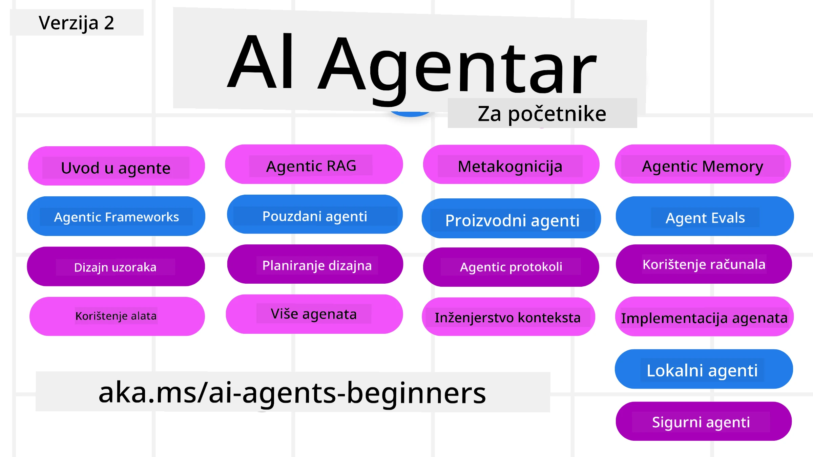

# AI Agenti za početnike - Tečaj



## Tečaj koji podučava sve što trebate znati da započnete izradu AI Agenata

[](https://github.com/microsoft/ai-agents-for-beginners/blob/master/LICENSE?WT.mc_id=academic-105485-koreyst)
[](https://GitHub.com/microsoft/ai-agents-for-beginners/graphs/contributors/?WT.mc_id=academic-105485-koreyst)
[](https://GitHub.com/microsoft/ai-agents-for-beginners/issues/?WT.mc_id=academic-105485-koreyst)
[](https://GitHub.com/microsoft/ai-agents-for-beginners/pulls/?WT.mc_id=academic-105485-koreyst)
[](http://makeapullrequest.com?WT.mc_id=academic-105485-koreyst)

### 🌐 Podrška za više jezika

#### Podržano putem GitHub Action (Automatski i uvijek ažurirano)

<!-- CO-OP TRANSLATOR LANGUAGES TABLE START -->
[Arabic](../ar/README.md) | [Bengali](../bn/README.md) | [Bulgarian](../bg/README.md) | [Burmese (Myanmar)](../my/README.md) | [Chinese (Simplified)](../zh-CN/README.md) | [Chinese (Traditional, Hong Kong)](../zh-HK/README.md) | [Chinese (Traditional, Macau)](../zh-MO/README.md) | [Chinese (Traditional, Taiwan)](../zh-TW/README.md) | [Croatian](./README.md) | [Czech](../cs/README.md) | [Danish](../da/README.md) | [Dutch](../nl/README.md) | [Estonian](../et/README.md) | [Finnish](../fi/README.md) | [French](../fr/README.md) | [German](../de/README.md) | [Greek](../el/README.md) | [Hebrew](../he/README.md) | [Hindi](../hi/README.md) | [Hungarian](../hu/README.md) | [Indonesian](../id/README.md) | [Italian](../it/README.md) | [Japanese](../ja/README.md) | [Kannada](../kn/README.md) | [Khmer](../km/README.md) | [Korean](../ko/README.md) | [Lithuanian](../lt/README.md) | [Malay](../ms/README.md) | [Malayalam](../ml/README.md) | [Marathi](../mr/README.md) | [Nepali](../ne/README.md) | [Nigerian Pidgin](../pcm/README.md) | [Norwegian](../no/README.md) | [Persian (Farsi)](../fa/README.md) | [Polish](../pl/README.md) | [Portuguese (Brazil)](../pt-BR/README.md) | [Portuguese (Portugal)](../pt-PT/README.md) | [Punjabi (Gurmukhi)](../pa/README.md) | [Romanian](../ro/README.md) | [Russian](../ru/README.md) | [Serbian (Cyrillic)](../sr/README.md) | [Slovak](../sk/README.md) | [Slovenian](../sl/README.md) | [Spanish](../es/README.md) | [Swahili](../sw/README.md) | [Swedish](../sv/README.md) | [Tagalog (Filipino)](../tl/README.md) | [Tamil](../ta/README.md) | [Telugu](../te/README.md) | [Thai](../th/README.md) | [Turkish](../tr/README.md) | [Ukrainian](../uk/README.md) | [Urdu](../ur/README.md) | [Vietnamese](../vi/README.md)

> **Preferirate li lokalno klonirati?**
>
> Ovaj repozitorij sadrži prijevode na 50+ jezika što značajno povećava veličinu preuzimanja. Za kloniranje bez prijevoda, koristite sparse checkout:
>
> **Bash / macOS / Linux:**
> ```bash
> git clone --filter=blob:none --sparse https://github.com/microsoft/ai-agents-for-beginners.git
> cd ai-agents-for-beginners
> git sparse-checkout set --no-cone '/*' '!translations' '!translated_images'
> ```
>
> **CMD (Windows):**
> ```cmd
> git clone --filter=blob:none --sparse https://github.com/microsoft/ai-agents-for-beginners.git
> cd ai-agents-for-beginners
> git sparse-checkout set --no-cone "/*" "!translations" "!translated_images"
> ```
>
> Time dobivate sve što vam treba za dovršetak tečaja s mnogo bržim preuzimanjem.
<!-- CO-OP TRANSLATOR LANGUAGES TABLE END -->

**Ako želite podržati dodatne jezike prijevoda, oni su navedeni [ovdje](https://github.com/Azure/co-op-translator/blob/main/getting_started/supported-languages.md).**

[](https://GitHub.com/microsoft/ai-agents-for-beginners/watchers/?WT.mc_id=academic-105485-koreyst)
[](https://GitHub.com/microsoft/ai-agents-for-beginners/network/?WT.mc_id=academic-105485-koreyst)
[](https://GitHub.com/microsoft/ai-agents-for-beginners/stargazers/?WT.mc_id=academic-105485-koreyst)

[](https://discord.gg/nTYy5BXMWG)


## 🌱 Početak

Ovaj tečaj obuhvaća lekcije koje pokrivaju osnove izgradnje AI Agenata. Svaka lekcija pokriva svoju temu, pa započnite gdje god želite!

Za ovaj tečaj postoji podrška za više jezika. Pogledajte naše [dostupne jezike ovdje](#-multi-language-support).

Ako vam je ovo prvi put da radite s Generativnim AI modelima, pogledajte naš tečaj [Generativni AI za početnike](https://aka.ms/genai-beginners), koji uključuje 21 lekciju o izgradnji s GenAI.

Ne zaboravite [označiti (🌟) ovaj repozitorij](https://docs.github.com/en/get-started/exploring-projects-on-github/saving-repositories-with-stars?WT.mc_id=academic-105485-koreyst) i [forkati ovaj repozitorij](https://github.com/microsoft/ai-agents-for-beginners/fork) za pokretanje koda.

### Upoznajte druge učenike, dobijte odgovore na svoja pitanja

Ako zapnete ili imate pitanja o izgradnji AI Agenata, pridružite se našem posebnom Discord kanalu na [Microsoft Foundry Discord](https://aka.ms/ai-agents/discord).

### Što vam treba

Svaka lekcija u ovom tečaju uključuje primjere koda, koji se nalaze u mapi code_samples. Možete [forkati ovaj repozitorij](https://github.com/microsoft/ai-agents-for-beginners/fork) za kreiranje vlastite kopije.

Primjeri koda u ovim vježbama koriste Microsoft Agent Framework s Azure AI Foundry Agent Service V2:

- [Microsoft Foundry](https://aka.ms/ai-agents-beginners/ai-foundry) - Potreban Azure račun

Ovaj tečaj koristi sljedeće AI Agent okvire i usluge iz Microsofta:

- [Microsoft Agent Framework (MAF)](https://aka.ms/ai-agents-beginners/agent-framework)
- [Azure AI Foundry Agent Service V2](https://aka.ms/ai-agents-beginners/ai-agent-service)

Neki primjeri koda također podržavaju alternativne OpenAI-kompatibilne pružatelje poput [MiniMax](https://platform.minimaxi.com/), koji nudi modele s velikim kontekstom (do 204K tokena). Pogledajte [Postavljanje tečaja](./00-course-setup/README.md) za detalje o konfiguraciji.

Za više informacija o pokretanju koda za ovaj tečaj, idite na [Postavljanje tečaja](./00-course-setup/README.md).

## 🙏 Želite pomoći?

Imate li prijedloge ili ste pronašli pravopisne ili kodne pogreške? [Podignite issue](https://github.com/microsoft/ai-agents-for-beginners/issues?WT.mc_id=academic-105485-koreyst) ili [Kreirajte pull request](https://github.com/microsoft/ai-agents-for-beginners/pulls?WT.mc_id=academic-105485-koreyst)


## 📂 Svaka lekcija uključuje

- Pisanu lekciju smještenu u README i kratki video
- Python primjere koda koji koriste Microsoft Agent Framework s Azure AI Foundry
- Poveznice na dodatne resurse za nastavak učenja


## 🗃️ Lekcije

| **Lekcija**                                   | **Tekst i kod**                                    | **Video**                                                  | **Dodatno učenje**                                                                     |
|----------------------------------------------|----------------------------------------------------|------------------------------------------------------------|----------------------------------------------------------------------------------------|
| Uvod u AI Agente i primjene agenata          | [Link](./01-intro-to-ai-agents/README.md)          | [Video](https://youtu.be/3zgm60bXmQk?si=z8QygFvYQv-9WtO1)  | [Link](https://aka.ms/ai-agents-beginners/collection?WT.mc_id=academic-105485-koreyst) |
| Istraživanje AI agentskih okvira             | [Link](./02-explore-agentic-frameworks/README.md)  | [Video](https://youtu.be/ODwF-EZo_O8?si=Vawth4hzVaHv-u0H)  | [Link](https://aka.ms/ai-agents-beginners/collection?WT.mc_id=academic-105485-koreyst) |
| Razumijevanje AI agentskih dizajnerskih uzoraka | [Link](./03-agentic-design-patterns/README.md)     | [Video](https://youtu.be/m9lM8qqoOEA?si=BIzHwzstTPL8o9GF)  | [Link](https://aka.ms/ai-agents-beginners/collection?WT.mc_id=academic-105485-koreyst) |
| Uzorak dizajna korištenja alata              | [Link](./04-tool-use/README.md)                    | [Video](https://youtu.be/vieRiPRx-gI?si=2z6O2Xu2cu_Jz46N)  | [Link](https://aka.ms/ai-agents-beginners/collection?WT.mc_id=academic-105485-koreyst) |
| Agentski RAG                                  | [Link](./05-agentic-rag/README.md)                 | [Video](https://youtu.be/WcjAARvdL7I?si=gKPWsQpKiIlDH9A3)  | [Link](https://aka.ms/ai-agents-beginners/collection?WT.mc_id=academic-105485-koreyst) |
| Izgradnja pouzdanih AI Agenata                | [Link](./06-building-trustworthy-agents/README.md) | [Video](https://youtu.be/iZKkMEGBCUQ?si=jZjpiMnGFOE9L8OK ) | [Link](https://aka.ms/ai-agents-beginners/collection?WT.mc_id=academic-105485-koreyst) |
| Uzorak dizajna planiranja                     | [Link](./07-planning-design/README.md)             | [Video](https://youtu.be/kPfJ2BrBCMY?si=6SC_iv_E5-mzucnC)  | [Link](https://aka.ms/ai-agents-beginners/collection?WT.mc_id=academic-105485-koreyst) |
| Uzorak dizajna s više agenata                  | [Link](./08-multi-agent/README.md)                 | [Video](https://youtu.be/V6HpE9hZEx0?si=rMgDhEu7wXo2uo6g)  | [Link](https://aka.ms/ai-agents-beginners/collection?WT.mc_id=academic-105485-koreyst) |
| Uzorak dizajna metakognicije                 | [Link](./09-metacognition/README.md)               | [Video](https://youtu.be/His9R6gw6Ec?si=8gck6vvdSNCt6OcF)  | [Link](https://aka.ms/ai-agents-beginners/collection?WT.mc_id=academic-105485-koreyst) |
| AI agenti u produkciji                      | [Link](./10-ai-agents-production/README.md)        | [Video](https://youtu.be/l4TP6IyJxmQ?si=31dnhexRo6yLRJDl)  | [Link](https://aka.ms/ai-agents-beginners/collection?WT.mc_id=academic-105485-koreyst) |
| Korištenje agentičkih protokola (MCP, A2A i NLWeb) | [Link](./11-agentic-protocols/README.md)           | [Video](https://youtu.be/X-Dh9R3Opn8)                                 | [Link](https://aka.ms/ai-agents-beginners/collection?WT.mc_id=academic-105485-koreyst) |
| Inženjering konteksta za AI agente            | [Link](./12-context-engineering/README.md)         | [Video](https://youtu.be/F5zqRV7gEag)                                 | [Link](https://aka.ms/ai-agents-beginners/collection?WT.mc_id=academic-105485-koreyst) |
| Upravljanje agentičkom memorijom                      | [Link](./13-agent-memory/README.md)     |      [Video](https://youtu.be/QrYbHesIxpw?si=vZkVwKrQ4ieCcIPx)                                                      |                                                                                        |
| Istraživanje Microsoft Agent Frameworka                         | [Link](./14-microsoft-agent-framework/README.md)                            |                                                            |                                                                                        |
| Izgradnja agenata za korištenje računala (CUA)           | [Link](./15-browser-use/README.md)     |                                                            | [Link](https://docs.browser-use.com/examples/templates/playwright-integration)         |
| Implementacija skalabilnih agenata                    | Uskoro dolazi                            |                                                            |                                                                                        |
| Kreiranje lokalnih AI agenata                     | Uskoro dolazi                               |                                                            |                                                                                        |
| Osiguravanje AI agenata                           | [Link](./18-securing-ai-agents/README.md)  |                                                            | [Link](https://aka.ms/ai-agents-beginners/collection?WT.mc_id=academic-105485-koreyst) |

## 🎒 Ostali tečajevi

Naš tim proizvodi i druge tečajeve! Pogledajte:

<!-- CO-OP TRANSLATOR OTHER COURSES START -->
### LangChain
[](https://aka.ms/langchain4j-for-beginners)
[](https://aka.ms/langchainjs-for-beginners?WT.mc_id=m365-94501-dwahlin)
[](https://github.com/microsoft/langchain-for-beginners?WT.mc_id=m365-94501-dwahlin)
---

### Azure / Edge / MCP / Agenti
[](https://github.com/microsoft/AZD-for-beginners?WT.mc_id=academic-105485-koreyst)
[](https://github.com/microsoft/edgeai-for-beginners?WT.mc_id=academic-105485-koreyst)
[](https://github.com/microsoft/mcp-for-beginners?WT.mc_id=academic-105485-koreyst)
[](https://github.com/microsoft/ai-agents-for-beginners?WT.mc_id=academic-105485-koreyst)

---
 
### Serija Generativni AI
[](https://github.com/microsoft/generative-ai-for-beginners?WT.mc_id=academic-105485-koreyst)
[-9333EA?style=for-the-badge&labelColor=E5E7EB&color=9333EA)](https://github.com/microsoft/Generative-AI-for-beginners-dotnet?WT.mc_id=academic-105485-koreyst)
[-C084FC?style=for-the-badge&labelColor=E5E7EB&color=C084FC)](https://github.com/microsoft/generative-ai-for-beginners-java?WT.mc_id=academic-105485-koreyst)
[-E879F9?style=for-the-badge&labelColor=E5E7EB&color=E879F9)](https://github.com/microsoft/generative-ai-with-javascript?WT.mc_id=academic-105485-koreyst)

---
 
### Temeljno učenje
[](https://aka.ms/ml-beginners?WT.mc_id=academic-105485-koreyst)
[](https://aka.ms/datascience-beginners?WT.mc_id=academic-105485-koreyst)
[](https://aka.ms/ai-beginners?WT.mc_id=academic-105485-koreyst)
[](https://github.com/microsoft/Security-101?WT.mc_id=academic-96948-sayoung)
[](https://aka.ms/webdev-beginners?WT.mc_id=academic-105485-koreyst)
[](https://aka.ms/iot-beginners?WT.mc_id=academic-105485-koreyst)
[](https://github.com/microsoft/xr-development-for-beginners?WT.mc_id=academic-105485-koreyst)

---
 
### Serija Copilot
[](https://aka.ms/GitHubCopilotAI?WT.mc_id=academic-105485-koreyst)
[](https://github.com/microsoft/mastering-github-copilot-for-dotnet-csharp-developers?WT.mc_id=academic-105485-koreyst)
[](https://github.com/microsoft/CopilotAdventures?WT.mc_id=academic-105485-koreyst)
<!-- CO-OP TRANSLATOR OTHER COURSES END -->

## 🌟 Zahvala zajednici

Zahvaljujemo [Shivam Goyal](https://www.linkedin.com/in/shivam2003/) na doprinosu važnih uzoraka koda koji pokazuju Agentic RAG.

## Doprinos

Ovaj projekt pozdravlja doprinose i prijedloge. Većina doprinosa zahtijeva da se složite s
Ugovorom o licenci doprinosa (CLA) kojim izjavljujete da imate pravo i stvarno dajete prava
na korištenje vašeg doprinosa. Za detalje posjetite <https://cla.opensource.microsoft.com>.

Kada pošaljete zahtjev za povlačenje, bot za CLA će automatski utvrditi trebate li dostaviti
CLA i prikazati odgovarajuće oznake (npr. status provjere, komentar). Jednostavno slijedite upute
koje daje bot. To ćete trebati napraviti samo jednom za sve repozitorije koji koriste naš CLA.

Ovaj projekt usvojio je [Microsoft Open Source Code of Conduct](https://opensource.microsoft.com/codeofconduct/).
Za više informacija pogledajte [FAQ kôda ponašanja](https://opensource.microsoft.com/codeofconduct/faq/) ili
kontaktirajte [opencode@microsoft.com](mailto:opencode@microsoft.com) za dodatna pitanja ili komentare.

## Zaštitni znakovi

Ovaj projekt može sadržavati zaštitne znakove ili logotipe za projekte, proizvode ili usluge. Ovlaštena upotreba Microsoftovih
zaštitnih znakova ili logotipa podliježe i mora slijediti
[Microsoftove smjernice za zaštitne znakove i brendove](https://www.microsoft.com/legal/intellectualproperty/trademarks/usage/general).
Korištenje Microsoftovih zaštitnih znakova ili logotipa u izmijenjenim verzijama ovog projekta ne smije uzrokovati zabunu ili implicirati Microsoftovo sponzorstvo.
Svaka upotreba zaštitnih znakova ili logotipa trećih strana podliježe pravilima tih trećih strana.

## Dobivanje pomoći

Ako zapnete ili imate pitanja o izradi AI aplikacija, pridružite se:

[](https://aka.ms/foundry/discord)

Ako imate povratnu informaciju o proizvodu ili greške tijekom izrade posjetite:

[](https://aka.ms/foundry/forum)

---

<!-- CO-OP TRANSLATOR DISCLAIMER START -->
**Napomena**:
Ovaj dokument je preveden korištenjem AI prevoditeljskog servisa [Co-op Translator](https://github.com/Azure/co-op-translator). Iako težimo točnosti, imajte na umu da automatski prijevodi mogu sadržavati greške ili netočnosti. Izvorni dokument na izvornom jeziku treba smatrati autoritativnim izvorom. Za važne informacije preporuča se profesionalni ljudski prijevod. Nismo odgovorni za bilo kakva nesporazumevanja ili pogrešne interpretacije koje proizlaze iz korištenja ovog prijevoda.
<!-- CO-OP TRANSLATOR DISCLAIMER END -->