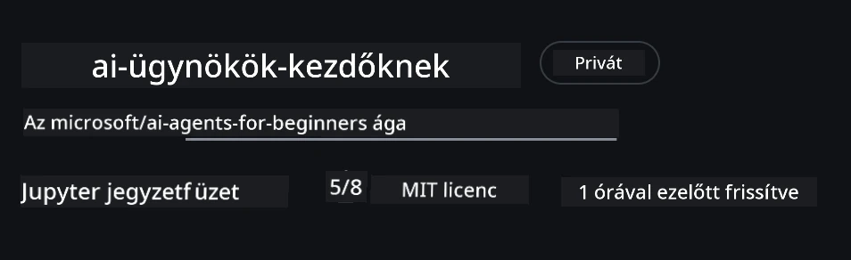
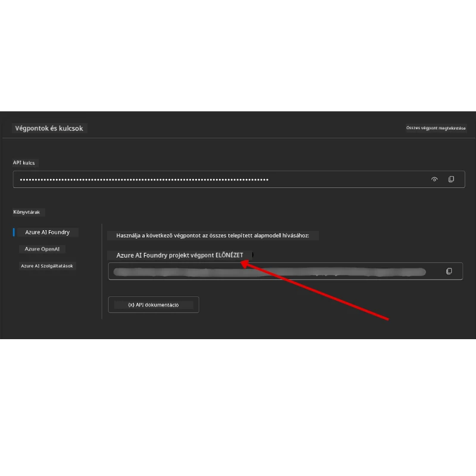

# Tanfolyam Beállítása

## Bevezetés

Ez a lecke lefedi, hogyan futtathatod a tanfolyam kódpéldáit.

## Csatlakozz Más Tanulókhoz és Kapj Segítséget

Mielőtt elkezdenéd klónozni a tárolódat, csatlakozz az [AI Agents For Beginners Discord csatornához](https://aka.ms/ai-agents/discord), hogy segítséget kapj a beállításhoz, a tanfolyammal kapcsolatos kérdéseket tegyél fel, vagy kapcsolatba lépj más tanulókkal.

## Klónozd vagy Forkold ezt a Tárolót

Kezdetként kérjük, klónozd vagy forkold a GitHub Tárolót. Ez létrehozza a saját verziódat a tananyagból, így futtathatod, tesztelheted és módosíthatod a kódot!

Ezt megteheted a <a href="https://github.com/microsoft/ai-agents-for-beginners/fork" target="_blank">repo fork-olására</a> mutató linkre kattintva.

Most már meg kell legyen a saját fork-olt verziód erről a tanfolyamról az alábbi linken:



### Sekély Klón (workshop / Codespaces esetén ajánlott)

  > A teljes tároló nagy lehet (~3 GB), ha teljes történetet és minden fájlt letöltesz. Ha csak a workshopra jelentkezel vagy csak néhány leckefüggvényt szeretnél, egy sekély klón (vagy ritkított klón) sokkal kevesebbet tölt le.

#### Gyors sekély klón — minimális történelem, minden fájl

Cseréld ki `<your-username>`-t a későbbi parancsokban a saját fork URL-edre (vagy az upstream URL-re, ha azt szeretnéd).

Csak az utolsó commit történetet klónozáshoz (kis letöltés):

```bash
git clone --depth 1 https://github.com/<your-username>/ai-agents-for-beginners.git
```

Egy adott ágazat klónozásához:

```bash
git clone --depth 1 --branch <branch-name> https://github.com/<your-username>/ai-agents-for-beginners.git
```

#### Részleges (ritkított) klón — minimális blobok + csak kiválasztott mappák

Ez részleges klónt és sparse-checkout-ot használ (Git 2.25+ szükséges, és ajánlott modern Git részleges klón támogatással):

```bash
git clone --depth 1 --filter=blob:none --sparse https://github.com/<your-username>/ai-agents-for-beginners.git
```

Lépj be a repo mappába:

```bash
cd ai-agents-for-beginners
```

Ezután add meg, mely mappákat szeretnéd (példa alább két mappát mutat):

```bash
git sparse-checkout set 00-course-setup 01-intro-to-ai-agents
```

A klónozás és a fájlok ellenőrzése után, ha csak a fájlokra van szükséged és helyet akarsz felszabadítani (nincs git történet), töröld a tároló metaadatait (💀visszafordíthatatlan — elveszíted az összes Git funkcionalitást):

```bash
# zsh/bash
rm -rf .git
```

```powershell
# PowerShell
Remove-Item -Recurse -Force .git
```

#### GitHub Codespaces használata (ajánlott a helyi nagyméretű letöltések elkerülésére)

- Hozz létre egy új Codespace-ot ehhez a tárolóhoz a [GitHub UI](https://github.com/codespaces) segítségével.  

- Az újonnan létrehozott Codespace termináljában futtasd az egyik sekély/ritkított klón parancsot fentebb, hogy csak a szükséges leckefüggvényeket töltsd be a Codespace munkaterületére.
- Opcionális: a Codespace-ben történő klónozás után töröld a .git mappát, hogy extra hely szabaduljon fel (lásd fent a törlési parancsokat).
- Megjegyzés: Ha inkább megnyitnád a tárolót közvetlenül Codespaces-ben (klónozás nélkül), vedd figyelembe, hogy a Codespace előkészíti a fejlesztői konténer környezetet, és előfordulhat, hogy több erőforrást biztosít, mint amennyire szükséged van.

#### Tippek

- Mindig cseréld le a klón URL-t a saját forkodra, ha szerkeszteni vagy commitolni szeretnél.
- Ha később több történetre vagy fájlra van szükséged, le tudod azokat kérdezni, vagy módosíthatod a sparse-checkout-ot további mappák bevonásához.

## Kód Futtatása

Ez a tanfolyam több Jupyter jegyzetfüzetet kínál, melyeket futtathatsz, hogy gyakorlatban tapasztald meg az AI Agent-ek építését.

A kódpéldák a **Microsoft Agent Framework (MAF)**-t használják a `FoundryChatClient`-tel, amely csatlakozik a **Microsoft Foundry Agent Service V2**-höz (a Responses API-hoz) a **Microsoft Foundry**-n keresztül.

Minden Python jegyzetfüzet `*-python-agent-framework.ipynb` címkével van ellátva.

## Követelmények

- Python 3.12+
  - **MEGJEGYZÉS**: Ha nincs telepítve Python 3.12, biztosítsd, hogy telepíted. Ezután készítsd el a virtuális környezeted python3.12-vel, hogy a requirements.txt fájlból a helyes verziók kerüljenek telepítésre.
  
    >Példa

    Python virtuális környezet mappa létrehozása:

    ```bash
    python -m venv venv
    ```

    Ezután aktiváld a virtuális környezetet:

    ```bash
    # zsh/bash
    source venv/bin/activate
    ```
  
    ```dos
    # Command Prompt for Windows
    venv\Scripts\activate
    ```

- .NET 10+: A .NET-et használó kódmintákhoz telepítsd a [.NET 10 SDK](https://dotnet.microsoft.com/download/dotnet/10.0) vagy újabb verziót. Majd ellenőrizd a telepített .NET SDK verziószámát:

    ```bash
    dotnet --list-sdks
    ```

- **Azure CLI** — Hitelesítéshez szükséges. Telepítsd az [aka.ms/installazurecli](https://aka.ms/installazurecli) oldalról.
- **Azure Előfizetés** — A Microsoft Foundry és Microsoft Foundry Agent Service eléréséhez.
- **Microsoft Foundry Projekt** — Egy projekt egy telepített modellel (pl. `gpt-5-mini`). Lásd az alábbi [1. lépést](#1-lépés-microsoft-foundry-projekt-létrehozása).

Tartalmazunk egy `requirements.txt` fájlt a tároló gyökerében, amely tartalmazza a szükséges Python csomagokat a kódpéldák futtatásához.

Telepítheted ezeket, ha a terminálban a tároló gyökerében futtatod a következő parancsot:

```bash
pip install -r requirements.txt
```

Ajánljuk egy Python virtuális környezet létrehozását a konfliktusok és problémák elkerülése érdekében.

## VSCode Beállítása

Győződj meg róla, hogy a megfelelő Python verziót használod VSCode-ban.


## Microsoft Foundry és Microsoft Foundry Agent Service Beállítása

### 1. lépés: Microsoft Foundry Projekt Létrehozása

Szükséged van egy Microsoft Foundry **centruma** és **projektje** telepített modellel a jegyzetfüzetek futtatásához.

1. Lépj a [ai.azure.com](https://ai.azure.com) oldalra, és jelentkezz be az Azure fiókoddal.
2. Hozz létre egy **centrumot** (vagy használj egy meglévőt). Lásd: [Hub erőforrások áttekintése](https://learn.microsoft.com/azure/ai-foundry/concepts/ai-resources).
3. A centrumban hozz létre egy **projektet**.
4. Telepíts egy modellt (pl. `gpt-5-mini`) a **Modellek + Végpontok** → **Modell telepítése** alatt.

### 2. lépés: A Projekt Végpontja és a Modell Telepítés Neve

A Microsoft Foundry portálon a projekted:

- **Projekt Végpont** — Lépj a **Áttekintés** oldalra, és másold ki a végpont URL-jét.



- **Modell Telepítés Neve** — Lépj a **Modellek + Végpontok** menübe, válaszd ki a telepített modelled, és jegyezd fel a **Telepítés nevét** (pl. `gpt-5-mini`).

### 3. lépés: Jelentkezz be Azure-ba az `az login` segítségével

A jegyzetfüzetek hitelesítése az **Azure CLI bejelentkezésen** keresztül történik — az `AzureCliCredential` vagy `DefaultAzureCredential` (mindkettő használja az `az login` munkamenetet) az `azure-identity` csomagból — így nincs szükség API kulcsokra. Néhány lecke és opcionális integrációk API kulcsokat használnak; minden lecke előfeltételeit nézd meg a további környezeti változókért. Ehhez be kell jelentkezned az Azure CLI segítségével.

1. **Telepítsd az Azure CLI-t**, ha még nincs meg: [aka.ms/installazurecli](https://aka.ms/installazurecli)

2. **Jelentkezz be** a következő futtatásával:

    ```bash
    az login
    ```

    Vagy ha távoli/Codespace környezetben vagy böngésző nélkül:

    ```bash
    az login --use-device-code
    ```

3. **Válaszd ki az előfizetésed**, ha kéri — válaszd azt, amelyik tartalmazza a Foundry projektedet.

4. **Ellenőrizd**, hogy be vagy-e jelentkezve:

    ```bash
    az account show
    ```

> **Miért kell az `az login`?** A jegyzetfüzetek az `AzureCliCredential` (vagy `DefaultAzureCredential`, amely szintén használja az Azure CLI bejelentkezést) hitelesítést alkalmazzák az `azure-identity` csomagból. Ez azt jelenti, hogy az Azure CLI munkameneted biztosítja a hitelesítést — nem kell API kulcsokat vagy titkos kulcsokat tárolni a `.env` fájlban. Ez egy [biztonsági legjobb gyakorlat](https://learn.microsoft.com/azure/developer/ai/keyless-connections).

### 4. lépés: Hozd létre a `.env` fájlodat

Másold az példafájlt:

```bash
# zsh/bash
cp .env.example .env
```

```powershell
# PowerShell
Copy-Item .env.example .env
```

Nyisd meg a `.env`-t, és töltsd ki ezt a két értéket:

```env
AZURE_AI_PROJECT_ENDPOINT=https://<your-project>.services.ai.azure.com/api/projects/<your-project-id>
AZURE_AI_MODEL_DEPLOYMENT_NAME=gpt-5-mini
```

| Változó | Hol található |
|----------|-----------------|
| `AZURE_AI_PROJECT_ENDPOINT` | Foundry portál → a projekt → **Áttekintés** oldal |
| `AZURE_AI_MODEL_DEPLOYMENT_NAME` | Foundry portál → **Modellek + Végpontok** → a telepített modell neve |

Ez minden a legtöbb leckéhez! A jegyzetfüzetek automatikusan hitelesítenek az `az login` munkameneten keresztül.

### 5. lépés: Telepítsd a Python függőségeket

```bash
pip install -r requirements.txt
```

Ajánlott ezt a korábban létrehozott virtuális környezetben futtatni.

## Opcionális Beállítás: Azure AI Keresés (5. és 16. lecke)

Az 5. (Agentic RAG) és a 16. lecke jegyzetfüzetei „dobozból” futnak egy **memórián belüli tudásbázissal** — nincs szükség extra Azure erőforrásra. Ha szeretnéd valós **Azure AI Keresés** index mögé rakni őket, vedd figyelembe, hogy a **16. lecke jegyzetfüzete jelenleg kulcsalapú hitelesítést használ**: memórián belüli keresésről Azure AI Keresésre vált csak akkor, ha **mindkettő** `AZURE_SEARCH_SERVICE_ENDPOINT` **és** `AZURE_SEARCH_API_KEY` be van állítva, különben memórián belüli keresés marad — tehát valódi indexhez a rendszergazdai kulcs is szükséges. A kulcs nélküli hitelesítés Microsoft Entra ID-vel (RBAC) ajánlott saját termelési kódodhoz, összhangban az egész tanfolyam `az login` folyamatával.

Az alábbi RBAC lépések a beállítási útmutató mintáinál és a saját kódnál alkalmazhatók. Nem engedélyezik a kulcs nélküli hitelesítést a 16. lecke jegyzetfüzetében; ott továbbra is szükség van a végpontra és az admin kulcsra az Azure AI Keresés használatához.

1. **Engedélyezd a szerepalapú hozzáférést** a keresési szolgáltatásodon:

    ```bash
    az search service update --name <service-name> --resource-group <resource-group> --auth-options aadOrApiKey
    ```

2. **Add meg magadnak a szükséges szerepeket** (indexek létrehozása/betöltése és lekérdezés):

    ```bash
    az role assignment create --assignee <your-user-or-principal-id> --role "Search Service Contributor" --scope $(az search service show -g <resource-group> -n <service-name> --query id -o tsv)
    az role assignment create --assignee <your-user-or-principal-id> --role "Search Index Data Contributor" --scope $(az search service show -g <resource-group> -n <service-name> --query id -o tsv)
    ```

3. **Add hozzá a végpontot** a `.env` fájlhoz:

| Változó | Hol található |
|----------|-----------------|
| `AZURE_SEARCH_SERVICE_ENDPOINT` | Azure portál → a **Azure AI Search** erőforrás → **Áttekintés** → URL |
| `AZURE_SEARCH_API_KEY` | Szükséges (a végponttal együtt) a 16. lecke jegyzetfüzetében az Azure AI Search engedélyezéséhez, ami kulcsalapú hitelesítést használ. Azure portál → **Beállítások** → **Kulcsok** → elsődleges admin kulcs |

> **Miért kulcs nélküli?** Az admin kulcsok teljes írási hozzáférést biztosítanak a keresési szolgáltatáshoz, és kikerülhetnek `.env` fájlokon keresztül. RBAC esetén az `az login` által azonosított személyazonosságot használják — ugyanazt a kulcs nélküli Entra ID mintát, amit a tanfolyam jegyzetfüzetei is használnak (az `AzureCliCredential` / `DefaultAzureCredential` útján). Lásd: [Kapcsolódás Azure AI Search-hez szerepek használatával](https://learn.microsoft.com/azure/search/search-security-rbac).

Nézd meg az [Azure AI Search beállítási útmutatót](./AzureSearch.md) a teljes index létrehozási példákért Pythonban és .NET-ben.

## További Beállítás azokra a Leckékre, amelyek Közvetlenül Azure OpenAI-t Hívnak (6. és 8. lecke)

Egyes 6-os és 8-as lecke jegyzetfüzetek közvetlenül az **Azure OpenAI**-t hívják (a **Responses API** használatával), nem a Microsoft Foundry projekten keresztül. Ezek a példák korábban GitHub Modelleket használtak, amelyek elavultak és nem támogatják a Responses API-t. Add hozzá ezeket a változókat a `.env` fájlodhoz:

| Változó | Hol található |
|----------|-----------------|
| `AZURE_OPENAI_ENDPOINT` | Azure portál → az **Azure OpenAI** erőforrás → **Kulcsok és Végpont** → Végpont (pl. `https://<your-resource>.openai.azure.com`) |
| `AZURE_OPENAI_DEPLOYMENT` | A telepített modell neve (pl. `gpt-5-mini`), amely támogatja a Responses API-t |
| `AZURE_OPENAI_API_KEY` | Opcionális — csak ha kulcsalapú hitelesítést használsz az `az login` / Entra ID helyett |

> A Responses API a stabil `/openai/v1/` végpontot használja, így nem kell `api-version`. Jelentkezz be az `az login` segítségével a kulcs nélküli Entra ID hitelesítéshez.

## Alternatív Szolgáltató: MiniMax (OpenAI-kompatibilis)

A [MiniMax](https://platform.minimaxi.com/) nagy kontextusú modelleket kínál (akár 204K token) egy OpenAI-kompatibilis API-n keresztül. Mivel a Microsoft Agent Framework `OpenAIChatClient`-je bármilyen OpenAI-kompatibilis végponttal működik, a MiniMax kiváló helyettesítő lehet azoknak a leckéknek, amelyek az `OpenAIChatClient`-et használják.

Add hozzá ezeket a változókat a `.env` fájlodhoz:

| Változó | Hol található |
|----------|-----------------|
| `MINIMAX_API_KEY` | [MiniMax Platform](https://platform.minimaxi.com/) → API kulcsok |
| `MINIMAX_BASE_URL` | Használd a `https://api.minimax.io/v1` (alapértelmezett érték) |
| `MINIMAX_MODEL_ID` | Használandó modell neve (pl. `MiniMax-M3`) |

**Példa modellek**: `MiniMax-M3` (ajánlott), `MiniMax-M2.7`, `MiniMax-M2.7-highspeed` (gyorsabb válaszok). A modellek nevei és elérhetősége idővel változhat, és a hozzáférés fiókfüggő lehet.

Az `OpenAIChatClient`-et használó kódminták (pl. a 14. lecke szállodafoglalási munkafolyamata) automatikusan felismerik és alkalmazzák a MiniMax konfigurációt, ha be van állítva a `MINIMAX_API_KEY`.


## Alternatív szolgáltató: Foundry Local (Futtass modelleket helyben)

A [Foundry Local](https://foundrylocal.ai) egy könnyű futtatókörnyezet, amely letölti, kezeli és szolgáltatja a nyelvi modelleket **teljes egészében a saját gépeden** egy OpenAI-kompatibilis API-n keresztül — felhő nélkül.

Mivel a Microsoft Agent Framework `OpenAIChatClient`-je bármilyen OpenAI-kompatibilis végponttal működik, a Foundry Local helyi alternatívaként használható az Azure OpenAI helyett.

**1. Telepítsd a Foundry Local-t**

```bash
# Windows
winget install Microsoft.FoundryLocal

# macOS
brew install foundrylocal
```

**2. Tölts le és futtass egy modellt** (ez elindítja a helyi szolgáltatást is):

```bash
foundry model list          # elérhető modellek megtekintése
foundry model run phi-4-mini
```

**3. Telepítsd a Python SDK-t** a helyi végpont felfedezéséhez:

```bash
pip install foundry-local-sdk
```

**4. Állítsd be a Microsoft Agent Frameworköt a helyi modelledhez:**

```python
from foundry_local import FoundryLocalManager
from agent_framework.openai import OpenAIChatClient

# Letölti (ha szükséges) és helyileg szolgálja ki a modellt, majd felfedezi a végpontot/portot.
manager = FoundryLocalManager("phi-4-mini")

chat_client = OpenAIChatClient(
    base_url=manager.endpoint,      # pl. http://localhost:<port>/v1
    api_key=manager.api_key,        # mindig "not-required" a Foundry Local esetén
    model_id=manager.get_model_info("phi-4-mini").id,
)

agent = chat_client.as_agent(
    name="LocalAgent",
    instructions="You are a helpful assistant running fully on-device.",
)
```

> **Megjegyzés:** A Foundry Local egy OpenAI-kompatibilis **Chat Completions** végpontot tesz elérhetővé. Használd helyi fejlesztéshez és offline helyzetekhez. A teljes **Responses API** funkciókészlethez (állapotkezeléses beszélgetések stb.) használd az Azure OpenAI-t vagy egy Microsoft Foundry projektet.

## További beállítás a 8. leckéhez (Bing Grounding munkafolyamat)

A 8. leckében szereplő feltételes munkafolyamat notebook a Microsoft Foundry-n keresztüli **Bing grounding**-et használ. Ha azt a mintapéldát futtatod, add hozzá ezt a változót a `.env` fájlodhoz:

| Változó | Hol találod meg |
|----------|-----------------|
| `BING_CONNECTION_ID` | Microsoft Foundry portál → a projekted → **Management** → **Connected resources** → a Bing kapcsolódásod → másold ki a kapcsolat azonosítóját |

## Hibakeresés

### SSL tanúsítvány ellenőrzési hibák macOS-en

Ha macOS-t használsz és olyan hibaüzenettel találkozol, mint:

```plaintext
ssl.SSLCertVerificationError: [SSL: CERTIFICATE_VERIFY_FAILED] certificate verify failed: self-signed certificate in certificate chain
```

Ez egy ismert probléma a macOS Python verziójánál, ahol a rendszer SSL tanúsítványai nincsenek automatikusan megbízhatónak minősítve. Próbáld ki a következő megoldásokat sorrendben:

**1. lehetőség: Futtasd a Python Install Certificates szkriptjét (ajánlott)**

```bash
# Cseréld ki a 3.XX-et a telepített Python verzióra (pl. 3.12 vagy 3.13):
/Applications/Python\ 3.XX/Install\ Certificates.command
```

**2. lehetőség: Használd a `connection_verify=False` opciót a notebookodban (csak GitHub Models notebookokhoz)**

A 6. lecke notebookjában (`06-building-trustworthy-agents/code_samples/06-system-message-framework.ipynb`) már megtalálható egy kikommentelt megoldás. Szedd ki a kommentelést `connection_verify=False`-nál, ha tanúsítványhibákkal találkozol:

```python
client = ChatCompletionsClient(
    endpoint=endpoint,
    credential=AzureKeyCredential(token),
    connection_verify=False,  # A SSL ellenőrzés kikapcsolása, ha tanúsítványhibákat tapasztal
)
```

> **⚠️ Figyelmeztetés:** Az SSL ellenőrzés kikapcsolása (`connection_verify=False`) csökkenti a biztonságot, mivel kihagyja a tanúsítvány ellenőrzését. Csak ideiglenes megoldásként használd fejlesztési környezetekben. Soha ne használd éles környezetben.

**3. lehetőség: Telepítsd és használd a `truststore`-t**

```bash
pip install truststore
```

Ezután add hozzá a következőt a notebook vagy szkript tetejére, mielőtt bármilyen hálózati hívást indítanál:

```python
import truststore
truststore.inject_into_ssl()
```

## Elakadtál valahol?

Ha problémád van a beállítással, csatlakozz az <a href="https://discord.gg/kzRShWzttr" target="_blank">Azure AI közösség Discord szerveréhez</a>, vagy <a href="https://github.com/microsoft/ai-agents-for-beginners/issues?WT.mc_id=academic-105485-koreyst" target="_blank">nyiss egy hibajegyet</a>.

## Következő lecke

Most már készen állsz arra, hogy futtasd a tanfolyam kódját. Jó tanulást az AI ügynökök világában! 

[Bevezetés az AI ügynökökbe és használati esetek](../01-intro-to-ai-agents/README.md)

---

<!-- CO-OP TRANSLATOR DISCLAIMER START -->
**Jogi nyilatkozat**:
Ez a dokumentum az AI fordítási szolgáltatás, a [Co-op Translator](https://github.com/Azure/co-op-translator) segítségével készült. Bár az pontosságra törekszünk, kérjük, vegye figyelembe, hogy az automatikus fordítások hibákat vagy pontatlanságokat tartalmazhatnak. Az eredeti dokumentum az anyanyelvén tekintendő hiteles forrásnak. Fontos információk esetén professzionális emberi fordítást javasolunk. Nem vállalunk felelősséget semmilyen félreértésért vagy téves értelmezésért, amely ebből a fordításból ered.
<!-- CO-OP TRANSLATOR DISCLAIMER END -->