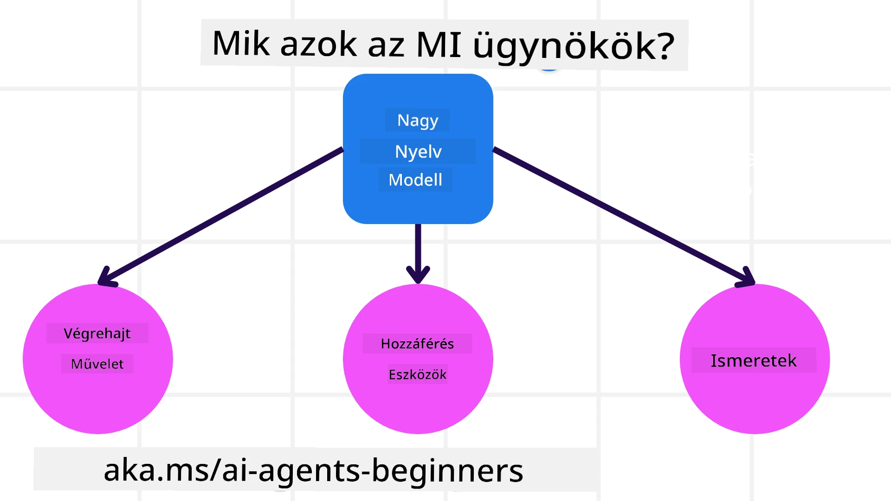
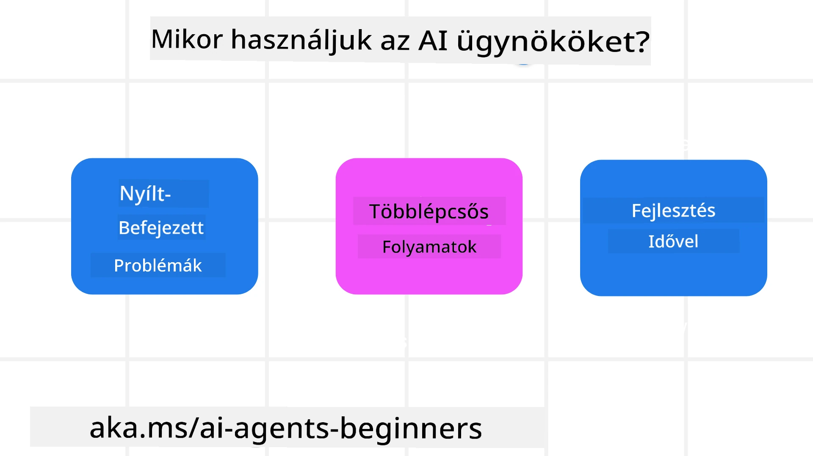

> _(Kattintson a fenti képre, hogy megtekinthesse a lecke videóját)_

# Bevezetés az AI ügynökökbe és az ügynökök felhasználási eseteibe

Üdvözöljük az „AI ügynökök kezdőknek” tanfolyamon! Ez a tanfolyam alapvető ismereteket és gyakorlati példákat nyújt az AI ügynökök építéséhez.

Csatlakozzon az <a href="https://discord.gg/kzRShWzttr" target="_blank">Azure AI Discord közösséghez</a>, hogy találkozzon más tanulókkal és AI ügynöképítőkkel, és kérdezzen bármit a tanfolyammal kapcsolatban.

A tanfolyam megkezdéséhez először jobban megértjük, mik azok az AI ügynökök, és hogyan használhatjuk őket az általunk épített alkalmazásokban és munkafolyamatokban.

## Bevezető

Ez a lecke a következőket tartalmazza:

- Mik azok az AI ügynökök és milyen típusai vannak az ügynököknek?
- Milyen felhasználási esetek a legalkalmasabbak AI ügynökök számára, és hogyan segíthetnek nekünk?
- Milyen alapvető építőkövei vannak az ügynökközpontú megoldások tervezésének?

## Tanulási célok
A lecke elvégzése után képes leszel:

- Megérteni az AI ügynökök koncepcióit és azt, hogyan különböznek más AI megoldásoktól.
- Hatékonyan használni az AI ügynököket.
- Produktívan tervezni ügynökközpontú megoldásokat felhasználók és ügyfelek számára.

## Az AI ügynökök meghatározása és típusai

### Mik azok az AI ügynökök?

Az AI ügynökök olyan **rendszerek**, amelyek lehetővé teszik a **nagy nyelvi modellek (LLM-ek)** számára, hogy **műveleteket hajtsanak végre** azzal, hogy kiterjesztik képességeiket, és az LLM-eknek **hozzáférést biztosítanak eszközökhöz** és **tudáshoz**.

Bontsuk le ezt a meghatározást kisebb részekre:

- **Rendszer** - Fontos úgy gondolni az ügynökökre, mint egyetlen elemek helyett egy sok összetevőből álló rendszerre. Alapvető szinten egy AI ügynök összetevői:
  - **Környezet** - Az a meghatározott terület, ahol az AI ügynök működik. Például, ha van egy utazási foglalási AI ügynökünk, akkor a környezet lehet maga az utazási foglalási rendszer, amelyet az AI ügynök feladatainak végrehajtására használ.
  - **Érzékelők** - A környezet rendelkezik információval és visszacsatolást nyújt. Az AI ügynökök érzékelőket használnak ezeknek az információknak a gyűjtésére és értelmezésére a környezet aktuális állapotáról. Az utazási foglalási ügynök példájában az utazási rendszer információkat szolgáltathat, mint például a szállodai elérhetőség vagy a repülőjegy árak.
  - **Aktorok** - Miután az AI ügynök megkapja a környezet aktuális állapotát, az adott feladathoz meghatározza, hogy milyen műveletet hajtson végre a környezet megváltoztatásához. Az utazási foglalási ügynök esetében például lefoglalhat egy elérhető szobát a felhasználónak.

**Nagy nyelvi modellek** – Az ügynökök koncepciója már az LLM-ek megjelenése előtt is létezett. Az AI ügynökök LLM-ekkel történő építésének előnye emberi nyelv és adat értelmezési képességük. Ez a képesség lehetővé teszi az LLM-ek számára, hogy értelmezzék a környezeti információkat és meghatározzanak egy tervet a környezet megváltoztatására.

**Műveletek végrehajtása** – Az AI ügynök rendszereken kívül az LLM-ek korlátozottak olyan helyzetekre, amikor a művelet tartalom vagy információ generálása egy felhasználói kérés alapján. Az AI ügynök rendszerekben az LLM-ek képesek feladatok elvégzésére azáltal, hogy értelmezik a felhasználó kérését, és használják azokat az eszközöket, amelyek elérhetők a környezetükben.

**Hozzáférés eszközökhöz** – Az, hogy az LLM milyen eszközökhöz fér hozzá, attól függ 1) a környezettől, amelyben működik, és 2) az AI ügynök fejlesztőjétől. Az utazási ügynök példájában az eszközök korlátozottak a foglalási rendszer által engedélyezett műveletekre, és/vagy a fejlesztő korlátozhatja az ügynök eszközhozzáférését például csak repülőjáratokra.

**Memória és tudás** – A memória lehet rövid távú, például a felhasználó és az ügynök közötti beszélgetés kontextusában. Hosszú távon, a környezet által biztosított információkon kívül az AI ügynökök tudást is lekérdezhetnek más rendszerekből, szolgáltatásokból, eszközökből és akár más ügynököktől is. Az utazási ügynök példa esetén ez lehet az ügyfél adatbázisban tárolt utazási preferenciák adatai.

### Az ügynökök különböző típusai

Most, hogy van egy általános definíciónk az AI ügynökökről, nézzünk meg néhány konkrét ügynök típust, és hogyan alkalmazhatók egy utazási foglalási AI ügynöknél.

| **Ügynök típusa**            | **Leírás**                                                                                                                           | **Példa**                                                                                                                                                                                                                   |
| ----------------------------- | ----------------------------------------------------------------------------------------------------------------------------------- | --------------------------------------------------------------------------------------------------------------------------------------------------------------------------------------------------------------------------- |
| **Egyszerű reflex ügynökök**  | Előre definiált szabályok alapján azonnali műveleteket hajtanak végre.                                                              | Az utazási ügynök értelmezi az e-mail kontextusát és továbbítja az utazási panaszokat az ügyfélszolgálathoz.                                                                                                                  |
| **Modellel működő reflex ügynökök** | Műveleteket hajtanak végre a világ modellje és a modell változásai alapján.                                                         | Az utazási ügynök a jelentős árváltozások alapján előnyben részesíti az útvonalakat a történelmi áradatok hozzáférésének segítségével.                                                                                        |
| **Célorientált ügynökök**     | Terveket készítenek konkrét célok elérésére a cél értelmezésével és a szükséges műveletek meghatározásával.                          | Az utazási ügynök lefoglal egy utazást azzal, hogy meghatározza a szükséges utazási intézkedéseket (autó, tömegközlekedés, járatok) az aktuális helyszíntől a célállomásig.                                                     |
| **Haszon-orientált ügynökök** | Számításba veszik a preferenciákat és numerikusan mérlegelik az előnyöket, hogy meghatározzák, hogyan érjék el a célokat.            | Az utazási ügynök maximalizálja a hasznosságot úgy, hogy mérlegeli a kényelmet és a költséget az utazás foglalásánál.                                                                                                        |
| **Tanuló ügynökök**           | Idővel fejlődnek azáltal, hogy visszacsatolásra reagálnak és ehhez igazítják a tevékenységüket.                                      | Az utazási ügynök javul azáltal, hogy felhasználja az utazás utáni felmérésekből származó ügyfél-visszajelzéseket a jövőbeni foglalások módosításához.                                                                       |
| **Hierarchikus ügynökök**     | Többszintű ügynökök rendszere, ahol a magasabb szintű ügynökök feladatokat bontanak le alfeladatokra, amelyeket az alsóbb szintű ügynökök végeznek el. | Az utazási ügynök egy utazás lemondását úgy végzi, hogy a feladatot alfeladatokra osztja (például egyes foglalások lemondására), és az alsóbb szintű ügynökök hajtják végre, visszajelzést adva a felsőbb szintű ügynöknek.          |
| **Többügynökös rendszerek (MAS)** | Az ügynökök önállóan látják el feladataikat, együttműködve vagy versengve.                                                           | Együttműködő: Több ügynök különböző utazási szolgáltatásokat foglal le, mint szállodák, repülőjáratok és szórakozás. Versengő: Több ügynök kezeli és verseng egy közös szállodai foglalási naptárért, hogy lefoglalják az ügyfeleknek a szállodát. |

## Mikor használjunk AI ügynököket?

Az előző részben az utazási ügynök felhasználási esetét használtuk, hogy bemutassuk, hogyan használhatók az ügynökök különböző típusai az utazás foglalási különböző forgatókönyveiben. A tanfolyam során továbbra is ezt az alkalmazást fogjuk használni.

Nézzük meg, milyen típusú felhasználási esetekhez a legalkalmasabbak az AI ügynökök:

- **Nyitott végű problémák** – amikor az LLM-nek kell meghatároznia a szükséges lépéseket egy feladat elvégzéséhez, mert az nem mindig kódolható be előre egy munkafolyamatba.
- **Többlépcsős folyamatok** – olyan feladatok, amelyek komplexitásuk miatt az AI ügynöknek több alkalommal kell eszközöket vagy információkat használnia egyetlen lekérdezés helyett.
- **Idővel történő fejlődés** – olyan feladatok, ahol az ügynök jobb eredményeket érhet el azáltal, hogy visszacsatolást kap a környezettől vagy felhasználóktól, és ezáltal jobb hasznosságot képes nyújtani.

Az AI ügynökök használatának további szempontjait a Megbízható AI ügynökök építése leckében tárgyaljuk.

## Az ügynökközpontú megoldások alapjai

### Ügynök fejlesztés

Az AI ügynökrendszer tervezésének első lépése az eszközök, műveletek és viselkedések meghatározása. Ebben a tanfolyamban az **Azure AI Agent Service** használatára koncentrálunk ügynökeink definiálásához. Ez olyan funkciókat kínál, mint:

- Nyílt modellek kiválasztása, például OpenAI, Mistral és Llama
- Licencelt adatok használata szolgáltatóktól, például Tripadvisor
- Standardizált OpenAPI 3.0 eszközök használata

### Ügynökminták

A kommunikáció az LLM-ekkel promptokon keresztül történik. Az AI ügynökök félig autonóm jellege miatt nem mindig lehetséges vagy szükséges manuálisan újrapromptolni az LLM-et a környezet változása után. Olyan **ügynökmintákat** használunk, melyek lehetővé teszik az LLM több lépésen át történő skálázható promptolását.

A tanfolyamot jelenleg népszerű ügynökmintákra bontottuk.

### Ügynök keretrendszerek

Az ügynök keretrendszerek lehetővé teszik a fejlesztők számára, hogy kódon keresztül valósítsák meg az ügynökmintákat. Ezek a keretrendszerek sablonokat, bővítményeket és eszközöket kínálnak a jobb AI ügynök együttműködéshez. Ezek az előnyök jobb megfigyelhetőséget és hibakeresést biztosítanak az AI ügynök rendszerek számára.

Ebben a tanfolyamban a Microsoft Agent Framework (MAF) használatát vizsgáljuk meg a termelésre kész AI ügynökök építéséhez.

## Minta kódok

- Python: [Agent Framework](./code_samples/01-python-agent-framework.ipynb)
- .NET: [Agent Framework](./code_samples/01-dotnet-agent-framework.md)

## Van még kérdése az AI ügynökökkel kapcsolatban?

Csatlakozzon a [Microsoft Foundry Discord](https://aka.ms/ai-agents/discord) közösséghez, hogy találkozzon más tanulókkal, részt vegyen konzultációkon, és választ kapjon AI ügynöki kérdéseire.

## Előző lecke

[Tanfolyam beállítása](../00-course-setup/README.md)

## Következő lecke

[Ügynök keretrendszerek felfedezése](../02-explore-agentic-frameworks/README.md)

---

<!-- CO-OP TRANSLATOR DISCLAIMER START -->
**Jogi nyilatkozat**:
Ezt a dokumentumot az AI fordítási szolgáltatás, a [Co-op Translator](https://github.com/Azure/co-op-translator) segítségével fordítottuk le. Bár az eredmény pontosságára törekszünk, kérjük, vegye figyelembe, hogy az automatikus fordítások hibákat vagy pontatlanságokat tartalmazhatnak. Az eredeti, anyanyelvi dokumentum tekintendő a hiteles forrásnak. Kritikus információk esetén profi, emberi fordítást javaslunk. Nem vállalunk felelősséget az ebből a fordításból eredő félreértésekért vagy félreértelmezésekért.
<!-- CO-OP TRANSLATOR DISCLAIMER END -->