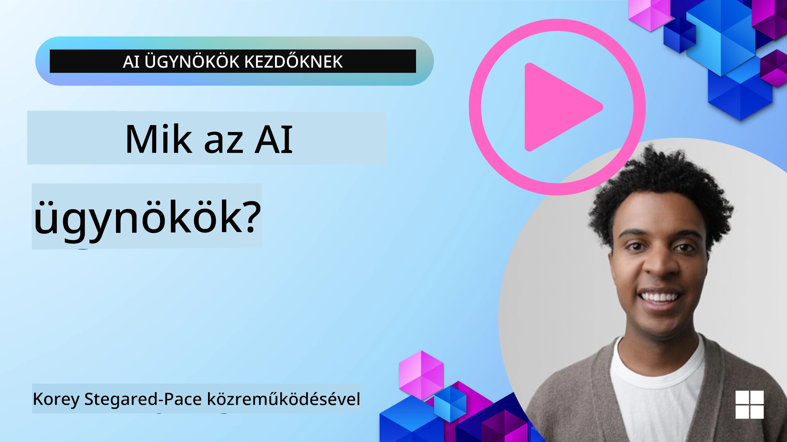
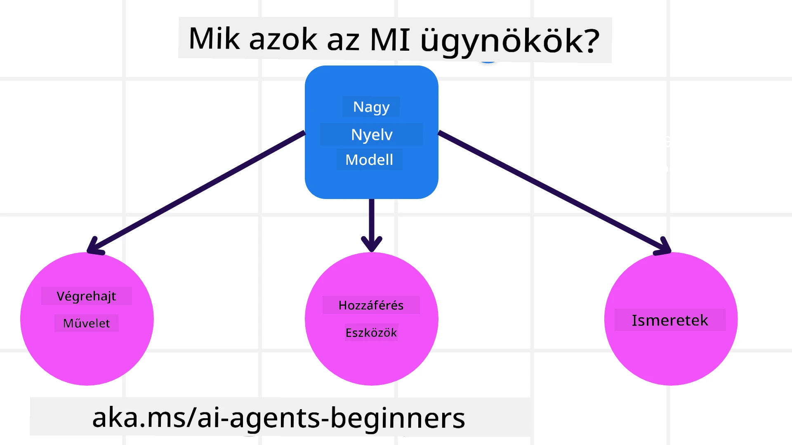
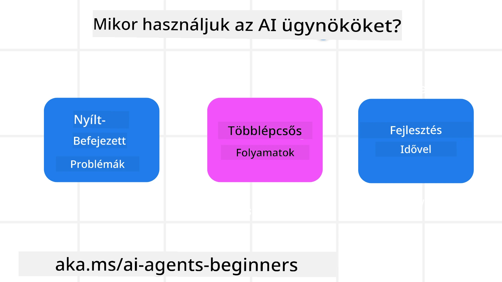

> _(Kattints a fenti képre, hogy megnézd a lecke videóját)_

# Bevezetés az AI Ügynökökbe és a használati esetekbe

Üdvözlünk az **AI Ügynökök Kezdőknek** tanfolyamon! Ez a tanfolyam az alapvető tudást — és valódi működő kódot — adja meg, hogy az elejétől fogva elkezdhess AI Ügynököket építeni.

Gyere, üdvözölj minket a <a href="https://discord.gg/kzRShWzttr" target="_blank">Azure AI Discord Közösségben</a> — tele van tanulókkal és AI fejlesztőkkel, akik szívesen válaszolnak a kérdésekre.

Mielőtt belevágnánk az építésbe, győződjünk meg róla, hogy valóban értjük, mi is az az AI Ügynök, és mikor érdemes használni.

---

## Bevezetés

Ez a lecke a következőket tárgyalja:

- Mi az AI Ügynök, és milyen különféle típusai léteznek
- Milyen feladatokra a legalkalmasabbak az AI Ügynökök
- Az alapvető építőelemek, amelyeket használni fogsz egy Ügynöki megoldás tervezésekor

## Tanulási célok

A lecke végére képesnek kell lenned arra, hogy:

- Elmagyarázd, mi az az AI Ügynök, és miben különbözik a hagyományos AI megoldásoktól
- Tudjad, mikor érdemes AI Ügynököt használni (és mikor nem)
- Vázolj fel egy alapvető Ügynöki megoldástervezést egy valós problémára

---

## AI Ügynökök meghatározása és típusai

### Mik azok az AI Ügynökök?

Íme egy egyszerű mód a megértésükre:

> **Az AI Ügynökök olyan rendszerek, amelyek lehetővé teszik a Nagy Nyelvi Modellek (LLM-ek) számára, hogy valóban *cselekedjenek* — eszközöket és tudást kapva, hogy a világban tevékenykedjenek, nem csak válaszoljanak parancsokra.**

Fejtsük ki egy kicsit:

- **Rendszer** — Egy AI Ügynök nem csak egyetlen dolog. Ez egy részekből álló összefüggő rendszer. Minden ügynöknek három alapeleme van:
  - **Környezet** — Az a tér, ahol az ügynök dolgozik. Egy utazási foglalási ügynök esetében ez maga a foglalási platform.
  - **Szenzorok** — Hogyan olvassa az ügynök a környezet aktuális állapotát. Utazási ügynökünk megnézheti a szállodai foglaltságot vagy a repülőjegy árakat.
  - **Aktuátorok** — Hogyan hajt végre az ügynök műveleteket. Az utazási ügynök lefoglalhat egy szobát, küldhet megerősítést vagy törölhet egy foglalást.

- **Nagy Nyelvi Modellek (LLM-ek)** — Ügynökök már LLM-ek előtt is léteztek, de az LLM-ek teszik a modern ügynököket olyan erőteljessé. Megértik a természetes nyelvet, képesek kontextusról érvelni, és egy homályos felhasználói kérésből konkrét cselekvési tervet készítenek.

- **Végrehajtanak Műveleteket** — Ügynök rendszer nélkül az LLM csak szöveget generál. Ügynök rendszerben az LLM képes *végrehajtani* lépéseket — adatbázisban keresni, API-t hívni, üzenetet küldeni.

- **Hozzáférés Eszközökhöz** — Az, hogy milyen eszközöket használhat az ügynök, attól függ (1) a környezettől, amelyben fut, és (2) attól, mit ad neki a fejlesztő. Egy utazási ügynök például kereshet repülőjáratokat, de nem szerkesztheti az ügyféladatokat — attól függ, mit kötöttél össze.

- **Memória + Tudás** — Az ügynökök lehetnek rövid távú memóriával (a jelenlegi beszélgetés), és hosszú távú memóriával (egy ügyféladatbázis, korábbi interakciók). Az utazási ügynök „emlékezhet” arra, hogy ablak melletti ülést szeretsz.

---

### Az AI Ügynökök különféle típusai

Nem minden ügynök épül ugyanúgy. Íme a főbb típusok bontása, egy utazási foglalási ügynök példáján keresztül:

| **Ügynök Típusa** | **Mit csinál** | **Utazási Ügynök Példa** |
|---|---|---|
| **Egyszerű Reflex Ügynökök** | Kőbevésett szabályokat követnek — nincs memória, nincs tervezés. | Lát egy panasz e-mailt → továbbítja az ügyfélszolgálatra. Ennyi. |
| **Modell-alapú Reflex Ügynökök** | Belső modellt tartanak a világról, amit frissítenek, ha változik valami. | Követi a történelmi repülőjegy árakat, jelzi, ha egy útvonal hirtelen drágul. |
| **Cél-alapú Ügynökök** | Van egy cél a fejében, és lépésről lépésre kitalálja, hogyan érje el. | Lefoglal egy teljes utat (repülő, autó, szállás) a jelenlegi helyzetedből a célállomásodra. |
| **Haszon-alapú Ügynökök** | Nem csak *egy* megoldást talál — a *legjobbat* találja meg mérlegelve a kompromisszumokat. | Kiegyensúlyozza a költséget és a kényelmet, hogy megtalálja a számodra legmegfelelőbb utat. |
| **Tanuló Ügynökök** | Idővel fejlődik visszacsatolás alapján. | A jövőbeli foglalási ajánlásokat az utazás utáni kérdőív eredményei alapján módosítja. |
| **Hierarchikus Ügynökök** | Egy felső szintű ügynök lebontja a munkát részfeladatokra, és alacsonyabb szintű ügynököknek adja át. | Egy „út törlése” kérés szétosztódik: járattörlés, szállástörlés, autókölcsönzés törlés — mindegyik egy alügynök feladata. |
| **Több Ügynök Rendszerek (MAS)** | Több független ügynök dolgozik együtt (vagy verseng). | Együttműködő: külön ügynök kezeli a szállodákat, a járatokat és a szórakozást. Versengő: több ügynök verseng, hogy a legjobb áron töltsenek fel szállodai szobákat. |

---

## Mikor használjunk AI Ügynököket

Csak azért, mert *tudsz* AI Ügynököt használni, nem jelenti, hogy mindig *kell* is. Íme azok a helyzetek, amikor az ügynökök igazán kitűnnek:

- **Nyitott problémák** — Amikor a probléma megoldásának lépéseit nem lehet előre programozni. Az LLM-nek dinamikusan kell kitalálnia az utat.
- **Több lépéses folyamatok** — Olyan feladatok, amelyek több lépésben használnak eszközöket, nem csak egyetlen lekérdezés vagy generálás.
- **Időbeli fejlődés** — Amikor azt akarod, hogy a rendszer intelligensebb legyen a felhasználói visszajelzések vagy környezeti jelek alapján.

Erről részletesebben lesz szó a tanfolyam későbbi részében a **Megbízható AI Ügynökök építése** leckében, mikor használjuk (és mikor *nem*) az AI Ügynököket.

---

## Az ügynöki megoldások alapjai

### Ügynökfejlesztés

Az első dolog, amit teszel, amikor ügynököt építesz, hogy meghatározod, *mit tud csinálni* — milyen eszközökkel, cselekvésekkel és viselkedésekkel rendelkezik.

Ebben a tanfolyamban a **Microsoft Foundry Agent Service**-t használjuk fő platformként. Ez támogatja:

- OpenAI, Mistral és Meta (Llama) szolgáltatók modelljeit
- Tripadvisor-hoz hasonló szolgáltatók engedélyezett adatait
- Szabványos OpenAPI 3.0 eszközdefiníciókat

### Ügynöki minták

Az LLM-ekkel promptokon keresztül kommunikálsz. Ügynököknél nem mindig lehet kézzel megalkotni minden promptot — az ügynöknek több lépésen keresztül kell cselekednie. Erre vannak az **Ügynöki Minták**. Ezek újrahasznosítható stratégiák az LLM promptolásához és összefogásához skálázhatóbb, megbízhatóbb módon.

Ez a tanfolyam a leggyakoribb és leghasznosabb ügynöki mintákra van felépítve.

### Ügynöki keretrendszerek

Az ügynöki keretrendszerek kész sablonokat, eszközöket és infrastruktúrát adnak a fejlesztőknek az ügynökök építéséhez. Megkönnyítik a következőket:

- Eszközök és képességek összekapcsolását
- Megfigyelni, mit csinál az ügynök (és hibakeresni, ha probléma van)
- Együttműködni több ügynök között

Ebben a tanfolyamban a **Microsoft Agent Framework (MAF)**-re fókuszálunk a gyártás-kompatibilis ügynökök építéséhez.

---

## Kódminták

Készen állsz látni működés közben? Íme a lecke kódmintái:

- 🐍 Python: [Agent Framework](./code_samples/01-python-agent-framework.ipynb)
- 🔷 .NET: [Agent Framework](./code_samples/01-dotnet-agent-framework.md)

---

## Kérdéseid vannak?

Csatlakozz a [Microsoft Foundry Discord](https://discord.com/invite/ATgtXmAS5D) szerverhez, hogy más tanulókkal találkozz, részt vegyél az konzultációkon, és közösségi segítséget kapj AI Ügynök kérdéseidre.

---

## Előző lecke

[A tanfolyam beállítása](../00-course-setup/README.md)

## Következő lecke

[Az ügynöki keretrendszerek felfedezése](../02-explore-agentic-frameworks/README.md)

---

<!-- CO-OP TRANSLATOR DISCLAIMER START -->
**Jogi nyilatkozat**:
Ez a dokumentum az AI fordítási szolgáltatás, a [Co-op Translator](https://github.com/Azure/co-op-translator) segítségével készült. Bár az pontosságra törekszünk, kérjük, vegye figyelembe, hogy az automatikus fordítások hibákat vagy pontatlanságokat tartalmazhatnak. Az eredeti dokumentum az anyanyelvén tekintendő hiteles forrásnak. Fontos információk esetén professzionális emberi fordítást javasolunk. Nem vállalunk felelősséget semmilyen félreértésért vagy téves értelmezésért, amely ebből a fordításból ered.
<!-- CO-OP TRANSLATOR DISCLAIMER END -->