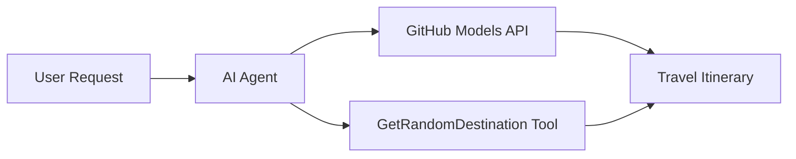

# 🌍 AI Utazási Ügynök a Microsoft Agent Frameworkkel (.NET)

## 📋 Forgatókönyv Áttekintése

Ez a jegyzetfüzet bemutatja, hogyan lehet intelligens utazástervező ügynököt létrehozni a Microsoft Agent Framework segítségével .NET környezetben. Az ügynök automatikusan személyre szabott egynapos útitervet készít véletlenszerűen kiválasztott úti célokhoz a világ különböző pontjain.

**Fő képességek:**
- 🎲 **Véletlenszerű úti cél kiválasztása**: Egyedi eszközt használ a nyaralóhelyek kiválasztásához
- 🗺️ **Intelligens utazástervezés**: Részletes napi útitervet készít
- 🔄 **Valós idejű streaming**: Támogatja az azonnali és folyamatos válaszokat
- 🛠️ **Egyedi eszköz integráció**: Bemutatja, hogyan lehet bővíteni az ügynök képességeit

## 🔧 Technikai Architektúra

### Alapvető technológiák
- **Microsoft Agent Framework**: Legújabb .NET implementáció AI ügynökök fejlesztéséhez
- **GitHub Models Integráció**: GitHub AI modell következtetési szolgáltatását használja
- **OpenAI API Kompatibilitás**: OpenAI klienskönyvtárakat alkalmaz egyedi végpontokkal
- **Biztonságos konfiguráció**: API kulcsok kezelése környezetalapú beállításokkal

### Fő komponensek
1. **AIAgent**: A fő ügynök, amely a beszélgetés menetét irányítja
2. **Egyedi eszközök**: `GetRandomDestination()` funkció, amely elérhető az ügynök számára
3. **Chat kliens**: GitHub Models által támogatott beszélgetési felület
4. **Streaming támogatás**: Valós idejű válaszgenerálási képességek

### Integrációs minta


## 🚀 Első lépések

**Előfeltételek:**
- .NET 9.0 vagy újabb
- GitHub Models API hozzáférési token
- Környezeti változók konfigurálása `.env` fájlban

**Szükséges környezeti változók:**
```env
GITHUB_TOKEN=your_github_token
GITHUB_ENDPOINT=https://models.inference.ai.azure.com
GITHUB_MODEL_ID=gpt-4o-mini
```

Futtassa az alábbi cellákat sorrendben, hogy lássa az utazási ügynök működését!

---

## .NET Single File App: AI Travel Agent Example

See `01-dotnet-agent-framework.cs` for the complete runnable code sample.

Futtassa az alábbi kódmintát:

```bash
dotnet run 01-dotnet-agent-framework.cs
```

### Sample Code

```csharp
static string GetRandomDestination()
{
    var destinations = new List<string>
    {
        "Paris, France",
        "Tokyo, Japan",
        "New York City, USA",
        "Sydney, Australia",
        "Rome, Italy",
        "Barcelona, Spain",
        "Cape Town, South Africa",
        "Rio de Janeiro, Brazil",
        "Bangkok, Thailand",
        "Vancouver, Canada"
    };
    var random = new Random();
    int index = random.Next(destinations.Count);
    return destinations[index];
}

// Extract configuration from environment variables
var github_endpoint = Environment.GetEnvironmentVariable("GITHUB_ENDPOINT") ?? throw new InvalidOperationException("GITHUB_ENDPOINT is not set.");
var github_model_id = Environment.GetEnvironmentVariable("GITHUB_MODEL_ID") ?? "gpt-4o-mini";
var github_token = Environment.GetEnvironmentVariable("GITHUB_TOKEN") ?? throw new InvalidOperationException("GITHUB_TOKEN is not set.");

// Configure OpenAI Client Options
var openAIOptions = new OpenAIClientOptions()
{
    Endpoint = new Uri(github_endpoint)
};

// Initialize OpenAI Client with GitHub Models Configuration
var openAIClient = new OpenAIClient(new ApiKeyCredential(github_token), openAIOptions);

// Create AI Agent with Travel Planning Capabilities
AIAgent agent = openAIClient
    .GetChatClient(github_model_id)
    .CreateAIAgent(
        instructions: "You are a helpful AI Agent that can help plan vacations for customers at random destinations",
        tools: [AIFunctionFactory.Create(GetRandomDestination)]
    );

// Execute Agent: Plan a Day Trip (Non-Streaming)
Console.WriteLine(await agent.RunAsync("Plan me a day trip"));

// Execute Agent: Plan a Day Trip (Streaming Response)
await foreach (var update in agent.RunStreamingAsync("Plan me a day trip"))
{
    Console.Write(update);
}
```
