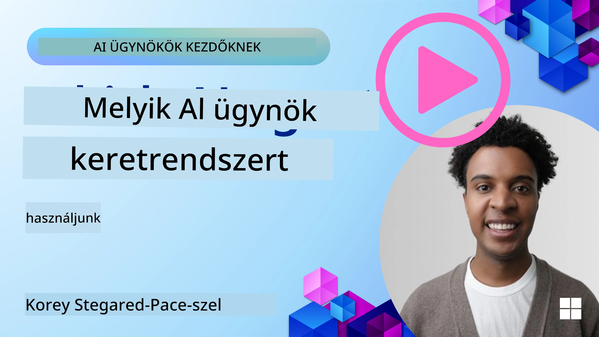

[](https://youtu.be/ODwF-EZo_O8?si=1xoy_B9RNQfrYdF7)

> _(Kattintson a fenti képre a lecke videójának megtekintéséhez)_

# AI ügynök keretrendszerek felfedezése

Az AI ügynök keretrendszerek olyan szoftverplatformok, amelyeket az AI ügynökök létrehozásának, telepítésének és kezelésének egyszerűsítésére terveztek. Ezek a keretrendszerek előre elkészített komponenseket, absztrakciókat és eszközöket kínálnak a fejlesztőknek, amelyek megkönnyítik összetett AI rendszerek fejlesztését.

Ezek a keretrendszerek segítik a fejlesztőket abban, hogy alkalmazásaik egyedi aspektusaira összpontosítsanak, miközben szabványos megközelítéseket biztosítanak az AI ügynök fejlesztésének általános kihívásaira. Növelik a skálázhatóságot, hozzáférhetőséget és hatékonyságot az AI rendszerek építésében.

## Bevezetés

Ebben a leckében a következőket tárgyaljuk:

- Mik az AI ügynök keretrendszerek és mit tesznek lehetővé a fejlesztők számára?
- Hogyan használhatják a csapatok ezeket gyors prototípus készítésre, iterációra és az ügynök képességeinek javítására?
- Milyen különbségek vannak a Microsoft által létrehozott keretrendszerek és eszközök között (<a href="https://aka.ms/ai-agents-beginners/ai-agent-service" target="_blank">Azure AI Agent Service</a> és a <a href="https://learn.microsoft.com/azure/ai-services/openai/how-to/responses" target="_blank">Microsoft Agent Framework</a>)?
- Integrálhatom-e közvetlenül a meglévő Azure ökoszisztéma eszközeimet, vagy különálló megoldásokra van szükségem?
- Mi az az Azure AI Agents szolgáltatás és hogyan segít nekem?

## Tanulási célok

A lecke célja, hogy segítsen megérteni:

- Az AI ügynök keretrendszerek szerepét az AI fejlesztésben.
- Hogyan lehet kihasználni az AI ügynök keretrendszerek képességeit intelligens ügynökök építéséhez.
- Az AI ügynök keretrendszerek által engedélyezett kulcsfontosságú képességeket.
- A Microsoft Agent Framework és az Azure AI Agent Service közötti különbségeket.

## Mik azok az AI ügynök keretrendszerek és mit tesznek lehetővé a fejlesztők számára?

A hagyományos AI keretrendszerek segíthetnek az AI alkalmazásokba való integrálásában, és az alábbi módokon teszik jobbá azokat:

- **Személyre szabás**: Az AI képes elemezni a felhasználói viselkedést és preferenciákat, hogy személyre szabott ajánlásokat, tartalmakat és élményeket nyújtson.
Példa: Az olyan streaming szolgáltatások, mint a Netflix, AI segítségével javasolnak filmeket és műsorokat a megtekintési előzmények alapján, növelve a felhasználói elkötelezettséget és elégedettséget.
- **Automatizálás és hatékonyság**: Az AI képes automatizálni ismétlődő feladatokat, egyszerűsíteni a munkafolyamatokat és javítani a működési hatékonyságot.
Példa: Ügyfélszolgálati alkalmazások AI-alapú chatbotokat használnak a gyakori kérdések kezelésére, csökkentve a válaszidőt és felszabadítva az emberi ügyintézőket összetettebb problémákhoz.
- **Fejlettebb felhasználói élmény**: Az AI javíthatja az összesített felhasználói élményt intelligens funkciók biztosításával, például hangfelismeréssel, természetes nyelvfeldolgozással és prediktív szöveggel.
Példa: Az olyan virtuális asszisztensek, mint a Siri és a Google Assistant, AI-t használnak a hangparancsok értelmezésére és válaszadásra, megkönnyítve a felhasználók eszközökkel való interakcióját.

### Ez mind remekül hangzik, de akkor miért van szükségünk az AI ügynök keretrendszerre?

Az AI ügynök keretrendszerek többek, mint puszta AI keretrendszerek. Olyan intelligens ügynökök létrehozását teszik lehetővé, akik képesek interakcióba lépni a felhasználókkal, más ügynökökkel és a környezettel meghatározott célok elérése érdekében. Ezek az ügynökök autonóm viselkedést mutathatnak, döntéseket hozhatnak és alkalmazkodhatnak a változó feltételekhez. Nézzük meg az AI ügynök keretrendszerek kulcsfontosságú képességeit:

- **Ügynökök közötti együttműködés és koordináció**: Több AI ügynök létrehozását teszi lehetővé, amelyek együttműködhetnek, kommunikálhatnak és koordinálhatják tevékenységüket összetett feladatok megoldására.
- **Feladat-automatizálás és kezelés**: Mechanizmusokat kínálvány multi-lépcsős munkafolyamatok automatizálásához, feladat delegáláshoz és dinamikus feladatkezeléshez az ügynökök között.
- **Kontextusértés és alkalmazkodás**: Az ügynökök képesek megérteni a kontextust, alkalmazkodni a változó környezethez, és valós idejű információk alapján döntéseket hozni.

Összefoglalva, az ügynökök lehetővé teszik, hogy többet tegyünk, az automatizálást új szintre emeljük, és intelligensebb rendszereket hozzunk létre, melyek képesek alkalmazkodni és tanulni a környezetükből.

## Hogyan prototípizálhatjuk, iterálhatjuk és javíthatjuk gyorsan az ügynök képességeit?

Ez egy gyorsan változó terület, de számos közös elem van a legtöbb AI ügynök keretrendszerben, amelyek segítenek gyors prototípus készítésben és iterációban, mint például moduláris komponensek, együttműködési eszközök és valós idejű tanulás. Nézzük meg ezeket:

- **Használj moduláris komponenseket**: Az AI SDK-k előre elkészített komponenseket kínálnak, mint például AI és memória csatlakozók, természetes nyelv vagy kód pluginok használatával történő függvényhívás, prompt sablonok és egyebek.
- **Használj együttműködési eszközöket**: Tervezd meg az ügynököket speciális szerepekkel és feladatokkal, lehetővé téve, hogy teszteljék és finomítsák az együttműködési munkafolyamatokat.
- **Tanulj valós időben**: Valós idejű visszacsatolási hurkokat valósíts meg, ahol az ügynökök tanulnak az interakciókból és dinamikusan állítják be viselkedésüket.

### Használj moduláris komponenseket

Az olyan SDK-k, mint a Microsoft Agent Framework előre elkészített komponenseket kínálnak, mint AI csatlakozók, eszköz definíciók és ügynökkezelés.

**Hogyan használhatják ezt a csapatok**: A csapatok gyorsan összeállíthatják ezeket a komponenseket működőképes prototípus létrehozásához, anélkül, hogy az alapoktól kellene kezdeniük, lehetővé téve a gyors kísérletezést és iterációt.

**Hogyan működik a gyakorlatban**: Használhatsz előre elkészített elemzőt a felhasználói bevitelből történő információk kinyerésére, egy memória modult az adatok tárolására és visszakeresésére, valamint egy prompt generátort a felhasználóval való interakcióra, mindezt anélkül, hogy ezeket a komponenseket nulláról kellene építeni.

**Példa kód**. Nézzük meg, hogyan használható a Microsoft Agent Framework az `AzureAIProjectAgentProvider`-rel, hogy a modell válaszoljon a felhasználói bevitelre eszköz hívással:

``` python
# Microsoft Agent Framework Python példa

import asyncio
import os
from typing import Annotated

from agent_framework.azure import AzureAIProjectAgentProvider
from azure.identity import AzureCliCredential


# Egy mintafüggvény definiálása az utazás foglalásához
def book_flight(date: str, location: str) -> str:
    """Book travel given location and date."""
    return f"Travel was booked to {location} on {date}"


async def main():
    provider = AzureAIProjectAgentProvider(credential=AzureCliCredential())
    agent = await provider.create_agent(
        name="travel_agent",
        instructions="Help the user book travel. Use the book_flight tool when ready.",
        tools=[book_flight],
    )

    response = await agent.run("I'd like to go to New York on January 1, 2025")
    print(response)
    # Példa kimenet: A New Yorkba tartó járatát 2025. január 1-jére sikeresen lefoglaltuk. Jó utat! ✈️🗽


if __name__ == "__main__":
    asyncio.run(main())
```

Az példában látható, hogyan használható előre elkészített elemző a felhasználói bemenet kulcsfontosságú információinak, például a kiindulási hely, célállomás és járat foglalás dátumának kinyerésére. Ez a moduláris megközelítés lehetővé teszi, hogy a magas szintű logikára koncentrálj.

### Használj együttműködési eszközöket

A Microsoft Agent Framework-hez hasonló keretrendszerek megkönnyítik több ügynök együttműködésének létrehozását.

**Hogyan használhatják ezt a csapatok**: A csapatok olyan ügynököket tervezhetnek, amelyek speciális szerepekhez és feladatokhoz kötöttek, lehetővé téve az együttműködési munkafolyamatok tesztelését és finomítását, ezáltal javítva a rendszer egészének hatékonyságát.

**Hogyan működik a gyakorlatban**: Létrehozhatsz egy ügynök-csapatot, ahol az egyes ügynökök speciális funkciót látnak el, mint például adatkinyerés, elemzés vagy döntéshozatal. Ezek az ügynökök kommunikálnak és megosztják az információkat egy közös cél elérése érdekében, például egy felhasználói kérdés megválaszolásához vagy egy feladat elvégzéséhez.

**Példa kód (Microsoft Agent Framework)**:

```python
# Több ügynök létrehozása, amelyek együtt dolgoznak a Microsoft Agent Framework használatával

import os
from agent_framework.azure import AzureAIProjectAgentProvider
from azure.identity import AzureCliCredential

provider = AzureAIProjectAgentProvider(credential=AzureCliCredential())

# Adatlekérő ügynök
agent_retrieve = await provider.create_agent(
    name="dataretrieval",
    instructions="Retrieve relevant data using available tools.",
    tools=[retrieve_tool],
)

# Adatelemző ügynök
agent_analyze = await provider.create_agent(
    name="dataanalysis",
    instructions="Analyze the retrieved data and provide insights.",
    tools=[analyze_tool],
)

# Ügynökök egymás utáni futtatása egy feladaton
retrieval_result = await agent_retrieve.run("Retrieve sales data for Q4")
analysis_result = await agent_analyze.run(f"Analyze this data: {retrieval_result}")
print(analysis_result)
```

Az előző kódban látható, hogyan hozhatsz létre olyan feladatot, ami több együttműködő ügynök munkáját igényli az adatok elemzéséhez. Minden ügynök egy adott funkciót lát el, és a feladatot úgy hajtják végre, hogy koordinálják az ügynököket a kívánt eredmény elérése érdekében. Az dedikált, speciális szerepkörű ügynökök létrehozásával javíthatod a feladat hatékonyságát és teljesítményét.

### Tanulj valós időben

Fejlett keretrendszerek lehetőséget nyújtanak a valós idejű kontextusértés és alkalmazkodás számára.

**Hogyan használhatják ezt a csapatok**: A csapatok visszacsatolási hurkokat vezethetnek be, ahol az ügynökök tanulnak az interakciókból, és dinamikusan módosítják viselkedésüket, ami folyamatos fejlődést és képességfejlesztést eredményez.

**Hogyan működik a gyakorlatban**: Az ügynökök elemezhetik a felhasználói visszajelzéseket, a környezeti adatokat és a feladat kimeneteleket, hogy frissítsék tudásbázisukat, módosítsák a döntéshozatali algoritmusokat és idővel javítsák teljesítményüket. Ez az iteratív tanulási folyamat lehetővé teszi az ügynökök számára, hogy alkalmazkodjanak a változó feltételekhez és a felhasználói preferenciákhoz, javítva az egész rendszer hatékonyságát.

## Milyen különbségek vannak a Microsoft Agent Framework és az Azure AI Agent Service között?

Számos módon lehet összehasonlítani ezeket a megközelítéseket, nézzük meg a főbb különbségeket tervezés, képességek és célfelhasználási esetek szempontjából:

## Microsoft Agent Framework (MAF)

A Microsoft Agent Framework egy egyszerűsített SDK-t biztosít AI ügynökök építéséhez az `AzureAIProjectAgentProvider` használatával. Lehetővé teszi a fejlesztők számára, hogy Azure OpenAI modelleket használó, beépített eszközhívással, beszélgetéskezeléssel és vállalati szintű biztonsággal rendelkező ügynököket hozzanak létre Azure identity-n keresztül.

**Használati esetek**: Termelésre kész AI ügynökök építése eszközhasználattal, többlépcsős munkafolyamatokkal és vállalati integrációs forgatókönyvekkel.

A Microsoft Agent Framework fontos alapfogalmai:

- **Ügynökök**: Az ügynököt az `AzureAIProjectAgentProvider` hozza létre, és konfigurálható névvel, utasításokkal és eszközökkel. Az ügynök:
  - **Feldolgozza a felhasználói üzeneteket** és válaszokat generál Azure OpenAI modellek segítségével.
  - **Automatikusan hívja az eszközöket** a beszélgetés kontextusa alapján.
  - **Folytatja a beszélgetés állapotát** több interakción keresztül.

  Íme egy kódrészlet egy ügynök létrehozásához:

    ```python
    import os
    from agent_framework.azure import AzureAIProjectAgentProvider
    from azure.identity import AzureCliCredential

    provider = AzureAIProjectAgentProvider(credential=AzureCliCredential())
    agent = await provider.create_agent(
        name="my_agent",
        instructions="You are a helpful assistant.",
    )

    response = await agent.run("Hello, World!")
    print(response)
    ```

- **Eszközök**: A keretrendszer támogatja eszközök, mint Python függvények meghatározását, amelyeket az ügynök automatikusan képes meghívni. Az eszközök regisztrálása történik az ügynök létrehozásakor:

    ```python
    def get_weather(location: str) -> str:
        """Get the current weather for a location."""
        return f"The weather in {location} is sunny, 72\u00b0F."

    agent = await provider.create_agent(
        name="weather_agent",
        instructions="Help users check the weather.",
        tools=[get_weather],
    )
    ```

- **Több ügynök koordinációja**: Több ügynök létrehozása különböző specializációkkal és munkájuk koordinálása:

    ```python
    planner = await provider.create_agent(
        name="planner",
        instructions="Break down complex tasks into steps.",
    )

    executor = await provider.create_agent(
        name="executor",
        instructions="Execute the planned steps using available tools.",
        tools=[execute_tool],
    )

    plan = await planner.run("Plan a trip to Paris")
    result = await executor.run(f"Execute this plan: {plan}")
    ```

- **Azure Identity integráció**: A keretrendszer az `AzureCliCredential` (vagy `DefaultAzureCredential`) használatával biztosít biztonságos, kulcs nélküli hitelesítést, így nincs szükség API kulcsok közvetlen kezelésére.

## Azure AI Agent Service

Az Azure AI Agent Service egy újabb szolgáltatás, amelyet a Microsoft Ignite 2024-en mutattak be. Lehetővé teszi AI ügynökök fejlesztését és telepítését rugalmasabb modellekkel, mint például közvetlenül megnyitott forráskódú LLM-ek, például Llama 3, Mistral és Cohere hívása.

Az Azure AI Agent Service erősebb vállalati biztonsági mechanizmusokat és adatkezelési módszereket kínál, így alkalmas vállalati alkalmazásokhoz.

Alapértelmezett módon működik együtt a Microsoft Agent Framework-kel az ügynökök építéséhez és telepítéséhez.

Ez a szolgáltatás jelenleg nyilvános előnézetben van, és támogatja a Python és C# használatát az ügynökök fejlesztéséhez.

Az Azure AI Agent Service Python SDK használatával létrehozhatunk egy ügynököt felhasználó által definiált eszközzel:

```python
import asyncio
from azure.identity import DefaultAzureCredential
from azure.ai.projects import AIProjectClient

# Eszközfüggvények definiálása
def get_specials() -> str:
    """Provides a list of specials from the menu."""
    return """
    Special Soup: Clam Chowder
    Special Salad: Cobb Salad
    Special Drink: Chai Tea
    """

def get_item_price(menu_item: str) -> str:
    """Provides the price of the requested menu item."""
    return "$9.99"


async def main() -> None:
    credential = DefaultAzureCredential()
    project_client = AIProjectClient.from_connection_string(
        credential=credential,
        conn_str="your-connection-string",
    )

    agent = project_client.agents.create_agent(
        model="gpt-4o-mini",
        name="Host",
        instructions="Answer questions about the menu.",
        tools=[get_specials, get_item_price],
    )

    thread = project_client.agents.create_thread()

    user_inputs = [
        "Hello",
        "What is the special soup?",
        "How much does that cost?",
        "Thank you",
    ]

    for user_input in user_inputs:
        print(f"# User: '{user_input}'")
        message = project_client.agents.create_message(
            thread_id=thread.id,
            role="user",
            content=user_input,
        )
        run = project_client.agents.create_and_process_run(
            thread_id=thread.id, agent_id=agent.id
        )
        messages = project_client.agents.list_messages(thread_id=thread.id)
        print(f"# Agent: {messages.data[0].content[0].text.value}")


if __name__ == "__main__":
    asyncio.run(main())
```

### Alapfogalmak

Az Azure AI Agent Service a következő alapfogalmakkal rendelkezik:

- **Ügynök**: Az Azure AI Agent Service integrálódik a Microsoft Foundry-val. Az AI Foundry-n belül az AI Ügynök egy „okos” mikroszolgáltatásként működik, amely kérdések megválaszolására (RAG), műveletek végrehajtására vagy teljes munkafolyamatok automatizálására használható. Ezt generatív AI modellek és olyan eszközök kombinációjával éri el, amelyek lehetővé teszik a valós adatforrásokhoz való hozzáférést és velük való interakciót. Íme egy példa egy ügynökre:

    ```python
    agent = project_client.agents.create_agent(
        model="gpt-4o-mini",
        name="my-agent",
        instructions="You are helpful agent",
        tools=code_interpreter.definitions,
        tool_resources=code_interpreter.resources,
    )
    ```

    Ebben a példában egy `gpt-4o-mini` modellű, `my-agent` nevű és "You are helpful agent" utasítással ellátott ügynök jön létre. Az ügynök eszközökkel és erőforrásokkal van felszerelve, hogy kódértelmezési feladatokat végezzen.

- **Szál és üzenetek**: A szál szintén egy fontos fogalom. Egy beszélgetést vagy interakciót jelöl az ügynök és a felhasználó között. A szálakat arra lehet használni, hogy nyomon kövessék a beszélgetés előrehaladását, tárolják a kontextus információkat, és kezeljék az interakció állapotát. Íme egy példa egy szálra:

    ```python
    thread = project_client.agents.create_thread()
    message = project_client.agents.create_message(
        thread_id=thread.id,
        role="user",
        content="Could you please create a bar chart for the operating profit using the following data and provide the file to me? Company A: $1.2 million, Company B: $2.5 million, Company C: $3.0 million, Company D: $1.8 million",
    )
    
    # Ask the agent to perform work on the thread
    run = project_client.agents.create_and_process_run(thread_id=thread.id, agent_id=agent.id)
    
    # Fetch and log all messages to see the agent's response
    messages = project_client.agents.list_messages(thread_id=thread.id)
    print(f"Messages: {messages}")
    ```

    A korábbi kódban létrejött egy szál. Ezután üzenetet küldtek a szálnak. Az `create_and_process_run` hívásával azt kérjük, hogy az ügynök dolgozzon a szálon. Végül letöltik és naplózzák az üzeneteket, hogy megoszthassák az ügynök válaszát. Az üzenetek jelzik a beszélgetés előrehaladását a felhasználó és az ügynök között. Fontos megérteni, hogy az üzenetek különböző típusúak lehetnek: szöveg, kép vagy fájl, azaz például az ügynök munkája kép vagy szöveges válasz eredménye lehet. Fejlesztőként ezt az információt felhasználhatod a válasz további feldolgozására vagy bemutatására a felhasználónak.

- **Integrálódik a Microsoft Agent Framework-kel**: Az Azure AI Agent Service zökkenőmentesen működik a Microsoft Agent Framework-kel, ami azt jelenti, hogy ügynököket építhetsz az `AzureAIProjectAgentProvider` segítségével, és a termelési forgatókönyvekhez az Agent Service-en keresztül telepítheted őket.

**Használati esetek**: Az Azure AI Agent Service vállalati alkalmazásokhoz készült, amelyek biztonságos, skálázható és rugalmas AI ügynök telepítést igényelnek.

## Mi a különbség ezek között a megközelítések között?

Úgy tűnik, van átfedés, de néhány kulcsfontosságú különbség akad tervezés, képességek és célirányos használati esetek szempontjából:

- **Microsoft Agent Framework (MAF)**: Egy termelésre kész SDK AI ügynökök építéséhez. Egyszerű, eszköz hívással rendelkező API-t kínál, beszélgetéskezeléssel és Azure identitás integrációval.
- **Azure AI Agent Service**: Egy platform és telepítési szolgáltatás az Azure Foundry-ban ügynökök számára. Beépített kapcsolatokat kínál Azure OpenAI-val, Azure AI Search-szal, Bing Search-szal és kódvégrehajtással.

Még mindig bizonytalan, melyiket válaszd?

### Használati esetek

Nézzünk meg néhány gyakori használati esetet, hátha segítünk:

> K: Termelésre kész AI ügynök alkalmazásokat fejlesztek, és gyorsan el akarok indulni
>

> V: A Microsoft Agent Framework nagyszerű választás. Egyszerű, Python-alapú API-t kínál az `AzureAIProjectAgentProvider` segítségével, amellyel pár sor kódban definiálhatsz ügynököket eszközökkel és utasításokkal.

> K: Vállalati szintű telepítésre van szükségem Azure integrációkkal, mint például Search és kódvégrehajtás
>
> V: Az Azure AI Agent Service a legmegfelelőbb. Ez egy platform szolgáltatás, amely beépített képességeket kínál több modellhez, Azure AI Searchhoz, Bing Searchhoz és Azure Functions-hoz. Könnyen építheted az ügynökeidet a Foundry Portálon és telepítheted őket skálázható módon.

> K: Még mindig bizonytalan vagyok, csak adj egy opciót
>
> V: Kezdd a Microsoft Agent Frameworkkel az ügynökök megépítéséhez, majd használd az Azure AI Agent Service-t a termelési telepítéshez és skálázáshoz. Ez a megközelítés lehetővé teszi a gyors iterációt az ügynök logikáján, miközben tiszta utat biztosít a vállalati telepítéshez.

Összefoglaljuk a főbb különbségeket egy táblázatban:

| Keretrendszer | Fókusz | Alapfogalmak | Használati esetek |
| --- | --- | --- | --- |
| Microsoft Agent Framework | Egyszerűsített ügynök SDK eszközhívással | Ügynökök, Eszközök, Azure identitás | AI ügynökök építése, eszköz használat, többlépcsős munkafolyamatok |
| Azure AI Agent Service | Rugalmas modellek, vállalati biztonság, kódgenerálás, eszközhívás | Moduláris felépítés, Együttműködés, Folyamatirányítás | Biztonságos, skálázható és rugalmas AI ügynök telepítés |

## Integrálhatom-e közvetlenül a meglévő Azure ökoszisztéma eszközeimet, vagy különálló megoldásokra van szükségem?
A válasz igen, integrálhatja meglévő Azure ökoszisztéma eszközeit közvetlenül az Azure AI Agent Service-szel, különösen, mivel úgy lett kialakítva, hogy zökkenőmentesen működjön más Azure szolgáltatásokkal. Például integrálhatja a Binget, Azure AI Search-t és Azure Functions-t. Emellett mély integráció áll rendelkezésre a Microsoft Foundry-val.

A Microsoft Agent Framework szintén integrálódik az Azure szolgáltatásokkal az `AzureAIProjectAgentProvider` és az Azure identitás segítségével, lehetővé téve, hogy közvetlenül az ügynök eszközeiből hívja meg az Azure szolgáltatásokat.

## Sample Codes

- Python: [Agent Framework](./code_samples/02-python-agent-framework.ipynb)
- .NET: [Agent Framework](./code_samples/02-dotnet-agent-framework.md)

## Got More Questions about AI Agent Frameworks?

Csatlakozzon a [Microsoft Foundry Discord](https://aka.ms/ai-agents/discord) szerverhez, hogy találkozzon más tanulókkal, részt vehessen fogadóórákon, és választ kapjon AI Agents-szel kapcsolatos kérdéseire.

## References

- <a href="https://techcommunity.microsoft.com/blog/azure-ai-services-blog/introducing-azure-ai-agent-service/4298357" target="_blank">Azure Agent Service</a>
- <a href="https://learn.microsoft.com/azure/ai-services/openai/how-to/responses" target="_blank">Microsoft Agent Framework - Azure OpenAI Responses</a>
- <a href="https://learn.microsoft.com/azure/ai-services/agents/overview" target="_blank">Azure AI Agent service</a>

## Previous Lesson

[Introduction to AI Agents and Agent Use Cases](../01-intro-to-ai-agents/README.md)

## Next Lesson

[Understanding Agentic Design Patterns](../03-agentic-design-patterns/README.md)

---

<!-- CO-OP TRANSLATOR DISCLAIMER START -->
**Felhasználói figyelmeztetés**:
Ezt a dokumentumot az AI fordító szolgáltatás, a [Co-op Translator](https://github.com/Azure/co-op-translator) segítségével fordítottuk le. Bár a pontosságra törekszünk, kérjük, vegye figyelembe, hogy az automatikus fordítások hibákat vagy pontatlanságokat tartalmazhatnak. Az eredeti, anyanyelvi dokumentum tekintendő hivatalos forrásnak. Kritikus információk esetén professzionális, emberi fordítást javaslunk. Nem vállalunk felelősséget a fordítás használatából eredő félreértésekért vagy félreértelmezésekért.
<!-- CO-OP TRANSLATOR DISCLAIMER END -->