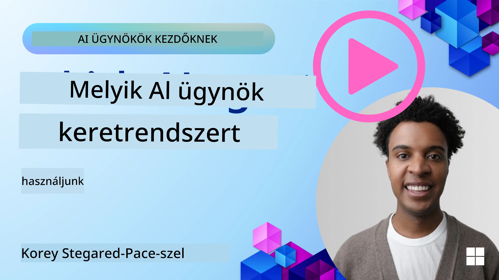

[](https://youtu.be/ODwF-EZo_O8?si=1xoy_B9RNQfrYdF7)

> _(Kattints a fenti képre a lecke videójának megtekintéséhez)_

# AI ágens keretrendszerek felfedezése

Az AI ágens keretrendszerek olyan szoftverplatformok, amelyek az AI ágensek létrehozását, bevezetését és kezelését egyszerűsítik. Ezek a keretrendszerek előre elkészített komponenseket, absztrakciókat és eszközöket biztosítanak a fejlesztők számára, amelyek leegyszerűsítik a komplex AI rendszerek fejlesztését.

Ezek a keretrendszerek segítik a fejlesztőket, hogy az alkalmazásaik egyedi aspektusaira fókuszáljanak, szabványosított megközelítéseket nyújtva az AI ágens fejlesztés közös kihívásaira. Javítják az AI rendszerek skálázhatóságát, hozzáférhetőségét és hatékonyságát.

## Bevezetés

Ez a lecke az alábbi témákat fogja áttekinteni:

- Mik azok az AI ágens keretrendszerek és mit tesznek lehetővé a fejlesztők számára?
- Hogyan használhatják a csapatok ezeket gyors prototípus-készítés, iteráció és az ágensek képességeinek fejlesztése céljából?
- Milyen különbségek vannak a Microsoft által létrehozott keretrendszerek és eszközök között (<a href="https://aka.ms/ai-agents-beginners/ai-agent-service" target="_blank">Microsoft Foundry Agent Service</a> és a <a href="https://learn.microsoft.com/azure/ai-services/openai/how-to/responses" target="_blank">Microsoft Agent Framework</a>)?
- Integrálhatom a meglévő Azure ökoszisztéma eszközeimet közvetlenül, vagy különálló megoldásokra van szükség?
- Mi az a Microsoft Foundry Agent Service, és hogyan segít nekem?

## Tanulási célok

Ennek a leckének a célja, hogy segítsen megérteni:

- Az AI ágens keretrendszerek szerepét az AI fejlesztésben.
- Hogyan használhatók az AI ágens keretrendszerek intelligens ágensek építésére.
- Az AI ágens keretrendszerek által lehetővé tett kulcsfontosságú képességeket.
- A Microsoft Agent Framework és a Microsoft Foundry Agent Service közötti különbségeket.

## Mik azok az AI ágens keretrendszerek és mit tesznek lehetővé a fejlesztők számára?

A hagyományos AI keretrendszerek segíthetnek AI beépítésében az alkalmazásokba és az alábbi módokon javíthatják azokat:

- **Személyre szabás**: Az AI képes elemezni a felhasználói viselkedést és preferenciákat, személyre szabott ajánlásokat, tartalmat és élményeket nyújtva.
Példa: A Netflixhez hasonló streaming szolgáltatások AI-t használnak, hogy megjelenési előzmények alapján filmeket és műsorokat ajánljanak, növelve a felhasználói elköteleződést és elégedettséget.
- **Automatizálás és hatékonyság**: Az AI képes automatizálni ismétlődő feladatokat, hatékonyabbá tenni a munkafolyamatokat és javítani az üzemeltetési hatékonyságot.
Példa: Az ügyfélszolgálati alkalmazások AI alapú chatbotokat használnak a gyakori kérdések kezelésére, csökkentve a válaszidőt és felszabadítva az emberi ügynököket a komplexebb ügyekhez.
- **Fokozott felhasználói élmény**: Az AI javíthatja a teljes felhasználói élményt intelligens funkciókkal, mint a hangfelismerés, természetes nyelvfeldolgozás és előrejelző szövegbevitel.
Példa: A Siri és a Google Assistant virtuális asszisztensek AI segítségével értik meg és válaszolnak a hangparancsokra, megkönnyítve a felhasználók eszközzel való interakcióját.

### Ez mind nagyszerű, de miért van szükség az AI Ágens Keretrendszerre?

Az AI ágens keretrendszerek többek egyszerű AI keretrendszereknél. Céljuk, hogy lehetővé tegyék intelligens ágensek létrehozását, amelyek képesek felhasználókkal, más ágensekkel és a környezettel interakcióba lépni meghatározott célok elérése érdekében. Ezek az ágensek autonóm viselkedést mutathatnak, döntéseket hozhatnak, és alkalmazkodhatnak a változó körülményekhez. Nézzünk néhány kulcsfontosságú képességet, amelyet az AI ágens keretrendszerek biztosítanak:

- **Ágensek közötti együttműködés és koordináció**: Több AI ágens létrehozását teszik lehetővé, akik képesek együtt dolgozni, kommunikálni és koordinálni komplex feladatok megoldásában.
- **Feladat automatizálás és menedzsment**: Mechanizmusokat nyújtanak multi-lépéses munkafolyamatok automatizálására, feladatdelegálásra és dinamikus feladatkezelésre az ágensek között.
- **Kontextus alapú megértés és alkalmazkodás**: Az ágensek képesek megérteni a kontextust, alkalmazkodni a változó környezethez, és valós idejű információk alapján döntéseket hozni.

Összefoglalva, az ágensek lehetővé teszik, hogy többet érj el, az automatizálást a következő szintre emeld, és intelligensebb rendszereket hozz létre, amelyek alkalmazkodnak és tanulnak környezetükből.

## Hogyan lehet gyorsan prototípusokat készíteni, iterálni és fejleszteni az ágensek képességeit?

Ez egy gyorsan fejlődő terület, de vannak közös jellemzők a legtöbb AI ágens keretrendszerben, amelyek segítenek gyors prototípus-készítésben és iterációban, nevezetesen moduláris komponensek, együttműködési eszközök és valós idejű tanulás. Nézzük meg ezeket közelebbről:

- **Használj moduláris komponenseket**: Az AI SDK-k előre elkészített komponenseket kínálnak, például AI és memória csatlakozókat, funkcióhívást természetes nyelven vagy kódbővítményeken keresztül, prompt sablonokat és még sok mást.
- **Használj együttműködési eszközöket**: Tervezd meg az ágenseket specifikus szerepekkel és feladatokkal, lehetővé téve számukra az együttműködési munkafolyamatok tesztelését és finomítását.
- **Tanulj valós időben**: Valósíts meg visszacsatolási ciklusokat, ahol az ágensek tanulnak az interakciókból és dinamikusan igazítják viselkedésüket.

### Használj moduláris komponenseket

Az olyan SDK-k, mint a Microsoft Agent Framework, előre elkészített komponenseket kínálnak, például AI csatlakozókat, eszközdefiníciókat és ágenskezelést.

**Hogyan használhatják a csapatok**: A csapatok gyorsan összeállíthatják ezeket a komponenseket, hogy működőképes prototípust készítsenek anélkül, hogy nulláról kezdenének, lehetővé téve a gyors kísérletezést és iterációt.

**Hogyan működik a gyakorlatban**: Használhatsz előre elkészített elemzőt az információk kinyerésére a felhasználói inputból, egy memóriamodult az adatok tárolására és előhívására, valamint prompt generátort a felhasználókkal való interakcióhoz, mindezt anélkül, hogy ezeket a komponenseket nulláról kellene megépítened.

**Példa kód**. Nézzünk egy példát arra, hogyan használhatod a Microsoft Agent Frameworköt a `FoundryChatClient`-tel, hogy a modell eszközhívással válaszoljon a felhasználói bemenetére:

``` python
# Microsoft Agent Framework Python példa

import asyncio
import os

from agent_framework import tool
from agent_framework.foundry import FoundryChatClient
from azure.identity import AzureCliCredential


# Definiáljon egy minta eszközfüggvényt az utazás foglalásához
@tool(approval_mode="never_require")
def book_flight(date: str, location: str) -> str:
    """Book travel given location and date."""
    return f"Travel was booked to {location} on {date}"


async def main():
    provider = FoundryChatClient(
        project_endpoint=os.environ["AZURE_AI_PROJECT_ENDPOINT"],
        model=os.environ["AZURE_AI_MODEL_DEPLOYMENT_NAME"],
        credential=AzureCliCredential(),
    )
    agent = provider.as_agent(
        name="travel_agent",
        instructions="Help the user book travel. Use the book_flight tool when ready.",
        tools=[book_flight],
    )

    response = await agent.run("I'd like to go to New York on January 1, 2025")
    print(response)
    # Példa kimenet: A 2025. január 1-jére New Yorkba szóló járata sikeresen foglalva. Jó utat! ✈️🗽


if __name__ == "__main__":
    asyncio.run(main())
```

Ebből a példából láthatod, hogyan használhatsz előre elkészített elemzőt kulcsfontosságú információk, például egy repülőjegy foglalási kérés eredete, úticélja és dátuma kinyerésére a felhasználói inputból. Ez a moduláris megközelítés lehetővé teszi, hogy a magasabb szintű logikára koncentrálj.

### Használj együttműködési eszközöket

A Microsoft Agent Frameworkhöz hasonló keretrendszerek megkönnyítik több ágensek együttműködésének létrehozását.

**Hogyan használhatják a csapatok**: A csapatok speciális szerepekkel és feladatokkal rendelkező ágenseket tervezhetnek, lehetővé téve számukra az együttműködési munkafolyamatok tesztelését és finomítását, ezáltal javítva a rendszer hatékonyságát.

**Hogyan működik a gyakorlatban**: Létrehozhatsz egy ágens csapatot, ahol minden ágensnek speciális funkciója van, például adatok lekérése, elemzés vagy döntéshozatal. Ezek az ágensek kommunikálhatnak egymással és megoszthatják az információkat, hogy egy közös célt érjenek el, például válaszoljanak egy felhasználói kérésre vagy hajtsanak végre egy feladatot.

**Példa kód (Microsoft Agent Framework)**:

```python
# Több ügynök létrehozása, amelyek együtt dolgoznak a Microsoft Agent Framework segítségével

import os
from agent_framework.foundry import FoundryChatClient
from azure.identity import AzureCliCredential

provider = FoundryChatClient(
    project_endpoint=os.environ["AZURE_AI_PROJECT_ENDPOINT"],
    model=os.environ["AZURE_AI_MODEL_DEPLOYMENT_NAME"],
    credential=AzureCliCredential(),
)

# Adatlekérdező Ügynök
agent_retrieve = provider.as_agent(
    name="dataretrieval",
    instructions="Retrieve relevant data using available tools.",
    tools=[retrieve_tool],
)

# Adatfeldolgozó Ügynök
agent_analyze = provider.as_agent(
    name="dataanalysis",
    instructions="Analyze the retrieved data and provide insights.",
    tools=[analyze_tool],
)

# Ügynökök sorozatos futtatása egy feladaton
retrieval_result = await agent_retrieve.run("Retrieve sales data for Q4")
analysis_result = await agent_analyze.run(f"Analyze this data: {retrieval_result}")
print(analysis_result)
```

A korábbi kódban azt láthatod, hogyan hozhatsz létre egy olyan feladatot, amely több ágens együttműködését igényli az adatok elemzéséhez. Minden ágens egy speciális funkciót végez, és a feladatot az ágensek koordinációja révén hajtják végre a kívánt eredmény elérése érdekében. Külön dedikált ágensek létrehozásával, specializált szerepekkel, javíthatod a feladat hatékonyságát és teljesítményét.

### Tanulj valós időben

A fejlett keretrendszerek valós idejű kontextusértést és alkalmazkodást biztosítanak.

**Hogyan használhatják a csapatok**: A csapatok visszacsatolási ciklusokat valósíthatnak meg, ahol az ágensek tanulnak az interakciókból, és dinamikusan igazítják viselkedésüket, ami a képességek folyamatos fejlesztéséhez és finomításához vezet.

**Hogyan működik a gyakorlatban**: Az ágensek elemezhetik a felhasználói visszajelzéseket, a környezeti adatokat és a feladat eredményeit, hogy frissítsék tudásbázisukat, módosítsák döntési algoritmusaikat, és idővel javítsák teljesítményüket. Ez az iteratív tanulási folyamat lehetővé teszi az ágensek számára, hogy alkalmazkodjanak a változó feltételekhez és a felhasználói preferenciákhoz, növelve a rendszer hatékonyságát.

## Milyen különbségek vannak a Microsoft Agent Framework és a Microsoft Foundry Agent Service között?

Számos összehasonlítási mód van ezeket a megközelítéseket illetően, de nézzünk néhány kulcsfontosságú különbséget a tervezésük, képességeik és célfelhasználási eseteik szempontjából:

## Microsoft Agent Framework (MAF)

A Microsoft Agent Framework egy egyszerűsített SDK-t nyújt AI ágensek építéséhez a `FoundryChatClient` használatával. Lehetővé teszi a fejlesztők számára olyan ágensek létrehozását, amelyek Azure OpenAI modelleket használnak beépített eszközhívással, beszélgetéskezeléssel és vállalati szintű biztonsággal az Azure identitás révén.

**Használati esetek**: Termelésre kész AI ágensek építése eszközhasználattal, többlépéses munkafolyamatokkal és vállalati integrációs forgatókönyvekkel.

Íme néhány fontos alapfogalom a Microsoft Agent Frameworkből:

- **Ágensek**. Egy ágens a `FoundryChatClient`-tel jön létre, és konfigurálható névvel, utasításokkal és eszközökkel. Az ágens képes:
  - **Felhasználói üzenetek feldolgozása** és válaszok generálása Azure OpenAI modellek segítségével.
  - **Eszközök hívása** automatikusan a beszélgetési kontextus alapján.
  - **A beszélgetés állapotának fenntartása** többszöri interakció alatt.

  Íme egy kódrészlet, amely megmutatja, hogyan kell létrehozni egy ágenst:

    ```python
    import os
    from agent_framework.foundry import FoundryChatClient
    from azure.identity import AzureCliCredential

    provider = FoundryChatClient(
        project_endpoint=os.environ["AZURE_AI_PROJECT_ENDPOINT"],
        model=os.environ["AZURE_AI_MODEL_DEPLOYMENT_NAME"],
        credential=AzureCliCredential(),
    )
    agent = provider.as_agent(
        name="my_agent",
        instructions="You are a helpful assistant.",
    )

    response = await agent.run("Hello, World!")
    print(response)
    ```

- **Eszközök**. A keretrendszer támogatja eszközök Python függvényekként történő definiálását, amelyeket az ágens automatikusan meghívhat. Az eszközök regisztrálva vannak az ágens létrehozásakor:

    ```python
    def get_weather(location: str) -> str:
        """Get the current weather for a location."""
        return f"The weather in {location} is sunny, 72\u00b0F."

    agent = provider.as_agent(
        name="weather_agent",
        instructions="Help users check the weather.",
        tools=[get_weather],
    )
    ```

- **Több ágens együttműködése**. Több ágens hozható létre különböző specializációkkal, és koordinálhatják munkájukat:

    ```python
    planner = provider.as_agent(
        name="planner",
        instructions="Break down complex tasks into steps.",
    )

    executor = provider.as_agent(
        name="executor",
        instructions="Execute the planned steps using available tools.",
        tools=[execute_tool],
    )

    plan = await planner.run("Plan a trip to Paris")
    result = await executor.run(f"Execute this plan: {plan}")
    ```

- **Azure identitás integráció**. A keretrendszer az `AzureCliCredential` (vagy `DefaultAzureCredential`) titkosítás nélküli biztonságos hitelesítést használ, megszüntetve az API kulcsok közvetlen kezelésének szükségességét.

## Microsoft Foundry Agent Service

A Microsoft Foundry Agent Service egy újabb szolgáltatás, amelyet a Microsoft Ignite 2024-en mutattak be. Lehetővé teszi AI ágensek fejlesztését és bevezetését rugalmasabb modellekkel, mint például közvetlen hozzáférés nyílt forráskódú LLM-ekhez, például a Llama 3, Mistral és Cohere modellekhez.

A Microsoft Foundry Agent Service erősebb vállalati biztonsági mechanizmusokat és adatkezelési módszereket kínál, amelyek alkalmassá teszik vállalati alkalmazásokhoz.

Közvetlenül együttműködik a Microsoft Agent Frameworkkel az ágensek fejlesztése és telepítése érdekében.

Ez a szolgáltatás jelenleg nyilvános előnézetben van, és Python, valamint C# támogatással építi az ágenseket.

A Microsoft Foundry Agent Service Python SDK használatával létrehozhatunk egy ágenst felhasználó által definiált eszközzel:

```python
import asyncio
from azure.identity import DefaultAzureCredential
from azure.ai.projects import AIProjectClient

# Eszközfüggvények definiálása
def get_specials() -> str:
    """Provides a list of specials from the menu."""
    return """
    Special Soup: Clam Chowder
    Special Salad: Cobb Salad
    Special Drink: Chai Tea
    """

def get_item_price(menu_item: str) -> str:
    """Provides the price of the requested menu item."""
    return "$9.99"


async def main() -> None:
    credential = DefaultAzureCredential()
    project_client = AIProjectClient.from_connection_string(
        credential=credential,
        conn_str="your-connection-string",
    )

    agent = project_client.agents.create_agent(
        model="gpt-4o-mini",
        name="Host",
        instructions="Answer questions about the menu.",
        tools=[get_specials, get_item_price],
    )

    thread = project_client.agents.create_thread()

    user_inputs = [
        "Hello",
        "What is the special soup?",
        "How much does that cost?",
        "Thank you",
    ]

    for user_input in user_inputs:
        print(f"# User: '{user_input}'")
        message = project_client.agents.create_message(
            thread_id=thread.id,
            role="user",
            content=user_input,
        )
        run = project_client.agents.create_and_process_run(
            thread_id=thread.id, agent_id=agent.id
        )
        messages = project_client.agents.list_messages(thread_id=thread.id)
        print(f"# Agent: {messages.data[0].content[0].text.value}")


if __name__ == "__main__":
    asyncio.run(main())
```

### Alapfogalmak

A Microsoft Foundry Agent Service alapfogalmai:

- **Ágens**. A Microsoft Foundry Agent Service a Microsoft Foundry-al integrálódik. A Microsoft Foundry-n belül egy AI ágens mint „okos” mikroszolgáltatás működik, amely kérdések megválaszolására (RAG), műveletek végrehajtására vagy munkafolyamatok teljes automatizálására alkalmas. Ezt a generatív AI modellek erejének és az eszközöknek a kombinálásával éri el, amelyek lehetővé teszik valós adatforrásokhoz való hozzáférést és interakciót. Íme egy példa egy ágensre:

    ```python
    agent = project_client.agents.create_agent(
        model="gpt-4o-mini",
        name="my-agent",
        instructions="You are helpful agent",
        tools=code_interpreter.definitions,
        tool_resources=code_interpreter.resources,
    )
    ```

    Ebben a példában egy ágens jön létre a `gpt-4o-mini` modellel, `my-agent` névvel és az `You are helpful agent` (Segítőkész ágens vagy) utasítással. Az ágens eszközökkel és erőforrásokkal van felszerelve kódértelmezési feladatok végrehajtására.

- **Szalag és üzenetek**. A szalag egy másik fontos fogalom. Egy beszélgetést vagy interakciót jelöl egy ágens és a felhasználó között. Szalagokat használhatunk a beszélgetés előrehaladásának követésére, kontextusinformációk tárolására és az interakció állapotának kezelésére. Íme egy példa egy szalagra:

    ```python
    thread = project_client.agents.create_thread()
    message = project_client.agents.create_message(
        thread_id=thread.id,
        role="user",
        content="Could you please create a bar chart for the operating profit using the following data and provide the file to me? Company A: $1.2 million, Company B: $2.5 million, Company C: $3.0 million, Company D: $1.8 million",
    )
    
    # Kérje meg az ügynököt, hogy végezzen munkát a szálon
    run = project_client.agents.create_and_process_run(thread_id=thread.id, agent_id=agent.id)
    
    # Lekérdezni és naplózni az összes üzenetet az ügynök válaszának megtekintéséhez
    messages = project_client.agents.list_messages(thread_id=thread.id)
    print(f"Messages: {messages}")
    ```

    Az előző kódban egy szalag jön létre. Ezután üzenetet küldünk a szalagnak. A `create_and_process_run` hívásával az ágenst kérjük, hogy dolgozzon a szalagon. Végül az üzenetek lekérése és naplózása történik az ágens válaszának megtekintéséhez. Az üzenetek jelzik a beszélgetés előrehaladását a felhasználó és az ágens között. Fontos megérteni, hogy az üzenetek különböző típusúak lehetnek, mint például szöveg, kép vagy fájl, azaz az ágens munkájának eredménye például kép vagy szöveges válasz lehet. Fejlesztőként ezt az információt tovább lehet használni a válasz feldolgozására vagy a felhasználónak való bemutatásra.

- **Integráció a Microsoft Agent Frameworkkel**. A Microsoft Foundry Agent Service zökkenőmentesen működik a Microsoft Agent Frameworkkel, ami azt jelenti, hogy a `FoundryChatClient`-tel építhetsz ágenseket és az Agent Service-en keresztül telepítheted azokat éles környezetben.

**Használati esetek**: A Microsoft Foundry Agent Service olyan vállalati alkalmazásokhoz készült, amelyek biztonságos, skálázható és rugalmas AI ágens bevezetést igényelnek.

## Mi a különbség ezen megközelítések között?
 
Bár valóban van átfedés, néhány kulcsfontosságú különbség a tervezés, a képességek és a célokra vonatkozóan:
 
- **Microsoft Agent Framework (MAF)**: Termelésre kész SDK AI ágensek fejlesztéséhez. Egyszerű API-t kínál eszközhívással, beszélgetés-kezeléssel és Azure identitás integrációval.
- **Microsoft Foundry Agent Service**: Platform és bevezetési szolgáltatás ágensek számára a Microsoft Foundry-ban. Beépített kapcsolatot biztosít olyan szolgáltatásokhoz, mint az Azure OpenAI, Azure AI Search, Bing Search és kódvégrehajtás.
 
Még mindig nem tudod, melyiket válaszd?

### Használati esetek
 
Nézzük meg, hogy segítünk-e néhány gyakori használati eset alapján:
 
> K: Termelésre kész AI ágens alkalmazásokat fejlesztek és gyorsan szeretnék elindulni
>

>V: A Microsoft Agent Framework kitűnő választás. Egyszerű, Python-szerű API-t kínál a `FoundryChatClient`-en keresztül, amellyel néhány sor kóddal definiálhatsz ágenseket eszközökkel és utasításokkal.

>K: Szükségem van vállalati szintű bevezetésre Azure integrációkkal, például kereséssel és kódvégrehajtással
>
>V: A Microsoft Foundry Agent Service a legjobb választás. Ez egy platform szolgáltatás, amely több modellhez, Azure AI Search-hoz, Bing Search-hoz és Azure Functions-höz biztosít beépített képességeket. Könnyű az ágenseket a Foundry Portálon építeni és skálázni.
 
> K: Még mindig bizonytalan vagyok, csak adj egy opciót
>
> V: Kezd a Microsoft Agent Frameworkkel az ágensek fejlesztéséhez, majd használd a Microsoft Foundry Agent Servicet éles környezetű telepítéshez és skálázáshoz. Ez a megközelítés gyors iterációt tesz lehetővé az ágensek logikáján, miközben egyértelmű utat biztosít a vállalati bevezetés felé.
 
Összefoglaljuk a kulcsfontosságú különbségeket egy táblázatban:

| Keretrendszer | Fókusz | Alapfogalmak | Használati esetek |
| --- | --- | --- | --- |
| Microsoft Agent Framework | Egyszerűsített ágensek SDK eszközhívással | Ágensek, Eszközök, Azure Identitás | AI ágensek építése, eszközhasználat, többlépéses munkafolyamatok |
| Microsoft Foundry Agent Service | Rugalmas modellek, vállalati biztonság, kódgenerálás, eszközhívás | Moduláris felépítés, Együttműködés, Folyamatok koordinációja | Biztonságos, skálázható és rugalmas AI ágens bevezetés |

## Integrálhatom a meglévő Azure ökoszisztéma eszközeimet közvetlenül, vagy különálló megoldásokra van szükség?


A válasz igen, közvetlenül integrálhatja meglévő Azure ökoszisztéma eszközeit a Microsoft Foundry Agent Service-szel, különösen, mivel azt úgy építették, hogy zökkenőmentesen működjön más Azure szolgáltatásokkal. Például integrálhatja a Binget, az Azure AI Search-t és az Azure Functions-t. A Microsoft Foundry-vel is mély integráció van.

A Microsoft Agent Framework az Azure szolgáltatásokkal is integrálódik a `FoundryChatClient` és az Azure identitás segítségével, így közvetlenül hívhatja meg az Azure szolgáltatásokat az ügynök eszközeiből.

## Minta Kódok

- Python: [Agent Framework (Microsoft Foundry)](./code_samples/02-python-agent-framework.ipynb)
- Python: [Agent Framework (Azure OpenAI Responses API)](./code_samples/02-python-agent-framework-azure-openai.ipynb)
- .NET: [Agent Framework](./code_samples/02-dotnet-agent-framework.md)

## Több kérdésed van az AI Ügynök Frameworkökről?

Csatlakozz a [Microsoft Foundry Discord](https://discord.com/invite/ATgtXmAS5D) közösséghez, hogy találkozhass más tanulókkal, részt vehess az ügyfélfogadáson és választ kapj AI Ügynökeiddel kapcsolatos kérdéseidre.

## Hivatkozások

- <a href="https://techcommunity.microsoft.com/blog/azure-ai-services-blog/introducing-azure-ai-agent-service/4298357" target="_blank">Azure Agent Service</a>
- <a href="https://learn.microsoft.com/azure/ai-services/openai/how-to/responses" target="_blank">Microsoft Agent Framework - Azure OpenAI Responses</a>
- <a href="https://learn.microsoft.com/azure/ai-services/agents/overview" target="_blank">Microsoft Foundry Agent Service</a>

## Előző Lecke

[Bevezetés az AI Ügynökök és Ügynök Használati Esetek-be](../01-intro-to-ai-agents/README.md)

## Következő Lecke

[Az Ügynöki Tervezési Minták Megértése](../03-agentic-design-patterns/README.md)

---

<!-- CO-OP TRANSLATOR DISCLAIMER START -->
**Jogi nyilatkozat**:
Ez a dokumentum az AI fordítási szolgáltatás, a [Co-op Translator](https://github.com/Azure/co-op-translator) segítségével készült. Bár az pontosságra törekszünk, kérjük, vegye figyelembe, hogy az automatikus fordítások hibákat vagy pontatlanságokat tartalmazhatnak. Az eredeti dokumentum az anyanyelvén tekintendő hiteles forrásnak. Fontos információk esetén professzionális emberi fordítást javasolunk. Nem vállalunk felelősséget semmilyen félreértésért vagy téves értelmezésért, amely ebből a fordításból ered.
<!-- CO-OP TRANSLATOR DISCLAIMER END -->