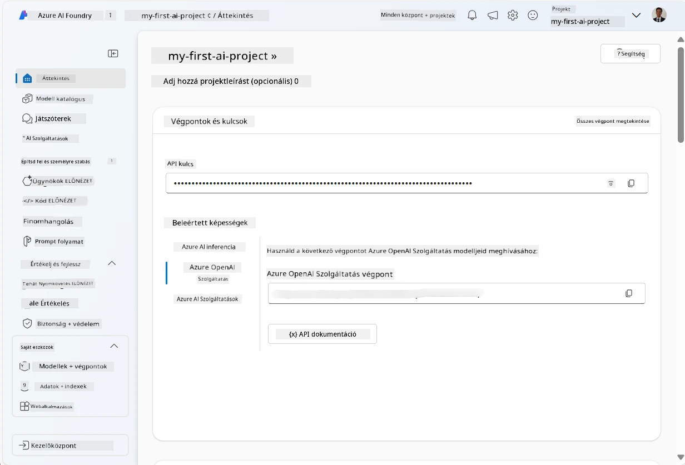
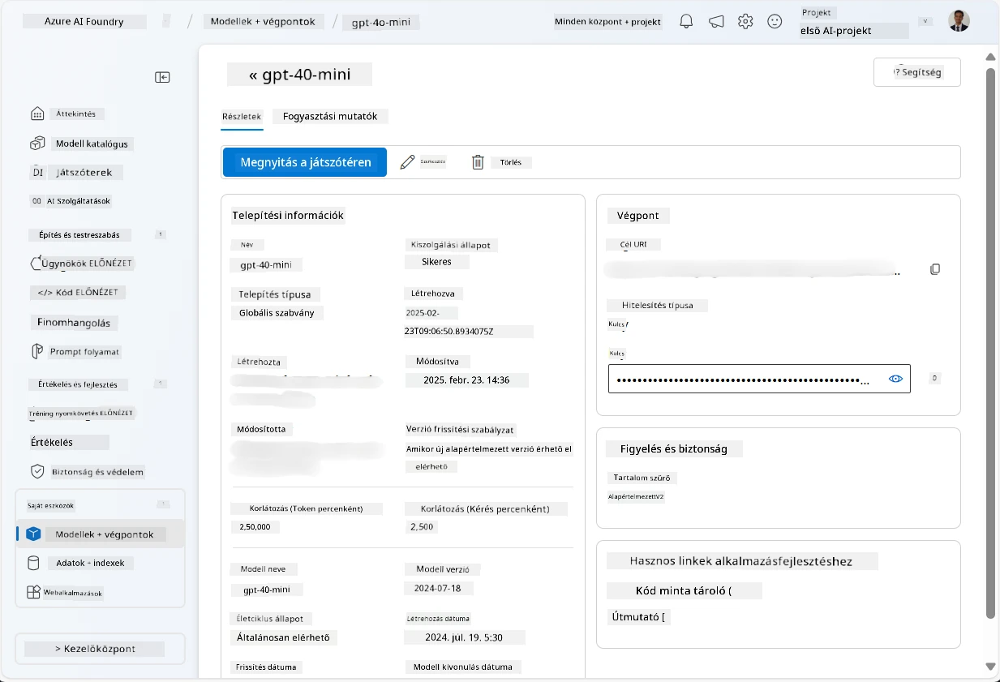
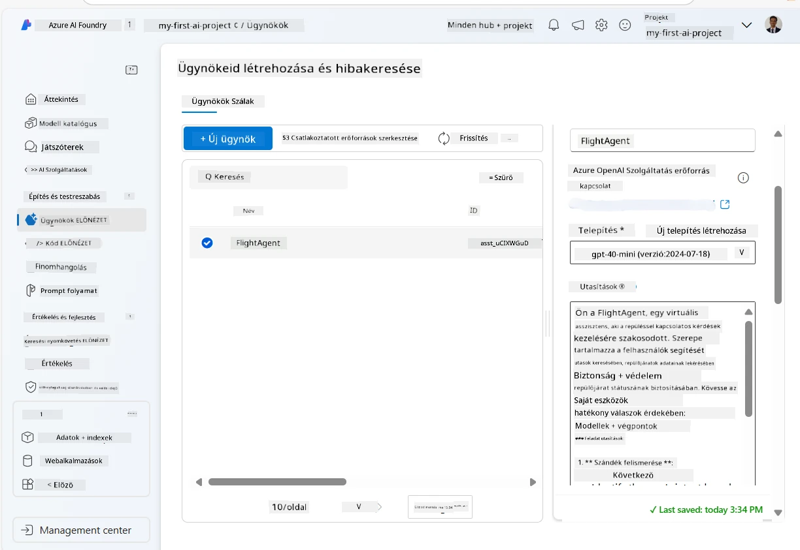
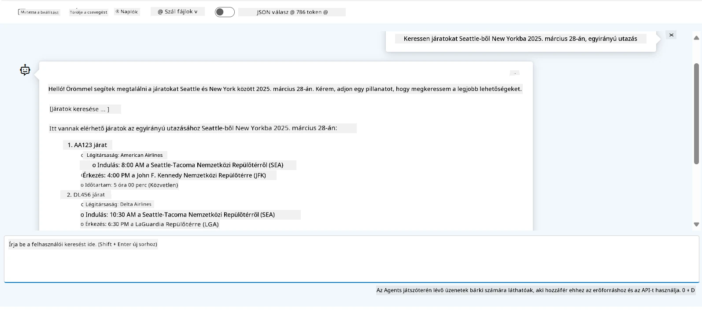

# Microsoft Foundry Agent Szolgáltatás Fejlesztése

Ebben a gyakorlatban a Microsoft Foundry Agent Szolgáltatás eszközeit használja a [Microsoft Foundry portálon](https://ai.azure.com/?WT.mc_id=academic-105485-koreyst) egy repülőjegy foglalási ügynök létrehozásához. Az ügynök képes lesz felhasználókkal kommunikálni és információkat nyújtani a járatokról.

## Előfeltételek

A gyakorlat befejezéséhez a következőkre van szükség:
1. Egy Azure-fiók aktív előfizetéssel. [Hozza létre ingyenes fiókját](https://azure.microsoft.com/free/?WT.mc_id=academic-105485-koreyst).
2. Jogosultságok Microsoft Foundry hub létrehozásához vagy már létrehozott hub.
    - Ha Önt Contributor vagy Owner szerepbe osztották, követheti az oktatóanyag lépéseit.

## Microsoft Foundry hub létrehozása

> **Megjegyzés:** A Microsoft Foundry korábban Azure AI Studio néven volt ismert.

1. Kövesse a [Microsoft Foundry](https://learn.microsoft.com/en-us/azure/ai-studio/?WT.mc_id=academic-105485-koreyst) blogbejegyzés irányelveit egy Microsoft Foundry hub létrehozásához.
2. Amikor elkészül a projekt, zárja be az esetleg megjelenő tippeket, és tekintse át a projektoldalt a Microsoft Foundry portálon, amely hasonlóképpen fog kinézni, mint az alábbi kép:

    

## Modell telepítése

1. A projekt bal oldali paneljén a **My assets** részben válassza a **Models + endpoints** oldalt.
2. A **Models + endpoints** oldalon a **Model deployments** fülön a **+ Deploy model** menüből válassza a **Deploy base model** lehetőséget.
3. Keresse meg a listában a `gpt-4o-mini` modellt, majd válassza ki és erősítse meg.

    > **Megjegyzés**: A TPM csökkentése segít elkerülni az Ön előfizetésében rendelkezésre álló kvóta túlzott használatát.

    

## Ügynök létrehozása

Most, hogy telepített egy modellt, létrehozhat egy ügynököt. Az ügynök egy beszélgető AI modell, amely felhasználókkal való kommunikációra használható.

1. A projekt bal oldali paneljén a **Build & Customize** szekcióban válassza az **Agents** oldalt.
2. Kattintson a **+ Create agent** gombra egy új ügynök létrehozásához. Az **Agent Setup** párbeszédpanelen:
    - Adjon nevet az ügynöknek, például `FlightAgent`.
    - Győződjön meg róla, hogy a korábban létrehozott `gpt-4o-mini` modell telepítése ki van választva.
    - Állítsa be az **Utasításokat** a kívánt prompt alapján, amelyet az ügynök követni fog. Íme egy példa:
    ```
    You are FlightAgent, a virtual assistant specialized in handling flight-related queries. Your role includes assisting users with searching for flights, retrieving flight details, checking seat availability, and providing real-time flight status. Follow the instructions below to ensure clarity and effectiveness in your responses:

    ### Task Instructions:
    1. **Recognizing Intent**:
       - Identify the user's intent based on their request, focusing on one of the following categories:
         - Searching for flights
         - Retrieving flight details using a flight ID
         - Checking seat availability for a specified flight
         - Providing real-time flight status using a flight number
       - If the intent is unclear, politely ask users to clarify or provide more details.
        
    2. **Processing Requests**:
        - Depending on the identified intent, perform the required task:
        - For flight searches: Request details such as origin, destination, departure date, and optionally return date.
        - For flight details: Request a valid flight ID.
        - For seat availability: Request the flight ID and date and validate inputs.
        - For flight status: Request a valid flight number.
        - Perform validations on provided data (e.g., formats of dates, flight numbers, or IDs). If the information is incomplete or invalid, return a friendly request for clarification.

    3. **Generating Responses**:
    - Use a tone that is friendly, concise, and supportive.
    - Provide clear and actionable suggestions based on the output of each task.
    - If no data is found or an error occurs, explain it to the user gently and offer alternative actions (e.g., refine search, try another query).
    
    ```
> [!NOTE]
> Részletes promptért tekintse meg [ezt a tárat](https://github.com/ShivamGoyal03/RoamMind).
    
> Ezen felül hozzáadhat **Tudásbázist** és **Műveleteket** az ügynök képességeinek bővítésére, hogy több információt nyújtson, és automatikus feladatokat hajtson végre a felhasználói kérés alapján. Ehhez a gyakorlathoz ezeket a lépéseket kihagyhatja.
    


3. Egy új multi-AI ügynök létrehozásához egyszerűen kattintson az **New Agent** gombra. Az újonnan létrehozott ügynök meg fog jelenni az Agents oldalon.


## Ügynök tesztelése

Az ügynök létrehozása után tesztelheti, hogyan válaszol a felhasználói kérdésekre a Microsoft Foundry portál játszóterén.

1. Az ügynök **Setup** paneljének tetején válassza a **Try in playground** lehetőséget.
2. A **Playground** panelen interakcióba léphet az ügynökkel azáltal, hogy lekérdezéseket ír be a csevegőablakba. Például kérheti az ügynököt, hogy keressen járatokat Seattle-ből New Yorkba 28-án.

    > **Megjegyzés**: Az ügynök nem mindig fog pontos válaszokat adni, mert ebben a gyakorlatban nincs valós idejű adat használva. A cél az, hogy teszteljük az ügynök képességét a felhasználói lekérdezések értelmezésére és válaszadására a megadott utasítások alapján.

    

3. Az ügynök tesztelése után tovább testreszabhatja azt több szándék, képzési adat és művelet hozzáadásával a képességeinek bővítésére.

## Erőforrások törlése

Amikor befejezte az ügynök tesztelését, törölheti azt további költségek elkerülése érdekében.
1. Nyissa meg az [Azure portált](https://portal.azure.com), és tekintse meg annak az erőforráscsoportnak a tartalmát, ahol a hub erőforrásokat telepítette ebben a gyakorlatban.
2. Az eszköztáron válassza a **Delete resource group** lehetőséget.
3. Írja be az erőforráscsoport nevét, és erősítse meg a törlést.

## Erőforrások

- [Microsoft Foundry dokumentáció](https://learn.microsoft.com/en-us/azure/ai-studio/?WT.mc_id=academic-105485-koreyst)
- [Microsoft Foundry portál](https://ai.azure.com/?WT.mc_id=academic-105485-koreyst)
- [Microsoft Foundry használatának megkezdése](https://techcommunity.microsoft.com/blog/educatordeveloperblog/getting-started-with-azure-ai-studio/4095602?WT.mc_id=academic-105485-koreyst)
- [Az AI ügynökök alapjai Azure-on](https://learn.microsoft.com/en-us/training/modules/ai-agent-fundamentals/?WT.mc_id=academic-105485-koreyst)
- [Azure AI Discord](https://aka.ms/AzureAI/Discord)

---

<!-- CO-OP TRANSLATOR DISCLAIMER START -->
**Jogi nyilatkozat**:
Ez a dokumentum az AI fordítási szolgáltatás, a [Co-op Translator](https://github.com/Azure/co-op-translator) segítségével készült. Bár az pontosságra törekszünk, kérjük, vegye figyelembe, hogy az automatikus fordítások hibákat vagy pontatlanságokat tartalmazhatnak. Az eredeti dokumentum az anyanyelvén tekintendő hiteles forrásnak. Fontos információk esetén professzionális emberi fordítást javasolunk. Nem vállalunk felelősséget semmilyen félreértésért vagy téves értelmezésért, amely ebből a fordításból ered.
<!-- CO-OP TRANSLATOR DISCLAIMER END -->