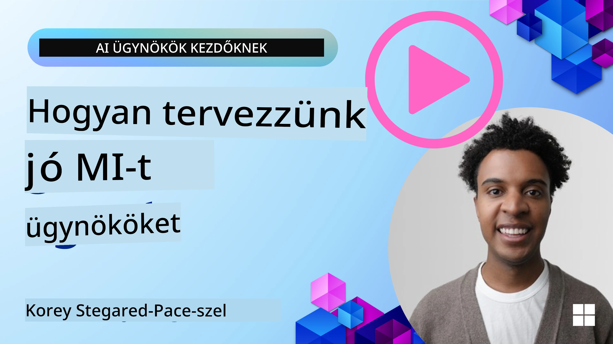
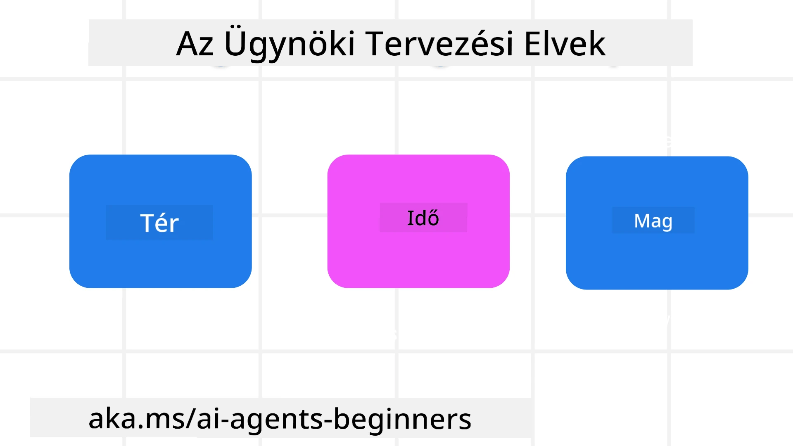

> _(A fenti képre kattintva megtekintheti az óra videóját)_
# AI Ügynöki Tervezési Elvek

## Bevezetés

Számos módja van az AI ügynöki rendszerek építésére való gondolkodásnak. Mivel az ambiguitás a Generatív AI tervezésében inkább jellemző, mint hiba, néha nehéz a mérnököknek eldönteni, hogy hol kezdjék el. Létrehoztunk egy emberközpontú UX Tervezési Elvek sorozatát, hogy lehetővé tegyük a fejlesztők számára ügyfélközpontú ügynöki rendszerek készítését üzleti igényeik megoldására. Ezek a tervezési elvek nem előíró architektúrák, hanem inkább egy kiindulópont a csapatok számára, akik meghatározzák és építik az ügynöki élményeket.

Általánosságban az ügynököknek a következőket kellene tenniük:

- Növelni és szélesíteni az emberi képességeket (ötletelés, problémamegoldás, automatizálás stb.)
- Kitölteni a tudásréseket (felzárkóztatni tudományos területeken, fordítás stb.)
- Elősegíteni és támogatni az együttműködést olyan módokon, ahogy egyének szeretnek másokkal dolgozni
- Jobbá tenni minket önmagunk legjobb változataiként (pl. életvezetési tanácsadó/feladatkezelő, érzelmi szabályozás és tudatosság fejlesztése, reziliencia építése stb.)

## Amit ez az óra lefed

- Mik az ügynöki tervezési elvek
- Milyen irányelveket kell követni ezeknek az elveknek a megvalósítása közben
- Példák az elvek alkalmazására

## Tanulási célok

Az óra elvégzése után képes leszel:

1. Elmagyarázni, mik az ügynöki tervezési elvek
2. Elmagyarázni az irányelveket az elvek használatához
3. Megérteni, hogyan kell ügynököt építeni az ügynöki tervezési elvek alapján

## Az ügynöki tervezési elvek

### Ügynök (Tér)

Ez a környezet, amelyben az ügynök működik. Ezek az elvek tájékoztatják, hogyan tervezzünk ügynököket a fizikai és digitális világban való részvételre.

- **Kapcsolódás, nem összeomlás** – segítsük az embereket más emberekhez, eseményekhez és alkalmazható tudáshoz kapcsolódni az együttműködés és kapcsolódás elősegítésére.
- Az ügynökök segítenek eseményeket, tudást és embereket összekapcsolni.
- Az ügynökök közelebb hozzák az embereket egymáshoz. Nem arra terveztek, hogy helyettesítsék vagy lekicsinyeljék az embereket.
- **Könnyen hozzáférhető, de alkalmanként láthatatlan** – az ügynök nagy részt a háttérben működik, csak akkor ösztönöz minket, amikor releváns és megfelelő.
  - Az ügynök könnyen felfedezhető és elérhető a jogosult felhasználók számára bármilyen eszközön vagy platformon.
  - Az ügynök támogatja a multimodális bemeneteket és kimeneteket (hang, beszéd, szöveg stb.).
  - Az ügynök zökkenőmentesen válthat előtér és háttér között; proaktív és reaktív mód között, a felhasználói igények érzékelése szerint.
  - Az ügynök láthatatlan formában is működhet, de háttérfolyamata és más ügynökökkel való együttműködése átlátható és a felhasználó által irányítható.

### Ügynök (Idő)

Ahogy az ügynök az időben működik. Ezek az elvek tájékoztatják, hogyan tervezzünk ügynököket, amelyek a múlt, jelen és jövő között lépnek kapcsolatba.

- **Múlt**: A történelem visszatekintése, amely magában foglalja az állapotot és a kontextust is.
  - Az ügynök relevánsabb eredményeket nyújt a gazdagabb történelmi adatok elemzése alapján, nem csak az események, emberek vagy állapotok figyelembevételével.
  - Az ügynök kapcsolatokat teremt a múlt eseményei között, aktívan reflektál az emlékezetre, hogy alkalmazkodjon a jelen helyzetekhez.
- **Most**: Több, mint értesítés, ösztönzés.
  - Az ügynök átfogó megközelítést testesít meg az emberekkel való interakcióban. Amikor esemény történik, az ügynök túlmutat a statikus értesítésen vagy más statikus formátumon. Egyszerűsítheti a folyamatokat vagy dinamikusan generálhat jeleket, hogy irányítsa a felhasználó figyelmét a megfelelő pillanatban.
  - Az ügynök az adott kontextus, társadalmi és kulturális változások, valamint a felhasználó szándéka szerint adja át az információt.
  - Az ügynökkel való interakció fokozatos, fejlődő/növekvő komplexitású, hogy hosszú távon erőt adjon a felhasználóknak.
- **Jövő**: Alkalmazkodás és fejlődés.
  - Az ügynök különböző eszközökhöz, platformokhoz és modalitásokhoz alkalmazkodik.
  - Az ügynök alkalmazkodik a felhasználói viselkedéshez, hozzáférhetőségi igényekhez és szabadon testreszabható.
  - Az ügynök formálódik és fejlődik a folyamatos felhasználói interakciók által.

### Ügynök (Mag)

Ezek a kulcsfontosságú elemek az ügynök tervezésének magjában.

- **Fogadd el a bizonytalanságot, de teremts bizalmat**.
  - Az ügynök bizonyos szintű bizonytalansága elvárt. A bizonytalanság az ügynöki tervezés kulcsfontosságú eleme.
  - A bizalom és átláthatóság az ügynöki tervezés alapvető rétegei.
  - Az emberek irányítják, mikor van az ügynök be- vagy kikapcsolva, és az ügynök állapota mindig jól látható.

## Irányelvek ezen elvek megvalósításához

Amikor a fent említett tervezési elveket alkalmazod, használd a következő irányelveket:

1. **Átláthatóság**: Tájékoztasd a felhasználót, hogy AI érintett, hogyan működik (beleértve a múltbeli tevékenységeket), hogyan lehet visszajelzést adni és módosítani a rendszert.
2. **Irányítás**: Tedd lehetővé a felhasználó számára, hogy testreszabja, megadja preferenciáit, személyre szabja, és kontrollt gyakoroljon a rendszer és annak jellemzői felett (beleértve a felejtés képességét).
3. **Konzisztencia**: Törekedj következetes, multimodális élményekre eszközök és végpontok között. Használj ismerős UI/UX elemeket, ahol lehet (pl. mikrofon ikon a hangalapú interakcióhoz), és csökkentsd a felhasználó kognitív terhelését, ahogy csak lehet (pl. tömör válaszok, vizuális segédletek és „Tudj meg többet” tartalom).

## Hogyan tervezzünk utazási ügynököt ezeknek az elveknek és irányelveknek a használatával

Képzeld el, hogy utazási ügynököt tervezel, így gondolkodhatsz az elvek és irányelvek alkalmazásáról:

1. **Átláthatóság** – Tudatosítsd a felhasználóban, hogy az Utazási Ügynök AI-alapú ügynök. Adj alapvető utasításokat a kezdéshez (pl. „Helló” üzenet, minta kérdések). Világosan dokumentáld ezt a termékoldalon. Mutasd meg a felhasználó által korábban feltett kérdések listáját. Tedd világossá, hogyan lehet visszajelzést adni (fel/le mutató hüvelykujj, Visszajelzés küldése gomb stb.). Egyértelműen jelezd, ha az ügynök használati vagy témakorlátozásokkal rendelkezik.
2. **Irányítás** – Gondoskodj róla, hogy egyértelmű legyen, hogyan módosíthatja a felhasználó az Ügynököt a létrehozása után a Rendszer Üzenettel. Engedd meg a felhasználónak, hogy kiválassza, mennyire részletes legyen az ügynök, milyen stílusban írjon, és milyen témákról ne beszéljen. Tedd lehetővé a kapcsolódó fájlok, adatok, kérdések és előző beszélgetések megtekintését és törlését.
3. **Konzisztencia** – Biztosítsd, hogy a megosztás, fájl vagy fénykép hozzáadása és valaki vagy valami megjelölése ikonok szabványosak és felismerhetőek legyenek. Használd a gemkapocs ikont a fájl feltöltésének/megosztásának jelezésére az Ügynökkel, és a kép ikont a grafika feltöltésére.

## Minta kódok

- Python: [Agent Framework](./code_samples/03-python-agent-framework.ipynb)
- .NET: [Agent Framework](./code_samples/03-dotnet-agent-framework.md)

## Több kérdésed van az AI ügynöki tervezési mintákról?

Csatlakozz a [Microsoft Foundry Discord](https://discord.com/invite/ATgtXmAS5D) közösséghez, hogy találkozz más tanulókkal, részt vegyél konzultációkon és választ kapj AI ügynöki kérdéseidre.

## További források

- <a href="https://openai.com" target="_blank">Agenti AI Rendszerek Irányítási Gyakorlatai | OpenAI</a>
- <a href="https://microsoft.com" target="_blank">A HAX Eszköztár Projekt - Microsoft Research</a>
- <a href="https://responsibleaitoolbox.ai" target="_blank">Felelős AI Eszköztár</a>

## Előző óra

[Az ügynöki keretrendszerek felfedezése](../02-explore-agentic-frameworks/README.md)

## Következő óra

[Eszközhasználati tervezési minta](../04-tool-use/README.md)

---

<!-- CO-OP TRANSLATOR DISCLAIMER START -->
**Jogi nyilatkozat**:
Ez a dokumentum az AI fordítási szolgáltatás, a [Co-op Translator](https://github.com/Azure/co-op-translator) segítségével készült. Bár az pontosságra törekszünk, kérjük, vegye figyelembe, hogy az automatikus fordítások hibákat vagy pontatlanságokat tartalmazhatnak. Az eredeti dokumentum az anyanyelvén tekintendő hiteles forrásnak. Fontos információk esetén professzionális emberi fordítást javasolunk. Nem vállalunk felelősséget semmilyen félreértésért vagy téves értelmezésért, amely ebből a fordításból ered.
<!-- CO-OP TRANSLATOR DISCLAIMER END -->