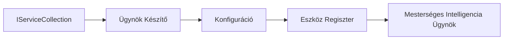

# 🎨 Agentikus tervezési minták Azure OpenAI-jal (Responses API) (.NET)

## 📋 Tanulási célok

Ez a példa bemutatja a vállalati szintű tervezési mintákat intelligens ügynökök építéséhez a Microsoft Agent Framework használatával .NET-ben az Azure OpenAI (Responses API) integrációval. Megtanulod a professzionális mintákat és az architekturális megközelítéseket, amelyek segítségével az ügynökök gyártásra kész, karbantartható és skálázható rendszerek lesznek.

### Vállalati tervezési minták

- 🏭 **Factory Pattern**: Szabványosított ügynök létrehozás függőség-injektálással
- 🔧 **Builder Pattern**: Folyékony ügynök konfiguráció és beállítás
- 🧵 **Thread-Safe Patterns**: Egyidejű beszélgetéskezelés
- 📋 **Repository Pattern**: Szervezett eszköz- és képességkezelés

## 🎯 .NET Specifikus Architektúrális Előnyök

### Vállalati jellemzők

- **Erős típusosság**: Fordítási időbeni ellenőrzés és IntelliSense támogatás
- **Függőség injektálás**: Beépített DI konténer integráció
- **Konfigurációkezelés**: IConfiguration és Options minták
- **Async/Await**: Elsőrangú aszinkron programozás támogatás

### Gyártásra kész minták

- **Naplózás integráció**: ILogger és strukturált naplózás támogatás
- **Egészségügyi ellenőrzések**: Beépített monitorozás és diagnosztika
- **Konfiguráció érvényesítés**: Erős típusosság adat annotációkkal
- **Hibakezelés**: Strukturált kivételkezelés

## 🔧 Műszaki architektúra

### Alapvető .NET komponensek

- **Microsoft.Extensions.AI**: Egységesített AI szolgáltatás absztrakciók
- **Microsoft.Agents.AI**: Vállalati ügynök-összehangoló keretrendszer
- **Azure OpenAI (Responses API)**: Nagy teljesítményű API kliens minták
- **Konfigurációs rendszer**: appsettings.json és környezeti integráció

### Tervezési minta megvalósítás



## 🏗️ Bemutatott vállalati minták

### 1. **Létrehozó minták**

- **Agent Factory**: Központosított ügynöklétrehozás egységes konfigurációval
- **Builder Pattern**: Folyékony API összetett ügynök konfigurációhoz
- **Singleton Pattern**: Megosztott erőforrások és konfigurációkezelés
- **Függőség injektálás**: Laza kapcsolás és tesztelhetőség

### 2. **Viselkedési minták**

- **Strategy Pattern**: Felcserélhető eszköz végrehajtási stratégiák
- **Command Pattern**: Lekapszulázott ügynök műveletek visszavonással/újra végrehajtással
- **Observer Pattern**: Eseményvezérelt ügynök életciklus-kezelés
- **Template Method**: Szabványosított ügynök végrehajtási munkafolyamatok

### 3. **Szerkezeti minták**

- **Adapter Pattern**: Azure OpenAI (Responses API) integrációs réteg
- **Decorator Pattern**: Ügynök képességbővítés
- **Facade Pattern**: Egyszerűsített ügynök interakciós felületek
- **Proxy Pattern**: Lusta betöltés és gyorsítótárazás a teljesítményért

## 📚 .NET Tervezési Elvek

### SOLID Elvek

- **Single Responsibility**: Minden komponensnek egyértelmű célja van
- **Open/Closed**: Bővíthető módosítás nélkül
- **Liskov Substitution**: Interfész alapú eszköz implementációk
- **Interface Segregation**: Fókuszált, koherens interfészek
- **Dependency Inversion**: Absztrakciókra, nem konkrétumokra támaszkodunk

### Tiszta architektúra

- **Domain Layer**: Alapvető ügynök és eszköz absztrakciók
- **Application Layer**: Ügynök összehangolás és munkafolyamatok
- **Infrastructure Layer**: Azure OpenAI (Responses API) integráció és külső szolgáltatások
- **Presentation Layer**: Felhasználói interakció és válasz formázás

## 🔒 Vállalati megfontolások

### Biztonság

- **Hitelesítő adatok kezelése**: Biztonságos API kulcs kezelés IConfiguration-n keresztül
- **Bemeneti érvényesítés**: Erős típusosság és adat annotáció érvényesítés
- **Kimeneti tisztítás**: Biztonságos válasz feldolgozás és szűrés
- **Audit naplózás**: Átfogó műveletkövetés

### Teljesítmény

- **Aszinkron minták**: Nem blokkoló I/O műveletek
- **Kapcsolat poolozás**: Hatékony HTTP kliens kezelés
- **Gyorsítótárazás**: Válasz gyorsítótárazás a jobb teljesítményért
- **Erőforrás-kezelés**: Megfelelő felszabadítás és takarítás

### Skálázhatóság

- **Szálbiztonság**: Egyidejű ügynök végrehajtás támogatás
- **Erőforrás poolozás**: Hatékony erőforrás kihasználás
- **Terhelés kezelése**: Sebességkorlátozás és vissznyomás kezelése
- **Monitorozás**: Teljesítménymutatók és egészségügyi ellenőrzések

## 🚀 Gyártási telepítés

- **Konfigurációkezelés**: Környezet specifikus beállítások
- **Naplózási stratégia**: Strukturált naplózás korrelációs azonosítókkal
- **Hibakezelés**: Globális kivételkezelés megfelelő helyreállítással
- **Monitorozás**: Alkalmazás insights és teljesítmény számlálók
- **Tesztelés**: Egységtesztek, integrációs tesztek és terheléses tesztelési minták

Készen állsz vállalati szintű intelligens ügynökök építésére .NET-tel? Építsünk valami masszívat! 🏢✨

## 🚀 Első lépések

### Előfeltételek

- [.NET 10 SDK](https://dotnet.microsoft.com/download/dotnet/10.0) vagy újabb
- Egy [Azure előfizetés](https://azure.microsoft.com/free/) Azure OpenAI erőforrással és modell telepítéssel
- Az [Azure CLI](https://learn.microsoft.com/cli/azure/install-azure-cli) — jelentkezz be `az login` parancsal

### Kötelező környezeti változók

```bash
# zsh/bash
export AZURE_OPENAI_ENDPOINT=https://<your-resource>.openai.azure.com
export AZURE_OPENAI_DEPLOYMENT=gpt-4o-mini
# Ezután jelentkezzen be, hogy az AzureCliCredential megszerezhesse a tokent
az login
```

```powershell
# PowerShell
$env:AZURE_OPENAI_ENDPOINT = "https://<your-resource>.openai.azure.com"
$env:AZURE_OPENAI_DEPLOYMENT = "gpt-4o-mini"
# Ezután jelentkezzen be, hogy az AzureCliCredential tokenhez jusson
az login
```

### Példakód

A kód példa futtatásához,

```bash
# zsh/bash
chmod +x ./03-dotnet-agent-framework.cs
./03-dotnet-agent-framework.cs
```

Vagy a dotnet CLI használatával:

```bash
dotnet run ./03-dotnet-agent-framework.cs
```

Lásd a [`03-dotnet-agent-framework.cs`](../../../../03-agentic-design-patterns/code_samples/03-dotnet-agent-framework.cs) fájlt a teljes kódhoz.

```csharp
#!/usr/bin/dotnet run

#:package Microsoft.Extensions.AI@10.*
#:package Microsoft.Agents.AI.OpenAI@1.*-*
#:package Azure.AI.OpenAI@2.1.0
#:package Azure.Identity@1.13.1

using System.ComponentModel;

using Microsoft.Agents.AI;
using Microsoft.Extensions.AI;

using Azure.AI.OpenAI;
using Azure.Identity;

// Tool Function: Random Destination Generator
// This static method will be available to the agent as a callable tool
// The [Description] attribute helps the AI understand when to use this function
// This demonstrates how to create custom tools for AI agents
[Description("Provides a random vacation destination.")]
static string GetRandomDestination()
{
    // List of popular vacation destinations around the world
    // The agent will randomly select from these options
    var destinations = new List<string>
    {
        "Paris, France",
        "Tokyo, Japan",
        "New York City, USA",
        "Sydney, Australia",
        "Rome, Italy",
        "Barcelona, Spain",
        "Cape Town, South Africa",
        "Rio de Janeiro, Brazil",
        "Bangkok, Thailand",
        "Vancouver, Canada"
    };

    // Generate random index and return selected destination
    // Uses System.Random for simple random selection
    var random = new Random();
    int index = random.Next(destinations.Count);
    return destinations[index];
}

// Azure OpenAI with the Responses API (stable v1 endpoint). Sign in with `az login`.
var azureEndpoint = Environment.GetEnvironmentVariable("AZURE_OPENAI_ENDPOINT")
    ?? throw new InvalidOperationException("AZURE_OPENAI_ENDPOINT is not set.");
var deployment = Environment.GetEnvironmentVariable("AZURE_OPENAI_DEPLOYMENT") ?? "gpt-4o-mini";

var azureClient = new AzureOpenAIClient(new Uri(azureEndpoint), new AzureCliCredential());

// Define Agent Identity and Comprehensive Instructions
// Agent name for identification and logging purposes
var AGENT_NAME = "TravelAgent";

// Detailed instructions that define the agent's personality, capabilities, and behavior
// This system prompt shapes how the agent responds and interacts with users
var AGENT_INSTRUCTIONS = """
You are a helpful AI Agent that can help plan vacations for customers.

Important: When users specify a destination, always plan for that location. Only suggest random destinations when the user hasn't specified a preference.

When the conversation begins, introduce yourself with this message:
"Hello! I'm your TravelAgent assistant. I can help plan vacations and suggest interesting destinations for you. Here are some things you can ask me:
1. Plan a day trip to a specific location
2. Suggest a random vacation destination
3. Find destinations with specific features (beaches, mountains, historical sites, etc.)
4. Plan an alternative trip if you don't like my first suggestion

What kind of trip would you like me to help you plan today?"

Always prioritize user preferences. If they mention a specific destination like "Bali" or "Paris," focus your planning on that location rather than suggesting alternatives.
""";

// Create AI Agent with Advanced Travel Planning Capabilities
// Get the Responses client for the deployment and create the AI agent
// Configure agent with name, detailed instructions, and available tools
// This demonstrates the .NET agent creation pattern with full configuration
AIAgent agent = azureClient
    .GetOpenAIResponseClient(deployment)
    .CreateAIAgent(
        name: AGENT_NAME,
        instructions: AGENT_INSTRUCTIONS,
        tools: [AIFunctionFactory.Create(GetRandomDestination)]
    );

// Create New Conversation Thread for Context Management
// Initialize a new conversation thread to maintain context across multiple interactions
// Threads enable the agent to remember previous exchanges and maintain conversational state
// This is essential for multi-turn conversations and contextual understanding
AgentThread thread = agent.GetNewThread();

// Execute Agent: First Travel Planning Request
// Run the agent with an initial request that will likely trigger the random destination tool
// The agent will analyze the request, use the GetRandomDestination tool, and create an itinerary
// Using the thread parameter maintains conversation context for subsequent interactions
await foreach (var update in agent.RunStreamingAsync("Plan me a day trip", thread))
{
    await Task.Delay(10);
    Console.Write(update);
}

Console.WriteLine();

// Execute Agent: Follow-up Request with Context Awareness
// Demonstrate contextual conversation by referencing the previous response
// The agent remembers the previous destination suggestion and will provide an alternative
// This showcases the power of conversation threads and contextual understanding in .NET agents
await foreach (var update in agent.RunStreamingAsync("I don't like that destination. Plan me another vacation.", thread))
{
    await Task.Delay(10);
    Console.Write(update);
}
```

---

<!-- CO-OP TRANSLATOR DISCLAIMER START -->
**Jogi nyilatkozat**:
Ez a dokumentum az AI fordítási szolgáltatás, a [Co-op Translator](https://github.com/Azure/co-op-translator) segítségével készült. Bár az pontosságra törekszünk, kérjük, vegye figyelembe, hogy az automatikus fordítások hibákat vagy pontatlanságokat tartalmazhatnak. Az eredeti dokumentum az anyanyelvén tekintendő hiteles forrásnak. Fontos információk esetén professzionális emberi fordítást javasolunk. Nem vállalunk felelősséget semmilyen félreértésért vagy téves értelmezésért, amely ebből a fordításból ered.
<!-- CO-OP TRANSLATOR DISCLAIMER END -->