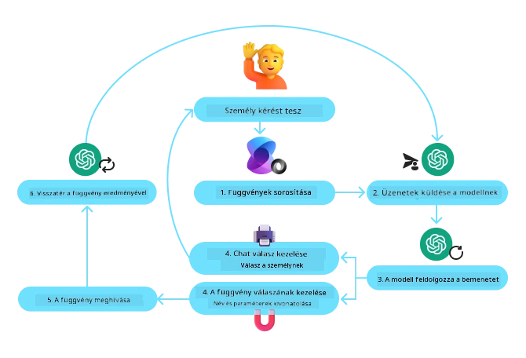
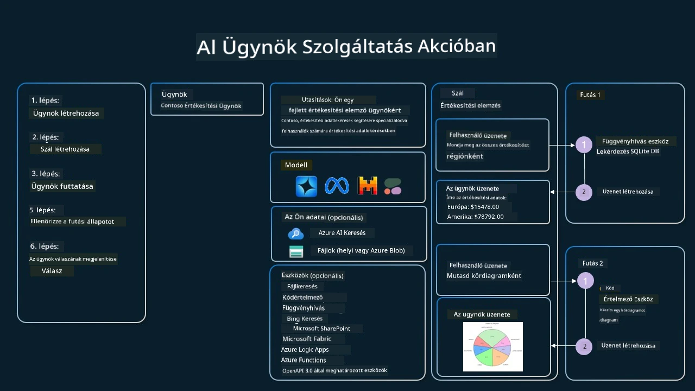

[](https://youtu.be/vieRiPRx-gI?si=cEZ8ApnT6Sus9rhn)

> _(Kattintson a fenti képre a lecke videójának megtekintéséhez)_

# Eszközhasználati tervezési minta

Az eszközök érdekesek, mert lehetővé teszik, hogy az AI-ügynökök szélesebb körű képességekkel rendelkezzenek. Ahelyett, hogy az ügynöknek csak korlátozott számú művelete lenne, egy eszköz hozzáadásával az ügynök most már sokféle műveletet képes végrehajtani. Ebben a fejezetben megvizsgáljuk az Eszközhasználati tervezési mintát, amely leírja, hogyan használhatnak az AI-ügynökök specifikus eszközöket céljaik eléréséhez.

## Bevezetés

Ebben a leckében a következő kérdésekre keressük a választ:

- Mi az eszközhasználati tervezési minta?
- Milyen alkalmazási esetekre alkalmazható?
- Mely elemek/építőkövek szükségesek a tervezési minta megvalósításához?
- Milyen különleges megfontolások szükségesek az Eszközhasználati tervezési minta alkalmazásához megbízható AI-ügynökök építésekor?

## Tanulási célok

A lecke elvégzése után képes lesz:

- Meghatározni az Eszközhasználati tervezési mintát és annak célját.
- Azonosítani azokat az alkalmazási eseteket, ahol az Eszközhasználati tervezési minta alkalmazható.
- Megérteni a tervezési minta megvalósításához szükséges kulcselemeket.
- Felismerni a megbízhatóság biztosításához szükséges megfontolásokat az eszközhasználatot alkalmazó AI-ügynökök esetén.

## Mi az Eszközhasználati tervezési minta?

Az Eszközhasználati tervezési minta arra összpontosít, hogy a nagy nyelvi modelleknek (LLM-eknek) képességet adjon külső eszközökkel való interakcióra meghatározott célok elérése érdekében. Az eszközök olyan kódok, amelyeket egy ügynök végrehajthat műveletek elvégzésére. Egy eszköz lehet egy egyszerű függvény, mint például egy számológép, vagy egy harmadik fél szolgáltatásának API-hívása, például részvényár-keresés vagy időjárás-előrejelzés. Az AI-ügynökök kontextusában az eszközöket úgy tervezik, hogy az ügynökök a modell által generált függvényhívásokra válaszul hajtsák végre őket.

## Milyen alkalmazási esetekre alkalmazható?

Az AI-ügynökök eszközöket használhatnak összetett feladatok elvégzésére, információk lekérésére vagy döntéshozatalra. Az eszközhasználati tervezési mintát gyakran alkalmazzák dinamikus interakciót igénylő helyzetekben, mint például adatbázisok, webszolgáltatások vagy kódértelmezők. Ez a képesség számos különböző alkalmazási esetben hasznos, többek között:

- **Dinamikus információlekérés:** Az ügynökök külső API-kat vagy adatbázisokat kérdezhetnek le naprakész adatokért (pl. SQLite-adatbázis lekérdezése elemzéshez, részvényárak vagy időjárás lekérése).
- **Kódvégrehajtás és értelmezés:** Az ügynökök kódot vagy szkripteket hajthatnak végre matematikai problémák megoldásához, jelentések generálásához vagy szimulációk futtatásához.
- **Folyamatautomatizálás:** Ismétlődő vagy többlépéses munkafolyamatok automatizálása olyan eszközökkel integrálva, mint felad ütemezők, e-mail szolgáltatások vagy adatcsővezetékek.
- **Ügyfélszolgálat:** Az ügynökök CRM rendszerekkel, jegykezelő platformokkal vagy tudásbázisokkal léphetnek kapcsolatba a felhasználói kérdések megoldásához.
- **Tartalomgenerálás és szerkesztés:** Az ügynökök olyan eszközöket használhatnak, mint helyesírás- és nyelvtani ellenőrzők, szövegösszefoglalók vagy tartalombiztonsági értékelők a tartalomkészítés támogatására.

## Mely elemek/építőkövek szükségesek az eszközhasználati tervezési minta megvalósításához?

Ezek az építőkövek lehetővé teszik az AI-ügynök számára, hogy széles körű feladatokat hajtson végre. Nézzük meg a kulcselemeket, amelyek szükségesek az Eszközhasználati tervezési minta megvalósításához:

- **Funkció/Eszköz sémák**: Részletes meghatározások az elérhető eszközökről, beleértve a függvény nevét, célját, a szükséges paramétereket és a várt kimeneteket. Ezek a sémák lehetővé teszik az LLM számára, hogy megértse, milyen eszközök állnak rendelkezésre és hogyan kell érvényes kéréseket összeállítani.

- **Funkció végrehajtási logika**: Szabályozza, hogyan és mikor hívják meg az eszközöket a felhasználó szándéka és a beszélgetés kontextusa alapján. Ez magában foglalhat tervező modulokat, útválasztó mechanizmusokat vagy feltételes folyamatokat, amelyek dinamikusan határozzák meg az eszközhasználatot.

- **Üzenetkezelő rendszer**: Olyan összetevők, amelyek kezelik a beszélgetési folyamatot a felhasználói bevitelek, LLM-válaszok, eszközhívások és eszközkimenetek között.

- **Eszközintegrációs keretrendszer**: Az infrastruktúra, amely összeköti az ügynököt különféle eszközökkel, legyenek azok egyszerű függvények vagy összetett külső szolgáltatások.

- **Hiba kezelés és validálás**: Mechanizmusok az eszközvégrehajtás hibáinak kezelésére, a paraméterek érvényesítésére és a váratlan válaszok kezelésére.

- **Állapotkezelés**: Követi a beszélgetés kontextusát, a korábbi eszközinterakciókat és a tartós adatokat annak érdekében, hogy következetességet biztosítson a többszörös fordulós interakciók során.

Most nézzük meg a Funkció/Eszköz hívást részletesebben.
 
### Funkció/Eszköz hívás

A funkcióhívás az a fő mód, ahogyan lehetővé tesszük a nagy nyelvi modellek (LLM-ek) számára az eszközökkel való interakciót. Gyakran találkozhatunk azzal, hogy 'Function' és 'Tool' felcserélhetően szerepel, mert a 'funkciók' (újrahasznosítható kódblokkok) azok az 'eszközök', amelyeket az ügynökök a feladatok végrehajtásához használnak. Ahhoz, hogy egy függvény kódja végrehajtásra kerüljön, az LLM-nek össze kell hasonlítania a felhasználó kérését a függvény leírásával. Ennek érdekében egy sémát, amely tartalmazza az összes elérhető függvény leírását, elküldünk az LLM-nek. Az LLM ezután kiválasztja a feladathoz legmegfelelőbb függvényt és visszaadja annak nevét és argumentumait. A kiválasztott függvény meghívásra kerül, a válasza visszaküldésre kerül az LLM-nek, amely ezt az információt felhasználva válaszol a felhasználó kérésére.

A fejlesztőknek a függvényhívás ügynökök számára történő megvalósításához szükségük lesz:

1. Egy olyan LLM modellre, amely támogatja a függvényhívást
2. Egy sémára, amely tartalmazza a függvények leírásait
3. A leírt függvények kódjára

Vegyük példának a város aktuális idejének lekérését a szemléltetéshez:

1. **Inicializáljon egy olyan LLM-et, amely támogatja a függvényhívást:**

    Nem minden modell támogatja a függvényhívást, ezért fontos ellenőrizni, hogy az általunk használt LLM képes-e erre.     <a href="https://learn.microsoft.com/azure/ai-services/openai/how-to/function-calling" target="_blank">Azure OpenAI</a> támogatja a függvényhívást. Kezdhetjük az Azure OpenAI kliens inicializálásával. 

    ```python
    # Inicializálja az Azure OpenAI klienst
    client = AzureOpenAI(
        azure_endpoint = os.getenv("AZURE_AI_PROJECT_ENDPOINT"), 
        api_key=os.getenv("AZURE_OPENAI_API_KEY"),  
        api_version="2024-05-01-preview"
    )
    ```

1. **Hozzon létre egy Funkció Sémát**:

    Ezután definiálunk egy JSON sémát, amely tartalmazza a függvény nevét, a függvény működésének leírását, valamint a függvényparaméterek neveit és leírását.
    Ezt a sémát átadjuk az előzőleg létrehozott kliensnek, együtt a felhasználó kérésével, hogy megtaláljuk a San Francisco-i időt. Fontos megjegyezni, hogy ami visszatér, az egy **eszközhívás**, **nem** a kérdés végső válasza. Mint korábban említettük, az LLM visszaadja a feladat számára kiválasztott függvény nevét és az átadandó argumentumokat.

    ```python
    # A modell számára olvasandó függvény leírása
    tools = [
        {
            "type": "function",
            "function": {
                "name": "get_current_time",
                "description": "Get the current time in a given location",
                "parameters": {
                    "type": "object",
                    "properties": {
                        "location": {
                            "type": "string",
                            "description": "The city name, e.g. San Francisco",
                        },
                    },
                    "required": ["location"],
                },
            }
        }
    ]
    ```
   
    ```python
  
    # Kezdeti felhasználói üzenet
    messages = [{"role": "user", "content": "What's the current time in San Francisco"}] 
  
    # Első API-hívás: Kérd a modellt, hogy használja a függvényt
      response = client.chat.completions.create(
          model=deployment_name,
          messages=messages,
          tools=tools,
          tool_choice="auto",
      )
  
      # Feldolgozd a modell válaszát
      response_message = response.choices[0].message
      messages.append(response_message)
  
      print("Model's response:")  

      print(response_message)
  
    ```

    ```bash
    Model's response:
    ChatCompletionMessage(content=None, role='assistant', function_call=None, tool_calls=[ChatCompletionMessageToolCall(id='call_pOsKdUlqvdyttYB67MOj434b', function=Function(arguments='{"location":"San Francisco"}', name='get_current_time'), type='function')])
    ```
  
1. **A feladat végrehajtásához szükséges függvénykód:**

    Miután az LLM kiválasztotta, melyik függvényt kell futtatni, a feladatot végrehajtó kódot implementálni és végrehajtani kell.
    Megvalósíthatjuk a kódot az aktuális idő lekéréséhez Pythonban. A végső eredményhez szükség lesz kódra is, amely kinyeri a response_message-ből a névét és az argumentumokat.

    ```python
      def get_current_time(location):
        """Get the current time for a given location"""
        print(f"get_current_time called with location: {location}")  
        location_lower = location.lower()
        
        for key, timezone in TIMEZONE_DATA.items():
            if key in location_lower:
                print(f"Timezone found for {key}")  
                current_time = datetime.now(ZoneInfo(timezone)).strftime("%I:%M %p")
                return json.dumps({
                    "location": location,
                    "current_time": current_time
                })
      
        print(f"No timezone data found for {location_lower}")  
        return json.dumps({"location": location, "current_time": "unknown"})
    ```

     ```python
     # Függvényhívások kezelése
      if response_message.tool_calls:
          for tool_call in response_message.tool_calls:
              if tool_call.function.name == "get_current_time":
     
                  function_args = json.loads(tool_call.function.arguments)
     
                  time_response = get_current_time(
                      location=function_args.get("location")
                  )
     
                  messages.append({
                      "tool_call_id": tool_call.id,
                      "role": "tool",
                      "name": "get_current_time",
                      "content": time_response,
                  })
      else:
          print("No tool calls were made by the model.")  
  
      # Második API-hívás: A modell végső válaszának lekérése
      final_response = client.chat.completions.create(
          model=deployment_name,
          messages=messages,
      )
  
      return final_response.choices[0].message.content
     ```

     ```bash
      get_current_time called with location: San Francisco
      Timezone found for san francisco
      The current time in San Francisco is 09:24 AM.
     ```

A funkcióhívás a legtöbb, ha nem az összes ügynök-eszközhasználati tervezés magja, azonban a nulláról történő megvalósítása néha kihívást jelenthet.
Ahogy a [2. lecke](../../../02-explore-agentic-frameworks) során megtanultuk, az agentikus keretrendszerek előre elkészített építőelemeket biztosítanak az eszközhasználat megvalósításához.
 
## Eszközhasználati példák agentikus keretrendszerekkel

Íme néhány példa arra, hogyan valósítható meg az Eszközhasználati tervezési minta különböző agentikus keretrendszerek használatával:

### Microsoft Agent Framework

<a href="https://learn.microsoft.com/azure/ai-services/agents/overview" target="_blank">Microsoft Agent Framework</a> egy nyílt forráskódú AI keretrendszer AI-ügynökök építéséhez. Egyszerűsíti a függvényhívás használatát azáltal, hogy lehetővé teszi eszközök definiálását Python függvényekként az `@tool` dekorátor segítségével. A keretrendszer kezeli a modell és a kód közötti oda-vissza kommunikációt. Emellett hozzáférést biztosít előre elkészített eszközökhöz, mint a File Search és a Code Interpreter az `AzureAIProjectAgentProvider` használatával.

A következő diagram a Microsoft Agent Frameworkkel történő függvényhívás folyamatát mutatja be:



A Microsoft Agent Frameworkben az eszközöket dekorált függvényekként definiáljuk. Az előzőleg látott `get_current_time` függvényt átalakíthatjuk eszközzé az `@tool` dekorátor használatával. A keretrendszer automatikusan sorosítja a függvényt és a paramétereit, létrehozva a sémát, amelyet az LLM-nek küldünk.

```python
from agent_framework import tool
from agent_framework.azure import AzureAIProjectAgentProvider
from azure.identity import AzureCliCredential

@tool
def get_current_time(location: str) -> str:
    """Get the current time for a given location"""
    ...

# Hozza létre a klienst
provider = AzureAIProjectAgentProvider(credential=AzureCliCredential())

# Hozzon létre egy ügynököt és futtassa az eszközzel
agent = await provider.create_agent(name="TimeAgent", instructions="Use available tools to answer questions.", tools=get_current_time)
response = await agent.run("What time is it?")
```
  
### Azure AI Agent Service

<a href="https://learn.microsoft.com/azure/ai-services/agents/overview" target="_blank">Azure AI Agent Service</a> egy újabb agentikus keretrendszer, amely arra lett tervezve, hogy lehetővé tegye a fejlesztők számára biztonságosan magas minőségű, bővíthető AI-ügynökök építését, telepítését és méretezését anélkül, hogy az alapul szolgáló számítási és tárolási erőforrásokat kellene kezelniük. Különösen hasznos vállalati alkalmazásokhoz, mivel teljesen felügyelt szolgáltatás vállalati szintű biztonsággal.

Az LLM API közvetlen használatához képest az Azure AI Agent Service néhány előnnyel jár, többek között:

- Automatikus eszközhívás – nincs szükség az eszközhívás elemzésére, az eszköz meghívására és a válasz kezelésére; mindez most szerveroldalon történik
- Biztonságosan kezelt adatok – ahelyett, hogy saját beszélgetési állapotát kezelné, a threadekre támaszkodhat az összes szükséges információ tárolásához
- Kész eszközök – Olyan eszközök, amelyekkel adatforrásaival léphet kapcsolatba, például Bing, Azure AI Search és Azure Functions.

Az Azure AI Agent Service-ben elérhető eszközök két kategóriába sorolhatók:

1. Tudáseszközök:
    - <a href="https://learn.microsoft.com/azure/ai-services/agents/how-to/tools/bing-grounding?tabs=python&pivots=overview" target="_blank">Grounding with Bing Search</a>
    - <a href="https://learn.microsoft.com/azure/ai-services/agents/how-to/tools/file-search?tabs=python&pivots=overview" target="_blank">File Search</a>
    - <a href="https://learn.microsoft.com/azure/ai-services/agents/how-to/tools/azure-ai-search?tabs=azurecli%2Cpython&pivots=overview-azure-ai-search" target="_blank">Azure AI Search</a>

2. Műveleti eszközök:
    - <a href="https://learn.microsoft.com/azure/ai-services/agents/how-to/tools/function-calling?tabs=python&pivots=overview" target="_blank">Function Calling</a>
    - <a href="https://learn.microsoft.com/azure/ai-services/agents/how-to/tools/code-interpreter?tabs=python&pivots=overview" target="_blank">Code Interpreter</a>
    - <a href="https://learn.microsoft.com/azure/ai-services/agents/how-to/tools/openapi-spec?tabs=python&pivots=overview" target="_blank">OpenAPI defined tools</a>
    - <a href="https://learn.microsoft.com/azure/ai-services/agents/how-to/tools/azure-functions?pivots=overview" target="_blank">Azure Functions</a>

A Agent Service lehetővé teszi, hogy ezeket az eszközöket egy `toolset`-ként használjuk együtt. Emellett `thread`-eket használ, amelyek nyomon követik egy adott beszélgetés üzenettörténetét.

Képzelje el, hogy Ön egy Contoso nevű cég értékesítési ügynöke. Olyan beszélgető ügynököt szeretne fejleszteni, amely képes válaszolni az értékesítési adataival kapcsolatos kérdésekre.

A következő kép azt illusztrálja, hogyan használhatná az Azure AI Agent Service-et az értékesítési adatok elemzéséhez:



Az említett eszközök bármelyikének használatához a szolgáltatással klienset hozhatunk létre és definiálhatunk egy eszközt vagy eszközkészletet. Gyakorlati megvalósításhoz a következő Python kódot használhatjuk. Az LLM meg tudja vizsgálni az eszközkészletet és eldöntheti, hogy a felhasználó által létrehozott `fetch_sales_data_using_sqlite_query` függvényt használja-e, vagy az előre elkészített Code Interpretert a felhasználói kérés függvényében.

```python 
import os
from azure.ai.projects import AIProjectClient
from azure.identity import DefaultAzureCredential
from fetch_sales_data_functions import fetch_sales_data_using_sqlite_query # A fetch_sales_data_using_sqlite_query függvény, amely megtalálható a fetch_sales_data_functions.py fájlban.
from azure.ai.projects.models import ToolSet, FunctionTool, CodeInterpreterTool

project_client = AIProjectClient.from_connection_string(
    credential=DefaultAzureCredential(),
    conn_str=os.environ["PROJECT_CONNECTION_STRING"],
)

# Eszközkészlet inicializálása
toolset = ToolSet()

# Függvényhívó ügynök inicializálása a fetch_sales_data_using_sqlite_query függvénnyel, és hozzáadása az eszközkészlethez
fetch_data_function = FunctionTool(fetch_sales_data_using_sqlite_query)
toolset.add(fetch_data_function)

# Code Interpreter eszköz inicializálása és hozzáadása az eszközkészlethez.
code_interpreter = code_interpreter = CodeInterpreterTool()
toolset.add(code_interpreter)

agent = project_client.agents.create_agent(
    model="gpt-4o-mini", name="my-agent", instructions="You are helpful agent", 
    toolset=toolset
)
```

## Milyen különleges megfontolások szükségesek az Eszközhasználati tervezési minta alkalmazásához megbízható AI-ügynökök építésekor?

Gyakori aggodalom a nagy nyelvi modellek által dinamikusan generált SQL-lel kapcsolatban a biztonság, különösen az SQL injection vagy rosszindulatú műveletek kockázata, mint például az adatbázis törlése vagy manipulálása. Bár ezek az aggályok jogosak, hatékonyan mérsékelhetők az adatbázishoz való hozzáférési jogosultságok megfelelő konfigurálásával. A legtöbb adatbázis esetében ez az adatbázis olvasási (read-only) üzemmódra állítását jelenti. Olyan adatbázis-szolgáltatásoknál, mint a PostgreSQL vagy az Azure SQL, az alkalmazásnak olvasási (SELECT) jogosultságot kell kapnia.

Az alkalmazás futtatása biztonságos környezetben tovább növeli a védelmet. Vállalati környezetben az adatok általában kinyerésre és átalakításra kerülnek az üzemeltetési rendszerekből egy olvasható adatbázisba vagy adattárházba felhasználóbarát sémával. Ez a megközelítés biztosítja, hogy az adatok biztonságosak, teljesítményre és hozzáférhetőségre optimalizáltak legyenek, és hogy az alkalmazás korlátozott, csak olvasási hozzáféréssel rendelkezzen.

## Példakódok

- Python: [Agent Framework](./code_samples/04-python-agent-framework.ipynb)
- .NET: [Agent Framework](./code_samples/04-dotnet-agent-framework.md)

## Több kérdése van az Eszközhasználati tervezési mintákkal kapcsolatban?

Csatlakozzon a [Microsoft Foundry Discord](https://aka.ms/ai-agents/discord)-hoz, hogy találkozzon más tanulókkal, részt vegyen office hour-okon és választ kapjon AI-ügynökökkel kapcsolatos kérdéseire.

## További források

- <a href="https://microsoft.github.io/build-your-first-agent-with-azure-ai-agent-service-workshop/" target="_blank">Azure AI Agents Service Workshop</a>
- <a href="https://github.com/Azure-Samples/contoso-creative-writer/tree/main/docs/workshop" target="_blank">Contoso Creative Writer Multi-Agent Workshop</a>
- <a href="https://learn.microsoft.com/azure/ai-services/agents/overview" target="_blank">Microsoft Agent Framework Overview</a>

## Előző lecke

[Az agentikus tervezési minták megértése](../03-agentic-design-patterns/README.md)

## Következő lecke
[Ügynöki RAG](../05-agentic-rag/README.md)

---

<!-- CO-OP TRANSLATOR DISCLAIMER START -->
**Felelősségkizárás**:
Ez a dokumentum a [Co-op Translator](https://github.com/Azure/co-op-translator) mesterséges intelligencia alapú fordítószolgáltatásával készült. Bár törekszünk a pontosságra, kérjük, vegye figyelembe, hogy az automatikus fordítások hibákat vagy pontatlanságokat tartalmazhatnak. Az eredeti, anyanyelvi dokumentum tekintendő hiteles forrásnak. Kritikus fontosságú információk esetén szakmai, emberi fordítást javaslunk. Nem vállalunk felelősséget az e fordítás használatából eredő félreértésekért vagy téves értelmezésekért.
<!-- CO-OP TRANSLATOR DISCLAIMER END -->