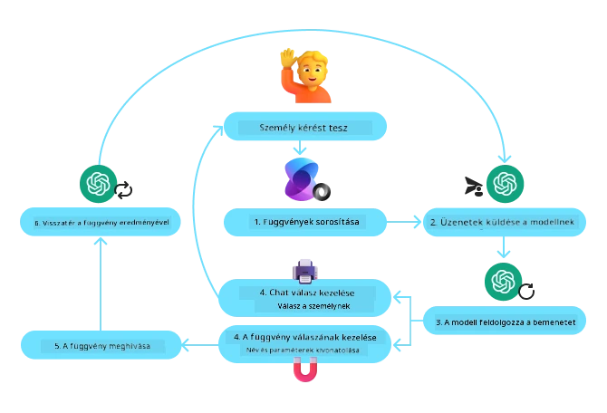
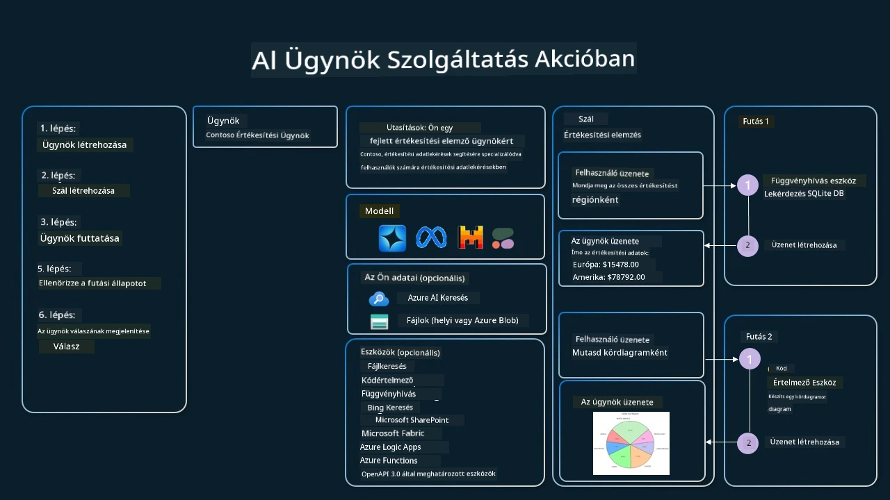

[](https://youtu.be/vieRiPRx-gI?si=cEZ8ApnT6Sus9rhn)

> _(Kattints a fenti képre a lecke videójának megtekintéséhez)_

# Eszközhasználati tervezési minta

Az eszközök érdekesek, mert lehetővé teszik az AI ügynökök számára, hogy szélesebb körű képességekkel rendelkezzenek. Ahelyett, hogy az ügynök korlátozott számú műveletet hajtana végre, egy eszköz hozzáadásával most már sokféle cselekvést végezhet. Ebben a fejezetben megvizsgáljuk az Eszközhasználati tervezési mintát, amely leírja, hogyan használhatnak az AI ügynökök specifikus eszközöket céljaik elérésére.

## Bevezetés

Ebben a leckében a következő kérdésekre keressük a választ:

- Mi az eszközhasználati tervezési minta?
- Milyen felhasználási esetekre alkalmazható?
- Milyen elemekre/építőkövekre van szükség a minta megvalósításához?
- Milyen különleges szempontokat kell figyelembe venni az Eszközhasználati tervezési minta alkalmazásakor megbízható AI ügynökök építéséhez?

## Tanulási célok

A lecke elvégzése után képes leszel:

- Meghatározni az Eszközhasználati tervezési mintát és célját.
- Azonosítani azokat a felhasználási eseteket, ahol alkalmazható az Eszközhasználati tervezési minta.
- Megérteni a minta megvalósításához szükséges kulcselemeket.
- Felismerni a megbízhatóság biztosításához szükséges szempontokat az AI ügynökökben ezen minta alkalmazásakor.

## Mi az Eszközhasználati tervezési minta?

Az **Eszközhasználati tervezési minta** arra koncentrál, hogy képessé tegye a nagy nyelvi modelleket (LLM-eket) arra, hogy külső eszközökkel kommunikáljanak adott célok elérése érdekében. Az eszközök kódok, amelyeket az ügynök végrehajthat műveletek elvégzésére. Egy eszköz lehet egy egyszerű függvény, például egy számológép, vagy egy harmadik féltől származó szolgáltatás API-hívása, például részvényárfolyam lekérdezése vagy időjárás-előrejelzés. Az AI ügynökök esetében az eszközöket úgy tervezik, hogy az ügynökök a **modell által generált függvényhívásokra** reagálva hajtsák végre őket.

## Milyen felhasználási esetekre alkalmazható?

Az AI ügynökök eszközöket használhatnak összetett feladatok elvégzésére, információk lekérdezésére vagy döntéshozatalra. Az eszközhasználati tervezési mintát gyakran alkalmazzák olyan helyzetekben, ahol dinamikus interakció szükséges külső rendszerekkel, például adatbázisokkal, webszolgáltatásokkal vagy kódértelmezőkkel. Ez a képesség számos különféle felhasználási esetben hasznos, többek között:

- **Dinamikus információlekérés:** Az ügynökök külső API-kat vagy adatbázisokat kérdezhetnek le naprakész adatokért (pl. SQLite adatbázis lekérdezése adat elemzéshez, részvényárfolyam vagy időjárási adatok lekérése).
- **Kódvégrehajtás és értelmezés:** Az ügynökök kódot vagy szkripteket futtathatnak matematikai problémák megoldására, jelentések generálására vagy szimulációk végrehajtására.
- **Munkafolyamat-automatizálás:** Ismétlődő vagy több lépéses munkafolyamatok automatizálása olyan eszközök integrálásával, mint feladatszervezők, e-mail szolgáltatások vagy adatcsővezetékek.
- **Ügyfélszolgálat:** Ügynökök CRM rendszerekkel, hibajegy-kezelő platformokkal vagy tudásbázisokkal való interakcióval oldhatják meg a felhasználók kérdéseit.
- **Tartalom generálás és szerkesztés:** Ügynökök használhatnak olyan eszközöket, mint nyelvtani ellenőrzők, szövegösszefoglalók vagy tartalombiztonsági értékelők, hogy segítsenek tartalom létrehozásában.

## Milyen elemekre/építőkövekre van szükség az eszközhasználati tervezési minta megvalósításához?

Ezek az építőkövek teszik lehetővé, hogy az AI ügynök széleskörű feladatokat végezzen el. Nézzük meg a Tool Use Design Pattern megvalósításához szükséges kulcselemeket:

- **Függvény/Eszköz sémák**: Részletes definíciók az elérhető eszközökről, beleértve a függvény nevét, célját, szükséges paramétereit és várt kimenetét. Ezek a sémák segítik az LLM-et megérteni, milyen eszközök állnak rendelkezésre és hogyan lehet érvényes kéréseket megfogalmazni.

- **Függvény végrehajtási logika**: Szabályozza, hogy a felhasználó szándéka és a beszélgetés kontextusa alapján mikor és hogyan hívják meg az eszközöket. Ez magában foglalhat tervező modulokat, útválasztó mechanizmusokat vagy feltételes folyamatokat, amelyek dinamikusan döntik el az eszközhasználatot.

- **Üzenetkezelő rendszer**: Az összetevők, amelyek kezelik a beszélgetési folyamatot a felhasználói bemenetek, LLM válaszok, eszközhívások és azok kimenete között.

- **Eszköz integrációs keretrendszer**: Az infrastruktúra, amely összekapcsolja az ügynököt különféle eszközökkel, akár egyszerű függvényekről, akár összetett külső szolgáltatásokról legyen szó.

- **Hibakezelés és érvényesítés**: Mechanizmusok az eszközvégrehajtás hibáinak kezelésére, paraméterek validálására és váratlan válaszok kezelésére.

- **Állapotkezelés**: Követi a beszélgetés kontextusát, előző eszközinterakciókat és perzisztens adatokat, hogy biztosítsa a következetességet több körös interakciók során.

Következőként nézzük meg részletesebben a Függvény/Eszköz hívást.
 
### Függvény/Eszköz hívás

A függvényhívás az elsődleges mód, amellyel lehetővé tesszük a nagy nyelvi modellek (LLM-ek) és az eszközök közötti interakciót. Gyakran használják felcserélhetően a 'függvény' és az 'eszköz' szavakat, mert a 'függvények' (újrahasználható kódrészek) az az eszközök, amelyeket az ügynökök a feladatok végrehajtására használnak. Ahhoz, hogy egy függvény kódját meghívják, az LLM-nek össze kell hasonlítania a felhasználó kérését a függvény leírásával. Ennek érdekében egy sémát, amely az összes elérhető függvény leírását tartalmazza, elküldik az LLM-nek. Az LLM kiválasztja a legmegfelelőbb függvényt a feladathoz, majd visszaadja annak nevét és argumentumait. A kiválasztott függvényt meghívják, válaszát visszaküldik az LLM-nek, amely ezt az információt használva válaszol a felhasználó kérésére.

Fejlesztők számára a függvényhívás megvalósításához az ügynökök számára szükséged lesz:

1. Egy LLM modell, amely támogatja a függvényhívást
2. Egy séma, amely tartalmazza a függvények leírását
3. A kód minden leírt függvényhez

Vegyük példaként az aktuális idő lekérdezését egy városban:

1. **Indíts el egy LLM-et, amely támogatja a függvényhívást:**

    Nem minden modell támogatja a függvényhívást, ezért fontos ellenőrizni, hogy az általad használt LLM támogatja-e. Az <a href="https://learn.microsoft.com/azure/ai-services/openai/how-to/function-calling" target="_blank">Azure OpenAI</a> támogatja a függvényhívást. Kezdhetjük azzal, hogy inicializáljuk az OpenAI klienst az Azure OpenAI **Responses API** ellen (a stabil `/openai/v1/` végpont — nincs szükség `api_version` megadására).

    ```python
    # Inicializálja az OpenAI klienst az Azure OpenAI-hoz (Válaszok API, v1 végpont)
    client = OpenAI(
        base_url=f"{os.environ['AZURE_OPENAI_ENDPOINT'].rstrip('/')}/openai/v1/",
        api_key=os.environ["AZURE_OPENAI_API_KEY"],
    )
    deployment_name = os.environ["AZURE_OPENAI_DEPLOYMENT"]
    ```

1. **Hozz létre egy Függvény Sémát**:

    Ezután definiálunk egy JSON sémát, amely tartalmazza a függvény nevét, leírását, hogy mit csinál a függvény, valamint a függvény paramétereinek neveit és leírásait.
    Ezt a sémát átadjuk az előzőleg létrehozott kliensnek, a felhasználó kérésével együtt, amely San Francisco aktuális időpontját szeretné megtudni. Fontos megjegyezni, hogy egy **eszközhívás** az, ami visszatér, **nem** a kérdés végső válasza. Ahogy korábban említettük, az LLM visszaadja annak a függvénynek a nevét, amelyet a feladathoz választott, és azokat az argumentumokat, amiket meg fog kapni.

    ```python
    # Függvényleírás a modell számára olvasáshoz (Responses API lapos eszköz formátum)
    tools = [
        {
            "type": "function",
            "name": "get_current_time",
            "description": "Get the current time in a given location",
            "parameters": {
                "type": "object",
                "properties": {
                    "location": {
                        "type": "string",
                        "description": "The city name, e.g. San Francisco",
                    },
                },
                "required": ["location"],
            },
        }
    ]
    ```
   
    ```python
  
    # Kezdeti felhasználói üzenet
    messages = [{"role": "user", "content": "What's the current time in San Francisco"}]

    # Első API hívás: Kérje meg a modellt, hogy használja a függvényt
    response = client.responses.create(
        model=deployment_name,
        input=messages,
        tools=tools,
        tool_choice="auto",
        store=False,
    )

    # A Responses API a tool hívásokat function_call elemekként adja vissza a response.output-ban.
    # Fűzze őket a beszélgetéshez, hogy a modell teljes kontextussal rendelkezzen a következő körben.
    messages += response.output

    print("Model's response:")
    print(response.output)
  
    ```

    ```bash
    Model's response:
    [ResponseFunctionToolCall(arguments='{"location":"San Francisco"}', call_id='call_pOsKdUlqvdyttYB67MOj434b', name='get_current_time', type='function_call')]
    ```
  
1. **A szükséges függvénykód a feladat végrehajtásához:**

    Miután az LLM kiválasztotta, melyik függvényt kell futtatni, a végrehajtó kódot implementálni és lefuttatni kell.
    Pythonban valósíthatjuk meg az aktuális idő lekérését. Emellett meg kell írni a kódot ahhoz is, hogy a válaszüzenetből kinyerjük a függvény nevét és argumentumait a végső eredményhez.

    ```python
      def get_current_time(location):
        """Get the current time for a given location"""
        print(f"get_current_time called with location: {location}")  
        location_lower = location.lower()
        
        for key, timezone in TIMEZONE_DATA.items():
            if key in location_lower:
                print(f"Timezone found for {key}")  
                current_time = datetime.now(ZoneInfo(timezone)).strftime("%I:%M %p")
                return json.dumps({
                    "location": location,
                    "current_time": current_time
                })
      
        print(f"No timezone data found for {location_lower}")  
        return json.dumps({"location": location, "current_time": "unknown"})
    ```

     ```python
    # Függvényhívások kezelése
    tool_calls = [item for item in response.output if item.type == "function_call"]
    if tool_calls:
        for tool_call in tool_calls:
            if tool_call.name == "get_current_time":

                function_args = json.loads(tool_call.arguments)

                time_response = get_current_time(
                    location=function_args.get("location")
                )

                # A szerszám eredményének visszaadása function_call_output elemként
                messages.append({
                    "type": "function_call_output",
                    "call_id": tool_call.call_id,
                    "output": time_response,
                })
    else:
        print("No tool calls were made by the model.")

    # Második API hívás: A végső válasz lekérése a modelltől
    final_response = client.responses.create(
        model=deployment_name,
        input=messages,
        tools=tools,
        store=False,
    )

    return final_response.output_text
     ```

     ```bash
      get_current_time called with location: San Francisco
      Timezone found for san francisco
      The current time in San Francisco is 09:24 AM.
     ```

A Függvényhívás áll a legtöbb, ha nem az összes ügynök eszközhasználati tervezési minta központjában, azonban a megvalósítása nulláról néha kihívást jelenthet.
Ahogy az [2. leckéből](../../../02-explore-agentic-frameworks) megtanultuk, az agentikus keretrendszerek előre elkészített építőelemeket kínálnak az eszközhasználat megvalósításához.
 
## Eszközhasználati példák agentikus keretrendszerekkel

Íme néhány példa arra, hogyan valósíthatod meg az Eszközhasználati tervezési mintát különböző agentikus keretrendszerek segítségével:

### Microsoft Agent Framework

A <a href="https://learn.microsoft.com/azure/ai-services/agents/overview" target="_blank">Microsoft Agent Framework</a> egy nyílt forráskódú AI keretrendszer ügynökök építéséhez. Egyszerűsíti a függvényhívás használatát azzal, hogy lehetővé teszi az eszközök Python függvényekként való definiálását `@tool` dekorátorral. A keretrendszer kezeli a kommunikációt a modell és a kódod között. Ezenkívül előre épített eszközökhöz is hozzáférést biztosít, mint a File Search és a Code Interpreter, a `FoundryChatClient` segítségével.

Az alábbi ábra szemlélteti a függvényhívás folyamatát a Microsoft Agent Framework-ben:



A Microsoft Agent Framework-ben az eszközök dekorált függvényként vannak definiálva. Az előzőleg bemutatott `get_current_time` függvényt átalakíthatjuk eszközzé az `@tool` dekorátor használatával. A keretrendszer automatikusan szérializálja a függvényt és paramétereit, így létrehozva a sémát, amit az LLM-nek küldünk.

```python
import os
from agent_framework import tool
from agent_framework.foundry import FoundryChatClient
from azure.identity import AzureCliCredential

@tool(approval_mode="never_require")
def get_current_time(location: str) -> str:
    """Get the current time for a given location"""
    ...

# Kliens létrehozása
provider = FoundryChatClient(
    project_endpoint=os.environ["AZURE_AI_PROJECT_ENDPOINT"],
    model=os.environ["AZURE_AI_MODEL_DEPLOYMENT_NAME"],
    credential=AzureCliCredential(),
)

# Ügynök létrehozása és futtatása az eszközzel
agent = provider.as_agent(name="TimeAgent", instructions="Use available tools to answer questions.", tools=get_current_time)
response = await agent.run("What time is it?")
```
  
### Microsoft Foundry Agent Service

A <a href="https://learn.microsoft.com/azure/ai-services/agents/overview" target="_blank">Microsoft Foundry Agent Service</a> egy újabb agentikus keretrendszer, amely arra készült, hogy lehetővé tegye a fejlesztőknek biztonságos, könnyen skálázható, és kibővíthető AI ügynökök építését, telepítését anélkül, hogy az alapul szolgáló számítási és tárolási erőforrásokkal kellene foglalkozniuk. Különösen hasznos vállalati alkalmazásoknál, mivel teljesen menedzselt szolgáltatás vállalati szintű biztonsággal.

Ha közvetlenül az LLM API-val való fejlesztéshez hasonlítjuk, akkor a Microsoft Foundry Agent Service néhány előnye:

- Automatikus eszközhívás – nincs szükség az eszközhívások elemzésére, az eszközök meghívására és a válaszok kezelésére; mindez szerver oldalon történik
- Biztonságosan kezelt adatok – ahelyett, hogy saját beszélgetési állapotodat kezelnéd, a témák (threads) tárolják az összes szükséges információt
- Kész eszközök – eszközök, amelyekkel adatokkal való interakciót végezhetsz, például Bing, Azure AI Search és Azure Functions.

A Microsoft Foundry Agent Service-ben elérhető eszközök két kategóriába sorolhatók:

1. Tudás Eszközök:
    - <a href="https://learn.microsoft.com/azure/ai-services/agents/how-to/tools/bing-grounding?tabs=python&pivots=overview" target="_blank">Grounding Bing kereséssel</a>
    - <a href="https://learn.microsoft.com/azure/ai-services/agents/how-to/tools/file-search?tabs=python&pivots=overview" target="_blank">Fájlkeresés</a>
    - <a href="https://learn.microsoft.com/azure/ai-services/agents/how-to/tools/azure-ai-search?tabs=azurecli%2Cpython&pivots=overview-azure-ai-search" target="_blank">Azure AI keresés</a>

2. Műveleti eszközök:
    - <a href="https://learn.microsoft.com/azure/ai-services/agents/how-to/tools/function-calling?tabs=python&pivots=overview" target="_blank">Függvényhívás</a>
    - <a href="https://learn.microsoft.com/azure/ai-services/agents/how-to/tools/code-interpreter?tabs=python&pivots=overview" target="_blank">Kódértelmező</a>
    - <a href="https://learn.microsoft.com/azure/ai-services/agents/how-to/tools/openapi-spec?tabs=python&pivots=overview" target="_blank">OpenAPI által definiált eszközök</a>
    - <a href="https://learn.microsoft.com/azure/ai-services/agents/how-to/tools/azure-functions?pivots=overview" target="_blank">Azure Functions</a>

Az Agent Service lehetővé teszi, hogy ezeket az eszközöket `eszközkészletként` használjuk együtt. Emellett használja a `témákat` (threads), amelyek nyomon követik az adott beszélgetés üzeneteinek előzményeit.

Képzeld el, hogy egy Contoso nevű cég értékesítési ügynöke vagy. Egy olyan beszélgető ügynököt szeretnél fejleszteni, amely képes válaszolni az értékesítési adataiddal kapcsolatos kérdésekre.

Az alábbi kép szemlélteti, hogyan használhatod a Microsoft Foundry Agent Service-t az értékesítési adatok elemzésére:



Bármely eszköz használatához a szolgáltatással létrehozhatunk egy klienset és definiálhatunk egy eszközt vagy eszközkészletet. Gyakorlati megvalósításként az alábbi Python kódot használhatjuk. Az LLM képes lesz megnézni az eszközkészletet és eldönteni, hogy a felhasználó kérésének megfelelően a `fetch_sales_data_using_sqlite_query` nevű felhasználó által létrehozott függvényt vagy az előre elkészített Kódértelmezőt használja-e.

```python 
import os
from azure.ai.projects import AIProjectClient
from azure.identity import DefaultAzureCredential
from fetch_sales_data_functions import fetch_sales_data_using_sqlite_query # fetch_sales_data_using_sqlite_query függvény, amely megtalálható a fetch_sales_data_functions.py fájlban.
from azure.ai.projects.models import ToolSet, FunctionTool, CodeInterpreterTool

project_client = AIProjectClient.from_connection_string(
    credential=DefaultAzureCredential(),
    conn_str=os.environ["PROJECT_CONNECTION_STRING"],
)

# Eszközkészlet inicializálása
toolset = ToolSet()

# Függvényhívó agent inicializálása a fetch_sales_data_using_sqlite_query függvénnyel és hozzáadása az eszközkészlethez
fetch_data_function = FunctionTool(fetch_sales_data_using_sqlite_query)
toolset.add(fetch_data_function)

# Kódértelmező eszköz inicializálása és hozzáadása az eszközkészlethez.
code_interpreter = CodeInterpreterTool()toolset.add(code_interpreter)

agent = project_client.agents.create_agent(
    model="gpt-4o-mini", name="my-agent", instructions="You are helpful agent", 
    toolset=toolset
)
```

## Milyen különleges szempontokat kell figyelembe venni az Eszközhasználati Tervezési Minta alkalmazásakor a megbízható AI ügynökök építéséhez?

Egy gyakori aggodalom az LLM-ek által dinamikusan generált SQL kapcsán a biztonság, különösen az SQL injekció vagy rosszindulatú műveletek, például az adatbázis törlése vagy manipulálása kockázata. Bár ezek az aggodalmak jogosak, megfelelően konfigurált adatbázis-hozzáférési jogosultságokkal hatékonyan mérsékelhetők. A legtöbb adatbázis esetében ez azt jelenti, hogy az adatbázist csak olvasható módon konfiguráljuk. Olyan adatbázis-szolgáltatásoknál, mint a PostgreSQL vagy az Azure SQL, az alkalmazásnak olvasási (SELECT) jogosultságot kell kapnia.

Az alkalmazás biztonságos környezetben való futtatása tovább növeli a védelmet. Vállalati környezetben az adatok általában működési rendszerekből kerülnek kinyerésre és átalakításra egy csak olvasható adatbázisba vagy adattárházba felhasználóbarát sémával. Ez a megközelítés biztosítja az adatok biztonságát, teljesítményét, hozzáférhetőségét, miközben az alkalmazás korlátozott, csak olvasható hozzáféréssel rendelkezik.

## Példakódok

- Python: [Agent Framework](./code_samples/04-python-agent-framework.ipynb)
- .NET: [Agent Framework](./code_samples/04-dotnet-agent-framework.md)

## Van még kérdésed az Eszközhasználati Tervezési Mintákkal kapcsolatban?

Csatlakozz a [Microsoft Foundry Discord](https://discord.com/invite/ATgtXmAS5D)-hoz, hogy találkozz más tanulókkal, részt vegyél konzultációs órákon és választ kapj AI ügynökökkel kapcsolatos kérdéseidre.

## További források

- <a href="https://microsoft.github.io/build-your-first-agent-with-azure-ai-agent-service-workshop/" target="_blank">Azure AI ügynökök szolgáltatás workshop</a>
- <a href="https://github.com/Azure-Samples/contoso-creative-writer/tree/main/docs/workshop" target="_blank">Contoso Creative Writer többügynökös workshop</a>
- <a href="https://learn.microsoft.com/azure/ai-services/agents/overview" target="_blank">Microsoft Agent Framework áttekintés</a>


## Előző leckék

[Az ügynöki tervezési minták megértése](../03-agentic-design-patterns/README.md)

## Következő lecke

[Ügynöki RAG](../05-agentic-rag/README.md)

---

<!-- CO-OP TRANSLATOR DISCLAIMER START -->
**Jogi nyilatkozat**:
Ez a dokumentum az AI fordítási szolgáltatás, a [Co-op Translator](https://github.com/Azure/co-op-translator) segítségével készült. Bár az pontosságra törekszünk, kérjük, vegye figyelembe, hogy az automatikus fordítások hibákat vagy pontatlanságokat tartalmazhatnak. Az eredeti dokumentum az anyanyelvén tekintendő hiteles forrásnak. Fontos információk esetén professzionális emberi fordítást javasolunk. Nem vállalunk felelősséget semmilyen félreértésért vagy téves értelmezésért, amely ebből a fordításból ered.
<!-- CO-OP TRANSLATOR DISCLAIMER END -->