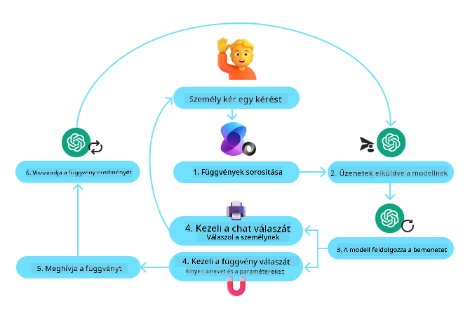

<!--
CO_OP_TRANSLATOR_METADATA:
{
  "original_hash": "e056335d729ba6e49571db7a6533825d",
  "translation_date": "2025-09-30T07:40:20+00:00",
  "source_file": "04-tool-use/README.md",
  "language_code": "hu"
}
-->
[](https://youtu.be/vieRiPRx-gI?si=cEZ8ApnT6Sus9rhn)

> _(Kattints a fenti képre a leckéhez tartozó videó megtekintéséhez)_

# Eszközhasználati tervezési minta

Az eszközök azért érdekesek, mert lehetővé teszik az AI-ügynökök számára, hogy szélesebb körű képességekkel rendelkezzenek. Az ügynök korlátozott cselekvési lehetőségei helyett egy eszköz hozzáadásával az ügynök most már számos különböző műveletet képes végrehajtani. Ebben a fejezetben az Eszközhasználati tervezési mintát vizsgáljuk meg, amely leírja, hogyan használhatnak az AI-ügynökök specifikus eszközöket céljaik eléréséhez.

## Bevezetés

Ebben a leckében a következő kérdésekre keressük a választ:

- Mi az eszközhasználati tervezési minta?
- Milyen felhasználási esetekre alkalmazható?
- Milyen elemek/építőelemek szükségesek a tervezési minta megvalósításához?
- Milyen különleges szempontokat kell figyelembe venni az Eszközhasználati tervezési minta alkalmazásakor, hogy megbízható AI-ügynököket építsünk?

## Tanulási célok

A lecke elvégzése után képes leszel:

- Meghatározni az Eszközhasználati tervezési mintát és annak célját.
- Azonosítani azokat a felhasználási eseteket, ahol az Eszközhasználati tervezési minta alkalmazható.
- Megérteni a tervezési minta megvalósításához szükséges kulcselemeket.
- Felismerni azokat a szempontokat, amelyek biztosítják az AI-ügynökök megbízhatóságát ezen tervezési minta alkalmazásakor.

## Mi az Eszközhasználati tervezési minta?

Az **Eszközhasználati tervezési minta** arra összpontosít, hogy a LLM-ek képesek legyenek külső eszközökkel interakcióba lépni konkrét célok elérése érdekében. Az eszközök olyan kódok, amelyeket egy ügynök végrehajthat műveletek elvégzésére. Egy eszköz lehet egy egyszerű funkció, például egy számológép, vagy egy API-hívás egy harmadik fél szolgáltatásához, például részvényárfolyamok lekérdezése vagy időjárás-előrejelzés. Az AI-ügynökök kontextusában az eszközöket úgy tervezték, hogy az ügynökök végrehajtsák őket **modell által generált funkcióhívások** alapján.

## Milyen felhasználási esetekre alkalmazható?

Az AI-ügynökök eszközöket használhatnak összetett feladatok elvégzésére, információk lekérésére vagy döntések meghozatalára. Az eszközhasználati tervezési mintát gyakran alkalmazzák olyan helyzetekben, amelyek dinamikus interakciót igényelnek külső rendszerekkel, például adatbázisokkal, webszolgáltatásokkal vagy kódértelmezőkkel. Ez a képesség számos különböző felhasználási esetben hasznos, például:

- **Dinamikus információlekérés:** Az ügynökök külső API-kat vagy adatbázisokat kérdezhetnek le, hogy naprakész adatokat szerezzenek (például SQLite adatbázis lekérdezése adat-elemzéshez, részvényárfolyamok vagy időjárási információk lekérése).
- **Kódvégrehajtás és értelmezés:** Az ügynökök kódokat vagy szkripteket hajthatnak végre matematikai problémák megoldására, jelentések készítésére vagy szimulációk végrehajtására.
- **Munkafolyamat-automatizálás:** Ismétlődő vagy több lépésből álló munkafolyamatok automatizálása olyan eszközök integrálásával, mint feladatütemezők, e-mail szolgáltatások vagy adatfolyamok.
- **Ügyfélszolgálat:** Az ügynökök CRM rendszerekkel, jegykezelő platformokkal vagy tudásbázisokkal léphetnek interakcióba a felhasználói kérdések megoldása érdekében.
- **Tartalomgenerálás és szerkesztés:** Az ügynökök olyan eszközöket használhatnak, mint nyelvtani ellenőrzők, szövegösszefoglalók vagy tartalombiztonsági értékelők, hogy segítsenek a tartalomkészítési feladatokban.

## Milyen elemek/építőelemek szükségesek az eszközhasználati tervezési minta megvalósításához?

Ezek az építőelemek lehetővé teszik az AI-ügynök számára, hogy széles körű feladatokat végezzen el. Nézzük meg az Eszközhasználati tervezési minta megvalósításához szükséges kulcselemeket:

- **Funkció/Eszköz sémák**: Az elérhető eszközök részletes definíciói, beleértve a funkció nevét, célját, szükséges paramétereit és várható kimeneteit. Ezek a sémák lehetővé teszik a LLM számára, hogy megértse, milyen eszközök állnak rendelkezésre, és hogyan kell érvényes kéréseket összeállítani.
- **Funkcióvégrehajtási logika**: Szabályozza, hogy az eszközöket hogyan és mikor hívják meg a felhasználó szándéka és a beszélgetés kontextusa alapján. Ez magában foglalhat tervező modulokat, útválasztási mechanizmusokat vagy feltételes folyamatokat, amelyek dinamikusan határozzák meg az eszközhasználatot.
- **Üzenetkezelő rendszer**: Olyan komponensek, amelyek kezelik a beszélgetési folyamatot a felhasználói bemenetek, LLM válaszok, eszközhívások és eszközkimenetek között.
- **Eszközintegrációs keretrendszer**: Infrastruktúra, amely összekapcsolja az ügynököt különböző eszközökkel, legyenek azok egyszerű funkciók vagy összetett külső szolgáltatások.
- **Hibakezelés és validáció**: Mechanizmusok az eszközvégrehajtás hibáinak kezelésére, a paraméterek érvényesítésére és a váratlan válaszok kezelésére.
- **Állapotkezelés**: Nyomon követi a beszélgetés kontextusát, korábbi eszközinterakciókat és tartós adatokat, hogy biztosítsa a konzisztenciát többfordulós interakciók során.

Ezután részletesebben megvizsgáljuk a Funkció/Eszköz hívást.

### Funkció/Eszköz hívás

A funkcióhívás az elsődleges módja annak, hogy lehetővé tegyük a Nagy Nyelvi Modellek (LLM-ek) számára az eszközökkel való interakciót. Gyakran látni fogod, hogy a "Funkció" és "Eszköz" kifejezéseket felcserélhetően használják, mivel a "funkciók" (újrafelhasználható kódblokkok) azok az "eszközök", amelyeket az ügynökök feladatok végrehajtására használnak. Ahhoz, hogy egy funkció kódját végrehajtsák, az LLM-nek össze kell hasonlítania a felhasználói kérést a funkció leírásával. Ehhez egy séma, amely tartalmazza az összes elérhető funkció leírását, elküldésre kerül az LLM-nek. Az LLM kiválasztja a feladathoz legmegfelelőbb funkciót, és visszaküldi annak nevét és argumentumait. A kiválasztott funkciót végrehajtják, válaszát visszaküldik az LLM-nek, amely az információt felhasználja a felhasználói kérés megválaszolására.

A fejlesztők számára az ügynökök funkcióhívásának megvalósításához szükséges:

1. Egy LLM modell, amely támogatja a funkcióhívást
2. Egy séma, amely tartalmazza a funkciók leírását
3. A leírt funkciók kódja

Nézzük meg a példát, hogyan lehet megkapni az aktuális időt egy városban:

1. **Egy funkcióhívást támogató LLM inicializálása:**

    Nem minden modell támogatja a funkcióhívást, ezért fontos ellenőrizni, hogy az általad használt LLM támogatja-e. <a href="https://learn.microsoft.com/azure/ai-services/openai/how-to/function-calling" target="_blank">Azure OpenAI</a> támogatja a funkcióhívást. Kezdhetjük az Azure OpenAI kliens inicializálásával.

    ```python
    # Initialize the Azure OpenAI client
    client = AzureOpenAI(
        azure_endpoint = os.getenv("AZURE_OPENAI_ENDPOINT"), 
        api_key=os.getenv("AZURE_OPENAI_API_KEY"),  
        api_version="2024-05-01-preview"
    )
    ```

1. **Funkció séma létrehozása**:

    Ezután definiálunk egy JSON sémát, amely tartalmazza a funkció nevét, a funkció céljának leírását, valamint a funkció paramétereinek nevét és leírását. Ezt a sémát átadjuk az előzőleg létrehozott kliensnek, valamint a felhasználói kérésnek, hogy megtaláljuk az időt San Franciscóban. Fontos megjegyezni, hogy egy **eszközhívás** az, ami visszatér, **nem** a kérdés végső válasza. Ahogy korábban említettük, az LLM visszaküldi a feladathoz kiválasztott funkció nevét és az átadandó argumentumokat.

    ```python
    # Function description for the model to read
    tools = [
        {
            "type": "function",
            "function": {
                "name": "get_current_time",
                "description": "Get the current time in a given location",
                "parameters": {
                    "type": "object",
                    "properties": {
                        "location": {
                            "type": "string",
                            "description": "The city name, e.g. San Francisco",
                        },
                    },
                    "required": ["location"],
                },
            }
        }
    ]
    ```
   
    ```python
  
    # Initial user message
    messages = [{"role": "user", "content": "What's the current time in San Francisco"}] 
  
    # First API call: Ask the model to use the function
      response = client.chat.completions.create(
          model=deployment_name,
          messages=messages,
          tools=tools,
          tool_choice="auto",
      )
  
      # Process the model's response
      response_message = response.choices[0].message
      messages.append(response_message)
  
      print("Model's response:")  

      print(response_message)
  
    ```

    ```bash
    Model's response:
    ChatCompletionMessage(content=None, role='assistant', function_call=None, tool_calls=[ChatCompletionMessageToolCall(id='call_pOsKdUlqvdyttYB67MOj434b', function=Function(arguments='{"location":"San Francisco"}', name='get_current_time'), type='function')])
    ```
  
1. **A feladat végrehajtásához szükséges funkciókód:**

    Miután az LLM kiválasztotta, melyik funkciót kell futtatni, a feladat végrehajtásához szükséges kódot kell megvalósítani és végrehajtani. Megvalósíthatjuk a kódot az aktuális idő lekérésére Pythonban. Azt is meg kell írnunk, hogyan lehet kivonni a funkció nevét és argumentumait a response_message-ből, hogy megkapjuk a végső eredményt.

    ```python
      def get_current_time(location):
        """Get the current time for a given location"""
        print(f"get_current_time called with location: {location}")  
        location_lower = location.lower()
        
        for key, timezone in TIMEZONE_DATA.items():
            if key in location_lower:
                print(f"Timezone found for {key}")  
                current_time = datetime.now(ZoneInfo(timezone)).strftime("%I:%M %p")
                return json.dumps({
                    "location": location,
                    "current_time": current_time
                })
      
        print(f"No timezone data found for {location_lower}")  
        return json.dumps({"location": location, "current_time": "unknown"})
    ```

     ```python
     # Handle function calls
      if response_message.tool_calls:
          for tool_call in response_message.tool_calls:
              if tool_call.function.name == "get_current_time":
     
                  function_args = json.loads(tool_call.function.arguments)
     
                  time_response = get_current_time(
                      location=function_args.get("location")
                  )
     
                  messages.append({
                      "tool_call_id": tool_call.id,
                      "role": "tool",
                      "name": "get_current_time",
                      "content": time_response,
                  })
      else:
          print("No tool calls were made by the model.")  
  
      # Second API call: Get the final response from the model
      final_response = client.chat.completions.create(
          model=deployment_name,
          messages=messages,
      )
  
      return final_response.choices[0].message.content
     ```

     ```bash
      get_current_time called with location: San Francisco
      Timezone found for san francisco
      The current time in San Francisco is 09:24 AM.
     ```

A funkcióhívás a legtöbb, ha nem az összes ügynöki eszközhasználati tervezés középpontjában áll, azonban a nulláról történő megvalósítása néha kihívást jelenthet. Ahogy azt a [2. leckében](../../../02-explore-agentic-frameworks) megtanultuk, az ügynöki keretrendszerek előre elkészített építőelemeket biztosítanak az eszközhasználat megvalósításához.

## Eszközhasználati példák ügynöki keretrendszerekkel

Íme néhány példa arra, hogyan valósíthatod meg az Eszközhasználati tervezési mintát különböző ügynöki keretrendszerek használatával:

### Semantic Kernel

<a href="https://learn.microsoft.com/azure/ai-services/agents/overview" target="_blank">Semantic Kernel</a> egy nyílt forráskódú AI keretrendszer .NET, Python és Java fejlesztők számára, akik Nagy Nyelvi Modellekkel (LLM-ekkel) dolgoznak. Egyszerűsíti a funkcióhívás használatának folyamatát azáltal, hogy automatikusan leírja a funkcióidat és azok paramétereit a modell számára egy <a href="https://learn.microsoft.com/semantic-kernel/concepts/ai-services/chat-completion/function-calling/?pivots=programming-language-python#1-serializing-the-functions" target="_blank">szerializálás</a> nevű folyamaton keresztül. Emellett kezeli a modell és a kód közötti kommunikációt. Az ügynöki keretrendszer, mint például a Semantic Kernel, további előnye, hogy hozzáférést biztosít előre elkészített eszközökhöz, mint például <a href="https://github.com/microsoft/semantic-kernel/blob/main/python/samples/getting_started_with_agents/openai_assistant/step4_assistant_tool_file_search.py" target="_blank">File Search</a> és <a href="https://github.com/microsoft/semantic-kernel/blob/main/python/samples/getting_started_with_agents/openai_assistant/step3_assistant_tool_code_interpreter.py" target="_blank">Code Interpreter</a>.

Az alábbi diagram bemutatja a funkcióhívás folyamatát a Semantic Kernel használatával:



A Semantic Kernelben a funkciókat/eszközöket <a href="https://learn.microsoft.com/semantic-kernel/concepts/plugins/?pivots=programming-language-python" target="_blank">Pluginoknak</a> nevezik. Az előzőekben látott `get_current_time` funkciót átalakíthatjuk egy pluginná úgy, hogy egy osztályba helyezzük, amely tartalmazza a funkciót. Importálhatjuk a `kernel_function` dekorátort is, amely a funkció leírását veszi át. Amikor létrehozol egy kernelt a GetCurrentTimePlugin-nal, a kernel automatikusan szerializálja a funkciót és annak paramétereit, létrehozva a sémát, amelyet elküld az LLM-nek.

```python
from semantic_kernel.functions import kernel_function

class GetCurrentTimePlugin:
    async def __init__(self, location):
        self.location = location

    @kernel_function(
        description="Get the current time for a given location"
    )
    def get_current_time(location: str = ""):
        ...

```

```python 
from semantic_kernel import Kernel

# Create the kernel
kernel = Kernel()

# Create the plugin
get_current_time_plugin = GetCurrentTimePlugin(location)

# Add the plugin to the kernel
kernel.add_plugin(get_current_time_plugin)
```
  
### Azure AI Agent Service

<a href="https://learn.microsoft.com/azure/ai-services/agents/overview" target="_blank">Azure AI Agent Service</a> egy újabb ügynöki keretrendszer, amelyet arra terveztek, hogy a fejlesztők biztonságosan építhessenek, telepíthessenek és skálázhassanak magas minőségű és bővíthető AI-ügynököket anélkül, hogy az alapvető számítási és tárolási erőforrásokat kellene kezelniük. Különösen hasznos vállalati alkalmazásokhoz, mivel teljesen menedzselt szolgáltatás, vállalati szintű biztonsággal.

Az LLM API-val való közvetlen fejlesztéshez képest az Azure AI Agent Service néhány előnyt kínál, például:

- Automatikus eszközhívás – nem szükséges eszközhívást elemezni, eszközt meghívni és a választ kezelni; mindez most már szerveroldalon történik
- Biztonságosan kezelt adatok – ahelyett, hogy saját beszélgetési állapotot kezelnél, a szálakra támaszkodhatsz, hogy tárolják az összes szükséges információt
- Előre elkészített eszközök – Eszközök, amelyeket használhatsz az adatforrásaiddal való interakcióhoz, például Bing, Azure AI Search és Azure Functions.

Az Azure AI Agent Service-ben elérhető eszközök két kategóriába sorolhatók:

1. Tudáseszközök:
    - <a href="https://learn.microsoft.com/azure/ai-services/agents/how-to/tools/bing-grounding?tabs=python&pivots=overview" target="_blank">Bing kereséssel való alapozás</a>
    - <a href="https://learn.microsoft.com/azure/ai-services/agents/how-to/tools/file-search?tabs=python&pivots=overview" target="_blank">File Search</a>
    - <a href="https://learn.microsoft.com/azure/ai-services/agents/how-to/tools/azure-ai-search?tabs=azurecli%2Cpython&pivots=overview-azure-ai-search" target="_blank">Azure AI Search</a>

2. Akcióeszközök:
    - <a href="https://learn.microsoft.com/azure/ai-services/agents/how-to/tools/function-calling?tabs=python&pivots=overview" target="_blank">Funkcióhívás</a>
    - <a href="https://learn.microsoft.com/azure/ai-services/agents/how-to/tools/code-interpreter?tabs=python&pivots=overview" target="_blank">Code Interpreter</a>
    - <a href="https://learn.microsoft.com/azure/ai-services/agents/how-to/tools/openapi-spec?tabs=python&pivots=overview" target="_blank">OpenAPI által definiált eszközök</a>
    - <a href="https://learn.microsoft.com/azure/ai-services/agents/how-to/tools/azure-functions?pivots=overview" target="_blank">Azure Functions</a>

Az Agent Service lehet
Az alkalmazás futtatása egy biztonságos környezetben tovább növeli a védelmet. Vállalati környezetben az adatok általában operatív rendszerekből kerülnek kinyerésre és átalakításra egy csak olvasható adatbázisba vagy adattárházba, amely felhasználóbarát sémával rendelkezik. Ez a megközelítés biztosítja, hogy az adatok biztonságosak, teljesítményre és hozzáférhetőségre optimalizáltak legyenek, valamint hogy az alkalmazás korlátozott, csak olvasható hozzáféréssel rendelkezzen.

### További kérdéseid vannak az eszközhasználati tervezési mintákról?

Csatlakozz az [Azure AI Foundry Discord](https://aka.ms/ai-agents/discord) közösséghez, hogy találkozz más tanulókkal, részt vegyél konzultációkon, és választ kapj az AI Agents témájú kérdéseidre.

## További források

- <a href="https://microsoft.github.io/build-your-first-agent-with-azure-ai-agent-service-workshop/" target="_blank">Azure AI Agents Service Workshop</a>
- <a href="https://github.com/Azure-Samples/contoso-creative-writer/tree/main/docs/workshop" target="_blank">Contoso Creative Writer Multi-Agent Workshop</a>
- <a href="https://learn.microsoft.com/semantic-kernel/concepts/ai-services/chat-completion/function-calling/?pivots=programming-language-python#1-serializing-the-functions" target="_blank">Semantic Kernel Function Calling Tutorial</a>
- <a href="https://github.com/microsoft/semantic-kernel/blob/main/python/samples/getting_started_with_agents/openai_assistant/step3_assistant_tool_code_interpreter.py" target="_blank">Semantic Kernel Code Interpreter</a>
- <a href="https://microsoft.github.io/autogen/dev/user-guide/core-user-guide/components/tools.html" target="_blank">Autogen Tools</a>

## Előző lecke

[Agentikus tervezési minták megértése](../03-agentic-design-patterns/README.md)

## Következő lecke

[Agentikus RAG](../05-agentic-rag/README.md)

---

**Felelősség kizárása**:  
Ez a dokumentum az [Co-op Translator](https://github.com/Azure/co-op-translator) AI fordítási szolgáltatás segítségével került lefordításra. Bár törekszünk a pontosságra, kérjük, vegye figyelembe, hogy az automatikus fordítások hibákat vagy pontatlanságokat tartalmazhatnak. Az eredeti dokumentum az eredeti nyelvén tekintendő hiteles forrásnak. Kritikus információk esetén javasolt professzionális emberi fordítást igénybe venni. Nem vállalunk felelősséget semmilyen félreértésért vagy téves értelmezésért, amely a fordítás használatából eredhet.