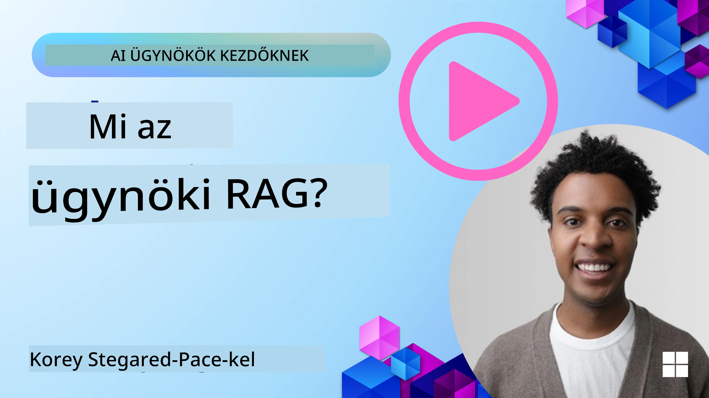
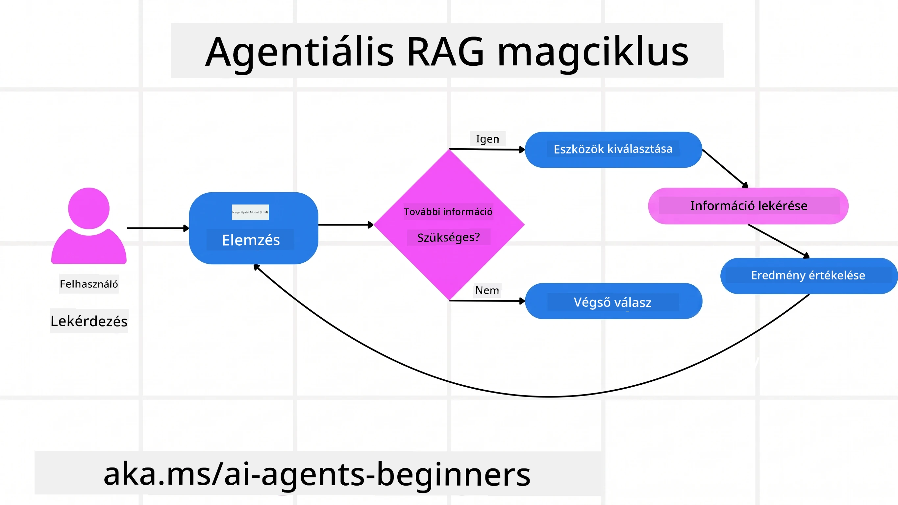
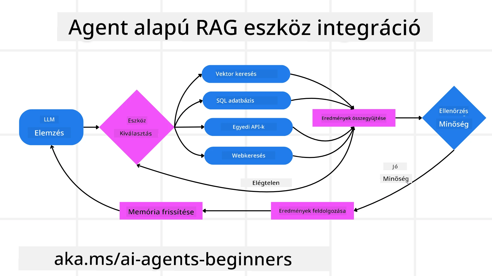
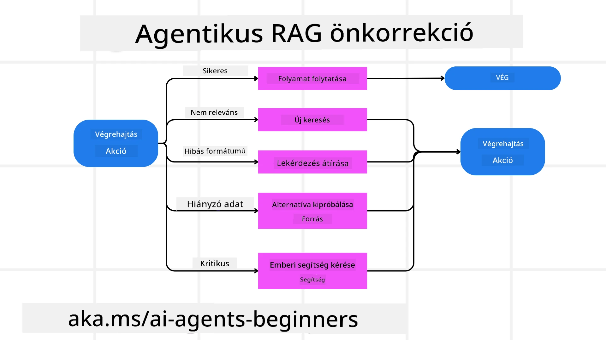
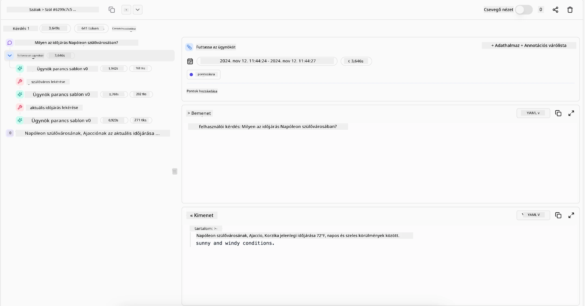

> _(Kattints a fenti képre a lecke videójának megtekintéséhez)_

# Agentic RAG

Ez a lecke átfogó áttekintést nyújt az Agentic Retrieval-Augmented Generation-ről (Agentic RAG), egy feltörekvő MI-paradigmáról, ahol a nagy nyelvi modellek (LLM-ek) önállóan tervezik meg a következő lépéseiket, miközben külső forrásokból húznak információkat. A statikus lekérdezés-után-olvasás mintáktól eltérően az Agentic RAG ismétlődő hívásokat alkalmaz az LLM-hez, amelyeket eszköz- vagy függvényhívások és strukturált kimenetek szakítanak meg. A rendszer értékeli az eredményeket, finomítja a lekérdezéseket, szükség esetén további eszközöket hívat be, és ezt a ciklust addig folytatja, amíg kielégítő megoldást nem ér el.

## Bevezetés

Ez a lecke a következőket fogja tárgyalni

- **Az Agentic RAG megértése:** Ismerd meg az AI-ben felbukkanó új paradigmat, ahol a nagy nyelvi modellek önállóan tervezik a következő lépéseiket és külső adatforrásokból húznak információkat.
- **Iteratív Maker-Checker stílus elsajátítása:** Értsd meg az iteratív LLM-hívások körforgását, amelyeket eszköz- vagy függvényhívások és strukturált kimenetek szakítanak meg, ezek célja a pontosság javítása és a hibás lekérdezések kezelése.
- **Gyakorlati alkalmazások feltérképezése:** Ismerd fel azokat a helyzeteket, ahol az Agentic RAG kiemelkedik, például pontosság-központú környezetek, összetett adatbázis-interakciók és hosszabb munkafolyamatok.

## Tanulási célok

A lecke elvégzése után tudni fogod/megérted:

- **Az Agentic RAG megértése:** Ismerd meg az AI-ben felbukkanó új paradigmat, ahol a nagy nyelvi modellek önállóan tervezik a következő lépéseiket és külső adatforrásokból húznak információkat.
- **Iteratív Maker-Checker stílus:** Értsd meg az iteratív LLM-hívások körforgását, amelyeket eszköz- vagy függvényhívások és strukturált kimenetek szakítanak meg, ezek célja a pontosság javítása és a hibás lekérdezések kezelése.
- **Az érvelési folyamat birtoklása:** Értsd meg, hogy a rendszer képes önállóan birtokolni az érvelési folyamatát, döntéseket hoz a problémák megközelítéséről anélkül, hogy előre meghatározott utakat követne.
- **Munkafolyamat:** Értsd meg, hogyan dönt egy agentikus modell önállóan például piaci trendjelentések lekéréséről, versenytársi adatok azonosításáról, belső értékesítési mutatók összekapcsolásáról, eredmények szintetizálásáról és a stratégia értékeléséről.
- **Iteratív körök, eszköz integráció és memória:** Ismerd meg a rendszer körkörös interakciós mintáját, amely lépések között állapotot és memóriát tart fenn, hogy elkerülje az ismétlődő hurkokat és megalapozott döntéseket hozzon.
- **Hibakezelés és önkorrekció:** Fedezd fel a rendszer robusztus önjavító mechanizmusait, ideértve az ismétléseket és újrakérdezéseket, diagnosztikai eszközök használatát, valamint az emberi felügyeletre való visszatérést.
- **Az ügynökség határai:** Értsd meg az Agentic RAG korlátait az adott domainhez kötött autonómia, az infrastruktúrától való függés és a védőkorlátok tiszteletben tartása szempontjából.
- **Gyakorlati esetek és érték:** Ismerd fel azokat a helyzeteket, ahol az Agentic RAG kiemelkedik, például pontosság-központú környezetek, összetett adatbázis-interakciók és hosszabb munkafolyamatok.
- **Kormányzás, átláthatóság és bizalom:** Tudd meg a kormányzás és az átláthatóság fontosságát, beleértve az érthető érvelést, az elfogultság ellenőrzését és az emberi felügyeletet.

## Mi az Agentic RAG?

Az Agentic Retrieval-Augmented Generation (Agentic RAG) egy feltörekvő MI-paradigma, ahol a nagy nyelvi modellek (LLM-ek) önállóan tervezik meg a következő lépéseiket, miközben külső forrásokból húznak információkat. A statikus lekérdezés-után-olvasás mintáktól eltérően az Agentic RAG ismétlődő hívásokat alkalmaz az LLM-hez, amelyeket eszköz- vagy függvényhívások és strukturált kimenetek szakítanak meg. A rendszer értékeli az eredményeket, finomítja a lekérdezéseket, szükség esetén további eszközöket hívat be, és ezt a ciklust addig folytatja, amíg kielégítő megoldást nem ér el. Ez az iteratív „maker-checker” stílus javítja a pontosságot, kezeli a hibás lekérdezéseket, és biztosítja a magas minőségű eredményeket.

A rendszer aktívan birtokolja az érvelési folyamatát, újraírja a sikertelen lekérdezéseket, más lekérdezési módszereket választ, és több eszközt integrál — például vektoros keresést az Azure AI Search-ben, SQL adatbázisokat vagy egyedi API-kat — mielőtt véglegesítené a válaszát. Egy agentikus rendszer megkülönböztető tulajdonsága az érvelési folyamat birtoklásának képessége. A hagyományos RAG-megoldások előre definiált utakra támaszkodnak, de az agentikus rendszer önállóan határozza meg a lépések sorrendjét az általa talált információk minősége alapján.

## Az Agentic Retrieval-Augmented Generation (Agentic RAG) meghatározása

Az Agentic Retrieval-Augmented Generation (Agentic RAG) egy újonnan kialakuló AI-paradigma, ahol a nagy nyelvi modellek nem csak lekérik az információt külső adatforrásokból, de önállóan tervezik meg következő lépéseiket is. A statikus lekérdezés-után-olvasás mintáktól vagy előre megírt prompt sorozatoktól eltérően az Agentic RAG egy iteratív ciklust alkalmaz, amely során ismétlődő hívásokat tesz az LLM-hez, ezeket eszköz- vagy függvényhívások és strukturált kimenetek szakítják meg. Minden fordulónál a rendszer értékeli az eddig megszerzett eredményeket, eldönti, hogy finomítani kell-e a lekérdezéseket, szükség esetén további eszközöket aktivál, és ezt a ciklust addig folytatja, amíg megfelelő megoldást nem talál.

Ez az iteratív „maker-checker” működési mód célja a pontosság növelése, a hibás lekérdezések kezelése strukturált adatbázisokhoz (pl. NL2SQL) és kiegyensúlyozott, magas minőségű eredmények biztosítása. A rendszer nem csupán előre megtervezett prompt láncokra támaszkodik, hanem aktívan birtokolja az érvelési folyamatát. Újraírhatja a sikertelen lekérdezéseket, különböző lekérdezési módszereket választhat, és több eszközt integrálhat — mint például a vektoros keresés az Azure AI Search-ben, SQL adatbázisok vagy egyedi API-k — mielőtt véglegesítené a válaszát. Ez megszünteti a túlbonyolított szervezési keretrendszerek szükségességét. Ehelyett egy viszonylag egyszerű „LLM hívás → eszköz használat → LLM hívás → …” ciklus is előállíthat kifinomult és jól megalapozott outputokat.

## Az érvelési folyamat birtoklása

Az a megkülönböztető tulajdonság, amitől egy rendszer „agentikus” lesz, az érvelési folyamat birtoklásának képessége. A hagyományos RAG-megoldások gyakran emberi előzetes útvonal-meghatározásra támaszkodnak: olyan gondolatmenetre, amely kijelöli, mit és mikor kell lekérni.
De amikor egy rendszer valóban agentikus, akkor belsőleg dönt arról, hogyan közelítse meg a problémát. Nem csak egy szkriptet hajt végre; önállóan határozza meg a lépések sorozatát az általa talált információ minősége alapján.
Például, ha arra kérik, hogy hozzon létre egy termékbevezetési stratégiát, nem csupán egy prompttal dolgozik, amely az egész kutatási és döntéshozatali munkafolyamatot részletezi. Ehelyett az agentikus modell önállóan dönt arról, hogy:

1. Lekéri a jelenlegi piaci trendjelentéseket Bing Web Grounding segítségével
2. Azonosítja a releváns versenytársadatokat az Azure AI Search segítségével.
3. Összekapcsolja a történelmi belső értékesítési mutatókat az Azure SQL Database használatával.
4. A megállapításokat összefogott stratégiává szintetizálja, amelyet az Azure OpenAI Service koordinál.
5. Értékeli a stratégiát hiányosságok vagy ellentmondások szempontjából, és szükség esetén újabb lekérést hajt végre.
Mindezeket a lépéseket — a lekérdezések finomítása, források kiválasztása, iterálás amíg „elégedett” nem lesz a válasszal — a modell döntése vezérli, nem ember által előre megírt szkript.

## Iteratív körök, eszköz integráció és memória

Egy agentikus rendszer egy körkörös interakciós mintára támaszkodik:

- **Kezdeti hívás:** A felhasználó célja (más néven felhasználói prompt) bemutatásra kerül az LLM-nek.
- **Eszköz aktiválása:** Ha a modell hiányos információt vagy homályos utasításokat észlel, kiválaszt egy eszközt vagy lekérdezési módszert — például egy vektoralapú adatbázis-lekérdezést (pl. Azure AI Search hibrid keresés privát adatok felett) vagy egy strukturált SQL-hívást —, hogy több kontextust gyűjtsön.
- **Értékelés és finomítás:** Az adatok átnézése után a modell eldönti, hogy az információ elegendő-e. Ha nem, finomítja a lekérdezést, másik eszközt próbál ki, vagy módosítja a megközelítését.
- **Ismétlés, amíg elégedett:** Ez a ciklus addig folytatódik, amíg a modell elégséges tisztaságot és bizonyítékot nem talál egy végleges, jól átgondolt válasz elkészítéséhez.
- **Memória és állapot:** Mivel a rendszer megőrzi az állapotot és memóriát a lépések között, képes felidézni az előző próbálkozásokat és azok eredményeit, így elkerülve az ismétlődő hurkokat és megalapozottabb döntéseket hozva a folyamat során.

Idővel ez egy fejlődő megértés érzetét kelti, lehetővé téve a modell számára, hogy összetett, több lépésből álló feladatokat navigáljon anélkül, hogy emberi közbelépésre vagy a prompt újraformálására lenne szükség folyamatosan.

## Hibakezelés és önkorrekció

Az Agentic RAG autonómiája magában foglalja a robusztus önkorrekciós mechanizmusokat is. Amikor a rendszer zsákutcákba kerül — például irreleváns dokumentumokat kér le vagy hibás lekérdezésekkel találkozik —, képes:

- **Ismételni és újra lekérdezni:** Alacsony értékű válaszok helyett a modell új keresési stratégiákat próbál ki, újraírja az adatbázis-lekérdezéseket, vagy alternatív adatforrásokat vizsgál.
- **Diagnosztikai eszközök használata:** A rendszer további funkciókat hívhat meg, amelyek segítenek a gondolatmenet lépéseinek hibakeresésében vagy a lekért adatok helyességének megerősítésében. Az eszközök, mint az Azure AI Tracing, fontosak lesznek a robusztus megfigyelhetőség és monitorozás eléréséhez.
- **Emberi felügyeletre való visszatérés:** Magas tétű vagy ismétlődően sikertelen helyzetekben a modell jelezheti a bizonytalanságot és emberi iránymutatást kérhet. Amint az ember helyesbítő visszajelzést ad, a modell képes beépíteni ezt a tanulságot a további működésébe.

Ez az iteratív és dinamikus megközelítés lehetővé teszi, hogy a modell folyamatosan javuljon, biztosítva, hogy ne csak egyetlen alkalomra működő rendszerről legyen szó, hanem olyanonról, amely tanul a hibáiból az adott munkamenet során.

## Az ügynökség határai

Annak ellenére, hogy autonóm egy feladaton belül, az Agentic RAG nem analóg az Általános Mesterséges Intelligenciával. „Agentikus” képességei a fejlesztők által biztosított eszközökre, adatforrásokra és szabályzatokra korlátozódnak. Nem képes saját eszközöket kitalálni vagy kilépni a meghatározott domain-határokon kívül. Ehelyett abban jeleskedik, hogy dinamikusan szervezi az adott erőforrásokat.
A fejlettebb MI-formáktól való főbb különbségek:

1. **Domain-specifikus autonómia:** Az Agentic RAG rendszerek arra fókuszálnak, hogy felhasználó által definiált célokat érjenek el ismert domainen belül, olyan stratégiákat alkalmazva, mint a lekérdezés újraírása vagy eszközválasztás az eredmények javítására.
2. **Infrastruktúrától való függőség:** A rendszer képességei a fejlesztők által integrált eszközöktől és adatforrásoktól függenek. Ezeket a határokat emberi beavatkozás nélkül nem képes átlépni.
3. **A védőkorlátok tisztelete:** Etikai irányelvek, megfelelési szabályok és üzleti politikák továbbra is nagyon fontosak. Az ügynök szabadsága mindig a biztonsági intézkedések és a felügyeleti mechanizmusok által korlátozott (remélhetőleg?)

## Gyakorlati esetek és érték

Az Agentic RAG azokban a helyzetekben tündököl, ahol iteratív finomításra és precizitásra van szükség:

1. **Pontosság-központú környezetek:** Megfelelőségi ellenőrzések, szabályozási elemzések vagy jogi kutatások során az agentikus modell többször ellenőrizheti a tényeket, több forrást is bevonhat, és újraírhatja a lekérdezéseket, amíg alaposan ellenőrzött választ nem ad.
2. **Összetett adatbázis-interakciók:** Struktúrált adatok esetén, ahol a lekérdezések gyakran sikertelenek vagy módosításra szorulnak, a rendszer önállóan finomíthatja a lekérdezéseket Azure SQL vagy Microsoft Fabric OneLake használatával, biztosítva, hogy a végső lekérdezés megfeleljen a felhasználó szándékának.
3. **Hosszabb munkafolyamatok:** Hosszabb munkamenetek során új információk bukkannak fel, amelyek hatására a stratégiák módosulnak. Az Agentic RAG folyamatosan beépítheti az új adatokat, miközben egyre többet tanul a problématerületről.

## Kormányzás, átláthatóság és bizalom

Ahogy ezek a rendszerek egyre autonómabbakká válnak érvelésük során, a kormányzás és az átláthatóság kiemelten fontos:

- **Magyarázható érvelés:** A modell audit nyomvonalat tud szolgáltatni a lekérdezésekről, amelyekre támaszkodott, a konzultált forrásokról és az érvelési lépésekről, amelyek a következtetéshez vezettek. Olyan eszközök, mint az Azure AI Content Safety és az Azure AI Tracing / GenAIOps segítenek az átláthatóság megőrzésében és a kockázatok csökkentésében.
- **Elfogultság kontroll és kiegyensúlyozott lekérdezés:** A fejlesztők hangolhatják a lekérdezési stratégiákat, hogy kiegyensúlyozott, reprezentatív adatforrások kerüljenek bevonásra, és rendszeresen auditálhatják a kimeneteket elfogultság vagy torzult minták észlelésére, speciális modelleket használva fejlett adattudományi szervezetek számára az Azure Machine Learning keretében.
- **Emberi felügyelet és megfelelőség:** Érzékeny feladatok esetén az emberi ellenőrzés elengedhetetlen. Az Agentic RAG nem helyettesíti az emberi ítélőképességet nagy tétű döntések során — hanem kiegészíti azt alaposabban ellenőrzött lehetőségek biztosításával.

Lényeges, hogy olyan eszközök álljanak rendelkezésre, amelyek világos nyilvántartást biztosítanak a lépésekről. Ezek nélkül egy többlépéses folyamat hibakeresése nagyon nehéz lehet. Lásd az alábbi példát a Literal AI-tól (a Chainlit mögött álló cég) egy agenti futásról:

## Összefoglalás

Az Agentic RAG a mesterséges intelligencia rendszerek komplex, adatintenzív feladatainak kezelésében természetes evolúciót képvisel. Az iteratív interakciós minták alkalmazásával, az eszközök autonóm kiválasztásával és a lekérdezések finomításával a rendszer egy magas minőségű eredmény elérése érdekében túllép a statikus prompt követésen, és egy adaptívabb, kontextus-érzékeny döntéshozóvá válik. Bár továbbra is ember által meghatározott infrastruktúrákhoz és etikai irányelvekhez kötött, ezek az agentikus képességek gazdagabb, dinamikusabb és végső soron hasznosabb MI-interakciókat tesznek lehetővé mind a vállalatok, mind a végfelhasználók számára.

### További kérdéseid vannak az Agentic RAG-ről?

Csatlakozz a [Microsoft Foundry Discordhoz](https://discord.com/invite/ATgtXmAS5D), hogy találkozz más tanulókkal, részt vegyél az ügyfélirodai órákon és választ kapj az MI-ügynökökkel kapcsolatos kérdéseidre.

## További források

- <a href="https://learn.microsoft.com/training/modules/use-own-data-azure-openai" target="_blank">A Retrieval Augmented Generation (RAG) megvalósítása az Azure OpenAI Service-szel: Ismerd meg, hogyan használhatod a saját adataidat az Azure OpenAI Service-ben. Ez a Microsoft Learn modul átfogó útmutatást ad a RAG megvalósításához</a>
- <a href="https://learn.microsoft.com/azure/ai-studio/concepts/evaluation-approach-gen-ai" target="_blank">Generatív MI alkalmazások értékelése a Microsoft Foundry-val: Ez a cikk a modellek nyilvánosan elérhető adatkészleteken történő értékelésével és összehasonlításával foglalkozik, beleértve az Agentic MI alkalmazásokat és a RAG architektúrákat</a>
- <a href="https://weaviate.io/blog/what-is-agentic-rag" target="_blank">Mi az Agentic RAG | Weaviate</a>
- <a href="https://ragaboutit.com/agentic-rag-a-complete-guide-to-agent-based-retrieval-augmented-generation/" target="_blank">Agentic RAG: Teljes útmutató az ügynökalapú lekérdezéssel bővített generáláshoz – Hírek a generatív RAG-ról</a>

- <a href="https://huggingface.co/learn/cookbook/agent_rag" target="_blank">Agentic RAG: turbózd fel a RAG-et lekérdezés-átalakítással és önálló lekérdezéssel! Hugging Face Nyílt Forráskódú AI Kézikönyv</a>
- <a href="https://youtu.be/aQ4yQXeB1Ss?si=2HUqBzHoeB5tR04U" target="_blank">Agentikus Rétegek Hozzáadása a RAG-hez</a>
- <a href="https://www.youtube.com/watch?v=zeAyuLc_f3Q&t=244s" target="_blank">A Tudástámogatók Jövője: Jerry Liu</a>
- <a href="https://www.youtube.com/watch?v=AOSjiXP1jmQ" target="_blank">Hogyan Építsünk Agentikus RAG Rendszereket</a>
- <a href="https://ignite.microsoft.com/sessions/BRK102?source=sessions" target="_blank">Microsoft Foundry Agent Service Használata AI ügynökeid skálázásához</a>

### Tudományos Tanulmányok

- <a href="https://arxiv.org/abs/2303.17651" target="_blank">2303.17651 Self-Refine: Iteratív Finomítás Önvisszacsatolással</a>
- <a href="https://arxiv.org/abs/2303.11366" target="_blank">2303.11366 Reflexion: Nyelvi Ügynökök Verbális Megerősítő Tanulással</a>
- <a href="https://arxiv.org/abs/2305.11738" target="_blank">2305.11738 CRITIC: Nagy Nyelvi Modellek Önkorrigálása Eszköz-Interaktív Kritika Segítségével</a>
- <a href="https://arxiv.org/abs/2501.09136" target="_blank">2501.09136 Agentikus Retrieve-Augmented Generation: Áttekintés az Agentikus RAG-ről</a>

## Előző Lecke

[Eszköz Használati Tervezési Minta](../04-tool-use/README.md)

## Következő Lecke

[Megbízható AI Ügynökök Építése](../06-building-trustworthy-agents/README.md)

---

<!-- CO-OP TRANSLATOR DISCLAIMER START -->
**Jogi nyilatkozat**:
Ez a dokumentum az AI fordítási szolgáltatás, a [Co-op Translator](https://github.com/Azure/co-op-translator) segítségével készült. Bár az pontosságra törekszünk, kérjük, vegye figyelembe, hogy az automatikus fordítások hibákat vagy pontatlanságokat tartalmazhatnak. Az eredeti dokumentum az anyanyelvén tekintendő hiteles forrásnak. Fontos információk esetén professzionális emberi fordítást javasolunk. Nem vállalunk felelősséget semmilyen félreértésért vagy téves értelmezésért, amely ebből a fordításból ered.
<!-- CO-OP TRANSLATOR DISCLAIMER END -->