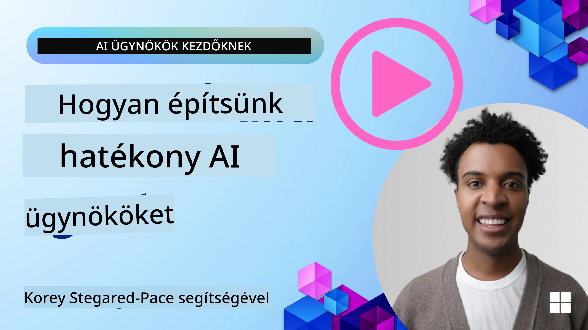
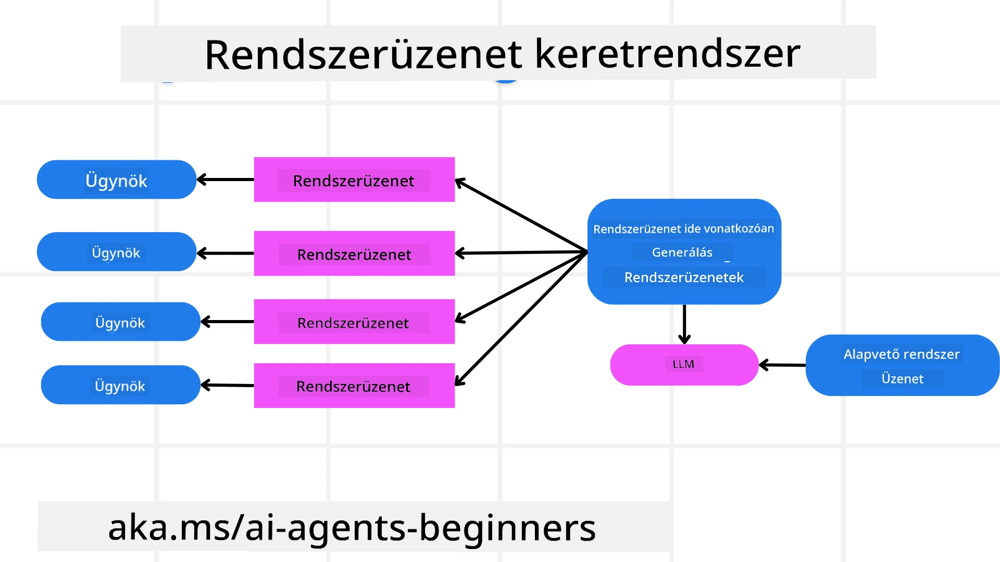
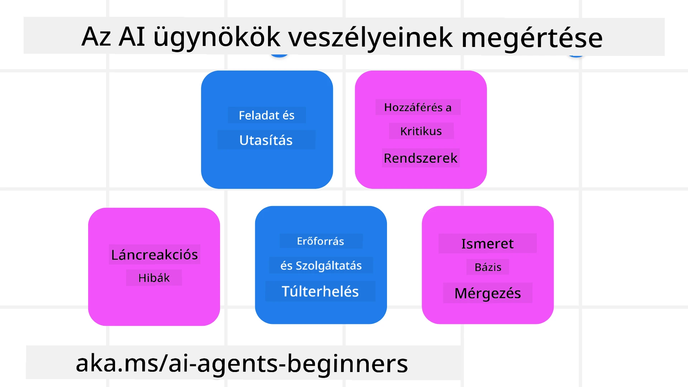
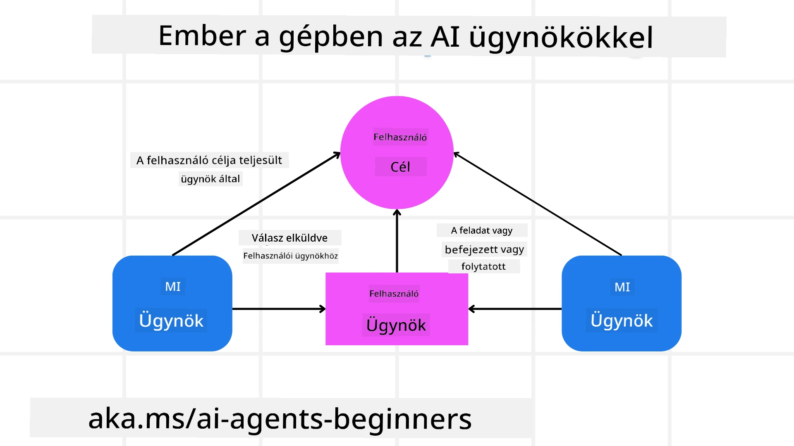

[](https://youtu.be/iZKkMEGBCUQ?si=Q-kEbcyHUMPoHp8L)

> _(Kattintson a fenti képre a lecke videójának megtekintéséhez)_

# Megbízható MI-ügynökök létrehozása

## Bevezetés

Ez a lecke a következőket fogja lefedni:

- Hogyan építsünk és telepítsünk biztonságos és hatékony MI-ügynököket
- Fontos biztonsági szempontok az MI-ügynökök fejlesztése során
- Hogyan tartsuk meg az adatok és a felhasználók magánéletét az MI-ügynökök fejlesztése során

## Tanulási célok

A lecke elvégzése után tudni fogja, hogyan:

- Azonosítsa és csökkentse a kockázatokat MI-ügynökök létrehozásakor
- Biztonsági intézkedéseket vezessen be az adatok és a hozzáférés megfelelő kezelése érdekében
- Olyan MI-ügynököket hozzon létre, amelyek megőrzik az adatvédelmet és minőségi felhasználói élményt nyújtanak

## Biztonság

Először nézzük meg a biztonságos ügynökalapú alkalmazások építését. A biztonság azt jelenti, hogy az MI-ügynök a tervezett módon működik. Ügynökalapú alkalmazások készítőiként vannak módszereink és eszközeink a biztonság maximalizálására:

### Rendszerüzenet-keretrendszer létrehozása

Ha valaha épített már MI-alkalmazást nagy nyelvi modellekkel (LLM-ek), ismeri egy robosztus rendszer prompt vagy rendszerüzenet megtervezésének fontosságát. Ezek a promptok megállapítják a meta szabályokat, utasításokat és iránymutatásokat arra vonatkozóan, hogyan fog az LLM kommunikálni a felhasználóval és az adatokkal.

Az MI-ügynökök esetében a rendszer prompt még fontosabb, mivel az MI-ügynököknek nagyon specifikus utasításokra lesz szükségük a tervezett feladatok elvégzéséhez.

A skálázható rendszer promptok létrehozásához használhatunk egy rendszerüzenet-keretrendszert több vagy egyetlen ügynök felépítéséhez az alkalmazásunkban:



#### 1. lépés: Meta rendszerüzenet létrehozása

A meta promptot egy LLM fogja használni az általunk létrehozott ügynökök rendszerpromptjainak generálására. Sablonként tervezzük meg, hogy hatékonyan tudjunk több ügynököt létrehozni, ha szükséges.

Itt egy példa egy meta rendszerüzenetre, amelyet az LLM-nek adnánk:

```plaintext
You are an expert at creating AI agent assistants. 
You will be provided a company name, role, responsibilities and other
information that you will use to provide a system prompt for.
To create the system prompt, be descriptive as possible and provide a structure that a system using an LLM can better understand the role and responsibilities of the AI assistant. 
```

#### 2. lépés: Alap prompt létrehozása

A következő lépés egy alap prompt létrehozása az MI-ügynök leírásához. Tartalmaznia kell az ügynök szerepét, az ügynök által elvégzendő feladatokat és az ügynök egyéb felelősségeit.

Itt egy példa:

```plaintext
You are a travel agent for Contoso Travel that is great at booking flights for customers. To help customers you can perform the following tasks: lookup available flights, book flights, ask for preferences in seating and times for flights, cancel any previously booked flights and alert customers on any delays or cancellations of flights.  
```

#### 3. lépés: Alap rendszerüzenet átadása az LLM-nek

Most optimalizálhatjuk ezt a rendszerüzenetet úgy, hogy a meta rendszerüzenetet rendszerüzenetként és az alap rendszerüzenetünket is megadjuk az LLM-nek.

Ez egy olyan rendszerüzenetet fog előállítani, amely jobban alkalmas az MI-ügynökeink irányítására:

```markdown
**Company Name:** Contoso Travel  
**Role:** Travel Agent Assistant

**Objective:**  
You are an AI-powered travel agent assistant for Contoso Travel, specializing in booking flights and providing exceptional customer service. Your main goal is to assist customers in finding, booking, and managing their flights, all while ensuring that their preferences and needs are met efficiently.

**Key Responsibilities:**

1. **Flight Lookup:**
    
    - Assist customers in searching for available flights based on their specified destination, dates, and any other relevant preferences.
    - Provide a list of options, including flight times, airlines, layovers, and pricing.
2. **Flight Booking:**
    
    - Facilitate the booking of flights for customers, ensuring that all details are correctly entered into the system.
    - Confirm bookings and provide customers with their itinerary, including confirmation numbers and any other pertinent information.
3. **Customer Preference Inquiry:**
    
    - Actively ask customers for their preferences regarding seating (e.g., aisle, window, extra legroom) and preferred times for flights (e.g., morning, afternoon, evening).
    - Record these preferences for future reference and tailor suggestions accordingly.
4. **Flight Cancellation:**
    
    - Assist customers in canceling previously booked flights if needed, following company policies and procedures.
    - Notify customers of any necessary refunds or additional steps that may be required for cancellations.
5. **Flight Monitoring:**
    
    - Monitor the status of booked flights and alert customers in real-time about any delays, cancellations, or changes to their flight schedule.
    - Provide updates through preferred communication channels (e.g., email, SMS) as needed.

**Tone and Style:**

- Maintain a friendly, professional, and approachable demeanor in all interactions with customers.
- Ensure that all communication is clear, informative, and tailored to the customer's specific needs and inquiries.

**User Interaction Instructions:**

- Respond to customer queries promptly and accurately.
- Use a conversational style while ensuring professionalism.
- Prioritize customer satisfaction by being attentive, empathetic, and proactive in all assistance provided.

**Additional Notes:**

- Stay updated on any changes to airline policies, travel restrictions, and other relevant information that could impact flight bookings and customer experience.
- Use clear and concise language to explain options and processes, avoiding jargon where possible for better customer understanding.

This AI assistant is designed to streamline the flight booking process for customers of Contoso Travel, ensuring that all their travel needs are met efficiently and effectively.

```

#### 4. lépés: Iterálás és fejlesztés

Ennek a rendszerüzenet-keretrendszernek az értéke abban rejlik, hogy könnyebbé teszi több ügynök rendszerüzeneteinek skálázott létrehozását, valamint a rendszerüzenetek időbeli javítását. Ritka, hogy egy rendszerüzenet elsőre tökéletesen működjön az Ön teljes használati eseténél. Az, hogy kisebb módosításokat és fejlesztéseket végezhet az alap rendszerüzenet megváltoztatásával és annak rendszerbe futtatásával, lehetővé teszi az eredmények összehasonlítását és értékelését.

## Fenyegetések megértése

A megbízható MI-ügynökök létrehozásához fontos megérteni és csökkenteni az ügynököt érő kockázatokat és fenyegetéseket. Nézzünk meg néhány különböző fenyegetést az MI-ügynökök esetében, és hogyan tervezhetünk és készülhetünk fel jobban rájuk.



### Feladat és utasítás

**Leírás:** Támadók megpróbálják megváltoztatni az MI-ügynök utasításait vagy céljait promptolással vagy bemenetek manipulálásával.

**Megelőzés**: Végezzen érvényesítési ellenőrzéseket és bemeneti szűrőket, hogy észlelje a potenciálisan veszélyes promptokat, mielőtt azokat az MI-ügynök feldolgozza. Mivel ezek a támadások általában gyakori interakciót igényelnek az ügynökkel, a beszélgetés fordulóinak számának korlátozása szintén módot nyújt ezen támadások megelőzésére.

### Hozzáférés kritikus rendszerekhez

**Leírás**: Ha egy MI-ügynök hozzáfér olyan rendszerekhez és szolgáltatásokhoz, amelyek érzékeny adatokat tárolnak, a támadók kompromittálhatják az ügynök és ezek a szolgáltatások közötti kommunikációt. Ezek lehetnek közvetlen támadások vagy közvetett próbálkozások az ilyen rendszerekről információk kinyerésére az ügynökön keresztül.

**Megelőzés**: Az MI-ügynököknek szükség alapú hozzáférést kell kapniuk a rendszerekhez az ilyen típusú támadások megelőzése érdekében. Az ügynök és a rendszer közötti kommunikációnak is biztonságosnak kell lennie. A hitelesítés és a hozzáférés-vezérlés megvalósítása további módja ezen információk védelmének.

### Erőforrások és szolgáltatások túlterhelése

**Leírás:** Az MI-ügynökök különböző eszközökhöz és szolgáltatásokhoz férhetnek hozzá a feladatok elvégzéséhez. A támadók ezt kihasználva túl nagy mennyiségű kérést küldhetnek az MI-ügynökön keresztül ezeknek a szolgáltatásoknak, ami rendszerhibákhoz vagy magas költségekhez vezethet.

**Megelőzés:** Valósítson meg szabályzatokat az MI-ügynök által egy szolgáltatásnak küldhető kérések számának korlátozására. A beszélgetés fordulóinak és az MI-ügynök felé küldött kérések számának korlátozása további mód a hasonló típusú támadások megelőzésére.

### Tudásbázis mérgezése

**Leírás:** Ez a típusú támadás nem közvetlenül az MI-ügynököt célozza, hanem a tudásbázist és azokat a szolgáltatásokat, amelyeket az MI-ügynök felhasznál a feladatok elvégzéséhez. Ez magában foglalhatja az adatok vagy információk sérülését, amelyeket az MI-ügynök használ, ami torz vagy nem szándékolt válaszokhoz vezethet a felhasználó felé.

**Megelőzés:** Rendszeresen ellenőrizze azokat az adatokat, amelyeket az MI-ügynök a munkafolyamatai során használni fog. Gondoskodjon róla, hogy az adatokhoz való hozzáférés biztonságos legyen, és csak megbízható személyek módosíthassák azokat az ilyen típusú támadások elkerülése érdekében.

### Láncreakciós hibák

**Leírás:** Az MI-ügynökök különböző eszközökhöz és szolgáltatásokhoz férnek hozzá a feladatok elvégzéséhez. A támadók által okozott hibák más rendszerek meghibásodásához vezethetnek, amelyekhez az MI-ügynök csatlakozik, így a támadás szélesebb körűvé és nehezebben hibaelháríthatóvá válik.

**Megelőzés**: Az egyik módszer ennek elkerülésére, ha az MI-ügynököt korlátozott környezetben működteti, például feladatok végrehajtása Docker konténerben, hogy megakadályozza a közvetlen rendszertámadásokat. Visszaesési mechanizmusok és újrapróbálkozási logika létrehozása, amikor bizonyos rendszerek hibával válaszolnak, szintén módja a nagyobb rendszerhibák megelőzésének.

## Ember a hurokban

Egy másik hatékony módja a megbízható MI-ügynök rendszerek építésének az ember a hurokban megközelítés alkalmazása. Ez egy olyan folyamatot hoz létre, amely során a felhasználók futás közben visszajelzést adhatnak az ügynököknek. A felhasználók lényegében ügynökökként működnek egy többügynökös rendszerben, jóváhagyást vagy a futó folyamat leállítását biztosítva.



Itt egy kódrészlet a Microsoft Agent Framework használatával, amely megmutatja, hogyan valósítják meg ezt a koncepciót:

```python
import os
from agent_framework.azure import AzureAIProjectAgentProvider
from azure.identity import AzureCliCredential

# Hozza létre a szolgáltatót emberi közbeiktatást igénylő jóváhagyással
provider = AzureAIProjectAgentProvider(
    credential=AzureCliCredential(),
)

# Hozza létre az ügynököt egy emberi jóváhagyási lépéssel
response = provider.create_response(
    input="Write a 4-line poem about the ocean.",
    instructions="You are a helpful assistant. Ask for user approval before finalizing.",
)

# A felhasználó megtekintheti és jóváhagyhatja a választ
print(response.output_text)
user_input = input("Do you approve? (APPROVE/REJECT): ")
if user_input == "APPROVE":
    print("Response approved.")
else:
    print("Response rejected. Revising...")
```

## Következtetés

Megbízható MI-ügynökök létrehozása gondos tervezést, robusztus biztonsági intézkedéseket és folyamatos iterációt igényel. Strukturált meta prompt rendszerek megvalósításával, a potenciális fenyegetések megértésével és enyhítési stratégiák alkalmazásával a fejlesztők olyan MI-ügynököket hozhatnak létre, amelyek egyszerre biztonságosak és hatékonyak. Emellett az ember a hurokban megközelítés beépítése biztosítja, hogy az MI-ügynökök összhangban maradjanak a felhasználói igényekkel, miközben minimalizálják a kockázatokat. Ahogy az MI fejlődik, a biztonságra, az adatvédelemre és az etikai szempontokra irányuló proaktív hozzáállás kulcsfontosságú lesz a bizalom és a megbízhatóság előmozdításához az MI-vezérelt rendszerekben.

### Van még kérdése a megbízható MI-ügynökök létrehozásával kapcsolatban?

Csatlakozzon a [Microsoft Foundry Discord](https://aka.ms/ai-agents/discord)-hoz, hogy találkozzon más tanulókkal, részt vegyen konzultációs órákon és választ kapjon MI-ügynökökkel kapcsolatos kérdéseire.

## További források

- <a href="https://learn.microsoft.com/azure/ai-studio/responsible-use-of-ai-overview" target="_blank">Felelős MI áttekintése</a>
- <a href="https://learn.microsoft.com/azure/ai-studio/concepts/evaluation-approach-gen-ai" target="_blank">Generatív MI modellek és MI alkalmazások értékelése</a>
- <a href="https://learn.microsoft.com/azure/ai-services/openai/concepts/system-message?context=%2Fazure%2Fai-studio%2Fcontext%2Fcontext&tabs=top-techniques" target="_blank">Biztonsági rendszerüzenetek</a>
- <a href="https://blogs.microsoft.com/wp-content/uploads/prod/sites/5/2022/06/Microsoft-RAI-Impact-Assessment-Template.pdf?culture=en-us&country=us" target="_blank">Kockázatértékelési sablon</a>

## Előző lecke

[Agentikus RAG](../05-agentic-rag/README.md)

## Következő lecke

[Tervezési mintázat](../07-planning-design/README.md)

---

<!-- CO-OP TRANSLATOR DISCLAIMER START -->
Felelősségkizárás:
Ez a dokumentum a Co-op Translator (https://github.com/Azure/co-op-translator) nevű mesterséges intelligencia-alapú fordító szolgáltatással készült. Bár törekszünk a pontosságra, kérjük, vegye figyelembe, hogy az automatikus fordítások hibákat vagy pontatlanságokat tartalmazhatnak. Az eredeti dokumentum a saját nyelvén tekintendő a hiteles forrásnak. Fontos információk esetén emberi, szakmai fordítás ajánlott. Nem vállalunk felelősséget a fordítás használatából eredő félreértésekért vagy téves értelmezésekért.
<!-- CO-OP TRANSLATOR DISCLAIMER END -->