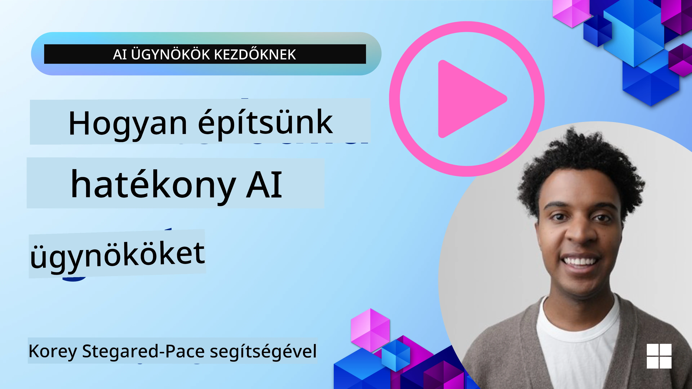
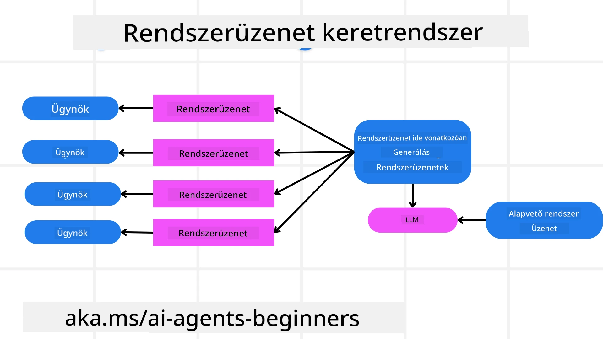
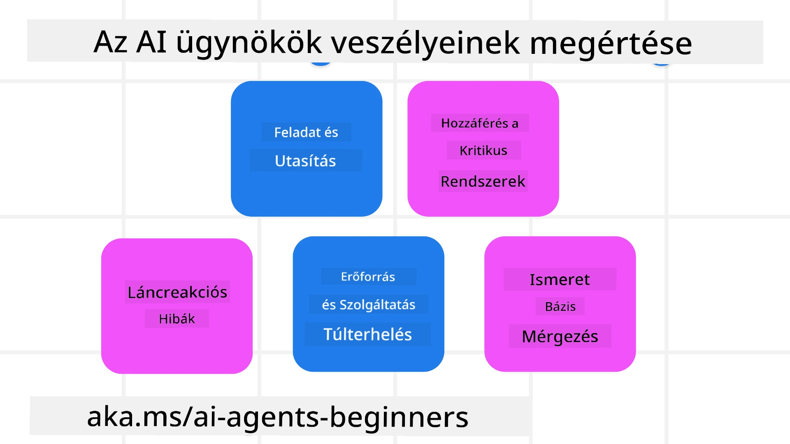
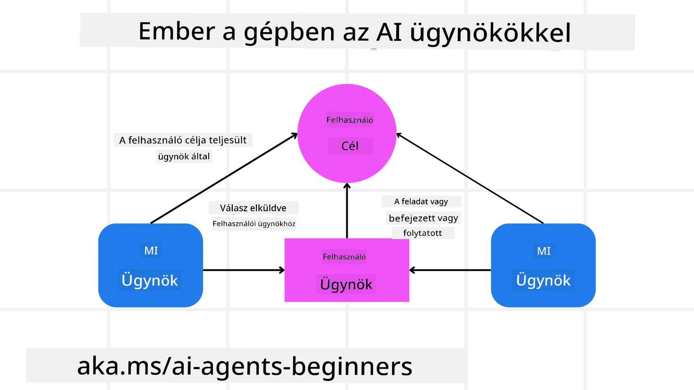

[](https://youtu.be/iZKkMEGBCUQ?si=Q-kEbcyHUMPoHp8L)

> _(Kattintson a fenti képre az óra videójának megtekintéséhez)_

# Megbízható AI Ágensek építése

## Bevezetés

Ez az óra a következőket tárgyalja:

- Hogyan lehet biztonságos és hatékony AI ágenseket építeni és telepíteni
- Fontos biztonsági megfontolások AI ágensek fejlesztése során.
- Hogyan lehet megőrizni az adatok és felhasználók magánéletét AI ágensek fejlesztése közben.

## Tanulási célok

Az óra elvégzése után tudni fogja, hogyan:

- Azonosítsa és csökkentse a kockázatokat AI ágensek létrehozásakor.
- Biztonsági intézkedéseket hajtson végre az adatok és a hozzáférés megfelelő kezelése érdekében.
- Olyan AI ágenseket hozzon létre, amelyek megőrzik az adatvédelmet és minőségi felhasználói élményt biztosítanak.

## Biztonság

Nézzük először a biztonságos ágenseképző alkalmazások felépítését. A biztonság azt jelenti, hogy az AI ágens a tervek szerint működik. Ágenseképző alkalmazások fejlesztőjeként vannak módszereink és eszközeink a biztonság maximalizálására:

### Rendszerüzenet-keretrendszer építése

Ha valaha épített AI alkalmazást Nagy Nyelvi Modellekkel (LLM-ekkel), tudja, milyen fontos egy robusztus rendszerprompt vagy rendszerüzenet megtervezése. Ezek a promptok határozzák meg a meta szabályokat, utasításokat és irányelveket arra, hogy az LLM hogyan fog kommunikálni a felhasználóval és az adatokkal.

AI ágenseknél a rendszerprompt még fontosabb, mivel az AI ágenseknek nagyon specifikus utasításokra lesz szükségük a rájuk bízott feladatok teljesítéséhez.

A skálázható rendszerpromptok létrehozásához használhatunk egy rendszerüzenet-keretrendszert, amellyel az alkalmazásunkban egy vagy több ágenst építhetünk:



#### 1. lépés: Meta rendszerüzenet létrehozása

A meta promptot egy LLM fogja használni annak érdekében, hogy a rendszerpromptokat generálja az ágens(ek) számára. Ezt sablonként tervezzük meg, hogy hatékonyan tudjunk több ágenst létrehozni, ha szükséges.

Íme egy példa egy meta rendszerüzenetre, amit az LLM-nek adnánk:

```plaintext
You are an expert at creating AI agent assistants. 
You will be provided a company name, role, responsibilities and other
information that you will use to provide a system prompt for.
To create the system prompt, be descriptive as possible and provide a structure that a system using an LLM can better understand the role and responsibilities of the AI assistant. 
```

#### 2. lépés: Alap prompt létrehozása

A következő lépés egy alap prompt létrehozása az AI Ágens leírására. Tartalmaznia kell az ágens szerepét, az általa teljesítendő feladatokat, és bármilyen további felelősséget.

Íme egy példa:

```plaintext
You are a travel agent for Contoso Travel that is great at booking flights for customers. To help customers you can perform the following tasks: lookup available flights, book flights, ask for preferences in seating and times for flights, cancel any previously booked flights and alert customers on any delays or cancellations of flights.  
```

#### 3. lépés: Az alap rendszerüzenet átadása az LLM-nek

Most optimalizálhatjuk a rendszerüzenetet úgy, hogy a meta rendszerüzenetet és az alap rendszerüzenetet adjuk meg.

Ez egy jobban megtervezett rendszerüzenetet eredményez, amely irányítja AI ágenseinket:

```markdown
**Company Name:** Contoso Travel  
**Role:** Travel Agent Assistant

**Objective:**  
You are an AI-powered travel agent assistant for Contoso Travel, specializing in booking flights and providing exceptional customer service. Your main goal is to assist customers in finding, booking, and managing their flights, all while ensuring that their preferences and needs are met efficiently.

**Key Responsibilities:**

1. **Flight Lookup:**
    
    - Assist customers in searching for available flights based on their specified destination, dates, and any other relevant preferences.
    - Provide a list of options, including flight times, airlines, layovers, and pricing.
2. **Flight Booking:**
    
    - Facilitate the booking of flights for customers, ensuring that all details are correctly entered into the system.
    - Confirm bookings and provide customers with their itinerary, including confirmation numbers and any other pertinent information.
3. **Customer Preference Inquiry:**
    
    - Actively ask customers for their preferences regarding seating (e.g., aisle, window, extra legroom) and preferred times for flights (e.g., morning, afternoon, evening).
    - Record these preferences for future reference and tailor suggestions accordingly.
4. **Flight Cancellation:**
    
    - Assist customers in canceling previously booked flights if needed, following company policies and procedures.
    - Notify customers of any necessary refunds or additional steps that may be required for cancellations.
5. **Flight Monitoring:**
    
    - Monitor the status of booked flights and alert customers in real-time about any delays, cancellations, or changes to their flight schedule.
    - Provide updates through preferred communication channels (e.g., email, SMS) as needed.

**Tone and Style:**

- Maintain a friendly, professional, and approachable demeanor in all interactions with customers.
- Ensure that all communication is clear, informative, and tailored to the customer's specific needs and inquiries.

**User Interaction Instructions:**

- Respond to customer queries promptly and accurately.
- Use a conversational style while ensuring professionalism.
- Prioritize customer satisfaction by being attentive, empathetic, and proactive in all assistance provided.

**Additional Notes:**

- Stay updated on any changes to airline policies, travel restrictions, and other relevant information that could impact flight bookings and customer experience.
- Use clear and concise language to explain options and processes, avoiding jargon where possible for better customer understanding.

This AI assistant is designed to streamline the flight booking process for customers of Contoso Travel, ensuring that all their travel needs are met efficiently and effectively.

```

#### 4. lépés: Ismétlés és fejlesztés

Ennek a rendszerüzenet-keretrendszernek az értéke abban rejlik, hogy könnyebbé teszi több ágensek által használt rendszerüzenetek létrehozását, valamint idővel javítani is lehet a rendszerüzeneteket. Ritka, hogy egy rendszerüzenet az első próbálkozásra tökéletesen működjön a teljes használati esetben. Az apró módosítások és fejlesztések lehetősége, az alap rendszerüzenet megváltoztatása és újbóli futtatása segít az eredmények összehasonlításában és értékelésében.

## Fenyegetések megértése

A megbízható AI ágensek építéséhez fontos megérteni és mérsékelni az AI ágensre leselkedő kockázatokat és fenyegetéseket. Nézzünk meg csak néhány különböző fenyegetést az AI ágensek számára, és hogyan lehet jobban tervezni és felkészülni rájuk.



### Feladat és utasítás

**Leírás:** A támadók megpróbálják megváltoztatni az AI ágens utasításait vagy céljait promptolás vagy bemenetek manipulálásával.

**Megelőzés**: Validációs ellenőrzéseket és bemeneti szűrőket hajtson végre, hogy észlelje a potenciálisan veszélyes promptokat, mielőtt azokat az AI ágens feldolgozná. Mivel ezek a támadások általában gyakori interakciót igényelnek az ágensekkel, korlátozza a beszélgetés fordulóinak számát, hogy megelőzze az ilyen támadásokat.

### Kritikus rendszerekhez való hozzáférés

**Leírás:** Ha az AI ágens hozzáfér a bizalmas adatokat tároló rendszerekhez és szolgáltatásokhoz, a támadók kompromittálhatják a kommunikációt az ágens és ezek a szolgáltatások között. Ezek lehetnek közvetlen támadások vagy közvetett próbálkozások arra, hogy információt szerezzenek ezekről a rendszerekről az ágensen keresztül.

**Megelőzés:** Az AI ágensek hozzáférése a rendszerekhez csak szükség esetén legyen engedélyezett az ilyen támadások elkerülésére. Az ágens és a rendszer közötti kommunikációnak szintén biztonságosnak kell lennie. A hitelesítés és a hozzáférés-ellenőrzés megvalósítása további védelmi módszer.

### Erőforrás- és szolgáltatás túlterhelés

**Leírás:** Az AI ágensek különféle eszközökhöz és szolgáltatásokhoz férnek hozzá a feladatok végrehajtásához. A támadók ezt kihasználva nagy mennyiségű kérést küldhetnek az AI Ágensen keresztül ezeknek a szolgáltatásoknak, ami rendszerleállásokhoz vagy nagy költségekhez vezethet.

**Megelőzés:** Alkalmazzon szabályzatokat a kérések számának korlátozására, amelyeket egy AI ágens küldhet egy szolgáltatásnak. A beszélgetések fordulóinak és az AI ágenshez intézett kérések számának csökkentése szintén megakadályozhatja az ilyen támadásokat.

### Tudásbázis megfertőzése

**Leírás:** Ez a fajta támadás nem közvetlenül az AI ágenst célozza, hanem a tudásbázist és egyéb szolgáltatásokat, amelyeket az AI ágens használ. Ez lehet az adatok vagy információk megrongálása, amelyeket az AI ágens használ a feladatok végrehajtásához, aminek következtében elfogult vagy szándékolatlan válaszokat adhat a felhasználónak.

**Megelőzés:** Végezze rendszeresen az AI ágens munkafolyamataiban használt adatok ellenőrzését. Gondoskodjon arról, hogy ezekhez az adatokhoz biztonságos legyen a hozzáférés, és csak megbízható személyek módosíthassák azokat az ilyen típusú támadások elkerülése érdekében.

### Láncreakciós hibák

**Leírás:** Az AI ágensek különböző eszközökhöz és rendszerekhez férnek hozzá a feladatok elvégzéséhez. A támadók által okozott hibák más rendszerek meghibásodásához vezethetnek, amelyekhez az AI ágens kapcsolódik, ami a támadást szélesebbé és nehezebben elháríthatóvá teszi.

**Megelőzés:** Egy módja ennek az elkerülésére, hogy az AI ágens korlátozott környezetben működjön, például Docker-konténerben, így megakadályozva a közvetlen rendszer támadásokat. Másik módszer a visszatesztelés és újrapróbálkozás megvalósítása, amikor bizonyos rendszerek hibával válaszolnak, így elkerülhetőek az nagyobb rendszerleállások.

## Ember a hurkon belül

Egy másik hatékony módszer megbízható AI ágensek építésére az ember a hurkon belül elv használata. Ez egy olyan folyamatot hoz létre, ahol a felhasználók futás közben visszajelzést adhatnak az ágenseknek. A felhasználók lényegében ágensekként működnek egy többrésztvevős rendszerben, jóváhagyva vagy leállítva a futó folyamatot.



Íme egy kódrészlet a Microsoft Agent Framework használatával, amely megmutatja, hogyan valósul meg ez a koncepció:

```python
import os
from agent_framework.foundry import FoundryChatClient
from azure.identity import AzureCliCredential

# Hozza létre a szolgáltatót emberi közbeavatkozással történő jóváhagyással
provider = FoundryChatClient(
    project_endpoint=os.environ["AZURE_AI_PROJECT_ENDPOINT"],
    model=os.environ["AZURE_AI_MODEL_DEPLOYMENT_NAME"],
    credential=AzureCliCredential(),
)

# Hozza létre az ügynököt emberi jóváhagyási lépéssel
response = provider.create_response(
    input="Write a 4-line poem about the ocean.",
    instructions="You are a helpful assistant. Ask for user approval before finalizing.",
)

# A felhasználó áttekintheti és jóváhagyhatja a választ
print(response.output_text)
user_input = input("Do you approve? (APPROVE/REJECT): ")
if user_input == "APPROVE":
    print("Response approved.")
else:
    print("Response rejected. Revising...")
```

## Összefoglalás

Megbízható AI ágensek építéséhez alapos tervezés, robusztus biztonsági intézkedések és folyamatos iteráció szükséges. A strukturált meta prompt rendszerek bevezetésével, a potenciális fenyegetések megértésével és a mérséklő stratégiák alkalmazásával a fejlesztők olyan AI ágenseket hozhatnak létre, amelyek egyszerre biztonságosak és hatékonyak. Emellett az ember a hurkon belül megközelítés beépítése biztosítja, hogy az AI ágensek összhangban maradjanak a felhasználók igényeivel, miközben minimalizálják a kockázatokat. Ahogy az AI tovább fejlődik, a biztonság, adatvédelem és etikai szempontok proaktív kezelése kulcsfontosságú lesz a megbízhatóság és bizalom előmozdításában az AI-alapú rendszerekben.

## Kódminták

- [`code_samples/06-system-message-framework.ipynb`](code_samples/06-system-message-framework.ipynb): Meta-prompt rendszerüzenet-keretrendszer lépésről lépésre.
- [`code_samples/06-human-in-the-loop.ipynb`](code_samples/06-human-in-the-loop.ipynb): Előzetes jóváhagyási kapuk, kockázati szintezés és audit naplózás megbízható ágensek számára.

### Több kérdése van a megbízható AI ágensek építéséről?

Csatlakozzon a [Microsoft Foundry Discord](https://discord.com/invite/ATgtXmAS5D) közösséghez, hogy találkozzon más tanulókkal, részt vegyen a konzultációkon, és válaszokat kapjon AI ágensekkel kapcsolatos kérdéseire.

## További források

- <a href="https://learn.microsoft.com/azure/ai-studio/responsible-use-of-ai-overview" target="_blank">Felelős MI áttekintés</a>
- <a href="https://learn.microsoft.com/azure/ai-studio/concepts/evaluation-approach-gen-ai" target="_blank">Generatív MI modellek és MI alkalmazások értékelése</a>
- <a href="https://learn.microsoft.com/azure/ai-services/openai/concepts/system-message?context=%2Fazure%2Fai-studio%2Fcontext%2Fcontext&tabs=top-techniques" target="_blank">Biztonsági rendszerüzenetek</a>
- <a href="https://blogs.microsoft.com/wp-content/uploads/prod/sites/5/2022/06/Microsoft-RAI-Impact-Assessment-Template.pdf?culture=en-us&country=us" target="_blank">Kockázatértékelési sablon</a>

## Előző óra

[Agentic RAG](../05-agentic-rag/README.md)

## Következő óra

[Tervezési minták](../07-planning-design/README.md)

---

<!-- CO-OP TRANSLATOR DISCLAIMER START -->
**Jogi nyilatkozat**:
Ez a dokumentum az AI fordítási szolgáltatás, a [Co-op Translator](https://github.com/Azure/co-op-translator) segítségével készült. Bár az pontosságra törekszünk, kérjük, vegye figyelembe, hogy az automatikus fordítások hibákat vagy pontatlanságokat tartalmazhatnak. Az eredeti dokumentum az anyanyelvén tekintendő hiteles forrásnak. Fontos információk esetén professzionális emberi fordítást javasolunk. Nem vállalunk felelősséget semmilyen félreértésért vagy téves értelmezésért, amely ebből a fordításból ered.
<!-- CO-OP TRANSLATOR DISCLAIMER END -->