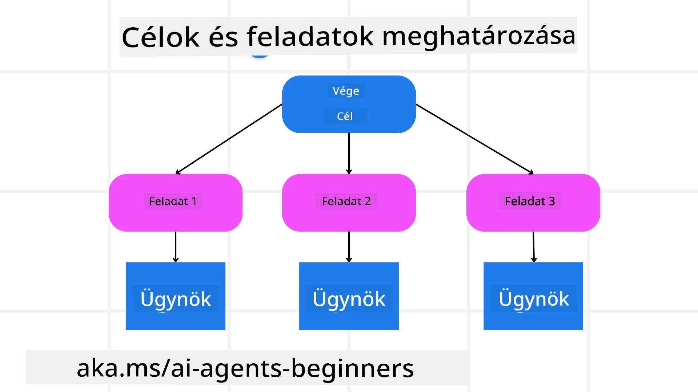

[](https://youtu.be/kPfJ2BrBCMY?si=9pYpPXp0sSbK91Dr)

> _(Kattints a fenti képre a lecke videójának megtekintéséhez)_

# Tervezési minta

## Bevezetés

Ez a lecke a következőket tárgyalja

* Egyértelmű átfogó cél meghatározása és egy összetett feladat lebontása kezelhető részekre.
* Strukturált kimenet kihasználása a megbízhatóbb és géppel olvasható válaszok érdekében.
* Eseményvezérelt megközelítés alkalmazása a dinamikus feladatok és váratlan bemenetek kezelésére.

## Tanulási célok

A lecke elvégzése után meg fogod érteni a következőket:

* Az AI ügynök átfogó céljának azonosítása és beállítása, biztosítva, hogy egyértelműen tudja, mi a végső cél.
* Egy összetett feladat lebontása kezelhető alfeladatokra és ezek logikus sorrendbe rendezése.
* Az ügynökök ellátása a megfelelő eszközökkel (pl. keresőeszközök vagy adatelemző eszközök), eldönteni, mikor és hogyan használják ezeket, valamint a felmerülő váratlan helyzetek kezelése.
* Az alfeladatok eredményeinek kiértékelése, a teljesítmény mérése és a műveletek iterálása a végső kimenet javítása érdekében.

## Az átfogó cél meghatározása és a feladat lebontása



A legtöbb valós feladat túl összetett ahhoz, hogy egyetlen lépésben kezeljük. Egy AI ügynöknek tömör céllal kell rendelkeznie, amely irányítja a tervezést és a műveleteket. Például vegyük a célt:

    "Generate a 3-day travel itinerary."

Bár egyszerű megfogalmazni, további finomítást igényel. Minél világosabb a cél, annál jobban tud az ügynök (és bármely emberi közreműködő) a helyes eredmény elérésére összpontosítani, például egy átfogó útiterv létrehozására repülési opciókkal, szállodajavaslatokkal és programajánlatokkal.

### Feladatok lebontása

A nagy vagy bonyolult feladatok kezelhetőbbé válnak, ha kisebb, célorientált alfeladatokra bontjuk őket.
A háromnapos útiterv példájánál a célt lebontva például a következőket kapjuk:

* Repülőjegy foglalás
* Szállásfoglalás
* Autóbérlés
* Személyre szabás

Minden alfeladattal külön ügynökök vagy folyamatok foglalkozhatnak. Egy ügynök specializálódhat a legjobb repülőjegyek keresésére, egy másik a szállásfoglalásokra stb. Egy koordináló vagy „downstream” ügynök ezután összeállíthatja ezeket az eredményeket egy koherens útitervvé a végfelhasználó számára.

Ez a moduláris megközelítés lehetővé teszi a fokozatos fejlesztéseket is. Például hozzáadhatsz specializált ügynököket Ételajánlásokhoz vagy Helyi programjavaslatokhoz, és idővel finomíthatod az útitervet.

### Strukturált kimenet

A Nagy Nyelvi Modellek (LLM-ek) strukturált kimenetet (pl. JSON) tudnak generálni, amelyet könnyebb feldolgozni a downstream ügynökök vagy szolgáltatások számára. Ez különösen hasznos többügynökös környezetben, ahol a tervezési kimenet kézhezvétele után végrehajthatjuk ezeket a feladatokat.

A következő Python részlet bemutat egy egyszerű tervező ügynököt, amely egy célt alfeladatokra bont és strukturált tervet generál:

```python
from pydantic import BaseModel
from enum import Enum
from typing import List, Optional, Union
import json
import os
from typing import Optional
from pprint import pprint
from agent_framework.azure import AzureAIProjectAgentProvider
from azure.identity import AzureCliCredential

class AgentEnum(str, Enum):
    FlightBooking = "flight_booking"
    HotelBooking = "hotel_booking"
    CarRental = "car_rental"
    ActivitiesBooking = "activities_booking"
    DestinationInfo = "destination_info"
    DefaultAgent = "default_agent"
    GroupChatManager = "group_chat_manager"

# Utazási alfeladatmodell
class TravelSubTask(BaseModel):
    task_details: str
    assigned_agent: AgentEnum  # Szeretnénk a feladatot az ügynöknek kiosztani

class TravelPlan(BaseModel):
    main_task: str
    subtasks: List[TravelSubTask]
    is_greeting: bool

provider = AzureAIProjectAgentProvider(credential=AzureCliCredential())

# Határozd meg a felhasználó üzenetét
system_prompt = """You are a planner agent.
    Your job is to decide which agents to run based on the user's request.
    Provide your response in JSON format with the following structure:
{'main_task': 'Plan a family trip from Singapore to Melbourne.',
 'subtasks': [{'assigned_agent': 'flight_booking',
               'task_details': 'Book round-trip flights from Singapore to '
                               'Melbourne.'}
    Below are the available agents specialised in different tasks:
    - FlightBooking: For booking flights and providing flight information
    - HotelBooking: For booking hotels and providing hotel information
    - CarRental: For booking cars and providing car rental information
    - ActivitiesBooking: For booking activities and providing activity information
    - DestinationInfo: For providing information about destinations
    - DefaultAgent: For handling general requests"""

user_message = "Create a travel plan for a family of 2 kids from Singapore to Melbourne"

response = client.create_response(input=user_message, instructions=system_prompt)

response_content = response.output_text
pprint(json.loads(response_content))
```

### Tervező ügynök többügynökös orkesztrációval

Ebben a példában egy Szemantikus útválasztó ügynök kap egy felhasználói kérést (pl. „Szükségem van egy szállás tervre az utamhoz.”).

A tervező ezután:

* Megkapja a szállástervet: A tervező feldolgozza a felhasználó üzenetét és a rendszerüzenet alapján (beleértve a rendelkezésre álló ügynökök részleteit) strukturált utazási tervet generál.
* Felsorolja az ügynököket és eszközeiket: Az ügynökregiszter egy listát tartalmaz az ügynökökről (pl. repülés, szállás, autóbérlés és programok) és az általuk kínált funkciókról vagy eszközökről.
* A terv továbbítása a megfelelő ügynökökhöz: Az alfeladatok számától függően a tervező vagy közvetlenül elküldi az üzenetet egy dedikált ügynöknek (egyfázisú forgatókönyvek esetén), vagy egy csoportos csevegés kezelőn keresztül koordinálja a többügynökös együttműködést.
* Az eredmény összegzése: Végül a tervező összefoglalja a generált tervet az átláthatóság érdekében.
A következő Python kódmintában ezek a lépések láthatók:

```python

from pydantic import BaseModel

from enum import Enum
from typing import List, Optional, Union

class AgentEnum(str, Enum):
    FlightBooking = "flight_booking"
    HotelBooking = "hotel_booking"
    CarRental = "car_rental"
    ActivitiesBooking = "activities_booking"
    DestinationInfo = "destination_info"
    DefaultAgent = "default_agent"
    GroupChatManager = "group_chat_manager"

# Utazási alfeladat modell

class TravelSubTask(BaseModel):
    task_details: str
    assigned_agent: AgentEnum # A feladatot az ügynöknek szeretnénk kiosztani

class TravelPlan(BaseModel):
    main_task: str
    subtasks: List[TravelSubTask]
    is_greeting: bool
import json
import os
from typing import Optional

from agent_framework.azure import AzureAIProjectAgentProvider
from azure.identity import AzureCliCredential

# Hozd létre a klienst

provider = AzureAIProjectAgentProvider(credential=AzureCliCredential())

from pprint import pprint

# Határozd meg a felhasználói üzenetet

system_prompt = """You are a planner agent.
    Your job is to decide which agents to run based on the user's request.
    Below are the available agents specialized in different tasks:
    - FlightBooking: For booking flights and providing flight information
    - HotelBooking: For booking hotels and providing hotel information
    - CarRental: For booking cars and providing car rental information
    - ActivitiesBooking: For booking activities and providing activity information
    - DestinationInfo: For providing information about destinations
    - DefaultAgent: For handling general requests"""

user_message = "Create a travel plan for a family of 2 kids from Singapore to Melbourne"

response = client.create_response(input=user_message, instructions=system_prompt)

response_content = response.output_text

# Nyomtasd ki a válasz tartalmát JSON-ként történő betöltés után

pprint(json.loads(response_content))
```

A következőkben a korábbi kód kimenete szerepel, és ezt a strukturált kimenetet felhasználhatod az `assigned_agent`-hez történő továbbításhoz és az útiterv összegzéséhez a végfelhasználó számára.

```json
{
    "is_greeting": "False",
    "main_task": "Plan a family trip from Singapore to Melbourne.",
    "subtasks": [
        {
            "assigned_agent": "flight_booking",
            "task_details": "Book round-trip flights from Singapore to Melbourne."
        },
        {
            "assigned_agent": "hotel_booking",
            "task_details": "Find family-friendly hotels in Melbourne."
        },
        {
            "assigned_agent": "car_rental",
            "task_details": "Arrange a car rental suitable for a family of four in Melbourne."
        },
        {
            "assigned_agent": "activities_booking",
            "task_details": "List family-friendly activities in Melbourne."
        },
        {
            "assigned_agent": "destination_info",
            "task_details": "Provide information about Melbourne as a travel destination."
        }
    ]
}
```

Egy példajegyzet a fenti kódmintával elérhető [itt](07-python-agent-framework.ipynb).

### Iteratív tervezés

Néhány feladat visszacsatolást vagy újratervezést igényel, ahol az egyik alfeladat eredménye befolyásolja a következőt. Például ha az ügynök váratlan adatformát talál a repülőjegyfoglalás során, előfordulhat, hogy módosítania kell a stratégiáját, mielőtt továbblép a szállásfoglalásokhoz.

Ezen felül a felhasználói visszajelzés (pl. egy ember úgy dönt, hogy korábbi járatot szeretne) részleges újratervezést indíthat. Ez a dinamikus, iteratív megközelítés biztosítja, hogy a végső megoldás összhangban legyen a valós világ korlátaival és a változó felhasználói preferenciákkal.

e.g példa kód

```python
from agent_framework.azure import AzureAIProjectAgentProvider
from azure.identity import AzureCliCredential
#.. ugyanaz, mint az előző kód, és adja tovább a felhasználó előzményeit és a jelenlegi tervet

system_prompt = """You are a planner agent to optimize the
    Your job is to decide which agents to run based on the user's request.
    Below are the available agents specialized in different tasks:
    - FlightBooking: For booking flights and providing flight information
    - HotelBooking: For booking hotels and providing hotel information
    - CarRental: For booking cars and providing car rental information
    - ActivitiesBooking: For booking activities and providing activity information
    - DestinationInfo: For providing information about destinations
    - DefaultAgent: For handling general requests"""

user_message = "Create a travel plan for a family of 2 kids from Singapore to Melbourne"

response = client.create_response(
    input=user_message,
    instructions=system_prompt,
    context=f"Previous travel plan - {TravelPlan}",
)
# .. tervezze újra és küldje el a feladatokat a megfelelő ügynököknek
```

Átfogóbb tervezéshez nézd meg a Magnetic One <a href="https://www.microsoft.com/research/articles/magentic-one-a-generalist-multi-agent-system-for-solving-complex-tasks" target="_blank">Blogbejegyzés</a>-et a komplex feladatok megoldásáról.

## Összefoglaló

Ebben a cikkben megvizsgáltunk egy példát arra, hogyan hozhatunk létre egy tervezőt, amely dinamikusan kiválasztja a rendelkezésre álló ügynököket. A tervező kimenete lebontja a feladatokat és hozzárendeli az ügynököket, hogy azok végrehajthatók legyenek. Feltételezzük, hogy az ügynökök hozzáférnek a feladat végrehajtásához szükséges funkciókhoz/eszközökhöz. Az ügynökök mellett további mintákat is beilleszthetsz, például reflexiót, összegzőt és round-robin csevegést a további testreszabáshoz.

## További források

Magentic One - Egy általános célú többügynökös rendszer a komplex feladatok megoldására, amely lenyűgöző eredményeket ért el több kihívást jelentő ügynökös benchmarkon. Hivatkozás: <a href="https://www.microsoft.com/research/articles/magentic-one-a-generalist-multi-agent-system-for-solving-complex-tasks" target="_blank">Magentic One</a>. Ebben a megvalósításban az orkesztrátor feladatspecifikus terveket hoz létre és delegálja ezeket a rendelkezésre álló ügynököknek. A tervezés mellett az orkesztrátor nyomon követési mechanizmust is alkalmaz a feladat előrehaladásának monitorozására és szükség szerint újratervezésre.

### További kérdése van a tervezési mintáról?

Csatlakozz a [Microsoft Foundry Discord](https://aka.ms/ai-agents/discord)-hoz, hogy találkozhass más tanulókkal, részt vehess konzultációs órákon és választ kapj az AI-ügynökökkel kapcsolatos kérdéseidre.

## Előző lecke

[Megbízható AI-ügynökök építése](../06-building-trustworthy-agents/README.md)

## Következő lecke

[Többügynökös tervezési minta](../08-multi-agent/README.md)

---

<!-- CO-OP TRANSLATOR DISCLAIMER START -->
Felelősségkizárás:
Ezt a dokumentumot az AI-alapú fordító szolgáltatás, a [Co-op Translator](https://github.com/Azure/co-op-translator) segítségével fordították. Bár törekszünk a pontosságra, kérjük, vegye figyelembe, hogy az automatikus fordítások hibákat vagy pontatlanságokat tartalmazhatnak. Az eredeti dokumentum eredeti nyelvű változatát tekintse a hiteles forrásnak. Kritikus jelentőségű információk esetén szakmai, emberi fordítás ajánlott. Nem vállalunk felelősséget az ebből a fordításból eredő félreértésekért vagy helytelen értelmezésekért.
<!-- CO-OP TRANSLATOR DISCLAIMER END -->