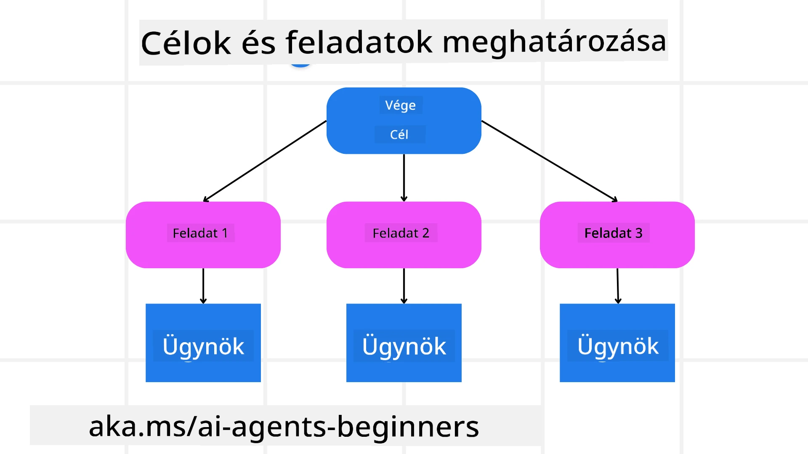

[](https://youtu.be/kPfJ2BrBCMY?si=9pYpPXp0sSbK91Dr)

> _(Kattintson a fenti képre a lecke videójának megtekintéséhez)_

# Tervezési mintázat

## Bevezetés

Ez a lecke a következőkről fog szólni

* Egyértelmű, átfogó cél meghatározása és egy összetett feladat kezelhető részekre bontása.
* Strukturált kimenet hasznosítása megbízhatóbb és gépileg olvasható válaszokért.
* Eseményvezérelt megközelítés alkalmazása a dinamikus feladatok és váratlan bemenetek kezelésére.

## Tanulási célok

A lecke elvégzése után meg fogja érteni, hogyan:

* Meghatározható és beállítható egy átfogó cél egy AI ügynök számára, biztosítva, hogy világosan tudja, mit kell elérnie.
* Egy összetett feladat lebontása kezelhető alfeladatokra, és ezek logikus sorrendbe állítása.
* Az ügynökök ellátása a megfelelő eszközökkel (pl. keresőeszközök vagy adat elemző eszközök), eldöntve, mikor és hogyan használják ezeket, és a váratlan helyzetek kezelése.
* Az alfeladatok eredményeinek értékelése, teljesítmény mérés, és az intézkedések ismétlése a végső kimenet javítása érdekében.

## Az átfogó cél meghatározása és a feladat lebontása



A legtöbb valós világban előforduló feladat túl bonyolult ahhoz, hogy egyetlen lépésben kezeljük. Egy AI ügynöknek tömör célt kell kapnia, ami irányítja a tervezést és a tevékenységeket. Például nézzük a következő célt:

    "Hozz létre egy 3 napos utazási tervet."

Bár egyszerűen megfogalmazható, még finomítást igényel. Minél világosabb a cél, annál jobban tud az ügynök (és az esetleges emberi közreműködők) az eredmény elérésére koncentrálni, például egy átfogó útiterv készítésére repülőjegyekkel, szállodai ajánlásokkal és programjavaslatokkal.

### Feladat lebontása

Nagy vagy bonyolult feladatok kezelhetőbbé válnak, ha kisebb, célorientált alfeladatokra bontjuk őket.
Az utazási terv példájánál a következő alfeladatokra bonthatja a célt:

* Repülőjegy foglalás
* Szállás foglalás
* Autókölcsönzés
* Személyre szabás

Ezeket az alfeladatokat külön ügynökök vagy folyamatok kezelhetik. Egy ügynök specializálódhat a legjobb repülőjegy ajánlatok keresésére, egy másik a szállás foglalásra, és így tovább. Egy koordináló vagy „leszálló ági” ügynök összeállíthatja ezeket az eredményeket egy egységes útitervbe a végfelhasználó számára.

Ez a moduláris megközelítés lehetővé teszi az időközbeni fejlesztéseket is. Például hozzáadhat speciális ügynököket étel-ajánlásokhoz vagy helyi programjavaslatokhoz, és finomíthatja az útitervet idővel.

### Strukturált kimenet

A Nagy Nyelvi Modellek (LLM-ek) képesek strukturált kimenetet (pl. JSON) generálni, amit könnyebb értelmezni és feldolgozni a „leszálló” ügynökök vagy szolgáltatások számára. Ez különösen hasznos több ügynökös környezetben, ahol a tervezési eredmény után tudjuk végrehajtani a műveleteket.

A következő Python példa egy egyszerű tervező ügynököt mutat be, amely lebont egy célt alfeladatokra és strukturált tervet generál:

```python
from pydantic import BaseModel
from enum import Enum
from typing import List, Optional, Union
import json
import os
from typing import Optional
from pprint import pprint
from agent_framework.foundry import FoundryChatClient
from azure.identity import AzureCliCredential

class AgentEnum(str, Enum):
    FlightBooking = "flight_booking"
    HotelBooking = "hotel_booking"
    CarRental = "car_rental"
    ActivitiesBooking = "activities_booking"
    DestinationInfo = "destination_info"
    DefaultAgent = "default_agent"
    GroupChatManager = "group_chat_manager"

# Utazási alfeladat modell
class TravelSubTask(BaseModel):
    task_details: str
    assigned_agent: AgentEnum  # hozzá akarjuk rendelni a feladatot az ügynökhöz

class TravelPlan(BaseModel):
    main_task: str
    subtasks: List[TravelSubTask]
    is_greeting: bool

provider = FoundryChatClient(
    project_endpoint=os.environ["AZURE_AI_PROJECT_ENDPOINT"],
    model=os.environ["AZURE_AI_MODEL_DEPLOYMENT_NAME"],
    credential=AzureCliCredential(),
)

# Határozza meg a felhasználói üzenetet
system_prompt = """You are a planner agent.
    Your job is to decide which agents to run based on the user's request.
    Provide your response in JSON format with the following structure:
{'main_task': 'Plan a family trip from Singapore to Melbourne.',
 'subtasks': [{'assigned_agent': 'flight_booking',
               'task_details': 'Book round-trip flights from Singapore to '
                               'Melbourne.'}
    Below are the available agents specialised in different tasks:
    - FlightBooking: For booking flights and providing flight information
    - HotelBooking: For booking hotels and providing hotel information
    - CarRental: For booking cars and providing car rental information
    - ActivitiesBooking: For booking activities and providing activity information
    - DestinationInfo: For providing information about destinations
    - DefaultAgent: For handling general requests"""

user_message = "Create a travel plan for a family of 2 kids from Singapore to Melbourne"

response = client.create_response(input=user_message, instructions=system_prompt)

response_content = response.output_text
pprint(json.loads(response_content))
```

### Tervező ügynök több ügynökös működéssel

Ebben a példában egy Szemantikus Router ügynök kap egy felhasználói kérést (pl. „Szükségem van egy szállás-tervre az utazásomhoz.”).

A tervező ezt követően:

* Megkapja a Szállás Tervet: A tervező a felhasználó üzenetét, valamint a rendszerparancs (beleértve az elérhető ügynökök adatait) alapján strukturált utazási tervet generál.
* Felsorolja az ügynököket és eszközeiket: Az ügynökregiszter tartalmazza az ügynökök listáját (pl. repülő, szállás, autókölcsönzés és programok) az általuk kínált funkciókkal vagy eszközökkel.
* Útvonalakat állít be a terv alapján az érintett ügynököknek: Az alfeladatok számától függően a tervező vagy közvetlenül elküldi az üzenetet egy dedikált ügynöknek (egytasks helyzetben), vagy egy csoportos chat menedzseren keresztül koordinál több ügynökös együttműködést.
* Összefoglalja az eredményt: Végül a tervező összefoglalja a generált tervet az átláthatóság érdekében.
A következő Python kódminta ezeket a lépéseket szemlélteti:

```python

from pydantic import BaseModel

from enum import Enum
from typing import List, Optional, Union

class AgentEnum(str, Enum):
    FlightBooking = "flight_booking"
    HotelBooking = "hotel_booking"
    CarRental = "car_rental"
    ActivitiesBooking = "activities_booking"
    DestinationInfo = "destination_info"
    DefaultAgent = "default_agent"
    GroupChatManager = "group_chat_manager"

# Utazási alfeladat modell

class TravelSubTask(BaseModel):
    task_details: str
    assigned_agent: AgentEnum # a feladatot az ügynökhöz akarjuk rendelni

class TravelPlan(BaseModel):
    main_task: str
    subtasks: List[TravelSubTask]
    is_greeting: bool
import json
import os
from typing import Optional

from agent_framework.foundry import FoundryChatClient
from azure.identity import AzureCliCredential

# Kliens létrehozása

provider = FoundryChatClient(
    project_endpoint=os.environ["AZURE_AI_PROJECT_ENDPOINT"],
    model=os.environ["AZURE_AI_MODEL_DEPLOYMENT_NAME"],
    credential=AzureCliCredential(),
)

from pprint import pprint

# Felhasználói üzenet meghatározása

system_prompt = """You are a planner agent.
    Your job is to decide which agents to run based on the user's request.
    Below are the available agents specialized in different tasks:
    - FlightBooking: For booking flights and providing flight information
    - HotelBooking: For booking hotels and providing hotel information
    - CarRental: For booking cars and providing car rental information
    - ActivitiesBooking: For booking activities and providing activity information
    - DestinationInfo: For providing information about destinations
    - DefaultAgent: For handling general requests"""

user_message = "Create a travel plan for a family of 2 kids from Singapore to Melbourne"

response = client.create_response(input=user_message, instructions=system_prompt)

response_content = response.output_text

# A válasz tartalmának kinyomtatása, miután JSON-ként betöltöttük

pprint(json.loads(response_content))
```

A következő kimenet a fent említett kód eredménye, ezt a strukturált kimenetet használhatja az `assigned_agent` útvonalának beállítására és az utazási terv összefoglalására a végfelhasználónak.

```json
{
    "is_greeting": "False",
    "main_task": "Plan a family trip from Singapore to Melbourne.",
    "subtasks": [
        {
            "assigned_agent": "flight_booking",
            "task_details": "Book round-trip flights from Singapore to Melbourne."
        },
        {
            "assigned_agent": "hotel_booking",
            "task_details": "Find family-friendly hotels in Melbourne."
        },
        {
            "assigned_agent": "car_rental",
            "task_details": "Arrange a car rental suitable for a family of four in Melbourne."
        },
        {
            "assigned_agent": "activities_booking",
            "task_details": "List family-friendly activities in Melbourne."
        },
        {
            "assigned_agent": "destination_info",
            "task_details": "Provide information about Melbourne as a travel destination."
        }
    ]
}
```

A fenti kódpéldát tartalmazó jegyzetfüzet elérhető [itt](./code_samples/07-python-agent-framework.ipynb).

### Iteratív tervezés

Egyes feladatok visszacsatolást vagy újratervezést igényelnek, ahol egy alfeladat eredménye befolyásolja a következőt. Például, ha az ügynök váratlan adatformátumot talál repülőjegy foglalás közben, stratégiát kell váltania, mielőtt a szállásfoglaláshoz lépne.

Emellett a felhasználói visszajelzés (pl. egy ember dönt arról, hogy korábbi járatot szeretne) részleges újratervezést válthat ki. Ez a dinamikus, iteratív megközelítés biztosítja, hogy a végső megoldás igazodjon a valós világ korlátaihoz és a felhasználói preferenciák változásaihoz.

pl. példa kód

```python
import os
from agent_framework.foundry import FoundryChatClient
from azure.identity import AzureCliCredential
#.. ugyanaz, mint az előző kódban, és továbbadja a felhasználói előzményeket, az aktuális tervet

system_prompt = """You are a planner agent to optimize the
    Your job is to decide which agents to run based on the user's request.
    Below are the available agents specialized in different tasks:
    - FlightBooking: For booking flights and providing flight information
    - HotelBooking: For booking hotels and providing hotel information
    - CarRental: For booking cars and providing car rental information
    - ActivitiesBooking: For booking activities and providing activity information
    - DestinationInfo: For providing information about destinations
    - DefaultAgent: For handling general requests"""

user_message = "Create a travel plan for a family of 2 kids from Singapore to Melbourne"

response = client.create_response(
    input=user_message,
    instructions=system_prompt,
    context=f"Previous travel plan - {TravelPlan}",
)
# .. újratervezi és elküldi a feladatokat a megfelelő ügynököknek
```

További átfogó tervezéshez nézze meg a Magnetic One <a href="https://www.microsoft.com/research/articles/magentic-one-a-generalist-multi-agent-system-for-solving-complex-tasks" target="_blank">Blogbejegyzést</a> az összetett feladatok megoldásához.

## Összefoglalás

Ebben a cikkben egy példán keresztül mutattuk be, hogyan készíthetünk olyan tervezőt, amely dinamikusan képes kiválasztani a definiált elérhető ügynököket. A tervező kimenete lebontja a feladatokat és kiosztja az ügynököket, hogy azok végrehajthatók legyenek. Feltételezzük, hogy az ügynökök rendelkeznek a feladat végrehajtásához szükséges funkciókkal/eszközökkel. Az ügynökök mellett más mintákat is bevonhat, például visszacsatolást, összegzést és körkörös chatet a további testreszabáshoz.

## További források

Magnetic One - Egy általános több ügynökös rendszer összetett feladatok megoldására, amely lenyűgöző eredményeket ért el több kihívást jelentő ügynöki benchmarkon. Hivatkozás: <a href="https://www.microsoft.com/research/articles/magentic-one-a-generalist-multi-agent-system-for-solving-complex-tasks" target="_blank">Magnetic One</a>. Ebben a megvalósításban az koordinátor készít feladatspecifikus terveket, és ezeket a feladatokat delegálja az elérhető ügynököknek. A tervezés mellett a koordinátor egy nyomon követő mechanizmust is alkalmaz a feladat előrehaladásának figyelésére és szükség szerinti újratervezésre.

### További kérdése van a Tervezési mintázatról?

Csatlakozzon a [Microsoft Foundry Discord](https://discord.com/invite/ATgtXmAS5D) közösséghez, hogy találkozzon más tanulókkal, részt vegyen konzultációkon és választ kapjon AI ügynökökkel kapcsolatos kérdéseire.

## Előző lecke

[Megbízható AI ügynökök építése](../06-building-trustworthy-agents/README.md)

## Következő lecke

[Több ügynökös mintázat](../08-multi-agent/README.md)

---

<!-- CO-OP TRANSLATOR DISCLAIMER START -->
**Jogi nyilatkozat**:
Ez a dokumentum az AI fordítási szolgáltatás, a [Co-op Translator](https://github.com/Azure/co-op-translator) segítségével készült. Bár az pontosságra törekszünk, kérjük, vegye figyelembe, hogy az automatikus fordítások hibákat vagy pontatlanságokat tartalmazhatnak. Az eredeti dokumentum az anyanyelvén tekintendő hiteles forrásnak. Fontos információk esetén professzionális emberi fordítást javasolunk. Nem vállalunk felelősséget semmilyen félreértésért vagy téves értelmezésért, amely ebből a fordításból ered.
<!-- CO-OP TRANSLATOR DISCLAIMER END -->