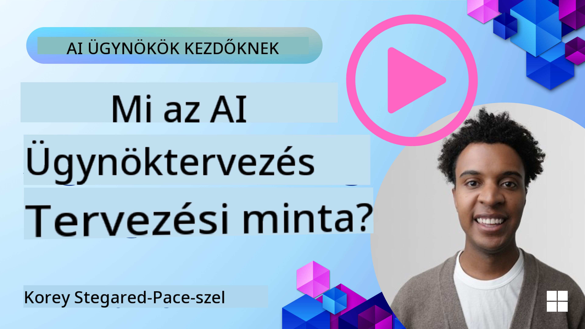
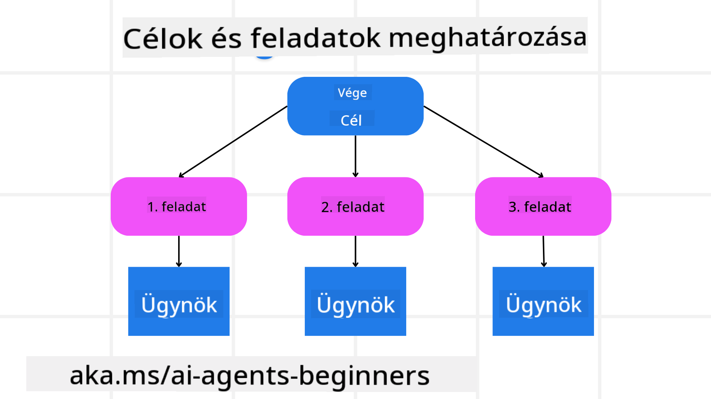

<!--
CO_OP_TRANSLATOR_METADATA:
{
  "original_hash": "43069833a0412210ad5c3cc93d9c2146",
  "translation_date": "2025-09-18T15:28:23+00:00",
  "source_file": "07-planning-design/README.md",
  "language_code": "hu"
}
-->
[](https://youtu.be/kPfJ2BrBCMY?si=9pYpPXp0sSbK91Dr)

> _(Kattints a fenti képre a videó megtekintéséhez az óráról)_

# Tervezési tervezés

## Bevezetés

Ebben a leckében szó lesz:

* Egyértelmű általános cél meghatározása és egy összetett feladat kezelhető részfeladatokra bontása.
* Strukturált kimenet használata megbízhatóbb és gép által olvasható válaszok érdekében.
* Eseményvezérelt megközelítés alkalmazása dinamikus feladatok és váratlan bemenetek kezelésére.

## Tanulási célok

A lecke elvégzése után megérted:

* Hogyan kell azonosítani és meghatározni egy AI ügynök általános célját, biztosítva, hogy egyértelműen tudja, mit kell elérni.
* Hogyan lehet egy összetett feladatot kezelhető részfeladatokra bontani, és logikai sorrendbe szervezni.
* Hogyan lehet az ügynököket megfelelő eszközökkel (pl. keresőeszközök vagy adat-elemző eszközök) ellátni, eldönteni, mikor és hogyan használják ezeket, és kezelni a felmerülő váratlan helyzeteket.
* Hogyan lehet értékelni a részfeladatok eredményeit, mérni a teljesítményt, és iterálni a cselekvéseken a végső kimenet javítása érdekében.

## Az általános cél meghatározása és a feladat bontása



A legtöbb valós feladat túl összetett ahhoz, hogy egyetlen lépésben megoldható legyen. Egy AI ügynöknek tömör célkitűzésre van szüksége, hogy irányítsa a tervezést és a cselekvéseket. Például vegyük a következő célt:

    "Készíts egy 3 napos utazási tervet."

Bár egyszerűen megfogalmazható, mégis finomításra szorul. Minél egyértelműbb a cél, annál jobban tud az ügynök (és bármely emberi közreműködő) a megfelelő eredmény elérésére összpontosítani, például egy átfogó útiterv létrehozására repülési lehetőségekkel, szállodai ajánlásokkal és programjavaslatokkal.

### Feladatbontás

A nagy vagy bonyolult feladatok kezelhetőbbé válnak, ha kisebb, célorientált részfeladatokra bontjuk őket.
Az utazási terv példájánál a célt így bonthatjuk:

* Repülőjegy foglalás
* Szállodai foglalás
* Autóbérlés
* Személyre szabás

Minden részfeladatot dedikált ügynökök vagy folyamatok kezelhetnek. Egy ügynök például a legjobb repülőjegy-ajánlatok keresésére specializálódhat, míg egy másik a szállodai foglalásokra összpontosít, és így tovább. Egy koordináló vagy „lefelé irányító” ügynök ezután összeállíthatja ezeket az eredményeket egy összefüggő útitervvé a végfelhasználó számára.

Ez a moduláris megközelítés lehetővé teszi az inkrementális fejlesztéseket is. Például hozzáadhatunk specializált ügynököket étteremajánlásokhoz vagy helyi programjavaslatokhoz, és idővel finomíthatjuk az útitervet.

### Strukturált kimenet

A nagy nyelvi modellek (LLM-ek) képesek strukturált kimenetet (pl. JSON) generálni, amelyet a lefelé irányuló ügynökök vagy szolgáltatások könnyebben tudnak elemezni és feldolgozni. Ez különösen hasznos egy több ügynököt érintő kontextusban, ahol a tervezési kimenet kézhezvétele után cselekedhetünk ezekkel a feladatokkal. Rövid áttekintésért tekintsd meg az alábbi példát.

Az alábbi Python kódrészlet bemutatja egy egyszerű tervező ügynök működését, amely egy célt részfeladatokra bont, és strukturált tervet generál:

```python
from pydantic import BaseModel
from enum import Enum
from typing import List, Optional, Union
import json
import os
from typing import Optional
from pprint import pprint
from autogen_core.models import UserMessage, SystemMessage, AssistantMessage
from autogen_ext.models.azure import AzureAIChatCompletionClient
from azure.core.credentials import AzureKeyCredential

class AgentEnum(str, Enum):
    FlightBooking = "flight_booking"
    HotelBooking = "hotel_booking"
    CarRental = "car_rental"
    ActivitiesBooking = "activities_booking"
    DestinationInfo = "destination_info"
    DefaultAgent = "default_agent"
    GroupChatManager = "group_chat_manager"

# Travel SubTask Model
class TravelSubTask(BaseModel):
    task_details: str
    assigned_agent: AgentEnum  # we want to assign the task to the agent

class TravelPlan(BaseModel):
    main_task: str
    subtasks: List[TravelSubTask]
    is_greeting: bool

client = AzureAIChatCompletionClient(
    model="gpt-4o-mini",
    endpoint="https://models.inference.ai.azure.com",
    # To authenticate with the model you will need to generate a personal access token (PAT) in your GitHub settings.
    # Create your PAT token by following instructions here: https://docs.github.com/en/authentication/keeping-your-account-and-data-secure/managing-your-personal-access-tokens
    credential=AzureKeyCredential(os.environ["GITHUB_TOKEN"]),
    model_info={
        "json_output": False,
        "function_calling": True,
        "vision": True,
        "family": "unknown",
    },
)

# Define the user message
messages = [
    SystemMessage(content="""You are an planner agent.
    Your job is to decide which agents to run based on the user's request.
                      Provide your response in JSON format with the following structure:
{'main_task': 'Plan a family trip from Singapore to Melbourne.',
 'subtasks': [{'assigned_agent': 'flight_booking',
               'task_details': 'Book round-trip flights from Singapore to '
                               'Melbourne.'}
    Below are the available agents specialised in different tasks:
    - FlightBooking: For booking flights and providing flight information
    - HotelBooking: For booking hotels and providing hotel information
    - CarRental: For booking cars and providing car rental information
    - ActivitiesBooking: For booking activities and providing activity information
    - DestinationInfo: For providing information about destinations
    - DefaultAgent: For handling general requests""", source="system"),
    UserMessage(
        content="Create a travel plan for a family of 2 kids from Singapore to Melboune", source="user"),
]

response = await client.create(messages=messages, extra_create_args={"response_format": 'json_object'})

response_content: Optional[str] = response.content if isinstance(
    response.content, str) else None
if response_content is None:
    raise ValueError("Response content is not a valid JSON string" )

pprint(json.loads(response_content))

# # Ensure the response content is a valid JSON string before loading it
# response_content: Optional[str] = response.content if isinstance(
#     response.content, str) else None
# if response_content is None:
#     raise ValueError("Response content is not a valid JSON string")

# # Print the response content after loading it as JSON
# pprint(json.loads(response_content))

# Validate the response content with the MathReasoning model
# TravelPlan.model_validate(json.loads(response_content))
```

### Tervező ügynök több ügynök koordinációjával

Ebben a példában egy Szemantikus Router Ügynök fogadja a felhasználói kérést (pl. "Szükségem van egy szállodai tervre az utazásomhoz.").

A tervező:

* Fogadja a szállodai tervet: A tervező megkapja a felhasználó üzenetét, és egy rendszerprompt alapján (beleértve az elérhető ügynökök részleteit) strukturált utazási tervet generál.
* Listázza az ügynököket és eszközeiket: Az ügynökregiszter tartalmazza az ügynökök listáját (pl. repülőjegy, szálloda, autóbérlés és programok), valamint az általuk kínált funkciókat vagy eszközöket.
* A tervet a megfelelő ügynökökhöz irányítja: A részfeladatok számától függően a tervező vagy közvetlenül egy dedikált ügynökhöz küldi az üzenetet (egyszerű feladatok esetén), vagy egy csoportos csevegéskezelőn keresztül koordinálja a több ügynök együttműködését.
* Összegzi az eredményt: Végül a tervező összefoglalja a generált tervet az érthetőség érdekében.
Az alábbi Python kódminta szemlélteti ezeket a lépéseket:

```python

from pydantic import BaseModel

from enum import Enum
from typing import List, Optional, Union

class AgentEnum(str, Enum):
    FlightBooking = "flight_booking"
    HotelBooking = "hotel_booking"
    CarRental = "car_rental"
    ActivitiesBooking = "activities_booking"
    DestinationInfo = "destination_info"
    DefaultAgent = "default_agent"
    GroupChatManager = "group_chat_manager"

# Travel SubTask Model

class TravelSubTask(BaseModel):
    task_details: str
    assigned_agent: AgentEnum # we want to assign the task to the agent

class TravelPlan(BaseModel):
    main_task: str
    subtasks: List[TravelSubTask]
    is_greeting: bool
import json
import os
from typing import Optional

from autogen_core.models import UserMessage, SystemMessage, AssistantMessage
from autogen_ext.models.openai import AzureOpenAIChatCompletionClient

# Create the client with type-checked environment variables

client = AzureOpenAIChatCompletionClient(
    azure_deployment=os.getenv("AZURE_OPENAI_DEPLOYMENT_NAME"),
    model=os.getenv("AZURE_OPENAI_DEPLOYMENT_NAME"),
    api_version=os.getenv("AZURE_OPENAI_API_VERSION"),
    azure_endpoint=os.getenv("AZURE_OPENAI_ENDPOINT"),
    api_key=os.getenv("AZURE_OPENAI_API_KEY"),
)

from pprint import pprint

# Define the user message

messages = [
    SystemMessage(content="""You are an planner agent.
    Your job is to decide which agents to run based on the user's request.
    Below are the available agents specialized in different tasks:
    - FlightBooking: For booking flights and providing flight information
    - HotelBooking: For booking hotels and providing hotel information
    - CarRental: For booking cars and providing car rental information
    - ActivitiesBooking: For booking activities and providing activity information
    - DestinationInfo: For providing information about destinations
    - DefaultAgent: For handling general requests""", source="system"),
    UserMessage(content="Create a travel plan for a family of 2 kids from Singapore to Melbourne", source="user"),
]

response = await client.create(messages=messages, extra_create_args={"response_format": TravelPlan})

# Ensure the response content is a valid JSON string before loading it

response_content: Optional[str] = response.content if isinstance(response.content, str) else None
if response_content is None:
    raise ValueError("Response content is not a valid JSON string")

# Print the response content after loading it as JSON

pprint(json.loads(response_content))
```

Az előző kód kimenete az alábbiakban látható, és ezt a strukturált kimenetet használhatod az `assigned_agent`-hez való irányításhoz, valamint az utazási terv összegzéséhez a végfelhasználó számára.

```json
{
    "is_greeting": "False",
    "main_task": "Plan a family trip from Singapore to Melbourne.",
    "subtasks": [
        {
            "assigned_agent": "flight_booking",
            "task_details": "Book round-trip flights from Singapore to Melbourne."
        },
        {
            "assigned_agent": "hotel_booking",
            "task_details": "Find family-friendly hotels in Melbourne."
        },
        {
            "assigned_agent": "car_rental",
            "task_details": "Arrange a car rental suitable for a family of four in Melbourne."
        },
        {
            "assigned_agent": "activities_booking",
            "task_details": "List family-friendly activities in Melbourne."
        },
        {
            "assigned_agent": "destination_info",
            "task_details": "Provide information about Melbourne as a travel destination."
        }
    ]
}
```

Egy példa notebook az előző kódmintával elérhető [itt](07-autogen.ipynb).

### Iteratív tervezés

Néhány feladat oda-vissza kommunikációt vagy újratervezést igényel, ahol az egyik részfeladat eredménye befolyásolja a következőt. Például, ha az ügynök egy váratlan adatformátumot talál repülőjegy foglalás közben, előfordulhat, hogy módosítania kell a stratégiáját, mielőtt továbblépne a szállodai foglalásokra.

Ezenkívül a felhasználói visszajelzés (pl. ha egy ember úgy dönt, hogy korábbi járatot szeretne) részleges újratervezést válthat ki. Ez a dinamikus, iteratív megközelítés biztosítja, hogy a végső megoldás megfeleljen a valós korlátoknak és a változó felhasználói preferenciáknak.

Példa kód:

```python
from autogen_core.models import UserMessage, SystemMessage, AssistantMessage
#.. same as previous code and pass on the user history, current plan
messages = [
    SystemMessage(content="""You are a planner agent to optimize the
    Your job is to decide which agents to run based on the user's request.
    Below are the available agents specialized in different tasks:
    - FlightBooking: For booking flights and providing flight information
    - HotelBooking: For booking hotels and providing hotel information
    - CarRental: For booking cars and providing car rental information
    - ActivitiesBooking: For booking activities and providing activity information
    - DestinationInfo: For providing information about destinations
    - DefaultAgent: For handling general requests""", source="system"),
    UserMessage(content="Create a travel plan for a family of 2 kids from Singapore to Melbourne", source="user"),
    AssistantMessage(content=f"Previous travel plan - {TravelPlan}", source="assistant")
]
# .. re-plan and send the tasks to respective agents
```

A komplex feladatok átfogó tervezéséhez nézd meg a Magnetic One-t.

## Összefoglalás

Ebben a cikkben megvizsgáltuk, hogyan hozhatunk létre egy tervezőt, amely dinamikusan kiválasztja a meghatározott elérhető ügynököket. A Tervező kimenete bontja a feladatokat, és kiosztja az ügynököket, hogy végrehajtsák azokat. Feltételezzük, hogy az ügynökök hozzáférnek a feladat elvégzéséhez szükséges funkciókhoz/eszközökhöz. Az ügynökök mellett más mintákat is beépíthetsz, mint például reflexió, összegző és körforgó csevegés, hogy tovább testre szabhasd.

## További források

AutoGen Magnetic One - Egy általános több ügynököt használó rendszer komplex feladatok megoldására, amely lenyűgöző eredményeket ért el számos kihívást jelentő ügynöki benchmarkon. Referencia:

Ebben a megvalósításban az orkesztrátor feladat-specifikus tervet készít, és ezeket a feladatokat kiosztja az elérhető ügynököknek. A tervezés mellett az orkesztrátor nyomonkövetési mechanizmust is alkalmaz a feladat előrehaladásának figyelésére, és szükség esetén újratervezésre.

### További kérdéseid vannak a tervezési mintával kapcsolatban?

Csatlakozz az [Azure AI Foundry Discord](https://aka.ms/ai-agents/discord) közösséghez, hogy találkozz más tanulókkal, részt vegyél fogadóórákon, és választ kapj az AI ügynökökkel kapcsolatos kérdéseidre.

## Előző lecke

[Bizalomépítő AI ügynökök](../06-building-trustworthy-agents/README.md)

## Következő lecke

[Több ügynököt használó tervezési minta](../08-multi-agent/README.md)

---

**Felelősség kizárása**:  
Ez a dokumentum az AI fordítási szolgáltatás [Co-op Translator](https://github.com/Azure/co-op-translator) segítségével lett lefordítva. Bár törekszünk a pontosságra, kérjük, vegye figyelembe, hogy az automatikus fordítások hibákat vagy pontatlanságokat tartalmazhatnak. Az eredeti dokumentum az eredeti nyelvén tekintendő hiteles forrásnak. Kritikus információk esetén javasolt professzionális emberi fordítást igénybe venni. Nem vállalunk felelősséget az ebből a fordításból eredő félreértésekért vagy téves értelmezésekért.