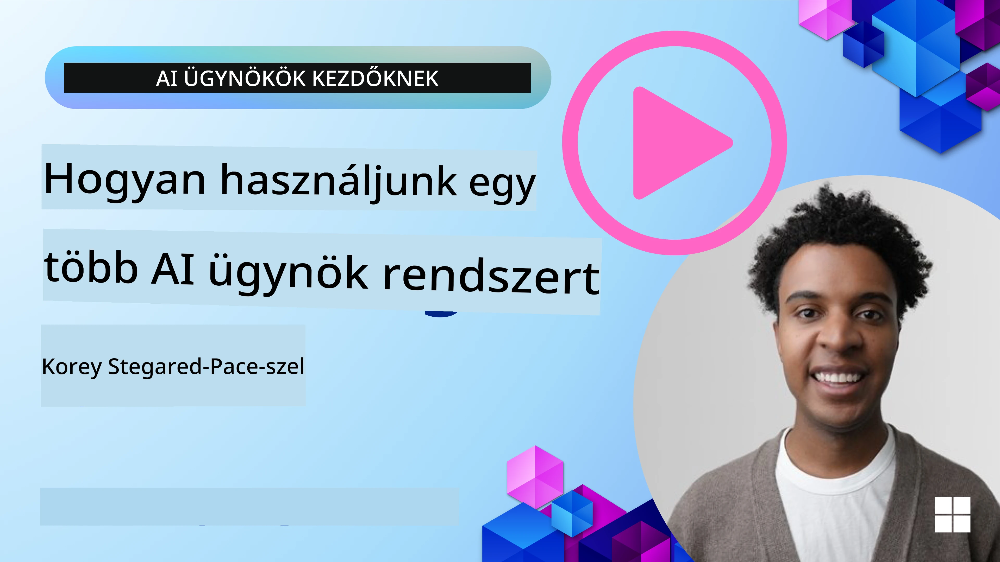
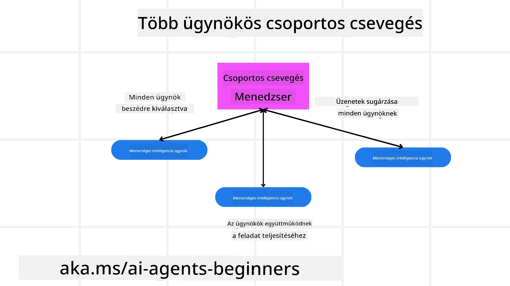
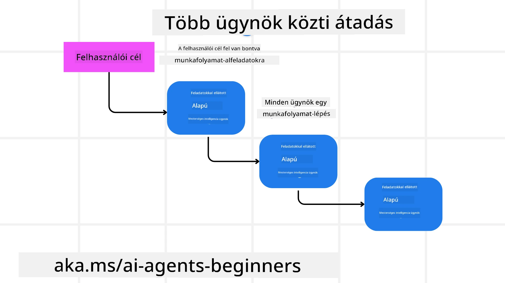
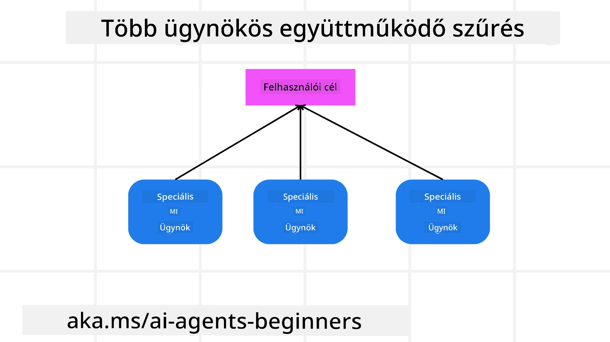

> _(Kattints a fenti képre a lecke videójának megtekintéséhez)_

# Többügynökös tervezési minták

Amint elkezdesz dolgozni egy több ügynököt érintő projekten, meg kell fontolnod a többügynökös tervezési mintát. Ugyanakkor nem mindig egyértelmű, mikor érdemes áttérni több ügynökre és mik az előnyei.

## Bevezetés

Ebben a leckében a következő kérdésekre keressük a választ:

- Milyen helyzetekben alkalmazhatók a többügynökös rendszerek?
- Mik az előnyei annak, ha több ügynököt használunk egyetlen, több feladatot ellátó ügynökkel szemben?
- Melyek a többügynökös tervezési minta megvalósításának építőkövei?
- Hogyan biztosíthatunk átláthatóságot arra vonatkozóan, hogyan lépnek kölcsönhatásba az ügynökök egymással?

## Tanulási célok

A lecke után képesnek kell lenned arra, hogy:

- Azonosítsd azokat a helyzeteket, ahol többügynökös megoldás alkalmazható
- Ismerd fel a többügynökös megoldás előnyeit az egyetlen ügynökhöz képest.
- Értsd meg a többügynökös tervezési minta megvalósításának építőköveit.

Mi a nagyobb kép?

*A többügynökös megoldás egy olyan tervezési minta, amely lehetővé teszi, hogy több ügynök együtt dolgozzon egy közös cél eléréséért.*

Ezt a mintát széles körben használják különféle területeken, többek között a robotikában, autonóm rendszerekben és az elosztott számítástechnikában.

## Forgatókönyvek, ahol a többügynökös rendszerek alkalmazhatók

Mely forgatókönyvek jó alkalmazási esetek a többügynökös rendszerekhez? A válasz az, hogy sok olyan helyzet van, ahol több ügynök alkalmazása előnyös, különösen az alábbi esetekben:

- **Nagy munkaterhelések**: A nagy munkaterhelések kisebb feladatokra bonthatók és különböző ügynökökhöz rendelhetők, lehetővé téve a párhuzamos feldolgozást és a gyorsabb befejezést. Erre példa egy nagy adatfeldolgozási feladat esete.
- **Összetett feladatok**: Az összetett feladatok, hasonlóan a nagy munkaterhelésekhez, kisebb alfeladatokra bonthatók és különböző ügynökökhöz rendelhetők, amelyek mindegyike a feladat egy meghatározott aspektusára specializálódik. Jó példa erre az autonóm járművek esete, ahol külön ügynökök kezelik a navigációt, az akadályfelismerést és a kommunikációt más járművekkel.
- **Sokféle szakértelem**: Különböző ügynökök eltérő szakértelemmel rendelkezhetnek, lehetővé téve, hogy hatékonyabban kezeljék a feladat különböző aspektusait, mint egyetlen ügynök. Erre jó példa az egészségügy, ahol az ügynökök kezelhetik a diagnosztikát, a kezelési terveket és a páciens megfigyelését.

## A többügynökös megoldás előnyei az egyetlen ügynökhöz képest

Egy egyetlen ügynökön alapuló rendszer jól működhet egyszerű feladatoknál, de összetettebb feladatok esetén a több ügynök használata több előnnyel járhat:

- **Szakosodás**: Minden ügynök specializálódhat egy adott feladatra. Az egyetlen ügynökben meglévő specializáció hiánya azt jelenti, hogy van egy ügynököd, amely mindent képes csinálni, de összezavarodhat, ha összetett feladattal szembesül. Előfordulhat például, hogy olyan feladatot végez el, amelyhez nem a legalkalmasabb.
- **Skálázhatóság**: A rendszerek skálázása könnyebb több ügynök hozzáadásával, mint egyetlen ügynök túlterhelésével.
- **Hibatűrés**: Ha egy ügynök meghibásodik, a többiek továbbra is működhetnek, ezáltal biztosítva a rendszer megbízhatóságát.

Vegyük például egy utazás lefoglalását egy felhasználó számára. Egy egyetlen ügynökön alapuló rendszernek az utazás lefoglalásának minden aspektusát kezelnie kellene, a járatok keresésétől a szállodák és bérautók foglalásáig. Egyetlen ügynök esetén az ügynöknek minden feladathoz eszközökkel kellene rendelkeznie, ami egy összetett és monolitikus rendszert eredményezhet, amely nehezen karbantartható és skálázható. Egy többügynökös rendszer ezzel szemben külön ügynököket tarthatna a járatok keresésére, a szállodák és a bérautók foglalására. Ez modulárisabbá, könnyebben karbantarthatóvá és skálázhatóvá tenné a rendszert.

Hasonlítsd össze ezt egy családi utazási irodával és egy franchise-alapú utazási irodával. A családi üzletben egyetlen ügynök kezelné az utazás lefoglalásának minden aspektusát, míg a franchise-ban külön ügynökök foglalkoznának az utazás különböző részeivel.

## A többügynökös tervezési minta megvalósításának építőkövei

Mielőtt megvalósíthatnád a többügynökös tervezési mintát, meg kell értened a minta alkotóelemeit.

Tegyük ezt konkrétabbá ismét az utazás lefoglalásának példáján keresztül. Ebben az esetben az építőkövek a következők lennének:

- **Ügynökök közötti kommunikáció**: A repülőjegyek kereséséért, szállodafoglalásért és autóbérlésért felelős ügynököknek kommunikálniuk és megosztaniuk kell információkat a felhasználó preferenciáiról és korlátairól. El kell döntened a kommunikáció protokolljait és módszereit. Konkrétan ez azt jelenti, hogy a repülőjegy-kereső ügynöknek kommunikálnia kell a szállodafoglaló ügynökkel, hogy a szállodát ugyanazokra a dátumokra foglalják le, mint a járatot. Ez azt jelenti, hogy az ügynököknek meg kell osztaniuk a felhasználó utazási dátumairól szóló információkat, tehát el kell döntened *mely ügynökök osztanak meg információt és hogyan osztják meg azt*.
- **Koordinációs mechanizmusok**: Az ügynököknek koordinálniuk kell tevékenységeiket annak érdekében, hogy a felhasználó preferenciái és korlátai teljesüljenek. Egy felhasználói preferencia lehet például, hogy a felhasználó a repülőtér közelében szeretne szállodát, míg egy korlát lehet, hogy a bérautók csak a repülőtéren érhetők el. Ez azt jelenti, hogy a szállodafoglaló ügynöknek koordinálnia kell a bérautó-foglaló ügynökkel, hogy biztosítsa a felhasználó preferenciáinak és korlátainak teljesülését. Ez azt jelenti, hogy el kell döntened *hogyan koordinálják az ügynökök a tevékenységeiket*.
- **Ügynökök architektúrája**: Az ügynököknek rendelkezniük kell a belső felépítéssel, hogy döntéseket hozzanak és tanuljanak a felhasználóval folytatott interakcióikból. Ez azt jelenti, hogy a repülőjegy-kereső ügynöknek belső struktúrával kell rendelkeznie annak eldöntéséhez, mely járatokat ajánlja a felhasználónak. Ez azt jelenti, hogy el kell döntened *hogyan hoznak döntéseket és tanulnak az ügynökök a felhasználóval folytatott interakcióikból*. Például a repülőjegy-kereső ügynök gépi tanulási modellt használhat a felhasználó korábbi preferenciái alapján történő ajánlásokhoz.
- **Átláthatóság a többügynökös interakciókban**: Látni kell, hogyan lépnek a több ügynök kölcsönhatásba egymással. Szükséged van eszközökre és technikákra az ügynökök tevékenységeinek és kölcsönhatásainak nyomon követéséhez. Ez lehet naplózás és megfigyelés, vizualizációs eszközök és teljesítménymutatók formájában.
- **Többügynökös minták**: Több különböző mintát lehet alkalmazni a többügynökös rendszerek megvalósítására, mint például központosított, decentralizált és hibrid architektúrák. El kell döntened, melyik minta illeszkedik legjobban az esetedhez.
- **Ember a folyamatban**: A legtöbb esetben lesz ember is a folyamatban, és meg kell határoznod, mikor kérjenek az ügynökök emberi beavatkozást. Ez megjelenhet például úgy, hogy a felhasználó egy konkrét szállodát vagy járatot kér, amelyet az ügynökök nem ajánlottak, vagy megerősítést kér a járat vagy szálloda lefoglalása előtt.

## Átláthatóság a többügynökös interakciókban

Fontos, hogy láthatóságod legyen arra vonatkozóan, hogyan lépnek kölcsönhatásba egymással a különböző ügynökök. Ez az átláthatóság elengedhetetlen a hibakereséshez, optimalizáláshoz és a rendszer általános hatékonyságának biztosításához. Ennek eléréséhez szükséged van eszközökre és technikákra az ügynökök tevékenységeinek és kölcsönhatásainak nyomon követésére. Ez megvalósulhat naplózási és megfigyelő eszközök, vizualizációs eszközök és teljesítménymutatók formájában.

Például az utazás lefoglalása esetén lehet egy irányítópultod, amely megmutatja minden ügynök státuszát, a felhasználó preferenciáit és korlátait, valamint az ügynökök közötti interakciókat. Ez az irányítópult megjelenítheti a felhasználó utazási dátumait, a járatügynök által javasolt járatokat, a szállodai ügynök által javasolt szállodákat és a bérautó-ügynök által javasolt járműveket. Ez tiszta képet adna arról, hogyan lépnek az ügynökök kölcsönhatásba egymással, és teljesülnek-e a felhasználó preferenciái és korlátai.

Nézzük meg ezeket a szempontokat részletesebben.

- **Naplózás és megfigyelő eszközök**: Szeretnéd, ha minden ügynök által végrehajtott művelet naplózva lenne. Egy naplóbejegyzés tárolhat információkat az ügynökről, amely végrehajtotta a műveletet, a végrehajtott műveletről, a művelet idejéről és a művelet kimeneteléről. Ezek az információk felhasználhatók hibakeresésre, optimalizálásra és egyéb célokra.
- **Vizualizációs eszközök**: A vizualizációs eszközök segíthetnek az ügynökök közötti kölcsönhatások intuitívabb megjelenítésében. Például lehet egy gráf, amely megmutatja az információ áramlását az ügynökök között. Ez segíthet azonosítani a szűk keresztmetszeteket, hatékonysági problémákat és más rendszerszintű problémákat.
- **Teljesítménymutatók**: A teljesítménymutatók segíthetnek nyomon követni a többügynökös rendszer hatékonyságát. Például mérheted egy feladat elvégzéséhez szükséges időt, az egységnyi idő alatt elvégzett feladatok számát és az ügynökök által adott ajánlások pontosságát. Ezek az információk segíthetnek azonosítani a fejlesztendő területeket és optimalizálni a rendszert.

## Többügynökös minták

Nézzünk néhány konkrét mintát, amelyeket használhatunk többügynökös alkalmazások létrehozásához. Íme néhány érdekes minta, amelyet érdemes megfontolni:

### Csoportos csevegés

Ez a minta hasznos, amikor olyan csoportos csevegőalkalmazást szeretnél létrehozni, ahol több ügynök kommunikálhat egymással. Tipikus felhasználási esetek közé tartozik a csapatmunka, ügyfélszolgálat és a közösségi hálózatok.

Ebben a mintában minden ügynök egy felhasználót képvisel a csoportos csevegésben, és az üzeneteket egy üzenetküldési protokoll segítségével cserélik. Az ügynökök üzeneteket küldhetnek a csoportnak, fogadhatnak üzeneteket a csoporttól, és válaszolhatnak más ügynökök üzeneteire.

Ezt a mintát meg lehet valósítani központosított architektúrával, ahol az összes üzenet egy központi szerveren keresztül zajlik, vagy decentralizált architektúrával, ahol az üzenetek közvetlenül cserélődnek.

### Feladatátadás

Ez a minta hasznos, amikor olyan alkalmazást szeretnél létrehozni, ahol több ügynök adhat át feladatokat egymásnak.

Tipikus felhasználási esetek közé tartozik az ügyfélszolgálat, feladatkezelés és munkafolyamat-automatizálás.

Ebben a mintában minden ügynök egy feladatot vagy egy lépést képvisel egy munkafolyamatban, és az ügynökök előre meghatározott szabályok alapján adhatnak át feladatokat más ügynököknek.

### Kollaboratív szűrés

Ez a minta hasznos, amikor olyan alkalmazást szeretnél létrehozni, ahol több ügynök együttműködve ad ajánlásokat a felhasználóknak.

Azért lehet hasznos, ha több ügynök működik együtt, mert minden ügynök különböző szakértelemmel rendelkezhet, és más módon járulhat hozzá az ajánlási folyamathoz.

Vegyünk például egy olyan esetet, amikor egy felhasználó ajánlást akar kapni arra vonatkozóan, melyik részvényt érdemes megvenni a tőzsdén.

- **Iparági szakértő**:. Egy ügynök lehet egy adott iparág szakértője.
- **Technikai elemzés**: Egy másik ügynök lehet szakértő a technikai elemzésben.
- **Fundamentális elemzés**: És egy harmadik ügynök lehet szakértő a fundamentális elemzésben. Az együttműködés révén ezek az ügynökök átfogóbb ajánlást tudnak adni a felhasználónak.

## Forgatókönyv: Visszatérítési folyamat

Vegyünk egy olyan forgatókönyvet, ahol egy ügyfél visszatérítést próbál kérni egy termékért; ebben a folyamatban elég sok ügynök érintett lehet, de osszuk fel őket a visszatérítési folyamathoz specifikus ügynökökre és az általános, más folyamatokban is használható ügynökökre.

**A visszatérítési folyamathoz specifikus ügynökök**:

Az alábbiakban néhány ügynök szerepel, amelyek részt vehetnek a visszatérítési folyamatban:

- **Ügyfél ügynök**: Ez az ügynök az ügyfelet képviseli, és felelős a visszatérítési folyamat elindításáért.
- **Eladó ügynök**: Ez az ügynök az eladót képviseli, és felelős a visszatérítés feldolgozásáért.
- **Fizetési ügynök**: Ez az ügynök a fizetési folyamatot képviseli, és felelős az ügyfél számára történő visszatérítés végrehajtásáért.
- **Mediációs ügynök**: Ez az ügynök a feloldási folyamatot képviseli, és felelős minden, a visszatérítési folyamat során felmerülő probléma megoldásáért.
- **Megfelelőségi ügynök**: Ez az ügynök a megfelelőségi folyamatot képviseli, és felelős azért, hogy a visszatérítési folyamat megfeleljen a szabályozásoknak és irányelveknek.

**Általános ügynökök**:

Ezeket az ügynököket az üzleti tevékenységed más részein is használhatod.

- **Szállítási ügynök**: Ez az ügynök a szállítási folyamatot képviseli, és felelős a termék eladóhoz történő visszaszállításáért. Ezt az ügynököt használhatod mind a visszatérítési folyamatnál, mind egy vásárlás miatti általános szállításnál.
- **Visszajelzés-gyűjtő ügynök**: Ez az ügynök a visszajelzési folyamatot képviseli, és felelős az ügyféltől érkező visszajelzések gyűjtéséért. A visszajelzést bármikor be lehet gyűjteni, nem csak a visszatérítési folyamat során.
- **Eskalációs ügynök**: Ez az ügynök az eszkalációs folyamatot képviseli, és felelős a problémák magasabb szintű támogatásra történő átirányításáért. Az ilyen típusú ügynököt bármely olyan folyamatnál használhatod, ahol szükséges egy probléma eszkalálása.
- **Értesítési ügynök**: Ez az ügynök az értesítési folyamatot képviseli, és felelős az ügyfél értesítéséért a visszatérítési folyamat különböző szakaszaiban.
- **Elemző ügynök**: Ez az ügynök az elemzési folyamatot képviseli, és felelős a visszatérítési folyamattal kapcsolatos adatok elemzéséért.
- **Ellenőrzési ügynök**: Ez az ügynök az ellenőrzési folyamatot képviseli, és felelős a visszatérítési folyamat ellenőrzéséért, hogy biztosítsa a helyes végrehajtást.
- **Jelentéskészítő ügynök**: Ez az ügynök a jelentéskészítést képviseli, és felelős a visszatérítési folyamatról készült jelentések generálásáért.
- **Tudásbázis-ügynök**: Ez az ügynök a tudásmenedzsmentet képviseli, és felelős a visszatérítési folyamathoz kapcsolódó információk tudásbázisának fenntartásáért. Ez az ügynök ismeretekkel rendelkezhet mind a visszatérítések, mind az üzlet más területei kapcsán.
- **Biztonsági ügynök**: Ez az ügynök a biztonsági folyamatot képviseli, és felelős a visszatérítési folyamat biztonságának biztosításáért.
- **Minőségügyi ügynök**: Ez az ügynök a minőségbiztosítást képviseli, és felelős a visszatérítési folyamat minőségének garantálásáért.

Elég sok ügynök szerepelt az előző felsorolásban, mind a visszatérítési folyamathoz specifikusak, mind az üzleted más részein is használható általános ügynökök. Remélhetőleg ez ötletet ad arra, hogyan dönthetsz arról, mely ügynököket érdemes alkalmazni a többügynökös rendszeredben.

## Feladat

Tervezd meg egy többügynökös rendszert egy ügyfélszolgálati folyamathoz. Azonosítsd a folyamatban részt vevő ügynököket, azok szerepét és felelősségét, valamint azt, hogyan lépnek kölcsönhatásba egymással. Vedd figyelembe mind az ügyfélszolgálati folyamathoz specifikus, mind az üzleted más részein is felhasználható általános ügynököket.
> Gondolkodj el róla, mielőtt elolvasod a következő megoldást, lehet, hogy több ügynökre lesz szükséged, mint gondolnád.
> 
> TIPP: Gondolj a vevőszolgálati folyamat különböző szakaszaira, és vedd figyelembe a rendszerhez szükséges ügynököket is.

## Megoldás

[Solution](./solution/solution.md)

## Tudásellenőrzések

Kérdés: Mikor érdemes többügynökös megoldást használni?

- [ ] A1: Ha kis munkaterhelésed és egyszerű feladatod van.
- [ ] A2: Ha nagy munkaterhelésed van
- [ ] A3: Ha egyszerű feladatod van.

[Solution quiz](./solution/solution-quiz.md)

## Összegzés

Ebben a leckében áttekintettük a többügynökös tervezési mintát, beleértve azokat a helyzeteket, ahol a többügynökös megoldások alkalmazhatók, a többügynökös megközelítés előnyeit az egyetlen ügynökhöz képest, a többügynökös tervezési minta megvalósításának építőköveit, valamint azt, hogyan lehet átláthatóságot teremteni abban, hogyan lépnek kölcsönhatásba egymással a különböző ügynökök.

### Van még kérdésed a többügynökös tervezési mintáról?

Csatlakozz a [Microsoft Foundry Discord](https://aka.ms/ai-agents/discord) közösséghez, hogy találkozz más tanulókkal, vegyél részt konzultációs órákon és megválaszoltathasd az AI Agents-szel kapcsolatos kérdéseidet.

## További források

- <a href="https://learn.microsoft.com/azure/ai-services/agents/overview" target="_blank">Microsoft Agent Framework dokumentáció</a>
- <a href="https://www.analyticsvidhya.com/blog/2024/10/agentic-design-patterns/" target="_blank">Agentikus tervezési minták</a>

## Előző lecke

[Planning Design](../07-planning-design/README.md)

## Következő lecke

[Metacognition in AI Agents](../09-metacognition/README.md)

---

<!-- CO-OP TRANSLATOR DISCLAIMER START -->
Felelősségkizárás:
Ezt a dokumentumot egy mesterséges intelligencia alapú fordítószolgáltatás, a Co-op Translator (https://github.com/Azure/co-op-translator) segítségével fordítottuk. Bár törekszünk a pontosságra, kérjük, vegye figyelembe, hogy az automatikus fordítások hibákat vagy pontatlanságokat tartalmazhatnak. A dokumentum eredeti, anyanyelvi változatát kell tekinteni a mérvadó forrásnak. Fontos információk esetén professzionális, emberi fordítást javaslunk. Nem vállalunk felelősséget az e fordítás használatából eredő félreértésekért vagy félreértelmezésekért.
<!-- CO-OP TRANSLATOR DISCLAIMER END -->