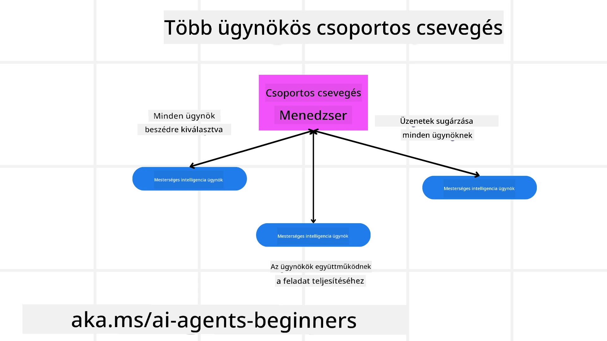
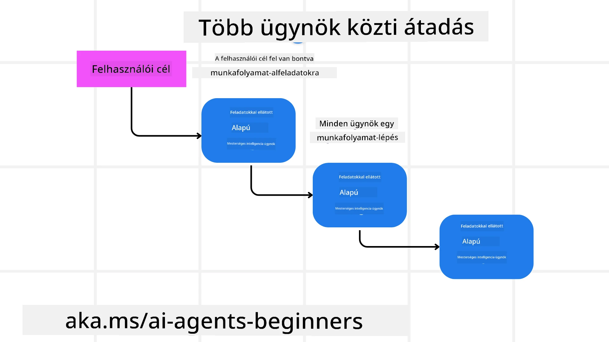
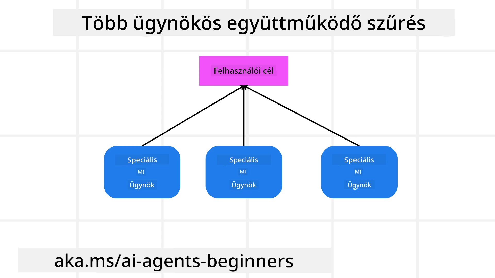

> _(Kattints a fenti képre, hogy megnézd a lecke videóját)_

# Többügynökös tervezési minták

Amint elkezdesz dolgozni egy olyan projekten, amely több ügynököt foglal magában, fontolóra kell venned a többügynökös tervezési mintát. Azonban nem biztos, hogy azonnal világos, mikor érdemes áttérni több ügynökre, és mik az előnyei.

## Bevezetés

Ebben a leckében a következő kérdésekre keressük a választ:

- Milyen helyzetekben alkalmazhatóak a többügynökös megoldások?
- Milyen előnyökkel jár a többügynök használata egyetlen, többet végző ügynökhöz képest?
- Mik a többügynökös tervezési minta megvalósításának építőelemei?
- Hogyan láthatjuk, hogy az ügynökök hogyan lépnek egymással kölcsönhatásba?

## Tanulási célok

A lecke végére képes leszel:

- Azonosítani azokat a helyzeteket, amelyekben alkalmazható a többügynökös megközelítés
- Felismerni a többügynökös rendszer előnyeit az egyetlen ügynökhöz képest.
- Megérteni a többügynökös tervezési minta megvalósításának építőelemeit.

Mi a nagyobb kép?

*A többügynökös rendszer olyan tervezési minta, amely lehetővé teszi, hogy több ügynök együtt dolgozzon egy közös cél eléréséért*.

Ezt a mintát széles körben használják különféle területeken, például robotikában, autonóm rendszerekben és elosztott számítástechnikában.

## Alkalmazási helyzetek, ahol többügynökös megközelítésre van szükség

Milyen helyzetekben érdemes több ügynököt alkalmazni? A válasz az, hogy sok helyzetben hasznos több ügynököt alkalmazni, különösen az alábbi esetekben:

- **Nagy munkaterhelés**: Nagy munkaterhelések kisebb feladatokra bonthatók, amelyeket különböző ügynökökre lehet osztani, lehetővé téve a párhuzamos feldolgozást és gyorsabb teljesítést. Például egy nagy adatfeldolgozási feladat esetén.
- **Összetett feladatok**: Az összetett feladatokat, hasonlóan a nagy munkaterhelésekhez, kisebb résztfeladatokra lehet bontani, amelyeket külön ügynökök látnak el, mindegyik egy adott feladatrészre szakosodva. Jó példa erre az autonóm járművek esete, ahol külön ügynökök kezelik a navigációt, akadályfelismerést és a járművek közötti kommunikációt.
- **Sokszínű szakértelem**: Különböző ügynökök különböző szakértelmekkel rendelkezhetnek, így hatékonyabban kezelhetik a feladat különböző aspektusait, mint egyetlen ügynök. Ilyen például az egészségügy, ahol egyes ügynökök diagnosztikával, kezelési tervek kidolgozásával és betegmegfigyeléssel foglalkoznak.

## A többügynökös megoldás előnyei egyetlen ügynökhöz képest

Egyetlen ügynök rendszer egyszerű feladatok esetén jól működhet, de összetettebb feladatoknál a többügynökös megoldás több előnnyel jár:

- **Specializáció**: Minden ügynök egy adott feladatra szakosodhat. Egyetlen ügynök esetén nincs specializáció, így az ügynök bármit megpróbálhat elvégezni, de összetett helyzetben könnyen összezavarodhat, és előfordulhat, hogy olyan feladatot végez el, amelyhez nem a legalkalmasabb.
- **Skálázhatóság**: Könnyebb a rendszert bővíteni több ügynök hozzáadásával, mint egyetlen ügynök túlterhelésével.
- **Hibatűrés**: Ha egy ügynök meghibásodik, a többi tovább működhet, biztosítva a rendszer megbízhatóságát.

Vegyünk egy példát: foglaljunk egy utazást egy felhasználónak. Egyetlen ügynöknek kellene kezelnie az utazás minden aspektusát, a repülőjáratok keresésétől a szállás- és autóbérlés foglalásáig. Ehhez az ügynöknek eszközök egész arzenáljára lenne szüksége, ami egy bonyolult és nehezen karbantartható rendszert eredményezne. Ezzel szemben egy többügynökös rendszer különböző ügynököket tartalmazhatna a járatok keresésére, a szállásfoglalásra és az autóbérlésre, így a rendszer modulárisabb, könnyebben karbantartható és skálázható lenne.

Ezt hasonlítsuk össze egy kis utazási iroda működésével, amely egyetlen ügynökkel dolgozik, és egy franchise rendszerrel, amely különböző ügynököket alkalmaz az utazás egyes részeinek kezelésére.

## A többügynökös tervezési minta megvalósításának építőelemei

Mielőtt megvalósítanád a többügynökös tervezési mintát, értened kell azok építőelemeit.

Tegyük ezt konkrétabbá a példa alapján: az utazás foglalásánál. Ebben az esetben az építőelemek a következők lennének:

- **Ügynökök közötti kommunikáció**: A repülőjáratokat, szállásokat és autókat foglaló ügynököknek kommunikálniuk kell, és meg kell osztaniuk az utazó preferenciáit és korlátait. El kell dönteni a protokollokat és módszereket erre a kommunikációra. Konkrétan például a repülőjáratokat kereső ügynöknek kommunikálnia kell a szállásfoglalót kezelővel, hogy a szállás a járatokkal azonos időszakra legyen lefoglalva. Tehát az ügynökök megosztják az utazás időpontjaira vonatkozó információkat, vagyis döntened kell *arról, hogy mely ügynökök osztanak meg információt, és hogyan*.
- **Koordinációs mechanizmusok**: Az ügynököknek koordinálniuk kell a tevékenységeiket, hogy az utazó preferenciái és korlátai teljesüljenek. Például az utazó szeretne a repülőtér közelében szállást, míg az autóbérlés csak a repülőtéren érhető el. Ezért a szállásfoglaló ügynöknek össze kell hangolnia a munkáját az autóbérlőével, hogy ezek teljesüljenek. Tehát döntened kell *arról, hogyan koordinálják az ügynökök a tevékenységeiket*.
- **Ügynök architektúra**: Az ügynököknek belső struktúrával kell rendelkezniük a döntéshozatalhoz és a felhasználóval való interakciók tanulásához. Például a repülőjáratokat kereső ügynöknek meg kell hoznia döntéseket arról, hogy mely járatokat ajánlja, és tanulnia kell a korábbi preferenciákból. Tehát döntened kell *arról, hogyan döntenek az ügynökök, és hogyan tanulnak a felhasználóval folytatott interakciókból*. Például a repülőjáratokat kereső ügynök gépi tanulási modellt használhat ajánlásokhoz.
- **Átláthatóság a többügynökös interakciókban**: Látnod kell, hogy a különböző ügynökök hogyan lépnek egymással kapcsolatba. Ehhez eszközökre és technikákra van szükség az ügynöki tevékenységek és kölcsönhatások nyomon követésére, például naplózásra, monitorozásra, vizualizációra és teljesítménymutatókra.
- **Többügynökös minták**: Különböző minták léteznek többügynökös rendszerekhez, mint a központosított, decentralizált vagy hibrid architektúrák. El kell döntened, melyik illik legjobban az esetedhez.
- **Ember a rendszerben**: Többnyire lesz emberi beavatkozás, és meg kell határozni, mikor kérjenek az ügynökök emberi közbeavatkozást, például egy adott szállás vagy repülőjárat kérésekor, amit az ügynökök nem ajánlottak, vagy foglalás jóváhagyásakor.

## Átláthatóság a többügynökös interakciókban

Fontos, hogy átlátható legyen, hogyan lépnek egymással kapcsolatba az ügynökök. Ez elengedhetetlen a hibakereséshez, optimalizáláshoz és a rendszer hatékonyságának biztosításához. Ehhez eszközökre és technikákra van szükség az ügynöki tevékenységek és interakciók nyomon követésére, például naplózásra, monitorozásra, vizualizációra és teljesítménymutatókra.

Például egy utazás foglalása esetén lehet egy műszerfal, amely mutatja az egyes ügynökök állapotát, a felhasználó preferenciáit és korlátait, valamint az ügynökök közötti kölcsönhatásokat. Ez a műszerfal megjelenítheti az utazás dátumait, a járatok ajánlatait, a szállások és autók ajánlatait, így világos képet ad arról, hogyan működnek együtt az ügynökök, és teljesülnek-e a felhasználó igényei.

Nézzük meg ezeknek az aspektusoknak a részleteit.

- **Naplózási és monitorozási eszközök**: Minden ügynök tevékenységét naplózni kell. Egy bejegyzés tartalmazhatja az ügynök nevét, a végrehajtott műveletet, az időpontot és az eredményt. Ezek az információk segíthetik a hibakeresést és az optimalizálást.

- **Vizualizációs eszközök**: Ezek segítenek az ügynökök közötti kölcsönhatások átláthatóbbá tételében. Például egy grafikon, amely bemutatja az információáramlást az ügynökök között, segíthet azonosítani torlódásokat, hatékonysági problémákat.

- **Teljesítménymutatók**: Ezekkel mérhető lesz a többügynökös rendszer hatékonysága. Például a feladat végrehajtásának ideje, egységidő alatt elvégzett feladatok száma, illetve az ajánlások pontossága. Ezek segíthetnek a rendszer fejlesztésében.

## Többügynökös minták

Nézzünk néhány konkrét mintát a többügynökös alkalmazások létrehozásához. Íme néhány figyelemre méltó minta:

### Csoportos csevegés

Ez a minta akkor hasznos, ha egy csoportos csevegőalkalmazást szeretnél létrehozni, ahol több ügynök kommunikálhat egymással. Tipikus felhasználási esetek a csapatmunka, ügyféltámogatás és közösségi hálózatok.

Ebben a mintában minden ügynök egy felhasználót képvisel a csoportos csevegésben, és az üzeneteket üzenetküldési protokoll segítségével cserélik. Az ügynökök küldhetnek és fogadhatnak üzeneteket, valamint válaszolhatnak más ügynökök üzeneteire.

Ez a minta megvalósítható központosított architektúrában, ahol minden üzenet egy központi szerveren keresztül halad, vagy decentralizált módon, ahol az üzenetek közvetlenül cserélődnek.

### Feladat átadás

Ez a minta akkor hasznos, ha több ügynök egymásnak adhatja át a feladatokat.

Tipikus felhasználási esetek közé tartozik az ügyféltámogatás, feladatkezelés és munkafolyamat automatizálás.

Ebben a mintában minden ügynök egy feladatot vagy munkafolyamat lépést képvisel, és az ügynökök előre meghatározott szabályok alapján továbbadják egymásnak a feladatokat.

### Együttműködéses szűrés

Ez a minta akkor hasznos, ha több ügynök együtt dolgozva ajánlásokat készít a felhasználóknak.

Több ügynök együttműködése azért előnyös, mert mindegyik ügynök más-más szakértelemmel rendelkezik, és különböző módon járulhat hozzá az ajánlási folyamathoz.

Vegyünk egy példát, amikor egy felhasználó a legjobb részvényt szeretné ajánlani a tőzsdén.

- **Iparági szakértő**: Egy ügynök egy adott iparág szakértője lehet.
- **Technikai elemzés**: Egy másik ügynök a technikai elemzések szakértője lehet.
- **Fundamentális elemzés**: Egy harmadik ügynök a fundamentális elemzések szakértője lehet. Együttműködésük átfogóbb ajánlást nyújt a felhasználónak.

## Forgatókönyv: Visszatérítési folyamat

Vegyünk egy olyan helyzetet, amikor egy ügyfél visszatérítést szeretne kérni egy termékre. Ebben a folyamatban több ügynök is részt vehet, de osszuk fel őket a visszatérítési folyamathoz specifikus és az általánosan használható ügynökökre.

**Visszatérítési folyamathoz kapcsolódó ügynökök**:

Ezek az ügynökök részt vehetnek a visszatérítési folyamatban:

- **Ügyféligény kezelő ügynök**: Ez az ügynök képviseli az ügyfelet, és felelős a visszatérítési folyamat elindításáért.
- **Eladó ügynök**: Ez az ügynök képviseli az eladót, és a visszatérítés feldolgozásáért felel.
- **Fizetési ügynök**: Ez az ügynök a fizetési folyamatért felel, és az ügyfél visszatérítését végzi el.
- **Megoldás ügynök**: Ez az ügynök a problémák megoldásáért felel a visszatérítési folyamat során.
- **Megfelelőségi ügynök**: Ez az ügynök felelős azért, hogy a visszatérítési folyamat megfeleljen a szabályozásoknak és előírásoknak.

**Általános ügynökök**:

Ezek az ügynökök más üzleti területeken is használhatók.

- **Szállítási ügynök**: Ez az ügynök a termék visszaszállításáért felel. Használható a visszatérítési folyamatban és általános termékszállítás esetén is.
- **Visszajelzés kezelő ügynök**: Ez az ügynök a vevői visszajelzések gyűjtéséért felel, amely nem csak a visszatérítéshez kötött.
- **Eszkalációs ügynök**: Ez az ügynök a problémák magasabb szintű támogatás felé történő továbbításáért felel, bármely folyamatban, ahol szükséges.
- **Értesítési ügynök**: Ez az ügynök az ügyfelek értesítését végzi a visszatérítési folyamat különböző állomásain.
- **Analitikai ügynök**: Ez az ügynök a visszatérítési adatok elemzéséért felel.
- **Auditáló ügynök**: Ez az ügynök ellenőrzi, hogy a visszatérítési folyamat megfelelően működik-e.
- **Jelentéskészítő ügynök**: Ez az ügynök a visszatérítési folyamat jelentéseit készíti el.
- **Tudásbázis ügynök**: Ez az ügynök a visszatérítési folyamathoz és üzleted más területeihez kapcsolódó tudásbázist tart fenn.
- **Biztonsági ügynök**: Ez az ügynök a visszatérítési folyamat biztonságáért felel.
- **Minőségbiztosítási ügynök**: Ez az ügynök a visszatérítési folyamat minőségéért felel.

Számos ügynököt soroltunk fel, mind a visszatérítési folyamathoz, mind az általános üzleti területeken használhatóakat. Remélhetőleg ez segít abban, hogyan választhatod ki az ügynököket a többügynökös rendszeredhez.

## Feladat

Tervezd meg egy többügynökös rendszert egy ügyféltámogatási folyamathoz. Azonosítsd a folyamatban részt vevő ügynököket, szerepeiket és felelősségeiket, valamint az egymással való interakcióikat. Vedd figyelembe a folyamat specifikus és az általános üzleti területeken használható ügynököket is.

> Gondolkozz el rajta, mielőtt elolvasod a következő megoldást, lehet, hogy több ügynökre lesz szükséged, mint gondolnád.

> TIPP: Gondold át az ügyfélszolgálati folyamat különböző szakaszait, valamint vedd figyelembe a rendszerhez szükséges ügynököket is.

## Megoldás

[Megoldás](./solution/solution.md)

## Tudásellenőrzések

### 1. kérdés

Melyik forgatókönyv illik leginkább egy többügynökös rendszerhez?

- [ ] A1: Egy támogatási bot válaszol a gyakori kérdésekre egyetlen tudásalap és egy kis eszközkészlet használatával.
- [ ] A2: Egy visszatérítési munkafolyamat külön csalás, fizetés és megfelelőség szerepköröket igényel, mindegyik saját eszközökkel, és az eredményeket koordinálni kell.
- [ ] A3: Ugyanaz az egyszerű osztályozási kérés óránként több ezer alkalommal érkezik.

### 2. kérdés

Mikor jobb általában egyetlen ügynököt választani?

- [ ] A1: A feladat elvégezhető egyetlen utasítás- és eszközkészlet használatával, specialisták közötti átadás nélkül.
- [ ] A2: Az ügynök több eszközhöz is hozzáfér.
- [ ] A3: A munkafolyamat különböző jogosultságokkal rendelkező, független audit nyomvonalú külön szerepköröket igényel.

[Megoldás kvíz](./solution/solution-quiz.md)

## Összefoglaló

Ebben a leckében megvizsgáltuk a többügynökös tervezési mintát, beleértve azokat a forgatókönyveket, ahol több ügynök alkalmazása indokolt, a többügynökös használat előnyeit az egyedi ügynökkel szemben, a megvalósítás építőköveit, valamint azt, hogyan lehet átlátni, hogyan lépnek kölcsönhatásba egymással a különböző ügynökök.

### További kérdéseid vannak a többügynökös tervezési mintáról?

Csatlakozz a [Microsoft Foundry Discord](https://discord.com/invite/ATgtXmAS5D) közösséghez, hogy találkozz más tanulókkal, részt vegyél konzultációs órákon, és választ kapj AI Ügynökökkel kapcsolatos kérdéseidre.

## További források

- <a href="https://learn.microsoft.com/azure/ai-services/agents/overview" target="_blank">Microsoft Agent Framework dokumentáció</a>
- <a href="https://www.analyticsvidhya.com/blog/2024/10/agentic-design-patterns/" target="_blank">Agentikus tervezési minták</a>

## Előző lecke

[Tervezési terv](../07-planning-design/README.md)

## Következő lecke

[Metakogníció AI ügynökökben](../09-metacognition/README.md)

---

<!-- CO-OP TRANSLATOR DISCLAIMER START -->
**Jogi nyilatkozat**:
Ez a dokumentum az AI fordítási szolgáltatás, a [Co-op Translator](https://github.com/Azure/co-op-translator) segítségével készült. Bár az pontosságra törekszünk, kérjük, vegye figyelembe, hogy az automatikus fordítások hibákat vagy pontatlanságokat tartalmazhatnak. Az eredeti dokumentum az anyanyelvén tekintendő hiteles forrásnak. Fontos információk esetén professzionális emberi fordítást javasolunk. Nem vállalunk felelősséget semmilyen félreértésért vagy téves értelmezésért, amely ebből a fordításból ered.
<!-- CO-OP TRANSLATOR DISCLAIMER END -->