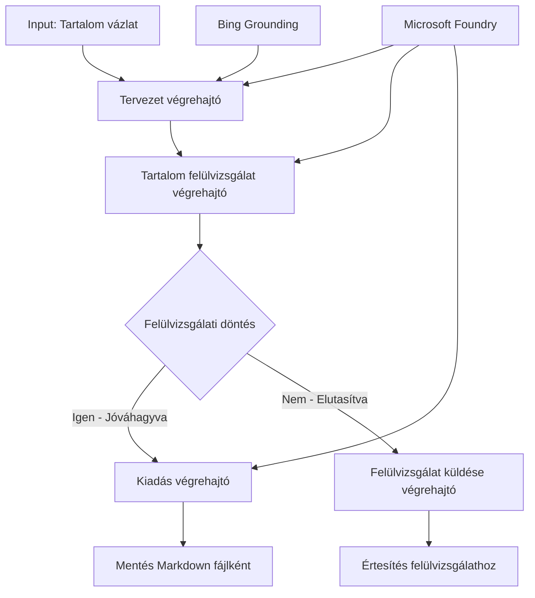

# 🔀 Feltételes Ügynök Munkafolyamatok Microsoft Foundry-val (.NET)

## 📋 Intelligens Döntésvezérelt Munkafolyamat Oktatóanyag

Ez a jegyzetfüzet bemutatja a **feltételes munkafolyamat mintákat** a Microsoft Foundry és a Microsoft Agent Framework .NET-hez használatával. Megtanulod, hogyan építs kifinomult, döntésvezérelt munkafolyamatokat, amelyek intelligensen irányítják a feldolgozást AI elemzés, üzleti szabályok és dinamikus feltételek alapján, vállalati szintű automatizáláshoz.

## 🎯 Tanulási célok

### 🧠 **Intelligens Döntési Architektúra**
- **Feltételes Logika Megvalósítása**: Komplex döntési fákat építs sokágú elágazásokkal
- **AI Által Támogatott Útválasztás**: Használd a Microsoft Foundry modelleket intelligens útvonal döntésekhez
- **Dinamikus Munkafolyamat Alkalmazkodás**: Módosíts a munkafolyamat viselkedésén futásidejű elemzés és feltételek alapján
- **Vállalati Szabály Integráció**: Üzleti logika és megfelelőségi követelmények beépítése a munkafolyamatokba

### 🔀 **Fejlett Feltételes Minták**
- **Többkritériumos Döntéshozatal**: Több tényező értékelése az útvonal döntésekhez
- **Kontextusérzékeny Feldolgozás**: Döntések az összegyűjtött munkafolyamat kontextus és előzmények alapján
- **Alkalmazkodó Munkafolyamat Módosítás**: Feldolgozási utak dinamikus igazítása valós idejű feltételek alapján
- **Szabálymotor Integráció**: Kifinomult üzleti szabálymotorok implementálása munkafolyamatokban

### 🏢 **Vállalati Feltételes Alkalmazások**
- **Dokumentum Osztályozás & Útválasztás**: Automatikus osztályozás és irányítás megfelelő munkafolyamatokba
- **Ügyfélszolgálati Triage**: Intelligens ügyfélkérdés útvonalválasztás speciális csapatokhoz
- **Megfelelőség & Kockázat Feldolgozás**: Különböző ellenőrzési és áttekintési folyamatok alkalmazása kockázatértékelés alapján
- **Minőségbiztosítási Munkafolyamatok**: Tartalom irányítása megfelelő ellenőrzési folyamatokon minőségi mutatók alapján

## ⚙️ Előfeltételek & Beállítás

### 📦 **Szükséges NuGet Csomagok**

Fejlett csomagok feltételes munkafolyamat feldolgozáshoz:

```xml
<!-- Core AI Framework -->
<PackageReference Include="Microsoft.Extensions.AI" Version="9.9.0" />

<!-- Azure AI Agents with Persistent State -->
<PackageReference Include="Azure.AI.Agents.Persistent" Version="1.2.0-beta.5" />

<!-- Azure Identity and Utilities -->
<PackageReference Include="Azure.Identity" Version="1.15.0" />
<PackageReference Include="System.Linq.Async" Version="6.0.3" />
<PackageReference Include="DotNetEnv" Version="3.1.1" />

<!-- Local Workflow Framework References -->
<!-- Microsoft.Agents.Workflows.dll - Advanced workflow orchestration -->
<!-- Microsoft.Agents.AI.AzureAI.dll - Microsoft Foundry integration -->
<!-- Microsoft.Agents.AI.dll - Core agent abstractions -->
```

### 🔑 **Microsoft Foundry Konfiguráció**

**Szükséges Azure Erőforrások:**
- Microsoft Foundry munkaterület feltételes feldolgozó modellekkel
- Azure előfizetés megfelelő számítási kvótákkal és jogosultságokkal
- Telepített AI modellek döntéshozatalhoz és tartalomelemzéshez
- (Opcionális) Bing Search API kapcsolat a támasztási képességekhez

**Környezet Konfiguráció (.env fájl):**
```env
# Microsoft Foundry Configuration
AZURE_AI_PROJECT_ENDPOINT=https://your-project.cognitiveservices.azure.com/
BING_CONNECTION_ID=your-bing-connection-id
```

**Hitelesítés Beállítása:**
```csharp
// Azure CLI or Managed Identity authentication
using Azure.Identity;
var credential = new AzureCliCredential();

// Load environment configuration
DotNetEnv.Env.Load("../../../.env");
```

### 🏗️ **Feltételes Munkafolyamat Architektúra**



**Főbb Összetevők:**
- **Vázlat Végrehajtó**: AI ügynök, amely vázlatokat készít a vázlatok alapján
- **Tartalom Ellenőrző Végrehajtó**: AI ügynök, amely értékeli a vázlat minőségét és megfelelőségét
- **Feltételes Útválasztás**: Döntési logika, amely az ellenőrzési eredmények alapján irányít
- **Közlés/Ellenőrzés Útvonalak**: Külön feldolgozási utak jóváhagyott és elutasított tartalom számára
- **Állapotkezelés**: A tartalom és ellenőrzési kontextus fenntartása a munkafolyamat során

## 🎨 **Feltételes Munkafolyamat Tervezési Minták**

### 📋 **Tartalom Előállítás Minőségi Kapukkal**
```
Outline → Draft Creation → Quality Review → {Approve: Publish | Reject: Revise}
```

### 🎯 **Kockázatalapú Dokumentumfeldolgozás**
```
Document → Risk Assessment → {Low: Standard | High: Enhanced Review}
```

### 🔍 **Intelligens Ügyfélszolgálati Útválasztás**
```
Customer Query → Analysis → {Simple: FAQ Bot | Complex: Human Agent}
```

### 💼 **Megfelelőségi Munkafolyamatok**
```
Content → Compliance Check → {Pass: Publish | Fail: Legal Review}
```

## 🏢 **Vállalati Feltételes Előnyök**

### 🎯 **Intelligens Automatizálás**
- **Okos Döntéshozatal**: AI-alapú útvonalválasztási döntések tartalomelemzés és kontextus alapján
- **Alkalmazkodó Feldolgozás**: Munkafolyamatok automatikusan igazodnak a változó feltételekhez
- **Üzleti Szabályok Betartatása**: Komplex üzleti logika és szabályzat automatikus alkalmazása
- **Kontextusérzékeny Útválasztás**: Döntések a teljes munkafolyamat előzményei és összegyűjtött kontextus alapján

### 📈 **Működési Kiválóság**
- **Optimalizált Erőforrás Kiosztás**: Munkák irányítása a legmegfelelőbb szakemberekhez és folyamatokhoz
- **Csökkentett Manuális Beavatkozás**: Automatizált döntéshozatal minimalizálja az emberi útvonalválasztást
- **Gyorsabb Megoldási Idők**: Közvetlen útvonalválasztás a megfelelő szakértelemhez és feldolgozási kapacitáshoz
- **Konzisztens Alkalmazás**: Üzleti szabályok és döntési kritériumok egységes alkalmazása

### 🛡️ **Kockázatkezelés & Megfelelőség**
- **Automatizált Kockázatértékelés**: AI-alapú tartalom- és helyzetkockázat szintek kiértékelése
- **Megfelelőség Betartása**: Kötelező szabályozási folyamatokon automatikus útvonalválasztás
- **Biztonsági Protokoll Alkalmazás**: Kockázatértékelés alapján megerősített biztonsági intézkedések
- **Audit Napló Fenntartás**: Teljes dokumentáció az útvonalválasztási döntésekről és indoklásról

### 📊 **Elemzés & Folyamatos Fejlesztés**
- **Döntési Elemzés**: Az útvonalválasztási döntések hatékonyságának és pontosságának nyomon követése
- **Minta Felismerés**: Trendek és minták azonosítása az útvonalválasztási döntésekben idővel
- **Teljesítményoptimalizálás**: A döntési kritériumok és útvonalválasztás hatékonyságának folyamatos javítása
- **Üzleti Intelligencia**: Információk a tartalom jellemzőiről és feldolgozási követelményekről

### 🔧 **Műszaki Kiválóság**
- **Állandó Állapotkezelés**: Komplex állapot fenntartása a munkafolyamat végrehajtása során
- **Skálázható Architektúra**: Nagy volumenű feltételes feldolgozási igények kezelése
- **Integrációs Képességek**: Zökkenőmentes integráció meglévő üzleti rendszerekkel és folyamatokkal
- **Monitorozás & Megfigyelhetőség**: Átfogó nyomon követés a munkafolyamat teljesítményéről és döntéseiről

Építsünk intelligens, döntésvezérelt vállalati munkafolyamatokat .NET-tel! 🚀

## 💻 A Kód Futattása

A teljes implementáció elérhető a `04.dotnet-agent-framework-workflow-aifoundry-condition.cs` fájlban. Ez bemutat egy **tartalom előállítási munkafolyamatot minőségi kapukkal**:

### 🏗️ **Munkafolyamat Architektúra**

```
Content Outline → Draft Creation → Quality Review → Conditional Routing:
                                                      ├─ Approved (>200 words) → Publish
                                                      └─ Rejected (<200 words) → Review Notification
```

**Ügynökök a Munkafolyamatban:**
1. **Evangelista Ügynök**: Vázlat alapján oktatóanyag tervezetet készít Bing földelés segítségével
2. **Tartalom Ellenőrző Ügynök**: Értékeli a vázlat minőségét (szószám, teljesség)
3. **Kiadó Ügynök**: Jóváhagyott tartalmat időbélyegzett Markdown fájlként menti

**Egyedi Végrehajtók:**
1. **DraftExecutor**: A vázlatkészítés megszervezése
2. **ContentReviewExecutor**: Minőségértékelés végrehajtása
3. **PublishExecutor**: Jóváhagyott tartalom kiadása
4. **SendReviewExecutor**: Elutasított tartalom értesítéseinek kezelése

### 🚀 Példa Futattása

**Előfeltételek:**
- Microsoft Foundry munkaterület konfigurálva
- Azure CLI hitelesítés (`az login`)
- (Opcionális) Bing Search kapcsolat földeléshez

```bash
# Tegye futtathatóvá a szkriptet (Unix/Linux/macOS)
chmod +x 04.dotnet-agent-framework-workflow-aifoundry-condition.cs

# Futtassa a feltételes munkafolyamatot
./04.dotnet-agent-framework-workflow-aifoundry-condition.cs
```

Vagy Windows rendszeren:
```powershell
dotnet run 04.dotnet-agent-framework-workflow-aifoundry-condition.cs
```

### 📝 Várt Kimenet

A munkafolyamat:
1. **Ügynökök létrehozása**: Három specializált Microsoft Foundry ügynök inicializálása
2. **Vázlat generálása**: Az evangelista ügynök oktatóanyag vázlatot készít
3. **Tartalom ellenőrzése**: A tartalom ellenőr értékeli a vázlat minőségét
4. **Feltételes útvonalválasztás**:
   - **Ha jóváhagyott (>200 szó)**: A kiadó menti Markdown fájlként
   - **Ha elutasított (<200 szó)**: Értesítés küldése az ellenőrzésről
5. **Eredmények megjelenítése**: Végleges munkafolyamat eredmény mutatása

### 🔧 Testreszabási Lehetőségek

**Ellenőrzési Kritériumok módosítása:**
```csharp
const string ContentReviewerInstructions = @"
You are a content reviewer...
1. Check if content is more than 500 words (instead of 200)
2. Verify technical accuracy
3. Ensure proper formatting
...";
```

**További Feltételes Utak hozzáadása:**
```csharp
var workflow = new WorkflowBuilder(draftExecutor)
    .AddEdge(draftExecutor, contentReviewerExecutor)
    .AddEdge(contentReviewerExecutor, publishExecutor, condition: GetCondition("Excellent"))
    .AddEdge(contentReviewerExecutor, editExecutor, condition: GetCondition("Good"))
    .AddEdge(contentReviewerExecutor, sendReviewerExecutor, condition: GetCondition("Poor"))
    .Build();
```

**Tartalom Követelmények módosítása:**
```csharp
string OUTLINE_Content = @"
# Your Custom Topic
## Section 1
https://your-reference-url
## Section 2
...
";
```

### 🎯 Valós Alkalmazások

Ez a feltételes munkafolyamat minta ideális:
- **Tartalom Menedzsment Rendszerek**: Automatizált szerkesztői munkafolyamatok minőségi kapukkal
- **Dokumentumfeldolgozás**: Dokumentumok útvonalválasztása osztályozás és megfelelőség alapján
- **Ügyféltámogatás**: Intelligens jegy útvonalválasztás összetettség és sürgősség szerint
- **Jogi Áttekintés**: Szerződések útvonalválasztása kockázatértékelés és érték alapján
- **HR Folyamatok**: Jelentkezések útvonalválasztása megfelelő szűrési munkafolyamatokon keresztül

### 🔍 A Feltételes Logika Megértése

**Feltételfüggvény:**
```csharp
public Func<object?, bool> GetCondition(string expectedResult) =>
    reviewResult => reviewResult is ReviewResult review && review.Result == expectedResult;
```

Ez a függvény olyan predikátumot hoz létre, amely:
1. Ellenőrzi, hogy az eredmény típusú-e `ReviewResult`
2. Összehasonlítja a `Result` tulajdonságot a várt értékkel
3. Igaz/hamis értéket ad vissza az útvonalválasztáshoz

**Munkafolyamat Élek Feltételekkel:**
```csharp
.AddEdge(contentReviewerExecutor, publishExecutor, condition: GetCondition("Yes"))
.AddEdge(contentReviewerExecutor, sendReviewerExecutor, condition: GetCondition("No"))
```

### 📊 Fejlett Funkciók

**JSON Séma Ellenőrzés:**
A munkafolyamat JSON sémákat használ a strukturált válaszok biztosítására:

```csharp
// Define response structure
public class ReviewResult
{
    [JsonPropertyName("review_result")]
    public string Result { get; set; } = string.Empty;
    
    [JsonPropertyName("reason")]
    public string Reason { get; set; } = string.Empty;
    
    [JsonPropertyName("draft_content")]
    public string DraftContent { get; set; } = string.Empty;
}

// Apply to agent
ResponseFormat = ChatResponseFormat.ForJsonSchema(
    AIJsonUtilities.CreateJsonSchema(typeof(ReviewResult)), 
    "ReviewResult", 
    "Review Result From DraftContent"
)
```

**Bing Földelés Integráció:**
Az evangelista ügynök a Bing földelést használja valós idejű információk eléréséhez:

```csharp
var bingGroundingConfig = new BingGroundingSearchConfiguration(bing_conn_id);
BingGroundingToolDefinition bingGroundingTool = new(
    new BingGroundingSearchToolParameters([bingGroundingConfig])
);
```

Ez lehetővé teszi az ügynök számára, hogy az útvonalrajzban URL-eket kövessen és aktuális információkat nyerjen.

### 🛡️ Hibakezelés

A munkafolyamat robosztus hibakezelést tartalmaz az elutasított tartalom számára:
- Az ellenőrzési hibák alternatív útvonalat indítanak
- Az értesítések világos elutasítási okokat közölnek
- A tartalom megőrződik átdolgozásra

### 🔄 Munkafolyamat Kiterjesztése

**Hozzáadás egy Átdolgozási Ciklushoz:**
Hozz létre visszacsatolási hurkot, amely automatikusan újravázlatolja a tartalmat:

```csharp
.AddEdge(contentReviewerExecutor, publishExecutor, condition: GetCondition("Yes"))
.AddEdge(contentReviewerExecutor, draftExecutor, condition: GetCondition("No")) // Loop back
```

**Többszintű Ellenőrzés Megvalósítása:**
Több ellenőrzési szint hozzáadása különböző kritériumokkal:

```csharp
.AddEdge(draftExecutor, technicalReviewer)
.AddEdge(technicalReviewer, editorialReviewer, condition: GetCondition("TechPass"))
.AddEdge(editorialReviewer, publishExecutor, condition: GetCondition("EditPass"))
```

Ez a feltételes munkafolyamat minta alapot nyújt kifinomult, intelligens vállalati automatizálási rendszerek építéséhez! 🚀

---

<!-- CO-OP TRANSLATOR DISCLAIMER START -->
**Jogi nyilatkozat**:
Ez a dokumentum az AI fordítási szolgáltatás, a [Co-op Translator](https://github.com/Azure/co-op-translator) segítségével készült. Bár az pontosságra törekszünk, kérjük, vegye figyelembe, hogy az automatikus fordítások hibákat vagy pontatlanságokat tartalmazhatnak. Az eredeti dokumentum az anyanyelvén tekintendő hiteles forrásnak. Fontos információk esetén professzionális emberi fordítást javasolunk. Nem vállalunk felelősséget semmilyen félreértésért vagy téves értelmezésért, amely ebből a fordításból ered.
<!-- CO-OP TRANSLATOR DISCLAIMER END -->