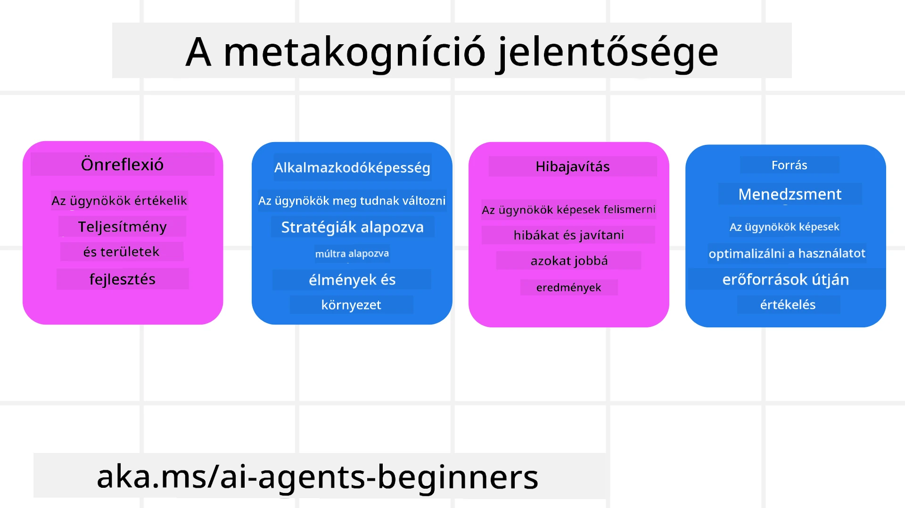
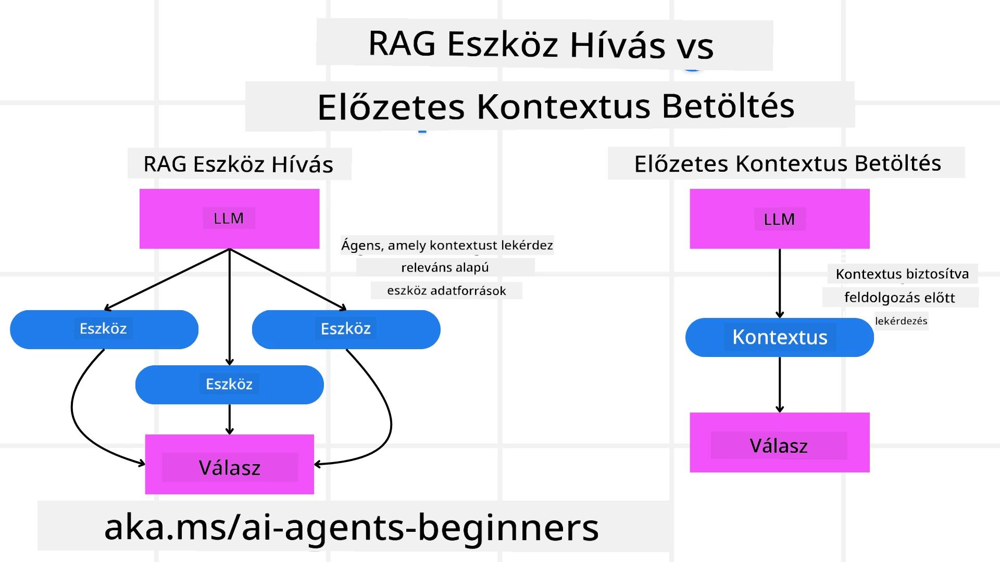

[](https://youtu.be/His9R6gw6Ec?si=3_RMb8VprNvdLRhX)

> _(Kattints a fenti képre a lecke videójának megtekintéséhez)_
# Metakogníció AI ügynökökben

## Bevezetés

Üdvözlünk a metakognícióról szóló lecke AI ügynökök esetén! Ez a fejezet kezdőknek szól, akik kíváncsiak arra, hogyan képesek az AI ügynökök saját gondolkodási folyamataikról gondolkodni. A lecke végére megérted a kulcsfogalmakat, és gyakorlati példákkal leszel felszerelve, hogy alkalmazd a metakogníciót AI ügynökök tervezésében.

## Tanulási célok

A lecke elvégzése után képes leszel:

1. Megérteni a következtetési hurkok jelentőségét az ügynökdefiníciókban.
2. Tervezési és értékelési technikákat alkalmazni az önjavító ügynökök segítésére.
3. Saját ügynököket létrehozni, amelyek képesek kód manipulálására a feladatok elvégzéséhez.

## Bevezetés a metakognícióba

A metakogníció a magasabb szintű kognitív folyamatokat jelenti, amelyek magukban foglalják a saját gondolkodásunkról való gondolkodást. AI ügynökök esetén ez azt jelenti, hogy képesek értékelni és igazítani a cselekedeteiket önreflexió és múltbeli tapasztalatok alapján. A metakogníció, vagy "a gondolkodásról való gondolkodás," fontos fogalom az ügynöki AI rendszerek fejlesztésében. Arra utal, hogy az AI rendszerek tisztában vannak saját belső folyamataikkal, és képesek figyelni, szabályozni és alkalmazkodni viselkedésükhöz. Hasonlóan, ahogy mi megfigyeljük a környezetünket vagy egy problémát. Ez az önismeret segíthet az AI rendszereknek jobb döntéseket hozni, hibákat felismerni, és idővel javítani a teljesítményüket – ami visszakapcsol a Turing-tesztre és a vitára arról, hogy az AI át fogja-e venni az irányítást.

Az ügynöki AI rendszerek kontextusában a metakogníció több kihívás kezelésében segíthet, például:
- Átláthatóság: Biztosítani, hogy az AI rendszerek meg tudják magyarázni következtetéseiket és döntéseiket.
- Következtetés: Javítani az AI rendszerek képességét az információk szintetizálására és megalapozott döntések meghozatalára.
- Alkalmazkodás: Lehetővé tenni, hogy az AI rendszerek alkalmazkodjanak új környezetekhez és változó feltételekhez.
- Észlelés: Javítani az AI rendszerek pontosságát a környezetükből származó adatok felismerésében és értelmezésében.

### Mi az a metakogníció?

A metakogníció, vagy "a gondolkodásról való gondolkodás," egy magasabb rendű kognitív folyamat, amely önismeretet és a kognitív folyamatok önszabályozását jelenti. Az AI területén a metakogníció képessé teszi az ügynököket, hogy értékeljék és alkalmazkodjanak stratégiáikhoz és cselekvéseikhez, ami jobb problémamegoldáshoz és döntéshozatalhoz vezet. A metakogníció megértésével olyan AI ügynököket tervezhetsz, amelyek nemcsak intelligensebbek, hanem alkalmazkodóbbak és hatékonyabbak is. Az igazi metakognícióban az AI explicit módon érvel a saját érveléséről.

Példa: „Az olcsóbb repülőjáratokat helyeztem előtérbe, mert... lehet, hogy kimaradnak a közvetlen járatok, ezért újra ellenőrzöm.”
Nyomon követi, hogyan vagy miért választott egy adott utat.
- Megjegyzi, hogy hibázott, mert túlzottan támaszkodott a felhasználói preferenciákra az előző alkalommal, így nemcsak a végső ajánlást, hanem a döntéshozatali stratégiáját is módosítja.
- Olyan mintázatokat diagnosztizál, mint például: „Amikor a felhasználó azt említi, hogy 'túl zsúfolt', nemcsak bizonyos látványosságokat kell eltávolítanom, hanem azt is reflektálni kell, hogy a 'top látványosságok' kiválasztási módszerem hibás, ha mindig népszerűség szerint rangsorolok.”

### A metakogníció fontossága AI ügynökökben

A metakogníció kulcsszerepet játszik az AI ügynökök tervezésében több okból:



- Önreflexió: Az ügynökök értékelik saját teljesítményüket és azonosítanak fejlesztendő területeket.
- Alkalmazkodóképesség: Az ügynökök múltbeli tapasztalatok és változó környezet alapján módosítják stratégiáikat.
- Hibajavítás: Az ügynökök önállóan felismerik és korrigálják a hibákat, ami pontosabb eredményekhez vezet.
- Erőforrás-gazdálkodás: Az ügynökök optimalizálják erőforrásaik használatát, mint az idő és számítási kapacitás, tervezéssel és értékeléssel.

## Egy AI ügynök összetevői

Mielőtt belemennénk a metakognitív folyamatokba, fontos megérteni egy AI ügynök alapvető összetevőit. Egy AI ügynök tipikusan a következőkből áll:

- Személyiség: Az ügynök személyisége és jellemzői, amelyek meghatározzák, hogyan lép kapcsolatba a felhasználókkal.
- Eszközök: Az ügynök által végrehajtható képességek és funkciók.
- Készségek: Az ügynök tudása és szakértelme.

Ezek az összetevők együtt alkotnak egy „szakértelmi egységet”, amely képes specifikus feladatok elvégzésére.

**Példa**:
Gondolj egy utazási ügynökre, amely nemcsak megtervezi a nyaralásodat, hanem valós idejű adatok és korábbi ügyfélutak tapasztalatai alapján igazítja útvonalát.

### Példa: Metakogníció egy utazási ügynök szolgáltatásban

Képzeld el, hogy egy AI által működtetett utazási ügynök szolgáltatást tervezel. Ez az ügynök, „Travel Agent,” segíti a felhasználókat nyaralásuk megtervezésében. A metakogníció beépítéséhez a Travel Agent-nek értékelnie kell saját cselekedeteit és alkalmazkodnia kell önreflexió és múltbeli tapasztalatok szerint. Így játszhat szerepet a metakogníció:

#### Jelenlegi feladat

A jelenlegi feladat segíteni a felhasználót egy párizsi út megtervezésében.

#### A feladat végrehajtásának lépései

1. **Felhasználói preferenciák gyűjtése:** Kérdezd meg a felhasználót az utazás dátumairól, költségvetéséről, érdeklődési köréről (például múzeumok, konyha, vásárlás) és bármilyen specifikus igényről.
2. **Információgyűjtés:** Keresd meg a járatokat, szállásokat, látnivalókat és éttermeket, amelyek megfelelnek a felhasználói preferenciáknak.
3. **Ajánlások létrehozása:** Készíts személyre szabott útitervet járatok, szállásfoglalások és javasolt programok részleteivel.
4. **Visszajelzés alapján igazítás:** Kérj visszajelzést a felhasználótól az ajánlatokról, és végezz szükséges módosításokat.

#### Szükséges erőforrások

- Hozzáférés repülő- és szállásfoglalási adatbázisokhoz.
- Információk párizsi látnivalókról és éttermekről.
- Felhasználói visszajelzési adatok korábbi interakciókból.

#### Tapasztalat és önreflexió

A Travel Agent metakogníciót használ teljesítményének értékelésére és a múltból való tanulásra. Például:

1. **Felhasználói visszajelzés elemzése:** A Travel Agent áttekinti a felhasználói visszajelzéseket, hogy meghatározza, mely ajánlások voltak sikeresek és melyek nem. Ennek megfelelően módosítja a jövőbeni javaslatokat.
2. **Alkalmazkodó képesség:** Ha a felhasználó korábban jelezte, hogy nem szereti a zsúfolt helyeket, a Travel Agent a jövőben el fogja kerülni a népszerű turistalátványosságokat a csúcsidőben.
3. **Hibajavítás:** Ha a Travel Agent korábban hibát követett el egy foglalásnál, például egy már teltházas hotelt ajánlott, megtanulja az elérhetőséget szigorúbban ellenőrizni ajánlás előtt.

#### Gyakorlati fejlesztői példa

Íme egy leegyszerűsített példa arra, hogyan nézhet ki a Travel Agent kódja a metakogníció beépítésével:

```python
class Travel_Agent:
    def __init__(self):
        self.user_preferences = {}
        self.experience_data = []

    def gather_preferences(self, preferences):
        self.user_preferences = preferences

    def retrieve_information(self):
        # Keresés járatok, szállodák és látnivalók között preferenciák alapján
        flights = search_flights(self.user_preferences)
        hotels = search_hotels(self.user_preferences)
        attractions = search_attractions(self.user_preferences)
        return flights, hotels, attractions

    def generate_recommendations(self):
        flights, hotels, attractions = self.retrieve_information()
        itinerary = create_itinerary(flights, hotels, attractions)
        return itinerary

    def adjust_based_on_feedback(self, feedback):
        self.experience_data.append(feedback)
        # Vélemények elemzése és jövőbeli ajánlások módosítása
        self.user_preferences = adjust_preferences(self.user_preferences, feedback)

# Használati példa
travel_agent = Travel_Agent()
preferences = {
    "destination": "Paris",
    "dates": "2025-04-01 to 2025-04-10",
    "budget": "moderate",
    "interests": ["museums", "cuisine"]
}
travel_agent.gather_preferences(preferences)
itinerary = travel_agent.generate_recommendations()
print("Suggested Itinerary:", itinerary)
feedback = {"liked": ["Louvre Museum"], "disliked": ["Eiffel Tower (too crowded)"]}
travel_agent.adjust_based_on_feedback(feedback)
```

#### Miért fontos a metakogníció

- **Önreflexió:** Az ügynökök elemezhetik teljesítményüket és azonosíthatják a fejlesztendő területeket.
- **Alkalmazkodóképesség:** Az ügynökök visszajelzések és változó körülmények alapján módosíthatják stratégiájukat.
- **Hibajavítás:** Az ügynökök önállóan felismerik és javítják a hibákat.
- **Erőforrás-gazdálkodás:** Az ügynökök optimalizálják az erőforrások, mint idő és számítási kapacitás használatát.

A metakogníció beépítésével a Travel Agent személyre szabottabb és pontosabb utazási ajánlásokat nyújthat, javítva a felhasználói élményt.

---

## 2. Tervezés az ügynökökben

A tervezés kritikus komponense az AI ügynökök viselkedésének. Magában foglalja a cél eléréséhez szükséges lépések körvonalazását, figyelembe véve a jelenlegi állapotot, erőforrásokat és lehetséges akadályokat.

### A tervezés elemei

- **Jelenlegi feladat:** Határozd meg világosan a feladatot.
- **A feladat végrehajtásának lépései:** Bontsd le a feladatot kezelhető lépésekre.
- **Szükséges erőforrások:** Azonosítsd a szükséges erőforrásokat.
- **Tapasztalat:** Használd fel a múltbeli tapasztalatokat a tervezéshez.

**Példa**:
Itt vannak a lépések, amelyeket a Travel Agentnek meg kell tennie, hogy hatékonyan segítse a felhasználót az utazás tervezésében:

### Lépések a Travel Agent számára

1. **Felhasználói preferenciák gyűjtése**
   - Kérdezd meg a felhasználót az utazás dátumairól, költségvetéséről, érdeklődési köréről és speciális igényeiről.
   - Példák: „Mikor tervezel utazni?” „Mekkora a költségvetésed?” „Milyen tevékenységeket szeretsz nyaraláskor?”

2. **Információgyűjtés**
   - Keresd meg az utazási lehetőségeket a felhasználói preferenciák alapján.
   - **Járatok:** Keress elérhető járatokat a felhasználó költségvetésén és kívánt utazási dátumain belül.
   - **Szállás:** Találj hoteleket vagy bérleményeket, amelyek megfelelnek a felhasználó helyszín, ár és szolgáltatások iránti preferenciáinak.
   - **Látványosságok és éttermek:** Azonosíts népszerű látnivalókat, programokat és étkezési lehetőségeket, amelyek összhangban vannak a felhasználó érdeklődésével.

3. **Ajánlások készítése**
   - Állítsd össze az összegyűjtött információkból a személyre szabott útitervet.
   - Add meg a járatok, szállásfoglalások és javasolt programok részleteit, ügyelve arra, hogy a javaslatokat a felhasználó preferenciáihoz igazítsd.

4. **Az útiterv bemutatása a felhasználónak**
   - Oszd meg a tervezetet a felhasználóval véleményezésre.
   - Példa: „Íme egy javasolt útiterv a párizsi utazásodra. Tartalmazza a járatok részleteit, a szállásfoglalásokat, valamint a program- és étteremajánlatokat. Várom a véleményed!”

5. **Visszajelzés gyűjtése**
   - Kérj visszajelzést a javasolt útitervről.
   - Példák: „Tetszenek a járatlehetőségek?” „Megfelel a szálloda az igényeidnek?” „Van bármilyen tevékenység, amit hozzáadnál vagy eltávolítanál?”

6. **Igazítás a visszajelzés alapján**
   - Módosítsd az útitervet a felhasználó visszajelzése alapján.
   - Végez el szükséges változtatásokat a járat-, szállás- és programajánlatokban, hogy jobban megfeleljenek a felhasználó preferenciáinak.

7. **Végleges jóváhagyás**
   - Mutasd meg a frissített útitervet a felhasználónak végső jóváhagyásra.
   - Példa: „Elvégeztem a módosításokat a visszajelzésed alapján. Íme a frissített útiterv. Minden megfelel az elképzeléseidnek?”

8. **Foglalások lebonyolítása és megerősítések**
   - Miután a felhasználó jóváhagyta az útitervet, foglald le a járatokat, szállásokat és előre tervezett programokat.
   - Küldj megerősítő részleteket a felhasználónak.

9. **Folyamatos támogatás nyújtása**
   - Maradj elérhető, hogy segítséget nyújts bármilyen változtatásnál vagy további kérésnél az utazás előtt és alatt.
   - Példa: „Ha az utazásod alatt bármilyen további segítségre van szükséged, bátran fordulj hozzám bármikor!”

### Példa interakció

```python
class Travel_Agent:
    def __init__(self):
        self.user_preferences = {}
        self.experience_data = []

    def gather_preferences(self, preferences):
        self.user_preferences = preferences

    def retrieve_information(self):
        flights = search_flights(self.user_preferences)
        hotels = search_hotels(self.user_preferences)
        attractions = search_attractions(self.user_preferences)
        return flights, hotels, attractions

    def generate_recommendations(self):
        flights, hotels, attractions = self.retrieve_information()
        itinerary = create_itinerary(flights, hotels, attractions)
        return itinerary

    def adjust_based_on_feedback(self, feedback):
        self.experience_data.append(feedback)
        self.user_preferences = adjust_preferences(self.user_preferences, feedback)

# Példa használat egy foglalási kérésen belül
travel_agent = Travel_Agent()
preferences = {
    "destination": "Paris",
    "dates": "2025-04-01 to 2025-04-10",
    "budget": "moderate",
    "interests": ["museums", "cuisine"]
}
travel_agent.gather_preferences(preferences)
itinerary = travel_agent.generate_recommendations()
print("Suggested Itinerary:", itinerary)
feedback = {"liked": ["Louvre Museum"], "disliked": ["Eiffel Tower (too crowded)"]}
travel_agent.adjust_based_on_feedback(feedback)
```

## 3. Javító RAG rendszer

Először is kezdjük azzal, hogy megértsük a különbséget a RAG eszköz és az előzetes kontextusbetöltés között.



### Visszakeresés-alapú generálás (RAG)

A RAG egy visszakereső rendszert kombinál egy generatív modellel. Amikor egy lekérdezés érkezik, a visszakereső rendszer releváns dokumentumokat vagy adatokat hoz be külső forrásból, és ez az információ kiegészíti a generatív modell bemenetét. Ez segíti a modellt abban, hogy pontosabb és kontextuálisan releváns válaszokat generáljon.

Egy RAG rendszerben az ügynök releváns információkat keres egy tudásbázisból, és ezeket felhasználva generál megfelelő válaszokat vagy cselekvéseket.

### Javító RAG megközelítés

A Javító RAG megközelítés a RAG technikák alkalmazására fókuszál hibák korrigálása és a pontosság javítása érdekében AI ügynökök esetén. Ez magában foglalja:

1. **Kérdezési technika:** Specifikus utasításokat használ az ügynök irányítására, hogy releváns információt hozzon be.
2. **Eszköz:** Algoritmusok és mechanizmusok megvalósítása, amelyek képessé teszik az ügynököt a begyűjtött információ relevanciájának értékelésére és pontos válaszok generálására.
3. **Értékelés:** Folyamatosan értékeli az ügynök teljesítményét, és módosításokat hajt végre annak pontosságának és hatékonyságának javítása érdekében.

#### Példa: Javító RAG keresőügynökben

Vegyünk egy keresőügynököt, amely webes információkat hoz be felhasználói kérdések megválaszolására. A Javító RAG megközelítés ezeket tartalmazhatja:

1. **Kérdezési technika:** A felhasználó bemenete alapján alakítja ki a keresési lekérdezéseket.
2. **Eszköz:** Természetes nyelvfeldolgozást és gépi tanulási algoritmusokat használ az eredmények rangsorolására és szűrésére.
3. **Értékelés:** Elemzi a felhasználói visszajelzéseket, hogy felismerje és javítsa a begyűjtött információk pontatlanságait.

### Javító RAG a Travel Agentben

A Javító RAG (Retrieval-Augmented Generation) javítja az AI képességét az információk begyűjtésére és generálására, miközben korrigálja a pontatlanságokat. Nézzük meg, hogyan használhatja a Travel Agent a Javító RAG megközelítést pontosabb és relevánsabb utazási ajánlások nyújtására.

Ez a következőket foglalja magában:

- **Kérdezési technika:** Specifikus utasítások használata az ügynök irányítására releváns információ begyűjtésére.
- **Eszköz:** Algoritmusok és mechanizmusok megvalósítása, amelyek lehetővé teszik az ügynök számára a begyűjtött információk relevanciájának értékelését és a pontos válaszok generálását.
- **Értékelés:** Az ügynök teljesítményének folyamatos értékelése és módosítása a pontosság és hatékonyság javítása érdekében.

#### Lépések a Javító RAG bevezetésére a Travel Agentben

1. **Kezdeti felhasználói interakció**
   - A Travel Agent begyűjti a felhasználó kezdeti preferenciáit, mint úti cél, utazási dátumok, költségvetés és érdeklődés.
   - Példa:

     ```python
     preferences = {
         "destination": "Paris",
         "dates": "2025-04-01 to 2025-04-10",
         "budget": "moderate",
         "interests": ["museums", "cuisine"]
     }
     ```

2. **Információ begyűjtése**
   - A Travel Agent információkat gyűjt a járatokról, szállásokról, látnivalókról és éttermekről a felhasználói preferenciák alapján.
   - Példa:

     ```python
     flights = search_flights(preferences)
     hotels = search_hotels(preferences)
     attractions = search_attractions(preferences)
     ```

3. **Kezdeti ajánlások generálása**
   - A Travel Agent a begyűjtött információk alapján személyre szabott útitervet készít.
   - Példa:

     ```python
     itinerary = create_itinerary(flights, hotels, attractions)
     print("Suggested Itinerary:", itinerary)
     ```

4. **Felhasználói visszajelzés gyűjtése**
   - A Travel Agent visszajelzést kér a kezdeti ajánlásokról.
   - Példa:

     ```python
     feedback = {
         "liked": ["Louvre Museum"],
         "disliked": ["Eiffel Tower (too crowded)"]
     }
     ```

5. **Javító RAG folyamat**
   - **Kérdezési technika:** A Travel Agent az új felhasználói visszajelzések alapján alakít ki új keresési lekérdezéseket.
     - Példa:

       ```python
       if "disliked" in feedback:
           preferences["avoid"] = feedback["disliked"]
       ```

   - **Eszköz:** A Travel Agent algoritmusokat alkalmaz az új keresési eredmények rangsorolására és szűrésére, különös tekintettel a felhasználói visszajelzésekre.
     - Példa:

       ```python
       new_attractions = search_attractions(preferences)
       new_itinerary = create_itinerary(flights, hotels, new_attractions)
       print("Updated Itinerary:", new_itinerary)
       ```

   - **Értékelés:** A Travel Agent folyamatosan értékeli ajánlásai relevanciáját és pontosságát a felhasználói visszajelzések elemzésével, és szükség szerint módosít.
     - Példa:

       ```python
       def adjust_preferences(preferences, feedback):
           if "liked" in feedback:
               preferences["favorites"] = feedback["liked"]
           if "disliked" in feedback:
               preferences["avoid"] = feedback["disliked"]
           return preferences

       preferences = adjust_preferences(preferences, feedback)
       ```

#### Gyakorlati példa

Íme egy leegyszerűsített Python kód példa a Javító RAG megközelítés beépítésére a Travel Agentben:

```python
class Travel_Agent:
    def __init__(self):
        self.user_preferences = {}
        self.experience_data = []

    def gather_preferences(self, preferences):
        self.user_preferences = preferences

    def retrieve_information(self):
        flights = search_flights(self.user_preferences)
        hotels = search_hotels(self.user_preferences)
        attractions = search_attractions(self.user_preferences)
        return flights, hotels, attractions

    def generate_recommendations(self):
        flights, hotels, attractions = self.retrieve_information()
        itinerary = create_itinerary(flights, hotels, attractions)
        return itinerary

    def adjust_based_on_feedback(self, feedback):
        self.experience_data.append(feedback)
        self.user_preferences = adjust_preferences(self.user_preferences, feedback)
        new_itinerary = self.generate_recommendations()
        return new_itinerary

# Példa használat
travel_agent = Travel_Agent()
preferences = {
    "destination": "Paris",
    "dates": "2025-04-01 to 2025-04-10",
    "budget": "moderate",
    "interests": ["museums", "cuisine"]
}
travel_agent.gather_preferences(preferences)
itinerary = travel_agent.generate_recommendations()
print("Suggested Itinerary:", itinerary)
feedback = {"liked": ["Louvre Museum"], "disliked": ["Eiffel Tower (too crowded)"]}
new_itinerary = travel_agent.adjust_based_on_feedback(feedback)
print("Updated Itinerary:", new_itinerary)
```

### Előzetes kontextusbetöltés


A megelőző kontextusbetöltés azt jelenti, hogy a releváns kontextust vagy háttérinformációt betöltjük a modellbe, mielőtt feldolgoznánk egy lekérdezést. Ez azt jelenti, hogy a modellnek az elejétől fogva hozzáférése van ezekhez az információkhoz, ami segíthet abban, hogy tájékozottabb válaszokat generáljon anélkül, hogy a folyamat során további adatokat kellene lekérnie.

Íme egy egyszerűsített példa arra, hogyan nézhet ki egy megelőző kontextusbetöltés egy utazási ügynök alkalmazásban Pythonban:

```python
class TravelAgent:
    def __init__(self):
        # Népszerű úticélok és információik előzetes betöltése
        self.context = {
            "Paris": {"country": "France", "currency": "Euro", "language": "French", "attractions": ["Eiffel Tower", "Louvre Museum"]},
            "Tokyo": {"country": "Japan", "currency": "Yen", "language": "Japanese", "attractions": ["Tokyo Tower", "Shibuya Crossing"]},
            "New York": {"country": "USA", "currency": "Dollar", "language": "English", "attractions": ["Statue of Liberty", "Times Square"]},
            "Sydney": {"country": "Australia", "currency": "Dollar", "language": "English", "attractions": ["Sydney Opera House", "Bondi Beach"]}
        }

    def get_destination_info(self, destination):
        # Úticél információk lekérése az előzetesen betöltött kontextusból
        info = self.context.get(destination)
        if info:
            return f"{destination}:\nCountry: {info['country']}\nCurrency: {info['currency']}\nLanguage: {info['language']}\nAttractions: {', '.join(info['attractions'])}"
        else:
            return f"Sorry, we don't have information on {destination}."

# Példa használat
travel_agent = TravelAgent()
print(travel_agent.get_destination_info("Paris"))
print(travel_agent.get_destination_info("Tokyo"))
```

#### Magyarázat

1. **Inicializáció (`__init__` metódus)**: A `TravelAgent` osztály előre betölt egy szótárt, amely népszerű úti célokkal kapcsolatos információkat tartalmaz, mint például Párizs, Tokió, New York és Sydney. Ez a szótár olyan részleteket tartalmaz, mint az ország, valuta, nyelv és főbb látnivalók minden úti cél esetében.

2. **Információ lekérése (`get_destination_info` metódus)**: Amikor a felhasználó egy konkrét úti céllal kapcsolatos kérdést tesz fel, a `get_destination_info` metódus lekéri a releváns információkat az előre betöltött kontextus szótárból.

A kontextus előzetes betöltésével az utazási ügynök alkalmazás gyorsan tud válaszolni a felhasználói lekérdezésekre anélkül, hogy valós időben kellene ezeket az információkat egy külső forrásból lekérnie. Ez hatékonyabbá és reagálóképesebbé teszi az alkalmazást.

### A terv bootstrap-olása egy céllal az iterálás előtt

Egy terv bootstrap-olása egy céllal azt jelenti, hogy egyértelmű célt vagy kitűzött eredményt határozzunk meg előre. Ezzel a céllal vezérelve a modellt az iteratív folyamat során. Ez segít biztosítani, hogy minden iteráció közelebb vigyen a kívánt eredmény eléréséhez, így a folyamat hatékonyabbá és fókuszáltabbá válik.

Íme egy példa arra, hogyan bootstrap-olhatunk egy utazási tervet egy céllal az iterálás előtt egy utazási ügynök esetén Pythonban:

### Forgatókönyv

Egy utazási ügynök egy ügyfél számára személyre szabott nyaralást szeretne tervezni. A cél egy olyan utazási terv elkészítése, amely maximalizálja az ügyfél elégedettségét a preferenciái és költségvetése alapján.

### Lépések

1. Határozzuk meg az ügyfél preferenciáit és költségvetését.
2. Bootstrap-oljuk az elsődleges tervet ezek alapján a preferenciák alapján.
3. Iteráljunk, hogy finomítsuk a tervet, optimalizálva az ügyfél elégedettségét.

#### Python kód

```python
class TravelAgent:
    def __init__(self, destinations):
        self.destinations = destinations

    def bootstrap_plan(self, preferences, budget):
        plan = []
        total_cost = 0

        for destination in self.destinations:
            if total_cost + destination['cost'] <= budget and self.match_preferences(destination, preferences):
                plan.append(destination)
                total_cost += destination['cost']

        return plan

    def match_preferences(self, destination, preferences):
        for key, value in preferences.items():
            if destination.get(key) != value:
                return False
        return True

    def iterate_plan(self, plan, preferences, budget):
        for i in range(len(plan)):
            for destination in self.destinations:
                if destination not in plan and self.match_preferences(destination, preferences) and self.calculate_cost(plan, destination) <= budget:
                    plan[i] = destination
                    break
        return plan

    def calculate_cost(self, plan, new_destination):
        return sum(destination['cost'] for destination in plan) + new_destination['cost']

# Példa használat
destinations = [
    {"name": "Paris", "cost": 1000, "activity": "sightseeing"},
    {"name": "Tokyo", "cost": 1200, "activity": "shopping"},
    {"name": "New York", "cost": 900, "activity": "sightseeing"},
    {"name": "Sydney", "cost": 1100, "activity": "beach"},
]

preferences = {"activity": "sightseeing"}
budget = 2000

travel_agent = TravelAgent(destinations)
initial_plan = travel_agent.bootstrap_plan(preferences, budget)
print("Initial Plan:", initial_plan)

refined_plan = travel_agent.iterate_plan(initial_plan, preferences, budget)
print("Refined Plan:", refined_plan)
```

#### Kód magyarázat

1. **Inicializáció (`__init__` metódus)**: A `TravelAgent` osztály egy potenciális úti célokat tartalmazó listával inicializálódik, ahol minden cél rendelkezik olyan attribútumokkal, mint név, költség és tevékenység típusa.

2. **Terv bootstrap-olása (`bootstrap_plan` metódus)**: Ez a metódus létrehoz egy kezdeti utazási tervet az ügyfél preferenciái és költségvetése alapján. Végigmegy az úti célok listáján, és hozzáadja azokat a tervhez, amelyek megfelelnek az ügyfél preferenciáinak és beleférnek a költségvetésbe.

3. **Preferenciák egyeztetése (`match_preferences` metódus)**: Ez a metódus ellenőrzi, hogy egy úti cél megfelel-e az ügyfél preferenciáinak.

4. **Terv iterálása (`iterate_plan` metódus)**: Ez a metódus finomítja a kezdeti tervet azzal, hogy megpróbálja helyettesíteni az egyes úti célokat jobb egyezéssel, figyelembe véve az ügyfél preferenciáit és költségvetési korlátait.

5. **Költségszámítás (`calculate_cost` metódus)**: Ez a metódus kiszámolja az aktuális terv összköltségét, beleértve egy potenciális új úti célt is.

#### Példa használatra

- **Kezdeti terv**: Az utazási ügynök egy kezdeti tervet készít az ügyfél városnézés iránti preferenciája és 2000 dolláros költségvetése alapján.
- **Finomított terv**: Az utazási ügynök iterálja a tervet, optimalizálva az ügyfél preferenciáit és költségvetését.

A terv egyértelmű céllal való bootstrap-olásával (például az ügyfél elégedettségének maximalizálása) és az iterálással az utazási ügynök egy személyre szabott és optimalizált utazási útitervet hozhat létre az ügyfél számára. Ez a megközelítés biztosítja, hogy az utazási terv már az elejétől összhangban legyen az ügyfél preferenciáival és költségvetésével, és minden iterációval javuljon.

### Az LLM kihasználása újrasorrendezésre és pontozásra

A nagy nyelvi modellek (LLM-ek) használhatók újrasorrendezésre és pontozásra azáltal, hogy értékelik a lekért dokumentumok vagy generált válaszok relevanciáját és minőségét. Íme, hogyan működik:

**Lekérés:** Az első lekérési lépés egy jelöltdokumentumok vagy válaszok halmazát hozza vissza a lekérdezés alapján.

**Újrasorrendezés:** Az LLM értékeli ezeket a jelölteteket, és újrasorrendbe állítja őket a relevancia és minőség alapján. Ez a lépés biztosítja, hogy a legrelevánsabb és legmagasabb minőségű információ jelenjen meg az első helyen.

**Pontozás:** Az LLM pontszámokat rendel minden jelölthöz, amelyek tükrözik azok relevanciáját és minőségét. Ez segít a legjobb válasz vagy dokumentum kiválasztásában a felhasználó számára.

Az LLM-ek használatával az újrasorrendezésre és pontozásra a rendszer pontosabb és kontextuálisan relevánsabb információkat tud biztosítani, javítva ezzel a felhasználói élményt.

Íme egy példa arra, hogyan használhat egy utazási ügynök egy nagy nyelvi modellt (LLM-et) az úti célok újrasorrendezésére és pontozására a felhasználói preferenciák alapján Pythonban:

#### Forgatókönyv - Utazás preferenciák alapján

Egy utazási ügynök a legjobb úti célokat szeretné ajánlani egy ügyfélnek a preferenciái alapján. Az LLM segít az úti célok újrasorrendezésében és pontozásában, hogy a legrelevánsabb lehetőségek kerüljenek előtérbe.

#### Lépések:

1. Gyűjtsük össze a felhasználó preferenciáit.
2. Lekérjünk egy potenciális úti célok listáját.
3. Az LLM használatával újrasorrendeljük és pontozzuk az úti célokat a felhasználói preferenciák alapján.

Íme, hogyan frissítheted a korábbi példát az Azure OpenAI Szolgáltatások használatára:

#### Követelmények

1. Szükséged van egy Azure előfizetésre.
2. Hozz létre egy Azure OpenAI erőforrást, és szerezd meg az API kulcsodat.

#### Példa Python kód

```python
import requests
import json

class TravelAgent:
    def __init__(self, destinations):
        self.destinations = destinations

    def get_recommendations(self, preferences, api_key, endpoint):
        # Generáljon egy promptot az Azure OpenAI számára
        prompt = self.generate_prompt(preferences)
        
        # Határozza meg a fejléceket és a kéréstörzs tartalmát
        headers = {
            'Content-Type': 'application/json',
            'Authorization': f'Bearer {api_key}'
        }
        payload = {
            "prompt": prompt,
            "max_tokens": 150,
            "temperature": 0.7
        }
        
        # Hívja meg az Azure OpenAI API-t, hogy megkapja az újrarangsorolt és pontozott célállomásokat
        response = requests.post(endpoint, headers=headers, json=payload)
        response_data = response.json()
        
        # Kinyeri és visszaadja az ajánlásokat
        recommendations = response_data['choices'][0]['text'].strip().split('\n')
        return recommendations

    def generate_prompt(self, preferences):
        prompt = "Here are the travel destinations ranked and scored based on the following user preferences:\n"
        for key, value in preferences.items():
            prompt += f"{key}: {value}\n"
        prompt += "\nDestinations:\n"
        for destination in self.destinations:
            prompt += f"- {destination['name']}: {destination['description']}\n"
        return prompt

# Példa használat
destinations = [
    {"name": "Paris", "description": "City of lights, known for its art, fashion, and culture."},
    {"name": "Tokyo", "description": "Vibrant city, famous for its modernity and traditional temples."},
    {"name": "New York", "description": "The city that never sleeps, with iconic landmarks and diverse culture."},
    {"name": "Sydney", "description": "Beautiful harbour city, known for its opera house and stunning beaches."},
]

preferences = {"activity": "sightseeing", "culture": "diverse"}
api_key = 'your_azure_openai_api_key'
endpoint = 'https://your-endpoint.com/openai/deployments/your-deployment-name/completions?api-version=2022-12-01'

travel_agent = TravelAgent(destinations)
recommendations = travel_agent.get_recommendations(preferences, api_key, endpoint)
print("Recommended Destinations:")
for rec in recommendations:
    print(rec)
```

#### Kód magyarázat - Preferencia foglaló

1. **Inicializáció**: A `TravelAgent` osztály egy potenciális utazási célok listájával inicializálódik, ahol minden cél rendelkezik olyan attribútumokkal, mint név és leírás.

2. **Ajánlások lekérése (`get_recommendations` metódus)**: Ez a metódus egy promptot generál az Azure OpenAI szolgáltatás számára a felhasználó preferenciái alapján, és HTTP POST kérést küld az Azure OpenAI API-nak, hogy újrasorrendelt és pontozott úti célokat kapjon.

3. **Prompt generálása (`generate_prompt` metódus)**: Ez a metódus összeállít egy promptot az Azure OpenAI számára, beleértve a felhasználó preferenciáit és az úti célok listáját. A prompt irányítja a modellt, hogy a megadott preferenciák alapján újrasorrendelje és pontozza az úti célokat.

4. **API hívás**: A `requests` könyvtárat használjuk egy HTTP POST kérés elküldésére az Azure OpenAI API végpontjára. A válasz tartalmazza az újrasorrendelt és pontozott úti célokat.

5. **Példa használatra**: Az utazási ügynök összegyűjti a felhasználó preferenciáit (például érdeklődés a városnézés és sokszínű kultúra iránt), és az Azure OpenAI szolgáltatás segítségével újrasorrendelt és pontozott ajánlásokat kap az úti célokra.

Ügyelj arra, hogy a `your_azure_openai_api_key`-t cseréld le a tényleges Azure OpenAI API kulcsodra, és a `https://your-endpoint.com/...`-t az Azure OpenAI telepítésed tényleges végpont URL címére.

Az LLM újrasorrendezésre és pontozásra használatával az utazási ügynök személyre szabottabb és relevánsabb utazási ajánlásokat tud biztosítani az ügyfeleknek, javítva ezzel az általános élményt.

### RAG: Promptolási technika vs eszköz

A lekérdezés-alapú generálás (Retrieval-Augmented Generation, RAG) lehet promptolási technika és eszköz is az AI ügynökök fejlesztésében. A kettő közötti különbség megértése segíthet abban, hogy hatékonyabban használd a RAG-ot a projektjeidben.

#### RAG mint promptolási technika

**Mi ez?**

- Promptolási technikaként a RAG magában foglalja specifikus lekérdezések vagy promptok megfogalmazását, hogy irányítsa a releváns információk lekérését egy nagy adattömegből vagy adatbázisból. Ezeket az információkat használják válaszok vagy műveletek generálására.

**Hogyan működik:**

1. **Promptok megfogalmazása:** Hozz létre jól strukturált promptokat vagy lekérdezéseket az adott feladat vagy a felhasználó bemenete alapján.
2. **Információ lekérése:** Használd a promptokat releváns adatok keresésére egy előzetesen meglévő tudásbázisból vagy adathalmazból.
3. **Válasz generálása:** Kombináld a lekért információkat generatív AI modellekkel, hogy átfogó és koherens választ készíts.

**Példa utazási ügynök esetén:**

- Felhasználói bemenet: „Múzeumokat szeretnék meglátogatni Párizsban.”
- Prompt: „Keress top múzeumokat Párizsban.”
- Lekért információ: Részletek a Louvre Múzeumról, Musée d'Orsay-ról, stb.
- Generált válasz: „Íme néhány top múzeum Párizsban: Louvre Múzeum, Musée d'Orsay és Centre Pompidou.”

#### RAG mint eszköz

**Mi ez?**

- Eszközként a RAG egy integrált rendszer, amely automatizálja a lekérés és generálás folyamatát, megkönnyítve a fejlesztők számára összetett AI funkciók implementálását anélkül, hogy minden lekérdezést manuálisan kellene prompttal ellátni.

**Hogyan működik:**

1. **Integráció:** Beágyazzák a RAG-ot az AI ügynök architektúrájába, lehetővé téve, hogy automatikusan kezelje a lekérés és generálás feladatait.
2. **Automatizálás:** Az eszköz kezeli az egész folyamatot, a felhasználói input fogadásától a végső válasz generálásáig, anélkül, hogy minden lépéshez külön promptot kellene megadni.
3. **Hatékonyság:** Javítja az ügynök teljesítményét azáltal, hogy egyszerűsíti a lekérés és generálás folyamatát, gyorsabb és pontosabb válaszokat adva.

**Példa utazási ügynök esetén:**

- Felhasználói bemenet: „Múzeumokat szeretnék meglátogatni Párizsban.”
- RAG eszköz: Automatikusan lekéri az információkat a múzeumokról, és választ generál.
- Generált válasz: „Íme néhány top múzeum Párizsban: Louvre Múzeum, Musée d'Orsay és Centre Pompidou.”

### Összehasonlítás

| Szempont               | Promptolási technika                                      | Eszköz                                                |
|------------------------|-----------------------------------------------------------|-------------------------------------------------------|
| **Kézi vs Automatikus** | Kézi prompt megfogalmazás minden lekérdezéshez.            | Automatizált folyamat lekérésre és generálásra.        |
| **Irányítás**           | Több ellenőrzést biztosít a lekérdezési folyamat felett.    | Egyszerűsíti és automatizálja a lekérés és generálás folyamatát.|
| **Rugalmasság**         | Lehetővé teszi az egyedi igények szerinti promptok készítését. | Hatékonyabb nagyobb léptékű megvalósításokhoz.          |
| **Bonyolultság**        | Szükséges a promptok elkészítése és finomítása.             | Könnyebb integrálni egy AI ügynök architektúrájába.     |

### Gyakorlati példák

**Promptolási technika példa:**

```python
def search_museums_in_paris():
    prompt = "Find top museums in Paris"
    search_results = search_web(prompt)
    return search_results

museums = search_museums_in_paris()
print("Top Museums in Paris:", museums)
```

**Eszköz példa:**

```python
class Travel_Agent:
    def __init__(self):
        self.rag_tool = RAGTool()

    def get_museums_in_paris(self):
        user_input = "I want to visit museums in Paris."
        response = self.rag_tool.retrieve_and_generate(user_input)
        return response

travel_agent = Travel_Agent()
museums = travel_agent.get_museums_in_paris()
print("Top Museums in Paris:", museums)
```

### A relevancia értékelése

A relevancia értékelése kulcsfontosságú az AI ügynök teljesítményében. Ez biztosítja, hogy az ügynök által lekért és generált információk megfelelőek, pontosak és hasznosak legyenek a felhasználó számára. Nézzük meg, hogyan lehet értékelni a relevanciát AI ügynökök esetében, gyakorlati példákkal és technikákkal.

#### A relevancia értékelésének kulcsfogalmai

1. **Kontextus tudatosság**:
   - Az ügynöknek meg kell értenie a felhasználó lekérdezésének kontextusát, hogy releváns információkat tudjon lekérni és generálni.
   - Példa: Ha a felhasználó a „legjobb éttermek Párizsban” kifejezést keresi, az ügynök figyelembe veszi a felhasználó preferenciáit, például a konyha típusát és a költségvetést.

2. **Pontosság**:
   - Az ügynök által szolgáltatott információnak tényalapúnak és naprakésznek kell lennie.
   - Példa: Jelenleg nyitva lévő és jó értékelésű éttermek ajánlása, nem pedig elavult vagy bezárt helyek.

3. **Felhasználói szándék**:
   - Az ügynöknek ki kell következtetnie a felhasználó lekérdezésének szándékát, hogy a legrelevánsabb információt nyújtsa.
   - Példa: Ha a felhasználó „költséghatékony szállodákat” keres, az ügynök prioritásként kezeli az megfizethető lehetőségeket.

4. **Visszacsatolási kör**:
   - Folyamatosan gyűjteni és elemezni a felhasználói visszajelzéseket segít az ügynöknek javítani a relevancia értékelési folyamatát.
   - Példa: A korábbi ajánlásokra adott felhasználói értékelések és visszacsatolások beépítése a jövőbeni válaszok javítása érdekében.

#### Gyakorlati technikák a relevancia értékeléséhez

1. **Relevancia pontozás**:
   - Minden lekért elemhez rendelünk relevancia pontszámot, amely azt tükrözi, mennyire illik a felhasználó lekérdezéséhez és preferenciáihoz.
   - Példa:

     ```python
     def relevance_score(item, query):
         score = 0
         if item['category'] in query['interests']:
             score += 1
         if item['price'] <= query['budget']:
             score += 1
         if item['location'] == query['destination']:
             score += 1
         return score
     ```

2. **Szűrés és rangsorolás**:
   - Kiszűrjük a nem releváns elemeket, és a maradékot relevancia pontszám alapján rangsoroljuk.
   - Példa:

     ```python
     def filter_and_rank(items, query):
         ranked_items = sorted(items, key=lambda item: relevance_score(item, query), reverse=True)
         return ranked_items[:10]  # Visszaadja a 10 legrelevánsabb elemet
     ```

3. **Természetes nyelv feldolgozás (NLP)**:
   - NLP technikákat alkalmazunk a felhasználói lekérdezés megértésére és releváns információk lekérésére.
   - Példa:

     ```python
     def process_query(query):
         # Használj NLP-t a felhasználó lekérdezéséből származó kulcsfontosságú információk kinyeréséhez
         processed_query = nlp(query)
         return processed_query
     ```

4. **Felhasználói visszajelzések integrálása**:
   - Gyűjtjük a felhasználói visszajelzéseket a javasolt ajánlásokról, és ez alapján állítjuk be a jövőbeni relevancia értékelést.
   - Példa:

     ```python
     def adjust_based_on_feedback(feedback, items):
         for item in items:
             if item['name'] in feedback['liked']:
                 item['relevance'] += 1
             if item['name'] in feedback['disliked']:
                 item['relevance'] -= 1
         return items
     ```

#### Példa: A relevancia értékelése utazási ügynöknél

Íme egy gyakorlati példa arra, hogyan értékelheti a relevanciát egy utazási ügynök az utazási ajánlások esetében:

```python
class Travel_Agent:
    def __init__(self):
        self.user_preferences = {}
        self.experience_data = []

    def gather_preferences(self, preferences):
        self.user_preferences = preferences

    def retrieve_information(self):
        flights = search_flights(self.user_preferences)
        hotels = search_hotels(self.user_preferences)
        attractions = search_attractions(self.user_preferences)
        return flights, hotels, attractions

    def generate_recommendations(self):
        flights, hotels, attractions = self.retrieve_information()
        ranked_hotels = self.filter_and_rank(hotels, self.user_preferences)
        itinerary = create_itinerary(flights, ranked_hotels, attractions)
        return itinerary

    def filter_and_rank(self, items, query):
        ranked_items = sorted(items, key=lambda item: self.relevance_score(item, query), reverse=True)
        return ranked_items[:10]  # Visszaadja a 10 legrelevánsabb elemet

    def relevance_score(self, item, query):
        score = 0
        if item['category'] in query['interests']:
            score += 1
        if item['price'] <= query['budget']:
            score += 1
        if item['location'] == query['destination']:
            score += 1
        return score

    def adjust_based_on_feedback(self, feedback, items):
        for item in items:
            if item['name'] in feedback['liked']:
                item['relevance'] += 1
            if item['name'] in feedback['disliked']:
                item['relevance'] -= 1
        return items

# Példa használat
travel_agent = Travel_Agent()
preferences = {
    "destination": "Paris",
    "dates": "2025-04-01 to 2025-04-10",
    "budget": "moderate",
    "interests": ["museums", "cuisine"]
}
travel_agent.gather_preferences(preferences)
itinerary = travel_agent.generate_recommendations()
print("Suggested Itinerary:", itinerary)
feedback = {"liked": ["Louvre Museum"], "disliked": ["Eiffel Tower (too crowded)"]}
updated_items = travel_agent.adjust_based_on_feedback(feedback, itinerary['hotels'])
print("Updated Itinerary with Feedback:", updated_items)
```

### Keresés szándékkal

A keresés szándékkal azt jelenti, hogy megértjük és értelmezzük a felhasználó lekérdezése mögötti célokat vagy indítékokat, hogy a legrelevánsabb és leghasznosabb információkat lekérjük és generáljuk. Ez a megközelítés túlmutat a kulcsszavak szerinti egyezésen, és a felhasználó valódi szükségleteinek és kontextusának megragadására összpontosít.

#### A keresés szándékának kulcsfogalmai

1. **A felhasználói szándék megértése**:
   - A felhasználói szándék három fő típusba sorolható: információs, navigációs és tranzakciós.
     - **Információs szándék**: A felhasználó információt keres egy témában (pl. „Melyek a legjobb múzeumok Párizsban?”).
     - **Navigációs szándék**: A felhasználó egy konkrét weboldalra vagy oldalra szeretne navigálni (pl. „Louvre Múzeum hivatalos weboldala”).
     - **Tranzakciós szándék**: A felhasználó tranzakciót szeretne végrehajtani, például repülőjegyfoglalást vagy vásárlást (pl. „Foglalj repülőjegyet Párizsba”).

2. **Kontextus tudatosság**:
   - A lekérdezés kontextusának elemzése segít pontosan azonosítani a szándékot. Ez magában foglalja a korábbi interakciókat, felhasználói preferenciákat és a jelenlegi lekérdezés konkrét részleteit.

3. **Természetes nyelvfeldolgozás (NLP)**:
   - NLP technikákat alkalmazunk a természetes nyelvű lekérdezések megértésére és értelmezésére, például entitásfelismerés, érzelemelemzés és lekérdezés解析.

4. **Személyre szabás**:
   - A keresési eredmények személyre szabása a felhasználó múltja, preferenciái és visszajelzései alapján növeli az információk relevanciáját.

#### Gyakorlati példa: Keresés szándékkal utazási ügynök esetén

Nézzük meg a Travel Agent példáját, hogy lássuk, hogyan valósítható meg a keresés szándékkal.

1. **Felhasználói preferenciák összegyűjtése**

   ```python
   class Travel_Agent:
       def __init__(self):
           self.user_preferences = {}

       def gather_preferences(self, preferences):
           self.user_preferences = preferences
   ```

2. **Felhasználói szándék megértése**

   ```python
   def identify_intent(query):
       if "book" in query or "purchase" in query:
           return "transactional"
       elif "website" in query or "official" in query:
           return "navigational"
       else:
           return "informational"
   ```

3. **Kontextus tudatosság**


   ```python
   def analyze_context(query, user_history):
       # Kombinálja az aktuális lekérdezést a felhasználó előzményeivel a kontextus megértéséhez
       context = {
           "current_query": query,
           "user_history": user_history
       }
       return context
   ```

4. **Keresés és az Eredmények Személyre Szabása**

   ```python
   def search_with_intent(query, preferences, user_history):
       intent = identify_intent(query)
       context = analyze_context(query, user_history)
       if intent == "informational":
           search_results = search_information(query, preferences)
       elif intent == "navigational":
           search_results = search_navigation(query)
       elif intent == "transactional":
           search_results = search_transaction(query, preferences)
       personalized_results = personalize_results(search_results, user_history)
       return personalized_results

   def search_information(query, preferences):
       # Példa keresési logika információs szándékhoz
       results = search_web(f"best {preferences['interests']} in {preferences['destination']}")
       return results

   def search_navigation(query):
       # Példa keresési logika navigációs szándékhoz
       results = search_web(query)
       return results

   def search_transaction(query, preferences):
       # Példa keresési logika tranzakciós szándékhoz
       results = search_web(f"book {query} to {preferences['destination']}")
       return results

   def personalize_results(results, user_history):
       # Példa személyre szabási logika
       personalized = [result for result in results if result not in user_history]
       return personalized[:10]  # Térjen vissza a legjobb 10 személyre szabott találathoz
   ```

5. **Használati Példa**

   ```python
   travel_agent = Travel_Agent()
   preferences = {
       "destination": "Paris",
       "interests": ["museums", "cuisine"]
   }
   travel_agent.gather_preferences(preferences)
   user_history = ["Louvre Museum website", "Book flight to Paris"]
   query = "best museums in Paris"
   results = search_with_intent(query, preferences, user_history)
   print("Search Results:", results)
   ```

---

## 4. Kód generálása eszközként

A kódot generáló ügynökök AI modelleket használnak kód írására és végrehajtására, bonyolult problémákat oldanak meg és automatizálnak feladatokat.

### Kódot Generáló Ügynökök

A kódot generáló ügynökök generatív AI modelleket használnak kód írására és végrehajtására. Ezek az ügynökök képesek összetett problémák megoldására, feladatok automatizálására és értékes betekintések nyújtására kód létrehozásával és futtatásával különböző programozási nyelveken.

#### Gyakorlati Alkalmazások

1. **Automatizált Kódgenerálás**: Kód részletek generálása konkrét feladatokra, mint például adat elemzés, webes adatgyűjtés vagy gépi tanulás.
2. **SQL mint RAG**: SQL lekérdezések használata adatok lekérésére és manipulálására adatbázisokból.
3. **Problémamegoldás**: Kód létrehozása és végrehajtása konkrét problémák megoldására, például algoritmusok optimalizálására vagy adatelemzésre.

#### Példa: Kódot Generáló Ügynök Adat Elemzéshez

Képzeld el, hogy egy kódot generáló ügynököt tervezel. Így működhet:

1. **Feladat**: Egy adathalmaz elemzése, hogy trendeket és mintákat azonosíts.
2. **Lépések**:
   - Az adathalmaz betöltése egy adat elemző eszközbe.
   - SQL lekérdezések generálása az adatok szűrésére és aggregálására.
   - A lekérdezések végrehajtása és az eredmények lekérése.
   - Az eredmények felhasználása vizualizációk és betekintések készítésére.
3. **Szükséges Eszközök**: Hozzáférés az adathalmazhoz, adat elemző eszközök és SQL képességek.
4. **Tapasztalat**: Korábbi elemzési eredmények felhasználása a jövőbeli elemzések pontosságának és relevanciájának javítására.

### Példa: Kódot Generáló Ügynök Utazási Ügynöknek

Ebben a példában egy kódot generáló ügynököt, az Utazási Ügynököt tervezzük, amely segíti a felhasználókat utazásaik megtervezésében kód generálásával és végrehajtásával. Ez az ügynök képes kezelni olyan feladatokat, mint utazási lehetőségek lekérése, eredmények szűrése és útiterv összeállítása generatív AI segítségével.

#### A kódot generáló ügynök áttekintése

1. **Felhasználói Preferenciák Gyűjtése**: Begyűjti a felhasználó adatait, mint az úti cél, utazási dátumok, költségvetés és érdeklődési körök.
2. **Adatlekéréshez Kód Generálása**: Kód részleteket generál repülőjáratok, szállodák és látnivalók adatainak lekérésére.
3. **A Generált Kód Végrehajtása**: Lefuttatja a generált kódot, hogy valós idejű információkat szerezzen.
4. **Útiterv Generálása**: Az összegyűjtött adatokból személyre szabott utazási tervet készít.
5. **Visszajelzés Alapján Történő Módosítások**: Fogadja a felhasználói visszajelzéseket és szükség esetén újrakészíti a kódot az eredmények finomhangolására.

#### Lépésenkénti megvalósítás

1. **Felhasználói Preferenciák Gyűjtése**

   ```python
   class Travel_Agent:
       def __init__(self):
           self.user_preferences = {}

       def gather_preferences(self, preferences):
           self.user_preferences = preferences
   ```

2. **Adatlekéréshez Kód Generálása**

   ```python
   def generate_code_to_fetch_data(preferences):
       # Példa: Kód generálása a felhasználói preferenciák alapján történő járatkereséshez
       code = f"""
       def search_flights():
           import requests
           response = requests.get('https://api.example.com/flights', params={preferences})
           return response.json()
       """
       return code

   def generate_code_to_fetch_hotels(preferences):
       # Példa: Kód generálása szállodakereséshez
       code = f"""
       def search_hotels():
           import requests
           response = requests.get('https://api.example.com/hotels', params={preferences})
           return response.json()
       """
       return code
   ```

3. **A Generált Kód Végrehajtása**

   ```python
   def execute_code(code):
       # A generált kód végrehajtása az exec használatával
       exec(code)
       result = locals()
       return result

   travel_agent = Travel_Agent()
   preferences = {
       "destination": "Paris",
       "dates": "2025-04-01 to 2025-04-10",
       "budget": "moderate",
       "interests": ["museums", "cuisine"]
   }
   travel_agent.gather_preferences(preferences)
   
   flight_code = generate_code_to_fetch_data(preferences)
   hotel_code = generate_code_to_fetch_hotels(preferences)
   
   flights = execute_code(flight_code)
   hotels = execute_code(hotel_code)

   print("Flight Options:", flights)
   print("Hotel Options:", hotels)
   ```

4. **Útiterv Generálása**

   ```python
   def generate_itinerary(flights, hotels, attractions):
       itinerary = {
           "flights": flights,
           "hotels": hotels,
           "attractions": attractions
       }
       return itinerary

   attractions = search_attractions(preferences)
   itinerary = generate_itinerary(flights, hotels, attractions)
   print("Suggested Itinerary:", itinerary)
   ```

5. **Visszajelzés Alapján Történő Módosítások**

   ```python
   def adjust_based_on_feedback(feedback, preferences):
       # A beállítások módosítása a felhasználói visszajelzések alapján
       if "liked" in feedback:
           preferences["favorites"] = feedback["liked"]
       if "disliked" in feedback:
           preferences["avoid"] = feedback["disliked"]
       return preferences

   feedback = {"liked": ["Louvre Museum"], "disliked": ["Eiffel Tower (too crowded)"]}
   updated_preferences = adjust_based_on_feedback(feedback, preferences)
   
   # Kód újragenerálása és végrehajtása a frissített beállításokkal
   updated_flight_code = generate_code_to_fetch_data(updated_preferences)
   updated_hotel_code = generate_code_to_fetch_hotels(updated_preferences)
   
   updated_flights = execute_code(updated_flight_code)
   updated_hotels = execute_code(updated_hotel_code)
   
   updated_itinerary = generate_itinerary(updated_flights, updated_hotels, attractions)
   print("Updated Itinerary:", updated_itinerary)
   ```

### Környezettudatosság és érvelés kihasználása

A tábla sémáján alapulva valóban javítható a lekérdezés-generálási folyamat a környezettudatosság és érvelés alkalmazásával.

Íme egy példa ennek hogyan lehetséges:

1. **A Séma Megértése**: A rendszer megérti a tábla sémáját, és ezt az információt használja a lekérdezés generálásának megalapozásához.
2. **Visszajelzés Alapján Történő Módosítások**: A rendszer a felhasználói visszajelzések alapján módosítja a preferenciákat, és mérlegeli, hogy a séma mely mezőit kell frissíteni.
3. **Lekérdezések Generálása és Végrehajtása**: A rendszer lekérdezéseket generál és hajt végre az új preferenciák alapján frissített repülőjárat és szálloda adatok lekérésére.

Itt egy frissített Python kód példa, amely ezek a koncepciókat alkalmazza:

```python
def adjust_based_on_feedback(feedback, preferences, schema):
    # A felhasználói visszajelzések alapján beállítások módosítása
    if "liked" in feedback:
        preferences["favorites"] = feedback["liked"]
    if "disliked" in feedback:
        preferences["avoid"] = feedback["disliked"]
    # Következtetés sémák alapján a kapcsolódó beállítások módosításához
    for field in schema:
        if field in preferences:
            preferences[field] = adjust_based_on_environment(feedback, field, schema)
    return preferences

def adjust_based_on_environment(feedback, field, schema):
    # Egyedi logika a beállítások módosításához séma és visszajelzés alapján
    if field in feedback["liked"]:
        return schema[field]["positive_adjustment"]
    elif field in feedback["disliked"]:
        return schema[field]["negative_adjustment"]
    return schema[field]["default"]

def generate_code_to_fetch_data(preferences):
    # Kód generálása a frissített beállítások szerinti járatinformáció lekéréséhez
    return f"fetch_flights(preferences={preferences})"

def generate_code_to_fetch_hotels(preferences):
    # Kód generálása a frissített beállítások szerinti szállásinformáció lekéréséhez
    return f"fetch_hotels(preferences={preferences})"

def execute_code(code):
    # A kód végrehajtásának szimulálása és minta adatok visszaadása
    return {"data": f"Executed: {code}"}

def generate_itinerary(flights, hotels, attractions):
    # Úti terv generálása járatok, szállások és látványosságok alapján
    return {"flights": flights, "hotels": hotels, "attractions": attractions}

# Példa séma
schema = {
    "favorites": {"positive_adjustment": "increase", "negative_adjustment": "decrease", "default": "neutral"},
    "avoid": {"positive_adjustment": "decrease", "negative_adjustment": "increase", "default": "neutral"}
}

# Példa használat
preferences = {"favorites": "sightseeing", "avoid": "crowded places"}
feedback = {"liked": ["Louvre Museum"], "disliked": ["Eiffel Tower (too crowded)"]}
updated_preferences = adjust_based_on_feedback(feedback, preferences, schema)

# Kód újragenerálása és végrehajtása a frissített beállításokkal
updated_flight_code = generate_code_to_fetch_data(updated_preferences)
updated_hotel_code = generate_code_to_fetch_hotels(updated_preferences)

updated_flights = execute_code(updated_flight_code)
updated_hotels = execute_code(updated_hotel_code)

updated_itinerary = generate_itinerary(updated_flights, updated_hotels, feedback["liked"])
print("Updated Itinerary:", updated_itinerary)
```

#### Magyarázat - Foglalás Visszajelzés Alapján

1. **Sémaalapú Tudatosság**: A `schema` szótár meghatározza, hogyan kell a visszajelzések alapján módosítani a preferenciákat. Tartalmaz mezőket, mint a `favorites` és `avoid`, a hozzájuk tartozó módosításokkal.
2. **Preferenciák Módosítása (`adjust_based_on_feedback` metódus)**: Ez a metódus módosítja a preferenciákat a felhasználói visszajelzés és a séma alapján.
3. **Környezeti Alapú Módosítások (`adjust_based_on_environment` metódus)**: Ez a metódus testre szabja a módosításokat a séma és a visszajelzés alapján.
4. **Lekérdezések Generálása és Végrehajtása**: A rendszer kódot generál az új preferenciák alapján frissített repülőjárat és szálloda adatok lekérésére, és szimulálja ezen lekérdezések végrehajtását.
5. **Útiterv Generálása**: A rendszer létrehoz egy frissített útitervet az új repülőjárat, szálloda és látnivaló adatok alapján.

Azáltal, hogy a rendszert környezettudatossá és sémán alapuló érveléssel ruházzuk fel, a lekérdezések pontosabbak és relevánsabbak lehetnek, jobb utazási ajánlásokat eredményezve és személyre szabottabb felhasználói élményt biztosítva.

### SQL használata Retrieval-Augmented Generation (RAG) technikaként

Az SQL (Structured Query Language) egy hatékony eszköz az adatbázisokkal való interakcióra. Ha a Retrieval-Augmented Generation (RAG) megközelítés részeként használják, az SQL képes releváns adatokat lekérni az adatbázisokból, hogy informálja és generálja a válaszokat vagy műveleteket AI ügynökökben. Nézzük meg, hogyan használható az SQL RAG technikaként az Utazási Ügynök kontextusában.

#### Kulcsfogalmak

1. **Adatbázis Interakció**:
   - Az SQL adatbázisok lekérdezésére, releváns információk kinyerésére és adatmanipulációra szolgál.
   - Példa: Repülőjáratok, szállodák és látnivalók adatainak lekérése egy utazási adatbázisból.

2. **Integráció a RAG-gal**:
   - Az SQL lekérdezések a felhasználói bemenetre és preferenciákra alapulnak.
   - A lekért adatokat személyre szabott ajánlások vagy műveletek generálására használják.

3. **Dinamikus Lekérdezés Generálás**:
   - Az AI ügynök dinamikus SQL lekérdezéseket generál a kontextus és a felhasználói igények alapján.
   - Példa: SQL lekérdezések testreszabása eredmények szűrésére költségvetés, dátumok és érdeklődési körök szerint.

#### Alkalmazások

- **Automatizált Kódgenerálás**: Kód részletek generálása specifikus feladatokra.
- **SQL mint RAG**: SQL lekérdezések használata adatok manipulálására.
- **Problémamegoldás**: Kód létrehozása és végrehajtása problémák megoldására.

**Példa**:
Egy adat elemző ügynök:

1. **Feladat**: Egy adathalmaz elemzése trendek keresésére.
2. **Lépések**:
   - Adathalmaz betöltése.
   - SQL lekérdezések generálása az adatok szűrésére.
   - Lekérdezések végrehajtása és eredmények lekérése.
   - Vizualizációk és betekintések generálása.
3. **Erőforrások**: Hozzáférés az adathalmazhoz, SQL képességek.
4. **Tapasztalat**: Korábbi eredmények használata a jövőbeli elemzések javítására.

#### Gyakorlati Példa: SQL használata az Utazási Ügynökben

1. **Felhasználói Preferenciák Gyűjtése**

   ```python
   class Travel_Agent:
       def __init__(self):
           self.user_preferences = {}

       def gather_preferences(self, preferences):
           self.user_preferences = preferences
   ```

2. **SQL Lekérdezések Generálása**

   ```python
   def generate_sql_query(table, preferences):
       query = f"SELECT * FROM {table} WHERE "
       conditions = []
       for key, value in preferences.items():
           conditions.append(f"{key}='{value}'")
       query += " AND ".join(conditions)
       return query
   ```

3. **SQL Lekérdezések Végrehajtása**

   ```python
   import sqlite3

   def execute_sql_query(query, database="travel.db"):
       connection = sqlite3.connect(database)
       cursor = connection.cursor()
       cursor.execute(query)
       results = cursor.fetchall()
       connection.close()
       return results
   ```

4. **Ajánlások Generálása**

   ```python
   def generate_recommendations(preferences):
       flight_query = generate_sql_query("flights", preferences)
       hotel_query = generate_sql_query("hotels", preferences)
       attraction_query = generate_sql_query("attractions", preferences)
       
       flights = execute_sql_query(flight_query)
       hotels = execute_sql_query(hotel_query)
       attractions = execute_sql_query(attraction_query)
       
       itinerary = {
           "flights": flights,
           "hotels": hotels,
           "attractions": attractions
       }
       return itinerary

   travel_agent = Travel_Agent()
   preferences = {
       "destination": "Paris",
       "dates": "2025-04-01 to 2025-04-10",
       "budget": "moderate",
       "interests": ["museums", "cuisine"]
   }
   travel_agent.gather_preferences(preferences)
   itinerary = generate_recommendations(preferences)
   print("Suggested Itinerary:", itinerary)
   ```

#### Példák SQL Lekérdezésekre

1. **Repülőjárat Lekérdezés**

   ```sql
   SELECT * FROM flights WHERE destination='Paris' AND dates='2025-04-01 to 2025-04-10' AND budget='moderate';
   ```

2. **Szálloda Lekérdezés**

   ```sql
   SELECT * FROM hotels WHERE destination='Paris' AND budget='moderate';
   ```

3. **Látnivaló Lekérdezés**

   ```sql
   SELECT * FROM attractions WHERE destination='Paris' AND interests='museums, cuisine';
   ```

Az SQL használatával a Retrieval-Augmented Generation (RAG) technika részeként az AI ügynökök, mint az Utazási Ügynök, dinamikusan lekérhetik és felhasználhatják a releváns adatokat, hogy pontos és személyre szabott ajánlásokat nyújtsanak.

### Metakogníció Példa

Ahhoz, hogy bemutassuk a metakogníció megvalósítását, hozzunk létre egy egyszerű ügynököt, amely *visszatükrözi döntéshozatali folyamatát* miközben problémát old meg. Ehhez a példához építünk egy rendszert, ahol az ügynök megpróbálja optimalizálni a szállodaválasztást, majd értékeli saját érvelését és módosítja stratégiáját, ha hibákat vagy nem optimális döntéseket hoz.

Ezt egy alap példával fogjuk szimulálni, ahol az ügynök ár és minőség kombinációja alapján választ szállodákat, de "reflektál" döntéseire, és ennek megfelelően módosít.

#### Hogyan illusztrálja ez a metakogníciót:

1. **Kezdeti Döntés**: Az ügynök kiválasztja a legolcsóbb szállodát, minőségbeli hatások megértése nélkül.
2. **Reflektálás és Értékelés**: A kezdeti választást követően az ügynök ellenőrzi, hogy a szálloda "rossz" választás-e a felhasználói visszajelzés alapján. Ha azt tapasztalja, hogy a szálloda minősége túl alacsony volt, akkor reflektál az érvelésére.
3. **Stratégia Módosítása**: Az ügynök stratégiáját módosítja a reflektálás alapján, áttér a "legolcsóbb" helyett a "legjobb minőségre", így javítva döntéshozatali folyamatát a jövőbeni iterációk során.

Íme egy példa:

```python
class HotelRecommendationAgent:
    def __init__(self):
        self.previous_choices = []  # Előzőleg kiválasztott szállodák tárolása
        self.corrected_choices = []  # A javított választások tárolása
        self.recommendation_strategies = ['cheapest', 'highest_quality']  # Elérhető stratégiák

    def recommend_hotel(self, hotels, strategy):
        """
        Recommend a hotel based on the chosen strategy.
        The strategy can either be 'cheapest' or 'highest_quality'.
        """
        if strategy == 'cheapest':
            recommended = min(hotels, key=lambda x: x['price'])
        elif strategy == 'highest_quality':
            recommended = max(hotels, key=lambda x: x['quality'])
        else:
            recommended = None
        self.previous_choices.append((strategy, recommended))
        return recommended

    def reflect_on_choice(self):
        """
        Reflect on the last choice made and decide if the agent should adjust its strategy.
        The agent considers if the previous choice led to a poor outcome.
        """
        if not self.previous_choices:
            return "No choices made yet."

        last_choice_strategy, last_choice = self.previous_choices[-1]
        # Tegyük fel, hogy van némi felhasználói visszajelzésünk arról, hogy az utolsó választás jó volt-e vagy sem
        user_feedback = self.get_user_feedback(last_choice)

        if user_feedback == "bad":
            # Stratégián módosítunk, ha az előző választás nem volt kielégítő
            new_strategy = 'highest_quality' if last_choice_strategy == 'cheapest' else 'cheapest'
            self.corrected_choices.append((new_strategy, last_choice))
            return f"Reflecting on choice. Adjusting strategy to {new_strategy}."
        else:
            return "The choice was good. No need to adjust."

    def get_user_feedback(self, hotel):
        """
        Simulate user feedback based on hotel attributes.
        For simplicity, assume if the hotel is too cheap, the feedback is "bad".
        If the hotel has quality less than 7, feedback is "bad".
        """
        if hotel['price'] < 100 or hotel['quality'] < 7:
            return "bad"
        return "good"

# Szimuláljunk egy szállodalistát (ár és minőség)
hotels = [
    {'name': 'Budget Inn', 'price': 80, 'quality': 6},
    {'name': 'Comfort Suites', 'price': 120, 'quality': 8},
    {'name': 'Luxury Stay', 'price': 200, 'quality': 9}
]

# Hozzunk létre egy ügynököt
agent = HotelRecommendationAgent()

# 1. lépés: Az ügynök a "legolcsóbb" stratégiát használva ajánl egy szállodát
recommended_hotel = agent.recommend_hotel(hotels, 'cheapest')
print(f"Recommended hotel (cheapest): {recommended_hotel['name']}")

# 2. lépés: Az ügynök átgondolja a választást és szükség esetén módosítja a stratégiát
reflection_result = agent.reflect_on_choice()
print(reflection_result)

# 3. lépés: Az ügynök ismét ajánl, ezúttal a módosított stratégiát használva
adjusted_recommendation = agent.recommend_hotel(hotels, 'highest_quality')
print(f"Adjusted hotel recommendation (highest_quality): {adjusted_recommendation['name']}")
```

#### Az ügynök metakognitív képességei

A kulcs az ügynök képessége:
- Korábbi választásainak és döntéshozatali folyamatának értékelése.
- Stratégiája módosítása ezen reflektálás alapján, azaz metakogníció a gyakorlatban.

Ez egy egyszerű formája a metakogníciónak, ahol a rendszer képes belső visszacsatolás alapján módosítani érvelési folyamatát.

### Összegzés

A metakogníció egy erőteljes eszköz, amely jelentősen javíthatja az AI ügynökök képességeit. Metakognitív folyamatok beépítésével intelligensebb, alkalmazkodóbb és hatékonyabb ügynököket tervezhetsz. Használd a további forrásokat, hogy mélyebben felfedezd a metakogníció izgalmas világát az AI ügynökökben.

### Több kérdésed van a Metakogníció Tervezési Mintáról?

Csatlakozz a [Microsoft Foundry Discord](https://discord.com/invite/ATgtXmAS5D) közösséghez, hogy találkozz más tanulókkal, részt vegyél konzultációkon, és válaszokat kapj AI Ügynök kérdéseidre.

## Előző Lecke

[Több Ügynök Tervezési Minta](../08-multi-agent/README.md)

## Következő Lecke

[AI Ügynökök Éles Használatban](../10-ai-agents-production/README.md)

---

<!-- CO-OP TRANSLATOR DISCLAIMER START -->
**Jogi nyilatkozat**:
Ez a dokumentum az AI fordítási szolgáltatás, a [Co-op Translator](https://github.com/Azure/co-op-translator) segítségével készült. Bár az pontosságra törekszünk, kérjük, vegye figyelembe, hogy az automatikus fordítások hibákat vagy pontatlanságokat tartalmazhatnak. Az eredeti dokumentum az anyanyelvén tekintendő hiteles forrásnak. Fontos információk esetén professzionális emberi fordítást javasolunk. Nem vállalunk felelősséget semmilyen félreértésért vagy téves értelmezésért, amely ebből a fordításból ered.
<!-- CO-OP TRANSLATOR DISCLAIMER END -->