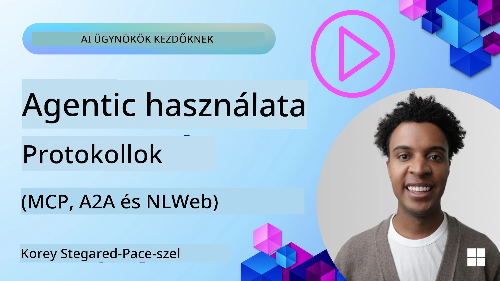
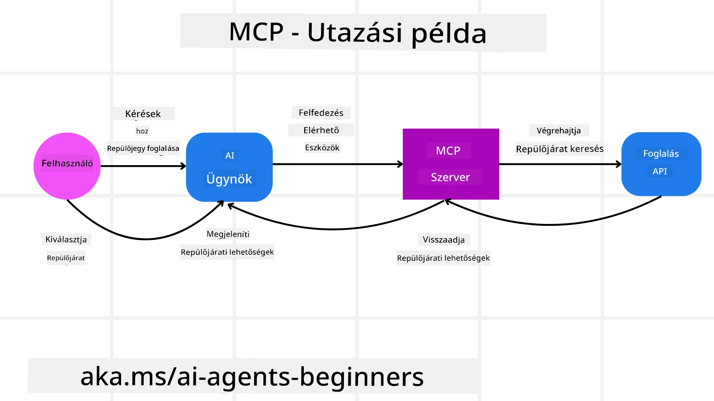
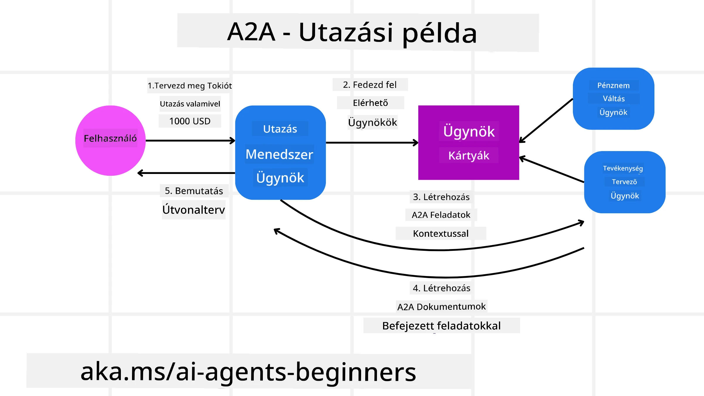
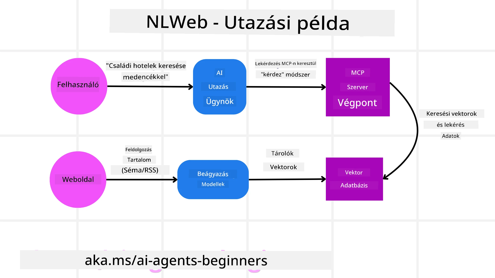

# Ügynöki protokollok használata (MCP, A2A és NLWeb)

> _(Kattintson a fenti képre a lecke videójának megtekintéséhez)_

Az AI ügynökök használatának növekedésével egyre nagyobb igény van olyan protokollokra, amelyek szabványosítást, biztonságot és nyílt innovációt támogatnak. Ebben a leckében három protokollt vizsgálunk meg, amelyek ezt az igényt próbálják kielégíteni – a Model Context Protocol-t (MCP), az Agent to Agent-et (A2A) és a Natural Language Web-et (NLWeb).

## Bevezetés

Ebben a leckében megtanuljuk:

• Hogyan teszi lehetővé az **MCP**, hogy az AI ügynökök külső eszközökhöz és adatokhoz férjenek hozzá a felhasználói feladatok elvégzéséhez.

• Hogyan engedi meg az **A2A**, hogy különböző AI ügynökök kommunikáljanak és együttműködjenek.

• Hogyan hoz létre az **NLWeb** természetes nyelvi felületeket bármely weboldalhoz, lehetővé téve az AI ügynökök számára a tartalom felfedezését és interakcióját.

## Tanulási célok

• Felismerni az MCP, az A2A és az NLWeb alapvető célját és előnyeit az AI ügynökök kontextusában.

• Elmagyarázni, hogyan segítik elő ezek a protokollok az LLM-ek, eszközök és más ügynökök közötti kommunikációt és interakciót.

• Felismerni, hogy az egyes protokollok milyen különböző szerepet töltenek be összetett ügynöki rendszerek kialakításában.

## Model Context Protocol

A **Model Context Protocol (MCP)** egy nyílt szabvány, amely szabványosított módot biztosít az alkalmazások számára, hogy kontextust és eszközöket szolgáltassanak LLM-ek számára. Ez lehetővé tesz egy "univerzális adaptert" különféle adatforrásokhoz és eszközökhöz, amelyekhez az AI ügynökök következetes módon csatlakozhatnak.

Nézzük meg az MCP összetevőit, az előnyeit a közvetlen API használathoz képest, és egy példát arra, hogyan használhatnak AI ügynökök egy MCP szervert.

### MCP alapvető összetevői

Az MCP egy **kliens-szerver architektúrán** működik, és az alapvető összetevők:

• **Hostok**: ezek LLM alkalmazások (például egy kódszerkesztő, mint a VSCode), amelyek elindítják a kapcsolatokat egy MCP szerverhez.

• **Kliens komponensek**: a host alkalmazáson belül, amelyek egy-egy kapcsolatot tartanak fenn a szerverrel.

• **Szerverek**: könnyű programok, amelyek meghatározott képességeket tesznek elérhetővé.

A protokoll három alapvető primitívet foglal magában, amelyek az MCP szerver képességei:

• **Eszközök (Tools)**: Ezek különálló műveletek vagy funkciók, amelyeket egy AI ügynök meghívhat egy művelet végrehajtására. Például egy időjárási szolgáltatás kínálhat egy „időjárás lekérdezése” eszközt, vagy egy e-kereskedelmi szerver „termék vásárlása” eszközt. Az MCP szerverek minden eszköz nevét, leírását és bemeneti/kimeneti sémáját meghirdetik képességeik listájában.

• **Erőforrások (Resources)**: Ezek olvasható adatelemek vagy dokumentumok, amelyeket az MCP szerver biztosít, és amelyeket a kliensek igény szerint lekérhetnek. Példák: fájl tartalmak, adatbázis rekordok vagy naplófájlok. Erőforrások lehetnek szövegesek (például kód vagy JSON) vagy binárisak (képek vagy PDF-ek).

• **Kérések (Prompts)**: Előre definiált sablonok, amelyek javasolt felhívásokat tartalmaznak, lehetővé téve összetettebb munkafolyamatokat.

### MCP előnyei

Az MCP jelentős előnyöket kínál AI ügynökök számára:

• **Dinamikus eszköz felderítés**: Az ügynökök dinamikusan megkapják egy szerver eszközlistáját és azok leírását. Ez ellentétben áll a hagyományos API-kkal, amelyek gyakran statikus kódolást igényelnek az integrációhoz, így bármilyen API változás kódfrissítést tesz szükségessé. Az MCP egyszeri integrálást kínál, ami nagyobb alkalmazkodóképességet jelent.

• **Interoperabilitás különböző LLM-ek között**: Az MCP működik különféle LLM-ekkel, lehetővé téve, hogy az alapmodell könnyen cserélhető legyen jobb teljesítmény érdekében.

• **Szabványosított biztonság**: Az MCP tartalmaz egy szabványos hitelesítési módszert, ami megkönnyíti a skálázást, amikor több MCP szerverhez akarunk hozzáférést adni. Ez egyszerűbb, mint különböző kulcsokat és hitelesítési típusokat kezelni különféle API-k esetén.

### MCP példa

Tegyük fel, hogy egy felhasználó szeretne repülőjegyet foglalni egy MCP által működtetett AI asszisztenssel.

1. **Kapcsolódás**: Az AI asszisztens (az MCP kliens) csatlakozik egy MCP szerverhez, amelyet egy légitársaság biztosít.

2. **Eszköz felderítés**: A kliens megkérdezi a légitársaság MCP szerverét: „Milyen eszközök állnak rendelkezésre?” A szerver olyan eszközöket válaszol, mint a „járat keresése” és „járat foglalása”.

3. **Eszköz meghívás**: A felhasználó megkéri az AI asszisztenst: „Kérlek, keress egy járatot Portlandből Honoluluba.” Az AI asszisztens LLM-je azonosítja, hogy a „járat keresése” eszközt kell meghívni, és átadja a megfelelő paramétereket (indulás, célállomás) az MCP szervernek.

4. **Végrehajtás és válasz**: Az MCP szerver, mint csomagoló, végrehajtja a tényleges hívást a légitársaság belső foglalási API-jához. Ezután megkapja a repülőjáratok adatait (például JSON formátumban), és visszaküldi az AI asszisztensnek.

5. **További interakció**: Az AI asszisztens bemutatja a járatválasztékot. Amikor a felhasználó kiválaszt egy járatot, az asszisztens meghívhatja ugyanazon MCP szerveren a „járat foglalása” eszközt, befejezve a foglalást.

## Agent-to-Agent protokoll (A2A)

Míg az MCP az LLM-ek és eszközök összekapcsolására fókuszál, az **Agent-to-Agent (A2A) protokoll** továbblép, lehetővé téve a kommunikációt és együttműködést különböző AI ügynökök között. Az A2A összeköti az AI ügynököket különböző szervezetek, környezetek és technológiai platformok között, hogy közös feladatot hajtsanak végre.

Megvizsgáljuk az A2A összetevőit és előnyeit, valamint egy példát arra, hogyan alkalmazható a mi utazási alkalmazásunkban.

### A2A alapvető összetevői

Az A2A a kommunikáció lehetővé tételére és arra összpontosít, hogy az ügynökök együtt dolgozzanak egy alfeladat elvégzésén a felhasználó számára. Minden protokoll komponens hozzájárul ehhez:

#### Agent Card (Ügynök kártya)

Hasonlóan ahhoz, ahogy az MCP szerver megoszt egy eszközlistát, az Agent Card tartalmazza:

- Az ügynök nevét.

- Egy **általános feladatok leírását**, amelyeket teljesít.

- Egy **specifikus képességek listáját** leírásokkal, hogy más ügynökök (vagy akár emberi felhasználók) megértsék, mikor és miért kellene az adott ügynököt hívni.

- Az ügynök **aktuális végpont URL-jét**.

- Az ügynök **verzióját** és **képességeit**, például streaming válaszokat és push értesítéseket.

#### Agent Executor (Ügynök végrehajtó)

Az Agent Executor felelős azért, hogy **átadja a felhasználói beszélgetés kontextusát a távoli ügynöknek**; a távoli ügynöknek erre szüksége van, hogy megértse a feladatot. Egy A2A szerveren az ügynök a saját nagy nyelvi modelljét (LLM) használja a beérkező kérések feldolgozására és a feladatok végrehajtására a saját belső eszközeivel.

#### Artifact (Műtermék)

Miután egy távoli ügynök befejezte a kért feladatot, a munkája műtermékként jön létre. A műtermék **tartalmazza az ügynök munkájának eredményét**, **leírást arról, hogy mit fejeztek be**, és a **szöveges kontextust**, amely a protokollon keresztül továbbításra kerül. Miután a műterméket elküldték, a kapcsolat a távoli ügynökkel lezárul, amíg ismét szükség nem lesz rá.

#### Event Queue (Esemény sor)

Ez az összetevő a **frissítések kezelésére és az üzenetküldésre szolgál**. Különösen fontos a termelési környezetben az ügynöki rendszerek számára, hogy megelőzzék a kapcsolatok bezáródását a feladat befejezése előtt, különösen akkor, ha a feladatok befejezése hosszabb időt vesz igénybe.

### A2A előnyei

• **Fokozott együttműködés**: Lehetővé teszi, hogy különböző eladóktól és platformokról származó ügynökök kommunikáljanak, megosszák a kontextust, és együtt dolgozzanak, megkönnyítve a zökkenőmentes automatizálást korábban elszigetelt rendszerek között.

• **Modell választási rugalmasság**: Minden A2A ügynök maga döntheti el, hogy melyik LLM-et használja kérésének kiszolgálására, lehetővé téve az egyes ügynökök optimalizált vagy finomhangolt modelljeit, ellentétben az MCP egyetlen LLM kapcsolatával.

• **Beépített hitelesítés**: A hitelesítés közvetlenül az A2A protokollba van integrálva, így erős biztonsági keretet nyújt az ügynöki interakciókhoz.

### A2A példa

Nézzük meg az utazási foglalási forgatókönyvünket kiterjesztve, de ezúttal az A2A-t használva.

1. **Felhasználói kérés a többügynökös rendszerhez**: A felhasználó egy „Utazási Ügynök” A2A klienshez/ügynökhöz fordul, például azt mondva: „Kérlek, foglalj le egy teljes utat Honoluluba jövő hétre, beleértve a repülőjáratokat, szállodát és bérautót”.

2. **Az Utazási Ügynök koordinálása**: Az Utazási Ügynök megkapja ezt az összetett kérést. Az LLM-jét használja, hogy átgondolja a feladatot, és meghatározza, hogy más, speciális ügynökökkel kell együttműködnie.

3. **Ügynökök közötti kommunikáció**: Az Utazási Ügynök az A2A protokollt használva kapcsolódik további ügynökökhöz, mint például a „Légitársaság Ügynök”, a „Szállodai Ügynök” és a „Bérautó Ügynök”, amelyeket különböző cégek hoztak létre.

4. **Feladat delegálása**: Az Utazási Ügynök konkrét feladatokat küld ezeknek a speciális ügynököknek (például: „Keress repülőjáratokat Honoluluba,” „Foglalj szállodát,” „Bérelj autót”). Ezek a speciális ügynökök saját LLM-jeikkel dolgoznak, és a saját eszközeiket használják (amelyek akár maguk is MCP szerverek lehetnek), saját részfeladatukat végrehajtva.

5. **Összesített válasz**: Miután minden downstream ügynök befejezte a feladatát, az Utazási Ügynök összeállítja az eredményeket (járatinformációk, szállodai visszaigazolás, autóbérlés), majd egy átfogó, csevegőszerű választ küld vissza a felhasználónak.

## Natural Language Web (NLWeb)

A weboldalak régóta az elsődleges módjai a felhasználók számára, hogy információkhoz és adatokhoz férjenek hozzá az interneten.

Nézzük meg az NLWeb különböző összetevőit, előnyeit és egy példát arra, hogyan működik az NLWeb az utazási alkalmazásunk esetében.

### Az NLWeb összetevői

- **NLWeb alkalmazás (Core Service Code)**: Az a rendszer, amely a természetes nyelvű kérdéseket dolgozza fel. Összekapcsolja a platform különböző részeit a válaszok létrehozásához. Gondolhatunk rá úgy, mint a **motorra, amely a weboldal természetes nyelvi funkcióit működteti**.

- **NLWeb protokoll**: Ez egy **alapvető szabálykészlet a természetes nyelvű interakcióhoz** egy weboldallal. JSON formátumban küld vissza válaszokat (gyakran Schema.org használatával). Célja, hogy egyszerű alapot teremtsen az „AI Webnek”, ugyanúgy, ahogy a HTML lehetővé tette dokumentumok megosztását online.

- **MCP szerver (Model Context Protocol végpont)**: Minden NLWeb telepítés egyben **MCP szerverként** is működik. Ez azt jelenti, hogy eszközöket (például az „ask” metódust) és adatokat tud megosztani más AI rendszerekkel. Gyakorlatban ez lehetővé teszi, hogy a weboldal tartalma és képességei AI ügynökök számára használhatók legyenek, és a webhely a szélesebb „ügynök ökoszisztéma” részévé váljon.

- **Beágyazó modellek (Embedding Models)**: Ezeket a modelleket arra használják, hogy a weboldal tartalmát számszerű reprezentációvá, úgynevezett vektorokká (embedding) alakítsák. Ezek a vektorok a jelentést rögzítik oly módon, hogy a számítógépek összehasonlíthatják és kereshetnek bennük. Egy különleges adatbázisban tárolják őket, és a felhasználók választhatnak, melyik embedding modellt szeretnék használni.

- **Vektoradatbázis (keresési mechanizmus)**: Ez az adatbázis tárolja a weboldal tartalmának embeddingjeit. Amikor valaki kérdést tesz fel, az NLWeb megnézi a vektoradatbázist, hogy gyorsan megtalálja a legrelevánsabb információkat. Egy gyors listát ad lehetséges válaszokról, hasonlóság alapján rangsorolva. Az NLWeb különböző vektortároló rendszerekkel működik együtt, mint a Qdrant, Snowflake, Milvus, Azure AI Search és Elasticsearch.

### NLWeb példa

Nézzük újra az utazási foglaló weboldalunkat, amely most NLWeb segítségével működik.

1. **Adatbetöltés**: Az utazási weboldal meglévő termékkatalógusait (például járatlista, szállodaleírások, túracsomagok) Schema.org formátumban vagy RSS feedeken keresztül töltik be. Az NLWeb eszközei betöltik ezt a strukturált adatot, létrehozzák az embeddingeket, és tárolják egy helyi vagy távoli vektoradatbázisban.

2. **Természetes nyelvű kérdés (ember)**: Egy felhasználó meglátogatja az oldalt, és a menük navigálása helyett a csevegőfelületen beírja: „Találj egy családbarát szállodát Honoluluban medencével a jövő hétre.”

3. **NLWeb feldolgozás**: Az NLWeb alkalmazás megkapja ezt a kérdést. A kérdést elküldi egy LLM-nek értelmezésre, miközben párhuzamosan megkeresi a legrelevánsabb szállodai listákat a vektoradatbázisában.

4. **Pontosságos eredmények**: Az LLM segít értelmezni az adatbázisból jövő keresési eredményeket, azonosítja a legjobb egyezéseket a „családbarát”, „medence” és „Honolulu” kritériumok alapján, majd természetes nyelvű választ formáz. Fontos, hogy a válasz tényleges szállodákat említ az oldal katalógusából, kerülve a kitalált információt.

5. **AI Ügynöki interakció**: Mivel az NLWeb MCP szerverként is működik, egy külső AI utazási ügynök is csatlakozhat az NLWeb példányhoz ezen a weboldalon. Az AI ügynök az `ask` MCP metódust használhatja a webhely közvetlen lekérdezésére: `ask("Vannak-e vegan-barát éttermek Honoluluban, amiket a szálloda ajánl?")`. Az NLWeb példány ezt feldolgozza, kihasználva az éttermi adatbázisát (ha betöltötték), és strukturált JSON választ ad vissza.

### További kérdése van az MCP/A2A/NLWeb témában?

Csatlakozzon a [Microsoft Foundry Discord](https://aka.ms/ai-agents/discord) közösséghez, hogy más tanulókkal találkozzon, részt vegyen irodai órákon és megválaszoltassa AI ügynökeivel kapcsolatos kérdéseit.

## Források

- [MCP kezdőknek](https://aka.ms/mcp-for-beginners)  
- [MCP dokumentáció](https://learn.microsoft.com/python/api/overview/azure/ai-projects-readme)
- [NLWeb tárház](https://github.com/nlweb-ai/NLWeb)
- [Microsoft Agent Framework](https://aka.ms/ai-agents-beginners/agent-framewrok)

---

<!-- CO-OP TRANSLATOR DISCLAIMER START -->
**Felelősségkizárás**:
Ez a dokumentum az AI fordító szolgáltatás, a [Co-op Translator](https://github.com/Azure/co-op-translator) segítségével készült. Bár a pontosságra törekszünk, kérjük, vegye figyelembe, hogy az automatikus fordítások hibákat vagy pontatlanságokat tartalmazhatnak. Az eredeti dokumentum a saját nyelvén tekintendő hiteles forrásnak. Kritikus információk esetén szakmai emberi fordítást javasolunk. Nem vállalunk felelősséget semmilyen félreértésért vagy félreértelmezésért, amely ebből a fordításból származik.
<!-- CO-OP TRANSLATOR DISCLAIMER END -->