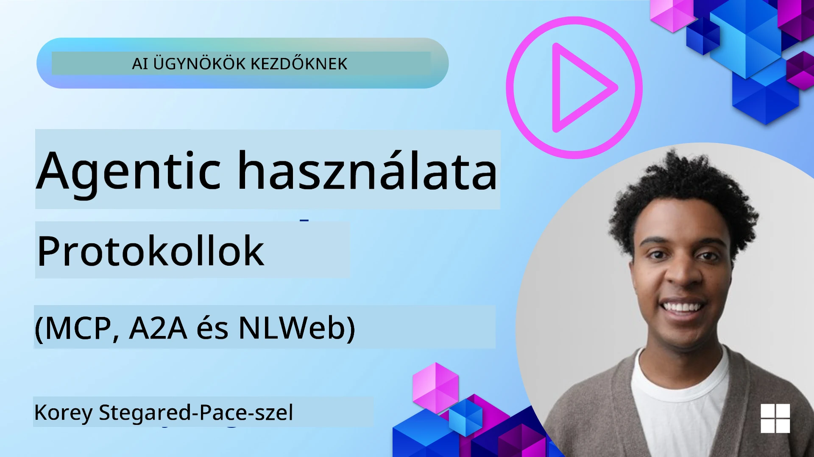
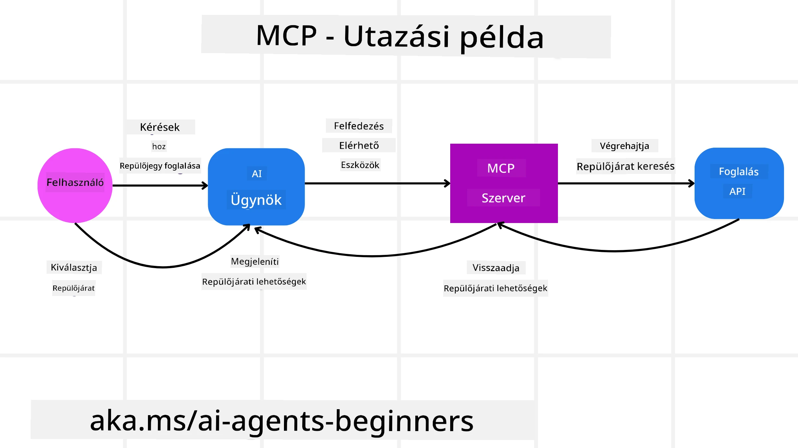
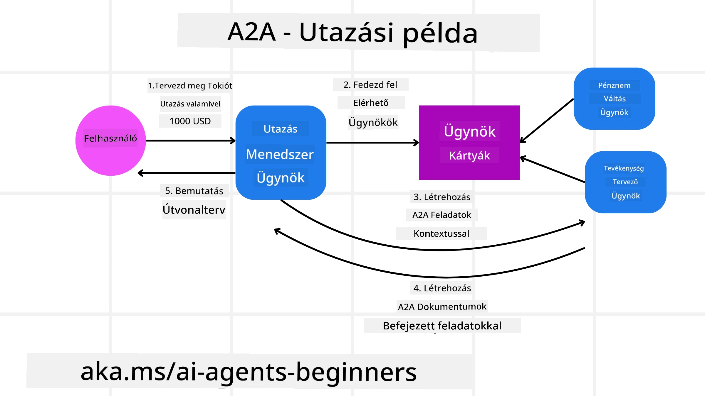
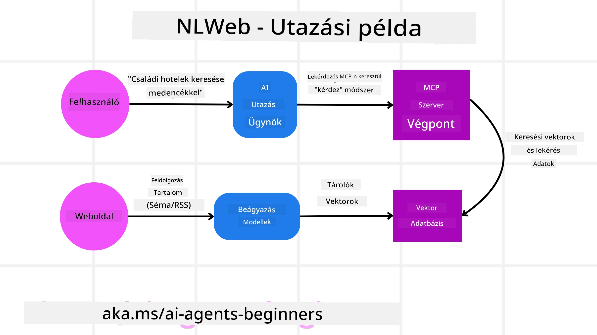

# Ügynöki protokollok használata (MCP, A2A és NLWeb)

> _(Kattintson a fenti képre a lecke videójának megtekintéséhez)_

Ahogy az MI ügynökök használata növekszik, úgy növekszik az igény az olyan protokollokra, amelyek biztosítják a szabványosítást, a biztonságot és támogatják a nyílt innovációt. Ebben a leckében három protokollt fogunk bemutatni, amelyek ezt az igényt kívánják kielégíteni – a Model Context Protocol-t (MCP), az Agent to Agent-et (A2A) és a Natural Language Web-et (NLWeb).

## Bevezetés

Ebben a leckében a következőkről lesz szó:

• Hogyan teszi lehetővé az **MCP**, hogy az MI ügynökök külső eszközökhöz és adatokhoz férjenek hozzá a felhasználói feladatok elvégzéséhez.

• Hogyan teszi lehetővé az **A2A** a kommunikációt és együttműködést különböző MI ügynökök között.

• Hogyan hoz létre az **NLWeb** természetes nyelvű felületeket bármely weboldalon, lehetővé téve az MI ügynökök számára a tartalom felfedezését és interakcióját.

## Tanulási célok

• Az MCP, A2A és NLWeb fő céljainak és előnyeinek **azonosítása** az MI ügynökök kontextusában.

• Megértése, hogy az egyes protokollok hogyan segítik elő a kommunikációt és interakciót LLM-ek, eszközök és más ügynökök között.

• Az egyes protokollok eltérő szerepeinek **felismerése** összetett ügynöki rendszerek építésében.

## Model Context Protocol

A **Model Context Protocol (MCP)** egy nyílt szabvány, amely egységes módot biztosít a különböző alkalmazásoknak arra, hogy kontextust és eszközöket szolgáltassanak az LLM-eknek. Ez lehetővé teszi, hogy egy „univerzális adapter” különféle adatforrásokhoz és eszközökhöz csatlakozzon következetes módon az MI ügynökök számára.

Nézzük meg az MCP összetevőit, az előnyeit a közvetlen API használathoz képest, valamint egy példát arra, hogyan használhatják az MI ügynökök az MCP szervert.

### Az MCP fő összetevői

Az MCP egy **kliens-szerver architektúrán** alapul, és fő összetevői:

• **Hosztok**: Olyan LLM alkalmazások (például egy kódszerkesztő, mint a VSCode), amelyek elindítják a kapcsolatokat az MCP szerverhez.

• **Kliensek**: Olyan komponensek a hoszt alkalmazáson belül, amelyek egy-egy kapcsolatot tartanak fenn a szerverrel.

• **Szerverek**: Könnyű programok, amelyek specifikus képességeket tesznek elérhetővé.

A protokoll három fő primitívet tartalmaz, amelyek az MCP szerver képességei:

• **Eszközök**: Ezek különálló műveletek vagy funkciók, amelyeket egy MI ügynök hívhat meg egy akció végrehajtásához. Például egy időjárás-szolgáltatás kínálhat egy „időjárás lekérése” eszközt, vagy egy e-kereskedelmi szerver egy „termék vásárlása” eszközt. Az MCP szerverek a képességlistájukban hirdetik az eszközök nevét, leírását és bemeneti/kimeneti sémáját.

• **Erőforrások**: Ezek olvasható adatelemek vagy dokumentumok, amelyeket az MCP szerver adhat, és amelyeket a kliensek igény szerint lekérdezhetnek. Példák: fájl tartalmak, adatbázis rekordok vagy naplófájlok. Az erőforrás lehet szöveges (pl. kód vagy JSON) vagy bináris (pl. képek vagy PDF-ek).

• **Promptok**: Ezek előre meghatározott sablonok, amelyek javasolt promptokat tartalmaznak, lehetővé téve bonyolultabb munkafolyamatokat.

### Az MCP előnyei

Az MCP jelentős előnyöket kínál az MI ügynökök számára:

• **Dinamikus eszközfelfedezés**: Az ügynökök dinamikusan kaphatnak listát a rendelkezésre álló eszközökről egy szervertől, azok leírásaival együtt. Ez eltér a hagyományos API-któl, amelyek általában statikus kódolást igényelnek az integrációkhoz, tehát bármilyen API-változás kódfrissítést tesz szükségessé. Az MCP egy „egyszeri integráció” megközelítést kínál, ami nagyobb alkalmazkodóképességet eredményez.

• **Interoperabilitás különböző LLM-ek között**: Az MCP különböző LLM-ek között is működik, rugalmasságot adva a modellcserére a jobb teljesítmény érdekében.

• **Szabványos biztonság**: Az MCP tartalmaz egy szabványos hitelesítési módszert, amely javítja a skálázhatóságot, amikor további MCP szerverekhez férnek hozzá. Ez egyszerűbb, mint különféle kulcsok és hitelesítési típusok kezelése különböző hagyományos API-knál.

### MCP példa

Képzeljünk el egy felhasználót, aki egy MCP által működtetett MI asszisztens segítségével repülőjegyet szeretne foglalni.

1. **Kapcsolat**: Az MI asszisztens (az MCP kliens) csatlakozik egy MCP szerverhez, amelyet egy légitársaság üzemeltet.

2. **Eszközfelderítés**: A kliens megkérdezi a légitársaság MCP szerverét: „Milyen eszközök állnak rendelkezésre?” A szerver válaszként eszközöket ad vissza, mint például „járatok keresése” és „járatok foglalása”.

3. **Eszköz meghívása**: Ezután a felhasználó megkérdezi az MI asszisztenst: „Kérlek, keress egy járatot Portland és Honolulu között.” Az MI asszisztens a saját LLM-jét használva felismeri, hogy a „járatok keresése” eszközt kell meghívnia, és átadja a releváns paramétereket (indulási hely, célállomás) az MCP szervernek.

4. **Végrehajtás és válasz**: Az MCP szerver, mint egy csomagoló réteg, a légitársaság belső foglalási API-jához intézi a tényleges hívást. Ezután megkapja a járat adatait (például JSON adatok formájában), és visszaküldi az MI asszisztensnek.

5. **További interakció**: Az MI asszisztens megjeleníti a járat opciókat. Amikor a felhasználó kiválaszt egy járatot, az asszisztens meghívhatja ugyanazon MCP szerveren a „járat foglalása” eszközt, ezzel lezárva a foglalást.

## Ügynök-ügynök protokoll (A2A)

Míg az MCP arra koncentrál, hogy összekapcsolja az LLM-eket az eszközökkel, addig az **Agent-to-Agent (A2A) protokoll** tovább lép azzal, hogy lehetővé teszi a kommunikációt és együttműködést különböző MI ügynökök között. Az A2A összekapcsolja az MI ügynököket különböző szervezetek, környezetek és technológiai stackek között, hogy közös feladatokat teljesítsenek.

Megvizsgáljuk az A2A összetevőit és előnyeit, továbbá egy példát arra, hogy hogyan alkalmazható a mi utazási alkalmazásunkban.

### Az A2A fő összetevői

Az A2A arra fókuszál, hogy lehetővé tegye az ügynökök közötti kommunikációt, és hogy együtt dolgozzanak egy felhasználói alfeladat teljesítésén. A protokoll minden összetevője ehhez járul hozzá:

#### Ügynök kártya

Hasonlóan ahhoz, hogy egy MCP szerver megosztja az eszközök listáját, egy Ügynök kártya tartalmazza:
- Az ügynök nevét.
- Az általa elvégzett általános feladatok **leírását**.
- Egy **specifikus képességek listáját** leírásokkal, hogy más ügynökök (vagy akár emberek) megértsék, mikor és miért akarnák azt az ügynököt hívni.
- Az ügynök **aktuális végpont URL-jét**.
- Az ügynök **verzióját** és **képességeit**, például a folyamatos válaszokat és push értesítéseket.

#### Ügynök végrehajtó

Az Ügynök végrehajtó felel azért, hogy **átadja a felhasználói beszélgetés kontextusát a távoli ügynöknek**, ennek segítségével a távoli ügynök megérti az elvégzendő feladatot. Egy A2A szerveren egy ügynök a saját nagynyelvű modelljét (LLM) használja a bejövő kérések feldolgozására, és saját belső eszközeivel hajtja végre a feladatokat.

#### Artefaktum

Miután a távoli ügynök elvégezte a kért feladatot, annak eredménye egy artefaktumként jön létre. Az artefaktum **tartalmazza az ügynök munkájának eredményét**, a **megvalósított feladat leírását**, és az adott **szöveges kontextust**, amely a protokollon keresztül kerül elküldésre. Az artefaktum elküldése után a kapcsolat a távoli ügynökkel lezárul, amíg újra szükség nem lesz rá.

#### Esemény sor

Ezt az összetevőt az **frissítések kezelésére és üzenetek továbbítására** használják. Különösen fontos a termelési ügynöki rendszerekben, hogy megakadályozza a kapcsolat bezáródását az ügynökök között a feladat befejezése előtt, különösen, ha a feladat teljesítésének ideje hosszabb lehet.

### Az A2A előnyei

• **Fokozott együttműködés**: Lehetővé teszi, hogy különböző gyártók és platformok ügynökei interakcióba lépjenek, megosszák a kontextust és együtt dolgozzanak, elősegítve a zökkenőmentes automatizálást hagyományosan elszigetelt rendszerek között.

• **Modellválasztás rugalmassága**: Minden A2A ügynök eldöntheti, hogy melyik LLM-et használja a kérései kiszolgálására, lehetővé téve az optimalizált vagy finomhangolt modellek alkalmazását ügynökönként, ellentétben az egyetlen LLM csatlakozással néhány MCP forgatókönyvben.

• **Beépített hitelesítés**: A hitelesítés közvetlenül az A2A protokollba van integrálva, erős biztonsági keretet nyújtva az ügynöki interakciókhoz.

### A2A példa

Fejlesszük tovább az utazási foglalási forgatókönyvünket, de ezúttal A2A használatával.

1. **Felhasználói kérés a többügynökös rendszerhez**: Egy felhasználó egy „Utazási Ügynök” A2A klienssel/ügynökkel kommunikál, például így: „Kérlek, foglalj le egy egész utat Honolulu-ba jövő hétre, beleértve a járatokat, egy szállodát és egy bérautót”.

2. **Utazási Ügynök irányítása**: Az Utazási Ügynök megkapja ezt az összetett kérést. A saját LLM-jét használva átgondolja a feladatot, és megállapítja, hogy más, szakosodott ügynökökkel kell együttműködnie.

3. **Ügynökök közötti kommunikáció**: Az Utazási Ügynök az A2A protokollt használva kapcsolódik alsóbb szintű ügynökökhöz, mint például egy „Légi Ügynök”, „Szállodai Ügynök” és „Autóbérlési Ügynök”, amelyeket különféle cégek hoztak létre.

4. **Delegált feladatvégrehajtás**: Az Utazási Ügynök konkrét feladatokat küld ezen szakosodott ügynököknek (pl. „Keress járatokat Honolulu-ba”, „Foglalj szállodát”, „Bérelj autót”). Mindegyik szakosodott ügynök a saját LLM-jét futtatja és az általa használt eszközöket (amelyek akár MCP szerverek is lehetnek), hogy a foglalás adott részét elvégezze.

5. **Összevont válasz**: Miután az összes alsó szintű ügynök befejezte a feladatait, az Utazási Ügynök összeállítja az eredményeket (járat részletei, szállodai visszaigazolás, autóbérlés foglalás) és egy átfogó, csevegőstílusú választ küld vissza a felhasználónak.

## Természetes nyelvű web (NLWeb)

A weboldalak régóta a felhasználók elsődleges eszközei az információk és adatok interneten való eléréséhez.

Tekintsük át az NLWeb különböző összetevőit, az NLWeb előnyeit, valamint egy példát, amely megmutatja hogyan működik az NLWeb az utazási alkalmazásunkban.

### Az NLWeb összetevői

- **NLWeb alkalmazás (mag szolgáltatáskódja)**: Az a rendszer, amely feldolgozza a természetes nyelvű kérdéseket. Összeköti a platform különböző részeit válaszok létrehozásához. Ezt tekinthetjük úgy, mint a **motor, amely a weboldal természetes nyelvű funkcióit hajtja**.

- **NLWeb protokoll**: Ez egy **alapszintű szabálygyűjtemény a természetes nyelvű interakcióhoz** egy weboldallal. JSON formátumban (gyakran Schema.org használatával) küldi vissza a válaszokat. Célja egy egyszerű alap megteremtése az „MI Web” számára, hasonlóan ahhoz, ahogy a HTML lehetővé tette az online dokumentumok megosztását.

- **MCP szerver (Model Context Protocol végpontja)**: Minden NLWeb beállítás egyben **MCP szerverként is működik**. Ez azt jelenti, hogy képes **eszközöket (például „kérdezés” módszert) és adatokat** megosztani más MI rendszerekkel. A gyakorlatban ez azt jelenti, hogy a weboldal tartalma és képességei elérhetővé válnak MI ügynökök számára, és a webhely része lesz a szélesebb „ügynöki ökoszisztémának”.

- **Beágyazó modellek**: Ezeket a modelleket használják arra, hogy a weboldal tartalmát számszerű reprezentációvá, úgynevezett vektorokká alakítsák. Ezek a vektorok olyan jelentést hordoznak, amelyet a számítógépek képesek összehasonlítani és keresni. Ezeket egy speciális adatbázisban tárolják, és a felhasználók választhatják ki, melyik beágyazó modellt szeretnék használni.

- **Vektor adatbázis (lekérdező mechanizmus)**: Ez az adatbázis tárolja a weboldal tartalmának beágyazásait. Amikor valaki kérdést tesz fel, az NLWeb a vektor adatbázist vizsgálja át, hogy gyorsan megtalálja a legrelevánsabb információt. Egy gyors, hasonlóság alapján rangsorolt válaszlistát ad. Az NLWeb különböző vektor tárolórendszerekkel működik, mint például a Qdrant, Snowflake, Milvus, Azure AI Search és Elasticsearch.

### NLWeb példa

Vegyük újra az utazási foglaló weboldalunkat, de ezúttal NLWeb által vezérelve.

1. **Adatfeldolgozás**: Az utazási weboldal meglévő termékkatalógusai (például járatlisták, szállodai leírások, túracsomagok) Schema.org formátumban vagy RSS csatornákon keresztül töltődnek be. Az NLWeb eszközök ezeket a strukturált adatokat beépítik, létrehozzák a beágyazásokat, és tárolják azokat helyi vagy távoli vektor adatbázisban.

2. **Természetes nyelvű lekérdezés (ember)**: Egy felhasználó meglátogatja a weboldalt, és a menük navigálása helyett beírja a csevegőfelületen: „Találj nekem egy családbarát szállodát Honolulu-ban medencével a jövő hétre”.

3. **NLWeb feldolgozás**: Az NLWeb alkalmazás megkapja ezt a lekérdezést. Elküldi azt egy LLM-nek megértés céljából, miközben párhuzamosan keres a vektor adatbázisában a releváns szállodalistákért.

4. **Pontoss eredmények**: Az LLM segít értelmezni az adatbázisból származó találatokat, azonosítani a legjobb egyezéseket a „családbarát”, „medence” és „Honolulu” kritériumok alapján, majd természetes nyelvű választ formáz. Fontos, hogy a válasz tényleges weboldali szállodákra hivatkozik, elkerülve a kitalált információkat.

5. **MI ügynök interakció**: Mivel az NLWeb MCP szerverként működik, egy külső MI utazási ügynök is csatlakozhat ehhez a weboldal NLWeb példányához. Az MI ügynök az `ask` MCP módszert használva közvetlenül lekérdezheti a weboldalt: `ask("Vannak-e vegánbarát éttermek a Honolulu környéken, amelyeket a szálloda ajánl?")`. Az NLWeb ezt feldolgozza, felhasználva az éttermi információk adatbázisát (ha be van töltve), és strukturált JSON választ ad vissza.

### További kérdések az MCP/A2A/NLWeb témában?

Csatlakozzon a [Microsoft Foundry Discord](https://discord.com/invite/ATgtXmAS5D) közösséghez, hogy találkozzon más tanulókkal, részt vegyen konzultációkon, és választ kapjon MI ügynökökkel kapcsolatos kérdéseire.

## Források

- [MCP kezdőknek](https://aka.ms/mcp-for-beginners)  
- [MCP dokumentáció](https://learn.microsoft.com/python/api/overview/azure/ai-projects-readme)
- [NLWeb tároló](https://github.com/nlweb-ai/NLWeb)
- [Microsoft Agent Framework](https://learn.microsoft.com/en-us/agent-framework/overview/?wt.mc_id=youtube_26688_organicsocial_reactor&pivots=programming-language-python)

## Előző lecke

[MI ügynökök a termelésben](../10-ai-agents-production/README.md)

## Következő lecke

[Kontextus-mérnökség MI ügynököknek](../12-context-engineering/README.md)

---

<!-- CO-OP TRANSLATOR DISCLAIMER START -->
**Jogi nyilatkozat**:
Ez a dokumentum az AI fordítási szolgáltatás, a [Co-op Translator](https://github.com/Azure/co-op-translator) segítségével készült. Bár az pontosságra törekszünk, kérjük, vegye figyelembe, hogy az automatikus fordítások hibákat vagy pontatlanságokat tartalmazhatnak. Az eredeti dokumentum az anyanyelvén tekintendő hiteles forrásnak. Fontos információk esetén professzionális emberi fordítást javasolunk. Nem vállalunk felelősséget semmilyen félreértésért vagy téves értelmezésért, amely ebből a fordításból ered.
<!-- CO-OP TRANSLATOR DISCLAIMER END -->