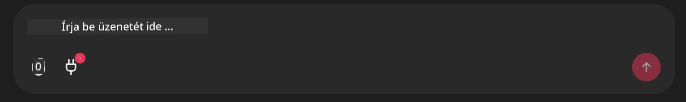

# Github MCP Server Példa

## Leírás

Ez egy demó volt, amelyet az AI Agents Hackathon keretében hoztak létre a Microsoft Reactor által.

Az eszköz célja, hogy javaslatot tegyen hackathon projektekről egy felhasználó Github repóinak alapján.
Ez a következőképpen történik:

1. **Github Agent** - A Github MCP Server használata a repók és az azokkal kapcsolatos információk lekéréséhez.
2. **Hackathon Agent** - A Github Agent adatait felhasználva kreatív hackathon projektötleteket alkot a projektekről, a felhasználó által használt nyelvekről és az AI Agents hackathon projektútvonalairól.
3. **Events Agent** - A hackathon agent javaslata alapján az events agent ajánlja az AI Agent Hackathon sorozat releváns eseményeit.
## A kód futtatása 

### Környezeti változók

Ez a bemutató a Microsoft Agent Frameworköt, az Azure OpenAI Szolgáltatást, a Github MCP Servert és az Azure AI Search-t használja.

Győződj meg róla, hogy a megfelelő környezeti változók be vannak állítva ezen eszközök használatához:

```python
AZURE_AI_PROJECT_ENDPOINT=""
AZURE_AI_MODEL_DEPLOYMENT_NAME=""
AZURE_SEARCH_SERVICE_ENDPOINT=""
AZURE_SEARCH_API_KEY=""
``` 

## A Chainlit szerver indítása

Az MCP szerverhez való kapcsolódáshoz ez a demó a Chainlit-et használja chat interfészként.

A szerver indításához használd a következő parancsot a terminálban:

```bash
chainlit run app.py -w
```

Ez elindítja a Chainlit szerveredet a `localhost:8000` címen, illetve feltölti az Azure AI Search Indexed az `event-descriptions.md` tartalmával.

## Kapcsolódás az MCP szerverhez

A Github MCP Serverhez való kapcsolódáshoz válaszd a "dugasz" ikont a "Írd ide az üzeneted.." chatbox alatt:



Innen kattints a "Connect an MCP" gombra a Github MCP Serverhez való kapcsolódási parancs hozzáadásához:

```bash
npx -y @modelcontextprotocol/server-github --env GITHUB_PERSONAL_ACCESS_TOKEN=[YOUR PERSONAL ACCESS TOKEN]
```

Cseréld ki a "[YOUR PERSONAL ACCESS TOKEN]" részt a saját személyes hozzáférési tokenedre.

A kapcsolódás után egy (1) jelzésnek kell megjelennie a dugasz ikon mellett, ami megerősíti a kapcsolatot. Ha nem jelenik meg, próbáld újraindítani a chainlit szervert a `chainlit run app.py -w` paranccsal.

## A demó használata

A hackathon projektek ajánlására szolgáló ügynök munkafolyamatának elindításához írhatsz egy üzenetet, például:

"Ajánlj hackathon projekteket a Github felhasználónak, koreyspace"

A Router Agent elemezni fogja a kérésedet és megállapítja, hogy melyik ügynökök kombinációja (GitHub, Hackathon és Events) a legmegfelelőbb a lekérdezés kezeléséhez. Az ügynökök együttműködnek, hogy átfogó ajánlásokat nyújtsanak GitHub repó elemzés, projektötlet generálás és releváns tech események alapján.

---

<!-- CO-OP TRANSLATOR DISCLAIMER START -->
**Jogi nyilatkozat**:
Ez a dokumentum az AI fordító szolgáltatás, a [Co-op Translator](https://github.com/Azure/co-op-translator) segítségével készült. Bár az pontosságra törekszünk, kérjük, vegye figyelembe, hogy az automatikus fordítások tartalmazhatnak hibákat vagy pontatlanságokat. Az eredeti dokumentum az anyanyelvén tekintendő hivatalos forrásnak. Kritikus információk esetén szakképzett emberi fordítás igénybevétele javasolt. Nem vállalunk felelősséget az ezen fordítás használatából eredő félreértésekért vagy téves értelmezésekért.
<!-- CO-OP TRANSLATOR DISCLAIMER END -->