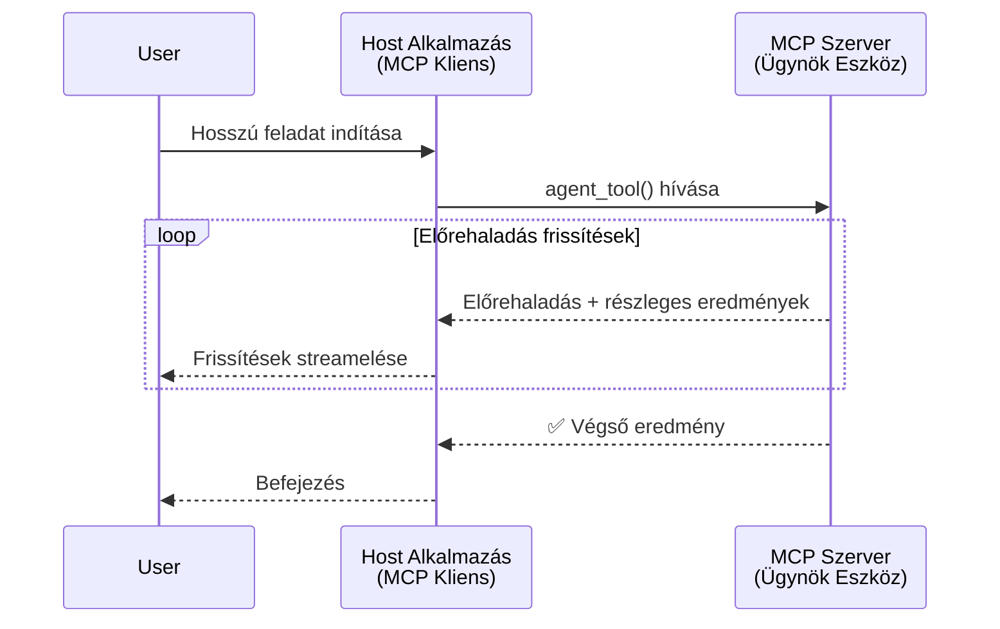
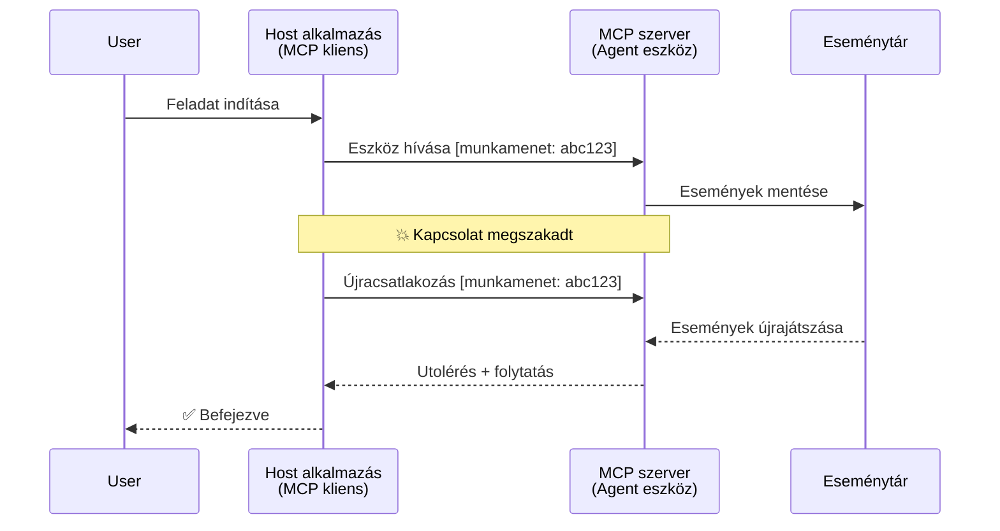
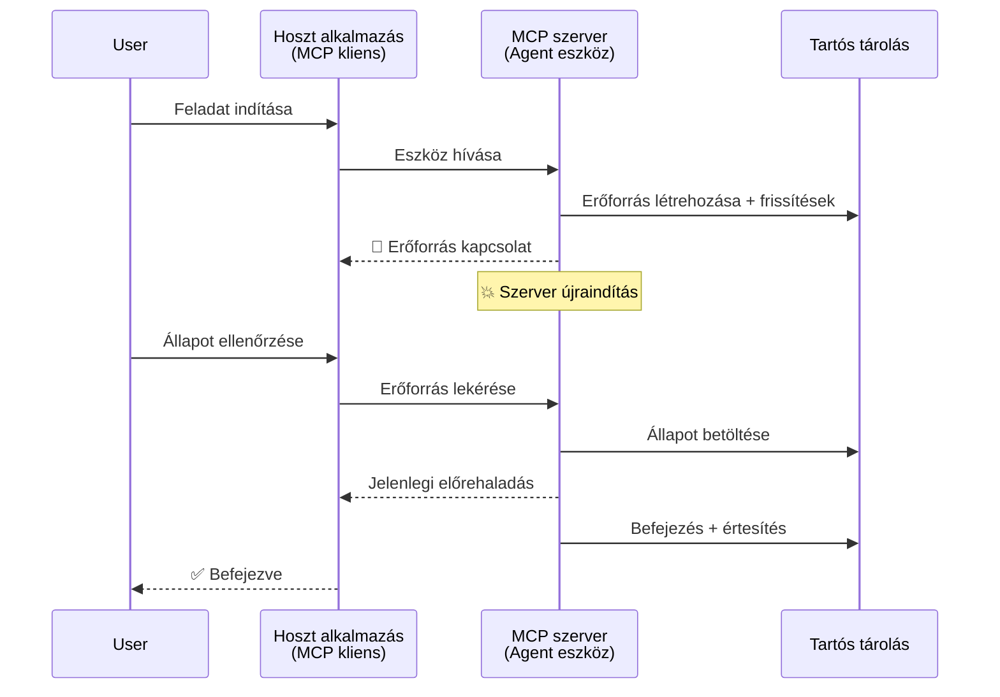
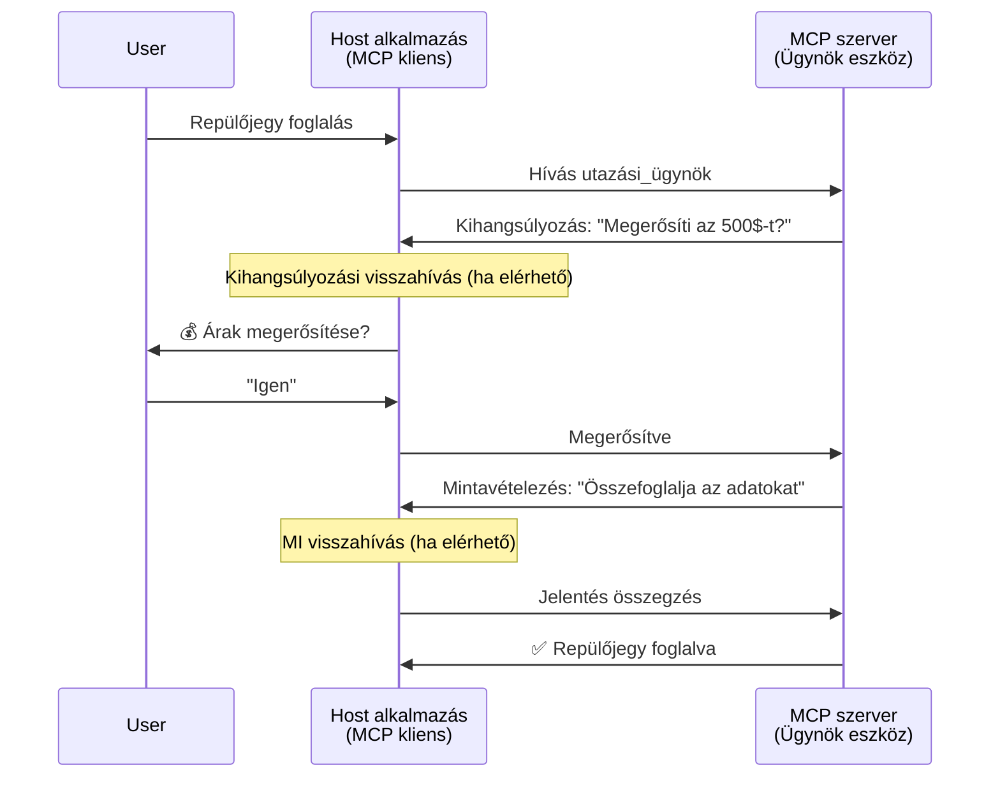
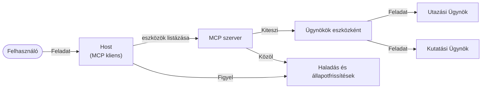

# Ügynök-ügynök közötti kommunikációs rendszerek építése MCP-vel

> Összefoglaló - Építhetsz-e Ügynök2Ügynök Kommunikációt MCP-re? Igen!

Az MCP jelentősen fejlődött az eredeti céljához képest, amely az "LLM-ek számára kontextust biztosítani" volt. A legutóbbi fejlesztések, köztük a [folytatható adatfolyamok](https://modelcontextprotocol.io/docs/concepts/transports#resumability-and-redelivery), [adatbekérés](https://modelcontextprotocol.io/specification/2025-06-18/client/elicitation), [mintavételezés](https://modelcontextprotocol.io/specification/2025-06-18/client/sampling) és értesítések ([előrehaladás](https://modelcontextprotocol.io/specification/2025-06-18/basic/utilities/progress) és [erőforrás](https://modelcontextprotocol.io/specification/2025-06-18/schema#resourceupdatednotification)), az MCP most egy robusztus alapot kínál összetett ügynök-ügynök kommunikációs rendszerek építéséhez.

## Az ügynök/eszköz félreértés

Ahogy egyre több fejlesztő vizsgál eszközöket ügynöki viselkedéssel (hosszú ideig futnak, futás közben további bemenetet igényelhetnek stb.), gyakori félreértés, hogy az MCP nem alkalmas, főként azért, mert korai példák primitív eszközökön egyszerű kérés-válasz mintákra fókuszáltak.

Ez az elképzelés elavult. Az MCP specifikációt az elmúlt néhány hónapban jelentősen bővítették olyan képességekkel, amelyek bezárják a rést a hosszú ideig futó ügynöki viselkedésekhez:

- **Adatfolyam és Részleges Eredmények**: Valós idejű előrehaladás frissítések a végrehajtás közben
- **Folytathatóság**: Az ügyfelek újracsatlakozhatnak és folytathatják a megszakítás után
- **Tartósság**: Az eredmények túlélnek szerver újraindításokat (pl. erőforrás hivatkozásokon keresztül)
- **Többfordulós**: Interaktív bemenet futás közben adatbekérés és mintavételezés révén

Ezek a funkciók összekapcsolhatók összetett ügynöki és multi-ügynök alkalmazások létrehozásához, mind az MCP protokollra építve.

Hivatkozásképpen az ügynököt olyan "eszközként" fogjuk értelmezni, amely egy MCP szerveren elérhető. Ez feltételezi egy hoszt alkalmazás létezését, amely megvalósít egy MCP klienst, amely ülést hoz létre az MCP szerverrel, és képes hívni az ügynököt.

## Mi teszi az MCP eszközt „ügynökké”?

Mielőtt belevágnánk a megvalósításba, tisztázzuk, milyen infrastruktúra-képességek szükségesek a hosszú ideig futó ügynökök támogatásához.

> Egy ügynököt úgy definiálunk, mint egy olyan entitást, amely autonóm módon képes működni hosszabb időn keresztül, komplex feladatokat kezelve, amelyek több interakciót vagy valós idejű visszacsatolás alapján történő módosításokat igényelhetnek.

### 1. Adatfolyam & Részleges eredmények

A hagyományos kérés-válasz minták nem működnek hosszú futású feladatokhoz. Az ügynököknek biztosítaniuk kell:

- Valós idejű előrehaladás frissítéseket
- Köztes eredményeket

**MCP támogatás**: Az erőforrás frissítési értesítések lehetővé teszik a részleges eredmények adatfolyamát, bár ennek gondos tervezés szükséges a JSON-RPC 1:1 kérés/válasz modelljével való ütközések elkerülésére.

| Funkció                    | Használati eset                                                                                                                                                               | MCP támogatás                                                                             |
| -------------------------- | ------------------------------------------------------------------------------------------------------------------------------------------------------------------------------ | ------------------------------------------------------------------------------------------ |
| Valós idejű előrehaladás  | A felhasználó kér egy kódalap migrációs feladatot. Az ügynök folyamatosan jelenti az előrehaladást: "10% - függőségek elemzése... 25% - TypeScript fájlok konvertálása... 50% - Importok frissítése..."          | ✅ Előrehaladási értesítések                                                              |
| Részleges eredmények      | "Könyv generálása" feladat részleges eredményeket sugároz, pl. 1) Történeti ív vázlata, 2) fejezetlista, 3) Minden fejezet kész állapotban. A hoszt bármikor ellenőrizheti, megszakíthatja vagy átirányíthatja. | ✅ Az értesítések „kibővíthetők” részleges eredményekkel, lásd javaslatok a PR 383, 776-on       |

<div align="center" style="font-style: italic; font-size: 0.95em; margin-bottom: 0.5em;">
<strong>1. ábra:</strong> Ez a diagram bemutatja, hogyan sugároz egy MCP ügynök valós idejű előrehaladási frissítéseket és részleges eredményeket a hoszt alkalmazás felé egy hosszú futású feladat közben, lehetővé téve a felhasználó számára a végrehajtás valós idejű figyelését.
</div>



### 2. Folytathatóság

Az ügynököknek kezelniük kell a hálózati megszakításokat zökkenőmentesen:

- Újracsatlakozás (ügyfél) bontás után
- Folytatás onnan, ahol abbahagyták (üzenet újraküldés)

**MCP támogatás**: Az MCP StreamableHTTP szállítás ma támogatja az ülés folytatását és az üzenetek újraküldését ülésazonosítókkal és utolsó eseményazonosítókkal. Fontos megjegyezni, hogy a szervernek egy EventStore-t kell megvalósítania, amely lehetővé teszi az események újbóli lejátszását ügyfél újracsatlakozásakor.  
Érdemes megemlíteni egy közösségi javaslatot (PR #975), amely fókuszál a szállítástól független folytatható adatfolyamokra.

| Funkció      | Használati eset                                                                                                                                                    | MCP támogatás                                                              |
| ------------ | ----------------------------------------------------------------------------------------------------------------------------------------------------------------- | -------------------------------------------------------------------------- |
| Folytathatóság | Az ügyfél megszakad hosszú futású feladat közben. Újracsatlakozás után az ülés folytatódik, és a kihagyott események újra lejátszásra kerülnek, zavartalanul folytatva. | ✅ StreamableHTTP szállítás ülésazonosítókkal, esemény újrajátszással, EventStore-ral |

<div align="center" style="font-style: italic; font-size: 0.95em; margin-bottom: 0.5em;">
<strong>2. ábra:</strong> Ez a diagram azt mutatja be, hogyan teszi lehetővé az MCP StreamableHTTP szállítása és az eseménytár az ülés zökkenőmentes folytatását: ha az ügyfél leszakad, újracsatlakozhat és újrajátszhatja a kihagyott eseményeket, folytatva a feladatot a progresszióvesztés nélkül.
</div>



### 3. Tartósság

Hosszú futású ügynököknek tartós állapotra van szükségük:

- Az eredmények túlélik a szerver újraindítását
- Az állapot kívülről is lekérdezhető
- Előrehaladás követése ülések között

**MCP támogatás**: Az MCP most támogatja az eszközhívások esetén az erőforrás-hivatkozás visszatérési típust. Ma egy lehetséges minta, hogy egy eszköz létrehoz egy erőforrást és azonnal visszaad egy erőforrás-hivatkozást. Az eszköz továbbra is dolgozhat a háttérben a feladaton és frissítheti az erőforrást. Ezzel az ügyfél kérdezheti az erőforrás állapotát részleges vagy teljes eredményekért (attól függően, hogy milyen erőforrás frissítéseket ad a szerver) vagy feliratkozhat az erőforrás frissítési értesítéseire.

Egy korlátozás, hogy az erőforrások lekérdezése vagy a frissítésekre feliratkozás erőforrás-igényes lehet, ami nagy léptékben számít. Van egy nyitott közösségi javaslat (beleértve a #992-t), amely a webhookok vagy triggerelések bevezetését vizsgálja, hogy a szerver értesíteni tudja az ügyfelet/hoszt alkalmazást frissítésekről.

| Funkció    | Használati eset                                                                                                                             | MCP támogatás                                                        |
| ---------- | ----------------------------------------------------------------------------------------------------------------------------------------- | ------------------------------------------------------------------ |
| Tartósság | A szerver összeomlik adat-migrációs feladat közben. Az eredmények és az előrehaladás túlélnek újraindítást. Az ügyfél lekérdezheti az állapotot és folytathatja a tartós erőforrás alapján. | ✅ Erőforrás hivatkozások tartós tárolással és állapot-értesítésekkel |

Ma gyakori minta, hogy egy eszköz létrehoz egy erőforrást és azonnal visszaad egy erőforrás-hivatkozást. Az eszköz a háttérben foglalkozik a feladattal, erőforrás értesítéseket bocsát ki, amelyek előrehaladás frissítések vagy részleges eredmények, és szükség szerint frissíti az erőforrás tartalmát.

<div align="center" style="font-style: italic; font-size: 0.95em; margin-bottom: 0.5em;">
<strong>3. ábra:</strong> Ez a diagram bemutatja, hogyan használnak az MCP ügynökök tartós erőforrásokat és állapot értesítéseket, hogy biztosítsák a hosszú futású feladatok túléljék a szerver újraindításokat, lehetővé téve az ügyfelek számára az előrehaladás ellenőrzését és eredmények lekérését még hibák után is.
</div>



### 4. Többfordulós interakciók

Az ügynököknek gyakran szükségük van további bemenetre futás közben:

- Emberi tisztázás vagy jóváhagyás
- AI segítség komplex döntésekhez
- Dinamikus paraméter beállítás

**MCP támogatás**: Teljes mértékben támogatott az adatbekérés (emberi bemenethez) és mintavételezés (AI bemenethez) révén.

| Funkció                 | Használati eset                                                                                                                                | MCP támogatás                                           |
| ----------------------- | -------------------------------------------------------------------------------------------------------------------------------------------- | ----------------------------------------------------- |
| Többfordulós interakciók | Egy utazási ügynök ármegerősítést kér a felhasználótól, majd AI-t kér az utazási adatok összefoglalására a foglalás véglegesítése előtt.           | ✅ Adatbekérés emberi bemenethez, mintavételezés AI bemenethez |

<div align="center" style="font-style: italic; font-size: 0.95em; margin-bottom: 0.5em;">
<strong>4. ábra:</strong> Ez a diagram szemlélteti, hogyan képesek az MCP ügynökök interaktívan adatbekérést indítani emberi bemenethez vagy AI segítséget kérni futás közben, támogatva összetett, többfordulós munkafolyamatokat, mint például megerősítések és dinamikus döntéshozatalok.
</div>



## Hosszú futású ügynökök megvalósítása MCP-n - Kód áttekintés

Cikkünk részeként biztosítunk egy [kód tárhelyet](https://github.com/victordibia/ai-tutorials/tree/main/MCP%20Agents), amely teljes megvalósítást tartalmaz hosszú futású ügynökök számára, MCP Python SDK-val, StreamableHTTP szállítással az ülés folytatására és üzenet újraküldésre. A megvalósítás bemutatja, hogy az MCP képességek hogyan komponálhatók összetett ügynök-szerű viselkedésekhez.

Konkrétan, egy szervert valósítunk meg két elsődleges ügynök eszközzel:

- **Utazási Ügynök** - Utazási foglalási szolgáltatás szimulálása áramerősítéssel adatbekérés révén
- **Kutatási Ügynök** - Kutatási feladatok végrehajtása AI-által segített összefoglalókkal mintavételezés révén

Mindkét ügynök valós idejű előrehaladás frissítéseket, interaktív megerősítéseket, és teljes ülés folytatási képességeket demonstrál.

### Fontos megvalósítási koncepciók

A következő részek bemutatják a szerveroldali ügynök megvalósítást és az ügyféloldali hoszt kezelést minden képességhez:

#### Adatfolyam & Előrehaladási frissítések - Valós idejű feladat állapot

Az adatfolyam lehetővé teszi, hogy az ügynökök valós idejű frissítéseket adhassanak a hosszú futású feladatok előrehaladásáról, tájékoztatva a felhasználókat a feladat állapotáról és köztes eredményekről.

**Szerver megvalósítás (ügynök előrehaladási értesítéseket küld):**

```python
# A server/server.py-ből - Utazási ügynök, aki előrehaladási frissítéseket küld
for i, step in enumerate(steps):
    await ctx.session.send_progress_notification(
        progress_token=ctx.request_id,
        progress=i * 25,
        total=100,
        message=step,
        related_request_id=str(ctx.request_id)
    )
    await anyio.sleep(2)  # Munka szimulálása

# Alternatíva: Üzenetek naplózása részletes lépésenkénti frissítésekhez
await ctx.session.send_log_message(
    level="info",
    data=f"Processing step {current_step}/{steps} ({progress_percent}%)",
    logger="long_running_agent",
    related_request_id=ctx.request_id,
)
```

**Ügyfél megvalósítás (hoszt előrehaladási frissítéseket fogad):**

```python
# A client/client.py-ból - Ügyfél valós idejű értesítések kezelésére
async def message_handler(message) -> None:
    if isinstance(message, types.ServerNotification):
        if isinstance(message.root, types.LoggingMessageNotification):
            console.print(f"📡 [dim]{message.root.params.data}[/dim]")
        elif isinstance(message.root, types.ProgressNotification):
            progress = message.root.params
            console.print(f"🔄 [yellow]{progress.message} ({progress.progress}/{progress.total})[/yellow]")

# Üzenetkezelő regisztrálása munkamenet létrehozásakor
async with ClientSession(
    read_stream, write_stream,
    message_handler=message_handler
) as session:
```

#### Adatbekérés - Felhasználói bemenet kérése

Az adatbekérés lehetővé teszi, hogy az ügynökök közbeékelt bemenetet kérjenek a felhasználótól a futás során. Ez lényeges megerősítésekhez, tisztázásokhoz vagy jóváhagyásokhoz hosszú futású feladatok közben.

**Szerver megvalósítás (ügynök megerősítést kér):**

```python
# A server/server.py fájlból - Utazási ügynök árajánlat megerősítésének kérése
elicit_result = await ctx.session.elicit(
    message=f"Please confirm the estimated price of $1200 for your trip to {destination}",
    requestedSchema=PriceConfirmationSchema.model_json_schema(),
    related_request_id=ctx.request_id,
)

if elicit_result and elicit_result.action == "accept":
    # Folytassa a foglalással
    logger.info(f"User confirmed price: {elicit_result.content}")
elif elicit_result and elicit_result.action == "decline":
    # Törölje a foglalást
    booking_cancelled = True
```

**Ügyfél megvalósítás (hoszt adatbekérés visszahívás biztosítása):**

```python
# A client/client.py fájlból - Ügyfélkezelés igényfelmérési kérésekhez
async def elicitation_callback(context, params):
    console.print(f"💬 Server is asking for confirmation:")
    console.print(f"   {params.message}")

    response = console.input("Do you accept? (y/n): ").strip().lower()

    if response in ['y', 'yes']:
        return types.ElicitResult(
            action="accept",
            content={"confirm": True, "notes": "Confirmed by user"}
        )
    else:
        return types.ElicitResult(
            action="decline",
            content={"confirm": False, "notes": "Declined by user"}
        )

# Regisztrálja a visszahívást a munkamenet létrehozásakor
async with ClientSession(
    read_stream, write_stream,
    elicitation_callback=elicitation_callback
) as session:
```

#### Mintavételezés - AI segítség igénylése

A mintavételezés lehetővé teszi, hogy az ügynökök AI-hoz forduljanak összetett döntésekhez vagy tartalom generáláshoz futás közben. Ez hibrid ember-AI munkafolyamatokat támogat.

**Szerver megvalósítás (ügynök AI segítséget kér):**

```python
# A server/server.py fájlból - Kutató ügynök AI összefoglalót kér
sampling_result = await ctx.session.create_message(
    messages=[
        SamplingMessage(
            role="user",
            content=TextContent(type="text", text=f"Please summarize the key findings for research on: {topic}")
        )
    ],
    max_tokens=100,
    related_request_id=ctx.request_id,
)

if sampling_result and sampling_result.content:
    if sampling_result.content.type == "text":
        sampling_summary = sampling_result.content.text
        logger.info(f"Received sampling summary: {sampling_summary}")
```

**Ügyfél megvalósítás (hoszt mintavételezés visszahívást biztosít):**

```python
# A client/client.py fájlból - Ügyfél kezelése minta lekérésekhez
async def sampling_callback(context, params):
    message_text = params.messages[0].content.text if params.messages else 'No message'
    console.print(f"🧠 Server requested sampling: {message_text}")

    # Egy valós alkalmazásban ez egy LLM API hívást végezhet
    # Bemutató célokra egy hamis válasz szolgáltatunk
    mock_response = "Based on current research, MCP has evolved significantly..."

    return types.CreateMessageResult(
        role="assistant",
        content=types.TextContent(type="text", text=mock_response),
        model="interactive-client",
        stopReason="endTurn"
    )

# Regisztrálja a visszahívást a munkamenet létrehozásakor
async with ClientSession(
    read_stream, write_stream,
    sampling_callback=sampling_callback,
    elicitation_callback=elicitation_callback
) as session:
```

#### Folytathatóság - Ülés folytonosság megszakítások alatt

A folytathatóság biztosítja, hogy a hosszú futású ügynök feladatok túl tudják élni az ügyfél kapcsolat megszakadását és zökkenőmentesen folytatódjanak újracsatlakozás után. Ezt eseménytárak és folytató tokenek segítségével valósítják meg.

**Eseménytár megvalósítás (szerver tartja az ülés állapotát):**

```python
# A server/event_store.py fájlból - Egyszerű memóriában tárolt eseményraktár
class SimpleEventStore(EventStore):
    def __init__(self):
        self._events: list[tuple[StreamId, EventId, JSONRPCMessage]] = []
        self._event_id_counter = 0

    async def store_event(self, stream_id: StreamId, message: JSONRPCMessage) -> EventId:
        """Store an event and return its ID."""
        self._event_id_counter += 1
        event_id = str(self._event_id_counter)
        self._events.append((stream_id, event_id, message))
        return event_id

    async def replay_events_after(self, last_event_id: EventId, send_callback: EventCallback) -> StreamId | None:
        """Replay events after the specified ID for resumption."""
        # Események keresése az utolsó ismert esemény után és azok lejátszása
        for _, event_id, message in self._events[start_index:]:
            await send_callback(EventMessage(message, event_id))

# A server/server.py fájlból - Eseményraktár átadása a munkamenet-kezelőnek
def create_server_app(event_store: Optional[EventStore] = None) -> Starlette:
    server = ResumableServer()

    # Munkamenet-kezelő létrehozása eseményraktárral a folytatáshoz
    session_manager = StreamableHTTPSessionManager(
        app=server,
        event_store=event_store,  # Az eseményraktár lehetővé teszi a munkamenet folytatását
        json_response=False,
        security_settings=security_settings,
    )

    return Starlette(routes=[Mount("/mcp", app=session_manager.handle_request)])

# Használat: Inicializálás eseményraktárral
event_store = SimpleEventStore()
app = create_server_app(event_store)
```

**Ügyfél metaadatok folytató tokennel (ügyfél újracsatlakozik a tárolt állapot alapján):**

```python
# A client/client.py-ből - Ügyfél folytatása metaadatokkal
if existing_tokens and existing_tokens.get("resumption_token"):
    # A meglévő folytatási token használata ott folytatni, ahol abbahagytuk
    metadata = ClientMessageMetadata(
        resumption_token=existing_tokens["resumption_token"],
    )
else:
    # Callback létrehozása a folytatási token mentésére, amikor megérkezik
    def enhanced_callback(token: str):
        protocol_version = getattr(session, 'protocol_version', None)
        token_manager.save_tokens(session_id, token, protocol_version, command, args)

    metadata = ClientMessageMetadata(
        on_resumption_token_update=enhanced_callback,
    )

# Kérés küldése a folytatási metaadatokkal
result = await session.send_request(
    types.ClientRequest(
        types.CallToolRequest(
            method="tools/call",
            params=types.CallToolRequestParams(name=command, arguments=args)
        )
    ),
    types.CallToolResult,
    metadata=metadata,
)
```

A hoszt alkalmazás helyben kezeli az ülésazonosítókat és folytató tokeneket, lehetővé téve a létező ülésekhez való újracsatlakozást anélkül, hogy elveszítené az előrehaladást vagy az állapotot.

### Kód szervezés

<div align="center" style="font-style: italic; font-size: 0.95em; margin-bottom: 0.5em;">
<strong>5. ábra:</strong> MCP-alapú ügynök rendszer architektúra
</div>



**Fontos fájlok:**

- **`server/server.py`** - Folytatható MCP szerver utazási és kutatási ügynökökkel, amelyek adatbekérést, mintavételezést és előrehaladás frissítéseket demonstrálnak
- **`client/client.py`** - Interaktív hoszt alkalmazás folytatási támogatással, visszahívás kezeléssel és token kezeléssel
- **`server/event_store.py`** - Eseménytár megvalósítása, amely lehetővé teszi az ülés folytatását és az üzenetek újraküldését

## Kiterjesztés multi-ügynök kommunikációra MCP-n

A fenti megvalósítás kiterjeszthető multi-ügynök rendszerekre a hoszt alkalmazás intelligenciájának és hatókörének fejlesztésével:

- **Intelligens feladatbontás**: A hoszt elemzi a komplex felhasználói kéréseket és lebontja azokat részfeladatokra különböző specializált ügynökök számára
- **Többszerveres koordináció**: A hoszt több MCP szerverhez tart fenn kapcsolatot, amelyek különböző ügynök képességeket kínálnak
- **Feladat állapot kezelése**: A hoszt követi a haladást több párhuzamos ügynök feladat között, kezeli a függőségeket és a sorrendet
- **Ellenállóság & Újrapróbálkozás**: A hoszt kezeli a hibákat, megvalósít újrapróbálkozási logikát, és átirányítja a feladatokat, ha ügynökök elérhetetlenné válnak
- **Eredmény szintézis**: A hoszt összeilleszti több ügynök kimeneteit koherens végső eredményekké

A hoszt egy egyszerű ügyfélből intelligens központtá fejlődik, amely koordinálja az elosztott ügynök képességeket ugyanakkor megtartja az MCP protokoll alapját.

## Összefoglalás

Az MCP kibővített képességei - erőforrás értesítések, adatbekérés/mintavételezés, folytatható adatfolyamok és tartós erőforrások - lehetővé teszik az összetett ügynök-ügynök interakciókat miközben megőrzik a protokoll egyszerűségét.

## Kezdés

Készen állsz, hogy saját ügynök2ügynök rendszert építs? Kövesd ezeket a lépéseket:

### 1. Futtasd a demót

```bash
# Indítsa el a szervert eseménytárral a folytatáshoz
python -m server.server --port 8006

# Egy másik terminálban indítsa el az interaktív klienst
python -m client.client --url http://127.0.0.1:8006/mcp
```

**Elérhető parancsok interaktív módban:**

- `travel_agent` - Utazás foglalás ármegerősítéssel adatbekérésen keresztül
- `research_agent` - Kutatási témák AI által támogatott összefoglalókkal mintavételezés révén
- `list` - Minden elérhető eszköz megjelenítése
- `clean-tokens` - Folytató tokenek törlése
- `help` - Részletes parancssúgó megjelenítése
- `quit` - Kilépés az ügyfélből

### 2. Teszteld a folytathatóságot

- Indíts el egy hosszú futású ügynököt (pl. `travel_agent`)
- Megszakítsd az ügyfelet futás közben (Ctrl+C)
- Indítsd újra az ügyfelet - automatikusan folytatja onnan, ahol abbahagyta

### 3. Fedezd fel és bővítsd

- **Fedezd fel a példákat**: Nézd meg ezt a [mcp-agents](https://github.com/victordibia/ai-tutorials/tree/main/MCP%20Agents) gyűjteményt
- **Csatlakozz a közösséghez**: Vegyél részt MCP vitákban a GitHubon
- **Kísérletezz**: Kezdd egy egyszerű hosszú futású feladattal és fokozatosan adj hozzá adatfolyamot, folytathatóságot és multi-ügynök koordinációt

Ez bemutatja, hogyan teszi lehetővé az MCP az intelligens ügynök viselkedéseket miközben megtartja az eszköz-alapú egyszerűséget.

Összességében az MCP protokoll specifikáció gyorsan fejlődik; az olvasót arra ösztönözzük, hogy tekintse át a hivatalos dokumentációs weboldalt a legfrissebb frissítésekért - https://modelcontextprotocol.io/introduction

---

<!-- CO-OP TRANSLATOR DISCLAIMER START -->
**Jogi nyilatkozat**:
Ez a dokumentum az AI fordítási szolgáltatás, a [Co-op Translator](https://github.com/Azure/co-op-translator) segítségével készült. Bár az pontosságra törekszünk, kérjük, vegye figyelembe, hogy az automatikus fordítások hibákat vagy pontatlanságokat tartalmazhatnak. Az eredeti dokumentum az anyanyelvén tekintendő hiteles forrásnak. Fontos információk esetén professzionális emberi fordítást javasolunk. Nem vállalunk felelősséget semmilyen félreértésért vagy téves értelmezésért, amely ebből a fordításból ered.
<!-- CO-OP TRANSLATOR DISCLAIMER END -->