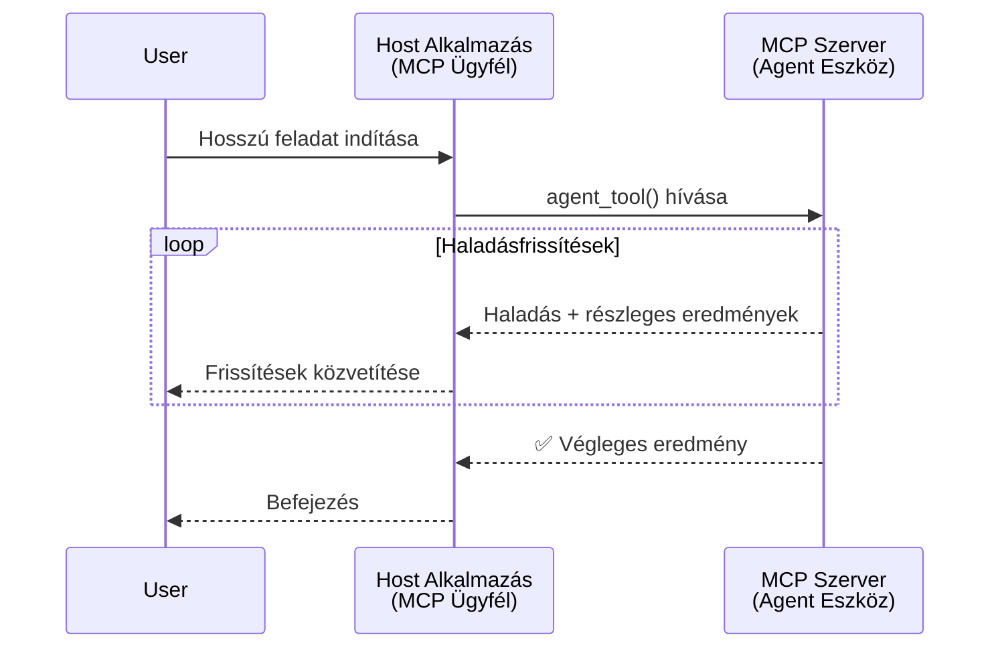
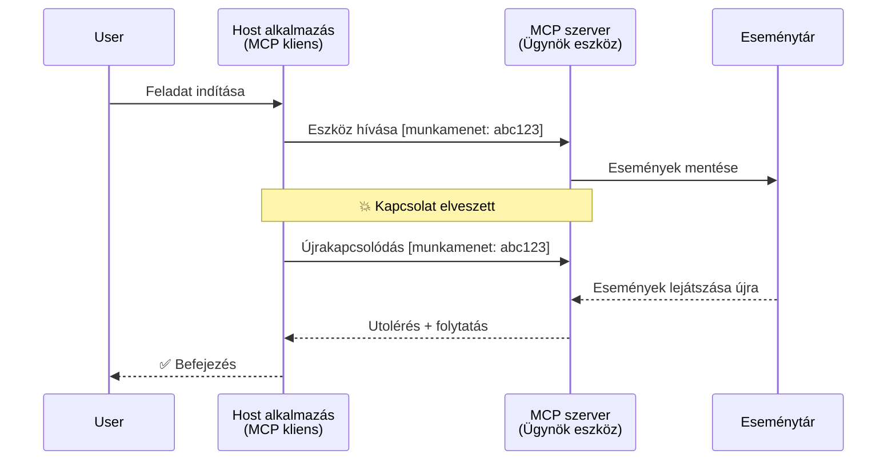
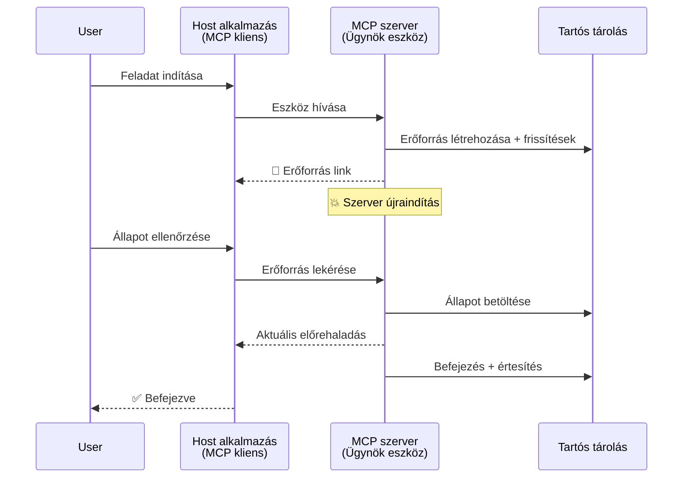
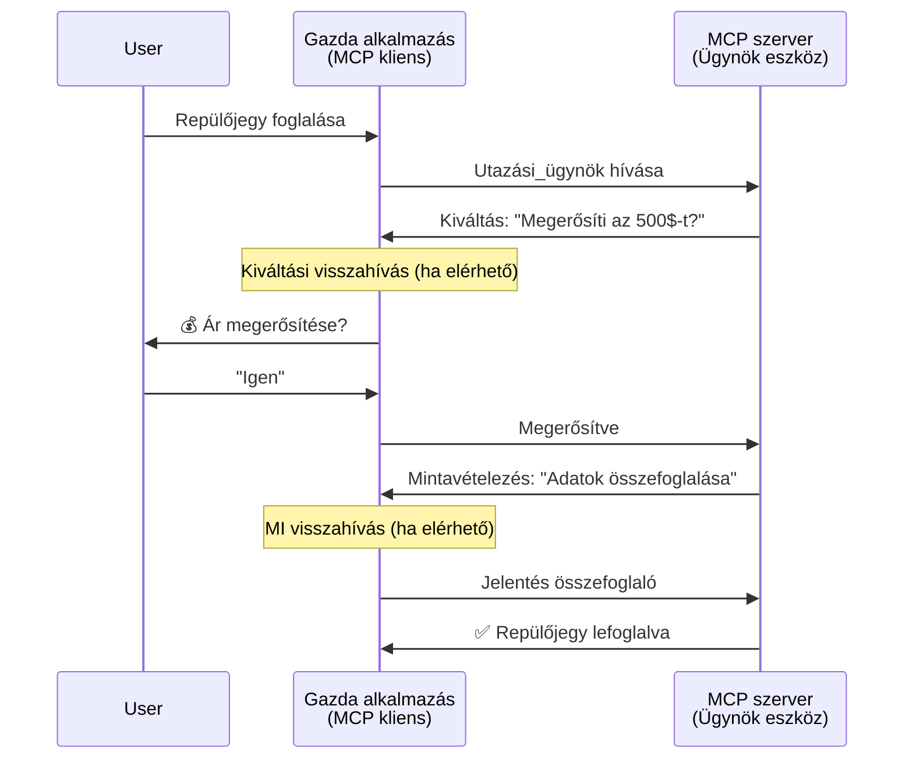

# Ügynök-ügynök közötti kommunikációs rendszerek építése MCP-vel

> Röviden - Építhetsz ügynök2ügynök kommunikációt MCP-n? Igen!

Az MCP jelentősen továbbfejlődött az eredeti céljánál, amely a "kontekstus biztosítása az LLM-ek számára" volt. A legújabb fejlesztések közé tartozik a [folytatható streamek](https://modelcontextprotocol.io/docs/concepts/transports#resumability-and-redelivery), [felszólítás](https://modelcontextprotocol.io/specification/2025-06-18/client/elicitation), [mintavételezés](https://modelcontextprotocol.io/specification/2025-06-18/client/sampling) és értesítések ([előrehaladás](https://modelcontextprotocol.io/specification/2025-06-18/basic/utilities/progress) és [erőforrások](https://modelcontextprotocol.io/specification/2025-06-18/schema#resourceupdatednotification)) támogatásával, így az MCP most egy robusztus alapot nyújt komplex ügynök-ügynök kommunikációs rendszerek építéséhez.

## Az ügynök/eszköz félreértése

Egyre több fejlesztő tanulmányoz olyan eszközöket, amelyek ügynöki viselkedést mutatnak (hosszú ideig futnak, végrehajtás közben további inputot kérhetnek stb.), és egy gyakori tévhit, hogy az MCP alkalmatlan, mert a kezdeti példák eszközei primitíven egyszerű kérés-válasz mintákra fókuszáltak.

Ez az észlelés elavult. Az MCP specifikációt az elmúlt hónapokban jelentősen fejlesztették, olyan képességekkel, amelyek áthidalják a rést hosszú távon futó ügynöki viselkedések támogatásához:

- **Streaming és részleges eredmények**: valós idejű előrehaladás-frissítések a végrehajtás során
- **Folytathatóság**: az ügyfelek újracsatlakozhatnak és folytathatják megszakítás után
- **Tartósság**: az eredmények túlélnek szerver újraindításokat (pl. erőforrás hivatkozások által)
- **Többszörös fordulók**: interaktív bemenet végrehajtás közben felszólítás és mintavételezés segítségével

Ezek a funkciók kombinálhatók komplex ügynöki és több ügynökös alkalmazások lehetővé tételéhez, mind az MCP protokollra építve.

Hivatkozásként az ügynököt "eszközként" fogjuk nevezni, amely elérhető egy MCP szerveren. Ez azt feltételezi, hogy létezik egy host alkalmazás, amely MCP klienst valósít meg, amely munkamenetet hoz létre az MCP szerverrel, és hívni tudja az ügynököt.

## Mi tesz egy MCP eszközt „ügynökké”?

Mielőtt az implementációba merülnénk, tisztázzuk, milyen infrastruktúra képességek szükségesek a hosszú távon futó ügynökök támogatásához.

> Ügynöknek tekintjük azt a lényt, amely autonóm módon képes hosszabb ideig működni, komplex feladatokat kezelve, amelyek több interakciót vagy valós idejű visszacsatolás szerinti igazítást igényelhetnek.

### 1. Streaming és részleges eredmények

A hagyományos kérés-válasz minták nem működnek hosszú távú feladatok esetén. Az ügynököknek biztosítaniuk kell:

- Valós idejű előrehaladás-frissítéseket
- Közbenső eredményeket

**MCP támogatás**: Az erőforrás frissítési értesítések lehetővé teszik a részleges eredmények streamingjét, bár ez alapos tervezést igényel a JSON-RPC 1:1 kérés/válasz modelljének ütközéseinek elkerülésére.

| Funkció                   | Használati eset                                                                                                                                                             | MCP támogatás                                                                            |
| ------------------------- | --------------------------------------------------------------------------------------------------------------------------------------------------------------------------- | ---------------------------------------------------------------------------------------- |
| Valós idejű előrehaladás  | A felhasználó egy kódbázis migrációs feladatot kér. Az ügynök folyamatosan jelzi az előrehaladást: "10% - Függőségek elemzése... 25% - TypeScript fájlok átalakítása... 50% - Import frissítés..." | ✅ Előrehaladási értesítések                                                              |
| Részleges eredmények      | "Könyv generálása" feladat részleges eredményeket streamel, pl. 1) Történetszál vázlat, 2) Fejezetlista, 3) Minden elkészült fejezet. A host bármikor megnézheti, megszakíthatja vagy átirányíthatja. | ✅ Az értesítések „kiterjeszthetők” részleges eredményekkel, lásd PR 383, 776 javaslatokat    |

<div align="center" style="font-style: italic; font-size: 0.95em; margin-bottom: 0.5em;">
<strong>1. ábra:</strong> Ez az ábra bemutatja, hogyan továbbít egy MCP ügynök valós idejű előrehaladási frissítéseket és részleges eredményeket a host alkalmazásnak egy hosszú távon futó feladat során, lehetővé téve a felhasználónak a végrehajtás valós idejű nyomon követését.
</div>



### 2. Folytathatóság

Az ügynököknek udvariasan kezelniük kell a hálózati megszakításokat:

- Újracsatlakozás (ügyfél) bontás után
- Folytatás ott, ahol abbahagyták (üzenet újrakézbesítés)

**MCP támogatás**: Az MCP StreamableHTTP transport ma támogatja a munkamenet folytatást és az üzenet újrakézbesítést munkamenet azonosítókkal és utolsó esemény azonosítókkal. Fontos megjegyezni, hogy a szervernek meg kell valósítania egy EventStore-t, amely lehetővé teszi az események újrajátszását az ügyfél újracsatlakozásakor.  
Érdemes megemlíteni, hogy létezik egy közösségi javaslat (PR #975), amely a transzport-független folytatható streameket vizsgálja.

| Funkció      | Használati eset                                                                                                                                        | MCP támogatás                                                             |
| ------------ | ------------------------------------------------------------------------------------------------------------------------------------------------------- | ------------------------------------------------------------------------- |
| Folytathatóság | Az ügyfél megszakad a hosszú futású feladat során. Újracsatlakozáskor a munkamenet folytatódik, a kihagyott eseményeket újrajátsszák, zökkenőmentesen folytatva az előző állapotot. | ✅ StreamableHTTP szállító munkamenet azonosítókkal, esemény újrajátszással és EventStore-val |

<div align="center" style="font-style: italic; font-size: 0.95em; margin-bottom: 0.5em;">
<strong>2. ábra:</strong> Ez az ábra bemutatja, hogyan teszi lehetővé az MCP StreamableHTTP szállító és az eseménytár a zökkenőmentes munkamenet folytatást: ha az ügyfél megszakad, újracsatlakozhat és újrajátszhatja a kihagyott eseményeket, folytatva a feladatot az előző állapotból.
</div>



### 3. Tartósság

A hosszú futású ügynököknek tartós állapotra van szükségük:

- Az eredmények túlélnek szerver újraindításokat
- Az állapot sávon kívül lekérdezhető
- Előrehaladás nyomon követése több munkameneten keresztül

**MCP támogatás**: Az MCP most támogatja az erőforrás hivatkozás visszatérési típust eszköz hívásokban. Jelenleg a lehetséges minta az, hogy olyan eszközt tervezünk, amely létrehoz egy erőforrást és azonnal visszaad egy erőforrás hivatkozást. Az eszköz a háttérben tovább dolgozhat a feladaton és frissítheti az erőforrást. Az ügyfél pedig dönthet úgy, hogy lekérdezi az erőforrás állapotát részleges vagy teljes eredményekért (attól függően, hogy a szerver milyen erőforrás frissítéseket ad), vagy feliratkozik az erőforrás értesítéseire.

Egy korlátozás, hogy az erőforrások polizása vagy frissítésekre való feliratkozás erőforrásokat fogyaszthat nagy skálán. Van egy nyílt közösségi javaslat (közte a #992), amely webhooks vagy trigger-ek hozzáadásának lehetőségét vizsgálja, amelyeket a szerver hívhat meg a kliens/host alkalmazás értesítésére.

| Funkció    | Használati eset                                                                                                                                         | MCP támogatás                                                     |
| ---------- | ------------------------------------------------------------------------------------------------------------------------------------------------------- | ----------------------------------------------------------------- |
| Tartósság  | A szerver összeomlik adat-migráció közben. Az eredmények és az előrehaladás túlél minden újraindítást, az ügyfél lekérdezheti az állapotot és folytathatja a tárolt erőforrásból. | ✅ Erőforrás linkek tartós tárolással és állapot értesítésekkel   |

Jelenleg egy általános megoldás az, hogy az eszköz létrehoz egy erőforrást, és azonnal visszaad az erőforrás linket. Az eszköz a háttérben feldolgozza a feladatot, erőforrás értesítéseket küld, amelyek az előrehaladást vagy részleges eredményeket közvetítik, és szükség szerint frissíti az erőforrás tartalmát.

<div align="center" style="font-style: italic; font-size: 0.95em; margin-bottom: 0.5em;">
<strong>3. ábra:</strong> Ez az ábra szemlélteti, hogy az MCP ügynökök hogyan használják a tartós erőforrásokat és állapot értesítéseket annak biztosítására, hogy a hosszú távon futó feladatok túléljék a szerver újraindításokat, így az ügyfelek megtekinthetik az előrehaladást és lekérhetik az eredményeket akár kiesés után is.
</div>



### 4. Többszörös Fordulós Interakciók

Az ügynököknek gyakran szükségük van további bemenetre a végrehajtás közben:

- Emberi tisztázás vagy jóváhagyás
- AI segítség összetett döntésekhez
- Dinamikus paraméterállítás

**MCP támogatás**: Teljes mértékben támogatott mintavételezés (AI bemenethez) és felszólítás (emberi bemenethez) által.

| Funkció                 | Használati eset                                                                                                                                    | MCP támogatás                                        |
| ----------------------- | ------------------------------------------------------------------------------------------------------------------------------------------------- | ---------------------------------------------------- |
| Többszörös fordulók     | Utazási foglaló ügynök ár megerősítést kér a felhasználótól, majd AI-től kéri az utazási adatok összefoglalását a foglalás befejezése előtt.        | ✅ Felszólítás emberi bemenethez, mintavételezés AI bemenethez |

<div align="center" style="font-style: italic; font-size: 0.95em; margin-bottom: 0.5em;">
<strong>4. ábra:</strong> Ez az ábra bemutatja, hogyan kérhetnek az MCP ügynökök interaktív módon emberi bemenetet vagy AI segítséget végrehajtás közben, támogatva komplex, többszörös fordulós munkafolyamatokat, mint a megerősítések és dinamikus döntéshozatal.
</div>



## Hosszú Távon Futó Ügynökök Implementálása MCP-n - Kód Áttekintés

A cikk részeként biztosítunk egy [kódtárat](https://github.com/victordibia/ai-tutorials/tree/main/MCP%20Agents), amely egy teljes implementációt tartalmaz hosszú futású ügynökökről az MCP Python SDK-val és StreamableHTTP szállítóval a munkamenet folytatására és üzenet újrakézbesítésre. Az implementáció bemutatja, hogyan lehet az MCP képességeket összekapcsolni kifinomult ügynökszerű viselkedések megvalósításához.

Kifejezetten két fő ügynöki eszközt valósítunk meg a szerveren:

- **Utazási ügynök** - Utazási foglalás szolgáltatás ár megerősítéssel felszólítás útján
- **Kutatási ügynök** - Kutatási feladatok AI segített összefoglalókkal mintavételezés segítségével

Mindkét ügynök bemutat valós idejű előrehaladási frissítéseket, interaktív megerősítéseket és teljes munkamenet folytatási képességeket.

### Kulcs Implementációs Fogalmak

Az alábbi szakaszokban bemutatjuk a szerveroldali ügynök implementációt és a kliensoldali host kezelést minden képességhez:

#### Streaming és előrehaladás-frissítések - valós idejű feladat állapot

A streaming lehetővé teszi az ügynökök számára, hogy valós idejű előrehaladási frissítéseket nyújtsanak hosszú futású feladatok közben, tájékoztatva a felhasználót az állapotról és köztes eredményekről.

**Szerver implementáció (ügynök előrehaladási értesítéseket küld):**

```python
# A szerver/server.py fájlból - Utazási ügynök, aki előrehaladási frissítéseket küld
for i, step in enumerate(steps):
    await ctx.session.send_progress_notification(
        progress_token=ctx.request_id,
        progress=i * 25,
        total=100,
        message=step,
        related_request_id=str(ctx.request_id)
    )
    await anyio.sleep(2)  # Munka szimulálása

# Alternatíva: Üzenetek naplózása részletes lépésenkénti frissítésekhez
await ctx.session.send_log_message(
    level="info",
    data=f"Processing step {current_step}/{steps} ({progress_percent}%)",
    logger="long_running_agent",
    related_request_id=ctx.request_id,
)
```

**Kliens implementáció (host fogad előrehaladási frissítéseket):**

```python
# A client/client.py fájlból - Ügyfél, amely valós idejű értesítéseket kezel
async def message_handler(message) -> None:
    if isinstance(message, types.ServerNotification):
        if isinstance(message.root, types.LoggingMessageNotification):
            console.print(f"📡 [dim]{message.root.params.data}[/dim]")
        elif isinstance(message.root, types.ProgressNotification):
            progress = message.root.params
            console.print(f"🔄 [yellow]{progress.message} ({progress.progress}/{progress.total})[/yellow]")

# Üzenetkezelő regisztrálása a munkamenet létrehozásakor
async with ClientSession(
    read_stream, write_stream,
    message_handler=message_handler
) as session:
```

#### Felszólítás - felhasználói bemenet kérése

A felszólítás lehetővé teszi az ügynökök számára, hogy végrehajtás közben kérjenek felhasználói bemenetet. Ez elengedhetetlen jóváhagyásokhoz, pontosításokhoz vagy megerősítésekhez hosszú futású feladatok alatt.

**Szerver implementáció (ügynök megerősítést kér):**

```python
# A server/server.py-ból - Utazási ügynök árajánlat megerősítését kéri
elicit_result = await ctx.session.elicit(
    message=f"Please confirm the estimated price of $1200 for your trip to {destination}",
    requestedSchema=PriceConfirmationSchema.model_json_schema(),
    related_request_id=ctx.request_id,
)

if elicit_result and elicit_result.action == "accept":
    # Folytatás a foglalással
    logger.info(f"User confirmed price: {elicit_result.content}")
elif elicit_result and elicit_result.action == "decline":
    # A foglalás törlése
    booking_cancelled = True
```

**Kliens implementáció (host biztosít felszólítás visszahívót):**

```python
# A client/client.py fájlból - Kliens kezelése a kikérési kérésekhez
async def elicitation_callback(context, params):
    console.print(f"💬 Server is asking for confirmation:")
    console.print(f"   {params.message}")

    response = console.input("Do you accept? (y/n): ").strip().lower()

    if response in ['y', 'yes']:
        return types.ElicitResult(
            action="accept",
            content={"confirm": True, "notes": "Confirmed by user"}
        )
    else:
        return types.ElicitResult(
            action="decline",
            content={"confirm": False, "notes": "Declined by user"}
        )

# Regisztrálja a visszahívást a munkamenet létrehozásakor
async with ClientSession(
    read_stream, write_stream,
    elicitation_callback=elicitation_callback
) as session:
```

#### Mintavételezés - AI segítség kérése

A mintavételezés lehetővé teszi az ügynököknek, hogy LLM segítséget kérjenek összetett döntésekhez vagy tartalom generáláshoz végrehajtás közben. Ez hibrid ember-AI munkafolyamatokat tesz lehetővé.

**Szerver implementáció (ügynök AI segítséget kér):**

```python
# A server/server.py-ból - Kutató ügynök AI összefoglalót kérve
sampling_result = await ctx.session.create_message(
    messages=[
        SamplingMessage(
            role="user",
            content=TextContent(type="text", text=f"Please summarize the key findings for research on: {topic}")
        )
    ],
    max_tokens=100,
    related_request_id=ctx.request_id,
)

if sampling_result and sampling_result.content:
    if sampling_result.content.type == "text":
        sampling_summary = sampling_result.content.text
        logger.info(f"Received sampling summary: {sampling_summary}")
```

**Kliens implementáció (host biztosít mintavételezési visszahívót):**

```python
# A client/client.py fájlból - Ügyfél kérések mintavételezésének kezelése
async def sampling_callback(context, params):
    message_text = params.messages[0].content.text if params.messages else 'No message'
    console.print(f"🧠 Server requested sampling: {message_text}")

    # Egy valós alkalmazásban ez hívhatna egy LLM API-t
    # Bemutató célokra egy hamis választ biztosítunk
    mock_response = "Based on current research, MCP has evolved significantly..."

    return types.CreateMessageResult(
        role="assistant",
        content=types.TextContent(type="text", text=mock_response),
        model="interactive-client",
        stopReason="endTurn"
    )

# Regisztrálja a visszahívást a munkamenet létrehozásakor
async with ClientSession(
    read_stream, write_stream,
    sampling_callback=sampling_callback,
    elicitation_callback=elicitation_callback
) as session:
```

#### Folytathatóság - munkamenet folytonosság megszakítások után

A folytathatóság biztosítja, hogy a hosszú futású ügynök feladatok túlélhessék az ügyfél kapcsolat bontását, és zökkenőmentesen folytatódjanak újracsatlakozáskor. Ez eseménytár és folytatási tokenek segítségével valósul meg.

**Eseménytár implementáció (szerver tartja a munkamenet állapotát):**

```python
# A server/event_store.py-ből - Egyszerű memóriában tárolt esemény-adattár
class SimpleEventStore(EventStore):
    def __init__(self):
        self._events: list[tuple[StreamId, EventId, JSONRPCMessage]] = []
        self._event_id_counter = 0

    async def store_event(self, stream_id: StreamId, message: JSONRPCMessage) -> EventId:
        """Store an event and return its ID."""
        self._event_id_counter += 1
        event_id = str(self._event_id_counter)
        self._events.append((stream_id, event_id, message))
        return event_id

    async def replay_events_after(self, last_event_id: EventId, send_callback: EventCallback) -> StreamId | None:
        """Replay events after the specified ID for resumption."""
        start_index = None
        stream_id = None
        for index, (event_stream_id, event_id, _) in enumerate(self._events):
            if event_id == last_event_id:
                start_index = index + 1
                stream_id = event_stream_id
                break

        if start_index is None:
            return None

        # Csak a munkamenet eredeti adatfolyamának későbbi eseményeit játssza újra.
        for event_stream_id, event_id, message in self._events[start_index:]:
            if event_stream_id != stream_id:
                continue
            await send_callback(EventMessage(message, event_id))

        return stream_id

# A server/server.py-ből - Eseménytár átadása a munkamenet-kezelőnek
def create_server_app(event_store: Optional[EventStore] = None) -> Starlette:
    server = ResumableServer()

    # Munkamenet-kezelő létrehozása eseménytárral a folytatáshoz
    session_manager = StreamableHTTPSessionManager(
        app=server,
        event_store=event_store,  # Az eseménytár lehetővé teszi a munkamenet folytatását
        json_response=False,
        security_settings=security_settings,
    )

    return Starlette(routes=[Mount("/mcp", app=session_manager.handle_request)])

# Használat: Inicializálás eseménytárral
event_store = SimpleEventStore()
app = create_server_app(event_store)
```

**Kliens metaadat folytatási tokennel (ügyfél tárolt állapottal csatlakozik újra):**

```python
# A client/client.py fájlból - Ügyfél folytatása metaadatokkal
if existing_tokens and existing_tokens.get("resumption_token"):
    # Használja a meglévő folytatási tokent a megszakítás helyén való folytatáshoz
    metadata = ClientMessageMetadata(
        resumption_token=existing_tokens["resumption_token"],
    )
else:
    # Hozzon létre visszahívást a folytatási token fogadásakor való mentéséhez
    def enhanced_callback(token: str):
        protocol_version = getattr(session, 'protocol_version', None)
        token_manager.save_tokens(session_id, token, protocol_version, command, args)

    metadata = ClientMessageMetadata(
        on_resumption_token_update=enhanced_callback,
    )

# Küldjön kérést folytatási metaadatokkal
result = await session.send_request(
    types.ClientRequest(
        types.CallToolRequest(
            method="tools/call",
            params=types.CallToolRequestParams(name=command, arguments=args)
        )
    ),
    types.CallToolResult,
    metadata=metadata,
)
```

A host alkalmazás helyben megtartja a munkamenet azonosítókat és folytatási tokeneket, lehetővé téve a meglévő munkamenetekhez való újracsatlakozást az előrehaladás vagy állapot elvesztése nélkül.

### Kód szervezés

<div align="center" style="font-style: italic; font-size: 0.95em; margin-bottom: 0.5em;">
<strong>5. ábra:</strong> MCP alapú ügynök rendszer architektúra
</div>


**Kulcs fájlok:**

- **`server/server.py`** - Folytatható MCP szerver utazási és kutatási ügynökökkel, amelyek bemutatják a felszólítást, mintavételezést és előrehaladás-frissítéseket
- **`client/client.py`** - Interaktív host alkalmazás folytatástámogatással, visszahívó kezelőkkel és token menedzsmenttel
- **`server/event_store.py`** - Eseménytár implementáció munkamenet folytatás és üzenet újrakézbesítés engedélyezésére

## Kiterjesztés több-ügynök közötti kommunikációra MCP-n

A fenti implementáció kiterjeszthető több ügynökös rendszerekre a host alkalmazás intelligenciájának és hatókörének bővítésével:

- **Intelligens feladatbontás**: A host komplex felhasználói kéréseket elemez és lebontja őket különböző specializált ügynökök részfeladataira
- **Több szerveres koordináció**: A host fenntart kapcsolatokat több MCP szerverrel, amelyek különböző ügynöki képességeket kínálnak
- **Feladat állapot kezelése**: A host nyomon követi az előrehaladást több egyidejű ügynöki feladat között, kezelve függőségeket és sorrendet
- **Ellenálló képesség és újrapróbálkozások**: A host kezeli a hibákat, újrapróbálkozási logikát valósít meg, és feladatokat irányít át, amikor az ügynökök nem elérhetőek
- **Eredmény Szintézis**: A host több ügynök kimeneteit koherens végleges eredménnyé egyesíti

A host egyszerű kliensből intelligens koordinátorrá válik, elosztott ügynöki képességeket összehangolva ugyanazon MCP protokoll alapokra építve.

## Összegzés

Az MCP fejlett képességei - erőforrás értesítések, felszólítás/mintavételezés, folytatható streamek és tartós erőforrások - lehetővé teszik komplex ügynök-ügynök interakciókat miközben megőrzik a protokoll egyszerűségét.

## Kezdés

Készen állsz a saját agent2agent rendszered építésére? Kövesd ezeket a lépéseket:

### 1. Futtasd a demót

```bash
# Indítsa el a szervert eseménytárolóval a folytatáshoz
python -m server.server --port 8006

# Egy másik terminálban futtassa az interaktív klienst
python -m client.client --url http://127.0.0.1:8006/mcp
```

**Interaktív módban elérhető parancsok:**

- `travel_agent` - Utazás foglalása ár megerősítéssel felszólítás által
- `research_agent` - Kutatási témák AI segített összefoglalókkal mintavételezés révén
- `list` - Elérhető eszközök listázása
- `clean-tokens` - Folytatási tokenek törlése
- `help` - Részletes parancs súgó megjelenítése
- `quit` - Kilépés a kliensből

### 2. Teszteld a folytathatóságot

- Indíts el egy hosszú futású ügynököt (pl. `travel_agent`)
- Megszakítsd a klienst futás közben (Ctrl+C)
- Indítsd újra a klienst - automatikusan folytatja onnan, ahol abbahagyta

### 3. Fedezd fel és bővítsd

- **Fedezd fel a példákat**: Nézd meg ezt a [mcp-agents](https://github.com/victordibia/ai-tutorials/tree/main/MCP%20Agents) projektet
- **Csatlakozz a közösséghez**: Vegyél részt az MCP GitHub vitákban
- **Kísérletezz**: Kezdd egy egyszerű hosszú távon futó feladattal, majd fokozatosan adj hozzá streaminget, folytathatóságot és több ügynökös koordinációt

Ez bemutatja, hogyan teszi lehetővé az MCP az intelligens ügynöki viselkedést miközben megőrzi az eszköz alapú egyszerűséget.

Összességében az MCP protokoll specifikáció gyorsan fejlődik; az olvasót arra bátorítjuk, hogy tekintse át a hivatalos dokumentációs weboldalt a legfrissebb frissítésekért - https://modelcontextprotocol.io/introduction

---

<!-- CO-OP TRANSLATOR DISCLAIMER START -->
**Jogi nyilatkozat**:
Ez a dokumentum az AI fordítási szolgáltatás, a [Co-op Translator](https://github.com/Azure/co-op-translator) segítségével készült. Bár az pontosságra törekszünk, kérjük, vegye figyelembe, hogy az automatikus fordítások hibákat vagy pontatlanságokat tartalmazhatnak. Az eredeti dokumentum az anyanyelvén tekintendő hiteles forrásnak. Fontos információk esetén professzionális emberi fordítást javasolunk. Nem vállalunk felelősséget semmilyen félreértésért vagy téves értelmezésért, amely ebből a fordításból ered.
<!-- CO-OP TRANSLATOR DISCLAIMER END -->