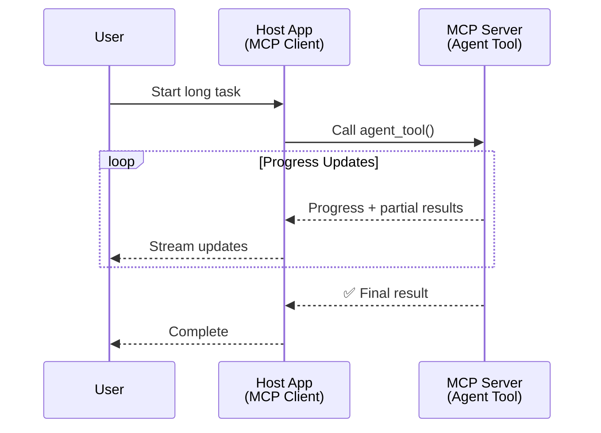
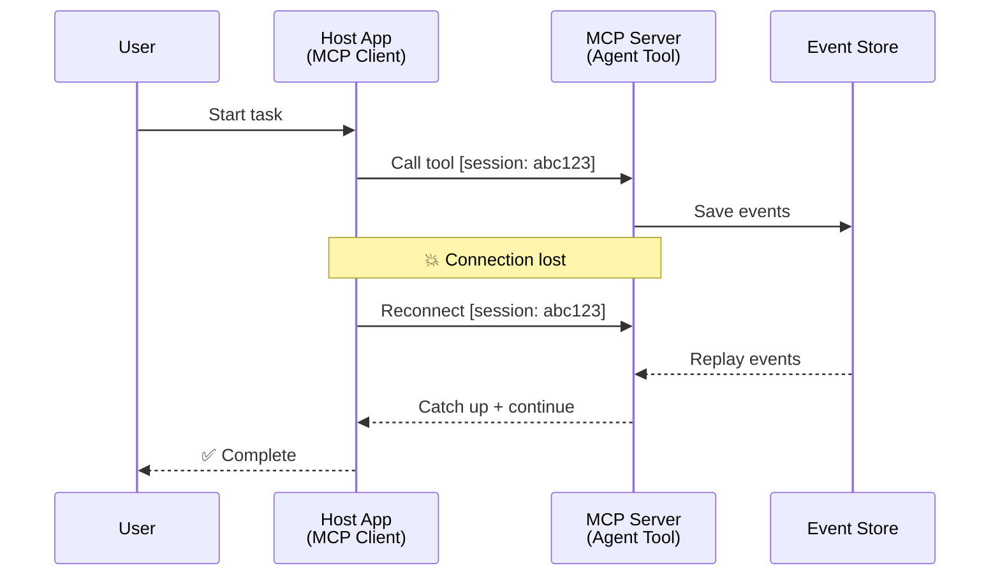
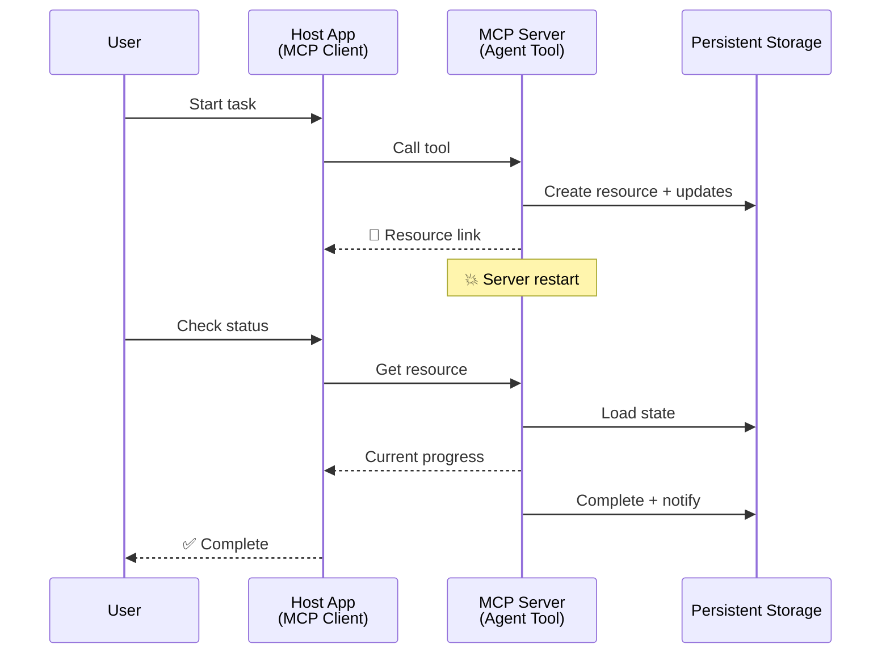
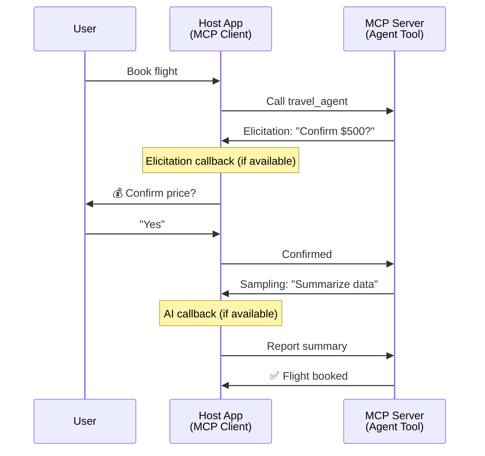
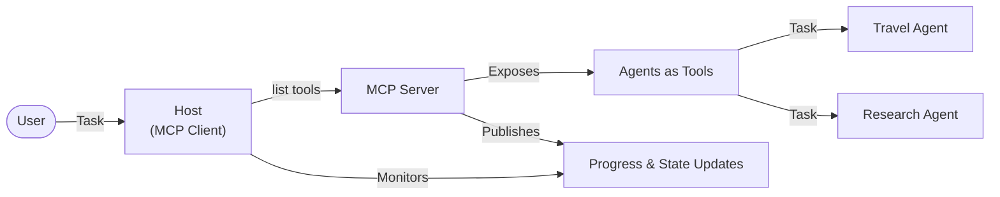

<!--
CO_OP_TRANSLATOR_METADATA:
{
  "original_hash": "5cc6836626047aa055e8960c8484a7d0",
  "translation_date": "2025-07-24T10:05:07+00:00",
  "source_file": "11-mcp/code_samples/mcp-agents/README.md",
  "language_code": "hu"
}
-->
# Agentek közötti kommunikációs rendszerek építése MCP-vel

> Röviden - Lehet MCP-vel Agent2Agent kommunikációt építeni? Igen!

Az MCP jelentősen túllépett eredeti célján, amely az "LLM-ek számára kontextus biztosítása" volt. Az utóbbi időben bevezetett fejlesztések, mint például a [folytatható adatfolyamok](https://modelcontextprotocol.io/docs/concepts/transports#resumability-and-redelivery), [kikérdezés](https://modelcontextprotocol.io/specification/2025-06-18/client/elicitation), [mintavételezés](https://modelcontextprotocol.io/specification/2025-06-18/client/sampling), és értesítések ([folyamat](https://modelcontextprotocol.io/specification/2025-06-18/basic/utilities/progress) és [erőforrások](https://modelcontextprotocol.io/specification/2025-06-18/schema#resourceupdatednotification)), most már szilárd alapot biztosítanak összetett agentek közötti kommunikációs rendszerek építéséhez.

## Az Agent/Eszköz Tévképzet

Ahogy egyre több fejlesztő fedezi fel az agentikus viselkedésű eszközöket (hosszú ideig futnak, végrehajtás közben további bemenetet igényelhetnek stb.), egy gyakori tévhit, hogy az MCP nem alkalmas erre, főként azért, mert korai példái az eszközök primitívjeire egyszerű kérés-válasz mintákra összpontosítottak.

Ez a nézet elavult. Az MCP specifikációt az elmúlt hónapokban jelentősen kibővítették olyan képességekkel, amelyek lehetővé teszik a hosszú távú agentikus viselkedés megvalósítását:

- **Adatfolyam és részleges eredmények**: Valós idejű folyamatfrissítések a végrehajtás során
- **Folytathatóság**: Az ügyfelek újracsatlakozhatnak és folytathatják a megszakítás után
- **Tartósság**: Az eredmények túlélnek szerver újraindításokat (pl. erőforrás hivatkozásokon keresztül)
- **Többfordulós**: Interaktív bemenet a végrehajtás közben kikérdezés és mintavételezés révén

Ezek a funkciók kombinálhatók, hogy lehetővé tegyék az összetett agentikus és több agentet érintő alkalmazásokat, mindezt az MCP protokollra építve.

Hivatkozásként az agentet "eszközként" fogjuk említeni, amely egy MCP szerveren érhető el. Ez feltételezi egy olyan gazdaalkalmazás létezését, amely megvalósít egy MCP klienst, amely kapcsolatot létesít az MCP szerverrel, és képes hívni az agentet.

## Mi Tesz Egy MCP Eszközt "Agentikussá"?

Mielőtt belevágnánk a megvalósításba, tisztázzuk, milyen infrastruktúra-képességekre van szükség a hosszú távú agentek támogatásához.

> Egy agentet úgy definiálunk, mint egy entitást, amely képes autonóm módon működni hosszabb időszakon keresztül, és képes kezelni összetett feladatokat, amelyek több interakciót vagy valós idejű visszacsatolás alapján történő módosítást igényelhetnek.

### 1. Adatfolyam és részleges eredmények

A hagyományos kérés-válasz minták nem működnek hosszú távú feladatok esetén. Az agenteknek biztosítaniuk kell:

- Valós idejű folyamatfrissítések
- Köztes eredmények

**MCP támogatás**: Az erőforrás frissítési értesítések lehetővé teszik a részleges eredmények adatfolyamát, bár ez gondos tervezést igényel, hogy elkerüljük az ütközéseket a JSON-RPC 1:1 kérés/válasz modelljével.

| Funkció                   | Használati eset                                                                                                                                                                       | MCP támogatás                                                                              |
| ------------------------- | ------------------------------------------------------------------------------------------------------------------------------------------------------------------------------------ | ------------------------------------------------------------------------------------------ |
| Valós idejű folyamatfrissítések | A felhasználó kér egy kódbázis migrációs feladatot. Az agent adatfolyamban közli a folyamatot: "10% - Függőségek elemzése... 25% - TypeScript fájlok konvertálása... 50% - Importok frissítése..." | ✅ Folyamat értesítések                                                                    |
| Részleges eredmények      | "Könyv generálása" feladat részleges eredményeket közöl adatfolyamban, pl. 1) Történetív vázlat, 2) Fejezetlista, 3) Minden fejezet, ahogy elkészül. A gazda bármely szakaszban ellenőrizheti, megszakíthatja vagy átirányíthatja. | ✅ Az értesítések "kiterjeszthetők", hogy részleges eredményeket tartalmazzanak, lásd PR 383, 776 javaslatok |

<div align="center" style="font-style: italic; font-size: 0.95em; margin-bottom: 0.5em;">
<strong>1. ábra:</strong> Ez a diagram bemutatja, hogyan közvetít egy MCP agent valós idejű folyamatfrissítéseket és részleges eredményeket a gazdaalkalmazásnak egy hosszú távú feladat során, lehetővé téve a felhasználó számára a végrehajtás valós idejű nyomon követését.
</div>



### 2. Folytathatóság

Az agenteknek képesnek kell lenniük kezelni a hálózati megszakításokat:

- Újracsatlakozás a (kliens) kapcsolat megszakadása után
- Folytatás onnan, ahol abbahagyták (üzenet újraküldés)

**MCP támogatás**: Az MCP StreamableHTTP transport ma támogatja az ülés folytatását és az üzenetek újraküldését ülésazonosítókkal és utolsó eseményazonosítókkal. Fontos megjegyezni, hogy a szervernek implementálnia kell egy EventStore-t, amely lehetővé teszi az események újrajátszását a kliens újracsatlakozásakor.  
Megjegyzendő, hogy van egy közösségi javaslat (PR #975), amely a transportfüggetlen folytatható adatfolyamokat vizsgálja.

| Funkció      | Használati eset                                                                                                                                                   | MCP támogatás                                                                |
| ------------ | ---------------------------------------------------------------------------------------------------------------------------------------------------------- | -------------------------------------------------------------------------- |
| Folytathatóság | A kliens megszakad egy hosszú távú feladat közben. Újracsatlakozáskor az ülés folytatódik az elmulasztott események újrajátszásával, zökkenőmentesen folytatva onnan, ahol abbahagyta. | ✅ StreamableHTTP transport ülésazonosítókkal, esemény újrajátszással és EventStore-ral |

<div align="center" style="font-style: italic; font-size: 0.95em; margin-bottom: 0.5em;">
<strong>2. ábra:</strong> Ez a diagram bemutatja, hogyan teszi lehetővé az MCP StreamableHTTP transport és az eseménytár az ülés zökkenőmentes folytatását: ha a kliens megszakad, újracsatlakozhat és újrajátszhatja az elmulasztott eseményeket, folytatva a feladatot anélkül, hogy elveszítené a haladást.
</div>



### 3. Tartósság

A hosszú távú agenteknek tartós állapotra van szükségük:

- Az eredmények túlélnek szerver újraindításokat
- Az állapot lekérdezhető a rendszeren kívül
- Folyamatkövetés az ülések között

**MCP támogatás**: Az MCP most támogatja az erőforrás hivatkozás visszatérési típust az eszközhívásokhoz. Ma egy lehetséges minta egy olyan eszköz tervezése, amely létrehoz egy erőforrást, és azonnal visszaad egy erőforrás hivatkozást. Az eszköz a háttérben folytathatja a feladatot, és frissítheti az erőforrást. A kliens választhat, hogy lekérdezi az erőforrás állapotát részleges vagy teljes eredményekért (az alapján, hogy milyen erőforrás frissítéseket biztosít a szerver), vagy feliratkozik az erőforrás frissítési értesítéseire.

Ennek egy korlátja, hogy az erőforrások lekérdezése vagy a frissítésekre való feliratkozás erőforrásokat fogyaszthat, ami skálázási problémákat vethet fel. Van egy nyitott közösségi javaslat (beleértve a #992-t), amely a webhookok vagy trigger-ek lehetőségét vizsgálja, amelyeket a szerver hívhat a kliens/gazdaalkalmazás értesítésére a frissítésekről.

| Funkció    | Használati eset                                                                                                                                        | MCP támogatás                                                        |
| ---------- | ----------------------------------------------------------------------------------------------------------------------------------------------- | ------------------------------------------------------------------ |
| Tartósság | A szerver összeomlik egy adatátviteli feladat közben. Az eredmények és a folyamat túléli az újraindítást, a kliens ellenőrizheti az állapotot, és folytathatja a tartós erőforrásból. | ✅ Erőforrás hivatkozások tartós tárolással és állapot értesítésekkel |

Ma egy gyakori minta egy olyan eszköz tervezése, amely létrehoz egy erőforrást, és azonnal visszaad egy erőforrás hivatkozást. Az eszköz a háttérben folytathatja a feladatot, kiadhat erőforrás értesítéseket, amelyek folyamatfrissítésekként szolgálnak, vagy részleges eredményeket tartalmazhatnak, és szükség szerint frissítheti az erőforrás tartalmát.

<div align="center" style="font-style: italic; font-size: 0.95em; margin-bottom: 0.5em;">
<strong>3. ábra:</strong> Ez a diagram bemutatja, hogyan használják az MCP agentek a tartós erőforrásokat és állapot értesítéseket annak biztosítására, hogy a hosszú távú feladatok túléljék a szerver újraindításokat, lehetővé téve a kliensek számára a folyamat ellenőrzését és az eredmények lekérését még hibák után is.
</div>



### 4. Többfordulós interakciók

Az agentek gyakran további bemenetet igényelnek a végrehajtás közben:

- Emberi pontosítás vagy jóváhagyás
- AI segítségnyújtás összetett döntésekhez
- Dinamikus paraméterbeállítás

**MCP támogatás**: Teljes mértékben támogatott mintavételezés (AI bemenethez) és kikérdezés (emberi bemenethez) révén.

| Funkció                 | Használati eset                                                                                                                                     | MCP támogatás                                           |
| ----------------------- | -------------------------------------------------------------------------------------------------------------------------------------------- | ----------------------------------------------------- |
| Többfordulós interakciók | Utazási foglalási agent ármegerősítést kér a felhasználótól, majd AI-tól kér összefoglalót az utazási adatokról, mielőtt befejezné a foglalási tranzakciót. | ✅ Kikérdezés emberi bemenethez, mintavételezés AI bemenethez |

<div align="center" style="font-style: italic; font-size: 0.95em; margin-bottom: 0.5em;">
<strong>4. ábra:</strong> Ez a diagram bemutatja, hogyan kérhetnek az MCP agentek interaktívan emberi bemenetet vagy AI segítséget a végrehajtás közben, támogatva az összetett, többfordulós munkafolyamatokat, mint például a megerősítések és dinamikus döntéshozatal.
</div>



## Hosszú távú agentek megvalósítása MCP-n - Kódáttekintés

A cikk részeként biztosítunk egy [kódrepozitóriumot](https://github.com/victordibia/ai-tutorials/tree/main/MCP%20Agents), amely tartalmazza a hosszú távú agentek teljes megvalósítását az MCP Python SDK-val és StreamableHTTP transporttal az ülés folytatásához és az üzenetek újraküldéséhez. A megvalósítás bemutatja, hogyan lehet az MCP képességeit kombinálni az összetett agentikus viselkedések lehetővé tételéhez.

Különösen két fő agent eszközt valósítunk meg a szerveren:

- **Utazási agent** - Utazási foglalási szolgáltatást szimulál ármegerősítéssel kikérdezés révén
- **Kutatási agent** - Kutatási feladatokat végez AI által támogatott összefoglalókkal mintavételezés révén

Mindkét agent bemutatja a valós idejű folyamatfrissítéseket, az interaktív megerősítéseket és a teljes ülés folytatási képességeket.

### Kulcsfontosságú megvalósítási koncepciók

Az alábbi szekciók bemutatják a szerveroldali agent megvalósítást és a kliensoldali gazda kezelését minden képességhez:

#### Adatfolyam és folyamatfrissítések - Valós idejű feladatállapot

Az adatfolyam lehetővé teszi az agentek számára, hogy valós idejű folyamatfrissítéseket biztosítsanak a hosszú távú feladatok során, tájékoztatva a felhasználókat a feladat állapotáról és a köztes eredményekről.

**Szerver megvalósítás (agent folyamat értesítéseket küld):**

```python
# From server/server.py - Travel agent sending progress updates
for i, step in enumerate(steps):
    await ctx.session.send_progress_notification(
        progress_token=ctx.request_id,
        progress=i * 25,
        total=100,
        message=step,
        related_request_id=str(ctx.request_id)
    )
    await anyio.sleep(2)  # Simulate work

# Alternative: Log messages for detailed step-by-step updates
await ctx.session.send_log_message(
    level="info",
    data=f"Processing step {current_step}/{steps} ({progress_percent}%)",
    logger="long_running_agent",
    related_request_id=ctx.request_id,
)
```

**Kliens megvalósítás (gazda folyamatfrissítéseket fogad):**

```python
# From client/client.py - Client handling real-time notifications
async def message_handler(message) -> None:
    if isinstance(message, types.ServerNotification):
        if isinstance(message.root, types.LoggingMessageNotification):
            console.print(f"📡 [dim]{message.root.params.data}[/dim]")
        elif isinstance(message.root, types.ProgressNotification):
            progress = message.root.params
            console.print(f"🔄 [yellow]{progress.message} ({progress.progress}/{progress.total})[/yellow]")

# Register message handler when creating session
async with ClientSession(
    read_stream, write_stream,
    message_handler=message_handler
) as session:
```

#### Kikérdezés - Felhasználói bemenet kérése

A kikérdezés lehetővé teszi az agentek számára, hogy végrehajtás közben felhasználói bemenetet kérjenek. Ez elengedhetetlen a megerősítésekhez, pontosításokhoz vagy jóváhagyásokhoz a hosszú távú feladatok során.

**Szerver megvalósítás (agent megerősítést kér):**

```python
# From server/server.py - Travel agent requesting price confirmation
elicit_result = await ctx.session.elicit(
    message=f"Please confirm the estimated price of $1200 for your trip to {destination}",
    requestedSchema=PriceConfirmationSchema.model_json_schema(),
    related_request_id=ctx.request_id,
)

if elicit_result and elicit_result.action == "accept":
    # Continue with booking
    logger.info(f"User confirmed price: {elicit_result.content}")
elif elicit_result and elicit_result.action == "decline":
    # Cancel the booking
    booking_cancelled = True
```

**Kliens megvalósítás (gazda kikérdezési visszahívást biztosít):**

```python
# From client/client.py - Client handling elicitation requests
async def elicitation_callback(context, params):
    console.print(f"💬 Server is asking for confirmation:")
    console.print(f"   {params.message}")

    response = console.input("Do you accept? (y/n): ").strip().lower()

    if response in ['y', 'yes']:
        return types.ElicitResult(
            action="accept",
            content={"confirm": True, "notes": "Confirmed by user"}
        )
    else:
        return types.ElicitResult(
            action="decline",
            content={"confirm": False, "notes": "Declined by user"}
        )

# Register the callback when creating the session
async with ClientSession(
    read_stream, write_stream,
    elicitation_callback=elicitation_callback
) as session:
```

#### Mintavételezés - AI segítség kérése

A mintavételezés lehetővé teszi az agentek számára, hogy végrehajtás közben LLM segítséget kérjenek összetett döntésekhez vagy tartalomgeneráláshoz. Ez lehetővé teszi az emberi és AI munkafolyamatok kombinációját.

**Szerver megvalósítás (agent AI segítséget kér):**

```python
# From server/server.py - Research agent requesting AI summary
sampling_result = await ctx.session.create_message(
    messages=[
        SamplingMessage(
            role="user",
            content=TextContent(type="text", text=f"Please summarize the key findings for research on: {topic}")
        )
    ],
    max_tokens=100,
    related_request_id=ctx.request_id,
)

if sampling_result and sampling_result.content:
    if sampling_result.content.type == "text":
        sampling_summary = sampling_result.content.text
        logger.info(f"Received sampling summary: {sampling_summary}")
```

**Kliens megvalósítás (gazda mintavételezési visszahívást biztosít):**

```python
# From client/client.py - Client handling sampling requests
async def sampling_callback(context, params):
    message_text = params.messages[0].content.text if params.messages else 'No message'
    console.print(f"🧠 Server requested sampling: {message_text}")

    # In a real application, this could call an LLM API
    # For demo purposes, we provide a mock response
    mock_response = "Based on current research, MCP has evolved significantly..."

    return types.CreateMessageResult(
        role="assistant",
        content=types.TextContent(type="text", text=mock_response),
        model="interactive-client",
        stopReason="endTurn"
    )

# Register the callback when creating the session
async with ClientSession(
    read_stream, write_stream,
    sampling_callback=sampling_callback,
    elicitation_callback=elicitation_callback
) as session:
```

#### Folytathatóság - Ülés folytonosság megszakítások esetén

A folytathatóság biztosítja, hogy a hosszú távú agent feladatok túléljék a kliens megszakításokat, és zökkenőmentesen folytatódjanak újracsatlakozáskor. Ez eseménytárakon és folytatási tokeneken keresztül valósul meg.

**Eseménytár megvalósítás (szerver tárolja az ülés állapotát):**

```python
# From server/event_store.py - Simple in-memory event store
class SimpleEventStore(EventStore):
    def __init__(self):
        self._events: list[tuple[StreamId, EventId, JSONRPCMessage]] = []
        self._event_id_counter = 0

    async def store_event(self, stream_id: StreamId, message: JSONRPCMessage) -> EventId:
        """Store an event and return its ID."""
        self._event_id_counter += 1
        event_id = str(self._event_id_counter)
        self._events.append((stream_id, event_id, message))
        return event_id

    async def replay_events_after(self, last_event_id: EventId, send_callback: EventCallback) -> StreamId | None:
        """Replay events after the specified ID for resumption."""
        # Find events after the last known event and replay them
        for _, event_id, message in self._events[start_index:]:
            await send_callback(EventMessage(message, event_id))

# From server/server.py - Passing event store to session manager
def create_server_app(event_store: Optional[EventStore] = None) -> Starlette:
    server = ResumableServer()

    # Create session manager with event store for resumption
    session_manager = StreamableHTTPSessionManager(
        app=server,
        event_store=event_store,  # Event store enables session resumption
        json_response=False,
        security_settings=security_settings,
    )

    return Starlette(routes=[Mount("/mcp", app=session_manager.handle_request)])

# Usage: Initialize with event store
event_store = SimpleEventStore()
app = create_server_app(event_store)
```

**Kliens metaadatok folytatási tokennel (kliens újracsatlakozik a tárolt állapot használatával):**

```python
# From client/client.py - Client resumption with metadata
if existing_tokens and existing_tokens.get("resumption_token"):
    # Use existing resumption token to continue where we left off
    metadata = ClientMessageMetadata(
        resumption_token=existing_tokens["resumption_token"],
    )
else:
    # Create callback to save resumption token when received
    def enhanced_callback(token: str):
        protocol_version = getattr(session, 'protocol_version', None)
        token_manager.save_tokens(session_id, token, protocol_version, command, args)

    metadata = ClientMessageMetadata(
        on_resumption_token_update=enhanced_callback,
    )

# Send request with resumption metadata
result = await session.send_request(
    types.ClientRequest(
        types.CallToolRequest(
            method="tools/call",
            params=types.CallToolRequestParams(name=command, arguments=args)
        )
    ),
    types.CallToolResult,
    metadata=metadata,
)
```

A gazdaalkalmazás helyileg tárolja az ülésazonosítókat és a folytatási tokeneket, lehetővé téve, hogy meglévő ülésekhez csatlakozzon újra anélkül, hogy elveszítené a haladást vagy az állapotot.

### Kódszervezés

<div align="center" style="font-style: italic; font-size: 0.95em; margin-bottom: 0.5em;">
<strong>5. ábra:</strong> MCP-alapú agent rendszer architektúra
</div>



**Kulcsfájlok:**

- **`server/server.py`** - Folytatható MCP szerver utazási és kutatási agentekkel, amelyek bemutatják a kikérdezést, mintavételezést és folyamatfrissítéseket
- **`client/client.py`** - Interaktív gazdaalkalmazás folytatási támogatással, viss

**Felelősség kizárása**:  
Ez a dokumentum az AI fordítási szolgáltatás [Co-op Translator](https://github.com/Azure/co-op-translator) segítségével lett lefordítva. Bár törekszünk a pontosságra, kérjük, vegye figyelembe, hogy az automatikus fordítások hibákat vagy pontatlanságokat tartalmazhatnak. Az eredeti dokumentum az eredeti nyelvén tekintendő hiteles forrásnak. Kritikus információk esetén javasolt professzionális emberi fordítást igénybe venni. Nem vállalunk felelősséget semmilyen félreértésért vagy téves értelmezésért, amely a fordítás használatából eredhet.