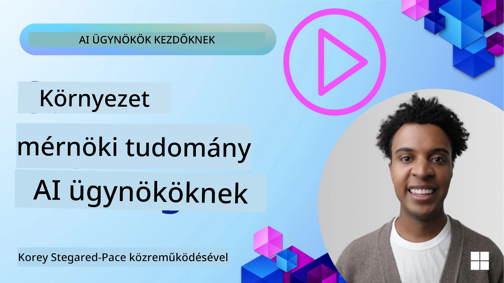
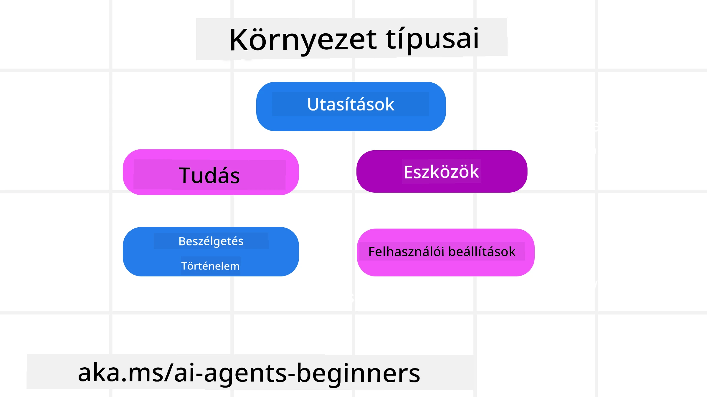
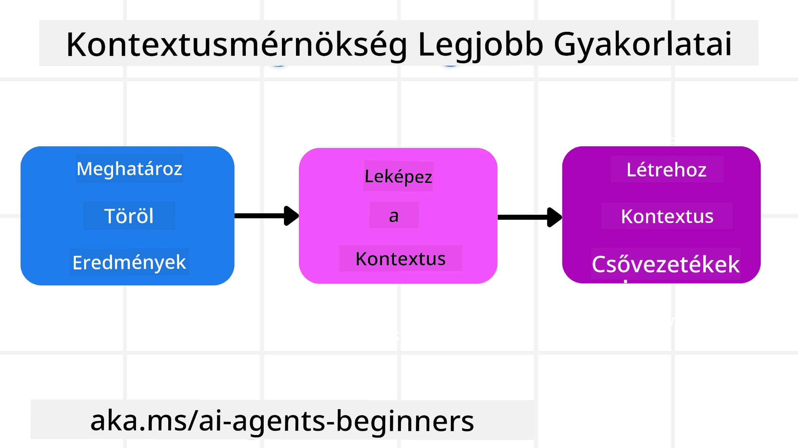

# Kontextusmérnökség AI-ügynökök számára

> _(Kattintson a fenti képre, hogy megtekinthesse a lecke videóját)_

Fontos megérteni a komplexitását annak az alkalmazásnak, amire AI-ügynököt építünk, hogy megbízható ügynököt alkothassunk. Olyan AI-ügynököket kell készítenünk, amelyek hatékonyan kezelik az információkat, hogy a prompt mérnökségen túlmutató összetett igényeket kielégítsenek.

Ebben a leckében megnézzük, mi az a kontextusmérnökség, és milyen szerepe van az AI-ügynökök építésében.

## Bevezetés

Ez a lecke a következőket fogja lefedni:

• **Mi az a Kontextusmérnökség** és miben különbözik a prompt mérnökségtől.

• **Stratégiák a hatékony Kontextusmérnökséghez**, ideértve az információ írását, kiválasztását, tömörítését és elkülönítését.

• **Gyakori Kontextushibák**, amelyek meghiúsíthatják AI-ügynökét, és hogyan lehet ezeket javítani.

## Tanulási célok

A lecke elvégzése után tudni fogja, hogyan:

• **Meghatározza a kontextusmérnökséget** és megkülönböztesse a prompt mérnökségtől.

• **Azonosítsa a kontextus kulcsfontosságú összetevőit** Nagy Nyelvi Modell (LLM) alkalmazásokban.

• **Alkalmazzon stratégiákat a kontextus írására, kiválasztására, tömörítésére és elkülönítésére**, hogy javítsa az ügynök teljesítményét.

• **Fel ismerje a gyakori kontextushibákat**, például mérgezést, elvonást, zavart és ütközést, és alkalmazza a mérséklő technikákat.

## Mi az a Kontextusmérnökség?

AI-ügynökök esetében a kontextus az, ami meghatározza az AI-ügynök tervezését bizonyos cselekvések megtételére. A kontextusmérnökség arra szolgál, hogy biztosítsuk, az AI-ügynök a megfelelő információval rendelkezzen a feladat következő lépésének végrehajtásához. A kontextusablak korlátozott méretű, ezért ügynöképítőként rendszereket és folyamatokat kell kialakítanunk az információ hozzáadásának, eltávolításának és tömörítésének kezelésére a kontextusablakban.

### Prompt mérnökség vs Kontextusmérnökség

A prompt mérnökség egy statikus, egyetlen utasításkészletre fókuszál, amely hatékony iránymutatást ad az AI-ügynököknek szabályrendszerrel. A kontextusmérnökség a dinamikus információkészlet kezeléséről szól, beleértve a kezdeti promptot is, hogy az AI-ügynök idővel megkapja, amire szüksége van. A kontextusmérnökség fő gondolata, hogy ezt a folyamatot ismételhetővé és megbízhatóvá tegye.

### Kontextus típusai

Fontos emlékezni, hogy a kontextus nem csak egy dolog. Az AI-ügynök által igényelt információ számos forrásból származhat, és a mi feladatunk, hogy biztosítsuk az ügynök hozzáférését ezekhez a forrásokhoz:

Az AI-ügynök által kezelendő kontextustípusok:

• **Utasítások:** Ezek az ügynök „szabályai” – promptok, rendszerüzenetek, néhány példa (amelyek megmutatják az AI-nak, hogyan kell megtenni valamit), és a használható eszközök leírásai. Itt találkozik a prompt és kontextusmérnökség fókusza.

• **Tudás:** Ide tartoznak a tények, adatbázisokból lekért információk vagy az ügynök által felhalmozott hosszú távú emlékek. Ez magában foglalhatja egy Retrieval Augmented Generation (RAG) rendszer integrálását, ha az ügynöknek hozzá kell férnie különböző tudásbázisokhoz és adatbázisokhoz.

• **Eszközök:** Ezek külső funkciók, API-k és MCP szerverek definíciói, amelyeket az ügynök használhat, valamint az ezek használata során kapott visszajelzések (eredmények).

• **Beszélgetés előzményei:** A felhasználóval folytatott aktuális párbeszéd. Az idő múlásával ezek a beszélgetések egyre hosszabbak és bonyolultabbak lesznek, ami helyet foglal a kontextusablakban.

• **Felhasználói preferenciák:** Idővel megtanult információk a felhasználók kedvenc vagy nem kedvelt dolgairól. Ezek tárolhatók és előhívhatók kulcsfontosságú döntések meghozatalakor a felhasználó támogatására.

## Stratégiák a hatékony Kontextusmérnökséghez

### Tervezési stratégiák

A jó kontextusmérnökség jó tervezéssel kezdődik. Íme egy megközelítés, amely segít elkezdeni gondolkodni a kontextusmérnökség alkalmazásán:

1. **Határozzon meg egyértelmű eredményeket** – Az AI-ügynökök által végzett feladatok eredményeit egyértelműen kell definiálni. Válaszolja meg a kérdést: „Milyen lesz a világ, amikor az AI-ügynök befejezte a feladatát?” Más szóval, milyen változásnak, információnak vagy válasznak kell megjelennie a felhasználó számára az AI-ügynökkel való interakció után.
2. **Térképezze fel a kontextust** – Ha megvan az AI-ügynök eredménye, meg kell válaszolni a kérdést: „Milyen információkra van szüksége az AI-ügynöknek a feladat befejezéséhez?” Így meg tudja térképezni, hol található ez az információ.
3. **Hozzon létre kontextus pipeline-okat** – Miután tudja, hol van az információ, meg kell válaszolni a kérdést: „Hogyan fogja az ügynök megszerezni ezt az információt?” Ez számos módon megoldható, beleértve RAG-et, MCP szerverek használatát és egyéb eszközöket.

### Gyakorlati stratégiák

A tervezés fontos, de amikor az információ már beáramlik az ügynök kontextusablakába, gyakorlati stratégiákra van szükségünk annak kezelésére:

#### Kontextus kezelése

Míg néhány információ automatikusan bekerül a kontextusablakba, a kontextusmérnökség aktívabb szerepvállalásról szól, amely néhány stratégiával megvalósítható:

1. **Ügynök jegyzetfüzet (Agent Scratchpad)**  
Ez lehetővé teszi, hogy az AI-ügynök feljegyezze az adott feladatokkal és felhasználói interakciókkal kapcsolatos releváns információkat egyetlen munkameneten belül. Ez kívül kell, hogy legyen a kontextusablakon, egy fájlban vagy futásidejű objektumban, amit az ügynök később előhívhat ezen ülés alatt, ha szükséges.

2. **Emlékek**  
A jegyzetfüzetek jók az információk kezelésére egyetlen munkameneten kívül. Az emlékek lehetővé teszik az ügynökök számára, hogy releváns információkat tároljanak és kérjenek elő több munkamenet között. Ez tartalmazhat összegezéseket, felhasználói preferenciákat és visszajelzéseket a jövőbeni fejlesztésekhez.

3. **Kontextus tömörítése**  
Ha a kontextusablak növekszik és közelít a határhoz, olyan technikák alkalmazhatók, mint az összegzés és vágás. Ez magában foglalhatja a legrelevánsabb információk megtartását, vagy régebbi üzenetek eltávolítását.

4. **Többügynökös rendszerek**  
Többügynökös rendszerek fejlesztése kontextusmérnökség, mert minden ügynöknek megvan a saját kontextusablaka. Az, hogy ez a kontextus hogyan oszlik meg és kerül át más ügynökökhöz, további tervezést igényel ezen rendszerek kiépítése során.

5. **SandBox környezetek**  
Ha az ügynöknek kódot kell futtatnia vagy nagymennyiségű információt kell feldolgoznia egy dokumentumban, az sok token feldolgozását igényli az eredményekhez. Ahelyett, hogy mindez a kontextusablakban lenne tárolva, az ügynök használhat egy sandbox környezetet, amely képes futtatni a kódot, és csak az eredményeket vagy egyéb releváns információkat olvassa be.

6. **Futásidejű állapotobjektumok**  
Ez úgy valósul meg, hogy információtartályokat hozunk létre, hogy kezeljük azokat az eseteket, amikor az ügynöknek hozzáférése kell legyen bizonyos adatokhoz. Egy összetett feladat esetén ez lehetővé teszi, hogy az ügynök lépésről lépésre tárolja az egyes alfeladatok eredményeit, ezzel a kontextust csak az adott alfeladathoz kötve tartva.

#### Kontextus ellenőrzése

Miután alkalmazott egy stratégiát, érdemes ellenőrizni, hogy a következő modell hívás milyen kontextust kapott ténylegesen. Egy hasznos hibakereső kérdés:

> Betöltött az ügynök túl sok kontextust, rossz kontextust, vagy hiányzó kontextust kapott, ami szükséges volt?

Ehhez nem szükséges a nyers promptokat, eszköz kimeneteket vagy memória tartalmakat naplózni. Termelési környezetben előnyösebb kis kontextusellenőrzési bejegyzéseket készíteni, amelyek számokat, azonosítókat, hash értékeket és szabálycímkéket tartalmaznak:

- **Kiválasztás:** Kövesse nyomon, hány jelölt darabot, eszközt vagy memóriát vett számításba, hányat választott ki, és melyik szabály vagy pontszám eredményezte a többi kiszűrését.
- **Tömörítés:** Rögzítse a forrás tartományt vagy követési azonosítót, az összegzés azonosítóját, a becsült token számot tömörítés előtt és után, valamint azt, hogy a nyers tartalom ki lett-e zárva a következő hívásból.
- **Elkülönítés:** Jegyezze meg, hogy mely alfeladat futott külön ügynökben, munkamenetben vagy sandboxban, milyen kötött összegzés tért vissza, és hogy a nagy eszközkimenet kívül maradt-e a szülő ügynök kontextusán.
- **Memória és RAG:** Tárolja a lekért dokumentumok azonosítóit, memória azonosítókat, pontszámokat, kiválasztott azonosítókat és az eltakarás állapotát a teljes lekért szöveg helyett.
- **Biztonság és adatvédelem:** Előnyben részesítse a hash-eket, azonosítókat, token vödröket és szabálycímkéket az érzékeny prompt szöveg, eszközparaméterek, eszközeredmények vagy felhasználói memória tartalmak helyett.

A cél nem több kontextus megtartása, hanem elegendő bizonyíték hagyása annak érdekében, hogy a fejlesztő megmondhassa, melyik kontextusstratégia futott le, és megváltoztatta-e a következő modellhívást a kívánt módon.

### Kontextusmérnökség példája

Tegyük fel, hogy egy AI ügynököt arra kérünk, hogy **„Foglaljon nekem egy utat Párizsba.”**

• Egy egyszerű, csak prompt mérnökséget használó ügynök lehet, hogy így válaszol: **„Rendben, mikor szeretne Párizsba utazni?”** Csak a felhasználó közvetlen kérdését dolgozta fel abban a pillanatban.

• Egy, a fent tárgyalt kontextusmérnökségi stratégiákat használó ügynök ennél sokkal többet tenne. Mielőtt válaszolna, a rendszere például:

  ◦ **Ellenőrzi a naptárát** az elérhető időpontokért (valós idejű adatokat kérve le).

 ◦ **Előhívja a korábbi utazási preferenciákat** (hosszú távú memóriából), mint a kedvenc légitársaság, költségvetés vagy a közvetlen járatok preferálása.

 ◦ **Azonosítja az elérhető eszközöket** a repülő- és szállásfoglaláshoz.

- Ezután egy példaválasz lehet: „Szervusz [Neved]! Látom, hogy október első hetében szabad vagy. Keressek közvetlen járatokat Párizsba a [kedvenc légitársaság] légitársaságon a szokásos [költségvetés] kereteden belül?” Ez a gazdagabb, kontextusérzékeny válasz a kontextusmérnökség erejét mutatja be.

## Gyakori kontextushibák

### Kontextusmérgezés

**Mi ez:** Amikor egy hallucináció (a LLM által generált hamis információ) vagy hiba lép be a kontextusba és ismétlődően hivatkoznak rá, ez az ügynököt lehetetlen célok követésére vagy értelmetlen stratégiák kialakítására készteti.

**Mit tegyünk:** Alkalmazzunk **kontextus validációt** és **karantént**. Érvényesítsük az információt mielőtt bekerülne a hosszú távú memóriába. Ha potenciális mérgezést észlelünk, indítsunk új kontextus szálakat, hogy megakadályozzuk a rossz információ terjedését.

**Utazásfoglalási példa:** Az ügynök hallucinál egy **közvetlen járatot egy kis helyi repülőtérről egy távoli nemzetközi városba**, amely ténylegesen nem kínál nemzetközi járatokat. Ez a nem létező járatinformáció bekerül a kontextusba. Később, amikor jegyet kér az ügynöktől, az ismételten megpróbál jegyeket találni erre a lehetetlen útvonalra, ami ismétlődő hibákhoz vezet.

**Megoldás:** Írjunk be egy lépést, amely **ellenőrzi a járat létezését és útvonalait valós idejű API-val** _mielőtt_ hozzáadná a járatinformációt az ügynök munkakontekstusához. Ha az érvényesítés sikertelen, a hibás információ „karanténba” kerül és nem használják tovább.

### Kontextuselvonás

**Mi ez:** Amikor a kontextus túl nagy lesz, a modell túl sokat koncentrál az összegyűjtött előzményekre az edzés során tanultak helyett, ami ismétlődő vagy haszontalan cselekvésekhez vezet. A modellek már a kontextusablak betelése előtt hibázhatnak.

**Mit tegyünk:** Alkalmazzunk **kontextus összegzést**. Időszakosan tömörítsük az összegyűjtött információkat rövidebb összefoglalókra, megtartva a fontos részleteket, miközben eltávolítjuk a felesleges előzményeket. Ez segít „visszaállítani” a fókuszt.

**Utazásfoglalási példa:** Hosszú ideje beszélgettek különböző álomutazási célokról, beleértve egy részletes beszámolót a két évvel ezelőtti hátizsákos utazásáról. Amikor végre azt kéri, hogy **„találjon nekem olcsó járatot a következő hónapra”**, az ügynök elveszik a régi, nem releváns részletekben, és folyamatosan a hátizsák- vagy korábbi útiterv kérdésekről beszél, figyelmen kívül hagyva a jelenlegi kérést.

**Megoldás:** Bizonyos számú forduló után vagy ha a kontextus túl nagy lesz, az ügynöknek **össze kell foglalnia a beszélgetés legfrissebb és legrelevánsabb részeit** – a jelenlegi utazási dátumokra és célpontra fókuszálva – és ezt a tömörített összefoglalót kell használni a következő LLM híváshoz, elvetve a kevésbé releváns történelmi beszélgetést.

### Kontextuszavar

**Mi ez:** Amikor szükségtelen kontextus, gyakran túl sok elérhető eszköz formájában, rossz válaszokat generál vagy irreleváns eszközöket hív meg a modell. A kisebb modellek különösen hajlamosak erre.

**Mit tegyünk:** Alkalmazzunk **eszközterhelés-kezelést** RAG technikával. Tároljuk az eszközleírásokat egy vektoralapú adatbázisban, és válasszuk _csak_ a legrelevánsabb eszközöket az adott feladathoz. Kutatások szerint az eszközválasztás korlátozása kevesebb, mint 30-ra hatékony.

**Utazásfoglalási példa:** Az ügynöknek több tucat eszköze van: `book_flight`, `book_hotel`, `rent_car`, `find_tours`, `currency_converter`, `weather_forecast`, `restaurant_reservations`, stb. Megkérdezi: **„Mi a legjobb módja a közlekedésnek Párizsban?”** Az eszközök nagy száma miatt az ügynök összezavarodik, és megpróbálja a `book_flight` eszközt használni Párizson belül, vagy a `rent_car`-t, noha inkább a tömegközlekedést preferálja, mert az eszközleírások átfedésben vannak, vagy egyszerűen nem tudja felismerni a legjobb megoldást.

**Megoldás:** Használja a **RAG-ot az eszközleírásokon**. Amikor megkérdezi a párizsi közlekedést, a rendszer dinamikusan csak a legrelevánsabb eszközöket hozza elő, mint a `rent_car` vagy `public_transport_info` az adott lekérdezés alapján, és egy fókuszált eszközkészletet mutat az LLM-nek.

### Kontextusütközés

**Mi ez:** Amikor ütköző információk vannak a kontextusban, az következetlen érvelést vagy rossz végső válaszokat eredményez. Ez gyakran akkor fordul elő, amikor az információ szakaszosan érkezik, és a korai, helytelen feltételezések a kontextusban maradnak.

**Mit tegyünk:** Alkalmazzunk **kontextustisztítást (pruning)** és **kiszolgálást (offloading)**. A kontextustisztítás során eltávolítjuk a régi vagy összeütköző információkat, ahogy új részletek érkeznek. A kiszolgálás lehetővé teszi, hogy a modell egy külön „jegyzetfüzet” munkaterületen dolgozza fel az információt anélkül, hogy az fő kontextust terhelné.
**Utazási Foglalási Példa:** Eleinte azt mondod az ügynöködnek, hogy **„Economy osztályon szeretnék repülni.”** Később a beszélgetés során meggondolod magad és azt mondod, **„Valójában ezen az úton business osztályra menjünk.”** Ha mindkét utasítás megmarad a kontextusban, az ügynök ellentmondásos keresési eredményeket kaphat, vagy összezavarodhat, hogy melyik preferenciát helyezze előtérbe.

**Megoldás:** Valósíts meg **kontextus ritkítást**. Amikor egy új utasítás ellentmond egy régebbinek, a régebbi utasítást eltávolítják vagy explicit módon felülírják a kontextusban. Alternatív megoldásként az ügynök használhat egy **vázlatfelületet**, hogy összehangolja az ellentmondó preferenciákat a döntés előtt, ezzel biztosítva, hogy csak a végleges, konzisztens utasítás irányítsa a műveleteit.

## További Kérdéseid Vannak a Kontextus Tervezésével Kapcsolatban?

Csatlakozz a [Microsoft Foundry Discord](https://aka.ms/ai-agents/discord) közösséghez, hogy találkozz más tanulókkal, részt vehess konzultációkon és választ kapj az AI ügynökök működésével kapcsolatos kérdéseidre.

---

<!-- CO-OP TRANSLATOR DISCLAIMER START -->
**Jogi nyilatkozat**:
Ez a dokumentum az AI fordítási szolgáltatás, a [Co-op Translator](https://github.com/Azure/co-op-translator) segítségével készült. Bár az pontosságra törekszünk, kérjük, vegye figyelembe, hogy az automatikus fordítások hibákat vagy pontatlanságokat tartalmazhatnak. Az eredeti dokumentum az anyanyelvén tekintendő hiteles forrásnak. Fontos információk esetén professzionális emberi fordítást javasolunk. Nem vállalunk felelősséget semmilyen félreértésért vagy téves értelmezésért, amely ebből a fordításból ered.
<!-- CO-OP TRANSLATOR DISCLAIMER END -->