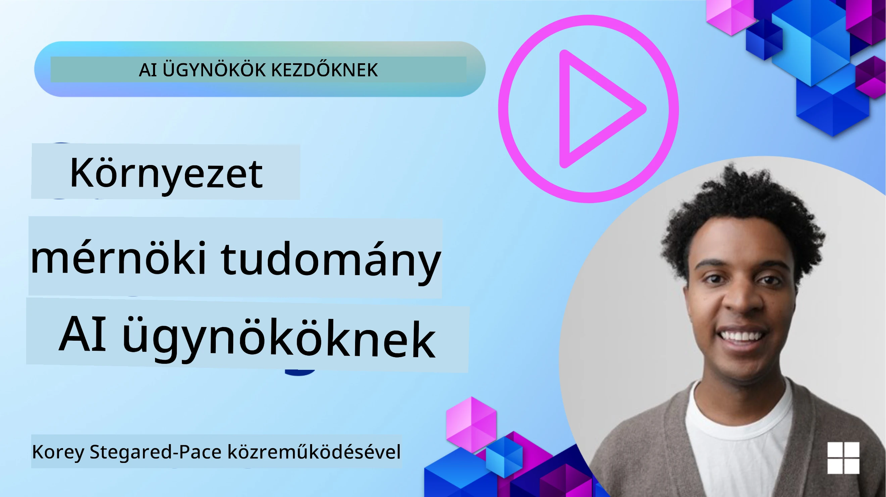
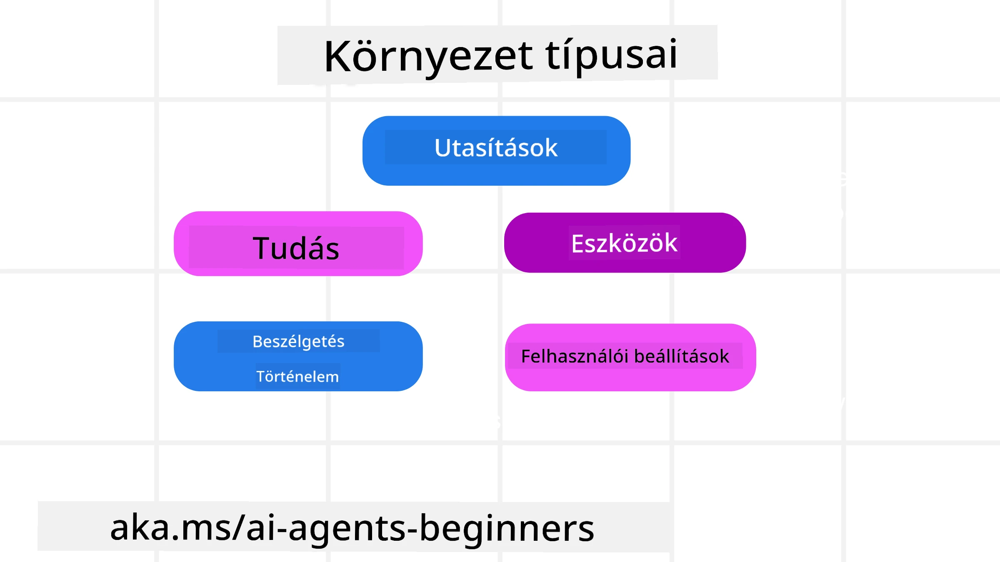
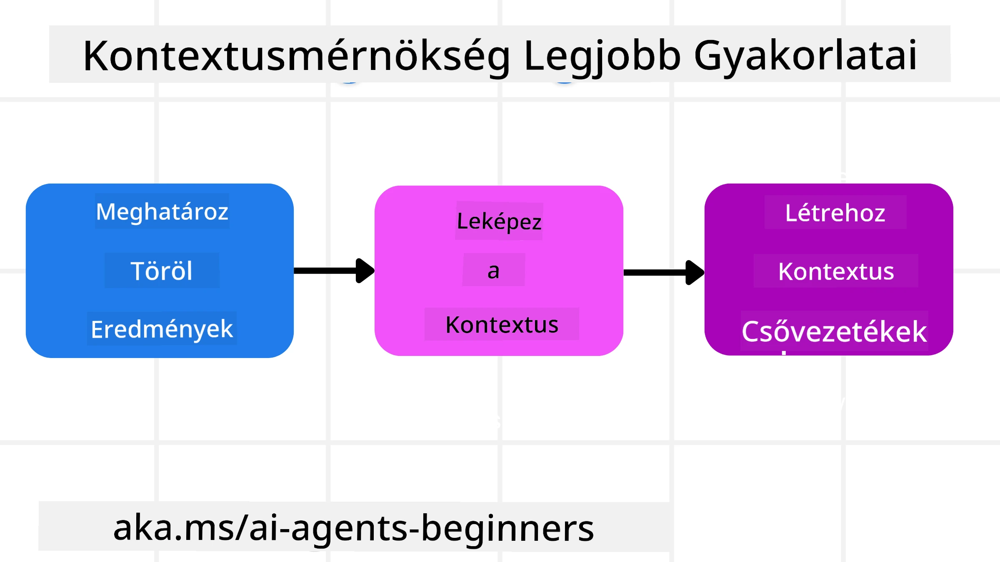

# Kontextus-mérnökség AI ügynökök számára

> _(Kattintson a fenti képre az óra videójának megtekintéséhez)_

Fontos megérteni annak az alkalmazásnak a komplexitását, amelyhez AI ügynököt építünk, hogy megbízhatót készíthessünk. Olyan AI ügynököket kell létrehoznunk, amelyek hatékonyan kezelik az információkat, hogy összetett igényeket elégítsenek ki a prompt mérnökségen túl.

Ebben az órában megnézzük, mi az a kontextus-mérnökség, és milyen szerepet tölt be az AI ügynökök építésében.

## Bevezetés

Ez az óra az alábbiakat fogja lefedni:

• **Mi a Kontextus-mérnökség** és miért különbözik a prompt mérnökségtől.

• **Hatékony Kontextus-mérnökségi stratégiák**, beleértve az információ írását, kiválasztását, tömörítését és izolálását.

• **Gyakori kontextushibák**, amelyek keresztülhúzhatják az AI ügynök működését, és azok megoldása.

## Tanulási célok

Az óra elvégzése után érteni fogja, hogyan kell:

• **Meghatározni a kontextus-mérnökséget** és megkülönböztetni a prompt mérnökségtől.

• **Azonosítani a kontextus kulcselemeit** a Nagy Nyelvi Modell (LLM) alkalmazásokban.

• **Alkalmazni stratégiákat a kontextus írására, kiválasztására, tömörítésére és izolálására** az ügynök teljesítményének javítása érdekében.

• **Fel felismerni a gyakori kontextushibákat** mint mérgezés, elterelés, zavar és összeütközés, és végrehajtani azok enyhítését.

## Mi az a Kontextus-mérnökség?

Az AI ügynökök esetében a kontextus az, ami irányítja az AI ügynök tervezését bizonyos lépések megtételére. A kontextus-mérnökség azt a gyakorlatot jelenti, hogy biztosítsuk, hogy az AI ügynök megfelelő információval rendelkezzen a feladat következő lépésének végrehajtásához. A kontextusablak mérete korlátozott, ezért ügynöképítőként rendszereket és folyamatokat kell kialakítanunk az információk hozzáadásának, eltávolításának és összehúzásának kezelésére a kontextusablakban.

### Prompt mérnökség vs Kontextus-mérnökség

A prompt mérnökség egyetlen, statikus utasítássorozatra összpontosít, hogy hatékonyan vezérelje az AI ügynököket szabályokkal. A kontextus-mérnökség dinamikus információkészlet kezelését jelenti, beleértve az eredeti promptot is, hogy az AI ügynök idővel rendelkezzen minden szükséges információval. A kontextus-mérnökség fő eszméje ennek a folyamatnak az ismételhetősége és megbízhatósága.

### Kontextus típusai

Fontos megjegyezni, hogy a kontextus nem csak egyféle. Az AI ügynök által igényelt információ különböző forrásokból származhat, és rajtunk múlik, hogy az ügynök hozzáférhessen ezekhez a forrásokhoz:

Az AI ügynök által kezelendő kontextus típusai közé tartoznak:

• **Utasítások:** Ezek olyanok, mint az ügynök „szabályai” – promptok, rendszerüzenetek, néhány példa (amik megmutatják az AI-nak, hogyan csináljon valamit), valamint az általa használható eszközök leírásai. Itt találkozik a prompt mérnökség és a kontextus-mérnökség.

• **Tudás:** Ez magában foglalja a tényeket, adatbázisokból lekért információkat, vagy az ügynök által felhalmozott hosszú távú emlékeket. Ide tartozik a Retrieval Augmented Generation (RAG) rendszer beépítése, ha az ügynöknek különböző tudástárakhoz és adatbázisokhoz kell hozzáférnie.

• **Eszközök:** Ezek külső függvények, API-k és MCP szerverek definíciói, amelyeket az ügynök meghívhat, valamint az ezek használatából származó visszajelzések (eredmények).

• **Párbeszéd Előzmények:** A felhasználóval folytatott folyamatban lévő párbeszéd. Az idő múlásával ezek a beszélgetések hosszabbak és összetettebbek lesznek, ami helyet foglal el a kontextusablakban.

• **Felhasználói preferenciák:** Az idő során megtanult információk a felhasználó kedveléseiről vagy nem kedveléseiről. Ezeket tárolni lehet, és fontos döntések meghozatalakor hívhatók elő a felhasználó segítésére.

## Hatékony Kontextus-mérnökségi stratégiák

### Tervezési stratégiák

A jó kontextus-mérnökség jó tervezéssel kezdődik. Íme egy megközelítés, amely segít elkezdeni gondolkodni arról, hogyan alkalmazzuk a kontextus-mérnökség fogalmát:

1. **Egyértelmű eredmények meghatározása** - Az AI ügynök által végrehajtandó feladatok eredményeit világosan definiálni kell. Válaszolja meg a kérdést: „Hogy fog kinézni a világ, amikor az AI ügynök befejezte a feladatát?” Más szóval, milyen változásnak, információnak vagy válasznak kell lennie a felhasználónak az AI ügynökkel való interakció után.
2. **A kontextus feltérképezése** - Miután meghatározta az AI ügynök eredményeit, válaszolnia kell a kérdésre: „Milyen információra van szüksége az AI ügynöknek a feladat elvégzéséhez?”. Így elkezdheti feltérképezni, hol található meg ez az információ.
3. **Kontextus-pipelinek létrehozása** - Miután tudja, hol van az információ, meg kell válaszolnia a kérdést: „Hogyan fogja az ügynök megszerezni ezt az információt?”. Ez megvalósítható különböző módokon, beleértve a RAG-et, MCP szerverek és egyéb eszközök használatát.

### Gyakorlati stratégiák

A tervezés fontos, de amikor az információ elkezd áramlani az ügynök kontextusablakába, gyakorlati stratégiákra van szükség annak kezeléséhez:

#### Kontextus kezelése

Míg bizonyos információk automatikusan kerülnek a kontextusablakba, a kontextus-mérnökség egy aktívabb szerepet jelent ezen információk kezelésében, amit néhány stratégiával megtehetünk:

 1. **Ügynök jegyzetfüzet**
 Ez lehetővé teszi, hogy az AI ügynök jegyzeteket készítsen a jelenlegi feladatokról és felhasználói interakciókról egy adott munkamenet során. Ez kívül kell, hogy legyen a kontextusablakon, például egy fájlban vagy futásidejű objektumban, amelyet az ügynök később ezen a munkameneten belül lekérhet, ha szükséges.

 2. **Emlékek**
 A jegyzetfüzetek jól kezelik az információt egyetlen munkameneten kívül. Az emlékek lehetővé teszik az ügynökök számára, hogy releváns információkat tároljanak és lekérjenek több munkameneten keresztül. Ide tartozhatnak összefoglalók, felhasználói preferenciák és jövőbeli fejlesztésekhez szóló visszajelzések.

 3. **Kontextus tömörítése**
  Amint a kontextusablak növekszik és közelít a határához, alkalmazhatóak olyan technikák, mint az összefoglalás és vágás. Ez vagy csak a legfontosabb információk megtartását, vagy az idősebb üzenetek eltávolítását jelenti.
  
 4. **Több ügynökből álló rendszerek**
  Több ügynökből álló rendszer fejlesztése formája a kontextus-mérnökségnek, mivel minden ügynöknek megvan a saját kontextusablaka. Ennek a kontextusnak a megosztása és továbbadása különböző ügynököknek egy másik tervezendő szempont, amikor ezeket a rendszereket építjük.
  
 5. **Sandbox környezetek**
  Ha egy ügynöknek kódot kell futtatnia vagy nagy mennyiségű információt kell feldolgoznia egy dokumentumban, ez sok token feldolgozását igényli az eredményekhez. Ahelyett, hogy mindez a kontextusablakban lenne tárolva, az ügynök használhat egy sandbox környezetet, amely képes a kód futtatására, és csak az eredményeket, valamint más releváns információkat olvassa be.
  
 6. **Futásidejű állapotobjektumok**
   Ez úgy valósul meg, hogy információkonténereket hozunk létre olyan helyzetek kezelésére, amikor az ügynöknek hozzáférésre van szüksége bizonyos információkhoz. Egy összetett feladat esetén ez lehetővé teszi, hogy az ügynök lépésről lépésre tárolja az egyes alfeladatok eredményeit, így a kontextus csak az adott alfeladathoz kapcsolódik.

#### Kontextus ellenőrzése

Miután alkalmazott valamelyik stratégiát, érdemes ellenőrizni, hogy mi érkezett be ténylegesen a következő modellhívásba. Egy hasznos hibakeresési kérdés:

> Túl sok, rossz vagy hiányzó kontextust töltött be az ügynök, ami szükséges lett volna?

Nem szükséges a nyers promptokat, eszköz kimeneteket vagy memóriatartalmakat naplózni erre a kérdésre válaszoláshoz. Termelésben inkább kis kontextusellenőrzési rekordokat használjon, amelyek számokat, azonosítókat, hash-eket és szabálycímkéket rögzítenek:

- **Kiválasztás:** Kövesse nyomon, hány jelölt töredék, eszköz vagy memória volt figyelembe véve, hányat választottak ki, és mely szabály vagy pontszám miatt szűrtek ki másokat.
- **Tömörítés:** Rögzítse a forrás tartományt vagy nyomkövetési azonosítót, az összefoglaló azonosítót, a becsült token számot tömörítés előtt és után, valamint hogy a nyers tartalom ki lett-e zárva a következő hívásból.
- **Izolálás:** Jegyezze fel, melyik alfeladat futott külön ügynökben, munkamenetben vagy sandboxban, milyen kötött összefoglaló tért vissza, és hogy nagy eszköz kimenet kívül maradt-e a szülő ügynök kontextusán.
- **Memória és RAG:** Tárolja a lekérési dokumentum azonosítókat, memória azonosítókat, pontszámokat, kiválasztott azonosítókat és redakciós állapotot a teljes lekért szöveg helyett.
- **Biztonság és adatvédelem:** Előnyben részesíti a hash-eket, azonosítókat, token vödröket és szabálycímkéket a kényes prompt szövegek, eszköz argumentumok, eszköz eredmények vagy felhasználói memória tartalmak helyett.

A cél nem több kontextus megtartása. Hanem elegendő bizonyítékot hagyni, hogy a fejlesztő meg tudja mondani, melyik kontextus-stratégia futott, és hogy az a következő modellhívást a kívánt módon módosította-e.

### Kontextus-mérnökség példa

Tegyük fel, hogy azt szeretnénk, hogy egy AI ügynök **„Foglaljon nekem egy utazást Párizsba.”**

• Egy egyszerű ügynök, amely csak prompt mérnökséget alkalmaz, csak annyit válaszolna: **„Rendben, mikor szeretne Párizsba utazni?”** Csak az adott kérdést dolgozta fel azon a pillanaton, amikor a felhasználó feltette.

• Egy ügynök, amely a bemutatott kontextus-mérnökségi stratégiákat használja, sokkal többet tesz. Még a válasz előtt a rendszere:

  ◦ **Ellenőrzi a naptárát** az elérhető időpontokért (valós idejű adatlekérés).

 ◦ **Felidézi korábbi utazási preferenciáit** (hosszú távú emlékből), mint például a kedvelt légitársaság, költségvetés vagy közvetlen járatok előnyben részesítése.

 ◦ **Azonosítja az elérhető eszközöket** repülőjárat és szállásfoglaláshoz.

- Ezután egy példa válasz lehet: „Szia [Neved]! Látom, október első hete szabad. Keressek közvetlen járatokat Párizsba a [Kedvelt légitársaság]-val az általad szokásos [Költségvetés] keretében?” Ez a gazdagabb, kontextusérzékeny válasz bizonyítja a kontextus-mérnökség erejét.

## Gyakori kontextushibák

### Kontextus-mérgezés

**Mi ez:** Amikor egy hallucináció (LLM által generált hamis információ) vagy hiba bekerül a kontextusba, és ismétlődően hivatkoznak rá, ami az ügynököt lehetetlen célok követésére vagy értelmetlen stratégiák kidolgozására készteti.

**Teendő:** Vezessen be **kontextus ellenőrzést** és **karantént**. Ellenőrizze az információkat, mielőtt azok hosszú távú memóriába kerülnének. Ha potenciális mérgezést észlel, indítson új kontextus szálakat, hogy megakadályozza a rossz információk terjedését.

**Utazásfoglalási példa:** Az ügynöke hallucinál egy **közvetlen járatot egy kis helyi repülőtérről egy távoli nemzetközi városba**, ahol valójában nincs nemzetközi járat. Ez a nem létező járatinformáció bekerül a kontextusba. Később, amikor foglalást kér, az ügynök folyamatosan megpróbál jegyeket találni erre a lehetetlen útvonalra, ismétlődő hibákhoz vezetve.

**Megoldás:** Vezessen be egy lépést, amely **valós idejű API segítségével ellenőrzi a járat létezését és útvonalait** _mielőtt_ a járatinformáció bekerül az ügynök munkakontekstusába. Ha az ellenőrzés sikertelen, a hibás információ „karanténba” kerül, és nem használják tovább.

### Kontextus elterelés

**Mi ez:** Amikor a kontextus olyan nagyra nő, hogy a modell túlságosan az összegyűlt előzményekre koncentrál ahelyett, hogy az edzés során tanultakat használná, ismétlődő vagy haszontalan műveletekhez vezetve. Modellek hibázhatnak még a kontextusablak telítődése előtt.

**Teendő:** Alkalmazza a **kontextus összefoglalását**. Időnként tömörítse az összegyűlt információt rövidebb összefoglalókba, megőrizve a fontos részleteket, miközben eltávolítja a felesleges előzményeket. Ez segít „újra fókuszálni”.

**Utazásfoglalási példa:** Hosszasan beszélgetett különböző álomutazási célokról, beleértve a két évvel ezelőtti hátizsákos túra részletes elmesélését. Amikor végre azt kéri, hogy **„találjon nekem olcsó repülőjegyet jövő hónapra”**, az ügynök beleakad a régi, irreleváns részletekbe, és folyton a hátizsákos felszerelés vagy múltbéli útiterv miatt kérdez, elhanyagolva a jelenlegi kérést.

**Megoldás:** Meghatározott fordulók után vagy amikor a kontextus túl nagyra nő, az ügynök összefoglalja a beszélgetés legfrissebb és legfontosabb részeit – a jelenlegi utazási dátumokra és célra koncentrálva – és ezt a tömörített összefoglalót használja a következő LLM hívásánál, elvetve a kevésbé releváns korábbi csevegést.

### Kontextuszavar

**Mi ez:** Amikor felesleges kontextus, gyakran túl sok eszköz formájában, a modell rossz válaszokat generál vagy irreleváns eszközöket hív meg. Kisebb modellek különösen hajlamosak erre.

**Teendő:** Vezessen be **eszköz-kiválasztás kezelést** RAG technikák segítségével. Tárolja az eszköz leírásokat egy vektor adatbázisban, és válassza ki _csak_ a legrelevánsabb eszközöket az adott feladathoz. Kutatások szerint célszerű az eszközválasztékot 30 alatt tartani.

**Utazásfoglalási példa:** Az ügynöke több tucat eszközhöz fér hozzá: `repülőjegy_foglalás`, `szállás_foglalás`, `autóbérlés`, `túrák_keresése`, `pénzváltó`, `időjárás_jelentés`, `éttermi_foglalások`, stb. Megkérdezi: **„Mi a legjobb módja Párizsban a közlekedésnek?”** Az eszközök sokasága miatt az ügynök összezavarodik és megpróbálhat `repülőjegy_foglalást` kezdeményezni Párizson belül, vagy `autóbérlést` kérni, holott Ön a tömegközlekedést részesíti előnyben, mert az eszközleírások átfedhetnek, vagy egyszerűen nem tudja eldönteni a legjobbat.

**Megoldás:** Alkalmazza a **RAG-et az eszközleírásokon**. Amikor a közlekedést kérdezi Párizsban, a rendszer dinamikusan lekéri _csak_ a legrelevánsabb eszközöket, például `autóbérlés` vagy `tömegközlekedési_információ`, és egy fókuszált eszközkészletet mutat fel az LLM-nek.

### Kontextusütközés

**Mi ez:** Amikor ellentmondásos információk vannak a kontextusban, ami következetlen gondolkodáshoz vagy rossz végső válaszokhoz vezet. Ez gyakran előfordul, amikor az információ fokozatosan érkezik, és a korai, helytelen feltételezések megmaradnak a kontextusban.

**Teendő:** Használjon **kontextusollózást** és **kivitelét**. Az ollózás azt jelenti, hogy eltávolítja az elavult vagy ellentmondásos információkat új részletek érkezésekor. A kivitel lehetővé teszi, hogy a modell külön „jegyzetfüzetet” használjon az információ feldolgozására anélkül, hogy az fő kontextust eltorzítaná.

**Utazási foglalási példa:** Először azt mondod az ügynöködnek, **"Economy osztályon szeretnék repülni."** A beszélgetés későbbi részében meggondolod magad, és azt mondod, **"Valójában erre az útra business osztály legyen."** Ha mindkét utasítás megmarad a kontextusban, az ügynök ellentmondásos keresési eredményeket kaphat, vagy összezavarodhat, hogy melyik preferenciát részesítse előnyben.

**Megoldás:** Vidd be a **kontextusürítést**. Amikor egy új utasítás ellentmond egy réginek, a régebbi utasítás eltávolításra kerül vagy kifejezetten felülíródik a kontextusban. Alternatívaként az ügynök használhat egy **vázlatfüzetet**, hogy összeegyeztesse az ellentmondó preferenciákat, mielőtt döntést hoz, biztosítva, hogy csak a végleges, következetes utasítás irányítsa a tevékenységét.

## Több kérdésed van a kontextuskezelésről?

Csatlakozz a [Microsoft Foundry Discord](https://discord.com/invite/ATgtXmAS5D) szerverhez, hogy más tanulókkal találkozz, részt vegyél az irodai órákon, és választ kapj az AI ügynökökkel kapcsolatos kérdéseidre.

---

<!-- CO-OP TRANSLATOR DISCLAIMER START -->
**Jogi nyilatkozat**:
Ez a dokumentum az AI fordítási szolgáltatás, a [Co-op Translator](https://github.com/Azure/co-op-translator) segítségével készült. Bár az pontosságra törekszünk, kérjük, vegye figyelembe, hogy az automatikus fordítások hibákat vagy pontatlanságokat tartalmazhatnak. Az eredeti dokumentum az anyanyelvén tekintendő hiteles forrásnak. Fontos információk esetén professzionális emberi fordítást javasolunk. Nem vállalunk felelősséget semmilyen félreértésért vagy téves értelmezésért, amely ebből a fordításból ered.
<!-- CO-OP TRANSLATOR DISCLAIMER END -->