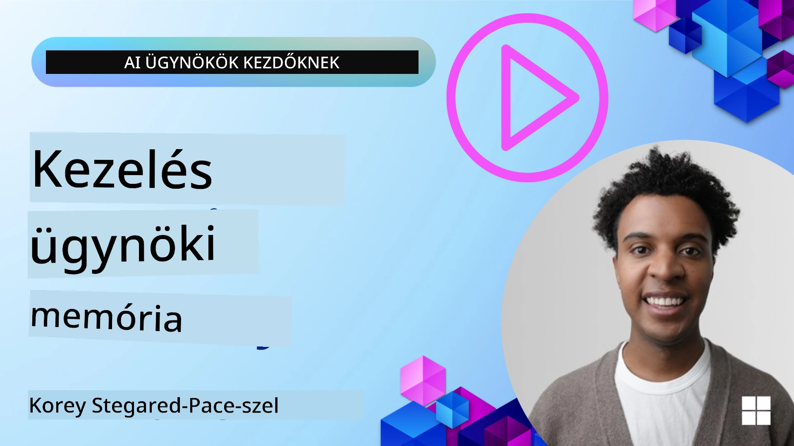

# Memória az AI ügynökök számára  

Az AI ügynökök létrehozásának egyedi előnyeiről beszélve leginkább két dolgot említenek: az eszközök meghívásának képességét a feladatok elvégzéséhez, és az időbeli fejlődés képességét. A memória az alapja egy önfejlesztő ügynök létrehozásának, amely jobb élményeket tud biztosítani a felhasználóink számára.

Ebben a leckében megvizsgáljuk, mi a memória az AI ügynökök számára, hogyan kezelhetjük és használhatjuk azt alkalmazásaink javára.

## Bevezetés

Ez a lecke az alábbiakat foglalja magában:

• **Az AI ügynök memória megértése**: Mi a memória és miért elengedhetetlen az ügynökök számára.

• **A memória megvalósítása és tárolása**: Gyakorlati módszerek az AI ügynökök memóriaképességeinek hozzáadására, összpontosítva a rövid távú és hosszú távú memóriára.

• **Az AI ügynökök önfejlesztővé tétele**: Hogyan teszi lehetővé a memória, hogy az ügynökök megtanuljanak a múltbeli interakciókból és idővel fejlődjenek.

## Elérhető megvalósítások

Ez a lecke két átfogó jegyzetfüzet-tutorialt tartalmaz:

• **[13-agent-memory.ipynb](./13-agent-memory.ipynb)**: Mem0 és Azure AI Search használatával, Microsoft Agent Framework-kel megvalósított memória

• **[13-agent-memory-cognee.ipynb](./13-agent-memory-cognee.ipynb)**: Strukturált memóriát valósít meg Cognee használatával, amely automatikusan építi a tudásgráfot, vizualizálja a gráfot, és intelligens lekérdezést tesz lehetővé

## Tanulási célok

A lecke elvégzése után Ön képes lesz:

• **Megkülönböztetni az AI ügynökök különböző típusú memóriáit**, beleértve a munkamemóriát, rövid távú és hosszú távú memóriát, valamint speciális formákat, mint a személyiség- és epizodikus memória.

• **Megvalósítani és kezelni az AI ügynökök rövid távú és hosszú távú memóriáját** a Microsoft Agent Framework segítségével, olyan eszközöket használva, mint a Mem0, Cognee, Whiteboard memória, és integrálva az Azure AI Search szolgáltatással.

• **Megérteni az önfejlesztő AI ügynökök mögötti elveket**, valamint azt, hogy a megbízható memória-kezelő rendszerek hogyan járulnak hozzá a folyamatos tanuláshoz és alkalmazkodáshoz.

## Az AI ügynök memória megértése

Alapvetően az **AI ügynökök memóriája azokat a mechanizmusokat jelenti, amelyek lehetővé teszik számukra az információk megőrzését és előhívását**. Ez az információ lehet egy beszélgetés konkrét részlete, felhasználói preferenciák, korábbi műveletek vagy akár megtanult minták.

Memória nélkül az AI alkalmazások gyakran állapot nélküli (stateless) módon működnek, ami azt jelenti, hogy minden interakció újrakezdődik. Ez ismétlődő és frusztráló használói élményt eredményez, ahol az ügynök "elfelejti" az előző kontextust vagy preferenciákat.

### Miért fontos a memória?

Az ügynök intelligenciája szorosan kapcsolódik a múltbeli információk előhívási és felhasználási képességéhez. A memória lehetővé teszi az ügynökök számára, hogy:

• **Reflektívak legyenek**: tanuljanak a korábbi cselekvésekből és eredményekből.

• **Interaktívak legyenek**: fenntartsák a kontextust egy folyamatban lévő beszélgetés során.

• **Proaktívak és reaktívak legyenek**: előre jelezzék az igényeket vagy megfelelően reagáljanak korábbi adatok alapján.

• **Autonómak legyenek**: önállóbban működjenek, a tárolt tudásra támaszkodva.

A memória megvalósításának célja, hogy az ügynökök **megbízhatóbbak és képzettebbek** legyenek.

### Memória típusok

#### Munkamemória

Képzeljük el úgy, mint egy vázlatlapot, amelyet az ügynök egyetlen, folyamatban lévő feladat vagy gondolatmenet során használ. Tartalmazza a következő lépéshez szükséges azonnali információkat.

Az AI ügynökök esetében a munkamemória gyakran megragadja a beszélgetés legfontosabb információit, még akkor is, ha a teljes chat előzmény sok és megszakított. A hangsúly a kulcselemek, mint igények, javaslatok, döntések és műveletek kivonatolásán van.

**Munkamemória példa**

Egy utazásfoglaló ügynöknél a munkamemória tartalmazhatja a felhasználó aktuális kérését, például: „Szeretnék egy utat foglalni Párizsba.” Ez a specifikus igény az ügynök azonnali kontextusában van, hogy irányítsa az aktuális interakciót.

#### Rövid távú memória

Ez a memória megőrzi az információkat egyetlen beszélgetés vagy munkamenet időtartamára. Ez a jelenlegi chat kontextusa, amely lehetővé teszi az ügynök számára, hogy visszautaljon a dialógus előző fordulóira.

**Rövid távú memória példa**

Ha a felhasználó megkérdezi: „Mennyibe kerülne egy repülőjegy Párizsba?”, majd folytatja: „És a szállás ott?”, a rövid távú memória biztosítja, hogy az ügynök értse, hogy az „ott” Párizsra utal ugyanabban a beszélgetésben.

#### Hosszú távú memória

Ez az információ több beszélgetés vagy munkamenet során is fennmarad. Lehetővé teszi az ügynökök számára, hogy megjegyezzék a felhasználói preferenciákat, korábbi interakciókat vagy általános tudást hosszabb időn át. Fontos a személyre szabás szempontjából.

**Hosszú távú memória példa**

A hosszú távú memória tárolhatja például, hogy „Ben szeret síelni és szabadtéri tevékenységeket, kávézik hegyi panorámával, és egy korábbi sérülés miatt el akarja kerülni a haladó sípályákat”. Ez az információ, amelyet korábbi interakciókból tanult meg, befolyásolja a jövőbeli utazástervezési ajánlásokat, így nagyon személyre szabottá teszi azokat.

#### Személyiség memória (Persona Memory)

Ez a speciális memória típus segít az ügynöknek egy következetes „személyiséget” vagy „szerepet” kialakítani. Lehetővé teszi, hogy az ügynök emlékezzen magára vagy a megszabott szerepére, így a kommunikáció gördülékenyebb és fókuszáltabb lesz.

**Személyiség memória példa**

Ha az utazási ügynök egy „szakértő sítervezőként” van megtervezve, a személyiség memória megerősítheti ezt a szerepet, befolyásolva a válaszokat, hogy azok szakértői hangvételűek és tudásúak legyenek.

#### Munkafolyamat/Epizodikus memória

Ez a memória tárolja az ügynök lépéseinek sorrendjét egy összetett feladat során, ideértve a sikereket és kudarcokat is. Olyan, mintha egy-egy „epizódot” vagy múltbéli élményt emlékezne meg tanulás céljából.

**Epizodikus memória példa**

Ha az ügynök megpróbált foglalni egy adott járatot, de az nem volt elérhető, az epizodikus memória rögzítheti ezt a hibát, lehetővé téve, hogy az ügynök később alternatív járatokat próbáljon, vagy tájékoztassa a felhasználót erről a problémáról egy következő próbálkozás során jobban tájékozottan.

#### Entitás memória

Ez az entitások (pl. személyek, helyek vagy tárgyak) és események kinyerését és megjegyzését jelenti a beszélgetésekből. Lehetővé teszi az ügynök számára, hogy strukturáltan értse a megbeszélt kulcselemeket.

**Entitás memória példa**

Egy múltbeli utazásról szóló beszélgetésből az ügynök kivonhat olyan entitásokat, mint „Párizs”, „Eiffel-torony” és „vacsora a Le Chat Noir étteremben”. Egy jövőbeli interakcióban az ügynök felidézheti a „Le Chat Noir”-t és felajánlhatja egy új foglalás elkészítését.

#### Strukturált RAG (Retrieval Augmented Generation)

Míg a RAG egy szélesebb körű technika, a „Strukturált RAG” kiemelt, mint egy hatékony memória technológia. Sűrű, strukturált információkat von ki különböző forrásokból (beszélgetések, e-mailek, képek), és ezeket használja fel a pontosság, visszahívás és válaszadási sebesség fokozására. Ellentétben a klasszikus RAG-gel, amely csak szemantikus hasonlóságon alapul, a Strukturált RAG az információ belső szerkezetére is támaszkodik.

**Strukturált RAG példa**

Ahelyett, hogy csak kulcsszavakat egyeztetne, a Strukturált RAG képes egy e-mailből értelmezni a járat adatait (rendeltetési hely, dátum, idő, légitársaság), és strukturált módon tárolni azokat. Ez lehetővé teszi precíz lekérdezéseket, például: „Milyen járatot foglaltam Párizsba kedden?”

## A memória megvalósítása és tárolása

Az AI ügynökök memóriájának megvalósítása egy rendszerezetett folyamatot igényel, azaz a **memóriakezelést**, amely magában foglalja az információ generálását, tárolását, előhívását, integrálását, frissítését és akár „elfelejtését” (vagy törlését). Az előhívás különösen fontos szerepet játszik.

### Speciális memóriaeszközök

#### Mem0

Az egyik módja az ügynök memória tárolásának és kezelésének speciális eszközök használata, mint a Mem0. A Mem0 kitartó memória rétegként működik, lehetővé téve az ügynökök számára, hogy felidézzék a releváns interakciókat, eltárolják a felhasználói preferenciákat és tényszerű kontextust, és tanuljanak a sikerekből és kudarcokból az idő folyamán. Az elképzelés az, hogy az állapot nélküli ügynökökből állapottartóvá váljanak.

Ez egy **kétfázisú memóriafolyamaton** keresztül működik: kivonás és frissítés. Először az ügynök szálához hozzáadott üzeneteket elküldi a Mem0 szolgáltatásnak, amely egy Nagy Nyelvi Modell (LLM) segítségével összefoglalja a beszélgetés előzményeit és kinyeri az új emlékeket. Ezt követően egy LLM-vezérelt frissítési fázis dönt arról, hogy hozzáadja, módosítja vagy törli-e ezeket az emlékeket, amelyeket egy hibrid adattárolóba mentenek, ami tartalmazhat vektoros, gráf- és kulcs-érték adatbázisokat. Ez a rendszer többféle memória típust támogat, és beépíthet gráf memóriát is az entitások közötti kapcsolatok kezelésére.

#### Cognee

Egy másik erőteljes megközelítés a **Cognee** használata, egy nyílt forráskódú szemantikus memória AI ügynökök számára, amely strukturált és strukturálatlan adatokat alakít lekérdezhető tudásgráfokká, melyeket beágyazások támogatnak. A Cognee egy **kettős tárolós architektúrát** kínál, amely a vektoros hasonlósági keresést és a gráfkapcsolatokat kombinálja, lehetővé téve, hogy az ügynök ne csak az információk hasonlóságát értse, hanem hogy a fogalmak hogyan kapcsolódnak egymáshoz.

Kiváló a **hibrid lekérdezésben**, amely ötvözi a vektoros hasonlóságot, a gráfszerkezetet és az LLM-alapú érvelést – a nyers darabok keresésétől a gráfis kérdés-válaszolásig. A rendszer **élő memóriát** tart fenn, amely fejlődik és növekszik, miközben lekérdezhető marad, mint egy összefüggő gráf, támogatva a rövid távú munkamenet-konteksztust és a hosszú távú kitartó memóriát.

A Cognee jegyzetfüzet-tutorial ([13-agent-memory-cognee.ipynb](./13-agent-memory-cognee.ipynb)) bemutatja ennek az egységes memória rétegnek az építését, gyakorlati példákkal a különböző adatforrások bevitelére, a tudásgráf vizualizációjára és a különböző keresési stratégiákkal történő lekérdezésre, az egyes ügynökszükségletek szerint.

### Memória tárolása RAG-gel

A speciális memóriaeszközökön túl, mint a Mem0, használhatja a robusztus keresési szolgáltatásokat, például az **Azure AI Search-t** a memóriák tárolására és előhívására, különösen strukturált RAG-hez.

Ez lehetővé teszi, hogy az ügynök válaszait saját adataira alapozza, biztosítva relevánsabb és pontosabb válaszokat. Az Azure AI Search alkalmas arra, hogy tárolja a felhasználóra szabott utazási emlékeket, termékkatalógusokat vagy bármilyen más domain-specifikus tudást.

Az Azure AI Search támogatja a **Strukturált RAG** képességeket, amelyek kiválóak sűrű, strukturált információk kivonásában és előhívásában nagy adathalmazokból, például beszélgetési előzményekből, e-mailekből vagy akár képekből. Ez „emberfeletti pontosságot és visszahívást” biztosít a hagyományos szövegtöredékek és beágyazások alapú megközelítésekhez képest.

## Az AI ügynökök önfejlesztővé tétele

Az önfejlesztő ügynököknél gyakori mintázat egy **„tudásügynök”** bevezetése. Ez a különálló ügynök figyeli a fő beszélgetést a felhasználó és a fő ügynök között. Szerepe:

1. **Értékes információk azonosítása**: Meghatározni, hogy a beszélgetés bármely része érdemes-e általános tudásként vagy konkrét felhasználói preferenciaként eltárolni.

2. **Kivonás és összefoglalás**: A lényeges tanulság vagy preferencia kivonatolása a beszélgetésből.

3. **Tárolás egy tudásbázisban**: Az így kivont információt tartósan eltárolja, gyakran egy vektoralapú adatbázisban, hogy később elő lehessen hívni.

4. **A jövőbeli lekérdezések kiegészítése**: Amikor a felhasználó új lekérdezést indít, a tudásügynök előhívja a releváns tárolt információt, és hozzáfűzi a felhasználói prompthoz, ezzel létfontosságú kontextust biztosítva a fő ügynöknek (hasonlóan a RAG-hez).

### Memória optimalizálások

• **Késleltetés kezelése**: Annak érdekében, hogy ne lassítsa a felhasználói interakciókat, eleinte olcsóbb, gyorsabb modellt használhatnak annak gyors ellenőrzésére, hogy az információ érdemes-e eltárolásra vagy előhívásra, és csak szükség esetén hívják meg a bonyolultabb kivonási/lekérdezési folyamatot.

• **Tudásbázis karbantartása**: Egy növekvő tudásbázis esetén a ritkábban használt információkat „hideg tárolóba” lehet áthelyezni a költségek kezelésére.

## Több kérdése van az ügynöki memóriával kapcsolatban?

Csatlakozzon a [Microsoft Foundry Discord](https://aka.ms/ai-agents/discord) közösséghez, hogy találkozzon más tanulókkal, részt vegyen konzultációkon és választ kapjon AI ügynökökkel kapcsolatos kérdéseire.

---

<!-- CO-OP TRANSLATOR DISCLAIMER START -->
**Jogi nyilatkozat**:  
Ezt a dokumentumot az AI fordító szolgáltatás, a [Co-op Translator](https://github.com/Azure/co-op-translator) segítségével fordítottuk le. Bár pontosságra törekszünk, kérjük, vegye figyelembe, hogy az automatikus fordítások tartalmazhatnak hibákat vagy pontatlanságokat. Az eredeti dokumentum az anyanyelvén tekintendő hiteles forrásnak. Fontos információk esetén javasoljuk szakmai emberi fordítás igénybevételét. Nem vállalunk felelősséget a fordítás használatából eredő félreértésekért vagy félreértelmezésekért.
<!-- CO-OP TRANSLATOR DISCLAIMER END -->