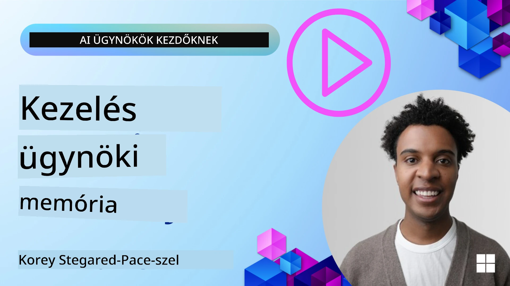

# Memória az AI ügynökök számára 

Amikor az AI ügynökök egyedi előnyeiről beszélünk, főként két dolog kerül szóba: az eszközök meghívási képessége a feladatok elvégzéséhez és a folyamatos fejlődés képessége. A memória az önfejlesztő ügynök létrehozásának alapja, amely jobb élményt nyújthat a felhasználóink számára.

Ebben a leckében megnézzük, mi a memória az AI ügynökök számára, és hogyan kezelhetjük és használhatjuk azt alkalmazásaink javára.

## Bevezetés

Ez a lecke a következőket fedi le:

• **Az AI ügynök memória megértése**: Mi a memória és miért alapvető az ügynökök számára.

• **Memória megvalósítása és tárolása**: Gyakorlati módszerek az AI ügynökök memória képességeinek bővítésére, különös tekintettel a rövid- és hosszútávú memóriára.

• **AI ügynökök önfejlesztővé tétele**: Hogyan teszi lehetővé a memória, hogy az ügynökök tanuljanak a múltbeli interakciókból és folyamatosan fejlődjenek.

## Elérhető megvalósítások

Ez a lecke két átfogó jegyzetfüzetes oktatóanyagot tartalmaz:

• **[13-agent-memory.ipynb](./13-agent-memory.ipynb)**: Mem0 és Azure AI Search használatával valósítja meg a memóriát a Microsoft Agent Framework-kel

• **[13-agent-memory-cognee.ipynb](./13-agent-memory-cognee.ipynb)**: Strukturált memóriát valósít meg Cognee segítségével, automatikusan felépítve egy tudásgráfot, amely embeddek által támasztott alapon működik, megjeleníti a gráfot és intelligens visszakeresést biztosít

## Tanulási célok

A lecke elvégzése után tudni fogod, hogyan kell:

• **Megkülönböztetni az AI ügynök memória különböző típusait**, beleértve a munkamemóriát, rövid- és hosszútávú memóriát, valamint speciális formákat, mint a persona és epizodikus memória.

• **Megvalósítani és kezelni a rövid- és hosszútávú memóriát** AI ügynökök számára a Microsoft Agent Framework segítségével, kihasználva olyan eszközöket, mint a Mem0, Cognee, Whiteboard memória, és integrálva az Azure AI Search-t.

• **Megérteni az önfejlesztő AI ügynökök alapelveit** és hogyan járulnak hozzá a robusztus memória kezelő rendszerek a folyamatos tanuláshoz és alkalmazkodáshoz.

## Az AI ügynök memória megértése

Lényegében az **AI ügynökök memóriája azokat a mechanizmusokat jelenti, amelyek lehetővé teszik számukra az információ megtartását és előhívását**. Ez az információ tartalmazhat konkrét részleteket egy beszélgetésről, felhasználói preferenciákat, korábbi műveleteket vagy akár tanult mintákat.

Memória nélkül az AI alkalmazások gyakran állapot nélküli (stateless) jellegűek, vagyis minden interakció újrakezdődik. Ez ismétlődő és frusztráló felhasználói élményhez vezet, ahol az ügynök "elfelejti" az előző kontextust vagy preferenciákat.

### Miért fontos a memória?

egy ügynök intelligenciája szorosan kapcsolódik a múltbéli információk előhívásához és felhasználásához. A memória lehetővé teszi, hogy az ügynökök legyenek:

• **Reflektív**: tanulva a múltbéli cselekedetekből és eredményekből.

• **Interaktív**: fenntartva a kontextust egy folyamatos beszélgetés során.

• **Proaktív és reaktív**: előrejelezve szükségleteket vagy megfelelően reagálva a történelmi adatok alapján.

• **Autonóm**: önállóbban működve tárolt tudásra támaszkodva.

A memória megvalósításának célja, hogy az ügynökök megbízhatóbbak és képességeikben gazdagabbak legyenek.

### A memória típusai

#### Munkamemória

Gondolj erre úgy, mint egy jegyzetlapra, amit egy ügynök egyetlen, folyamatban lévő feladat vagy gondolatmenet során használ. Azonnali információkat tartalmaz, amelyek a következő lépés kiszámításához szükségesek.

AI ügynökök esetében a munkamemória gyakran foglalja magába a beszélgetés legfontosabb, releváns információit, még ha a teljes csevegési előzmény hosszú vagy levágott is. Az kulcselemek kiemelésére összpontosít, mint a követelmények, javaslatok, döntések és műveletek.

**Munkamemória példa**

Egy utazásszervező ügynöknél a munkamemória rögzítheti a felhasználó aktuális kérését, például: "Szeretnék egy utat foglalni Párizsba." Ez a konkrét igény az ügynök közvetlen kontextusában marad, hogy irányítsa a jelenlegi interakciót.

#### Rövid távú memória

Ez a memória egyetlen beszélgetés vagy munkamenet időtartamára megőrzi az információkat. Ez az aktuális csevegés kontextusa, amely lehetővé teszi az ügynök számára, hogy visszautaljon a párbeszéd korábbi fordulóira.

A [Microsoft Agent Framework](https://github.com/microsoft/agent-framework) Python SDK mintákban ez az `AgentSession`-nel azonosítható, amely az `agent.create_session()`-nel jön létre. A munkamenet a keretrendszer beépített rövid távú memóriája: elérhetővé teszi a beszélgetés kontextusát, amíg ugyanazt a munkamenetet újra felhasználják, de a kontextus nem marad meg, amikor a munkamenet véget ér vagy az alkalmazás újraindul. A hosszútávú memóriát használjuk azoknak a tényeknek és preferenciáknak a megőrzésére, amelyeknek túl kell élniük a munkameneteket, általában adatbázison, vektor indexen vagy más tartós tárolón keresztül.

**Rövid távú memória példa**

Ha egy felhasználó megkérdezi: "Mennyibe kerül egy repülőjegy Párizsba?" majd folytatja: "És mi a helyzet a szállással ott?", a rövid távú memória biztosítja, hogy az ügynök tudja, hogy az "ott" a "Párizs"-ra vonatkozik ugyanabban a beszélgetésben.

#### Hosszú távú memória

Ez olyan információ, amely több beszélgetésen vagy munkameneten át megmarad. Lehetővé teszi az ügynökök számára, hogy megjegyezzék a felhasználói preferenciákat, korábbi interakciókat vagy általános tudást hosszabb időszakon át. Ez fontos a személyre szabáshoz.

**Hosszú távú memória példa**

Egy hosszútávú memória eltárolhatja, hogy "Ben szeret síelni és kinti tevékenységeket, kávét szeret hegymenettel, és el akarja kerülni a nehéz sípályákat egy korábbi sérülése miatt". Ez az előző interakciókból tanult információ befolyásolja a jövőbeli utazástervezési ajánlásokat, így nagyon személyre szabottá téve azokat.

#### Persona memória

Ez a speciális memória típus segít az ügynöknek egy következetes "személyiség" vagy "persona" kialakításában. Lehetővé teszi az ügynök számára, hogy megjegyezzen részleteket önmagáról vagy a szándékolt szerepéről, ezzel gördülékenyebbé és fókuszáltabbá téve a kommunikációt.

**Persona memória példa**
Ha az utazási ügynök úgy van megtervezve, hogy egy "sílövő szakértőként" működjön, a persona memória megerősítheti ezt a szerepet, befolyásolva a válaszokat, hogy szakértői hangvételűek és tudásúak legyenek.

#### Munkafolyamat/Epizodikus memória

Ez a memória tárolja az ügynök által egy összetett feladat során végrehajtott lépések sorozatát, beleértve a sikereket és kudarcokat is. Olyan, mint a korábbi "epizódok" vagy élmények megjegyzése, hogy tanuljon belőlük.

**Epizodikus memória példa**

Ha az ügynök megpróbált egy konkrét repülőjáratot lefoglalni, de az nem volt elérhető, az epizodikus memória rögzítheti ezt a kudarcot, lehetővé téve az alternatív járatok kipróbálását vagy tájékoztatást a felhasználónak a következő próbálkozás során tájékozottabban.

#### Entitás memória

Ez magában foglalja konkrét entitások (például emberek, helyek vagy tárgyak) és események kinyerését és megjegyzését a beszélgetésekből. Lehetővé teszi az ügynök számára egy strukturált megértés kialakítását a megbeszélt kulcselemekről.

**Entitás memória példa**

Egy múltbéli utazásról szóló beszélgetésből az ügynök kinyerheti a "Párizs", "Eiffel-torony" és "vacsora a Le Chat Noir étteremben" entitásokat. Egy későbbi interakcióban az ügynök emlékezhet a "Le Chat Noir"-ra, és felajánlhat egy új foglalást ott.

#### Strukturált RAG (Retrieval Augmented Generation)

Míg a RAG egy tágabb technika, a "Strukturált RAG" kiemeltként egy erőteljes memória technológia. Sűrű, strukturált információkat von ki különféle forrásokból (beszélgetések, e-mailek, képek), és azt használja a válaszok pontosságának, előhívásának és sebességének növelésére. Ellentétben a klasszikus RAG-gal, amely kizárólag szemantikai hasonlóságra támaszkodik, a Strukturált RAG az információ beépített szerkezetével dolgozik.

**Strukturált RAG példa**

Ahelyett, hogy csak kulcsszavakat keresne, a Strukturált RAG képes kinyerni egy e-mailből a repülőjegy részleteit (célállomás, dátum, idő, légitársaság) és strukturált módon tárolni azokat. Ez lehetővé teszi pontos lekérdezéseket, például: "Milyen repülőjáratot foglaltam Párizsba kedden?"

## Memória megvalósítása és tárolása

Az AI ügynökök memóriájának megvalósítása magában foglalja a **memóriakezelés** rendszerszintű folyamatát, amely generálást, tárolást, visszakeresést, integrálást, frissítést és akár "elfelejtést" (vagy törlést) is tartalmaz. A visszakeresés különösen kritikus elem.

### Speciális memória eszközök

#### Mem0

Egy módja az ügynök memória tárolásának és kezelésének speciális eszközök használata, mint a Mem0. A Mem0 tartós memória rétegként működik, lehetővé téve, hogy az ügynökök előhívják releváns interakcióikat, tárolják a felhasználói preferenciákat és a tényszerű kontextust, valamint tanuljanak a sikerekből és kudarcokból az idő múlásával. Az alapötlet az, hogy az állapot nélküli ügynökök állapotossá váljanak.

Kétfázisú memória folyamaton alapul: kivonás és frissítés. Először az üzenetek, amelyeket egy ügynök szálához adnak, elküldésre kerülnek a Mem0 szolgáltatásnak, amely egy Nagy Nyelvi Modell (LLM) használatával összefoglalja a beszélgetés történetét és új emlékeket von ki. Ezután egy LLM-alapú frissítési fázis dönt arról, hogy hozzáadja, módosítja vagy törli az emlékeket, tárolva azokat egy hibrid adattárolóban, amely lehet vektor, gráf vagy kulcs-érték adatbázis. Ez a rendszer különféle memória típusokat is támogat, és képes gráf memóriát alkalmazni az entitások közötti kapcsolatok kezelésére.

#### Cognee

Egy másik erőteljes megközelítés a **Cognee** használata, amely egy nyílt forráskódú szemantikus memória AI ügynökökhöz, mely strukturált és nem strukturált adatokat alakít át lekérdezhető tudásgráfokká, amelyek embeddek által vannak alátámasztva. A Cognee kettős tárolási architektúrát kínál, ötvözve a vektor alapú hasonlóság keresést a gráf kapcsolatokkal, lehetővé téve az ügynökök számára, hogy ne csak azt értsék meg, milyen információk hasonlóak, hanem miként kapcsolódnak a fogalmak egymáshoz.

Kiemelkedik a **hibrid lekérdezésben**, amely ötvözi a vektor hasonlóságot, a gráf struktúrát és az LLM-alapú érvelést – a nyers adat darabkák keresésétől a gráf tudatos kérdés-válaszolásig. A rendszer fenntart egy **élő memóriát**, amely fejlődik és növekszik, miközben lekérdezhető marad mint egy összefüggő gráf, támogatva mind a rövid távú munkamenet kontextust, mind a hosszú távú tartós memóriát.

A Cognee jegyzetfüzetes oktatóanyag ([13-agent-memory-cognee.ipynb](./13-agent-memory-cognee.ipynb)) bemutatja ez egységes memória réteg felépítését, gyakorlati példákkal különféle adatforrások bevitelére, a tudásgráf vizualizálására és keresési stratégiák alkalmazására, amelyek az adott ügynök specifikus igényeihez igazodnak.

### Memória tárolása RAG segítségével

A Mem0-hoz hasonló speciális memória eszközökön túl, kihasználhatók robusztus keresési szolgáltatások, mint az **Azure AI Search memória tárolására és előhívására háttérként**, különösen strukturált RAG esetében.

Ez lehetővé teszi, hogy az ügynök válaszait a saját adataiddal alapozd meg, így relevánsabb és pontosabb válaszokat kaphatsz. Az Azure AI Search tárolhat felhasználó-specifikus utazási memóriákat, termékkatalógusokat vagy bármilyen más domain-specifikus tudást.

Az Azure AI Search támogat olyan képességeket, mint a **Strukturált RAG**, amely kiválóan alkalmas arra, hogy sűrű, strukturált információkat vonjon ki és hívjon elő nagy adatállományokból, például beszélgetési előzményekből, e-mailekből vagy akár képekből. Ez "emberfeletti pontosságot és előhívást" biztosít a hagyományos szöveges darabolás és embeddelés megközelítésekhez képest.

## Az AI ügynökök önfejlesztése

Az önfejlesztő ügynökök tipikus mintája egy **"tudásügynök"** bevezetése. Ez a különálló ügynök figyeli a fő beszélgetést a felhasználó és a primer ügynök között. Szerepe:

1. **Értékes információk azonosítása**: Meghatározni, hogy a beszélgetés bármely része megéri-e elmenteni általános tudásként vagy specifikus felhasználói preferenciaként.

2. **Kivonatolás és összefoglalás**: A beszélgetésből a lényeges tanulság vagy preferencia kiszűrése.

3. **Tudásbázisba tárolás**: Ennek a kinyert információnak a tartós tárolása, gyakran vektor adatbázisban, hogy később előhívható legyen.

4. **Jövőbeli lekérdezések kiegészítése**: Amikor a felhasználó új kérdést indít, a tudásügynök előhívja a releváns tárolt információkat, és hozzáfűzi azokat a felhasználó promptjához, kritikus kontextust biztosítva a primer ügynök számára (hasonlóan a RAG-hez).

### Optimalizálások a memóriához

• **Késleltetés kezelése**: Az interakciók lassítása elkerülése érdekében kezdetben egy olcsóbb, gyorsabb modellt használhatunk, amely gyorsan ellenőrzi, hogy az információ érdemes-e tárolásra vagy előhívásra, csak ha szükséges, hívva meg a bonyolultabb kivonatoló/visszakereső folyamatot.

• **Tudásbázis karbantartása**: Egy növekvő tudásbázis esetén a ritkábban használt információk "hideg tárolóba" helyezhetők a költségek kezelése érdekében.

## További kérdéseid vannak az ügynök memória kapcsán?

Csatlakozz a [Microsoft Foundry Discord](https://discord.com/invite/ATgtXmAS5D) közösséghez, hogy találkozz más tanulókkal, részt vegyél konzultációs órákon, és választ kapj AI ügynökökkel kapcsolatos kérdéseidre.

---

<!-- CO-OP TRANSLATOR DISCLAIMER START -->
**Jogi nyilatkozat**:
Ez a dokumentum az AI fordítási szolgáltatás, a [Co-op Translator](https://github.com/Azure/co-op-translator) segítségével készült. Bár az pontosságra törekszünk, kérjük, vegye figyelembe, hogy az automatikus fordítások hibákat vagy pontatlanságokat tartalmazhatnak. Az eredeti dokumentum az anyanyelvén tekintendő hiteles forrásnak. Fontos információk esetén professzionális emberi fordítást javasolunk. Nem vállalunk felelősséget semmilyen félreértésért vagy téves értelmezésért, amely ebből a fordításból ered.
<!-- CO-OP TRANSLATOR DISCLAIMER END -->