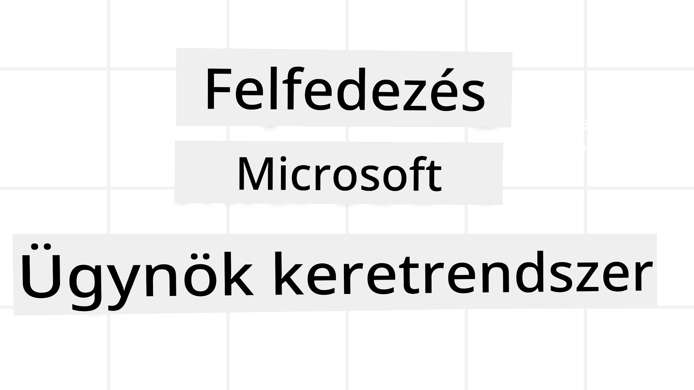
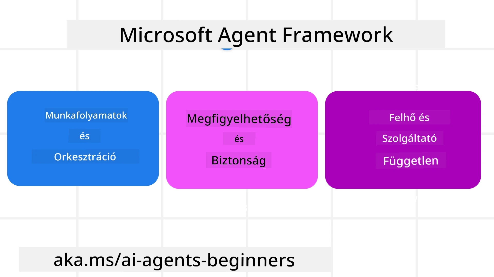

# A Microsoft Agent Framework felfedezése



### Bevezetés

Ebben a leckében az alábbiakról lesz szó:

- A Microsoft Agent Framework megismerése: főbb jellemzők és értéke  
- A Microsoft Agent Framework kulcsfogalmainak feltérképezése
- Fejlett MAF minták: munkafolyamatok, middleware és memória

## Tanulási célok

A lecke elvégzése után tudni fogod, hogyan:

- Gyártásra kész AI-ügynökök építése a Microsoft Agent Framework használatával
- A Microsoft Agent Framework alapfunkcióinak alkalmazása ügynökalapú használati esetekre
- Fejlett minták használata, beleértve a munkafolyamatokat, a middleware-t és a megfigyelhetőséget (observability)

## Code Samples 

A [Microsoft Agent Framework (MAF)](https://aka.ms/ai-agents-beginners/agent-framewrok) kódpéldái megtalálhatók ebben a tárolóban a `xx-python-agent-framework` és `xx-dotnet-agent-framework` fájlok alatt.

## A Microsoft Agent Framework megértése



[Microsoft Agent Framework (MAF)](https://aka.ms/ai-agents-beginners/agent-framewrok) a Microsoft egységes keretrendszere AI-ügynökök létrehozásához. Rugalmasságot kínál a különféle ügynökalapú használati esetek kezeléséhez, amelyek mind a gyártási, mind a kutatási környezetekben előfordulnak, többek között:

- **Szekvenciális ügynök-orkesztráció** olyan helyzetekben, ahol lépésről lépésre történő munkafolyamatokra van szükség.
- **Párhuzamos (konkurens) orkesztráció** olyan helyzetekben, ahol az ügynököknek egyszerre kell elvégezniük a feladatokat.
- **Csoportos csevegés orkesztráció** olyan helyzetekben, ahol az ügynökök együttműködhetnek egy feladaton.
- **Átadási orkesztráció** olyan helyzetekben, ahol az ügynökök a részfeladatok elvégzése során adják át egymásnak a feladatot.
- **Magnetic Orchestration** olyan helyzetekben, ahol egy menedzserügynök feladatlistát hoz létre és módosít, és koordinálja az alügynököket a feladat elvégzéséhez.

Az AI-ügynökök éles környezetben történő üzembe helyezéséhez a MAF a következő funkciókat is tartalmazza:

- **Megfigyelhetőség (Observability)** OpenTelemetry használatával, ahol az AI-ügynök minden művelete — beleértve az eszközmeghívásokat, az orkesztráció lépéseit, az érvelési folyamatokat és a teljesítménymonitorozást Microsoft Foundry irányítópultokon keresztül — nyomon követhető.
- **Biztonság** az ügynökök natívan Microsoft Foundry-ban történő üzemeltetésével, amely olyan biztonsági vezérlőket tartalmaz, mint szerepalapú hozzáférés, privát adatkezelés és beépített tartalombiztonság.
- **Tartósság**: az ügynök szálak és munkafolyamatok szüneteltethetők, folytathatók és hibákból helyreállíthatók, ami lehetővé teszi a hosszabb lefutású folyamatokat.
- **Irányítás**: támogatottak az ember a hurkon belüli (human-in-the-loop) munkafolyamatok, ahol a feladatok emberi jóváhagyást igénylőként vannak megjelölve.

A Microsoft Agent Framework interoperabilitásra is fókuszál az alábbi módokon:

- **Felhőfüggetlen (Cloud-agnostic)** - Az ügynökök futtathatók konténerekben, helyben és több különböző felhőn átívelve.
- **Szolgáltatófüggetlen (Provider-agnostic)** - Az ügynökök létrehozhatók a preferált SDK-val, beleértve az Azure OpenAI-t és az OpenAI-t
- **Nyílt szabványok integrálása** - Az ügynökök olyan protokollokat használhatnak, mint az Agent-to-Agent(A2A) és a Model Context Protocol (MCP), hogy felfedezzék és használják más ügynököket és eszközöket.
- **Bővítmények és csatlakozók** - Kapcsolatok hozhatók létre adat- és memória-szolgáltatásokhoz, mint például a Microsoft Fabric, SharePoint, Pinecone és Qdrant.

Nézzük meg, hogyan alkalmazzák ezeket a funkciókat a Microsoft Agent Framework néhány alapvető fogalmára.

## A Microsoft Agent Framework kulcsfogalmai

### Ügynökök


**Ügynökök létrehozása**

Az ügynök létrehozása az inferencia szolgáltatás (LLM Provider), az AI-ügynök által követendő utasítások és egy hozzárendelt `name` megadásával történik:

```python
agent = AzureOpenAIChatClient(credential=AzureCliCredential()).create_agent( instructions="You are good at recommending trips to customers based on their preferences.", name="TripRecommender" )
```

A fenti példa `Azure OpenAI`-t használ, de az ügynökök számos szolgáltatással létrehozhatók, beleértve a `Microsoft Foundry Agent Service`-t is:

```python
AzureAIAgentClient(async_credential=credential).create_agent( name="HelperAgent", instructions="You are a helpful assistant." ) as agent
```

OpenAI `Responses`, `ChatCompletion` API-k

```python
agent = OpenAIResponsesClient().create_agent( name="WeatherBot", instructions="You are a helpful weather assistant.", )
```

```python
agent = OpenAIChatClient().create_agent( name="HelpfulAssistant", instructions="You are a helpful assistant.", )
```

vagy távoli ügynökök az A2A protokoll használatával:

```python
agent = A2AAgent( name=agent_card.name, description=agent_card.description, agent_card=agent_card, url="https://your-a2a-agent-host" )
```

**Ügynökök futtatása**

Az ügynökök futtatása a `.run` vagy `.run_stream` metódusokkal történik, nem-streaming és streaming válaszok esetén.

```python
result = await agent.run("What are good places to visit in Amsterdam?")
print(result.text)
```

```python
async for update in agent.run_stream("What are the good places to visit in Amsterdam?"):
    if update.text:
        print(update.text, end="", flush=True)

```

Minden egyes ügynökfuttatáshoz beállítási lehetőségek is tartozhatnak olyan paraméterek testreszabására, mint a `max_tokens`, amelyet az ügynök használ, a `tools`, amelyeket az ügynök meghívhat, vagy akár maga a `model`, amelyet az ügynök használ.

Ez hasznos olyan esetekben, amikor a felhasználó feladatának elvégzéséhez konkrét modellekre vagy eszközökre van szükség.

**Eszközök**

Az eszközök definiálhatók az ügynök létrehozásakor:

```python
def get_attractions( location: Annotated[str, Field(description="The location to get the top tourist attractions for")], ) -> str: """Get the top tourist attractions for a given location.""" return f"The top attractions for {location} are." 


# Amikor egy ChatAgentet közvetlenül hozol létre

agent = ChatAgent( chat_client=OpenAIChatClient(), instructions="You are a helpful assistant", tools=[get_attractions]

```

és az ügynök futtatásakor is:

```python

result1 = await agent.run( "What's the best place to visit in Seattle?", tools=[get_attractions] # Az eszköz csak erre a futtatásra érhető el )
```

**Ügynök szálak**

Az ügynök szálak többfordulós beszélgetések kezelésére szolgálnak. A szálak létrehozhatók a következő módokon:

- A `get_new_thread()` használata, amely lehetővé teszi a szál hosszabb távú mentését
- Automatikusan létrehozni egy szálat az ügynök futtatásakor, amely csak az aktuális futás ideje alatt létezik.

Egy szál létrehozásához a kód így néz ki:

```python
# Hozzon létre egy új szálat.
thread = agent.get_new_thread() # Futtassa az ügynököt a szálon.
response = await agent.run("Hello, I am here to help you book travel. Where would you like to go?", thread=thread)

```

A szálat ezután sorosíthatod, hogy későbbi felhasználásra el legyen tárolva:

```python
# Hozzon létre egy új szálat.
thread = agent.get_new_thread() 

# Futtassa az ügynököt a szál segítségével.

response = await agent.run("Hello, how are you?", thread=thread) 

# Szerializálja a szálat tárolásra.

serialized_thread = await thread.serialize() 

# A tárolóból való betöltés után deszerializálja a szál állapotát.

resumed_thread = await agent.deserialize_thread(serialized_thread)
```

**Ügynök middleware**

Az ügynökök eszközökkel és LLM-ekkel lépnek kapcsolatba a felhasználói feladatok elvégzéséhez. Bizonyos helyzetekben szeretnénk közbeavatkozni vagy nyomon követni ezeket az interakciókat. Az ügynök middleware lehetővé teszi ezt az alábbi módokon:

*Function Middleware*

Ez a middleware lehetővé teszi, hogy egy műveletet hajtsunk végre az ügynök és egy a funkció/eszköz meghívása között. Egy példa erre, amikor naplózást szeretnénk végezni a függvényhíváson.

A lenti kódban a `next` határozza meg, hogy a következő middleware-t vagy magát a tényleges függvényt kell-e meghívni.

```python
async def logging_function_middleware(
    context: FunctionInvocationContext,
    next: Callable[[FunctionInvocationContext], Awaitable[None]],
) -> None:
    """Function middleware that logs function execution."""
    # Előfeldolgozás: Naplózás a függvény végrehajtása előtt
    print(f"[Function] Calling {context.function.name}")

    # Tovább a következő middleware-hez vagy a függvény végrehajtásához
    await next(context)

    # Utófeldolgozás: Naplózás a függvény végrehajtása után
    print(f"[Function] {context.function.name} completed")
```

*Chat Middleware*

Ez a middleware lehetővé teszi, hogy egy műveletet hajtsunk végre vagy naplózzunk az ügynök és az LLM-nek küldött kérések között.

Ez tartalmaz fontos információkat, mint például az AI szolgáltatásnak küldött `messages`.

```python
async def logging_chat_middleware(
    context: ChatContext,
    next: Callable[[ChatContext], Awaitable[None]],
) -> None:
    """Chat middleware that logs AI interactions."""
    # Előfeldolgozás: Naplózás az MI-hívás előtt
    print(f"[Chat] Sending {len(context.messages)} messages to AI")

    # Folytassa a következő middleware-hez vagy MI-szolgáltatáshoz
    await next(context)

    # Utófeldolgozás: Naplózás az MI-válasz után
    print("[Chat] AI response received")

```

**Ügynök memória**

Ahogy az a `Agentic Memory` leckében szerepel, a memória fontos eleme annak, hogy az ügynök különböző kontextusokban is működni tudjon. A MAF többféle memóriatípust kínál:

*In-Memory Storage*

Ez az a memória, amely a szálakban tárolódik az alkalmazás futása közben.

```python
# Hozzon létre egy új szálat.
thread = agent.get_new_thread() # Futtassa az ügynököt a szállal.
response = await agent.run("Hello, I am here to help you book travel. Where would you like to go?", thread=thread)
```

*Persistent Messages*

Ezt a memóriát akkor használjuk, amikor a beszélgetés előzményeit több munkameneten keresztül tároljuk. A `chat_message_store_factory` segítségével definiálható:

```python
from agent_framework import ChatMessageStore

# Hozzon létre egy egyéni üzenettárolót
def create_message_store():
    return ChatMessageStore()

agent = ChatAgent(
    chat_client=OpenAIChatClient(),
    instructions="You are a Travel assistant.",
    chat_message_store_factory=create_message_store
)

```

*Dynamic Memory*

Ez a memória a kontextushoz adódik az ügynökök futtatása előtt. Ezek a memóriák külső szolgáltatásokban is tárolhatók, például mem0-ban:

```python
from agent_framework.mem0 import Mem0Provider

# Mem0 használata fejlett memóriafunkciókhoz
memory_provider = Mem0Provider(
    api_key="your-mem0-api-key",
    user_id="user_123",
    application_id="my_app"
)

agent = ChatAgent(
    chat_client=OpenAIChatClient(),
    instructions="You are a helpful assistant with memory.",
    context_providers=memory_provider
)

```

**Ügynök megfigyelhetősége**

A megfigyelhetőség fontos a megbízható és karbantartható ügynökrendszerek építéséhez. A MAF integrálva van az OpenTelemetry-vel, hogy jobb megfigyelhetőséget biztosítson nyomkövetéssel és metrikákkal.

```python
from agent_framework.observability import get_tracer, get_meter

tracer = get_tracer()
meter = get_meter()
with tracer.start_as_current_span("my_custom_span"):
    # csinálj valamit
    pass
counter = meter.create_counter("my_custom_counter")
counter.add(1, {"key": "value"})
```

### Munkafolyamatok

A MAF munkafolyamatokat kínál, amelyek előre definiált lépések egy feladat elvégzéséhez, és amelyekben az AI-ügynökök komponensekként működnek.

A munkafolyamatok különböző komponensekből állnak, amelyek jobb vezérlési folyamatot tesznek lehetővé. A munkafolyamatok lehetővé teszik a **többügynökös orkesztrációt** és a **checkpointinget** a munkafolyamat állapotának mentéséhez.

A munkafolyamat alapvető összetevői:

**Végrehajtók**

A végrehajtók bemeneti üzeneteket kapnak, végrehajtják a rájuk bízott feladatokat, majd kimeneti üzenetet állítanak elő. Ez előreviszi a munkafolyamatot a nagyobb feladat teljesítése felé. A végrehajtók lehetnek AI-ügynökök vagy egyedi logikák.

**Élek**

Az élek a munkafolyamatban az üzenetek áramlását határozzák meg. Ezek lehetnek:

*Direct Edges* - Egyszerű egy-az-egyhez kapcsolat a végrehajtók között:

```python
from agent_framework import WorkflowBuilder

builder = WorkflowBuilder()
builder.add_edge(source_executor, target_executor)
builder.set_start_executor(source_executor)
workflow = builder.build()
```

*Conditional Edges* - Olyan élek, amelyek akkor aktiválódnak, ha egy bizonyos feltétel teljesül. Például ha a szállodai szobák nem elérhetőek, egy végrehajtó más lehetőségeket javasolhat.

*Switch-case Edges* - Az üzenetek más-más végrehajtókhoz irányítása a meghatározott feltételek alapján. Például ha az utazó ügyfélnek prioritásos hozzáférése van, a feladatait egy másik munkafolyamat kezeli.

*Fan-out Edges* - Egy üzenet küldése több célponthoz.

*Fan-in Edges* - Több üzenet összegyűjtése különböző végrehajtóktól és egy célpontnak továbbítása.

**Események**

A jobb megfigyelhetőség érdekében a MAF beépített eseményeket kínál a végrehajtáshoz, többek között az alábbiakat:

- `WorkflowStartedEvent`  - A munkafolyamat végrehajtása elkezdődik
- `WorkflowOutputEvent` - A munkafolyamat kimenetet állít elő
- `WorkflowErrorEvent` - A munkafolyamat hibába ütközik
- `ExecutorInvokeEvent`  - A végrehajtó megkezdi a feldolgozást
- `ExecutorCompleteEvent`  -  A végrehajtó befejezi a feldolgozást
- `RequestInfoEvent` - Kérelem kerül kiadásra

## Fejlett MAF minták

A fenti szakaszok lefedik a Microsoft Agent Framework kulcsfogalmait. Ahogy összetettebb ügynököket építesz, érdemes megfontolni az alábbi fejlett mintákat:

- **Middleware összeállítása (Composition)**: Több middleware-kezelő (naplózás, hitelesítés, sebességkorlátozás) láncolása funkció- és chat-middleware használatával az ügynök viselkedésének finomhangolásához.
- **Munkafolyamat ellenőrzőpontok (Checkpointing)**: Használj munkafolyamat eseményeket és sorosítást a hosszú futású ügynökfolyamatok mentéséhez és folytatásához.
- **Dinamikus eszközválasztás**: Kombináld az eszközleírásokra alapuló RAG-et a MAF eszközregisztrációjával, hogy lekérdezésenként csak a releváns eszközök jelenjenek meg.
- **Többügynökös átadás (Handoff)**: Használj munkafolyamat éleket és feltételes útválasztást a specializált ügynökök közötti átadások orkesztrálásához.

## Code Samples 

A Microsoft Agent Framework kódpéldái megtalálhatók ebben a tárolóban a `xx-python-agent-framework` és `xx-dotnet-agent-framework` fájlok alatt.

## További kérdéseid vannak a Microsoft Agent Frameworkkel kapcsolatban?

Csatlakozz a [Microsoft Foundry Discordhoz](https://aka.ms/ai-agents/discord), hogy találkozz más tanulókkal, részt vegyél office hourokon és választ kapj az AI-ügynökökkel kapcsolatos kérdéseidre.

---

<!-- CO-OP TRANSLATOR DISCLAIMER START -->
Felelősségkizárás:
Ez a dokumentum a Co-op Translator (https://github.com/Azure/co-op-translator) nevű mesterséges intelligencia alapú fordítószolgáltatás segítségével készült. Bár törekszünk a pontosságra, kérjük, vegye figyelembe, hogy az automatikus fordítások hibákat vagy pontatlanságokat tartalmazhatnak. Az eredeti, anyanyelvi dokumentum tekintendő a hiteles forrásnak. Kritikus információk esetén javasolt professzionális, emberi fordítást igénybe venni. Nem vállalunk felelősséget a fordítás használatából eredő félreértésekért vagy téves értelmezésekért.
<!-- CO-OP TRANSLATOR DISCLAIMER END -->