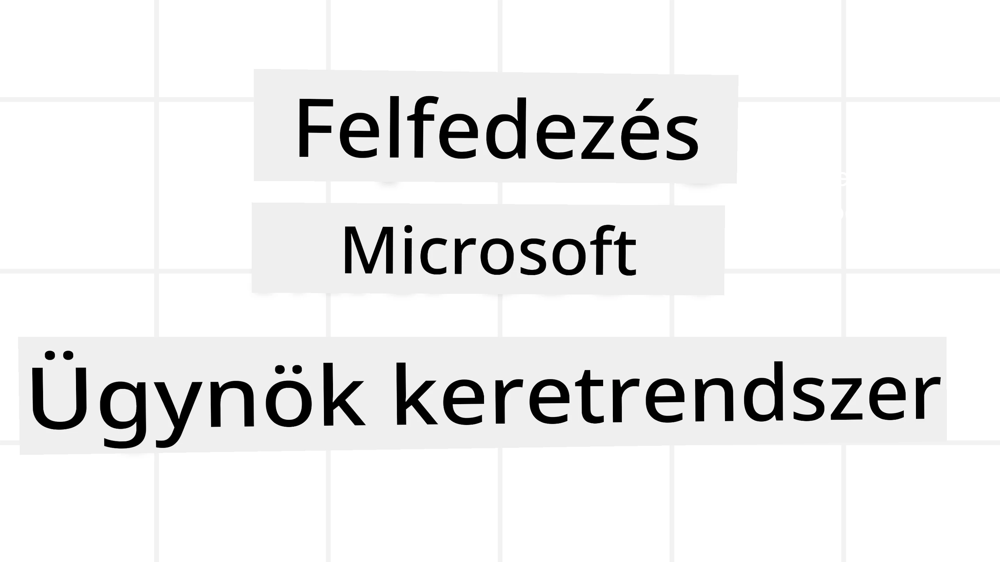
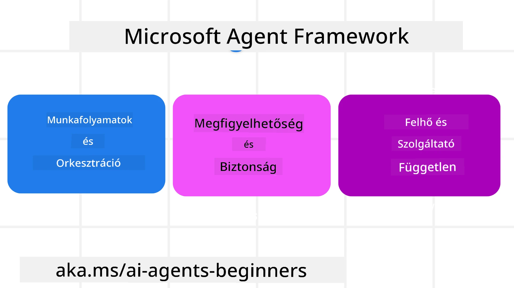
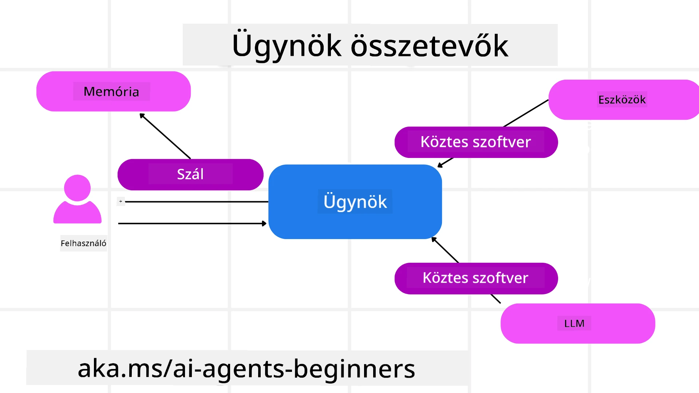

# A Microsoft Agent Framework felfedezése



### Bevezető

Ez a lecke a következőket fogja bemutatni:

- A Microsoft Agent Framework megértése: főbb jellemzők és értékek  
- A Microsoft Agent Framework kulcsfontosságú fogalmainak feltárása
- Fejlett MAF minták: munkafolyamatok, middleware és memória

## Tanulási célok

A lecke elvégzése után tudni fogja, hogyan:

- Production kész AI ügynököket építhet a Microsoft Agent Framework segítségével
- Alkalmazhatja a Microsoft Agent Framework alapvető funkcióit az ügynöki esetekhez
- Haladó mintákat használhat, beleértve a munkafolyamatokat, middleware-t és megfigyelhetőséget

## Kódpéldák 

[Microsoft Agent Framework (MAF)](https://aka.ms/ai-agents-beginners/agent-framework) kódpéldái megtalálhatók ebben a tárban az `xx-python-agent-framework` és `xx-dotnet-agent-framework` fájlok alatt.

## A Microsoft Agent Framework megértése



A [Microsoft Agent Framework (MAF)](https://aka.ms/ai-agents-beginners/agent-framework) a Microsoft egységes keretrendszere AI ügynökök építéséhez. Rugalmasságot kínál a különféle ügynöki esetek kezelésére, amelyeket mind a gyártási, mind a kutatási környezetekben láthatunk, beleértve:

- **Szekvenciális ügynök koordináció** olyan esetekben, amikor lépésenkénti munkafolyamatokra van szükség.
- **Párhuzamos koordináció** olyan esetekben, amikor az ügynököknek egyszerre kell feladatokat végrehajtaniuk.
- **Csoportos csevegés koordináció** olyan esetekben, amikor az ügynökök együttműködve dolgozhatnak egy feladaton.
- **Átadási koordináció** olyan esetekben, amikor az ügynökök egymásnak adják át a feladatot, ahogy az alfeladatok elkészülnek.
- **Mágneses koordináció** olyan esetekben, amikor egy menedzser ügynök hoz létre és módosít egy feladatlistát, és koordinálja az al-ügynökök munkáját a feladat teljesítésére.

Az AI ügynökök éles környezetben történő szállításához a MAF tartalmazza a következő funkciókat is:

- **Megfigyelhetőség** az OpenTelemetry használatával, ahol az AI ügynök minden lépését követjük, beleértve az eszközhívásokat, koordinációs lépéseket, érvelési folyamatokat és teljesítménymonitorozást a Microsoft Foundry irányítópultján keresztül.
- **Biztonság** az ügynökök natív hostingja révén a Microsoft Foundry-ban, amely magában foglalja a szerepkör alapú hozzáférés-vezérlést, privát adatkezelést és beépített tartalombiztonságot.
- **Tartósság** az ügynök szálak és munkafolyamatok szüneteltetése, folytatása és hibákból való helyreállítása révén, ami lehetővé teszi a hosszabb futásokat.
- **Irányítás** mivel támogatottak az emberi jóváhagyást igénylő feladatokkal dolgozó munkafolyamatok (human-in-the-loop).

A Microsoft Agent Framework interoperábilis is, az alábbi módokon:

- **Felhőfüggetlen** - Az ügynökök futtathatók konténerekben, helyben, és több különböző felhőn keresztül is.
- **Szolgáltatófüggetlen** - Az ügynökök bármely preferált SDK segítségével létrehozhatók, beleértve az Azure OpenAI és OpenAI szolgáltatásokat.
- **Nyílt szabványok integrálása** - Az ügynökök használnak olyan protokollokat, mint az Agent-to-Agent (A2A) és a Model Context Protocol (MCP), hogy felfedezzék és használják más ügynököket és eszközöket.
- **Bővítmények és kapcsolók** - Csatlakozások hozhatók létre adat- és memória szolgáltatásokhoz, mint például Microsoft Fabric, SharePoint, Pinecone és Qdrant.

Nézzük meg, hogyan alkalmazzák ezeket a funkciókat a Microsoft Agent Framework néhány alapkoncepcióján.

## A Microsoft Agent Framework kulcsfogalmai

### Ügynökök



**Ügynökök létrehozása**

Az ügynök létrehozása azzal kezdődik, hogy definiáljuk az inferencia szolgáltatást (LLM Szolgáltató), a követendő utasítások halmazát az AI ügynök számára, valamint egy hozzárendelt `név`-et:


```python
agent = AzureOpenAIChatClient(credential=AzureCliCredential()).create_agent( instructions="You are good at recommending trips to customers based on their preferences.", name="TripRecommender" )
```

A fenti példa az `Azure OpenAI` használatával készült, de ügynökök létrehozhatók különféle szolgáltatásokkal, beleértve a `Microsoft Foundry Agent Service`-t is:

```python
AzureAIAgentClient(async_credential=credential).create_agent( name="HelperAgent", instructions="You are a helpful assistant." ) as agent
```

OpenAI `Responses`, `ChatCompletion` API-k

```python
agent = OpenAIResponsesClient().create_agent( name="WeatherBot", instructions="You are a helpful weather assistant.", )
```

```python
agent = OpenAIChatClient().create_agent( name="HelpfulAssistant", instructions="You are a helpful assistant.", )
```

vagy a [MiniMax](https://platform.minimaxi.com/), amely egy OpenAI-kompatibilis API-t kínál nagy kontextusablakokkal (akár 204K tokenig):

```python
agent = OpenAIChatClient(base_url="https://api.minimax.io/v1", api_key=os.environ["MINIMAX_API_KEY"], model_id="MiniMax-M3").create_agent( name="HelpfulAssistant", instructions="You are a helpful assistant.", )
```

vagy távoli ügynökök az A2A protokoll segítségével:

```python
agent = A2AAgent( name=agent_card.name, description=agent_card.description, agent_card=agent_card, url="https://your-a2a-agent-host" )
```

**Az ügynökök futtatása**

Az ügynököket a `.run` vagy `.run_stream` metódusokkal futtatjuk, attól függően, hogy nem streaming vagy streaming válaszokat kívánunk.

```python
result = await agent.run("What are good places to visit in Amsterdam?")
print(result.text)
```

```python
async for update in agent.run_stream("What are the good places to visit in Amsterdam?"):
    if update.text:
        print(update.text, end="", flush=True)

```

Minden ügynök futtatásnak lehetnek opciói a paraméterek testreszabására, mint például az ügynök által használt `max_tokens`, az ügynök által hívható `tools` és maga az ügynök által használt `model`.

Ez hasznos olyan esetekben, amikor konkrét modellek vagy eszközök szükségesek egy felhasználói feladat elvégzéséhez.

**Eszközök**

Eszközök meghatározhatók az ügynök definíció közben is:

```python
def get_attractions( location: Annotated[str, Field(description="The location to get the top tourist attractions for")], ) -> str: """Get the top tourist attractions for a given location.""" return f"The top attractions for {location} are." 


# Amikor közvetlenül hozunk létre egy ChatAgent-et

agent = ChatAgent( chat_client=OpenAIChatClient(), instructions="You are a helpful assistant", tools=[get_attractions]

```

valamint az ügynök futtatásakor is:

```python

result1 = await agent.run( "What's the best place to visit in Seattle?", tools=[get_attractions] # Csak erre a futtatásra biztosított eszköz )
```

**Ügynök szálak**

Ügynök szálak használatosak többszörös körös beszélgetések kezelésére. A szálak létrehozhatók:

- A `get_new_thread()` használatával, amely lehetővé teszi, hogy a szálat idővel elmentsük
- Automatikusan létrehozva egy szál, amikor az ügynök fut, és a szál csak az adott futás idejéig tart.

Egy szál létrehozásához a kód így néz ki:

```python
# Hozzon létre egy új szálat.
thread = agent.get_new_thread() # Futtassa az ügynököt a szálon.
response = await agent.run("Hello, I am here to help you book travel. Where would you like to go?", thread=thread)

```

Ezt követően a szál sorosítható, hogy később elmenthető legyen:

```python
# Hozzon létre egy új szálat.
thread = agent.get_new_thread() 

# Futtassa az ügynököt a szállal.

response = await agent.run("Hello, how are you?", thread=thread) 

# Szerializálja a szálat tároláshoz.

serialized_thread = await thread.serialize() 

# Deszerializálja a szál állapotát a betöltés után.

resumed_thread = await agent.deserialize_thread(serialized_thread)
```

**Ügynök Middleware**

Az ügynökök eszközökkel és LLM-ekkel lépnek interakcióba a felhasználói feladatok elvégzése érdekében. Bizonyos esetekben kívánjuk, hogy ezek között az interakciók között hajtsunk végre vagy kövessünk le valamilyen műveletet. Az ügynök middleware lehetővé teszi ezt az alábbiak révén:

*Funkció middleware*

Ez a middleware lehetővé teszi, hogy egy műveletet hajtsunk végre az ügynök és a funkció/eszköz hívása között. Példa erre, amikor a funkcióhívásnál naplózni szeretnénk.

Az alábbi kódban a `next` határozza meg, hogy a következő middleware vagy maga a funkció kerüljön-e meghívásra.

```python
async def logging_function_middleware(
    context: FunctionInvocationContext,
    next: Callable[[FunctionInvocationContext], Awaitable[None]],
) -> None:
    """Function middleware that logs function execution."""
    # Előfeldolgozás: Naplózás a függvény végrehajtása előtt
    print(f"[Function] Calling {context.function.name}")

    # Folytatás a következő middleware vagy függvény végrehajtásához
    await next(context)

    # Utófeldolgozás: Naplózás a függvény végrehajtása után
    print(f"[Function] {context.function.name} completed")
```

*Chat middleware*

Ez a middleware lehetővé teszi, hogy egy műveletet hajtsunk végre vagy naplózzunk az ügynök és az LLM közötti kérések között.

Ez fontos információkat tartalmaz, mint például a mesterséges intelligencia szolgáltatásnak küldött `messages`.

```python
async def logging_chat_middleware(
    context: ChatContext,
    next: Callable[[ChatContext], Awaitable[None]],
) -> None:
    """Chat middleware that logs AI interactions."""
    # Előfeldolgozás: Naplózás az AI hívás előtt
    print(f"[Chat] Sending {len(context.messages)} messages to AI")

    # Folytatás a következő köztes réteg vagy AI szolgáltatás felé
    await next(context)

    # Utófeldolgozás: Naplózás az AI válasz után
    print("[Chat] AI response received")

```

**Ügynök memória**

Ahogy az `Agentic Memory` leckében tárgyaltuk, a memória kulcsfontosságú elem az ügynök különböző kontextusok közti működésének lehetővé tételéhez. A MAF számos különféle memóriatípust kínál:

*Memória a program futása alatt (In-Memory Storage)*

Ez az a memória, amely a szálakban tárolódik az alkalmazás futása alatt.

```python
# Hozzon létre egy új szálat.
thread = agent.get_new_thread() # Futtassa az ügynököt a szállal.
response = await agent.run("Hello, I am here to help you book travel. Where would you like to go?", thread=thread)
```

*Tartós üzenetek (Persistent Messages)*

Ez a memória a különböző munkamenetek közötti beszélgetési előzmények tárolására szolgál. `chat_message_store_factory` definiálja:

```python
from agent_framework import ChatMessageStore

# Egyéni üzenettároló létrehozása
def create_message_store():
    return ChatMessageStore()

agent = ChatAgent(
    chat_client=OpenAIChatClient(),
    instructions="You are a Travel assistant.",
    chat_message_store_factory=create_message_store
)

```

*Dinamikus memória (Dynamic Memory)*

Ez a memória az ügynökök futtatása előtt kerül hozzárendelésre a kontextushoz. Ezek a memóriák külső szolgáltatásokban is tárolhatók, például mem0-ban:

```python
from agent_framework.mem0 import Mem0Provider

# Mem0 használata fejlett memóriafunkciókhoz
memory_provider = Mem0Provider(
    api_key="your-mem0-api-key",
    user_id="user_123",
    application_id="my_app"
)

agent = ChatAgent(
    chat_client=OpenAIChatClient(),
    instructions="You are a helpful assistant with memory.",
    context_providers=memory_provider
)

```

**Ügynök megfigyelhetősége**

A megfigyelhetőség fontos megbízható és karbantartható ügynökrendszerek építéséhez. A MAF integrálódik az OpenTelemetry-vel, hogy nyomkövetést és mérőszámokat biztosítson a jobb megfigyelhetőség érdekében.

```python
from agent_framework.observability import get_tracer, get_meter

tracer = get_tracer()
meter = get_meter()
with tracer.start_as_current_span("my_custom_span"):
    # csinálj valamit
    pass
counter = meter.create_counter("my_custom_counter")
counter.add(1, {"key": "value"})
```

### Munkafolyamatok

A MAF munkafolyamatokat kínál, amelyek előre definiált lépések egy feladat elvégzéséhez, és AI ügynököket tartalmaznak komponensként ezekben a lépésekben.

A munkafolyamat különböző komponensekből áll, amelyek jobb vezérlésit biztosítanak. A munkafolyamatok támogatják az **ügyönkénti koordinációt** és az **ellenőrzőpontozást**, hogy elmentsék a munkafolyamat állapotát.

Egy munkafolyamat fő komponensei:

**Végrehajtók (Executors)**

A végrehajtók fogadják a bemenő üzeneteket, végrehajtják a feladatukat, majd kimenő üzenetet állítanak elő. Ez előreviszi a munkafolyamatot a nagyobb feladat megvalósításához. A végrehajtók lehetnek AI ügynökök vagy egyéni logikák.

**Élek (Edges)**

Az élek definiálják az üzenetáramlást a munkafolyamatban. Ezek lehetnek:

*Közvetlen élek* - Egyszerű egyik végrehajtótól a másikig tartó kapcsolat:

```python
from agent_framework import WorkflowBuilder

builder = WorkflowBuilder()
builder.add_edge(source_executor, target_executor)
builder.set_start_executor(source_executor)
workflow = builder.build()
```

*Feltételes élek* - Egy adott feltétel teljesülése után aktiválódnak. Például, ha a szállodai szobák elfogytak, egy végrehajtó más lehetőségeket javasolhat.

*Kapcsoló (switch-case) élek* - Az üzeneteket különböző végrehajtókhoz irányítják meghatározott feltételek alapján. Például ha egy utazó ügyfél prioritást élvez, és a feladatait egy másik munkafolyamat kezeli.

*Szétosztó (fan-out) élek* - Egy üzenetet több címzetthez küldenek.

*Összegyűjtő (fan-in) élek* - Több üzenetet gyűjtenek össze különböző végrehajtóktól, majd egy címzetthez küldenek.

**Események**

A jobb megfigyelhetőség érdekében a MAF beépített eseményeket kínál a végrehajtáshoz, többek között:

- `WorkflowStartedEvent`  - A munkafolyamat végrehajtása megkezdődik
- `WorkflowOutputEvent` - A munkafolyamat kimenetet produkál
- `WorkflowErrorEvent` - A munkafolyamat hibába ütközik
- `ExecutorInvokeEvent`  - A végrehajtó elkezdi a feldolgozást
- `ExecutorCompleteEvent`  -  A végrehajtó befejezi a feldolgozást
- `RequestInfoEvent` - Kérés érkezik

## Haladó MAF minták

A fenti szakaszok lefedik a Microsoft Agent Framework kulcsfogalmait. Ahogy összetettebb ügynököket épít, itt van néhány fejlett minta, amit érdemes megfontolni:

- **Middleware összetétel**: Több middleware kezelőt láncoljon össze (naplózás, hitelesítés, sebességkorlátozás) funkció- és chat middleware segítségével a finomhangolt vezérlés érdekében.
- **Munkafolyamat ellenőrzőpontozás**: Használja a munkafolyamat eseményeit és sorosítást a hosszú futású ügynök folyamatok mentésére és folytatására.
- **Dinamikus eszközválasztás**: Kombinálja az eszközleírások RAG-jét a MAF eszközregisztrációjával, hogy csak a lekérdezéshez releváns eszközöket jelenítse meg.
- **Több ügynök közötti átadás**: Használja a munkafolyamat éleket és feltételes útválasztást, hogy szakosodott ügynökök között koordinálja az átadásokat.

## LangChain / LangGraph ügynökök hosztolása Microsoft Foundry-n

A Microsoft Agent Framework **keretrendszer-interoperábilis** — nem korlátozódik csak a MAF-al írt ügynökökre. Ha már rendelkezik egy **LangChain** vagy **LangGraph**-gal épített ügynökkel, futtathatja azt **Microsoft Foundry által hosztolt ügynökként**, hogy a Foundry kezelje a futtatási környezetet, munkameneteket, méretezést, azonosítást és protokoll végpontokat, miközben az ügynök logikája LangGraph-ban marad.

Ez a `langchain_azure_ai.agents.hosting` csomag segítségével történik, amely kitettes egy lefordított LangGraph grafikont ugyanazon protokollokon keresztül, amelyeket a Foundry hosztolt ügynökök használnak.

**1. Telepítse a hosting bővítményt:**

```bash
pip install -U "langchain-azure-ai[hosting]>=1.2.4" azure-identity
```

A `hosting` bővítmény telepíti a Foundry protokoll könyvtárakat: `azure-ai-agentserver-responses` (az OpenAI-kompatibilis `/responses` végpont) és `azure-ai-agentserver-invocations` (az általános `/invocations` végpont).

**2. Válassza ki a hosting protokollt:**

| Protokoll | Hoszt osztály | Végpont | Használat esete |
|----------|-----------|----------|----------|
| **Responses** | `ResponsesHostServer` | `/responses` | Olyan OpenAI-kompatibilis chat, streaming, válasz előzmények és beszélgetés szálazása, amelyet beszélgetős ügynökökhöz ajánlunk alapértelmezettként. |
| **Invocations** | `InvocationsHostServer` | `/invocations` | Egyéni JSON formátumot, webhook-szerű végpontot vagy nem beszélgetős feldolgozást igényel. |

Mivel a **Responses API a fő API az ügynök-stílusú fejlesztéshez a Foundry-ban**, a legtöbb ügynöknél a `ResponsesHostServer`-rel kezdjen.

**3. Állítsa be a környezeti változókat** (`az login` előbb, hogy a `DefaultAzureCredential` hitelesíteni tudjon):

```bash
export FOUNDRY_PROJECT_ENDPOINT="https://<resource>.services.ai.azure.com/api/projects/<project>"
export FOUNDRY_MODEL_NAME="gpt-4.1"
```

Amikor az ügynök később mint hosztolt ügynök fut a Foundry-ban, a platform automatikusan injektálja a `FOUNDRY_PROJECT_ENDPOINT` változót.

**4. Tegyen elérhetővé egy LangGraph ügynököt a Responses protokollon keresztül:**

```python
import os

from azure.ai.projects import AIProjectClient
from azure.identity import DefaultAzureCredential, get_bearer_token_provider
from langchain.agents import create_agent
from langchain_openai import ChatOpenAI
from langchain_azure_ai.agents.hosting import ResponsesHostServer

_AZURE_AI_SCOPE = "https://ai.azure.com/.default"


def build_chat_model() -> ChatOpenAI:
    project_endpoint = os.environ["FOUNDRY_PROJECT_ENDPOINT"].rstrip("/")
    deployment = os.environ.get("FOUNDRY_MODEL_NAME", "gpt-4.1")
    credential = DefaultAzureCredential()
    project = AIProjectClient(endpoint=project_endpoint, credential=credential)
    openai_client = project.get_openai_client()
    token_provider = get_bearer_token_provider(credential, _AZURE_AI_SCOPE)

    # A ChatOpenAI itt a Foundry projekt OpenAI-kompatibilis (Responses) végpontját célozza meg.
    return ChatOpenAI(
        model=deployment,
        base_url=str(openai_client.base_url),
        api_key=token_provider,
    )


def main() -> None:
    graph = create_agent(build_chat_model(), tools=[])
    port = int(os.environ.get("PORT", "8088"))
    ResponsesHostServer(graph).run(port=port)


if __name__ == "__main__":
    main()
```

Futtassa helyben a `python main.py` parancsot, majd küldjön Responses kérést a `http://localhost:8088/responses` címre.

**Fő viselkedések:**

- **Beszélgetések**: Az ügyfelek beszélgetést folytatnak `previous_response_id` vagy `conversation` azonosító továbbításával. Ha láncolt LangGraph ellenőrzőpont került kompilálásra, a Foundry a beszélgetés állapotát az ellenőrzőponthoz köti (éles környezetben tartós ellenőrzőpontot használjon; a `MemorySaver` helyi tesztre jó).
- **Ember a hurokban (Human-in-the-loop)**: Ha a grafikon használja a LangGraph `interrupt()`-ot, a `ResponsesHostServer` az aktuális megszakítást megjeleníti további `function_call` / `mcp_approval_request` elemként, az ügyfelek pedig folytathatják a megfelelő `function_call_output` / `mcp_approval_response` válasszal.
- **Deploy a Foundry-ba**: Használja az Azure Developer CLI-t — `azd ext install azure.ai.agents`, `azd ai agent init -m <manifest>`, `azd ai agent run` (helyi, Docker szükséges), majd `azd provision` és `azd deploy`. A hosztolt ügynök telepítéséhez szükséges a **Foundry Project Manager** szerepkör.

Ennek a példának a futtatható változata megtalálható a [code-samples/14-langchain-hosted-agent.py](../../../14-microsoft-agent-framework/code-samples/14-langchain-hosted-agent.py) fájlban. A teljes bemutatáshoz (Invocations protokoll, egyéni kérés séma és hibakeresés), lásd a [Host LangGraph agents as Foundry hosted agents](https://learn.microsoft.com/azure/foundry/how-to/develop/langchain-hosted-agents) oldalt.

## Kódpéldák 

A Microsoft Agent Framework kódpéldái megtalálhatók ebben a tárban az `xx-python-agent-framework` és `xx-dotnet-agent-framework` fájlok alatt.

## Van további kérdése a Microsoft Agent Framework kapcsán?

Csatlakozzon a [Microsoft Foundry Discord](https://discord.com/invite/ATgtXmAS5D) közösséghez, hogy találkozzon más tanulókkal, vegyen részt irodai órákon, és kérdéseire AI ügynökökkel kapcsolatban választ kapjon.

---

<!-- CO-OP TRANSLATOR DISCLAIMER START -->
**Jogi nyilatkozat**:
Ez a dokumentum az AI fordítási szolgáltatás, a [Co-op Translator](https://github.com/Azure/co-op-translator) segítségével készült. Bár az pontosságra törekszünk, kérjük, vegye figyelembe, hogy az automatikus fordítások hibákat vagy pontatlanságokat tartalmazhatnak. Az eredeti dokumentum az anyanyelvén tekintendő hiteles forrásnak. Fontos információk esetén professzionális emberi fordítást javasolunk. Nem vállalunk felelősséget semmilyen félreértésért vagy téves értelmezésért, amely ebből a fordításból ered.
<!-- CO-OP TRANSLATOR DISCLAIMER END -->