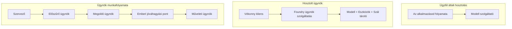
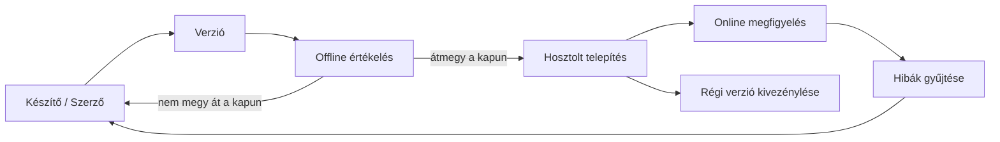
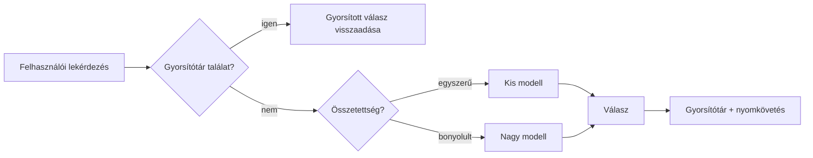
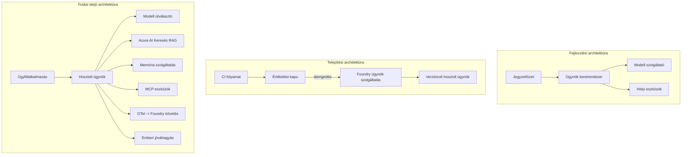

# Skálázható ügynökök telepítése a Microsoft Foundry segítségével


Eddig a tanfolyamon olyan ügynököket építettél, amelyek a laptopodon futnak, egy jegyzetfüzetben, `az login` és néhány környezeti változó által vezérelve. Ez pontosan a helyes mód a tanuláshoz. Ez azonban nem megfelelő mód arra, hogy egy olyan ügynököt működtess, amelyre ezrek támaszkodnak hajnali 3-kor.

Ez a lecke az "it működik a gépemen" és az "it megbízhatóan és gazdaságosan működik a termelésben" közötti szakadékról szól. Ezt a szakadékot a **Microsoft Foundry** és a **Microsoft Foundry Agent Service** segítségével hidaljuk át, és egy valós ügyféltámogatási ügynököt építünk, amely eszközökkel, lekérdezéssel, memóriával, értékeléssel és megfigyeléssel rendelkezik.

## Bevezetés

Ez a lecke az alábbiakat fogja lefedni:

- A különbséget a **prototípus ügynök** és egy **telepített ügynök** között, illetve hogy a váltás leginkább a modell körüli *körítésről* szól.
- Az ügynökök **telepítési mintáinak** ismertetése: ügyfél által hosztolt, szolgáltatás által hosztolt (Hosted Agents), és munkafolyamat szerint irányított.
- Az ügynök **életciklusát** a Microsoft Foundry-n: létrehozás, verziózás, telepítés, értékelés, megfigyelés, nyugdíjazás.
- **Skálázási stratégiák**: modellirányítás, gyorsítótárazás, egyidejűség és állapotmentes tervezés.
- **Megfigyelhetőség** OpenTelemetry és Foundry nyomkövetéssel.
- **Költségoptimalizálás** modellválasztás, irányítás és értékelési kapuk révén.
- **Vállalati szempontok**: irányítás, emberi jóváhagyás, és az MCP szerverek biztonságos működtetése a termelésben.

## Tanulási célok

A lecke elvégzése után tudni fogod, hogyan kell:

- Kiválasztani a megfelelő telepítési mintát egy adott ügynökterheléshez.
- Telepíteni egy ügynököt a Microsoft Foundry Agent Service-be, hogy verziózott, irányított és megfigyelhető legyen.
- Instrumentálni egy ügynököt nyomkövetésre, és összekapcsolni egy minden kiadás előtt futó értékelő folyamatot.
- Alkalmazni modellirányítást és gyorsítótárazást, hogy a késleltetés és költség kontroll alatt maradjon nagy skálán.
- Hozzáadni egy emberi jóváhagyási kaput magas kockázatú műveletekhez és integrálni egy MCP szervert termelésbiztos módon.

## Előfeltételek

Ez a lecke feltételezi, hogy elvégezted az előző leckéket, és magabiztosan kezeled:

- Ügynökök építése a [Microsoft Agent Framework](../14-microsoft-agent-framework/README.md) segítségével (14-es lecke).
- [Eszközhasználat](../04-tool-use/README.md) (4-es lecke) és [Agentic RAG](../05-agentic-rag/README.md) (5-ös lecke).
- [Ügynöki memória](../13-agent-memory/README.md) (13-as lecke) és [Agentic protokollok / MCP](../11-agentic-protocols/README.md) (11-es lecke).
- [Megfigyelhetőség és értékelés](../10-ai-agents-production/README.md) (10-es lecke) — erre közvetlenül épít ez a lecke.

Szükséged lesz még:

- Egy **Azure előfizetésre** és egy **Microsoft Foundry projekt**-re, amelyben legalább egy telepített chat modell van.
- Az **Azure CLI** hitelesítésére (`az login`).
- Python 3.12+-ra és a tárolóban lévő [`requirements.txt`](../../../requirements.txt) csomagokra.

## A prototípustól a termelésig: mi változik valójában

Egy prototípus ügynök és egy termelési ügynök ugyanazt a fő ciklust futtatja — gondolkodik, eszközöket hív, válaszol. Ami változik, az minden, ami azt a ciklust körülveszi. A modell talán 20%-át teszi ki a termelési ügynöknek; a fennmaradó 80% a működtetési váz.

| Szempont | Prototípus | Termelés |
| --- | --- | --- |
| **Hosztolás** | A jegyzetfüzetben fut | Szolgáltatásként fut, verziózott és kiadott |
| **Azonosítás** | Az `az login` tokened | Kezelt identitás scoped RBAC-kal |
| **Állapot** | Memóriában, újraindításkor elveszik | Külsőleg tárolt (szál tároló, memória szolgáltatás) |
| **Hibakezelés** | A stack trace látható | Újrapróbálkozás, tartalék megoldások, dead-letter, riasztások |
| **Költség** | "Néhány cent" | Kérésenként nyomon követve, irányítva, gyorsítótárazva, költségvetve |
| **Minőség** | Te nézed meg az eredményt | Automatikusan értékelve minden kiadás előtt |
| **Bizalom** | Te hagyod jóvá minden műveletet | Szabályzat + ember a folyamatban kockázatos műveleteknél |

Tartsd szem előtt ezt a táblázatot. Az alábbiakban minden szakasz megfelel az egyik sorának.

## Ügynök telepítési minták

Három mintát fogsz használni, gyakran kombinálva.

### 1. Ügyfél által hosztolt ügynökök

Az ügynök objektum az *alkalmazásod* folyamatán belül él. A kódod közvetlenül hívja a modell szolgáltatót; az érvelési ciklus a szolgáltatásodban fut. Ezt csináltad minden előző leckében.

- **Használj ilyet**, ha teljes ellenőrzést akarsz az érvelési ciklus felett, egyedi köztes réteget igényelsz, vagy beágyazod az ügynököt egy meglévő backendbe.
- **Megfontolás**: magadnak kell kezelned a skálázást, állapotot és a hibatűrést.

### 2. Hosted Agents (Foundry Agent Service)

Az ügynök *erőforrásként regisztrálva van* a Microsoft Foundry-ban. A Foundry hosztolja az érvelési ciklust, tárolja a szálakat, érvényesíti a tartalombiztonságot és a RBAC-ot, valamint láthatóvá teszi az ügynököt a Foundry portálban. Alkalmazásod egy vékony klienssé válik, amely szálakat hoz létre és olvassa a válaszokat.

- **Használd, ha** tartósságot, beépített megfigyelhetőséget, irányítást és kisebb működtetési felületet akarsz.
- **Cserébe**: kevesebb mélyebb kontrollt kapsz egy kezelt futtatókörnyezetért.

### 3. Ügynök munkafolyamatok

Több ügynök (és eszköz) explicit vezérlésű gráffá vannak komponálva — sorozatos lépések, elágazások, emberi jóváhagyási pontok, és tartós ellenőrzőpontokkal, amelyek megállíthatják és folytathatják a folyamatot. Ez a Microsoft Agent Framework **Workflows** képessége, telepítési skálán alkalmazva.

- **Használd, ha** egyetlen feladat több speciális ügynököt érint, vagy kell egy jóváhagyási lépés középen.
- **Megfontolás**: több mozgó alkatrész; felügyelet szintű megfigyelést igényel.



## Az ügynök életciklusa a Microsoft Foundry-n

Az ügynök telepítése nem egy egyszeri `push`. Ez egy ciklus, amely nagyon hasonlít egy szoftverkiadási ciklusra, mert az is valójában.



A kulcsötlet, amit a [10-es leckéből](../10-ai-agents-production/README.md) hoztunk át: **az offline értékelés egy kapu, nem utólagos gondolat.** Egy új ügynök verzió nem kerül kiadásra, ha nem lépi át az értékelési küszöbeidet. Az online megfigyelhetőség pedig a valós hibákat visszacsatolja az offline tesztkészletbe. Ez a teljes ciklus.

## Skálázási stratégiák

Egy ügynök skálázása különbözik egy állapotmentes web API skálázásától, mert minden kérés több költséges modell- és eszközhívást indíthat. Négy technika viszi a terhelés nagy részét.

**Állapotmentes kéréskezelés.** Ne tarts felhasználónkénti állapotot a folyamat memóriájában. Tárold a beszélgetési szálakat a Foundry száltárolójában vagy egy memória szolgáltatásban, hogy bármelyik példány képes legyen bármelyik kérést kezelni. Ez teszi lehetővé a vízszintes skálázást — példányokat adsz hozzá, nincs ragadós munkamenet.

**Modellirányítás.** Nem minden kérést kell a legképesebb (és legdrágább) modellel kiszolgálni. Egyszerű kéréseket — például szándék osztályozást, rövid tényválaszokat — irányíts egy kicsi, gyors modellhez, és csak az igazi érveléseket küldd a nagy modellhez. A Foundry **Model Router** segíthet ebben, vagy te magad is készíthetsz egy könnyű osztályozót. A laborban mindkettőt elkészíted.

**Válasz gyorsítótárazás.** Sok támogatói kérdés majdnem ismétlődő ("hogyan állítom vissza a jelszavamat?"). Tárold a gyakori kérdésekre adott válaszokat gyorsítótárban, és szolgáld ki őket anélkül, hogy modellezni kellene. Még egy szerény gyorsítótár találati arány is jelentősen csökkenti a költséget és a késleltetést.

**Egyidejűség és vissznyomás.** A modell szolgáltatóknak vannak sebességkorlátaik. Korlátozd az egyidejűséget, használj exponenciális visszalépéssel ismétlődő próbálkozásokat, és hibakezelj szépen (egy sorba állított "dolgozunk rajta" válasz jobb, mint egy 500-as hiba).



## Megfigyelhetőség a termelésben

Amit nem látsz, azt nem tudod működtetni. Ahogy a 10-es leckében is említettük, a Microsoft Agent Framework natívan bocsát ki **OpenTelemetry** nyomkövetéseket — minden modellhívás, eszközhívás és irányítási lépés egy span lesz. Termelésben ezeket a spánokat exportálod a Microsoft Foundry-nak (vagy bármilyen OTel-kompatibilis backendnek), hogy:

- Nyomon kövess egyetlen ügyfél panaszt végig minden modell- és eszközhíváson keresztül.
- Figyeld az p50/p95 késleltetést és költséget kérések szerint időben.
- Riasztás az error-rate csúcsokra és költségtúllépésekre azelőtt, hogy a felhasználók (vagy a pénzügyi csapat) észrevennék.

```python
from agent_framework.observability import get_tracer

tracer = get_tracer()

with tracer.start_as_current_span("support_request") as span:
    span.set_attribute("customer.tier", "enterprise")
    span.set_attribute("routed.model", "gpt-5-nano")
    # az ügynök végrehajtása automatikusan követve van ezen a szakaszon belül
```

Az olyan attribútumok, mint `customer.tier` és `routed.model`, alakítják át a nyomkövetések falát válaszolható kérdésekké ("túl gyakran irányítják-e a vállalati ügyfeleket a kis modellhez?").

## Költségoptimalizálás

A termelési ügynökök költségét főként a tokenek jelentik. Három fogantyú, hatás szerint sorrendben:

1. **Megfelelő modellméret.** Egy kis modell, amely átmegy az értékelési kapun, majdnem mindig olcsóbb, mint egy nagy modell, amely szintén átmegy. Használd az értékelést arra, hogy *bizonyítsd*, hogy a kis modell elég jó, ne az óvatosság miatt válaszd mindig a legnagyobbat.
2. **Irányítás összetettség szerint.** Mint fent — csak azoknál a kéréseknél fizess a nagy modellért, amelyek ténylegesen nagy érvelést igényelnek.
3. **Agresszív gyorsítótárazás.** A legolcsóbb modellhívás az, amelyiket soha meg sem teszed.

Értékelési kapuk és költségkontroll ugyanannak a fegyelemnek két nézőpontja: az értékelés adja a *minőségi alsó határt*, az irányítás és gyorsítótárazás a lehető legközelebb tart téged a költség *alsó határához*.

## Vállalati telepítési szempontok

**Irányítás.** A Hosted Agents öröklik a Foundry RBAC-ját, tartalombiztonságát és audit naplózását. Adj minden ügynöknek egy menedzselt identitást a szükséges legkisebb jogosultsággal — csak olvasható hozzáférést az ismeretalaphoz, scoped hozzáférést a jegy API-hoz, semmi többet.

**Ember a folyamatban.** Néhány művelet túl súlyos, hogy teljesen automatizált legyen — visszatérítés kiadása, fiók törlése, jogi csapatnak történő továbbítás. A Microsoft Agent Framework támogat **jóváhagyás-követelős** eszközöket: az ügynök javasolja a műveletet, a végrehajtás szünetel, egy ember jóváhagyja vagy elutasítja, majd a munkafolyamat folytatódik. Az alapot láttad a [6-os leckében](../06-building-trustworthy-agents/README.md); itt telepíted azt.

**MCP a termelésben.** Az [MCP](../11-agentic-protocols/README.md) lehetővé teszi, hogy az ügynököd külső eszközöket használjon egy szabványos interfésszel. Termelésben minden MCP szervert megbízhatatlan határnak tekints: rögzítsd a szerver verzióját, futtasd scoped identitással, ellenőrizd a kimeneteit, és soha ne oszd meg vele az titkos adatokat. Az MCP szerver egy függőség, az ilyen függőségeket javítani, auditálni és sebességkorlátozni kell.



Ezek a három diagram — fejlesztés, telepítés, futás — ugyanaz az ügynök életének három szakaszában. A következő labor lépésről lépésre végigvezet a megépítésén.

## Gyakorlati labor: Termelésre kész ügyféltámogatási ügynök

Nyisd meg a [`code_samples/16-python-agent-framework.ipynb`](./code_samples/16-python-agent-framework.ipynb) fájlt, és haladj végig rajta. Össze fogsz állítani egy **Contoso ügyféltámogató ügynököt**, amelybe minden termelési szempont be van építve:

1. **Eszköz hívások** — nézd meg a rendelési státuszt és nyiss támogatási jegyeket.
2. **RAG** — válaszolj szabályzati kérdésekre egy ismeretbázisból (Azure AI Search, egy memóriabeli visszatéréses fallback-kel, hogy a jegyzetfüzet Search erőforrás nélkül is fusson).
3. **Memória** — emlékezz az ügyfélre a beszélgetés fordulói között.
4. **Modellirányítás** — egy komplexitás alapú osztályozó minden kérést egy kis vagy nagy modellhez irányít.
5. **Válasz gyorsítótárazás** — ismétlődő kérdések gyorsítótárból szolgálhatók ki.
6. **Emberi jóváhagyás** — egy küszöbérték feletti visszatérítések emberi jóváhagyást igényelnek.
7. **Értékelési folyamat** — egy kis offline tesztkészlet értékeli az ügynököt, és kiadási kapuként működik.
8. **Megfigyelhetőség** — OpenTelemetry nyomkövetés minden kérés körül.

### Áttekintés

A jegyzetfüzet úgy van rendszerezve, hogy minden termelési szempont egy önálló, futtatható szakasz. A szíve a routing-plus-caching kéréskezelő:

```python
async def handle_support_request(query: str, customer_id: str) -> str:
    # 1. Minél többször szolgáljunk ki gyorsítótárból.
    cached = response_cache.get(normalize(query))
    if cached:
        return cached

    # 2. Iránymutatás a bonyolultság alapján a költségek szabályozásához.
    model = "gpt-5-nano" if is_simple(query) else "gpt-5-mini"

    # 3. Futtassuk az ügynököt egy trace span belsejében az megfigyelhetőség érdekében.
    with tracer.start_as_current_span("support_request") as span:
        span.set_attribute("routed.model", model)
        span.set_attribute("customer.id", customer_id)
        response = await support_agent.run(query, model=model)

    # 4. Gyorsítótárazás és visszatérés.
    response_cache.set(normalize(query), response.text)
    return response.text
```

Az értékelési kapu, amely őrzi a kiadást, így néz ki:

```python
async def evaluation_gate(agent, test_cases, threshold: float = 0.8) -> bool:
    passed = 0
    for case in test_cases:
        result = await agent.run(case["input"])
        if score_response(result.text, case["expected"]) >= 0.8:
            passed += 1
    pass_rate = passed / len(test_cases)
    print(f"Evaluation pass rate: {pass_rate:.0%} (gate: {threshold:.0%})")
    return pass_rate >= threshold  # telepítés csak akkor, ha a kapu átmegy
```

Olvass el minden sort — a jegyzetfüzet szándékosan tartja kicsire az alapokat, hogy semmi ne legyen elrejtve egy keretrendszer hívás mögött.

## Egy telepített ügynök érvényesítése füsttesztekkel

A fent említett értékelési kapu *offline* fut az ügynök objektumodon. Amint az ügynök Hosted Agentként telepítve van, szükséged van még egy, még olcsóbb ellenőrzésre: **a telepített végpont tényleg válaszol-e?**

A "sikeres" telepítés csak azt bizonyítja, hogy az irányító felület elfogadta a definíciót — nem bizonyítja, hogy az ügynök válaszol. Egy hiányzó függőség, rossz modellirányítás vagy lejárt kapcsolat zöld telepítést eredményezhet, ami nem ad vissza semmit. Egy **füstteszt** ezt másodpercek alatt észleli, minden telepítésnél, a teljes értékelés költsége nélkül.

Ez a tároló egy készen használható füstteszt folyamatot szállít, amely az [AI Smoke Test](https://github.com/marketplace/actions/ai-smoke-test) GitHub Action-re épül:

- **Katalógus** — a [`tests/lesson-16-smoke-tests.json`](../../../tests/lesson-16-smoke-tests.json) tartalmazza a Contoso ügyféltámogató ügynökhöz készült promptokat és állításokat (alapozott szabályzati válaszok, rendelés lekérése, témán belül maradás, többfordulós szál folytonosság). Más leckék ügynökeinek katalógusai is mellette találhatók — lásd a [`tests/README.md`](../tests/README.md)-t.
- **Munkafolyamat** — a [`.github/workflows/smoke-test.yml`](../../../.github/workflows/smoke-test.yml) Azure OIDC-vel bejelentkezik, és POST-olja a promptokat az ügynök Válaszok végpontjára, meghiúsítva a feladatot bármely állítás hibájánál.

```yaml
- name: Smoke-test hosted agent
  uses: JFolberth/ai-smoketest@v1
  with:
    project_endpoint: ${{ inputs.project_endpoint }}
    agent_name: ContosoSupportAgent
    tests_file: tests/lesson-16-smoke-tests.json
```


Futtassa az **Actions** fülről, miután az ügynöke telepítve van, megadva a Foundry projekt végpontját és az ügynök nevét. A federált identitásnak rendelkeznie kell az **Azure AI User** szerepkörrel a Foundry projekt szintjén. Gondoljon a rétegekre úgy, mint egy piramisra: a füsttesztek (elérhető és válaszol?) minden telepítéskor futnak, az offline értékelés (elég jó-e a szállításhoz?) a promóció előtt, az online értékelés (hogy teljesít vad környezetben?) folyamatosan fut.

## Tudásellenőrzés

Tesztelje megértését, mielőtt tovább lépne a feladatra.

**1. Körülbelül mekkora része egy éles ügynöknek a "modell", és mi a maradék?**

<details>
<summary>Válasz</summary>

A modell a rendszer kisebbsége — gyakran 20% körül említik. A maradék az operatív váz: hosztolás és verziókezelés, identitás és RBAC, külső tárolt állapot, hibakezelés, költségkövetés, értékelés és emberi beavatkozásos vezérlés. Az éles üzembe helyezés leginkább arról szól, hogy mindent *a* gondolkodási kör köré kell építeni.
</details>

**2. Mikor választana Hosted Agentet egy kliens oldali ügynök helyett?**

<details>
<summary>Válasz</summary>

Amikor egy kezelt futtatási környezetet szeretne beépített tartóssággal (folyamok, amelyek fennmaradnak és folytathatóak), megfigyelhetőséggel, tartalombiztonsággal és RBAC-kal, és hajlandó némi mélyebb kontrollt feladni a gondolkodási kör fölött a kisebb operatív felület érdekében. Kliens hosztolás előnyösebb, ha teljes kontrollra van szüksége a kör felett, vagy beágyazza az ügynököt egy meglévő backendbe.
</details>

**3. Miért kell egy skálázható ügynöknek statelessnek lennie a saját folyamat memóriájában?**

<details>
<summary>Válasz</summary>

Mert így bármelyik példány el tud látni bármilyen kérelmet, ami lehetővé teszi a vízszintes skálázást ragadós session-ök nélkül. A felhasználónkénti beszélgetési állapotot egy külön thread store vagy memória szolgáltatás tárolja. Ha az állapot a folyamat memóriájában lenne, azt újraindításkor elveszítené, és nem tudná szabadon elosztani a terhelést.
</details>

**4. Milyen problémát old meg a modell útválasztás, és hogyan kapcsolódik az értékeléshez?**

<details>
<summary>Válasz</summary>

Az útválasztás egyszerű kéréseket egy kis, olcsó, gyors modellnek küld, és a nagy modellt megőrzi az igazi gondolkodásra, így szabályozza a késleltetést és a költséget. Kapcsolódik az értékeléshez, mert az értékelés *bizonyítja*, hogy a kis modell elég jó egy adott kérésosztályhoz — az útválasztás értékelés nélkül csak találgatás.
</details>

**5. Mi az az "értékelési kapu," és hol helyezkedik el az életciklusban?**

<details>
<summary>Válasz</summary>

Egy értékelési kapu offline tesztkészletet futtat le az új ügynökverzión, és akadályozza a telepítést, kivéve ha a sikerarány eléri a küszöböt. Az életciklusban a "verzió" és a "telepítés" között áll, és a minőséget kiadási előfeltétellé teszi, nem csak az utólagos ellenőrzés tárgyává.
</details>

**6. Miért kell az MCP szervert megbízhatatlan határként kezelni a termelésben?**

<details>
<summary>Válasz</summary>

Mert külső függőség, amelyet az ügynök hív meg. Rögzítenie kell a verzióját, le kell futtatnia egy szeparált identitással, ellenőriznie kell a kimeneteket, korlátoznia kell a hívások gyakoriságát, és soha nem szabad neki titkokat megadni — ugyanolyan fegyelmet kell alkalmazni, mint bármely harmadik fél függőség esetében. A kimenetei bekerülnek az ügynök gondolkodásába, így a validáció nélküli bizalom biztonsági kockázat.
</details>

**7. Melyik egyetlen változtatásnak van általában a legnagyobb hatása az éles ügynök költségeire, és miért?**

<details>
<summary>Válasz</summary>

A modell méretezése — a legkisebb modell használata, amely még átmegy az értékelési kapun. A költséget a tokenek uralják, és egy kisebb modell, amely megfelel a minőségi követelménynek, szinte mindig olcsóbb, mint egy nagyobb. A gyorsítótárazás és útválasztás tovább csökkenti a költségeket, de a megfelelő alapmodell kiválasztásának van az elsődleges legnagyobb hatása.
</details>

**8. Milyen szerepet töltenek be a span attribútumok, például a `customer.tier` és a `routed.model` a megfigyelhetőségben?**

<details>
<summary>Válasz</summary>

A nyers trace-ekből választható üzleti kérdéseket formálnak. Attribútumok nélkül egy hosszú span falat kapunk; attribútumokkal megkérdezhetjük, hogy „az enterprise ügyfeleket túl gyakran irányítják-e a kis modellhez?” vagy „melyik modell kezeli a leglassabb kéréseinket?” Az attribútumok azok, amelyekkel a telemetriát az operáció szempontjából fontos dimenziók szerint szeleteljük.
</details>

## Feladat

Vegye a laborban kapott ügyfélszolgálati ügynököt, és erősítse meg egy specifikus forgatókönyvhöz: **egy előfizetéses számlázási támogatási ügynök egy SaaS vállalat számára.**

Beküldése tartalmazza:

1. **Cserélje le az eszközöket** számlázással kapcsolatosakra: `get_subscription_status`, `get_invoice`, és `issue_credit` (50 dollár feletti jóváírások emberi jóváhagyást igényelnek).
2. **Adjon hozzá három RAG dokumentumot** a cég visszatérítési politikájáról, számlázási ciklusáról és lemondási feltételeiről.
3. **Bővítse az értékelő készletet** legalább nyolc esetre, beleértve legalább kettőt, amelyeknek *meg kellene* indítaniuk az emberi jóváhagyási utat, és igazolja, hogy az értékelési kapuja megfelelően enged vagy tilt.
4. **Adjon hozzá egy költségjelentést**: tíz vegyes lekérdezés futtatása után az ügynökön írja ki, hány ment a kis modellhez, hány a nagy modellhez, és hány szolgáltak ki cache-ből.

Írjon egy rövid bekezdést (markdown cellában) arról, hogy melyik modell útválasztási szabályt választotta, és hogyan validálná valódi forgalommal. Nincs egyetlen helyes válasz — a minősítés az alapján történik, hogy mennyire koherens a termelési szempontok összekapcsolása.

## Összefoglaló

Ebben az órában az ügynököt prototípusból termelésbe vitte a Microsoft Foundry segítségével:

- Az éles üzembe lépés leginkább a **modell körüli operatív vázról** szól — hosztolás, identitás, állapot, hibakezelés, költség, minőség és bizalom.
- Megismerte a három **telepítési mintát** — kliens hosztolás, Hosted Agents, és Agent Workflows — és hogy mikor melyik illik.
- Bejárta az **ügynök életciklusát**, ahol az offline **értékelés kiadási kapuként működik**, és az online megfigyelhetőség visszacsatolja a hibákat a tesztkészletbe.
- Alkalmazta a **skálázási stratégiákat** — stateless tervezés, modell útválasztás, gyorsítótárazás és korlátos párhuzamosság — és összekötötte őket a **költségoptimalizálással**.
- Beépítette az **vállalati vezérléseket**: RBAC, emberi jóváhagyás, és termelésbiztos MCP integráció.
- Felépített egy **termelésre kész ügyfélszolgálati ügynököt**, amely mindezeket az igényeket futtatható kódba köti össze.

A következő lecke az ellentétes utat járja be: ahelyett, hogy az ügynököket felhőbe skálázza, lehozza őket *egy* fejlesztői gépre, és teljesen helyileg futtatja.

## További források

- <a href="https://learn.microsoft.com/azure/ai-foundry/what-is-azure-ai-foundry" target="_blank">Microsoft Foundry dokumentáció</a>
- <a href="https://learn.microsoft.com/azure/ai-foundry/agents/overview" target="_blank">Microsoft Foundry Agent Service áttekintés</a>
- <a href="https://learn.microsoft.com/en-us/agent-framework/overview/?wt.mc_id=youtube_26688_organicsocial_reactor&pivots=programming-language-python" target="_blank">Microsoft Agent Framework</a>
- <a href="https://learn.microsoft.com/azure/ai-foundry/concepts/model-router" target="_blank">Modell útválasztó a Microsoft Foundryban</a>
- <a href="https://learn.microsoft.com/azure/search/search-what-is-azure-search" target="_blank">Azure AI Search</a>
- <a href="https://opentelemetry.io/" target="_blank">OpenTelemetry</a>
- <a href="https://github.com/marketplace/actions/ai-smoke-test" target="_blank">AI Smoke Test GitHub Action</a>
- <a href="https://modelcontextprotocol.io/" target="_blank">Model Context Protocol (MCP)</a>

## Előző lecke

[Számítógép használati ügynökök építése (CUA)](../15-browser-use/README.md)

## Következő lecke

[Helyi AI ügynökök létrehozása](../17-creating-local-ai-agents/README.md)

---

<!-- CO-OP TRANSLATOR DISCLAIMER START -->
**Jogi nyilatkozat**:
Ez a dokumentum az AI fordítási szolgáltatás, a [Co-op Translator](https://github.com/Azure/co-op-translator) segítségével készült. Bár az pontosságra törekszünk, kérjük, vegye figyelembe, hogy az automatikus fordítások hibákat vagy pontatlanságokat tartalmazhatnak. Az eredeti dokumentum az anyanyelvén tekintendő hiteles forrásnak. Fontos információk esetén professzionális emberi fordítást javasolunk. Nem vállalunk felelősséget semmilyen félreértésért vagy téves értelmezésért, amely ebből a fordításból ered.
<!-- CO-OP TRANSLATOR DISCLAIMER END -->