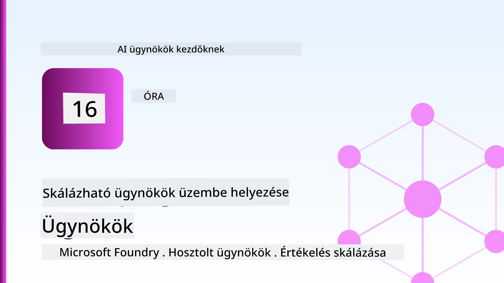
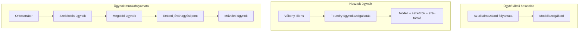
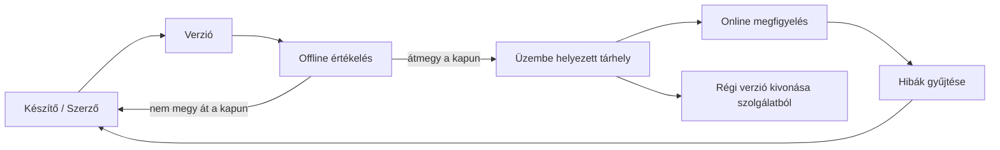
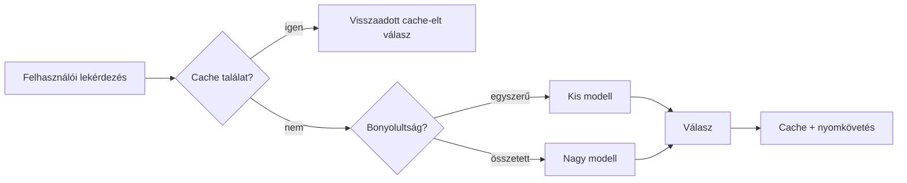
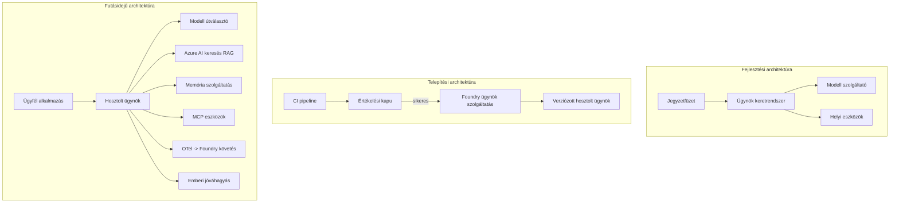

# Skálázható ügynökök telepítése a Microsoft Foundry segítségével



Az eddigi kurzus során olyan ügynököket hoztál létre, amelyek a laptopodon, egy jegyzetfüzetben futnak, az `az login` és néhány környezeti változó vezérlésével. Ez pontosan a megfelelő módja a tanulásnak. Nem ez a megfelelő módja azoknak az ügynököknek a futtatására, amelyekre ezrek támaszkodnak hajnali 3-kor.

Ez a lecke az „azon működik, hogy a gépemen” és az „azon működik, megbízhatóan és megfizethető módon, élesben” közötti szakadékról szól. Ezt a szakadékot a **Microsoft Foundry** és a **Microsoft Foundry Agent Service** segítségével zárjuk, és egy valódi ügyfélszolgálati ügynököt építünk, amely eszközökkel, lekéréssel, memóriával, értékeléssel és megfigyeléssel rendelkezik.

## Bevezetés

Ez a lecke a következőket fedi le:

- A különbség a **prototípus ügynök** és a **telepített ügynök** között, és hogy az átmenet főként a modell körüli mindennel kapcsolatos.
- Az **ügynökök telepítési mintái**: kliens hosztolt, szolgáltatásba hosztolt (Hosztolt Ügynökök) és munkafolyamat-vezérelt.
- Az **ügynök életciklusa** a Microsoft Foundry-n — létrehozás, verziózás, telepítés, értékelés, megfigyelés, nyugdíjazás.
- **Skálázási stratégiák**: modell útválasztás, gyorsítótárazás, párhuzamosság és állapot nélküli tervezés.
- **Megfigyelhetőség** az OpenTelemetry és a Foundry nyomkövetése révén.
- **Költségoptimalizálás** a modell kiválasztás, útválasztás és értékelési kapuk révén.
- **Vállalati megfontolások**: kormányzás, emberi jóváhagyás, és az MCP szerverek biztonságos éles futtatása.

## Tanulási célok

A lecke elvégzése után tudni fogod, hogyan:

- Válaszd ki a megfelelő telepítési mintát adott ügynöki munkaterheléshez.
- Telepíts egy ügynököt a Microsoft Foundry Agent Service-be, hogy verziózott, kormányzott és megfigyelhető legyen.
- Felszerelj egy ügynököt nyomkövetésre, és állíts be egy értékelési csatornát, amely minden kiadás előtt fut.
- Alkalmazz modell útválasztást és gyorsítótárazást a késleltetés és a költség skálázott kontrolljának érdekében.
- Adj hozzá emberi jóváhagyási kaput nagy kockázatú műveletekhez, és integrálj egy MCP szervert éles környezetben biztonságosan.

## Előfeltételek

Ez a lecke feltételezi, hogy az előző leckéket elvégezted, és jártas vagy a következőkben:

- Ügynökök építése a [Microsoft Agent Framework](../14-microsoft-agent-framework/README.md) segítségével (14. lecke).
- [Eszközhasználat](../04-tool-use/README.md) (4. lecke) és [Agentic RAG](../05-agentic-rag/README.md) (5. lecke).
- [Ügynök Memória](../13-agent-memory/README.md) (13. lecke) és [Agentic Protokollok / MCP](../11-agentic-protocols/README.md) (11. lecke).
- [Megfigyelhetőség és Értékelés](../10-ai-agents-production/README.md) (10. lecke) — erre a leckére épül közvetlenül.

Szükséged lesz még:

- Egy **Azure előfizetésre** és egy **Microsoft Foundry projektre**, legalább egy telepített csevegő modelllel.
- Az **Azure CLI** bejelentkezett (`az login`).
- Python 3.12+ és a tárolóban lévő [`requirements.txt`](../../../requirements.txt) csomagok.

## Prototípustól a termékig: mi változik valójában

A prototípus ügynök és a termék ügynök azonos alapvető ciklussal rendelkeznek — gondolkodás, eszköz-hívás, válaszadás. Ami változik, az minden, ami ezen a cikluson kívül van. A modell talán a termék ügynök 20%-a; a többi 80% az üzemeltetési váz.

| Kérdés | Prototípus | Termék |
| --- | --- | --- |
| **Hosztolás** | A jegyzetfüzetedben fut | Hosztolt szolgáltatásként fut, verziózott és kiterjesztett |
| **Azonosítás** | A saját `az login` tokened | Kezelt identitás, korlátozott RBAC-kal |
| **Állapot** | Memóriában, újraindításkor elveszik | Külső tárolt (szál tároló, memória szolgáltatás) |
| **Hiba** | A hibakövetést látod | Újrapróbálkozás, visszaesések, hibaüzenetek, figyelmeztetések |
| **Költség** | "Néhány cent" | Kérésenként nyomon követett, útválasztott, gyorsítótárazott, költségkerettel |
| **Minőség** | Kézzel ellenőrzött kimenet | Minden kiadás előtt automatikusan értékelt |
| **Bizalom** | Minden lépést engedélyezel | Szabályzat + emberi beavatkozás a kockázatos műveleteknél |

Tartsd ezt a táblázatot szem előtt. Az alábbiakban minden rész egy-egy sorhoz kapcsolódik.

## Ügynök Telepítési Minták

Három mintát fogsz használni, gyakran kombinálva.

### 1. Kliens Hosztolt Ügynökök

Az ügynök objektum a *te* alkalmazásfolyamatodban él. A kódod közvetlenül hívja a modell szolgáltatóját; a gondolkodási ciklus a szolgáltatásodban fut. Ezt használtuk az előző leckékben.

- **Használd, ha** teljes kontrollra van szükséged a ciklus felett, egyedi middleware-re, vagy ha az ügynököt egy meglévő backendbe ágyazod.
- **Hátrány**: a skálázás, állapot és ellenállóképesség saját felelősséged.

### 2. Hosztolt Ügynökök (Foundry Agent Service)

Az ügynök *erőforrásként regisztrált* a Microsoft Foundry-ban. A Foundry futtatja a gondolkodási ciklust, tárolja a szálakat, érvényesíti a tartalmi biztonságot és az RBAC-ot, és láthatóvá teszi az ügynököt a Foundry portálon. Az alkalmazásod egy vékony kliens lesz, amely szálakat hoz létre és olvassa a válaszokat.

- **Használd, ha** tartósságra, beépített megfigyelhetőségre, kormányzásra és kisebb üzemeltetési felületre van szükség.
- **Hátrány**: kevesebb mélyszintű kontroll a kezelt futtatási környezet miatt.

### 3. Ügynök Munkafolyamatok

Több ügynök (és eszköz) össze van composalva egy gráfba, explicit vezérlési folyamattal — sorozatos lépések, elágazások, emberi jóváhagyási pontok és tartós ellenőrzőpontok, amelyek szüneteltethetők és folytathatók. Ez a Microsoft Agent Framework **Munkafolyamatok** képessége, alkalmazva telepítési méretben.

- **Használd, ha** egyetlen feladat több specializált ügynököt érint, vagy köztes jóváhagyási lépést igényel.
- **Hátrány**: több mozgó alkatrész; szükséges a munkafolyamat szintű megfigyelhetőség.



## Ügynök életciklusa a Microsoft Foundry-n

Az ügynök telepítése nem egyszeri `push`. Ez egy ciklus, és nagyon hasonlít egy szoftver kiadási ciklusra, mert pontosan az.



A kulcsfontosságú ötlet, ami a [10. leckéből](../10-ai-agents-production/README.md) származik: **az offline értékelés egy kapu, nem pedig utólagos gondolat.** Egy új ügynök verzió nem kerül kiadásra, amíg át nem megy az értékelési küszöbökön. Az online megfigyelhetőség aztán a valós világ hibáit visszacsatolja az offline tesztkészletedbe. Ez az egész ciklus.

## Skálázási Stratégiák

Egy ügynök skálázása eltér egy állapot nélküli web API skálázásától, mert minden kérés több drága modell- és eszközhívást indíthat el. Négy technika viszi a terhelés nagy részét.

**Állapot nélküli kéréskezelés.** Ne tarts felhasználószintű állapotot a folyamat memóriájában. Tartósítsd a beszélgetési szálakat a Foundry szál tárolójában vagy egy memória szolgáltatásban, hogy bármely példány kezelni tudjon bármilyen kérést. Ez teszi lehetővé a vízszintes skálázást — példányok hozzáadása, nincs ragadós munkamenet.

**Modell útválasztás.** Nem minden kérés igényli a legképzettebb (és legdrágább) modell használatát. Egyszerűbb kérdéseket — szándék osztályozás, rövid tényszerű válaszok — irányíts egy kicsi, gyors modellhez, és a nagy modellt hagyd meg az igazi következtetésekhez. A Foundry **Model Router** ezt megteheti, vagy magad is készíthetsz egy könnyű osztályozót. A laborban elkészíted a saját verziódat.

**Válasz gyorsítótárazás.** Sok ügyfélszolgálati kérdés közel azonos („hogyan állíthatom vissza a jelszavam?”). Gyorsítótározd a gyakori kérdések válaszait, és szolgáld őket modell hozzáférés nélkül. Még a mérsékelt gyorsítótár találatok is jelentősen csökkentik a költséget és a késleltetést.

**Párhuzamosság és vissznyomás.** A modell szolgáltatóknak korlátozott a hívásmennyiségük. Korlátozd a párhuzamosságot, használj exponenciális visszaállású próbálkozásokat, és hibázz szépen (egy sorba állított "dolgozunk rajta" válasz jobb, mint egy 500-as hiba).



## Megfigyelhetőség élesben

Amit nem látsz, azt nem tudod működtetni. Ahogy a 10. leckében tárgyaltuk, a Microsoft Agent Framework natívan bocsát ki **OpenTelemetry** nyomkövetéseket — minden modellhívás, eszközözés és szervezési lépés egy-egy szakasz lesz. Élesben ezeket a szakaszokat exportálják a Microsoft Foundryba (vagy bármely OTel-kompatibilis háttérbe), így:

- Követheted egyetlen ügyfélpanasz teljes útját minden modell- és eszközhíváson keresztül.
- Figyelheted az egyes kérés átlag-, és 95%-os késleltetését és költségét az idő múlásával.
- Értesítést kapsz hibaarány-csúcsok és költséganomáliák esetén, mielőtt a felhasználóid vagy a pénzügyi csapatod észrevenné.

```python
from agent_framework.observability import get_tracer

tracer = get_tracer()

with tracer.start_as_current_span("support_request") as span:
    span.set_attribute("customer.tier", "enterprise")
    span.set_attribute("routed.model", "gpt-5-nano")
    # az ügynök végrehajtása automatikusan nyomon követett ebben a span-ben
```

Az olyan attribútumok, mint a `customer.tier` és a `routed.model`, azok, amelyek egy nyomkövetési falból kérdezősködő kérdéssé alakítják azt ("a vállalati ügyfelek túl gyakran kapnak-e irányítást a kicsi modellhez?").

## Költségoptimalizálás

Az éles ügynököknél a költséget elsősorban a tokenek uralják. Három kar, hatás sorrendben:

1. **A modell megfelelő méretezése.** Egy kicsi modell, amely átmegy az értékelési kapun, szinte mindig olcsóbb, mint egy nagy, amely szintén átmegy. Használd az értékelést annak bizonyítására, hogy a kicsi modell elég jó, ahelyett, hogy óvatosan az legnagyobb modellel indulnál.
2. **Útválasztás összetétel alapján.** Mint fentebb — nagy-modell fizetség csak az olyan kérésekért, amelyek valóban nagy-modellt igényelnek.
3. **Fokozott gyorsítótárazás.** A legolcsóbb modellhívás az, amit soha nem végzel el.

Az értékelési kapuk és a költségszabályozás ugyanannak a fegyelme két szemszögből: az értékelés megmutatja a *minőségi alsó határt*, az útválasztás és gyorsítótárazás pedig a költségek terén közel marad ehhez az alsó határhoz.

## Vállalati telepítési megfontolások

**Irányítás.** A Hosztolt Ügynökök öröklik a Foundry RBAC-ot, tartalombiztonságot és audit naplózást. Adj minden ügynöknek egy kezelt identitást a legkisebb szükséges jogosultsággal — csak olvasási hozzáférést a tudásbázishoz, korlátozott hozzáférést a jegykezelő API-hoz, semmi többet.

**Ember a hurokban.** Egyes műveletek túl jelentősek, hogy automatizálatlanok legyenek — visszatérítés, fiók törlése, jogi csapatnak való továbbítás. A Microsoft Agent Framework támogatja az **engedély-kötelezett** eszközöket: az ügynök javasolja a lépést, a végrehajtás szünetel, ember jóváhagy vagy elutasítja, és a munkafolyamat folytatódik. Az alapokat a [6. leckében](../06-building-trustworthy-agents/README.md) láthattad; itt telepíted.

**MCP éles környezetben.** Az [MCP](../11-agentic-protocols/README.md) lehetővé teszi, hogy az ügynököd külső eszközöket egy szabványos interfészen keresztül használjon. Élesben az MCP szervereket megbízhatatlan határként kezeld: pineld le a szerver verzióját, futtasd korlátozott identitással, ellenőrizd az eredményeket, és soha ne ossz meg vele titkokat. Az MCP szerver függőség, és a függőséget javítják, auditálják és korlátozzák.



Ezek a három ábra — fejlesztés, telepítés, futás — ugyanaz az ügynök életének három szakaszában. A következő laborban végigvezetünk a felépítésén.

## Gyakorlati labor: Éles kész ügyfélszolgálati ügynök

Nyisd meg a [`code_samples/16-python-agent-framework.ipynb`](./code_samples/16-python-agent-framework.ipynb) fájlt és dolgozz végig rajta. Összeállítasz egy **Contoso ügyfélszolgálati ügynököt**, amelybe minden termékkörhöz kapcsolódó funkció be van vezetve:

1. **Eszköz hívások** — rendelés állapot lekérdezése és támogatási jegyek megnyitása.
2. **RAG** — választ ad policy kérdésekre egy tudásbázisból (Azure AI Search, memóriában tárolt tartalék, hogy a jegyzetfüzet Search erőforrás nélkül is fusson).
3. **Memória** — emlékszik az ügyfélre a beszélgetés fordulói között.
4. **Modell útválasztás** — összetettség osztályozó útválaszt minden kérést egy kicsi vagy nagy modellhez.
5. **Válasz gyorsítótárazás** — ismétlődő kérdések gyorsítótárból kiszolgálva.
6. **Emberi jóváhagyás** — egy küszöbérték feletti visszatérítés emberi jóváhagyásra vár.
7. **Értékelő csatorna** — egy kis offline tesztkészlet pontozza az ügynököt és engedélyezési kaput szab.
8. **Megfigyelhetőség** — OpenTelemetry lekövetés minden kérés körül.

### Végigvezetés

A jegyzetfüzet úgy van szervezve, hogy minden termékkörhöz tartozó funkció önálló, futtatható szakasz legyen. A szíve a routing-plus-caching kéréskezelő:

```python
async def handle_support_request(query: str, customer_id: str) -> str:
    # 1. Ha lehet, szolgáljunk ki gyorsítótárból.
    cached = response_cache.get(normalize(query))
    if cached:
        return cached

    # 2. Az összetettség alapján irányítsuk a kéréseket a költségek kontrollálása érdekében.
    model = "gpt-5-nano" if is_simple(query) else "gpt-5-mini"

    # 3. A megfigyelhetőség érdekében futtassuk az ügynököt egy trace span-ben.
    with tracer.start_as_current_span("support_request") as span:
        span.set_attribute("routed.model", model)
        span.set_attribute("customer.id", customer_id)
        response = await support_agent.run(query, model=model)

    # 4. Gyorsítótárazás és visszaadás.
    response_cache.set(normalize(query), response.text)
    return response.text
```

Az engedélyezési kapu, ami egy kiadást őriz:

```python
async def evaluation_gate(agent, test_cases, threshold: float = 0.8) -> bool:
    passed = 0
    for case in test_cases:
        result = await agent.run(case["input"])
        if score_response(result.text, case["expected"]) >= 0.8:
            passed += 1
    pass_rate = passed / len(test_cases)
    print(f"Evaluation pass rate: {pass_rate:.0%} (gate: {threshold:.0%})")
    return pass_rate >= threshold  # csak akkor telepíts, ha a kapu átmegy
```

Olvass el minden sort — a jegyzetfüzet szándékosan kicsi primitíveket tartalmaz, hogy semmi ne legyen elrejtve egy keretrendszeri hívás mögött.

## Telepített Ügynök Érvényesítése Smoke Tesztekkel

A fenti értékelési kapu *offline* fut az ügynök objektumodon. Ha az ügynököt hosztolt ügynökként telepíted, szükséged van még egy, még olcsóbb ellenőrzésre: **a telepített végpont valóban válaszol-e?**

A "sikeres" telepítés csak azt bizonyítja, hogy az irányító sík elfogadta a definíciót – ez nem bizonyítja, hogy az ügynök válaszol. Egy hiányzó függőség, rossz modell útválasztás, vagy lejárt kapcsolat zöld telepítést eredményezhet, ami semmit nem ad vissza. Egy **smoke test** ezt másodpercek alatt elkapja, minden telepítésnél, az értékelés költsége nélkül.

Ez a tároló egy készen használható smoke-test csatornát tartalmaz, amely az [AI Smoke Test](https://github.com/marketplace/actions/ai-smoke-test) GitHub Action-re épül:

- **Katalógus** — a [`tests/lesson-16-smoke-tests.json`](../../../tests/lesson-16-smoke-tests.json) tartalmazza a Contoso ügyfélszolgálat promptjait és állításait (tudásalapú válaszok, rendelés lekérdezése, témán belül maradás, és többlépéses szál folytonosság). Más leckék ügynökeinek katalógusai is megtalálhatók mellette — lásd a [`tests/README.md`](../tests/README.md).
- **Munkafolyamat** — a [`.github/workflows/smoke-test.yml`](../../../.github/workflows/smoke-test.yml) Azure OIDC bejelentkezéssel POST-olja minden promptot az ügynök Responses végpontjára, és bármely állítás sikertelensége esetén a munkafolyamat hibára fut.

```yaml
- name: Smoke-test hosted agent
  uses: JFolberth/ai-smoketest@v1
  with:
    project_endpoint: ${{ inputs.project_endpoint }}
    agent_name: ContosoSupportAgent
    tests_file: tests/lesson-16-smoke-tests.json
```


Futtassa az **Actions** fülről, miután az ügynök telepítve lett, megadva a Foundry projekt végpontját és az ügynök nevét. A szövetséges identitásnak a Foundry projekt hatókörében az **Azure AI User** szerepre van szüksége. Gondoljon a rétegekre úgy, mint egy piramisra: a füst tesztek (elérhető és válaszol?) minden telepítésnél lefutnak, az offline értékelés (elég jó már a kiadásra?) a promóció előtt történik, és az online értékelés (hogyan teljesít a valós környezetben?) folyamatosan fut.

## Tudásellenőrzés

Tesztelje tudását, mielőtt továbblépne a feladatra.

**1. Körülbelül mekkora része egy éles ügynöknek a "modell", és mi a többi?**

<details>
<summary>Válasz</summary>

A modell a rendszer kisebbsége — gyakran körülbelül 20%-ra becsülik. A fennmaradó rész az operatív váz: hosztolás és verziókezelés, identitás és RBAC, kinyílt állapot, hibakezelés, költségkövetés, értékelés és az emberi beavatkozást lehetővé tevő szabályok. A gyártásba lépés leginkább arról szól, hogy mindent *az érvelési ciklus köré* építsen.
</details>

**2. Mikor választana Hostolt Ügynököt egy kliens-oldalon futtatott ügynökkel szemben?**

<details>
<summary>Válasz</summary>

Amikor egy menedzselt futtatókörnyezetet szeretne beépített kitartással (folyamatok, amelyek megmaradnak és folytathatóak), megfigyelhetőséggel, tartalombiztonsággal és RBAC-kal, és hajlandó némi alacsony szintű kontrollt feladni az érvelési ciklus felett a kisebb üzemeltetési felületért cserébe. A kliens-oldali hosztolás akkor előnyös, ha teljes kontrollra van szüksége a ciklus felett, vagy az ügynököt egy meglévő backendbe ágyazza be.
</details>

**3. Miért kell egy skálázható ügynöknek állapotmentesnek lennie a saját folyamat memóriájában?**

<details>
<summary>Válasz</summary>

Hogy bármelyik példány kezelni tudjon bármilyen kérést, ami lehetővé teszi a vízszintes skálázást ragadó munkamenet nélkül. A felhasználónkénti beszélgetési állapotot kinyitják egy folyamattárolóba vagy memória szolgáltatásba. Ha az állapot a folyamat memóriájában lenne, az újraindításkor elveszne, és nem lehetne szabadon elosztani a terhelést.
</details>

**4. Milyen problémát old meg a modell útválasztás, és hogyan kapcsolódik az értékeléshez?**

<details>
<summary>Válasz</summary>

Az útválasztás az egyszerű kéréseket egy kis, olcsó, gyors modellhez irányítja, és a nagy modellt a valódi érveléshez tartja fenn, szabályozva ezzel mind a késleltetést, mind a költséget. Kapcsolódik az értékeléshez, mert az értékelés bizonyítja, hogy a kis modell elég jó egy bizonyos kérelemosztályra — az útválasztás értékelés nélkül csak találgatás.
</details>

**5. Mi az "értékelési kapu", és hol helyezkedik el az életciklusban?**

<details>
<summary>Válasz</summary>

Egy értékelési kapu offline tesztkészletet futtat egy új ügynökverzió ellen, és megakadályozza a telepítést, hacsak a sikerességi arány nem éri el a küszöbértéket. Az életciklusban a "verzió" és a "telepítés" között helyezkedik el, így a minőség előfeltétele a kiadásnak, nem pedig valami, amit szállítás után ellenőriz.
</details>

**6. Miért kell az MCP szervert megbízhatatlan határként kezelni a termelésben?**

<details>
<summary>Válasz</summary>

Mert egy külső függőség, amit az ügynök meghív. Rögzíteni kell a verzióját, egy hatókörű identitással futtatni, ellenőrizni az eredményeit, korlátozni a hívások számát, és soha nem szabad titkokat megosztani vele — ugyanaz a fegyelmezett eljárás, mint bármely harmadik féltől származó függőség esetén. Az eredményei befolyásolják az ügynök érvelését, így az érvényesítetlen bizalom biztonsági kockázat.
</details>

**7. Melyik egyetlen változtatásnak van általában a legnagyobb hatása az éles ügynök költségére, és miért?**

<details>
<summary>Válasz</summary>

A modell méretének helyes megválasztása — a legkisebb modell használata, amely még átmegy az értékelési kapun. A költséget elsősorban a tokenek dominálják, és egy kisebb modell, amely megfelel a minőségi követelménynek, szinte mindig olcsóbb, mint egy nagyobb. A gyorsítótárazás és az útválasztás tovább csökkenti a költségeket, de a megfelelő alapmodell kiválasztása a legnagyobb elsőrendű hatás.
</details>

**8. Milyen szerepet játszanak a span attribútumok, mint a `customer.tier` és `routed.model`, a megfigyelhetőségben?**

<details>
<summary>Válasz</summary>

Azáltal, hogy a nyers traszokat megválaszolható üzleti kérdésekké alakítják. Attribútumok nélkül csak egy „span falat” látunk; velük feltehetjük, hogy „túl gyakran irányítják-e az enterprise ügyfeleket a kis modellhez?” vagy „melyik modell kezeli a leglassúbb kéréseinket?”. Az attribútumok segítségével mérhető az üzemeltetés szempontjából fontos dimenziók szerinti diagnosztika.
</details>

## Feladat

Vegye elő a laborban elkészített ügyfélszupport ügynököt, és erősítse meg egy konkrét helyzethez: **előfizetéses számlázási támogatói ügynök egy SaaS vállalatnál.**

A beadottnak a következőket kell tartalmaznia:

1. **Cserélje le az eszközöket** számlázás szempontjából relevánsakra: `get_subscription_status`, `get_invoice`, és `issue_credit` (50 dollár feletti jóváírás emberi jóváhagyást igényel).
2. **Adjon hozzá három RAG dokumentumot**, amelyek lefedik a vállalat visszatérítési politikáját, számlázási ciklusát és lemondási feltételeit.
3. **Bővítse az értékelő készletet** legalább nyolc esetre, köztük legalább kettő olyannal, amelynek *szükséges* az emberi jóváhagyáson alapuló út elindítása, és erősítse meg, hogy az értékelési kapu helyesen enged vagy tilt.
4. **Adjon hozzá egy költségjelentést**: miután tíz vegyes kérdést futtatott le az ügynökön, jelenítse meg, hány ment a kis modellhez, hány a nagyhoz, és hány volt kiszolgálva gyorsítótárból.

Írjon egy rövid bekezdést (markdown cellában) arról, mely modellútválasztási szabályt választotta, és hogyan validálná azt valós forgalommal. Nincs egyetlen helyes válasz — az értékelés alapja, hogy a gyártási szempontokat koherensen vezette-e össze.

## Összefoglaló

Ebben a leckében egy ügynököt vitt át prototípusból gyártásba a Microsoft Foundry segítségével:

- A gyártásba lépés leginkább a modell körüli **operatív váznak** szól — hosztolás, identitás, állapot, hibakezelés, költség, minőség és bizalom.
- Megismerte a három **telepítési mintát** — kliens-hosztolás, Hostolt Ügynökök és Ügynök Munkafolyamatok — és azok mikor alkalmazhatók.
- Áttekintette az **ügynök életciklust**, ahol az offline **értékelés kiadási kapuként** szolgál, míg az online megfigyelhetőség visszacsatolja a hibákat a tesztkészletbe.
- Alkalmazta a **skálázási stratégiákat** — állapotmentes tervezés, modell útválasztás, gyorsítótárazás és korlátozott párhuzamosság — és összekötötte mindezt a **költségoptimalizálással**.
- Beiktatta az **vállalati szabályozásokat**: RBAC, emberi jóváhagyás az érvelési folyamatban és gyártásbiztos MCP integráció.
- Felépített egy **gyártásra kész ügyfélszupport ügynököt**, amely az összes említett szempontot futtatható kódba köti bele.

A következő lecke az ellenkező utat járja: ahelyett, hogy felhőbe skálázná az ügynököket, lehozza őket egyetlen fejlesztői gépre és teljesen helyben futtatja őket.

## További erőforrások

- <a href="https://learn.microsoft.com/azure/ai-foundry/what-is-azure-ai-foundry" target="_blank">Microsoft Foundry dokumentáció</a>
- <a href="https://learn.microsoft.com/azure/ai-foundry/agents/overview" target="_blank">Microsoft Foundry Ügynök Szolgáltatás áttekintése</a>
- <a href="https://learn.microsoft.com/en-us/agent-framework/overview/?wt.mc_id=youtube_26688_organicsocial_reactor&pivots=programming-language-python" target="_blank">Microsoft Agent Framework</a>
- <a href="https://learn.microsoft.com/azure/ai-foundry/concepts/model-router" target="_blank">Modell útválasztó a Microsoft Foundryban</a>
- <a href="https://learn.microsoft.com/azure/search/search-what-is-azure-search" target="_blank">Azure AI Keresés</a>
- <a href="https://opentelemetry.io/" target="_blank">OpenTelemetry</a>
- <a href="https://github.com/marketplace/actions/ai-smoke-test" target="_blank">AI Smoke Test GitHub Action</a>
- <a href="https://modelcontextprotocol.io/" target="_blank">Model Context Protocol (MCP)</a>

## Előző lecke

[Számítógép használati ügynökök építése (CUA)](../15-browser-use/README.md)

## Következő lecke

[Helyi mesterséges intelligencia ügynökök létrehozása](../17-creating-local-ai-agents/README.md)

---

<!-- CO-OP TRANSLATOR DISCLAIMER START -->
**Jogi nyilatkozat**:
Ez a dokumentum az AI fordítási szolgáltatás, a [Co-op Translator](https://github.com/Azure/co-op-translator) segítségével készült. Bár az pontosságra törekszünk, kérjük, vegye figyelembe, hogy az automatikus fordítások hibákat vagy pontatlanságokat tartalmazhatnak. Az eredeti dokumentum az anyanyelvén tekintendő hiteles forrásnak. Fontos információk esetén professzionális emberi fordítást javasolunk. Nem vállalunk felelősséget semmilyen félreértésért vagy téves értelmezésért, amely ebből a fordításból ered.
<!-- CO-OP TRANSLATOR DISCLAIMER END -->