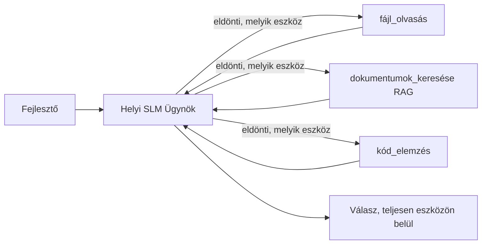
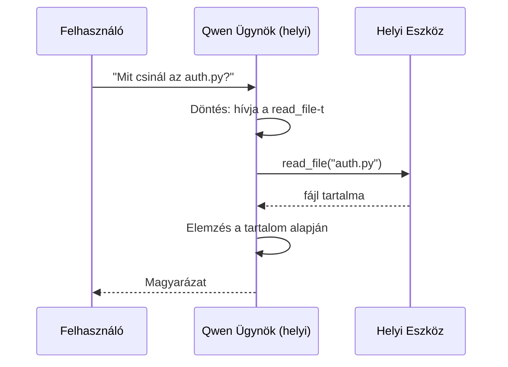
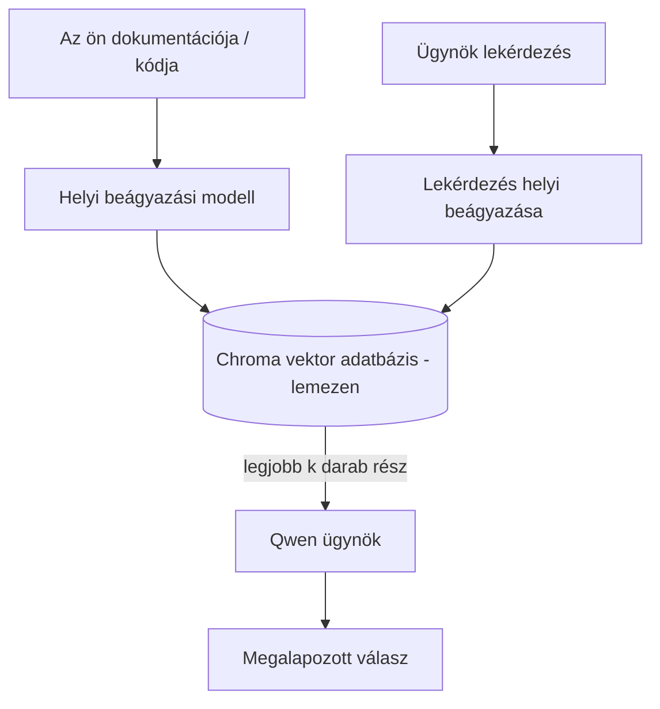
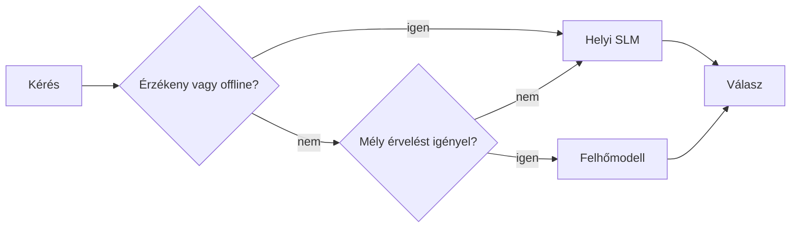

# Helyi MI-ügynökök létrehozása a Microsoft Foundry Local és a Qwen segítségével


Az előző lecke az ügynököket a felhőbe *nagyította fel*. Ez lehozta őket egyetlen gépre. A végére lesz egy működő mérnöki asszisztensed, amely érvel, eszközöket hív, olvassa a fájljaidat, és keres a dokumentációdban — **egyetlen felhőalapú lekérés nélkül.**

Miért akarhatod ezt? Három gyakran felmerülő ok a valódi mérnöki munkában:

- **Adatvédelem.** A kód és a dokumentumok soha nem hagyják el a gépet. Sem parancs, sem kivonat, sem ügyféladat nem lépi át a hálózati határt.
- **Költség.** A helyi lekérdezésnek nincs tokenalapú díja. Egész nap iterálhatsz csak az áram árát fizetve.
- **Offline.** Repülőn, biztonságos létesítményben vagy áramszünet esetén az ügynök még mindig működik.

A buktató, hogy egy élvonalbeli felhőmodellt cserélsz le egy **Kis Nyelvű Modellre (SLM)**, amely a CPU-don, GPU-don vagy NPU-don fut. Ez a lecke arról szól, hogyan lehet jó ügynököket építeni ezen korlátokon belül, ahelyett, hogy azt tennénk, mintha a korlát nem létezne.

## Bevezetés

Ez a lecke az alábbiakról szól:

- **Kis Nyelvű Modellek (SLM-ek)** — mik ők, hol jók, és hol nem.
- **Microsoft Foundry Local** — egy futtatókörnyezet, amely a modelleket eszközönként tölti le és szolgál ki egy **OpenAI-kompatibilis API** segítségével.
- **Qwen funkcióhívó modellek** — SLM-ek, amelyek megbízhatóan produkálnak eszközhívásokat, ami lehetővé teszi a helyi *ügynököket* (nem csak helyi csevegést).
- **Helyi eszközök, helyi RAG és helyi MCP** — az ügynök képességeit felhő nélkül biztosítva.
- **Hibrid minták** — mikor tartsd helyben, mikor nyúlj a felhőhöz.

## Tanulási célok

A lecke végére tudni fogod, hogyan kell:

- Megmagyarázni az SLM-ek kompromisszumait és kiválasztani a megfelelő helyi ügynök eseteket.
- Helyben kiszolgálni egy Qwen modellt a Foundry Local segítségével, az OpenAI-kompatibilis végponton keresztül kapcsolódva.
- Egy teljes egészében a munkaállomásodon futó eszközhívó ügynököt építeni.
- Helyi RAG-et hozzáadni saját dokumentumaid fölött helyi vektorbázis (Chroma) használatával.
- Az ügynököt helyi MCP szerverhez kapcsolni és gondolkodni a hibrid helyi/felhő megoldásokról.

## Előfeltételek

Ez a lecke feltételezi, hogy az előző leckéket elvégezted és kényelmes vagy:

- [Eszközhasználat](../04-tool-use/README.md) (4. lecke) és [Ügynöki RAG](../05-agentic-rag/README.md) (5. lecke).
- [Ügynöki Protokollok / MCP](../11-agentic-protocols/README.md) (11. lecke).
- A [Microsoft Agent Framework](../14-microsoft-agent-framework/README.md) (14. lecke).

Emellett szükséged lesz:

- Fejlesztői munkaállomás. **8 GB RAM reális minimum; 16 GB+ kényelmes.** GPU vagy NPU segít, de nem kötelező.
- **Microsoft Foundry Local** telepítve (lásd az alábbi beállítási részt).
- Python 3.12+ és a tároló [`requirements.txt`](../../../requirements.txt) fájljában lévő csomagok, plusz `foundry-local-sdk`, `openai`, és `chromadb` ehhez a leckéhez.

## Kis Nyelvű Modellek: A megfelelő eszköz helyi munkához

Egy élvonalbeli felhőmodell több száz milliárd paraméterrel és adatközponttal rendelkezik mögötte. Egy SLM néhány milliárd paraméterű és bele kell férnie a laptopod RAM-jába. Ez a különbség világos elvárásokat állít.

**Az SLM-ek jók:**

- Strukturált, jól körülhatárolt feladatok — osztályozás, kivonatolás, összegzés ismert dokumentumról.
- **Eszközhívás** — eldönteni, melyik funkciót hívjuk meg és milyen argumentumokkal.
- Gyors, olcsó, privát iteráció a saját adataidon.

**Az SLM-ek gyengék:**

- Nyitott végű, többlépéses érvelés nagy kontextusban.
- Átfogó világismeret (kevesebbet láttak, és többet felejtenek).

A helyi ügynökök nyerő stratégiája ezért: **az SLM irányítson, az eszközök végezzék a nehéz munkát.** A modellnek nem kell *ismernie* a kódbázisod — tudnia kell, mikor hívja a `read_file` és `search_docs` funkciókat. Ez közvetlenül az SLM erejére játszik.



## Microsoft Foundry Local

A **Microsoft Foundry Local** egy könnyű futtatókörnyezet, amely a modelleket teljesen a gépeden tölti le, kezeli és szolgáltatja. Számunkra a legfontosabb jellemzője, hogy egy **OpenAI-kompatibilis HTTP végpontot** tesz elérhetővé — ami azt jelenti, hogy az OpenAI SDK és a Microsoft Agent Framework OpenAI kliens csak a `base_url` megváltoztatásával képes vele működni. Amit az ügynökök építéséről tanultál, az mind átvihető; csak a végpont költözik a felhőből a `localhost`-ra.

A Foundry Local automatikusan kiválasztja a legjobb buildet a hardveredhez — CPU-s, CUDA/GPU-s vagy NPU-s buildet — így nem kell kézzel optimalizálnod gépenként.

### Beállítás

Telepítsd a Foundry Local-t (lásd az adott operációs rendszerre szóló [dokumentációt](https://learn.microsoft.com/azure/ai-foundry/foundry-local/)), majd ellenőrizd, hogy működik:

```bash
# Telepítés (példa; kövesd a dokumentációt a platformodra vonatkozóan)
winget install Microsoft.FoundryLocal      # Windows
# brew install microsoft/foundrylocal/foundrylocal   # macOS

# Tölts le és futtass egy Qwen modellt, majd indítsd el a helyi szolgáltatást
foundry model run qwen2.5-7b-instruct
foundry service status
```

Ha a szolgáltatás fut, már van egy helyi, OpenAI-kompatibilis végpontod (általában `http://localhost:PORT/v1`). A jegyzetfüzet a `foundry-local-sdk` segítségével automatikusan felfedezi a végpontot, így nem kell keménykódolnod a portot.

## Qwen funkcióhívás: Miért fontos ez

Ügynök csak akkor ügynök, ha képes eszközöket hívni. Sok SLM tud csevegni, de megbízhatatlan, hibás eszközhívásokat produkál. A **Qwen** modelleket funkcióhívásra képezik, és következetesen jól formázott eszközhívási struktúrákat bocsátanak ki — ez az, ami egy helyi csevegőmodellt helyi *ügynökké* alakít.

A folyamat az ismert eszközhívó ciklus, csak eszközön fut:



## Helyi RAG

A dokumentációkeresés az a terület, ahol a helyi ügynökök megtartják hasznosságukat. Ahelyett, hogy reménykednénk, hogy az SLM megjegyezte a keretrendszer dokumentációját, beágyazzuk azokat egy **helyi vektorbázisba**, és az ügynök igény szerint előhívja a releváns részeket.

A **Chroma**-t használjuk, ami egy beágyazott vektorraktár, amely folyamatban fut, nincs szükség külön szerverre. A folyamat teljesen helyi: helyi beágyazó modell → helyi vektorok → helyi keresés → helyi SLM.



Ez ugyanaz az Ügynöki RAG minta, mint az 5. leckében — az egyetlen változás, hogy minden komponens a gépeden fut.

## Helyi MCP szerverek

Az [MCP](../11-agentic-protocols/README.md) egy szállítóprotoko, nem felhőszolgáltatás. Egy MCP szerver helyi folyamatként futhat `stdio`-n, és az ügynököd számára elérhetővé teszi az eszközöket a szabványos protokollon keresztül. Így újrahasznosíthatod az egyre növekvő MCP szerverek ökoszisztémáját — fájlrendszer-hozzáférés, git műveletek, adatbázis lekérdezések — teljes offline módban.

A biztonsági állásfoglalás eltér a felhőtől, de nem hiányzik: egy helyi MCP szerver ugyanazzal a felhasználói jogosultsággal fut, mint te, ezért korlátozd, mit érhet el (például egy projektkönyvtárt, nem az egész otthoni mappádat), és az outputokat bemenetként kezeld, amiket ellenőrizni kell.

## Hibrid felhő- és helyi minták

A helyi első nem jelenti azt, hogy csak helyi. Az érett rendszerek szenzitivitás és nehézség szerint irányítanak:

| Helyzet | Hol fut |
| --- | --- |
| Érzékeny kód / adat, vagy offline | **Helyi SLM** |
| Egyszerű, körülhatárolt feladat | **Helyi SLM** (olcsó, gyors) |
| Nehéz, többlépcsős érvelés nem érzékeny adatán | **Felhőmodell** |
| Minden, áramszünet idején | **Helyi SLM** (kíméletes degradáció) |

Ez tükrözi a 16. leckében bemutatott **modellirányítás** ötletét — csakhogy az egyik "modell" most a saját géped. Egy robusztus tervezés visszautal a helyire, ha a felhő nem elérhető, így az ügynök minőségben romlik, de nem bukik el hirtelen.



## Gyakorlati labor: Helyi mérnöki asszisztens

Nyisd meg a [`code_samples/17-local-agent-foundry-local.ipynb`](./code_samples/17-local-agent-foundry-local.ipynb) fájlt és dolgozz végig rajta. Egy teljes egészében munkaállomáson futó **helyi mérnöki asszisztenst** építesz, amely képes:

1. **Eszközöket hívni** — Qwen funkcióhívással a Foundry Local-on keresztül.
2. **Helyi fájlműveleteket végezni** — listázni és olvasni a projekt könyvtár fájljait.
3. **Kódot elemezni** — alapvető metrikákat jelenteni egy forrásfájlon.
4. **Dokumentációt keresni** — helyi RAG egy dokumentumkönyvtáron Chroma segítségével.
5. **MCP-t használni** — kapcsolódni egy helyi MCP szerverhez (kíméletes kihagyással, ha nincs beállítva).

Egyetlen ponton sem használunk felhőbeli lekérést.

### Áttekintés

Az asszisztens az OpenAI-kompatibilis végponton keresztül kapcsolódik a Foundry Local-hoz, így az ügynöki kód szinte megegyezik a felhős leckékével — csak az ügyfél változik:

```python
from foundry_local import FoundryLocalManager
from openai import OpenAI

# A Foundry Local felfedezi/letölti a modellt, és helyi végpontot biztosít számunkra.
manager = FoundryLocalManager(\"qwen2.5-7b-instruct\")
client = OpenAI(base_url=manager.endpoint, api_key=manager.api_key)  # az api_key egy helyi helykitöltő
```

Az eszközök egyszerű Python funkciók, amelyek egy projekthez vannak kötve:

```python
def read_file(path: str) -> str:
    \"\"\"Read a file, but only inside the sandboxed project directory.\"\"\"
    full = (PROJECT_ROOT / path).resolve()
    if PROJECT_ROOT not in full.parents and full != PROJECT_ROOT:
        return \"Access denied: path is outside the project directory.\"
    return full.read_text(encoding=\"utf-8\")
```

Figyeld meg a sandbox ellenőrzést — még helyben is egy tetszőleges útvonalat olvasó eszköz kockázatos. A jegyzetfüzet minden eszközt egyetlen projekt gyökeréhez köt.

## Tudásellenőrzés

Teszteld a megértésed, mielőtt megcsinálod a feladatot.

**1. Mondj két konkrét okot, miért futtassunk egy ügynököt helyben a felhő helyett.**

<details>
<summary>Válasz</summary>

Bármely kettő az alábbiak közül: **adatvédelem** (kód és adat soha nem hagyja el a gépet), **költség** (nincs tokenek szerinti számlázás), és **offline képesség** (hálózat nélkül fut — repülőn, biztonságos helyen vagy áramszünetben). A szabályozási és megfelelőségi korlátozások, amelyek tiltják az adatok eszközön kívüli küldését, gyakori indok az adatvédelem mellett.
</details>

**2. Milyen munkamegosztást ajánl az SLM és az eszközei között egy helyi ügynöknél, és miért?**

<details>
<summary>Válasz</summary>

Az SLM **legyen az irányító** (dönti el, melyik eszközt hívja és milyen argumentumokkal), az **eszközök végezzék a nehéz munkát** (fájlok olvasása, dokumentumok előhívása, eredmények számítása). Az SLM-ek erősek a körülhatárolt döntésekben, mint az eszközválasztás, de gyengébbek az átfogó ismeretben és a hosszú, többlépcsős érvelésben, ezért az eszközökre támaszkodás működik a legjobban.
</details>

**3. Mi teszi lehetővé, hogy a felhőügynöki kódot újrahasznosítsuk a Foundry Local-lal?**

<details>
<summary>Válasz</summary>

A Foundry Local egy **OpenAI-kompatibilis HTTP végpontot** tesz elérhetővé. Az OpenAI SDK és az Agent Framework OpenAI kliens csak a `base_url`-t változtatja meg (és helyi helyettesítő API kulcsot használ). Az ügynöki kód minden más része változatlan marad.
</details>

**4. Miért használunk kifejezetten Qwen funkcióhívó modellt bármilyen SLM helyett?**

<details>
<summary>Válasz</summary>

Mert egy ügynöknek megbízható, jól formázott **eszközhívásokat** kell produkálnia. Sok SLM tud csevegni, de hibás vagy következetlen eszközhívási struktúrákat bocsát ki. A Qwen modelleket funkcióhívásra képezik, és következetes eszközhívásokat termelnek, ami egy helyi csevegőmodellt működő helyi ügynökké tesz.
</details>

**5. A helyi RAG folyamatban mely komponensek futnak a gépen?**

<details>
<summary>Válasz</summary>

Mindegyik: a beágyazó modell, a vektorbázis (Chroma, lemezen), a lekérdező lépés és az SLM. A dokumentumokat helyben ágyazzák be, helyben tárolják, helyben kérdezik le, és helyi modell érvel fölöttük — egyik komponens sem érint felhőt.
</details>

**6. Egy helyi MCP szerver a gépeden fut. Ez automatikusan biztonságossá teszi? Milyen óvintézkedést kell még megtenned?**

<details>
<summary>Válasz</summary>

Nem. A helyi MCP szerver ugyanazzal a felhasználói jogosultsággal fut, mint te, tehát hozzáférhet bármihez, amihez te is. Korlátozd azt, hogy mit érinthet (például egyetlen projektkönyvtárat, nem az egész otthoni mappát), és az eredményeket bemenetként kezeld, amelyeket ellenőrizni kell, mielőtt tovább használnád őket.
</details>

**7. Írj le egy ésszerű hibrid útválasztási szabályt, amely tartalmaz egy helyi modellt is.**

<details>
<summary>Válasz</summary>

Irányítsd az érzékeny vagy offline kéréseket a helyi SLM-hez; az egyszerű, körülhatárolt feladatokat gyorsaság és költség miatt szintén a helyi SLM-hez; a nehéz, többlépcsős érvelést nem érzékeny adatokon a felhőmodellhez; és ha a felhő nem elérhető, térj vissza a helyi SLM-hez, hogy az ügynök kíméletesen degradáljon, ne hibázzon meg. Ez a modellirányítás (16. lecke) azzal a különbséggel, hogy a helyi gép az egyik modell.
</details>

**8. Milyen reális minimum RAM-igény van a helyi ügynök futtatásához ebben a leckében, és mit ad több RAM?**

<details>
<summary>Válasz</summary>

Körülbelül **8 GB** a reális minimum; 16 GB+ kényelmes. Több RAM lehetővé teszi nagyobb, képzettebb modellek futtatását és több kontextus megőrzését a memóriában. GPU vagy NPU gyorsítja a lekérdezést, de nem szükséges — a Foundry Local CPU-s buildet választ, ha nincs gyorsító.
</details>

## Feladat

Bővítsd a helyi mérnöki asszisztenst egy **helyi dokumentációellenőrzővé** egy általad választott kisebb projekthez (ha akarod, a tároló leckekönyvtáraiból is választhatsz).

A beküldésed tartalmazza:

1. **Valódi dokumentációs/kódfájlkönyvtár indexelését** Chromába (legalább öt fájl).
2. **`find_todos` eszköz hozzáadását**, amely átnézi a projektet `TODO`/`FIXME` megjegyzések után, és visszaadja őket fájl- és sorazonosítóval — azonos sandbox ellenőrzéssel, mint a `read_file`.

3. **Tegy fel az ügynöknek három kérdést**, amelyek arra kényszerítik, hogy kombinálja az eszközöket: egy tiszta RAG kérdést, egyet, amely egy adott fájl elolvasását igényli, és egyet, amely TODO-k megtalálását követeli meg.
4. **Mérd meg**: időzítsd a három válasz mindegyikét, és jegyezd fel egy markdown cellában. Írd meg, hogy a válaszadási késleltetés elfogadható-e a tervezett munkafolyamatodhoz.

Ezután írj egy rövid bekezdést arról, hogy **mit helyeznél át a felhőbe és mit tartanál meg helyben** ennél az értékelőnél, és miért. Az értékelés során azt nézik, hogy a helyi komponensek helyesen vannak-e összekötve, és hogy hibrid érvelésed helyes-e — nem a modell minőségét.

## Összefoglaló

Ebben a leckében létrehoztál egy ügynököt, amely teljes egészében a saját gépeden fut:

- A **SLM-ek** a szélességet cserélik adatvédelmi, költség- és offline működési előnyökre — és akkor működnek igazán jól, ha **eszközöket koordinálnak** ahelyett, hogy az összes tudást maguk hordoznák.
- A **Foundry Local** az eszközön szolgál ki modelleket egy **OpenAI-kompatibilis végponton keresztül**, így a felhőügynököd kódja egy soros változtatással átvihető.
- A **Qwen függvényhívó modellek** megbízható helyi eszközhasználatot — és így helyi *ügynököket* — tesznek lehetővé.
- A **helyi RAG** (Chroma) és a **helyi MCP** képességet ad az ügynöknek anélkül, hogy elhagyná a gépet.
- A **hibrid minták** lehetővé teszik az érzékenység és nehézség szerinti irányítást, a helyi végpont pedig elegáns tartalékmegoldásként szolgál.

Ezzel teljes a telepítési ív: a 16. lecke az ügynököket skálázta Microsoft Foundry-ba, ez a lecke pedig egyetlen munkaállomásra szállítja vissza őket. A következő lecke a telepített ügynökök biztonságossá tételére fókuszál.

## További források

- <a href="https://learn.microsoft.com/azure/ai-foundry/foundry-local/" target="_blank">Microsoft Foundry Local dokumentáció</a>
- <a href="https://learn.microsoft.com/azure/ai-foundry/what-is-azure-ai-foundry" target="_blank">Microsoft Foundry dokumentáció</a>
- <a href="https://learn.microsoft.com/en-us/agent-framework/overview/?wt.mc_id=youtube_26688_organicsocial_reactor&pivots=programming-language-python" target="_blank">Microsoft Agent Framework</a>
- <a href="https://qwen.readthedocs.io/en/latest/framework/function_call.html" target="_blank">Qwen függvényhívó dokumentáció</a>
- <a href="https://modelcontextprotocol.io/" target="_blank">Model Context Protocol (MCP)</a>
- <a href="https://docs.trychroma.com/" target="_blank">Chroma vektor adatbázis</a>

## Előző lecke

[Skálázható ügynökök telepítése](../16-deploying-scalable-agents/README.md)

## Következő lecke

[AI ügynökök biztonságossá tétele](../18-securing-ai-agents/README.md)

---

<!-- CO-OP TRANSLATOR DISCLAIMER START -->
**Jogi nyilatkozat**:
Ez a dokumentum az AI fordítási szolgáltatás, a [Co-op Translator](https://github.com/Azure/co-op-translator) segítségével készült. Bár az pontosságra törekszünk, kérjük, vegye figyelembe, hogy az automatikus fordítások hibákat vagy pontatlanságokat tartalmazhatnak. Az eredeti dokumentum az anyanyelvén tekintendő hiteles forrásnak. Fontos információk esetén professzionális emberi fordítást javasolunk. Nem vállalunk felelősséget semmilyen félreértésért vagy téves értelmezésért, amely ebből a fordításból ered.
<!-- CO-OP TRANSLATOR DISCLAIMER END -->