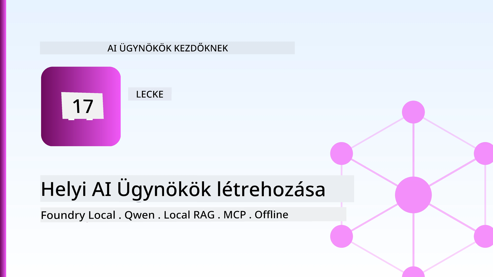
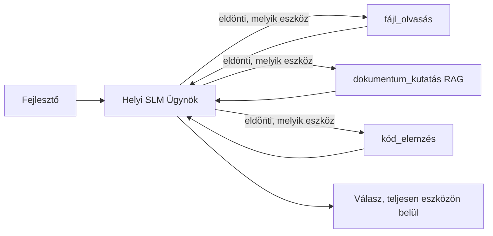
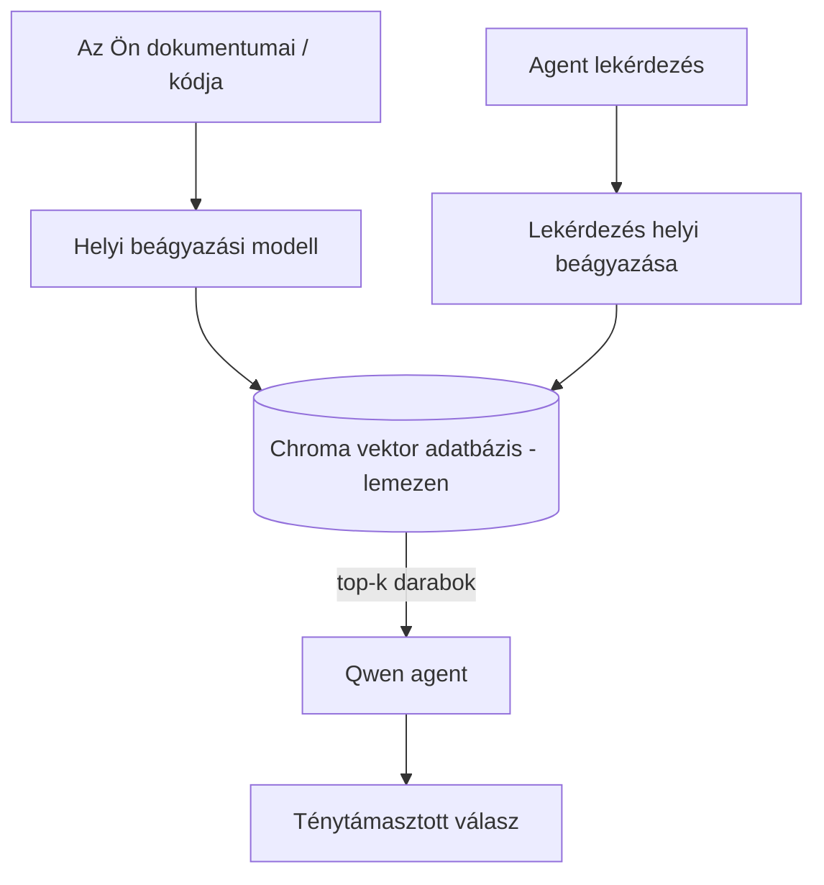
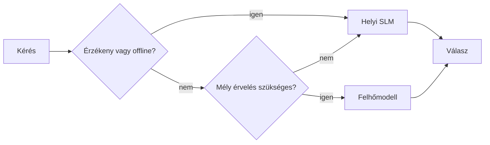

# Helyi MI ügynökök létrehozása a Microsoft Foundry Local és a Qwen használatával



Az előző lecke az ügynököket *felhőbe* skálázta fel. Ez lehozza őket egyetlen gépre. A végére lesz egy működő mérnöki asszisztensed, amely érvel, hív eszközöket, olvassa a fájljaidat és keresi a dokumentációdat — **egyetlen felhőalapú következtetési hívás nélkül.**

Miért szeretnéd ezt? Három ok, amelyek folyamatosan felmerülnek a valódi mérnöki munkában:

- **Adatvédelem.** A kód és a dokumentumok soha nem hagyják el a gépet. Egyetlen kérést, részletet vagy ügyféladatot sem küld át a hálózati határon.
- **Költség.** A helyi következtetésnek nincs darabonkénti költsége. Egész nap iterálhatsz az áramszámla áráért cserébe.
- **Offline.** Repülőn, biztonságos létesítményben vagy áramszünet esetén az ügynök továbbra is működik.

A kompromisszum, hogy egy élvonalbeli felhőmodellt lecserélsz egy **Kis Nyelvi Modellre (SLM)**, amely a CPU-don, GPU-don vagy NPU-dn fut. Ez a lecke arról szól, hogyan építsünk ügynököket, amelyek *jók* ebben a keretben, ahelyett, hogy úgy tennénk, mintha a korlát nem létezne.

## Bevezetés

Ez a lecke a következőket tárgyalja:

- **Kis Nyelvi Modellek (SLM-ek)** — mik ezek, hol tündökölnek, és hol nem.
- **Microsoft Foundry Local** — egy futtatókörnyezet, amely modelljeket tölt le és szolgál ki eszközön, egy **OpenAI-kompatibilis API**-n keresztül.
- **Qwen függvényhívó modellek** — SLM-ek, amelyek megbízhatóan eszközhívásokat generálnak, ami lehetővé teszi a helyi *ügynökök* (nem csak helyi chat) megvalósítását.
- **Helyi eszközök, helyi RAG és helyi MCP** — az ügynök képességeinek felhő nélküli biztosítása.
- **Hibrid minták** — mikor tartsuk helyileg a dolgokat, és mikor nyúljunk a felhőbe.

## Tanulási célok

A lecke elvégzése után tudni fogod, hogyan:

- Megmagyarázd az SLM-ek kompromisszumait és válassz megfelelő helyi ügynökös felhasználási eseteket.
- Helyben szolgálj ki egy Qwen modellt a Foundry Local segítségével, és csatlakozz hozzá az OpenAI-kompatibilis végponton keresztül.
- Építs eszközhívó ügynököt, amely teljes egészében a munkaállomásodon fut.
- Adj hozzá helyi RAG-ot a saját dokumentumaidhoz egy helyi vektortáron (Chroma) keresztül.
- Csatlakoztasd az ügynököt egy helyi MCP szerverhez, és gondolkodj el a hibrid helyi/felhős tervezéseken.

## Előfeltételek

Ez a lecke feltételezi, hogy elvégezted a korábbi leckéket, és kényelmesen mozogsz:

- [Eszközhasználat](../04-tool-use/README.md) (4. lecke), és [Ügynöki RAG](../05-agentic-rag/README.md) (5. lecke).
- [Ügynöki Protokollok / MCP](../11-agentic-protocols/README.md) (11. lecke).
- A [Microsoft Agent Framework](../14-microsoft-agent-framework/README.md) (14. lecke).

Szükséged lesz még:

- Egy fejlesztői munkaállomásra. **8 GB RAM reális minimum**; 16 GB+ kényelmes. GPU vagy NPU segít, de nem kötelező.
- Telepített **Microsoft Foundry Local** (lásd az alábbi beállítási részt).
- Python 3.12+ és a tárházban lévő [`requirements.txt`](../../../requirements.txt) csomagok, plusz `foundry-local-sdk`, `openai` és `chromadb` ehhez a leckéhez.

## Kis Nyelvi Modellek: A helyi munkához megfelelő eszköz

Egy élvonalbeli felhőmodellnek több száz milliárd paramétere van és mögötte adatközpont áll. Egy SLM néhány milliárd paraméterrel rendelkezik, és bele kell férnie a laptopod RAM-jába. Ez a különbség világos elvárásokat szab.

**Az SLM-ek jók:**

- Strukturált, behatárolt feladatok — egy ismert dokumentum osztályozása, kivonatolása, összefoglalása.
- **Eszközhívás** — eldönteni, melyik függvényt hívjuk meg és milyen argumentumokkal.
- Gyors, olcsó, privát iteráció a saját adatodon.

**Az SLM-ek gyengébbek:**

- Nyitott végű, soklépéses érvelés nagy kontextusban.
- Széles körű világismeret (kevesebbet láttak, és többet felejtenek).

A nyerő stratégia a helyi ügynököknél tehát: **az SLM legyen az irányító, az eszközök végezzék el a nehéz munkát.** A modellnek nem kell *ismernie* a kódodat — elég, ha tudja, mikor hívja a `read_file` vagy a `search_docs` függvényt. Ez közvetlenül az SLM erősségeire épít.



## Microsoft Foundry Local

A **Microsoft Foundry Local** egy könnyű futtatókörnyezet, amely teljes egészében a gépeden kezeli, letölti és szolgálja ki a modelleket. A számunkra legfontosabb tulajdonsága, hogy egy **OpenAI-kompatibilis HTTP-végpontot** tesz elérhetővé — ami azt jelenti, hogy az OpenAI SDK és a Microsoft Agent Framework OpenAI kliens csak a `base_url` megváltoztatásával tud működni vele. Minden, amit az ügynökök építéséről tanultál, közvetlenül átvihető; csak a végpont költözik a felhőből `localhost`-ra.

A Foundry Local automatikusan kiválasztja a legjobb modellt a hardveredhez — CPU, CUDA/GPU vagy NPU — így nem kell kézzel optimalizálni gépenként.

### Beállítás

Telepítsd a Foundry Local-t (lásd az operációs rendszered dokumentációját a [dokumentációban](https://learn.microsoft.com/azure/ai-foundry/foundry-local/)), majd ellenőrizd, hogy működik:

```bash
# Telepítés (példa; kövesd a platformod dokumentációját)
winget install Microsoft.FoundryLocal      # Windows
# brew install microsoft/foundrylocal/foundrylocal   # macOS

# Tölts le és futtass egy Qwen modellt, majd indítsd el a helyi szolgáltatást
foundry model run qwen2.5-7b-instruct
foundry service status
```

Ha a szolgáltatás fut, van egy helyi, OpenAI-kompatibilis végpontod (általában `http://localhost:PORT/v1`). A jegyzetfüzet a `foundry-local-sdk`-t használja, hogy automatikusan megtalálja a végpontot, így nem kell keménykódolni a portot.

## Qwen függvényhívás: Miért fontos

Egy ügynök csak akkor ügynök, ha képes eszközöket hívni. Sok SLM tud csevegni, de megbízhatatlan, hibás eszközhívásokat generál. A **Qwen** modellek a függvényhívásra vannak betanítva, és következetesen jól formált eszközhívási struktúrákat állítanak elő — ami pontosan az, ami a helyi csevegőmodellt helyi *ügynökké* teszi.

A folyamat a már ismert eszközhívó ciklus, csak éppen helyben fut:


## Helyi RAG

A dokumentáció keresése az a terület, ahol a helyi ügynökök megkapják a létjogosultságukat. Ahelyett, hogy reménykednénk, hogy az SLM megjegyezte a keretrendszered dokumentumait, beágyazod a dokumentumokat egy **helyi vektoradatbázisba**, és az ügynök igény szerint lekéri a releváns részeket.

A **Chromát** használjuk, egy beágyazott vektortárat, amely folyamaton belül fut, és nem igényel szervert. A folyamat teljesen helyi: helyi beágyazó modell → helyi vektorok → helyi lekérdezés → helyi SLM.



Ez ugyanaz az Agentic RAG minta, mint az 5. leckében — az egyetlen változás, hogy minden komponens a gépeden fut.

## Helyi MCP szerverek

Az [MCP](../11-agentic-protocols/README.md) egy szállítási protokoll, nem felhőszolgáltatás. Egy MCP szerver helyi folyamatként futhat `stdio`-n keresztül, és standard protokollon keresztül tesz eszközöket elérhetővé az ügynököd számára. Ez lehetővé teszi, hogy újrahasznosítsd a bővülő MCP szerver ökoszisztémát — fájlrendszer-hozzáférés, git műveletek, adatbázis-lekérdezések — teljesen offline.

A biztonsági helyzet más, mint a felhőben, de nem hiányzik: egy helyi MCP szerver a felhasználód jogosultságaival fut, ezért korlátozd a hozzáférését (pl. egy projektmappára, ne az egész home könyvtáradra), és az eredményeket bemenetként kezeld, amelyeket érdemes validálni.

## Hibrid felhő- és helyi minták

A helyi első nem jelenti a kizárólagos helyit. Érett rendszerek érzékenység és nehézség szerint irányítanak:

| Helyzet | Hol fut |
| --- | --- |
| Érzékeny kód / adat, vagy offline állapot | **Helyi SLM** |
| Egyszerű, behatárolt feladat | **Helyi SLM** (olcsó, gyors) |
| Nehéz soklépéses érvelés nem érzékeny adatokon | **Felhőmodell** |
| Minden, áramszünet idején | **Helyi SLM** (kegyelmi leépülés) |

Ez tükrözi a **modellirányítás** ötletét a 16. leckéből — csak most az egyik "modell" a saját géped. Egy robusztus tervezés visszatér a helyi megoldáshoz, ha a felhő nem elérhető, így az ügynök minőségromlással reagál a teljes meghibásodás helyett.



## Gyakorlati labor: Helyi mérnöki asszisztens

Nyisd meg a [`code_samples/17-local-agent-foundry-local.ipynb`](./code_samples/17-local-agent-foundry-local.ipynb) fájlt, és dolgozd végig. Egy **helyi mérnöki asszisztenst** építesz, amely teljes mértékben a munkaállomásodon fut, és tudja:

1. **Eszközöket hívni** — Qwen függvényhíváson keresztül, a Foundry Local használatával.
2. **Helyi fájlműveleteket végezni** — listázni és olvasni a fájlokat egy projektkönyvtárban.
3. **Kódot elemezni** — alapvető metrikákat jelenteni egy forrásfájlról.
4. **Dokumentációt keresni** — helyi RAG a dokumentációs mappán Chroma-val.
5. **MCP-t használni** — csatlakozni egy helyi MCP szerverhez (szelíden kihagyva, ha nincs konfigurálva).

Egyetlen felhőalapú következtetési hívás sem történik a folyamat során.

### Végigvezetés

Az asszisztens a Foundry Localhoz csatlakozik az OpenAI-kompatibilis végponton keresztül, így az ügynökkód majdnem teljesen megegyezik a felhős leckékével — csak a kliens változik:

```python
from foundry_local import FoundryLocalManager
from openai import OpenAI

# A Foundry Local felfedezi/letölti a modellt, és helyi végpontot biztosít számunkra.
manager = FoundryLocalManager(\"qwen2.5-7b-instruct\")
client = OpenAI(base_url=manager.endpoint, api_key=manager.api_key)  # az api_key egy helyi helyőrző
```

Az eszközök egyszerű Python függvények, amelyeket a projektkönyvtárra korlátoztunk:

```python
def read_file(path: str) -> str:
    \"\"\"Read a file, but only inside the sandboxed project directory.\"\"\"
    full = (PROJECT_ROOT / path).resolve()
    if PROJECT_ROOT not in full.parents and full != PROJECT_ROOT:
        return \"Access denied: path is outside the project directory.\"
    return full.read_text(encoding=\"utf-8\")
```

Figyeld meg a homokozóellenőrzést — még helyi környezetben is az véletlenszerű útvonalakat olvasó eszköz potenciális kockázat. A jegyzetfüzet minden eszközt egyetlen projektgyökérre korlátoz.

## Tudásellenőrzés

Teszteld a megértésed, mielőtt továbblépnél a feladatra.

**1. Adj két konkrét indokot, hogy miért futtass egy ügynököt helyileg a felhő helyett.**

<details>
<summary>Válasz</summary>

Bármely kettőt a következők közül: **adatvédelem** (a kód és az adat soha nem hagyja el a gépet), **költség** (nincs darabonkénti következtetési díj) és **offline képesség** (működik hálózat nélkül — repülőn, biztonságos létesítményben vagy áramszünet alatt). Az adatvédelmi okot gyakran támogató szabályozási/megfelelőségi korlátozások is léteznek, amelyek tilthatják az adatok eszközön kívüli küldését.
</details>

**2. Mi a javasolt feladatfelosztás az SLM és az eszközei között egy helyi ügynöknél, és miért?**

<details>
<summary>Válasz</summary>

Hagyd, hogy az SLM legyen az **irányító** (döntse el, melyik eszközt hívja meg és milyen paraméterekkel), és az **eszközök végezzék el a nehéz munkát** (fájlok olvasása, dokumentáció lekérése, eredmények számítása). Az SLM-ek erősek korlátozott döntésekben, mint az eszközválasztás, de gyengébbek a széleskörű tudásban és a hosszú, soklépéses következtetésekben, így az eszközökre támaszkodás az ő erősségeikre épít.
</details>

**3. Mi teszi lehetővé a felhőalapú agent kód újrahasználatát a Foundry Local-lal?**

<details>
<summary>Válasz</summary>

A Foundry Local egy **OpenAI-kompatibilis HTTP végpontot** exponál. Az OpenAI SDK és az Agent Framework OpenAI kliens csak a `base_url`-t cseréli le (és helyi helyettesítő API kulcsot használ), minden más az ügynökkódhoz változatlan marad.
</details>

**4. Miért használunk kifejezetten Qwen függvényhívó modellt, nem csak bármely SLM-et?**

<details>
<summary>Válasz</summary>

Mert az ügynöknek megbízható, jól formált **eszközhívásokat** kell előállítania. Sok SLM tud csevegni, de hibás vagy következetlen eszközhívási struktúrákat ad. A Qwen modelleket függvényhívásra képezték ki, és következetes eszközhívásokat adnak, ami egy helyi csevegőmodellt működő helyi ügynökké alakít.
</details>

**5. A helyi RAG folyamatában mely komponensek futnak a gépen?**

<details>
<summary>Válasz</summary>

Mindegyik: a beágyazó modell, a vektordatabase (Chroma, lemezen), a lekérdező lépés, és az SLM. A dokumentumok helyben kerülnek beágyazásra, helyben tárolásra, helyben lekérésre, és helyi modell érvel rajtuk — egyetlen komponens sem érint felhőt.
</details>

**6. Egy helyi MCP szerver a gépeden fut. Ez automatikusan biztonságossá teszi? Milyen óvintézkedést érdemes még tenni?**

<details>
<summary>Válasz</summary>

Nem. Egy helyi MCP szerver a felhasználód jogosultságaival fut, tehát bármit elérhet, amit te is. Korlátozd arra, amire szüksége van (például egyetlen projektmappára, ne az egész home könyvtáradra), és az eredményeit bemenetként kezeld, amelyeket validálni kell, mielőtt végrehajtanád őket.
</details>

**7. Írj le egy értelmes hibrid irányítási szabályt, amely tartalmaz egy helyi modellt is.**

<details>
<summary>Válasz</summary>

Irányítsd az érzékeny vagy offline kéréseket a helyi SLM-hez; egyszerű, behatárolt feladatokat is a helyi SLM-hez a gyorsaság és költséghatékonyság miatt; nehéz, soklépéses érvelést nem érzékeny adatokon a felhőmodellhez; és ha a felhő nem elérhető, ess vissza a helyi SLM-re, hogy az ügynök kegyelmesen degradálódjon ahelyett, hogy teljesen meghibásodna. Ez a modellirányítás (16. lecke), ahol a helyi gép az egyik modell.
</details>

**8. Mekkora a helyi ügynök futtatásához reális minimum RAM ebben a leckében, és mit ad több RAM?**

<details>
<summary>Válasz</summary>

Kb. **8 GB** a reális minimum; 16 GB+ kényelmes. Több RAM lehetővé teszi nagyobb, képzettebb modellek futtatását, és több kontextus tárolását memóriában. GPU vagy NPU gyorsítja a következtetést, de nem szükséges — a Foundry Local CPU verziót választ, ha nincs gyorsító.
</details>

## Feladat

Bővítsd ki a helyi mérnöki asszisztenst egy **helyi dokumentáció-ellenőrzővé** egy saját választásod szerinti kis projekthez (ha szeretnéd, használj egyet a tárház leckemappái közül).

A beküldésednek a következőket kell tartalmaznia:

1. Egy valódi dokumentációs/kód mappát indexelj be Chromába (legalább öt fájl).
2. Adj hozzá egy `find_todos` eszközt, amely átfésüli a projektet `TODO`/`FIXME` kommentek után, és visszaadja azokat fájlnévvel és sorszámmal, azonos homokozóellenőrzéssel, mint a `read_file`.

3. **Tegyél fel az ügynöknek három kérdést**, amelyek arra kényszerítik, hogy ötvözze az eszközöket: egy tiszta RAG kérdést, egyet, amihez egy konkrét fájl olvasása szükséges, és egyet, amihez TODO-k keresése szükséges.
4. **Mérd meg**: időzítsd mind a három választ, és jegyezd fel őket egy markdown cellában. Kommentáld, hogy az késleltetés elfogadható-e a kívánt munkafolyamatodhoz.

Ezután írj egy rövid bekezdést arról, hogy **mit helyeznél a felhőbe, és mit tartanál helyben** ennél az értékelőnél, és miért. Az alapján értékelnek, hogy a helyi komponensek helyesen vannak-e összekötve, és hogy a hibridelemződésed helytálló-e — nem a modell minősége alapján.

## Összegzés

Ebben a leckében egy olyan ügynököt építettél, amely teljesen a saját gépeden fut:

- Az **SLM-ek** a szélességet áldozzák fel a magánélet, a költségek és az offline működés kedvéért — és akkor tündökölnek, amikor **eszközöket szerveznek össze**, nem pedig amikor minden tudást magukban hordoznak.
- A **Foundry Local** modellt szolgál fel készüléken az **OpenAI-kompatibilis végponton** keresztül, így a felhőügynök kódod egyetlen soros módosítással átvihető.
- A **Qwen funkcióhívó modellek** megbízható helyi eszközhasználatot tesznek lehetővé — és következésképpen helyi *ügynököket* is.
- A **helyi RAG** (Chroma) és a **helyi MCP** képességet ad az ügynöknek anélkül, hogy elhagyná a gépet.
- A **hibrid minták** lehetővé teszik, hogy érzékenység és nehézség szerint irányíts, a helyi mindig elegáns tartalék megoldás.

Ez befejezi a telepítési ívet: a 16. leckében az ügynököket felskáláztuk Microsoft Foundry-ba, ebben a leckében pedig lekicsinyítettük egyetlen munkaállomásra. A következő lecke a telepített ügynökök biztonságban tartására fókuszál.

## További források

- <a href="https://learn.microsoft.com/azure/ai-foundry/foundry-local/" target="_blank">Microsoft Foundry Local dokumentáció</a>
- <a href="https://learn.microsoft.com/azure/ai-foundry/what-is-azure-ai-foundry" target="_blank">Microsoft Foundry dokumentáció</a>
- <a href="https://learn.microsoft.com/en-us/agent-framework/overview/?wt.mc_id=youtube_26688_organicsocial_reactor&pivots=programming-language-python" target="_blank">Microsoft Agent Framework</a>
- <a href="https://qwen.readthedocs.io/en/latest/framework/function_call.html" target="_blank">Qwen funkcióhívási dokumentáció</a>
- <a href="https://modelcontextprotocol.io/" target="_blank">Model Context Protocol (MCP)</a>
- <a href="https://docs.trychroma.com/" target="_blank">Chroma vektor adatbázis</a>

## Előző lecke

[Deploying Scalable Agents](../16-deploying-scalable-agents/README.md)

## Következő lecke

[Securing AI Agents](../18-securing-ai-agents/README.md)

---

<!-- CO-OP TRANSLATOR DISCLAIMER START -->
**Jogi nyilatkozat**:
Ez a dokumentum az AI fordítási szolgáltatás, a [Co-op Translator](https://github.com/Azure/co-op-translator) segítségével készült. Bár az pontosságra törekszünk, kérjük, vegye figyelembe, hogy az automatikus fordítások hibákat vagy pontatlanságokat tartalmazhatnak. Az eredeti dokumentum az anyanyelvén tekintendő hiteles forrásnak. Fontos információk esetén professzionális emberi fordítást javasolunk. Nem vállalunk felelősséget semmilyen félreértésért vagy téves értelmezésért, amely ebből a fordításból ered.
<!-- CO-OP TRANSLATOR DISCLAIMER END -->