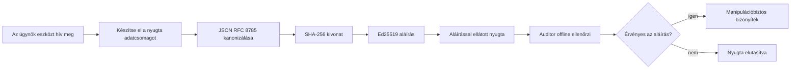
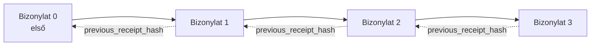

[Nézd meg az oktatóvideót: AI ügynökök biztonságossá tétele kriptográfiai visszaigazolásokkal](https://youtu.be/PLACEHOLDER_VIDEO_ID)

> _(Az oktatóvideót és a bélyegképet a Microsoft tartalomcsapata fogja hozzáadni az összefésülés után, az 14/15-ös leckemintához igazodva.)_

# AI ügynökök biztonságossá tétele kriptográfiai visszaigazolásokkal

## Bevezetés

Ez a lecke a következőket tárgyalja:

- Miért fontosak az auditnaplók az AI ügynökök számára a megfelelőség, hibakeresés és bizalom érdekében.
- Mi az a kriptográfiai visszaigazolás, és miben különbözik egy aláíratlan naplóbejegyzéstől.
- Hogyan lehet sima Python használatával aláírt visszaigazolást készíteni egy ügynöki eszközhívásról.
- Hogyan lehet egy visszaigazolást offline ellenőrizni és felismerni a manipulációt.
- Hogyan lehet láncolni a visszaigazolásokat úgy, hogy egy eltávolítás vagy átrendezés megszakítja a láncot.
- Mit bizonyítanak a visszaigazolások és mit egyértelműen nem bizonyítanak.

## Tanulási célok

A lecke végére tudni fogod, hogyan:

- Azonosítsd azokat a hibamódokat, amelyek motiválják az ügynöki műveletek kriptográfiai származtatását.
- Készíts Ed25519-es aláírással ellátott visszaigazolást egy kanonikus JSON teher felett.
- Függetlenül ellenőrizd a visszaigazolást kizárólag az aláíró nyilvános kulcsának használatával.
- Felismerd a manipulációt egy módosított visszaigazolás ellenőrzésének újbóli lefuttatásával.
- Építs hash-láncolt visszaigazolássorozatot és magyarázd el, miért fontos a lánc.
- Felismerd a határt, hogy mit igazolnak a visszaigazolások (hozzárendelés, integritás, sorrendiség), és mit nem igazolnak (a művelet helyessége, a szabályzat megalapozottsága).

## A probléma: ügynököd auditnaplója

Képzeld el, hogy telepítettél egy AI ügynököt a Contoso Travel számára. Az ügynök olvassa az ügyfélkéréseket, lekérdezi a járatok API-ját, és lefoglal helyeket az ügyfél nevében. Az elmúlt negyedévben az ügynök 50 000 foglalást kezelt.

Ma megjelenik egy auditor. Egy egyszerű kérdést tesz fel: „Mutasd meg, mit csinált az ügynököd.”

Átadod a naplófájlokat. Az auditor megnézi őket, majd egy nehezebb kérdést tesz fel: „Honnan tudom, hogy ezeket a naplókat nem szerkesztették át?”

Ez az auditnaplózás problémája. A mai legtöbb ügynök telepítés a következőkre támaszkodik:

- **Alkalmazásnaplók**: az ügynök maga írja, bárki szerkesztheti, aki hozzáfér a fájlrendszerhez.
- **Felhőalapú naplózó szolgáltatások**: platform szinten észlelhetővé teszik a manipulációt, de csak ha az auditor megbízik a platform üzemeltetőjében.
- **Adatbázis tranzakciós naplók**: jól használhatók adatbázis-módosításokhoz, de nem tetszőleges eszközhívásokhoz.

Ezek egyike sem válaszolja meg az auditor kérdését úgy, hogy az auditor ne kelljen senkiben (benne, a felhőszolgáltatójában vagy adatbázis beszállítójában) bízzon. Belső használatra ez gyakran elfogadható bizalom. Szabályozott munkaterhek esetén (pénzügy, egészségügy, az EU AI törvény hatálya alatt) nem.

A kriptográfiai visszaigazolások ezt úgy oldják meg, hogy az egyes ügynöki műveletek függetlenül ellenőrizhetők. Az auditor nem kell, hogy benned bízzon. Csak az nyilvános kulcsod kell, és maga a visszaigazolás.

## Mi az a kriptográfiai visszaigazolás?

A visszaigazolás egy JSON objektum, amely rögzíti, mit csinált az ügynök, digitális aláírással ellátva.


  
Egy minimális visszaigazolás így néz ki:

```json
{
  "type": "agent.tool_call.v1",
  "agent_id": "contoso-travel-bot",
  "tool_name": "lookup_flights",
  "tool_args_hash": "sha256:a3f9c1...",
  "result_hash": "sha256:7b2e1d...",
  "policy_id": "contoso-travel-policy-v3",
  "timestamp": "2026-04-25T14:30:00Z",
  "sequence": 47,
  "previous_receipt_hash": "sha256:9d4e6a...",
  "signature": {
    "alg": "EdDSA",
    "sig": "c5af83...",
    "public_key": "8f3b2c..."
  }
}
```
  
Három tulajdonság végzi a munkát:

1. **Az aláírás**. A visszaigazolást az ügynök átjárója írja alá Ed25519 privát kulccsal. Bárki, aki rendelkezik a megfelelő nyilvános kulccsal, offline ellenőrizheti az aláírást. Bármely mező manipulálása érvénytelenné teszi az aláírást.

2. **Kanonikus kódolás**. Az aláírás előtt a visszaigazolás a JSON Kanonizációs Sémával (JCS, RFC 8785) kerül sorosításra. Ez biztosítja, hogy két azonos logikai visszaigazolást előállító implementáció bájtpontosan azonos kimenetet adjon. Kanonizáció nélkül különböző JSON szerializálók különböző aláírásokat hoznának létre ugyanarra a tartalomra.

3. **Hash láncolás**. A `previous_receipt_hash` mező minden visszaigazolást összekapcsol az az előtti visszaigazolással. Egy visszaigazolás eltávolítása vagy átrendezése megszakítja minden későbbi visszaigazolás láncolatát. A manipuláció így még akkor is láthatóvá válik a lánc szintjén, ha az egyéni aláírásokat megpróbálják megkerülni.

Ezek a tulajdonságok együtt három garanciát nyújtanak:

- **Hozzárendelés**: ez a kulcs írta alá ezt a tartalmat.
- **Integritás**: a tartalom az aláírás óta nem változott.
- **Sorrendiség**: ez a visszaigazolás az előző visszaigazolás után keletkezett a láncban.

## Visszaigazolás készítése Pythonban

Nem szükséges külön könyvtár a visszaigazolás készítéséhez. A kriptográfiai primitívek széles körben elérhetőek, a logika pedig néhány tucatsor Python kód.

A gyakorlati feladatok az `code_samples/18-signed-receipts.ipynb` fájlban végigvezetnek a teljes folyamaton. Az összefoglaló verzió:

```python
import json
import hashlib
import base64
from nacl import signing
from jcs import canonicalize  # RFC 8785 kanonikus JSON

def b64url_nopad(data: bytes) -> str:
    return base64.urlsafe_b64encode(data).decode("ascii").rstrip("=")

def sha256_canonical(obj) -> str:
    """SHA-256 of a Python object's JCS-canonical JSON form."""
    return f"sha256:{hashlib.sha256(canonicalize(obj)).hexdigest()}"

# Aláíró kulcs generálása vagy betöltése (éles környezetben tárold kulcstárolóban)
signing_key = signing.SigningKey.generate()
verify_key = signing_key.verify_key

# Az átvételi bizonylat törzsét összeállítani (még nincs aláírás)
tool_args = {"origin": "SYD", "destination": "LAX"}
tool_result = [{"flight": "QF11", "price": 1850, "stops": 0}]

payload = {
    "type": "agent.tool_call.v1",
    "agent_id": "contoso-travel-bot",
    "tool_name": "lookup_flights",
    "tool_args_hash": sha256_canonical(tool_args),
    "result_hash": sha256_canonical(tool_result),
    "policy_id": "contoso-travel-policy-v3",
    "timestamp": "2026-04-25T14:30:00Z",
    "sequence": 0,
    "previous_receipt_hash": None,
}

# Kanonizálás, hash készítése, aláírás.
canonical_bytes = canonicalize(payload)
message_hash = hashlib.sha256(canonical_bytes).digest()
signature_bytes = signing_key.sign(message_hash).signature

# Csatolj egy strukturált aláírási objektumot.
receipt = {
    **payload,
    "signature": {
        "alg": "EdDSA",
        "sig": b64url_nopad(signature_bytes),
        "public_key": b64url_nopad(bytes(verify_key)),
    },
}
```
  
Ez az egész aláírási folyamat. A füzet feladatai lépésről lépésre vezetnek végig rajta.

## Visszaigazolás ellenőrzése és manipuláció felismerése

Az ellenőrzés a fordított művelet:

```python
import base64
import hashlib
from nacl import signing
from nacl.exceptions import BadSignatureError
from jcs import canonicalize

def b64url_decode(s: str) -> bytes:
    padding = "=" * ((4 - len(s) % 4) % 4)
    return base64.urlsafe_b64decode(s + padding)

def verify_receipt(receipt: dict) -> bool:
    # Az aláírás egy strukturált objektum: {"alg", "sig", "public_key"}.
    sig_obj = receipt.get("signature")
    if not sig_obj or sig_obj.get("alg") != "EdDSA":
        return False

    # Állítsuk vissza a ténylegesen aláírt adatsort (mindent az aláírás kivételével).
    payload = {k: v for k, v in receipt.items() if k != "signature"}

    canonical_bytes = canonicalize(payload)
    message_hash = hashlib.sha256(canonical_bytes).digest()

    try:
        verify_key = signing.VerifyKey(b64url_decode(sig_obj["public_key"]))
        verify_key.verify(message_hash, b64url_decode(sig_obj["sig"]))
        return True
    except BadSignatureError:
        return False
```
  
Ez a függvény vesz egy visszaigazolást és visszaadja a `True` értéket, ha az aláírás érvényes, egyébként `False`-t. Nincs hálózati hívás, nincs szolgáltatáshoz kötés, és nem kell megbízni harmadik félben.

A manipuláció felismerésének gyakorlati bemutatásához a füzet végigmegy a következő lépéseken:

1. Érvényes visszaigazolás készítése és ellenőrzése.
2. Egy bájt módosítása a `tool_args_hash` mezőben.
3. Az ellenőrzés újrafuttatása, amely sikertelen lesz.

Ez a gyakorlati bizonyíték, hogy a visszaigazolások manipulációállóak: bármilyen kismértékű módosítás megszakítja az aláírást.

## Visszaigazolások láncolása több lépéses ügynököknek

Egyetlen aláírt visszaigazolás egy műveletet véd. Egy visszaigazoláslánc egy sorozatot.


  
Minden visszaigazolás rögzíti az előző visszaigazolás hash-ét. Ha egy támadó csendben törli a 2-es visszaigazolást, akkor vagy:

- módosítja a 3-as visszaigazolás `previous_receipt_hash` mezőjét (ezzel megsérti a 3-as visszaigazolás aláírását), VAGY
- új aláírást hamisít a módosított 3-as visszaigazoláson (ehhez az ügynök privát kulcsára lenne szükség).

Ha a privát kulcs hardware kulcstárban van, és a nyilvános kulcsot minden visszaigazoláshoz társítod, egyik támadás sem kivitelezhető a felismerés nélkül.

A füzet végigvezeti a következőket:

1. Három visszaigazolásból álló lánc építése.
2. Annak ellenőrzése, hogy minden visszaigazolás `previous_receipt_hash` mezője megegyezik az előző visszaigazolás valós hash-ével.
3. Egy visszaigazolás módosítása a lánc közepén, és annak látható megtörése pontosan ott.

Így készíthetsz auditnaplót, amit egy külső auditor a te megbízásod nélkül ellenőrizhet.

## Mit bizonyítanak a visszaigazolások (és mit nem)

Ez a legfontosabb rész a leckében. A visszaigazolások erősek, de korlátok között.

**A visszaigazolások három dolgot bizonyítanak:**

1. **Hozzárendelés**: egy adott kulcs írt alá egy adott terhet.
2. **Integritás**: a terhelés az aláírás óta nem változott.
3. **Sorrendiség**: ez a visszaigazolás később keletkezett a láncban, mint az a másik.

**A visszaigazolások NEM bizonyítanak:**

1. **Helyességet**: hogy az ügynök művelete helyes volt. Visszaigazolást éppúgy alá lehet írni egy hibás válaszra, mint egy helyesre.
2. **Szabályzat betartását**: hogy a `policy_id`-ban hivatkozott szabályzat ténylegesen ki lett értékelve, vagy hogy engedélyezte volna-e ezt a műveletet. A visszaigazolás azt rögzíti, amit állítottak, nem azt, amit betartattak.
3. **Azonosítást a kulcson túl**: a visszaigazolás azt mondja: „ez a kulcs írta alá ezt a tartalmat.” Nem mondja, hogy „ez az ember engedélyezte.” A kulcs és személy vagy szervezet összekapcsolása külön identitásinfrastruktúrát igényel (könyvtár, nyilvános kulcs regiszter stb.).
4. **Bemenetek igazságtartamát**: ha az ügynök egy manipulált utasítást kap és arra lép, a visszaigazolás híven rögzíti a műveletet. A visszaigazolások a bemeneti validáció utáni állapotra vonatkoznak, nem helyettesítik azt.

Ez a határvonal két okból fontos:

- Megmutatja, mire jók a visszaigazolások: az ügynök viselkedése átlátható és manipulációálló lesz, akár szervezetek között is.
- Megmutatja, milyen további rétegek kellenek még: bemeneti validáció (Lecke 6), szabályzat végrehajtás (röviden később), és identitásinfrastruktúra (ez a lecke hatáskörén kívül esik).

Gyakori tévedés azt hinni, hogy „visszaigazolásaink vannak” = „irányítás alatt állunk.” NEM. A visszaigazolás alap. Az irányítás az a rendszer, amit erre építesz.

## Termelési referenciák

A lecke Python kódja szándékosan minimális, hogy minden sort elolvashass és pontosan megérts mit csinál. Termelésben két lehetőséged van:

1. **Közvetlenül építeni a kriptográfiai primitívekre.** Az fent látott 50 sor sok esetben elegendő. A PyNaCl (Ed25519) és a `jcs` csomag (kanonikus JSON) jól karbantartott, auditált könyvtárak.

2. **Használni egy termelési visszaigazolás-könyvtárat.** Több nyílt forráskódú projekt valósítja meg ugyanezt a mintát további funkciókkal (kulcscsere, tömeges ellenőrzés, JWK készlet terjesztés, integráció szabályzatrendszerekkel):
   - A lecke visszaigazolás formátuma követi az IETF Internet-Draftot (`draft-farley-acta-signed-receipts`), amely szabványosítás alatt áll.
   - A Microsoft Agent Governance Toolkit Cedar-alapú szabályzati döntésekkel állít össze visszaigazolásokat; erről egy teljes példát találsz a 33. oktatóanyagban.
   - A `protect-mcp` (npm) és az `@veritasacta/verify` (npm) csomagok Node-alapú implementációt kínálnak visszaigazolások aláírására és offline ellenőrzésére, céljuk bármely MCP szerver köré tamper-evident auditnapló létrehozása.

Annak eldöntése, hogy saját megoldást fejlesztesz vagy könyvtárat használsz, hasonló a saját JWT könyvtár írásának vagy egy kipróbált használatának dilemmajához: mindkét megközelítés értelmes; a könyvtár időt spórol és csökkenti az auditfelületet; a saját megoldás megérteti veled minden primitív lépését. Ez a lecke a saját megoldás útját tanítja, hogy meglegyen az alapod mindkét választáshoz.

## Tudásellenőrzés

Teszteld a tudásod, mielőtt a gyakorlati feladatra lépnél.

**1. Egy visszaigazolást az ügynök privát Ed25519 kulcsával írnak alá. Az auditor csak a nyilvános kulccsal rendelkezik. Tudja offline ellenőrizni a visszaigazolást?**

<details>
<summary>Válasz</summary>

Igen. Az Ed25519 ellenőrzéshez csak a nyilvános kulcsra és az aláírt bájtokra van szükség. Nincs hálózati hívás, nincs szolgáltatáshoz kötés. Ez az a tulajdonság, ami használhatóvá teszi a visszaigazolásokat levegőzárolt, több szervezet közötti vagy alacsony bizalommal végzett auditben.
</details>

**2. Egy támadó módosítja a visszaigazolás `policy_id` mezőjét, hogy engedékenyebb szabályzatot állítson be. Az aláírás az eredeti teherre vonatkozott. Mi történik az ellenőrzés során?**

<details>
<summary>Válasz</summary>

Az ellenőrzés meghiúsul. Az aláírás a teher kanonikus bájtjaira készült; bármely mező módosítása megváltoztatja a kanonikus bájtokat, ami megváltoztatja a SHA-256 hash-t, így az aláírás érvénytelen lesz. A támadónak a privát kulcs kellene ahhoz, hogy érvényes új aláírást készítsen, ami nincs meg neki.
</details>

**3. Miért tartalmaz a visszaigazolás `tool_args_hash` és `result_hash` értéket a nyers argumentumok és eredmény helyett?**

<details>
<summary>Válasz</summary>

Két okból. Először is, a visszaigazolást archiválni vagy továbbítani kell olyan környezetekben, ahol a nyers tartalom (személyes adatok, üzleti adatok) kiszivárgása gondot okozna. A hashelés kicsiben tartja a visszaigazolást, és tartja a tartalmat privátan; az auditor ellenőrzi, hogy a hash egyezik egy külön tárolt tényleges példánnyal. Másodszor, a hash-ek fix méretűek; így a visszaigazolás mérete korlátozott marad függetlenül a bemenetek és kimenetek nagyságától.
</details>

**4. A visszaigazolások minden egyes lánchoz kapcsolódó `previous_receipt_hash` mezővel rendelkeznek. Ha egy támadó csendben kitöröl egy visszaigazolást a lánc közepéről, mi lesz érvénytelen?**

<details>
<summary>Válasz</summary>

Az összes utána következő visszaigazolás. A `previous_receipt_hash` mezőjük már nem egyezik a valós lánccal (mert az általuk hivatkozott visszaigazolás nem létezik, vagy a lánc más elődöt mutat). Ahhoz, hogy eltüntesse a törlést, a támadónak újra kellene írnia minden későbbi visszaigazolás aláírását, ami a privát kulcsot követeli meg.
</details>

**5. A visszaigazolás tisztán ellenőrzött. Ez bizonyítja-e, hogy az ügynök művelete helyes, megalapozott vagy megfelel a szabályzatnak?**

<details>
<summary>Válasz</summary>

Nem. Egy érvényes visszaigazolás három dolgot bizonyít: hozzárendelés (ez a kulcs írta alá), integritás (a tartalom nem változott), és sorrendiség (ez a visszaigazolás később született, mint egy másik). Nem bizonyítja, hogy a művelet helyes volt, hogy a `policy_id`-ban említett szabályzatot ténylegesen kiértékelték, vagy hogy az ügynök betartotta az összes szabályt. A visszaigazolások átláthatóvá teszik az ügynök viselkedését, de nem garantálják a helyességet. Ez a lecke legfontosabb határvonala.
</details>

## Gyakorlati feladat

Nyisd meg az `code_samples/18-signed-receipts.ipynb` fájlt, és végezd el a négy részt:

1. **1. szakasz**: Írd alá az első visszaigazolást és ellenőrizd.
2. **2. szakasz**: Károsítsd meg a visszaigazolást, és figyeld meg, hogy az ellenőrzés megbukik.
3. **3. szakasz**: Építs három visszaigazolásból álló láncot, és ellenőrizd a lánc integritását.
4. **4. szakasz**: Alkalmazd a mintát a Microsoft Agent Framework-kel készült ügynökön: csomagolj egy eszközhívást visszaigazolás aláírásba, majd külön ellenőrizd a visszaigazolást.

**Extra kihívás 1:** egészítsd ki a visszaigazolás sémát egy saját mezővel (például kérésazonosító traceroláshoz), frissítsd a kanonikus aláírási logikát, hogy tartalmazza, és bizonyítsd be, hogy a visszaigazolás még mindig helyesen ellenőrizhető. Ezután módosítsd a mezőt az aláírás után, és erősítsd meg, hogy az ellenőrzés megbukik. Ez kötelezővé teszi számodra, hogy megértsd, miként járul hozzá minden bájt a kanonikus kódolás aláíráshoz.
**Akadálytúllépő kihívás 2:** Használj SHA-256 kivonatot két blokknyugta összefűzéséhez (determinista sorrendben illeszd össze a kanonikus bájtjaikat), majd a kapott kivonatot ágyazd be egy harmadik blokknyugta új mezőjeként az aláírás előtt. Ellenőrizd, hogy mindhárom blokknyugta továbbra is visszaellenőrizhető marad-e. Ezzel épp egy egylépéses beillesztési bizonyítékot hoztál létre: bárki, aki a harmadik blokknyugtával rendelkezik, bizonyíthatja, hogy az első kettő létezett az aláírás időpontjában anélkül, hogy azok tartalmát felfedné. Ez az a minta, amit a válogatott közzétételű blokknyugták széleskörűen használnak (Merkle elkötelezettségek, RFC 6962).

## Összefoglalás

A kriptográfiai blokknyugták auditálási nyomvonalat biztosítanak az AI ügynökök számára, mely:

- **Függetlenül ellenőrizhető:** bármely fél, aki rendelkezik a nyilvános kulccsal, ellenőrizheti, nem függ szolgáltatástól.
- **Módosítással szemben érzékelhető:** bármilyen módosítás érvényteleníti az aláírást.
- **Hordozható:** egy blokknyugta egy kis JSON fájl; archiválható, továbbítható és bárhol ellenőrizhető.
- **Szabványkövető:** Ed25519-en (RFC 8032), JCS-en (RFC 8785) és SHA-256-on alapul, mindezek széles körben használt primitívek.

Nem helyettesítik a bevitel-ellenőrzést, a szabályzat végrehajtását vagy az azonosító infrastruktúrát, hanem ezek alapját képezik. Amikor szabályozott munkafolyamatokban, több szervezet közös munkamenetében vagy olyan környezetben helyezel ügynököket üzembe, ahol egy jövőbeli auditorban nem feltételezhető a bizalom irántad, a blokknyugták biztosítják, hogy az auditálási nyomvonal tisztességes legyen.

A legfontosabb tanulság: a blokknyugták igazolják, hogy ki mit és mikor mondott. Nem bizonyítják, hogy amit mondtak, az igaz vagy helyes volt. Ezt a különbséget szorosan tartsd meg. Ez a különbség egy becsületes eredetiség-rendszer és egy félrevezető között.

## Üzembe helyezési ellenőrzőlista

Amikor készen állsz arra, hogy a leckéről átállj valódi környezetben üzemelő aláírt blokknyugtás ügynökökre:

- [ ] **Mozgasd az aláíró kulcsot a fejlesztői laptopról.** Használj Azure Key Vaultot, AWS KMS-t vagy hardveres biztonsági modult. A nyilvános kulcsot aláíró privát kulcs soha ne legyen forráskódban vagy sima szövegként alkalmazási gépen.
- [ ] **Tedd közzé az ellenőrző nyilvános kulcsot.** Az auditorok offline ellenőrzéshez szükségük van rá. A szabványos minta egy JWK-készlet jól ismert URL-en (RFC 7517), pl. `https://your-org.example.com/.well-known/agent-keys.json`.
- [ ] **Horgonyozd le a láncot külső rendszerben.** Rendszeresen írd be a legfrissebb láncfő kivonatát egy áttetszőségi naplóba (Sigstore Rekor, RFC 3161 időbélyegző hatóság vagy egy második belső rendszer), hogy egy külső fél megerősíthesse: "ez a lánc ezen időpontban létezett".
- [ ] **Tárold a blokknyugtákat visszavonhatatlanul.** Csak hozzáfűzhető blob tárolás (Azure Storage visszavonhatatlansági szabályokkal, AWS S3 Object Lock) megakadályozza, hogy egy bennfentes újraírássa a történelmet a tároló szinten.
- [ ] **Határozd meg a megőrzési időt.** Sok megfelelőségi előírás több éves megőrzést ír elő. Tervezd meg a blokknyugták méretváltozását (egy blokknyugta kb. 500 bájt; egy ügynök napi 10 000 hívással évente kb. 1,8 GB-ot termel).
- [ ] **Dokumentáld, mit nem fednek le a blokknyugták.** A blokknyugták igazolják a felelősségre vonhatóságot, az integritást és a sorrendiség betartását. A működési kézikönyvednek egyértelműen tartalmaznia kell, hogy milyen további ellenőrzések (beviteli validáció, szabályzat végrehajtás, aránykorlát, azonosító infrastruktúra) mellett használod a blokknyugtákat irányítási gyakorlatodban.

### Több kérdésed lenne az AI ügynökök biztonságáról?

Csatlakozz a [Microsoft Foundry Discord](https://aka.ms/ai-agents/discord) közösséghez, hogy más tanulókkal találkozz, részt vegyél kérdezz-felelek alkalmakon és megválaszold AI ügynökökkel kapcsolatos kérdéseidet.

## Ezen lecke után

Ez a lecke a single-receipt aláírást és a hash-láncolt sorozatokat fedi le. Ugyanezek a primitívek több haladó mintába rendeződnek, amelyekkel találkozhatsz, ahogy irányítási gyakorlatod fejlődik:

- **Szelektív közzététel.** Ha egy blokknyugta mezői külön-külön vannak elkötelezve (RFC 6962-stílusú Merkle-fa), megmutathatsz bizonyos mezőket egyes auditoroknak, miközben bizonyítod, hogy a többi változatlan anélkül, hogy felfednéd azokat. Hasznos, amikor ugyanaz a blokknyugta egyszerre kell megfeleljen egy széleskörű auditnak (ami a teljességet igényli) és adatminimalizálási szabályozásoknak, mint pl. a GDPR (amelyek azt akarják, hogy az auditor csak a legszükségesebbet lássa).
- **Blokknyugta visszavonás.** Ha egy aláíró kulcs kompromittálódik, szükség van egy módra, hogy a kulccsal aláírt összes blokknyugtát egy adott időpont után megbízhatatlannak jelöld meg. Szabványos minták: rövid élettartamú aláíró kulcsok plusz közzétett visszavonási lista, vagy áttetszőségi napló visszavonási bejegyzésekkel.
- **Kétoldalú / megosztott aláírású blokknyugták.** Egyes megvalósítások az aláírt tartalmat elővégrehajtásra (`authorization_*`) és utóvégrehajtásra (`result_*`) osztják, külön aláírásokkal, hasznos, amikor az engedélyezési döntést és a megfigyelt eredményt különböző szereplők vagy külön időpontok állítják elő. Ez az elrendezés ráépül a jelen leckében tanult blokknyugta formátumra.
- **Tartalom-kompozíció.** Egy blokknyugta lezárja az `result_hash` mezőbe helyezett bájtokat. A valós világban a tartalom gyakran bőségesebb, mint egyetlen eszközhívás eredménye: előzetes döntési érvelés (modell-előrejelzés, megfontolt opciók, bizonyíték és annak teljessége, kockázati helyzet, felelősségi lánc, kapu eredmény) mind beleférhet a tartalomba, amit egy blokknyugta zár le. Ez minimalizálja a blokknyugta formátumát, miközben engedi, hogy a tartalmi sémák területenként fejlődjenek.
- **Implementációk közötti konformitás.** Több független megvalósítás ugyanarra a blokknyugta formátumra (Python, TypeScript, Rust, Go) kereszttesztek segítségével ellenőrzi az egyezést. Saját implementáció esetén a közzétett tesztvektorok ellenőrzése megerősíti a kommunikációs kompatibilitást.
- **Poszt-kvantum migráció.** Az Ed25519 ma széles körben használt, de nem kvantum-rezisztens. A blokknyugta formátum algoritmus-rugalmas: a `signature.alg` mező hordozhatja az `ML-DSA-65` (a NIST poszt-kvantum aláírási szabványa) értéket, amikor migrálni kell. Tervezd meg az átmeneti időszakot, amikor a blokknyugtákat kettős aláírással látod el.

## További források

- <a href="https://datatracker.ietf.org/doc/draft-farley-acta-signed-receipts/" target="_blank">IETF Internet-Draft: Aláírt döntési blokknyugták gép-gép hozzáférés-vezérléshez</a>
- <a href="https://learn.microsoft.com/azure/ai-studio/responsible-use-of-ai-overview" target="_blank">Felelős AI áttekintés (Azure AI)</a>
- <a href="https://datatracker.ietf.org/doc/html/rfc8032" target="_blank">RFC 8032: Edwards görbe digitális aláírási algoritmus (EdDSA)</a>
- <a href="https://datatracker.ietf.org/doc/html/rfc8785" target="_blank">RFC 8785: JSON Kanonizációs séma (JCS)</a>
- <a href="https://datatracker.ietf.org/doc/html/rfc6962" target="_blank">RFC 6962: Tanúsítvány áttetszőség</a> (Merkle-fa szerkezet, amit a válogatott közzétételű blokknyugták használnak)
- <a href="https://github.com/microsoft/agent-governance-toolkit/blob/main/docs/tutorials/33-offline-verifiable-receipts.md" target="_blank">Microsoft Agent Governance Toolkit, 33. oktatóanyag: Offline ellenőrizhető döntési blokknyugták</a>
- <a href="https://github.com/ScopeBlind/agent-governance-testvectors" target="_blank">Implementációk közötti konformitási tesztvektorok</a> az ebben a leckében használt blokknyugta formátumhoz (Apache-2.0)
- <a href="https://pynacl.readthedocs.io/" target="_blank">PyNaCl dokumentáció</a> (Ed25519 Pythonban)

## Előző lecke

[Számítógép-használati ügynökök (CUA) építése](../15-browser-use/README.md)

## Következő lecke

_(A tananyag-felelősek szerint meghatározandó)_

---

<!-- CO-OP TRANSLATOR DISCLAIMER START -->
**Jogi nyilatkozat**:
Ez a dokumentum az AI fordítási szolgáltatás, a [Co-op Translator](https://github.com/Azure/co-op-translator) segítségével készült. Bár az pontosságra törekszünk, kérjük, vegye figyelembe, hogy az automatikus fordítások hibákat vagy pontatlanságokat tartalmazhatnak. Az eredeti dokumentum az anyanyelvén tekintendő hiteles forrásnak. Fontos információk esetén professzionális emberi fordítást javasolunk. Nem vállalunk felelősséget semmilyen félreértésért vagy téves értelmezésért, amely ebből a fordításból ered.
<!-- CO-OP TRANSLATOR DISCLAIMER END -->