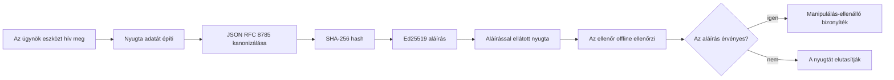
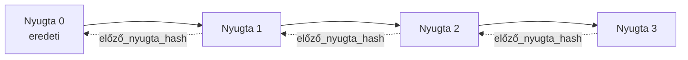

[Watch the lesson video: Securing AI Agents with Cryptographic Receipts](https://youtu.be/PLACEHOLDER_VIDEO_ID)

> _(A tananyagnév videót és a bélyegképet a Microsoft tartalomcsapata tölti fel a merge után, a 14./15. leckemintának megfelelően.)_

# AI-ügynökök védelme kriptográfiai bizonylatokkal

## Bevezetés

Ebben a leckében áttekintjük:

- Miért fontosak az auditnyomok az AI-ügynökök esetében a megfelelőség, hibakeresés és bizalom szempontjából.
- Mi az a kriptográfiai bizonylat, és miben különbözik egy aláíratlan naplóbejegyzéstől.
- Hogyan készítsünk aláírt bizonylatot egy ügynök eszközhívásához tiszta Pythonban.
- Hogyan ellenőrizzünk egy bizonylatot offline és hogyan észleljünk manipulációt.
- Hogyan kapcsoljuk láncba a bizonylatokat úgy, hogy az egy törlése vagy átrendezése megtöri a láncot.
- Mit bizonyítanak a bizonylatok, és mit egyértelműen nem.

## Tanulási célok

A lecke elvégzése után tudni fogja, hogyan:

- Azonosítsa a kriptográfiai eredetiség motiváló hibamódjait az ügynökös cselekvések esetében.
- Készítsen Ed25519 aláírással ellátott bizonylatot egy kanonikus JSON csomagról.
- Ellenőrizzen bizonylatot önállóan, csak az aláíró publikus kulcsának ismeretében.
- Észlelje a manipulációt a módosított bizonylat újbóli ellenőrzésével.
- Felépítsen egy hash-láncolt bizonylatsorozatot és megértse a lánc fontosságát.
- Felismerje azokat a határokat, hogy mit bizonyítanak a bizonylatok (hozzárendelés, sértetlenség, sorrendiség), és mit nem (például a cselekvés helyessége, a szabályzat megfelelő volta).

## A probléma: az ügynöke auditnaplója

Képzelje el, hogy telepített egy AI-ügynököt a Contoso Travel számára. Az ügynök feldolgozza az ügyfélkéréseket, hív egy repülőjárat-API-t, hogy keresési lehetőségeket találjon, és foglal helyeket az ügyfél nevében. Az utolsó negyedévben az ügynök 50 000 foglalást kezelt.

Ma megjelenik egy auditor, és egyszerű kérdést tesz fel: "Mutassa meg, mit tett az ügynöke!"

Átadja a naplófájljait. Az auditor megnézi azokat, és egy nehezebb kérdést tesz fel: "Honnan tudom, hogy ezeket a naplókat nem módosították?"

Ez az auditnyom probléma. A mai ügynök-telepítések többsége a következőkre támaszkodik:

- **Alkalmazásnaplók**: amelyeket maga az ügynök ír, és szerkeszthet bármely fájlrendszer-hozzáféréssel rendelkező.
- **Felhőalapú naplózási szolgáltatások**: platform szintű manipulációt nehezítő megoldás, de csak akkor, ha az auditor megbízik a platformüzemeltetőben.
- **Adatbázis tranzakciós naplók**: jól használhatók adatbázis-változásokhoz, de nem alkalmasak tetszőleges eszközhívásokhoz.

Ezek közül egyik sem képes az auditornak választ adni anélkül, hogy ne kellene valakiben megbíznia (Ön, a felhőszolgáltatóját, az adatbázis szállítóját). Belső használatra ez általában elfogadható. Szabályozott munkaterheléseknél (pénzügy, egészségügy, EU AI-törvény alá eső) nem az.

A kriptográfiai bizonylatok ezt úgy oldják meg, hogy minden ügynöki cselekvés önállóan ellenőrizhetővé válik. Az auditor nem kell, hogy Önben bízzon. Csak az Ön publikus kulcsára és magára a bizonylatra van szüksége.

## Mi az a kriptográfiai bizonylat?

A bizonylat egy JSON objektum, amely rögzíti, mit tett az ügynök, digitális aláírással ellátva.



Egy minimális bizonylat így néz ki:

```json
{
  "type": "agent.tool_call.v1",
  "agent_id": "contoso-travel-bot",
  "tool_name": "lookup_flights",
  "tool_args_hash": "sha256:a3f9c1...",
  "result_hash": "sha256:7b2e1d...",
  "policy_id": "contoso-travel-policy-v3",
  "timestamp": "2026-04-25T14:30:00Z",
  "sequence": 47,
  "previous_receipt_hash": "sha256:9d4e6a...",
  "signature": {
    "alg": "EdDSA",
    "sig": "c5af83...",
    "public_key": "8f3b2c..."
  }
}
```

Három tulajdonság végzi a munkát:

1. **Az aláírás**. A bizonylatot az ügynök átjárója írja alá egy Ed25519 privát kulccsal. Aki ismeri a megfelelő publikus kulcsot, offline ellenőrizheti az aláírást. Bármely mezőkkel való manipuláció az aláírást érvényteleníti.

2. **Kanonikus kódolás**. Az aláírás előtt a bizonylatot a JSON Canonicalization Scheme (JCS, RFC 8785) szabványnak megfelelően sorosítjuk. Ez biztosítja, hogy két megvalósítás azonos logikai bizonylatot pontosan azonos bájtokra lefordítson. Kanonizálás nélkül a különböző JSON sorosítók eltérő aláírásokat eredményeznének ugyanarról a tartalomról.

3. **Hash láncolás**. A `previous_receipt_hash` mező összekapcsolja a bizonylatokat egymással. Egy bizonylat eltávolítása vagy átrendezése tönkreteszi az összes utána lévő bizonylatot. A lánc szintjén is láthatóvá válik a manipuláció, akkor is, ha az egyedi aláírást megpróbálnák kikerülni.

Ezek együttesen három garanciát biztosítanak:

- **Hozzárendelés**: ez a kulcs írta alá ezt a tartalmat.
- **Integritás**: a tartalom nem változott az aláírás óta.
- **Sorrendiség**: ez a bizonylat a láncban az előző után keletkezett.

## Bizonylat készítése Pythonban

A bizonylat elkészítéséhez nincs szükség külön könyvtárra. A kriptográfiai primitívek széles körben elérhetők, a logika néhány tucat sor Pythonban.

A gyakorlati feladatok a `code_samples/18-signed-receipts.ipynb` fájlban végigvezetnek a teljes folyamaton. A rövid összefoglaló:

```python
import json
import hashlib
import base64
from nacl import signing
from jcs import canonicalize  # RFC 8785 kanonikus JSON

def b64url_nopad(data: bytes) -> str:
    return base64.urlsafe_b64encode(data).decode("ascii").rstrip("=")

def sha256_canonical(obj) -> str:
    """SHA-256 of a Python object's JCS-canonical JSON form."""
    return f"sha256:{hashlib.sha256(canonicalize(obj)).hexdigest()}"

# Aláíró kulcs generálása vagy betöltése (éles környezetben kulcstárolóban tárolandó)
signing_key = signing.SigningKey.generate()
verify_key = signing_key.verify_key

# A bizonylat adatainak összeállítása (még nincs aláírás)
tool_args = {"origin": "SYD", "destination": "LAX"}
tool_result = [{"flight": "QF11", "price": 1850, "stops": 0}]

payload = {
    "type": "agent.tool_call.v1",
    "agent_id": "contoso-travel-bot",
    "tool_name": "lookup_flights",
    "tool_args_hash": sha256_canonical(tool_args),
    "result_hash": sha256_canonical(tool_result),
    "policy_id": "contoso-travel-policy-v3",
    "timestamp": "2026-04-25T14:30:00Z",
    "sequence": 0,
    "previous_receipt_hash": None,
}

# Kanonizálás, hash készítése, aláírás.
canonical_bytes = canonicalize(payload)
message_hash = hashlib.sha256(canonical_bytes).digest()
signature_bytes = signing_key.sign(message_hash).signature

# Struktúrált aláírási objektum csatolása.
receipt = {
    **payload,
    "signature": {
        "alg": "EdDSA",
        "sig": b64url_nopad(signature_bytes),
        "public_key": b64url_nopad(bytes(verify_key)),
    },
}
```

Ez a teljes aláírási folyamat. A jegyzetfüzet részletesen bemutat minden lépést.

## Bizonylat ellenőrzése és manipuláció észlelése

Az ellenőrzés az ellenkező művelet:

```python
import base64
import hashlib
from nacl import signing
from nacl.exceptions import BadSignatureError
from jcs import canonicalize

def b64url_decode(s: str) -> bytes:
    padding = "=" * ((4 - len(s) % 4) % 4)
    return base64.urlsafe_b64decode(s + padding)

def verify_receipt(receipt: dict) -> bool:
    # Az aláírás egy strukturált objektum: {"alg", "sig", "public_key"}.
    sig_obj = receipt.get("signature")
    if not sig_obj or sig_obj.get("alg") != "EdDSA":
        return False

    # Állítsd vissza a ténylegesen aláírt adatot (minden, kivéve az aláírást).
    payload = {k: v for k, v in receipt.items() if k != "signature"}

    canonical_bytes = canonicalize(payload)
    message_hash = hashlib.sha256(canonical_bytes).digest()

    try:
        verify_key = signing.VerifyKey(b64url_decode(sig_obj["public_key"]))
        verify_key.verify(message_hash, b64url_decode(sig_obj["sig"]))
        return True
    except BadSignatureError:
        return False
```

Ez a függvény átvesz egy bizonylatot, és `True`-t ad vissza, ha az aláírás érvényes, `False`-t különben. Nincs hálózati hívás, nincs szolgáltatásfüggőség, nincs harmadik fél iránti bizalom szükség.

A manipuláció észlelés működésének bemutatásához a jegyzetfüzet végigvezeti az alábbiakat:

1. Érvényes bizonylat előállítása és annak megerősítése, hogy ellenőrizhető.
2. Egyetlen bájt módosítása a `tool_args_hash` mezőben.
3. Az ellenőrzés újrafuttatása, amely most hibát jelez.

Ez a gyakorlati bizonyíték arra, hogy a bizonylatok manipulációra érzékenyek: minden módosítás, bármilyen kicsi is, érvényteleníti az aláírást.

## Bizonylatok láncolása többlépéses ügynökökhöz

Egyetlen aláírt bizonylat egy-egy cselekvést véd meg. Bizonylatlánc egy sorozatot védi.



Minden bizonylat tartalmazza az előző bizonylat hash-értékét. Ha egy támadó csendesen törölne egy bizonylatot (pl. a 2-est), akkor vagy:

- módosítania kell a 3. bizonylat `previous_receipt_hash` mezőjét (ezzel megszakítva a 3. bizonylat aláírását), vagy
- új hamis aláírást kell készítenie a módosított 3. bizonylatra (melyhez az ügynök privát kulcsa kell).

Ha a privát kulcs hardveres kulcstárolóban van, és a publikus kulcsot minden bizonylattal közzéteszik, egyik támadás sem hajtható végre észrevétlenül.

A jegyzetfüzet bemutatja:

1. Három bizonylatból álló lánc felépítését.
2. Ellenőrzi, hogy minden bizonylat `previous_receipt_hash` mezője egyezik az előző bizonylat tényleges hash-értékével.
3. Egy középső bizonylat manipulációját, majd a lánc azonnali törését abban a pontban.

Ezzel biztosítjuk, hogy egy külső auditor megbízhatóan ellenőrizhesse a naplót anélkül, hogy Önben kellene bíznia.

## Mit bizonyítanak (és mit nem) a bizonylatok

Ez a lecke legfontosabb része. A bizonylatok hatékonyak, de határaik vannak.

**A bizonylatok három dolgot bizonyítanak:**

1. **Hozzárendelés**: egy adott kulcs aláírt egy adott csomagot.
2. **Integritás**: a csomag nem változott az aláírás óta.
3. **Sorrendiség**: ez a bizonylat a láncban az előző után következik.

**A bizonylatok NEM bizonyítanak:**

1. **Helyesség**: hogy az ügynök cselekvése helyes volt. Egy hibás válaszra ugyanúgy készülhet aláírt bizonylat, mint egy helyesre.
2. **Szabályzat betartása**: a `policy_id` által hivatkozott szabályzat tényleges kiértékelése vagy annak engedélyező volta nincs dokumentálva. A bizonylat azt rögzíti, amit állítanak, nem azt, amit alkalmaztak.
3. **Személyi azonosítás a kulcson túl**: a bizonylat azt állítja, hogy „ez a kulcs írta alá ezt a tartalmat”, de nem igazolja, hogy „ez az ember hagyta jóvá”. Egy kulcs személy vagy szervezethez kötése külön identitásinfrastruktúrát igényel (pl. címtár, nyilvános kulcs-regiszter).
4. **Bemenetek igazságossága**: ha az ügynök manipulált bemenetet kap, és az alapján cselekszik, a bizonylat hűen rögzíti a cselekvést. A bizonylatok a bemeneti helyesbítés utáni szinten állnak, nem helyettesítik azt.

Ez a határvonal azért fontos:

- Megmondja, mire jók a bizonylatok: az ügynöki viselkedés auditálhatóvá és manipuláció-ellenállóvá tétele még szervezeti határokon át is.
- Megmutatja, milyen további rétegeket kell még alkalmaznia: bemeneti ellenőrzés (6. lecke), szabályzat-alkalmazás (röviden érintve lentebb), és identitás-kezelés (nem tárgya ennek a leckének).

Gyakori hiba azt feltételezni, hogy „van bizonylatunk” = „van irányításunk”. Ez nem igaz. A bizonylatok alapok. Az irányítás az a rendszer, amit erre építünk.

## Éles használati hivatkozások

A lecke Python kódja szándékosan minimalista, hogy minden sort el tudjon olvasni és pontosan értse a működést. Termelési környezetben két opciója van:

1. **Közvetlenül építkezzen a kriptográfiai primitívekre.** A fent látott 50 sor sok használati esethez elegendő. A PyNaCl (Ed25519) és a `jcs` csomag (kanonikus JSON) jól karbantartott, auditált könyvtárak.

2. **Használjon termelési könyvtárat.** Számos nyílt forráskódú projekt valósít meg hasonló mintát extra funkciókkal (kulcscsere, kötegelt ellenőrzés, JWK-készlet terjesztés, szabályzat motorral integráció):
   - A lecke során használt bizonylatformátum egy IETF Internet-draft (`draft-farley-acta-signed-receipts`), jelenleg szabványosítás alatt.
   - A Microsoft Agent Governance Toolkit bizonylatokat komponál Cedar-alapú szabályzat döntésekkel; lásd a 33. oktatóanyagot az adott tárolóban egy teljes példa kedvéért.
   - A `protect-mcp` (npm) és `@veritasacta/verify` (npm) csomagok Node alapú aláírás és offline ellenőrzés megvalósítását nyújtják, hogy bármely MCP szervert tamper-evident audit idővonalba burkoljanak.
   - A **[nobulex](https://github.com/arian-gogani/nobulex)** Python SDK (`pip install nobulex`) ugyanazt az Ed25519 + JCS aláírási mintát valósítja meg Pythonban, LangChain és CrewAI integrációkkal, publikált keresztszámítási tesztvektorokkal és egy OWASP PR #2210 segítségével hozzájárult megfelelőségi leképezéssel.

A saját implementáció és egy könyvtár használata közti választás hasonló a saját JWT könyvtár írásához vagy egy tesztelt használatához: mindkettő működőképes; a könyvtár időt spórol és csökkenti az audit felületet; a saját megoldás megköveteli, hogy minden primitívet pontosan értsen. Ez a lecke a saját utat mutatja be, hogy bármelyiket választja, meglegyen az alapja.

## Tudásellenőrző

Tesztelje tudását, mielőtt a gyakorlati feladathoz lépne.

**1. Egy bizonylatot az ügynök privát Ed25519 kulcsával írnak alá. Az auditor csak a publikus kulccsal rendelkezik. Tudja az auditor offline ellenőrizni a bizonylatot?**

<details>
<summary>Válasz</summary>

Igen. Az Ed25519 ellenőrzéshez csak a publikus kulcs és az aláírt bájtok szükségesek. Nincs hálózati hívás, nincs szolgáltatásfüggőség. Ez az a tulajdonság, ami miatt a bizonylatok hasznosak levegőfogott, többszervezeti vagy alacsony bizalmi audit környezetekben.
</details>

**2. Egy támadó módosítja a bizonylat `policy_id` mezőjét, hogy egy engedékenyebb szabályzatot állítson be. Az aláírás az eredeti csomagra készült. Mi történik az ellenőrzéskor?**

<details>
<summary>Válasz</summary>

Az ellenőrzés meghiúsul. Az aláírást az eredeti csomag kanonikus bájtjaira számolták; bármilyen mező módosítása megváltoztatja a kanonikus bájtokat, ami megváltoztatja a SHA-256 hash-t, és az aláírás érvénytelen lesz. Egyedül a privát kulccsal tudna friss aláírást készíteni a támadó, amivel nem rendelkezik.
</details>

**3. Miért tartalmaz a bizonylat `tool_args_hash` és `result_hash` mezőket az eredeti argumentumok és eredmény helyett?**

<details>
<summary>Válasz</summary>

Két okból. Először: a bizonylatot archiválni vagy továbbítani kell olyan környezetben, ahol az eredeti tartalom (személyes adatok, üzleti adatok) kiszivárgása problémás lehet. A hash-érték kicsiben tartja a bizonylatot, és a tartalom privát marad; az auditor a hash-sel igazolja, hogy egyezik a tényleges, külön tárolt tartalommal. Másodszor: a hash-ok fix hosszúságúak; hashokat tartalmazó bizonylat mérete korlátozott, függetlenül a bemenetek és kimenetek méretétől.
</details>

**4. A `previous_receipt_hash` mező összekapcsol minden bizonylatot az előzővel. Ha egy támadó csendben töröl egy bizonylatot középről, mi lesz érvénytelen?**

<details>
<summary>Válasz</summary>

Minden későbbi bizonylat, ami az eltávolított után következett. Az előző hash mezőik már nem egyeznek az aktuális lánccal (mert a hivatkozott bizonylat nem létezik, vagy a lánc más elődjére mutat). A törlés elrejtéséhez újra kellene aláírniuk minden későbbi bizonylatot, amihez a privát kulcs kell.
</details>

**5. Egy bizonylat hibátlanul ellenőrződik. Ez bizonyítja, hogy az ügynök cselekvése helyes, megalapozott vagy megfelel a szabályzatnak?**

<details>
<summary>Válasz</summary>

Nem. Egy érvényes bizonylat három dolgot bizonyít: hozzárendelést (ez a kulcs írta alá ezt a tartalmat), integritást (a tartalom nem változott), és sorrendiségét (ez a bizonylat az előző után van a láncban). Nem bizonyítja, hogy a cselekvés helyes, hogy a `policy_id` szerinti szabályzatot valóban kiértékelték, vagy hogy az ügynök minden szabályt betartott volna. A bizonylatok az ügynöki viselkedést auditálhatóvá teszik, de nem feltétlenül helyessé. Ez a lecke legfontosabb határa.
</details>

## Gyakorlati feladat

Nyissa meg a `code_samples/18-signed-receipts.ipynb` fájlt, és végezze el a négy szakaszt:

1. **1. szakasz**: Írja alá az első bizonylatát és ellenőrizze azt.
2. **2. szakasz**: Manipulálja a bizonylatot és figyelje meg, hogy az ellenőrzés hibát jelez.
3. **3. szakasz**: Készítsen három bizonylatból álló láncot, és ellenőrizze a lánc integritását.
4. **4. szakasz**: Alkalmazza a mintát Microsoft Agent Framework vezérelt ügynök esetén: egy eszközhívást csomagoljon be bizonylat-aláírással, majd ellenőrizze a bizonylatot önállóan.
**Extra kihívás 1:** bővítse a bizonylat sémát egy tetszőleges, általad választott mezővel (például egy kérésazonosítóval a követéshez), frissítse a kanonikus aláírási logikát, hogy tartalmazza azt, és igazolja, hogy a bizonylat továbbra is körbefordul az ellenőrzésen. Ezután módosítsa a mezőt az aláírás után, és erősítse meg, hogy az ellenőrzés meghiúsul. Ez arra késztet, hogy megértse, hogyan járul hozzá a kanonikus kódolás minden bájtja az aláíráshoz.

**Extra kihívás 2:** hash-olja össze SHA-256-tal két bizonylatát (konkatenálja a kanonikus bájtokat determinisztikus sorrendben), és ágyazza be a keletkezett lenyomatot egy új mezőként egy harmadik bizonylatra az aláírás előtt. Ellenőrizze, hogy mindhárom bizonylat továbbra is körbefordul. Ezzel egy egylépcsős belefoglalási bizonyítékot hozott létre: aki birtokolja a harmadik bizonylatot, igazolni tudja, hogy az első kettő létezett az aláírás időpontjában anélkül, hogy tartalmukat felfedné. Ez a minta, amelyet a szelektív-közzétételi bizonylatok nagy léptékben használnak (Merkle-kötelezettségek, RFC 6962).

## Következtetés

A kriptográfiai bizonylatok auditálási nyomvonalat biztosítanak az MI-ügynökök számára, amely:

- **függetlenül ellenőrizhető:** bármely fél, amely rendelkezik a nyilvános kulccsal, ellenőrizheti, nincs szolgáltatásfüggőség.
- **manipuláció-ellenálló:** bármilyen módosítás érvénytelenné teszi az aláírást.
- **hordozható:** a bizonylat egy kis JSON fájl; archiválható, továbbítható és bárhol ellenőrizhető.
- **szabványkövető:** Ed25519-re (RFC 8032), JCS-re (RFC 8785) és SHA-256-ra épül, mind széles körben használt primitívek.

Nem helyettesítik a bemeneti érvényesítést, szabályzat-végrehajtást vagy az identitásinfrastruktúrát. Ezeknek a rétegeknek az alapját képezik. Amikor ügynököket helyezel üzembe szabályozott feladatokban, több-szervezetes munkafolyamatokban, vagy bármilyen olyan környezetben, ahol a jövőbeni ellenőr nem feltételezhetően bízik benned, a bizonylatok segítenek, hogy az auditálási nyomvonal őszinte legyen.

A legfontosabb tanulság: a bizonylatok bizonyítják, hogy ki mit mondott és mikor. Nem bizonyítják, hogy amit mondtak igaz vagy helyes volt. Fogja ezt szorosan. Ez a különbség egy őszinte eredettörténeti rendszer és egy félrevezető között.

## Gyártási ellenőrzőlista

Amikor készen áll arra, hogy kilépjen ebből a leckéből, és valódi környezetben üzembe helyezze az aláírt bizonylatos ügynököket:

- [ ] **Mozgassa az aláíró kulcsot a fejlesztői laptopról.** Használjon Azure Key Vault-ot, AWS KMS-t vagy hardveres biztonsági modult. Az aláíró privát kulcs nem élhet sem forráskódban, sem szöveges formában az alkalmazásgépeken.
- [ ] **Publikálja az ellenőrző nyilvános kulcsot.** Az ellenőröknek offline ellenőrzéshez szükségük van rá. A standard minta egy JWK készlet egy jól ismert URL-en (RFC 7517), pl. `https://your-org.example.com/.well-known/agent-keys.json`.
- [ ] **Horgonyozza le a láncot külsőleg.** Időszakosan jegyezze be a legfrissebb láncfej hash-ét egy átláthatósági naplóba (Sigstore Rekor, RFC 3161 időbélyegző hatóság vagy egy második belső rendszer), hogy egy külső fél igazolhassa: „ez a lánc létezett ebben az időpontban.”
- [ ] **Tárolja a bizonylatokat változtathatatlanul.** Csak hozzáfűzős blob-tárhely (Azure Storage változtathatatlansági szabályokkal, AWS S3 Object Lock) megakadályozza, hogy egy bennfentes átírja a múltat a tárolási rétegen.
- [ ] **Határozza meg a megőrzési időt.** Sok megfelelőségi szabály többéves megőrzést ír elő. Tervezze meg a bizonylatok növekedését (egy bizonylat kb. 500 bájt; egy ügynök, amely napi 10 ezer hívást végez, évi kb. 1,8 GB-ot generál).
- [ ] **Dokumentálja, mit nem fednek a bizonylatok.** A bizonylatok az attribúciót, az integritást és a sorrendet bizonyítják. A végrehajtási útmutatónak kifejezetten fel kell tüntetnie, hogy milyen további ellenőrzések (bemeneti érvényesítés, szabályzat-végrehajtás, sebességkorlátozás, identitásinfrastruktúra) működnek együtt a bizonylatokkal a kormányzati pozícióban.

### Többet szeretne megtudni az MI-ügynökök védelméről?

Csatlakozzon a [Microsoft Foundry Discord](https://aka.ms/ai-agents/discord) csatornához, hogy találkozzon más tanulókkal, részt vegyen konzultáción és választ kapjon MI-ügynökeivel kapcsolatos kérdéseire.

## A leckén túl

Ez a lecke az egyedi bizonylat-aláírást és a hash-láncolt szekvenciákat tárgyalja. Ugyanezek a primitívek több fejlettebb mintába komponálhatók, amikkel találkozhatsz, ahogy kormányzati pozíciód érődik:

- **Szelektív közzététel.** Amikor egy bizonylat mezői független kötelezettségek (RFC 6962-stílusú Merkle-fa) formájában vannak rögzítve, bizonyos mezőket bizonyos ellenőröknek meg lehet mutatni, és bizonyítani lehet, hogy a többi nem változott anélkül, hogy ki kellene tenni őket. Hasznos, amikor ugyanaz a bizonylat kell egy átfogó audithoz (ami teljességet akar), és egy adatminimalizálási szabályozáshoz, mint a GDPR (ami azt szeretné, hogy az ellenőr a lehető legkevesebbet lássa).
- **Bizonylat visszavonás.** Ha egy aláíró kulcs kompromittálódik, szükséges egy mód arra, hogy az adott kulccsal aláírt összes bizonylatot egy időponttól kezdve megbízhatatlannak jelöljük. Standard minták: rövid élettartamú aláíró kulcsok plusz publikált visszavonási lista, vagy egy átláthatósági napló visszavonási bejegyzésekkel.
- **Kétoldalú / megosztott aláírású bizonylatok.** Néhány megvalósítás szétválasztja az aláírt adatot elővégrehajtási (`authorization_*`) és utóvégrehajtási (`result_*`) felekre független aláírásokkal, hasznos, ha az engedélyezési döntést és az észlelt eredményt különböző szereplők vagy időpontok hozzák létre. Ez hozzáadódik a leckében tanult bizonylatformátumhoz.
- **Adattartalom összetétele.** Egy bizonylat lezárja a `result_hash` mezőbe rakott bájtokat. A valós világban az adattartalmak sokszor gazdagabbak egyetlen eszköz hívás eredményénél: döntés előtti érvelés (modell-előrejelzés, megfontolt opciók, bizonyíték és teljesség, kockázati állapot, felelősségi lánc, átjáró eredménye) mind mind a terhelésben élhetnek, egyetlen bizonylattal zárolva. Ez minimalizálja a bizonylatformátumot, miközben lehetővé teszi az adattartalmi sémák területenkénti fejlődését.
- **Megvalósítások közötti konformitás.** Több független megvalósítás ugyanarra a bizonylatformátumra (Python, TypeScript, Rust, Go) keresztellenőriz osztott tesztvektorokkal. Ha saját megvalósítást készít, a közzétett vektorok ellenőrzése megerősíti a vezetékkompatibilitást.
- **Poszt-kvantum migráció.** Az Ed25519 ma széles körben használt, de nem kvantumbiztos. A bizonylatformátum algoritmus-banángeilleszthető: a `signature.alg` mező hordozhatja az `ML-DSA-65`-öt (a NIST poszt-kvantum aláírási szabványát), amikor migrálnia kell. Tervezzen egy átmeneti időszakot, amikor a bizonylatok két aláírással rendelkeznek.

## További források

- <a href="https://datatracker.ietf.org/doc/draft-farley-acta-signed-receipts/" target="_blank">IETF Internet-draft: Aláírt döntési bizonylatok gép-gép hozzáférés-vezérléshez</a>
- <a href="https://learn.microsoft.com/azure/ai-studio/responsible-use-of-ai-overview" target="_blank">Felelős MI áttekintés (Azure MI)</a>
- <a href="https://datatracker.ietf.org/doc/html/rfc8032" target="_blank">RFC 8032: Edwards-görbe digitális aláírási algoritmus (EdDSA)</a>
- <a href="https://datatracker.ietf.org/doc/html/rfc8785" target="_blank">RFC 8785: JSON kanonizálási séma (JCS)</a>
- <a href="https://datatracker.ietf.org/doc/html/rfc6962" target="_blank">RFC 6962: Tanúsítvány-átláthatóság</a> (Merkle-fa konstrukció, amit a szelektív közzétételi bizonylatok használnak)
- <a href="https://github.com/microsoft/agent-governance-toolkit/blob/main/docs/tutorials/33-offline-verifiable-receipts.md" target="_blank">Microsoft Agent Governance Toolkit, 33. lecke: Offline-ellenőrizhető döntési bizonylatok</a>
- <a href="https://github.com/ScopeBlind/agent-governance-testvectors" target="_blank">Megvalósítások közötti megfelelőségi tesztvektorok</a> ehhez a leckében használt bizonylatformátumhoz (Apache-2.0)
- <a href="https://pynacl.readthedocs.io/" target="_blank">PyNaCl dokumentáció</a> (Ed25519 Pythonban)

## Előző lecke

[Számítógép-használati ügynökök építése (CUA)](../15-browser-use/README.md)

## Következő lecke

_(A tananyagfelelősök fogják meghatározni)_

---

<!-- CO-OP TRANSLATOR DISCLAIMER START -->
**Jogi nyilatkozat**:
Ez a dokumentum az AI fordítási szolgáltatás, a [Co-op Translator](https://github.com/Azure/co-op-translator) segítségével készült. Bár az pontosságra törekszünk, kérjük, vegye figyelembe, hogy az automatikus fordítások hibákat vagy pontatlanságokat tartalmazhatnak. Az eredeti dokumentum az anyanyelvén tekintendő hiteles forrásnak. Fontos információk esetén professzionális emberi fordítást javasolunk. Nem vállalunk felelősséget semmilyen félreértésért vagy téves értelmezésért, amely ebből a fordításból ered.
<!-- CO-OP TRANSLATOR DISCLAIMER END -->