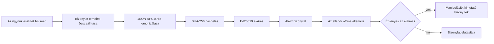
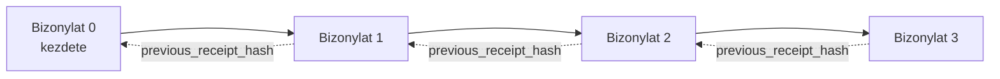

[Órarész videó megtekintése: AI ügynökök védelme kriptográfiai bizonylatokkal](https://youtu.be/PLACEHOLDER_VIDEO_ID)

> _(Az órarész videót és a bélyegképet a Microsoft tartalomcsapata adja hozzá a merge után, az 14/15. óra mintájára.)_

# AI ügynökök védelme kriptográfiai bizonylatokkal

## Bevezetés

Ez az óra a következőket fogja lefedni:

- Miért fontosak az auditnaplók az AI ügynökök esetében a megfelelőség, hibakeresés és bizalom szempontjából.
- Mi az a kriptográfiai bizonylat és ennek különbsége egy aláíratlan naplóvonaltól.
- Hogyan készítsünk egy aláírt bizonylatot egy ügynök eszközhívásához sima Pythonban.
- Hogyan ellenőrizzünk egy bizonylatot offline és hogyan észleljünk hamisítást.
- Hogyan fűzzük láncra a bizonylatokat, hogy az eltávolításuk vagy sorrendjük megváltoztatása megszakítsa a láncot.
- Mit bizonyítanak a bizonylatok és mit nem.

## Tanulási célok

Az óra elvégzése után tudni fogod, hogyan:

- Azonosítsd azokat a hibamódokat, amelyek kriptográfiai eredetet motiválnak az ügynök műveleteinél.
- Készíts egy Ed25519-aláírt bizonylatot egy kanonikus JSON terhelésről.
- Ellenőrizd a bizonylatot önállóan csak az aláíró nyilvános kulcsával.
- Észleld a hamisítást az ellenőrzés megismétlésével egy módosított bizonylaton.
- Építs egy hash láncolt bizonylat sorozatot és magyarázd el, miért fontos a lánc.
- Ismerd fel a határt, hogy mit bizonyítanak a bizonylatok (hozzárendelés, integritás, sorrendiség) és mit nem (a művelet helyessége, a szabályzat megbízhatósága).

## A probléma: az ügynök auditnaplója

Képzeld el, hogy telepítettél egy AI ügynököt a Contoso Travel számára. Az ügynök ügyfélkéréseket olvas, egy repülőjárat API-t hív az opciók lekérdezésére, és az ügyfél nevében foglal üléseket. Az elmúlt negyedévben az ügynök 50 000 foglalást kezelt.

Ma megérkezik egy auditor. Egy egyszerű kérdést tesz fel: "Mutassa meg, mit tett az ügynöke."

Átadod a naplófájljaidat. Az auditor megnézi őket és egy nehezebb kérdést tesz fel: "Hogyan tudom, hogy ezeket a naplókat nem szerkesztették meg?"

Ez az auditnapló-probléma. A legtöbb ügynök telepítés jelenleg a következőkre támaszkodik:

- **Alkalmazásnaplók**: maga az ügynök írja, szerkeszthetők bárki által, akinek fájlrendszer-hozzáférése van.
- **Felhő alapú naplózási szolgáltatások**: platform szinten hamisítás-ellenőrzöttek, de csak ha az auditor megbízik a platform üzemeltetőjében.
- **Adatbázis tranzakciós naplók**: jól megfelelnek adatbázis változásokhoz, de nem tetszőleges eszközhívásokhoz.

Egyik sem válaszolja meg az auditor kérdését anélkül, hogy az auditor ne kellene valakiben megbíznia (tőled, a felhőszolgáltatódtól, az adatbázis szolgáltatódtól). Belső használatra ez gyakran elfogadható. Szabályozott terhelések (pénzügy, egészségügy, vagy ami az EU AI rendelet hatálya alá tartozik) esetén nem.

A kriptográfiai bizonylatok ezt úgy oldják meg, hogy minden egyes ügynöki műveletet önállóan ellenőrizhetővé tesznek. Az auditor nem kell, hogy bízzon benned. Csak a nyilvános kulcsodra és magára a bizonylatra van szüksége.

## Mi az a kriptográfiai bizonylat?

A bizonylat egy JSON objektum, amely rögzíti, hogy egy ügynök mit tett, digitális aláírással ellátva.


```mermaid
flowchart LR
    A[Az ügynök eszközt hív meg] --> B[Bizonylat terhelés összeállítása]
    B --> C[JSON RFC 8785 kanonizálása]
    C --> D[SHA-256 hashelés]
    D --> E[Ed25519 aláírás]
    E --> F[Aláírt bizonylat]
    F --> G[Az ellenőr offline ellenőriz]
    G --> H{Érvényes az aláírás?}
    H -- yes --> I[Manipulációt kimutató bizonyíték]
    H -- no --> J[Bizonylat elutasítva]
```

Egy minimális bizonylat így néz ki:

```json
{
  "type": "agent.tool_call.v1",
  "agent_id": "contoso-travel-bot",
  "tool_name": "lookup_flights",
  "tool_args_hash": "sha256:a3f9c1...",
  "result_hash": "sha256:7b2e1d...",
  "policy_id": "contoso-travel-policy-v3",
  "timestamp": "2026-04-25T14:30:00Z",
  "sequence": 47,
  "previous_receipt_hash": "sha256:9d4e6a...",
  "signature": {
    "alg": "EdDSA",
    "sig": "c5af83...",
    "public_key": "8f3b2c..."
  }
}
```

Három tulajdonság végzi a munkát:

1. **Az aláírás**. A bizonylatot az ügynök átjárója írja alá Ed25519 privát kulccsal. Bárki, akinek megvan a megfelelő nyilvános kulcs, offline ellenőrizheti az aláírást. Bármely mező megváltoztatása érvényteleníti az aláírást.

2. **Kanonikus kódolás**. Az aláírás előtt a bizonylatot a JSON Kanonizációs Sémával (JCS, RFC 8785) sorosítják. Ez biztosítja, hogy két implementáció, amely ugyanazt a logikai bizonylatot készíti, bájtazonos kimenetet adjon. Kanonizáció nélkül különböző JSON sorosítók eltérő aláírást hoznának ugyanarra a tartalomra.

3. **Hash láncolás**. A `previous_receipt_hash` mező minden bizonylatot az előzőhöz kapcsol. Egy bizonylat eltávolítása vagy sorrendjének megváltoztatása megszakítja az őt követő összes bizonylatot. A hamisítás a lánc szintjén láthatóvá válik, akkor is, ha a különálló aláírásokat megkerülik.

Együtt ezek a tulajdonságok három garanciát nyújtanak:

- **Hozzárendelés**: ez a kulcs írta alá ezt a tartalmat.
- **Integritás**: a tartalom nem változott az aláírás óta.
- **Sorrendiség**: ez a bizonylat később került feldolgozásra a láncban, mint az előző.

## Bizonylat készítése Pythonban

Bizonylathoz nem kell speciális könyvtár. A kriptográfiai primítívek széles körben elérhetők, és a logika néhány tucat sor Pythonban.

A `code_samples/18-signed-receipts.ipynb` gyakorlati feladatban végigjárjuk a teljes folyamatot. Az összefoglaló:

```python
import json
import hashlib
import base64
from nacl import signing
from jcs import canonicalize  # RFC 8785 kanonikus JSON

def b64url_nopad(data: bytes) -> str:
    return base64.urlsafe_b64encode(data).decode("ascii").rstrip("=")

def sha256_canonical(obj) -> str:
    """SHA-256 of a Python object's JCS-canonical JSON form."""
    return f"sha256:{hashlib.sha256(canonicalize(obj)).hexdigest()}"

# Aláírókulcs generálása vagy betöltése (élesben kulcstárolóban tárolandó)
signing_key = signing.SigningKey.generate()
verify_key = signing_key.verify_key

# A blokknyugta adat felépítése (még nincs aláírás)
tool_args = {"origin": "SYD", "destination": "LAX"}
tool_result = [{"flight": "QF11", "price": 1850, "stops": 0}]

payload = {
    "type": "agent.tool_call.v1",
    "agent_id": "contoso-travel-bot",
    "tool_name": "lookup_flights",
    "tool_args_hash": sha256_canonical(tool_args),
    "result_hash": sha256_canonical(tool_result),
    "policy_id": "contoso-travel-policy-v3",
    "timestamp": "2026-04-25T14:30:00Z",
    "sequence": 0,
    "previous_receipt_hash": None,
}

# Kanonizálás, hash-elés, aláírás.
canonical_bytes = canonicalize(payload)
message_hash = hashlib.sha256(canonical_bytes).digest()
signature_bytes = signing_key.sign(message_hash).signature

# Struktúrált aláírási objektum csatolása.
receipt = {
    **payload,
    "signature": {
        "alg": "EdDSA",
        "sig": b64url_nopad(signature_bytes),
        "public_key": b64url_nopad(bytes(verify_key)),
    },
}
```

Ez az egész aláírási folyamat. A jegyzetfüzetben a gyakorlatokon végigmegyünk minden lépésen.

## Bizonylat ellenőrzése és hamisítás észlelése

Az ellenőrzés a fordított művelet:

```python
import base64
import hashlib
from nacl import signing
from nacl.exceptions import BadSignatureError
from jcs import canonicalize

def b64url_decode(s: str) -> bytes:
    padding = "=" * ((4 - len(s) % 4) % 4)
    return base64.urlsafe_b64decode(s + padding)

def verify_receipt(receipt: dict) -> bool:
    # Az aláírás egy strukturált objektum: {"alg", "sig", "public_key"}.
    sig_obj = receipt.get("signature")
    if not sig_obj or sig_obj.get("alg") != "EdDSA":
        return False

    # Állítsd vissza a ténylegesen aláírt adatteher (az aláírás kivételével mindent).
    payload = {k: v for k, v in receipt.items() if k != "signature"}

    canonical_bytes = canonicalize(payload)
    message_hash = hashlib.sha256(canonical_bytes).digest()

    try:
        verify_key = signing.VerifyKey(b64url_decode(sig_obj["public_key"]))
        verify_key.verify(message_hash, b64url_decode(sig_obj["sig"]))
        return True
    except BadSignatureError:
        return False
```

Ez a függvény vesz egy bizonylatot és `True`-t ad vissza, ha az aláírás érvényes, különben `False`-t. Nincs hálózati hívás, nincs szolgáltatásfüggőség, nincs harmadik félbe vetett bizalom.

A hamisítás észlelésének bemutatásához a jegyzetfüzet ezt tartalmazza:

1. Érvényes bizonylat készítése és megerősítése az ellenőrzés sikerességéről.
2. Egyetlen bájt módosítása a `tool_args_hash` mezőben.
3. Az ellenőrzés ismétlése és a sikertelenség észlelése.

Ez a gyakorlati demonstráció, hogy a bizonylatok hamisítás-ellenőrzöttek: bármilyen, még a legkisebb módosítás is megszakítja az aláírást.

## Bizonylatok láncolása több lépéses ügynökökhöz

Egyetlen aláírt bizonylat egy műveletet véd. Egy láncolt bizonylat sorozat egy sorrendet véd.


```mermaid
flowchart LR
    R0[Bizonylat 0<br/>kezdete] --> R1[Bizonylat 1]
    R1 --> R2[Bizonylat 2]
    R2 --> R3[Bizonylat 3]
    R1 -. previous_receipt_hash .-> R0
    R2 -. previous_receipt_hash .-> R1
    R3 -. previous_receipt_hash .-> R2
```

Minden bizonylat a megelőző bizonylat hash-ét rögzíti. Ha egy támadó csendben eltávolítaná a 2. bizonylatot, akkor vagy:

- Módosítania kell a 3. bizonylat `previous_receipt_hash` mezőjét (ez megszakítja a 3. bizonylat aláírását), VAGY
- Hamisítania kell egy új aláírást a módosított 3. bizonylaton (ez az ügynök privát kulcsát igényli).

Ha a privát kulcs hardveres kulcstárban van és minden bizonylattal közzéteszed a nyilvános kulcsot, egyik támadás sem kivitelezhető észrevétel nélkül.

A jegyzetfüzet végigvezet:

1. Három bizonylat láncának felépítésén.
2. Ellenőrzésén, hogy minden bizonylat `previous_receipt_hash` mezője megfelel-e az előző bizonylat tényleges has értékének.
3. Egy középső bizonylat megváltoztatásán és a lánc pontosan ott történő megszakadásának megfigyelésén.

Így készíthetsz auditnaplót, amit egy külső auditor ellenőrizhet anélkül, hogy benned kellene bíznia.

## Mit bizonyítanak a bizonylatok (és mit nem)

Ez a lecke legfontosabb része. A bizonylatok erősek, de határaik vannak.

**A bizonylatok három dolgot bizonyítanak:**

1. **Hozzárendelés**: egy adott kulcs aláírta az adott terhelést.
2. **Integritás**: a terhelés nem változott az aláírás óta.
3. **Sorrendiség**: ez a bizonylat később készült, mint az előző a hash láncban.

**A bizonylatok NEM bizonyítanak:**

1. **Helyesség**: hogy az ügynök helyes műveletet végzett. Ugyanolyan tisztán aláírható bizonylat egy rossz válaszra, mint a jóra.
2. **Szabályzati megfelelőség**: hogy a `policy_id`-ban említett szabályzatot valóban értékelték, vagy hogy engedélyezte volna-e ezt a műveletet. A bizonylat azt rögzíti, amit állítottak, nem azt, amit végrehajtottak.
3. **Személyazonosság a kulcson túl**: a bizonylat azt mondja, „ez a kulcs írta alá ezt a tartalmat”. Nem mondja, hogy „ez az ember engedélyezte ezt”. A kulcs és egy személy vagy szervezet összekapcsolása külön identitás infrastruktúrát igényel (könyvtár, nyilvános kulcs regiszter stb.).
4. **Bemeneti adatok igazságtartalma**: ha az ügynök manipulált kérést kap és arra lép, a bizonylat hűen rögzíti a műveletet. A bizonylatok a bemeneti validáció után vannak, nem annak helyettesítői.

Ez a határvonal két okból fontos:

- Megmutatja, mire használhatók a bizonylatok: az ügynök viselkedésének auditálhatóságára és hamisítás-ellenőrzöttségének biztosítására, még szervezeti határokon átnyúlóan is.
- Megmutatja, milyen további rétegekre van szükséged: bemeneti validációra (6. lecke), szabályzat alkalmazásra (lent röviden tárgyalva), és identitás infrastruktúrára (ez a lecke hatókörén kívül esik).

Egy gyakori hibázás azt feltételezni, hogy „ha vannak bizonylataink, akkor irányítás alatt vagyunk”. Ez nem igaz. A bizonylatok alapot képeznek. Az irányítás az a rendszer, amit ezekre építesz.

## Gyártási hivatkozások

A lecke Python kódja szándékosan minimalista, hogy minden sort el tudj olvasni és pontosan megértsd, mi történik. Gyártásban két lehetőséged van:

1. **Közvetlenül a kriptográfiai primitívekre építeni.** Az előző 50 sor sok használati esethez elég. A PyNaCl (Ed25519) és a `jcs` csomag (kanonikus JSON) jól karbantartott és auditált könyvtárak.

2. **Használj gyártási bizonylat könyvtárat.** Számos nyílt forráskódú projekt implementálja ugyanazt a mintát kiegészítő funkciókkal (kulcsforgatás, kötegelt ellenőrzés, JWK Set terjesztés, integráció szabályzat motorokkal):
   - A lecke szerinti bizonylatformátum egy IETF Internet-Draft (`draft-farley-acta-signed-receipts`), ami jelenleg a szabványosítási folyamatban van.
   - A Microsoft Agent Governance Toolkit bizonylatokat fűz össze Cedar alapú szabályzat döntésekkel; lásd a 33. oktatóanyagot ebben a repóban egy végponttól végpontig példával.
   - A `protect-mcp` (npm) és `@veritasacta/verify` (npm) csomagok Node-alapú bizonylat aláírást és offline ellenőrzést kínálnak, hogy bármely MCP szervert hamisítás-ellenőrzött audit nappal burkoljanak be.
   - A **[nobulex](https://github.com/arian-gogani/nobulex)** Python SDK (`pip install nobulex`) ugyanazt az Ed25519 + JCS aláírási mintát nyújtja Pythonban LangChain és CrewAI integrációval, beleértve közzétett keresztellenőrzési tesztvektorokat és megfelelőségi térképet az [OWASP PR #2210](https://github.com/OWASP/CheatSheetSeries/pull/2210) révén.

A saját megoldás és a könyvtár használata közötti döntés hasonló a JWT könyvtár saját írása és egy tesztelt használata közötti választáshoz: mindkettő indokolt; a könyvtár időt spórol és csökkenti az audit felületet; a nulláról való írás megérteti veled minden primitív jelentését. Ez az óra a nulláról vezet be, hogy meglegyen az alapod bármelyik választáshoz.

## Tudásellenőrzés

Teszteld a tudásodat a gyakorlati feladat előtt.

**1. Egy bizonylatot az ügynök privát Ed25519 kulcsával írnak alá. Az auditor csak a nyilvános kulccsal rendelkezik. Az auditor offline is tudja ellenőrizni a bizonylatot?**

<details>
<summary>Válasz</summary>

Igen. Az Ed25519 ellenőrzéséhez csak a nyilvános kulcsra és az aláírt bájtokra van szükség. Nincs hálózati hívás, szolgáltatásfüggőség. Ez az a tulajdonság, ami hasznossá teszi a bizonylatokat levegőzáras, több szervezetet érintő vagy alacsony bizalommal rendelkező audit helyzetekben.
</details>

**2. Egy támadó módosítja egy bizonylat `policy_id` mezőjét, hogy engedékenyebb szabályzatot állítson be. Az aláírás az eredeti terhelésen készült. Mi történik az ellenőrzés során?**

<details>
<summary>Válasz</summary>

Az ellenőrzés meghiúsul. Az aláírást az eredeti terhelés kanonikus bájtjain számították; bármely mező módosítása megváltoztatja a kanonikus bájtokat, ami megváltoztatja a SHA-256 hasht, és így érvényteleníti az aláírást. A támadónak szüksége lenne a privát kulcsra egy érvényes új aláírás készítéséhez, ami nincs meg neki.
</details>

**3. Miért tartalmaz a bizonylat `tool_args_hash` és `result_hash` mezőket a nyers argumentumok és eredmény helyett?**

<details>
<summary>Válasz</summary>

Két okból. Először is, a bizonylat archiválandó vagy továbbítandó lehet olyan környezetben, ahol a nyers tartalom (személyes adatok, üzleti adatok) kiszivárgása probléma. A hash megőrzi a bizonylat kis méretét és a tartalom privát jellegét; az auditor igazolja, hogy a hash megegyezik a külön tárolt tényleges tartalommal. Másodszor, a hash fix méretű; a hash-eket tartalmazó bizonylat mérete korlátos, akármekkoraak is a bemenetek és kimenetek.
</details>

**4. A `previous_receipt_hash` mező minden bizonylatot az előzőhöz kapcsol. Ha egy támadó csendben eltávolít egy bizonylatot a lánc közepéből, mi lesz érvénytelen?**

<details>
<summary>Válasz</summary>

Minden, az eltávolított után következő bizonylat. Az ő `previous_receipt_hash` mezőjük már nem illeszkedik a tényleges láncra (mivel a hivatkozott bizonylat már nem létezik, vagy a lánc most egy másik elődöt jelöl). Az eltávolítás elrejtéséhez a támadónak újra kellene írnia minden későbbi bizonylat aláírását, amihez a privát kulcs szükséges.
</details>

**5. Egy bizonylat tisztán ellenőrizhető. Bizonyítja ez, hogy az ügynök művelete helyes, megbízható vagy megfelel a szabályzatnak?**

<details>
<summary>Válasz</summary>

Nem. Egy érvényes bizonylat három dolgot bizonyít: hozzárendelés (ez a kulcs írta alá ezt a tartalmat), integritás (a tartalom nem változott), és sorrendiség (ez a bizonylat később készült, mint az előző). Nem bizonyítja, hogy a művelet helyes volt, hogy a `policy_id` által megnevezett szabályzatot valóban értékelték, vagy hogy az ügynök minden szabályt betartott. A bizonylatok az ügynök viselkedését auditálhatóvá teszik, nem feltétlen helyessé. Ez a lecke legfontosabb határa.
</details>

## Gyakorlati feladat

Nyisd meg a `code_samples/18-signed-receipts.ipynb` fájlt és végezd el mind a négy részt:

1. **1. szakasz**: Írd alá az első bizonylatot és ellenőrizd.
2. **2. szakasz**: Hamisíts a bizonylaton és figyeld meg, hogy az ellenőrzés hibára fut.
3. **3. szakasz**: Építs három bizonylatból álló láncot és ellenőrizd a lánc integritását.
4. **4. szakasz**: Alkalmazd a mintát egy Microsoft Agent Framework-pel épített ügynökre: burkold be az eszköz hívását bizonylat aláírással, majd ellenőrizd a bizonylatot önállóan.


**Extra kihívás 1:** bővítse a blokk séma további, általad választott mezővel (például kérésazonosító a nyomon követéshez), frissítse a kanonikus aláírási logikát, hogy azt is tartalmazza, és erősítse meg, hogy a blokk továbbra is átmegy az ellenőrzésen. Ezután módosítsa a mezőt az aláírás után, és igazolja, hogy az ellenőrzés hibát jelez. Ez arra kényszerít, hogy megértse, hogyan járul hozzá a kanonikus kódolás minden bájtja az aláíráshoz.

**Extra kihívás 2:** SHA-256-tal hasheljen össze két blokkot (konkaténezze a kanonikus bájtjaikat determinisztikus sorrendben), és ágyazza be a kapott digestet egy harmadik blokk új mezőjeként, mielőtt aláírná azt. Ellenőrizze, hogy mindhárom blokk továbbra is átmegy az ellenőrzésen. Épp egy egylépéses befogadási bizonyítékot épített: aki birtokolja a harmadik blokkot, bizonyítani tudja, hogy az első kettő létezett az aláírás időpontjában anélkül, hogy azok tartalmát felfedné. Ez az a minta, amit a szelektív közzétételű blokkok széles körben használnak (Merkle-kötelezettségek, RFC 6962).

## Összegzés

Kriptográfiai blokkok lehetővé teszik, hogy az MI-ügynököknek nyomon követhető naplójuk legyen, amely:

- **Függetlenül ellenőrizhető**: bármely fél, aki rendelkezik a nyilvános kulccsal, ellenőrizheti, nincs szolgáltatásfüggőség.
- **Változtatásra érzékeny**: bármilyen módosítás érvényteleníti az aláírást.
- **Hordozható**: a blokk egy kis JSON fájl; archiválható, továbbítható és bárhol ellenőrizhető.
- **Szabványnak megfelelő**: Ed25519 (RFC 8032), JCS (RFC 8785) és SHA-256 alapokra épül, mind általánosan használt primitívek.

Nem helyettesítik a bemeneti érvényesítést, szabályzat végrehajtást vagy az identitás infrastruktúrát. Ezek alapot nyújtanak ezekhez a rétegekhez. Amikor ügynököket telepítesz szabályozott munkaterhelésekhez, több szervezetes munkafolyamatokhoz vagy bármilyen olyan környezetben, ahol egy jövőbeli ellenőr nem feltétlenül bízhat benned, a blokkok teszik őszinté a nyomon követés naplóját.

A legfontosabb tanulság: a blokkok bizonyítják, hogy ki mit mondott és mikor. Nem bizonyítják, hogy amit mondtak, az igaz vagy helyes volt. Tartsd szorosan ezt a különbséget. Ez a különbség egy őszinte eredetkezelő rendszer és egy félrevezető között.

## Gyártási lista

Amikor készen állsz arra, hogy az órától függetlenül valós környezetben telepíts blokk-aláírással működő ügynököket:

- [ ] **Mozdítsd át az aláíró kulcsot a fejlesztői laptopról.** Használj Azure Key Vault-ot, AWS KMS-t vagy hardveres biztonsági modult. Az a privát kulcs, amely a blokkokat aláírja, soha nem kerülhet forráskód-tárolóba vagy titkosítatlanul az alkalmazás gépein.
- [ ] **Tedd közzé az ellenőrző nyilvános kulcsot.** Az ellenőröknek szükségük van rá az offline ellenőrzéshez. A standard minta egy JWK-készlet egy jól ismert URL-en (RFC 7517), pl. `https://your-org.example.com/.well-known/agent-keys.json`.
- [ ] **Horgonyozd be a láncot külsőleg.** Időnként írd a legfrissebb láncfej hash-ét egy átláthatósági naplóba (Sigstore Rekor, RFC 3161 időbélyegző hatóság vagy egy másodlagos belső rendszer), hogy egy külső fél megerősíthesse: „ez a lánc ezen időpontban létezett.”
- [ ] **Tárold a blokkokat megváltoztathatatlanul.** Csak hozzáfűzhető blob-tárolás (Azure Storage megváltoztathatatlansági szabályokkal, AWS S3 Objektumzár) megakadályozza, hogy egy belső személy a tárolási szinten átírja a történelmet.
- [ ] **Dönts a megőrzésről.** Sok megfelelőségi rendszer több éves megőrzést követel meg. Tervezd be a blokkok növekedését (egy blokk ~500 bájt; egy ügynök napi 10k hívással kb. 1,8 GB évente).
- [ ] **Dokumentáld, mit nem fednek le a blokkok.** A blokkok bizonyítják az attribúciót, az integritást és a sorrendet. A futtatási dokumentációdnak egyértelműen fel kell tüntetnie, hogy milyen további kontrollok (bemeneti érvényesítés, szabályzat végrehajtás, sebességkorlátozás, identitás infrastruktúra) működnek együtt blokkokkal a kormányzati fellépésedben.

### Több kérdésed van az MI ügynökök biztonságáról?

Csatlakozz a [Microsoft Foundry Discord](https://aka.ms/ai-agents/discord) szerverhez, hogy találkozz más tanulókkal, részt vegyél konzultációkon, és megkapd MI ügynökeiddel kapcsolatos kérdéseidre a válaszokat.

## Tovább a leckén túl

Ez a lecke az egyetlen blokkra történő aláírást és hash-láncolt sorozatokat fedi le. Ugyanezek az elemek több további fejlett mintázatot építenek fel, amelyekkel találkozhatsz, ahogy a kormányzati fellépésed érik:

- **Szelektív közzététel.** Amikor egy blokk mezőit külön-külön elkötelezed (RFC 6962-stílusú Merkle-fa), megmutathatsz konkrét mezőket adott ellenőröknek, és bizonyíthatod, hogy a többi nem változott anélkül, hogy azokat felfednéd. Hasznos, ha ugyanaz a blokk egyszerre kell, hogy megfeleljen egy átfogó auditnak (amely a teljességet követeli meg) és adatminimalizálási szabályozásoknak, mint a GDPR (amely azt kívánja, hogy az ellenőr minél kevesebbet lásson).
- **Blokk visszavonás.** Ha egy aláíró kulcs kompromittálódik, szükség van egy módra, hogy az összes azzal a kulccsal aláírt blokkot egy adott időpont után megbízhatatlannak jelöljék meg. Standard minták: rövid életű aláíró kulcsok plusz közzétett visszavonási lista, vagy egy átláthatósági napló visszavonási bejegyzésekkel.
- **Kétoldalú / megosztott aláírású blokkok.** Néhány megvalósítás az aláírt terhet elő- és utó-végrehajtási részre bontja (`authorization_*` és `result_*`), független aláírásokkal, ami akkor hasznos, ha az engedélyező döntést és a megfigyelt eredményt külön szereplők adják, vagy külön időpontban készülnek. Ez hozzáadódik a lecke során tanult blokk formátumhoz.
- **Terhelés összeállítás.** Egy blokk lezárja azokat a bájtokat, amiket a `result_hash` mezőbe teszel. A valós terhelés gyakran gazdagabb, mint egyetlen eszköz hívásának eredménye: az előzetes döntéshozói érvelések (modell előrejelzés, megfontolt opciók, bizonyítékok és hiányosságaik, kockázati állapot, elszámoltathatósági lánc, kapu eredmény) mind megférnek a terhelésben, amelyet egyetlen blokk zár le. Ez minimalizálja a blokk formátumot, miközben a terhelés sémák doménről doménre fejlődhetnek.
- **Megvalósítások közötti megfelelőség.** Több független implementáció azonos blokk formátumra (Python, TypeScript, Rust, Go) közösen ellenőrzik a megosztott tesztvektorok alapján. Ha saját implementációt készítesz, a közzétett vektorok ellenőrzése alkalmas a kompatibilitás igazolására.
- **Poszt-kvantumos átállás.** Az Ed25519 ma széles körben használt, de nem kvantum-álló. A blokk formátum algoritmus-ügynök: a `signature.alg` mező hordozhatja az `ML-DSA-65`-öt (a NIST poszt-kvantum aláírási szabványt), amikor át kell térni. Tervezd meg a kettős aláírású blokkok időszakát.

## További források

- <a href="https://datatracker.ietf.org/doc/draft-farley-acta-signed-receipts/" target="_blank">IETF Internet-tervezet: Gépek közti hozzáférés-vezérlés aláírt döntési blokkjai</a>
- <a href="https://learn.microsoft.com/azure/ai-studio/responsible-use-of-ai-overview" target="_blank">Felelős MI áttekintés (Azure AI)</a>
- <a href="https://datatracker.ietf.org/doc/html/rfc8032" target="_blank">RFC 8032: Edwards-görbe digitális aláírási algoritmus (EdDSA)</a>
- <a href="https://datatracker.ietf.org/doc/html/rfc8785" target="_blank">RFC 8785: JSON kanonizációs séma (JCS)</a>
- <a href="https://datatracker.ietf.org/doc/html/rfc6962" target="_blank">RFC 6962: Tanúsítvány-átláthatóság</a> (Merkle-fa szerkezet szelektív közzétételű blokkokhoz)
- <a href="https://github.com/microsoft/agent-governance-toolkit/blob/main/docs/tutorials/33-offline-verifiable-receipts.md" target="_blank">Microsoft Agent Governance Toolkit, 33. oktatóanyag: offline ellenőrizhető döntési blokkok</a>
- <a href="https://github.com/ScopeBlind/agent-governance-testvectors" target="_blank">Megvalósítások közötti megfelelőség tesztvektorok</a> ebből a leckéből származó blokk formátumhoz (Apache-2.0)
- <a href="https://pynacl.readthedocs.io/" target="_blank">PyNaCl dokumentáció</a> (Ed25519 Pythonban)

## Előző lecke

[Számítógép-használati ügynökök építése (CUA)](../15-browser-use/README.md)

---

<!-- CO-OP TRANSLATOR DISCLAIMER START -->
**Jogi nyilatkozat**:
Ez a dokumentum az AI fordítási szolgáltatás, a [Co-op Translator](https://github.com/Azure/co-op-translator) segítségével készült. Bár az pontosságra törekszünk, kérjük, vegye figyelembe, hogy az automatikus fordítások hibákat vagy pontatlanságokat tartalmazhatnak. Az eredeti dokumentum az anyanyelvén tekintendő hiteles forrásnak. Fontos információk esetén professzionális emberi fordítást javasolunk. Nem vállalunk felelősséget semmilyen félreértésért vagy téves értelmezésért, amely ebből a fordításból ered.
<!-- CO-OP TRANSLATOR DISCLAIMER END -->