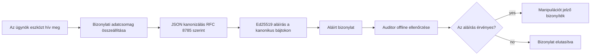
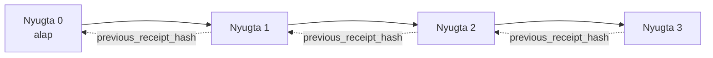

[Nézd meg az óra videóját: AI ügynökök biztonságossá tétele kriptográfiai nyugtákkal](https://youtu.be/PLACEHOLDER_VIDEO_ID)

> _(Az óra videóját és bélyegképét a Microsoft tartalomcsapata adja hozzá az egyesítés után, az 14. / 15. óra mintájának megfelelően.)_

# AI ügynökök biztonságossá tétele kriptográfiai nyugtákkal

## Bevezetés

Ez az óra a következőket fogja lefedni:

- Miért fontosak az audit nyomok AI ügynökök számára a megfelelőség, hibakeresés és bizalom szempontjából.
- Mi a kriptográfiai nyugta, és miben különbözik egy aláíratlan naplóbejegyzéstől.
- Hogyan készítsünk aláírt nyugtát egy ügynök eszközhívásáról sima Pythonban.
- Hogyan ellenőrizzük a nyugtát offline módban és hogyan észleljük a hamisítást.
- Hogyan kapcsoljuk láncba a nyugtákat úgy, hogy egy eltávolítás vagy átrendezés megszakítsa a láncot.
- Mit bizonyítanak a nyugták, és mit nem bizonyítanak kifejezetten.

## Tanulási célok

Az óra elvégzése után tudni fogod, hogyan kell:

- Azonosítani a hibás működési módokat, amelyek kriptográfiai eredetiséget indokolnak az ügynöki műveleteknél.
- Elkészíteni egy Ed25519 által aláírt nyugtát egy kanonikus JSON terhelésre.
- Függetlenül ellenőrizni egy nyugtát kizárólag az aláíró nyilvános kulcsával.
- Észlelni a hamisítást úgy, hogy újból lefuttatjuk az ellenőrzést egy módosított nyugtán.
- Kiépíteni egy hash-láncolt nyugták sorozatát és megmagyarázni, miért fontos a lánc.
- Felismerni a határt, hogy mit bizonyítanak a nyugták (hozzárendelés, sértetlenség, sorrend) és mit nem (a művelet helyessége, a szabályzat helyessége).

## A probléma: az ügynök audit nyoma

Képzeld el, hogy beüzemeltél egy AI ügynököt a Contoso Travel számára. Az ügynök olvassa az ügyfél kéréseit, hívja a járatok API-ját opciók lekérdezésére, és foglal helyeket az ügyfél nevében. Az elmúlt negyedévben az ügynök 50 000 foglalást dolgozott fel.

Ma megérkezik egy auditor. Egy egyszerű kérdést tesz fel: „Mutasd meg, mit csinált az ügynököd.”

Átadod a naplófájlokat. Az auditor megnézi azokat, és feltesz egy nehezebb kérdést: „Hogyan tudom, hogy ezeket a naplókat nem módosították?”

Ez az audit-nyom probléma. A legtöbb ma használt ügynök telepítés erre támaszkodik:

- **Alkalmazásnaplók**: maguk az ügynökök írják, bárki, akinek fájlrendszer-hozzáférése van, szerkesztheti.
- **Felhő alapú naplózási szolgáltatások**: a platform szintjén látható tamper-evidens, de csak akkor, ha az auditor bízik a platform üzemeltetőjében.
- **Adatbázis tranzakciós naplók**: jól használhatók adatbázis-változásokhoz, de nem alkalmasak tetszőleges eszközhívások naplózására.

Egyik sem tud válaszolni az auditor kérdésére anélkül, hogy az auditor valakiben megbízzon (téged, a felhős szolgáltatódat, az adatbázis szállítót). Belső használatra ez a bizalom gyakran elfogadható. Szabályozott munkaterhelések esetén (pénzügy, egészségügy, vagy bármilyen az EU AI törvény hatálya alá tartozó) nem az.

A kriptográfiai nyugták úgy oldják meg ezt, hogy minden ügynöki művelet függetlenül ellenőrizhető. Az auditor nem kell, hogy benned bízzon, elég neki a nyilvános kulcsod és maga a nyugta.

## Mi az a kriptográfiai nyugta?

A nyugta egy JSON objektum, ami rögzíti, mit csinált az ügynök, digitális aláírással ellátva.


```mermaid
flowchart LR
    A[Az ügynök eszközt hív meg] --> B[Bizonylati adatcsomag összeállítása]
    B --> C[JSON kanonizálás RFC 8785 szerint]
    C --> E[Ed25519 aláírás a kanonikus bájtokon]
    E --> F[Aláírt bizonylat]
    F --> G[Auditor offline ellenőrzése]
    G --> H{Az aláírás érvényes?}
    H -- yes --> I[Manipulációt jelző bizonyíték]
    H -- no --> J[Bizonylat elutasítva]
```

Egy minimális nyugta így néz ki:

```json
{
  "type": "agent.tool_call.v1",
  "agent_id": "contoso-travel-bot",
  "tool_name": "lookup_flights",
  "tool_args_hash": "sha256:a3f9c1...",
  "result_hash": "sha256:7b2e1d...",
  "policy_id": "contoso-travel-policy-v3",
  "timestamp": "2026-04-25T14:30:00Z",
  "sequence": 47,
  "previous_receipt_hash": "sha256:9d4e6a...",
  "signature": {
    "alg": "EdDSA",
    "sig": "c5af83...",
    "public_key": "8f3b2c..."
  }
}
```

Három tulajdonság végzi a munkát:

1. **Az aláírás**. A nyugtát az ügynök átjárója írja alá Ed25519 privát kulccsal. Bárki, akinek megvan a kapcsolódó nyilvános kulcs, offline módon ellenőrizheti az aláírást. Bármely mező manipulálása érvényteleníti az aláírást.

2. **Kanonikus kódolás**. Aláírás előtt a nyugta a JSON Kanonizálási Sémát (JCS, RFC 8785) használva van szekvenálva. Ez biztosítja, hogy két megvalósítás, amely ugyanazt a logikai nyugtát adja, bájtonként azonos kimenetet produkáljon. Kanonizálás nélkül különböző JSON szerializálók eltérő aláírásokat eredményeznének ugyanarra a tartalomra.

3. **Hash-láncolás**. A `previous_receipt_hash` mező összekapcsolja a nyugtákat az előzővel. Egy nyugta eltávolítása vagy átrendezése minden utána következő nyugtát megszakít. A manipuláció a lánc szintjén is láthatóvá válik, még akkor is, ha az egyéni aláírásokat megkerülik.

Ezek a tulajdonságok együtt három garanciát biztosítanak:

- **Hozzárendelés**: ez a kulcs írta alá ezt a tartalmat.
- **Sértetlenség**: a tartalom nem változott az aláírás óta.
- **Sorrendiség**: ez a nyugta a láncban az adott nyugta után keletkezett.

## Nyugta készítése Pythonban

Nem szükséges külön könyvtár a nyugta elkészítéséhez. A kriptográfiai primitívek széles körben elérhetőek, és a logika néhány tucat sor Python.

A gyakorlati feladatok a `code_samples/18-signed-receipts.ipynb` fájlban lépésről lépésre bemutatják a teljes folyamatot. Az összefoglaló változat:

```python
import json
import hashlib
import base64
from nacl import signing
from jcs import canonicalize  # RFC 8785 kanonikus JSON

def b64url_nopad(data: bytes) -> str:
    return base64.urlsafe_b64encode(data).decode("ascii").rstrip("=")

def sha256_canonical(obj) -> str:
    """SHA-256 of a Python object's JCS-canonical JSON form."""
    return f"sha256:{hashlib.sha256(canonicalize(obj)).hexdigest()}"

# Aláíró kulcs generálása vagy betöltése (éles környezetben tárolja egy kulcstartóban)
signing_key = signing.SigningKey.generate()
verify_key = signing_key.verify_key

# Az átvételi adatcsomag összeállítása (még aláírás nélkül)
tool_args = {"origin": "SYD", "destination": "LAX"}
tool_result = [{"flight": "QF11", "price": 1850, "stops": 0}]

payload = {
    "type": "agent.tool_call.v1",
    "agent_id": "contoso-travel-bot",
    "tool_name": "lookup_flights",
    "tool_args_hash": sha256_canonical(tool_args),
    "result_hash": sha256_canonical(tool_result),
    "policy_id": "contoso-travel-policy-v3",
    "timestamp": "2026-04-25T14:30:00Z",
    "sequence": 0,
    "previous_receipt_hash": None,
}

# A JCS bájtok kanonikusítása és közvetlen aláírása. A PureEdDSA belsőleg hash-el.
canonical_bytes = canonicalize(payload)
signature_bytes = signing_key.sign(canonical_bytes).signature

# Strukturált aláírási objektum csatolása.
receipt = {
    **payload,
    "signature": {
        "alg": "EdDSA",
        "sig": b64url_nopad(signature_bytes),
        "public_key": b64url_nopad(bytes(verify_key)),
    },
}
```

Ez az egész aláírási folyamat. A jegyzetfüzetben minden lépést bemutatnak.

## Nyugta ellenőrzése és hamisítás észlelése

Az ellenőrzés a fordított művelet:

```python
import base64
import hashlib
from nacl import signing
from nacl.exceptions import BadSignatureError
from jcs import canonicalize

def b64url_decode(s: str) -> bytes:
    padding = "=" * ((4 - len(s) % 4) % 4)
    return base64.urlsafe_b64decode(s + padding)

def verify_receipt(receipt: dict) -> bool:
    # Az aláírás egy strukturált objektum: {"alg", "sig", "public_key"}.
    sig_obj = receipt.get("signature")
    if not sig_obj or sig_obj.get("alg") != "EdDSA":
        return False

    # Állítsa vissza a ténylegesen aláírt terhet (mindent az aláírás kivételével).
    payload = {k: v for k, v in receipt.items() if k != "signature"}

    canonical_bytes = canonicalize(payload)

    try:
        verify_key = signing.VerifyKey(b64url_decode(sig_obj["public_key"]))
        verify_key.verify(canonical_bytes, b64url_decode(sig_obj["sig"]))
        return True
    except BadSignatureError:
        return False
```

Ez a függvény vesz egy nyugtát, és `True`-t ad vissza, ha az aláírás érvényes, egyébként `False`-t. Nincs hálózati hívás, nincs szolgáltatásfüggőség, nincs szükség harmadik félbe vetett bizalomra.

A hamisítás észlelés bemutatásához a jegyzetfüzet végigvezet:

1. Érvényes nyugta készítése és annak megerősítése, hogy ellenőrzésre kerül.
2. Egy bájt módosítása a `tool_args_hash` mezőben.
3. Az ellenőrzés újrafuttatása és sikertelenség megfigyelése.

Ez a gyakorlatban bizonyítja, hogy a nyugták hamisításbiztosak: bármilyen módosítás, bármilyen kicsi, megszakítja az aláírást.

## Nyugták láncolása több lépéses ügynökökhöz

Egyetlen aláírt nyugta egy műveletet véd. A nyugták lánca egy sorozatot véd.


```mermaid
flowchart LR
    R0[Nyugta 0<br/>alap] --> R1[Nyugta 1]
    R1 --> R2[Nyugta 2]
    R2 --> R3[Nyugta 3]
    R1 -. previous_receipt_hash .-> R0
    R2 -. previous_receipt_hash .-> R1
    R3 -. previous_receipt_hash .-> R2
```

Minden nyugta rögzíti az előző nyugta hash-ét. Ha egy támadó csendben el akarja távolítani a 2. nyugtát, akkor vagy:

- Módosítania kell a 3. nyugta `previous_receipt_hash` mezőjét (ami megszakítja a 3. nyugta aláírását), VAGY
- Hamis aláírást kell készítenie egy módosított 3. nyugtán (amihez az ügynök privát kulcsa kell).

Ha a privát kulcs egy hardveres kulcstárolóban van, és a nyilvános kulcsot minden nyugtával közzéteszed, egyik támadás sem megvalósítható észrevétel nélkül.

A jegyzetfüzet bemutatja:

1. Három nyugta láncának felépítését.
2. Ellenőrizve, hogy minden nyugta `previous_receipt_hash` mezője megegyezik az előző nyugta tényleges hash-ével.
3. Egy nyugta középen való manipulálása, amely a lánc azonnali megszakadását eredményezi.

Így készíthetsz audit naplót, amelyet egy külső auditor anélkül ellenőrizhet, hogy benned bíznia kellene.

## Mit bizonyítanak a nyugták (és mit nem)

Ez az óra legfontosabb része. A nyugták hatalmasak, de határaik vannak.

**A nyugták három dolgot bizonyítanak:**

1. **Hozzárendelés**: egy adott kulcs írt alá egy adott terhelést.
2. **Sértetlenség**: a terhelés nem változott az aláírás óta.
3. **Sorrend**: ez a nyugta a hash láncban az adott nyugta után következik.

**A nyugták nem bizonyítanak:**

1. **Helyességet**: hogy az ügynök művelete helyes volt. Egy nyugtát ugyanúgy alá lehet írni rossz válasz esetén is, mint jó válasz esetén.
2. **Szabályzat betartását**: hogy a `policy_id`-ban hivatkozott szabályzatot valóban alkalmazták, vagy hogy az engedélyezte volna-e a műveletet, ha ellenőrizték volna. A nyugta csak azt rögzíti, amit állítottak, nem azt, amit végrehajtottak.
3. **Azonosítást a kulcson túl**: a nyugta azt mondja: „ez a kulcs írta alá ezt a tartalmat”. Nem mondja azt, hogy „egy ember engedélyezte ezt”. Kulcs és személy vagy szervezet összekapcsolása külön személyazonosság-infrastruktúrát igényel (pl. egy címtárat, nyilvános kulcs regisztert stb.).
4. **Bemeneti adatok igazságtartalmát**: ha az ügynök manipulált bemenetet kap és azt végrehajtja, a nyugta hűen rögzíti a műveletet. A nyugták a bemeneti validáció után helyezkednek el, nem helyettesítik azt.

Ez a határ két okból fontos:

- Megmondja, mire jók a nyugták: az ügynök viselkedésének auditálhatóságára és hamisítás elleni védelmére még szervezeti határokon át is.
- Megmondja, milyen további rétegekre van még szükséged: bemeneti validációra (6. óra), szabályzat-végrehajtásra (röviden később tárgyalva), és azonosítás-infrastruktúrára (ez az óra hatókörén kívül esik).

Gyakori hiba azt feltételezni, hogy „van nyugtánk” = „megfelelünk a vezérlésnek”. Nem ez a helyzet. A nyugták alapot adnak. A vezérlés az a rendszer, amit erre építesz.

## Bizonyítás, hogy egy ember hagyta jóvá a pontos műveletet

A fentiek közül a 3. érdemes külön szakaszra: egy műveleti nyugta azt mondja: „ez a kulcs írta alá ezt a tartalmat”, soha nem mondja: „egy ember engedélyezte ezt.” Magas kockázatú műveleteknél (visszatérítések, törlések, átutalások) a vezérlési keretrendszerek egyre inkább megkövetelik ezt az hiányzó állítást, amely előállítható ugyanazokkal az primitívekkel, amelyeket ebben az órában már megtanultál.

A folytató jegyzetfüzet, `code_samples/human-authorization-receipts.ipynb`, egy második nyugta típust ad hozzá, `human.approval.v1` néven, ugyanabban a boríték formában, mint a jelen óra nyugtái (egy típusos terhelés, amelyet Ed25519 ír alá a kanonikus JCS bájtokon, a `signature` objektum kívül esik az aláírt bájtokon). Egy névvel ellátott engedélyező aláírja a **teljes kanonikus műveletet és annak kivonatát** a végrehajtás előtt; az ügynök műveleti nyugtája ugyanazt a **műveleti kivonatot** hordozza és egy `parent_approval_ref`-et, az engedély nyugta hash-ét, ugyanazon konvenció alapján, mint a láncban a `previous_receipt_hash`. Egy `verify_chain` mindkét dokumentumot ellenőrzi **külön kulcs-regiszterek alatt** (engedélyező kulcsok vs ügynök kulcsok), így a kódszál megosztott, de az illetékesek sosem.

Az tulajdonság, amit ez hoz, gondosan megfogalmazva: *az ember engedélyezte ezt a pontos műveletet, és az ügynök pontosan azt az engedélyezett műveletet hajtotta végre.* A jegyzetfüzet visszautasítási mintái teszik e tulajdonságot valósággá, nem puszta állítássá:

- a klasszikus hármas: hamisítás, zavart helyettesítő, visszajátszás, mindkét oldali hamis kulcs; 
- **lejárt jogosultság**: egy aláírás, amely még ellenőrizhető, visszautasítva mégis, mert a szabályzat verziója változott, az engedélyező kulcsot eltávolították a regiszterből, vagy az engedély lejárt a végrehajtás előtt;
- **kivonat-helyettesítés**: egy érvényes aláírt műveleti nyugta, amely egy *valódi* engedélyre hivatkozik, amely *más* kanonikus műveletet köt meg.

Minden hiba külön indokra utal visszautasítása során, így az auditor olvashatja, hogy lejárt-e a jogosultság vagy megváltozott-e a végrehajtott művelet. A jegyzetfüzet által tanított szabály: egy aláírt engedély önmagában nem jelent jogosultságot. Jogosultság csak akkor létezik, ha mindkét nyugta ugyanahhoz a kanonikus művelethez kötődik a végrehajtás idején. Az emberi jóváhagyás nyugtája egy oktatási kompozíció, amelyet ez az óra határoz meg, nem egy `draft-farley-acta-signed-receipts` által definiált nyugta típus.

## Termelési hivatkozások

Ez az óra Python kódja szándékosan minimális, hogy minden sort el tudj olvasni, és pontosan megértsd, mi történik. Termelési környezetben két lehetőséged van:

1. **Közvetlenül építs a kriptográfiai primitívekre.** A fent látott 50 sor sok esetben elegendő. A PyNaCl (Ed25519) és a `jcs` csomag (kanonikus JSON) jól karbantartott és auditált könyvtárak.

2. **Használj termelési nyugta könyvtárat.** Több nyílt forráskódú projekt is implementálja ugyanezt a mintát további funkciókkal (kulcs forgatás, tömeges ellenőrzés, JWK készlet disztribúció, integráció szabályzat motorokkal):
   - Az aláírási folyamat a JCS és a signature-scope konvenciókat használja, egy független IETF Internet-Draftban ([`draft-farley-acta-signed-receipts`](https://datatracker.ietf.org/doc/draft-farley-acta-signed-receipts/), 02. verzió). Ez az óra oktató jellegű, lapos nyugtája eltér a draft `{payload, signature}` borítékától, és nem minősül konform megvalósításnak. A draft publikál egy megosztott konformitási tesztcsomagot ([agent-governance-testvectors](https://github.com/ScopeBlind/agent-governance-testvectors)) az implementációk számára.
   - A Microsoft Agent Governance Toolkit a Cedar alapú szabályzat döntésekkel komponálja a nyugtákat; lásd a 33. oktatóanyagot a tárolóban példa gyanánt.
   - A `protect-mcp` (npm) és az `@veritasacta/verify` (npm) csomagok Node alapú megvalósítást kínálnak nyugta aláírásra és offline ellenőrzésre a MCP szervereken, beleértve az egyidejű aláírási folyamatot is, ahol egy szüneteltetett művelet kiad egy engedélyezési nyugtát a műveleti kivonathoz kötve (WebAuthn támogatással az asztali folyamatban), azonos jóváhagyási nyugta mintázattal, mint a fenti emberi engedélyezési jegyzetfüzet.
   - A **[nobulex](https://github.com/arian-gogani/nobulex)** Python SDK (`pip install nobulex`) ugyanazt az Ed25519 + JCS aláírási mintát támogatja Pythonnal, LangChain és CrewAI integrációkkal, publikált keresztellenőrzési tesztvektorokkal, valamint OWASP PR #2210 alapján járul hozzá megfelelőségi térképezéssel.

Az, hogy saját megoldást fejlesztesz vagy könyvtárat használsz, hasonló döntés, mint JWT könyvtárnál: mindkettő elfogadható; a könyvtár időt spórol és csökkenti az audit felületet; az egyedi fejlesztés rákényszerít, hogy érts minden primitívet. Ez az óra az egyedi fejlesztést tanítja meg, hogy legyen alapod bármelyikhez.

## Tudásellenőrzés

Teszteld a megértésed gyakorlat előtt.

**1. Egy nyugta az ügynök privát Ed25519 kulcsával van aláírva. Az auditor csak a nyilvános kulccsal rendelkezik. Ellenőrizheti a nyugtát offline?**

<details>
<summary>Válasz</summary>

Igen. Az Ed25519 ellenőrzéshez csak a nyilvános kulcs és az aláírt bájtok szükségesek. Nincs hálózati hívás, nincs szolgáltatásfüggőség. Ez a tulajdonság teszi a nyugtákat hasznossá levegő-सzektoros, több szervezetre kiterjedő vagy alacsony megbízhatóságú audit helyzetekben.
</details>

**2. Egy támadó módosítja a nyugta `policy_id` mezőjét, hogy egy engedékenyebb szabályzatot állítson be. Az aláírás az eredeti terhelésen van. Mi történik az ellenőrzés során?**

<details>
<summary>Válasz</summary>


A hitelesítés meghiúsul. Az aláírást az eredeti adatmennyiség kanonikus byte-jai felett számították ki; bármely mező módosítása megváltoztatja ezeket a byte-okat, ami az aláírást érvénytelenné teszi. A támadónak a privát kulcsra lenne szüksége egy érvényes, friss aláírás létrehozásához, amivel nem rendelkezik.
</details>

**3. Miért tartalmaz a nyugta `tool_args_hash` és `result_hash` mezőket a nyers argumentumok és eredmény helyett?**

<details>
<summary>Válasz</summary>

Két okból. Először is, a nyugtát el kell tárolni vagy továbbítani olyan környezetekben, ahol a nyers tartalom (személyes adatok, üzleti adatok) kiszivárgása probléma lehet. A hash-készítés megőrzi a nyugta kicsi méretét és a tartalom privát jellegét; az ellenőrző azt vizsgálja, hogy a hash megfelel-e egy külön tárolt példány tényleges tartalmának. Másodszor, a hash-ek fix méretűek; egy hash-eket tartalmazó nyugta mérete korlátos, függetlenül a bemenetek és kimenetek nagyságától.
</details>

**4. A `previous_receipt_hash` mező összekapcsolja a nyugtákat elődjükkel. Mi válik érvénytelenné, ha egy támadó csendben töröl egy nyugtát egy lánc közepéről?**

<details>
<summary>Válasz</summary>

Minden olyan nyugta, amely a törölt után következik. Az ő `previous_receipt_hash` mezőik már nem illeszkednek a valós láncra (mert a hivatkozott nyugta nem létezik, vagy a lánc most egy másik elődöt jelöl). A törlés elrejtéséhez a támadónak újra kell aláírnia minden későbbi nyugtát, amihez szüksége van a privát kulcsra.
</details>

**5. Ha egy nyugta hibátlanul ellenőrizhető, az bizonyítja, hogy az ügynök művelete helyes, megbízható vagy megfelel a szabályzatnak?**

<details>
<summary>Válasz</summary>

Nem. Egy érvényes nyugta három dolgot bizonyít: hitelesség (ez a kulcs írta alá ezt a tartalmat), sértetlenség (a tartalom nem változott) és sorrendiség (ez a nyugta a másik utáni). Nem bizonyítja, hogy a művelet helyes volt, hogy a `policy_id`-ben neveztet szabályzat ténylegesen értékelve lett, vagy hogy az ügynök betartotta az összes szabályt. A nyugták teszik az ügynöki viselkedést auditálhatóvá, de nem feltétlenül helyessé. Ez a lecke legfontosabb határa.
</details>

## Gyakorlati feladat

Nyisd meg a `code_samples/18-signed-receipts.ipynb` fájlt, és teljesítsd mind a négy szekciót:

1. **1. szekció**: Írd alá az első nyugtádat, és ellenőrizd azt.
2. **2. szekció**: Manipuláld a nyugtát, és figyeld meg, hogy sikertelen lesz az ellenőrzés.
3. **3. szekció**: Építs fel egy három nyugtából álló láncot, és ellenőrizd a lánc sértetlenségét.
4. **4. szekció**: Alkalmazd a mintát egy Microsoft Agent Framework-kel épített ügynökön: csomagold egy nyugta-aláírással egy eszközhívást, majd ellenőrizd a nyugtát önállóan.

**Bővített kihívás 1:** bővítsd a nyugta sémáját egy általad választott további mezővel (például egy kérésazonosító a nyomon követéshez), frissítsd a kanonikus aláírási logikát, hogy tartalmazza azt, és erősítsd meg, hogy a nyugta továbbra is megőrzi az ellenőrzést. Ezután módosítsd a mezőt aláírás után, és győződj meg arról, hogy az ellenőrzés meghiúsul. Ez arra kényszerít, hogy megértsd, hogyan járul hozzá minden byte a kanonikus kódolásban az aláíráshoz.

**Bővített kihívás 2:** Készíts SHA-256 hash-t két nyugtád összefűzött kanonikus byte-jairól determinisztikus sorrendben, és ágyazd be a keletkezett kivonatot egy harmadik nyugta új mezőjeként az aláírás előtt. Ellenőrizd, hogy mindhárom nyugta megőrzi az ellenőrzést. Épp egy egylépcsős inkorporációs bizonyítékot építettél: aki a harmadik nyugtát tartja, bizonyítani tudja az első kettő létezését annak aláírásakor anélkül, hogy azok tartalmát felfedné. Ez a minta használatos nagymértékben a szelektív közzétételű nyugtáknál (Merkle elköteleződések, RFC 6962).

## Összegzés

A kriptográfiai nyugták auditnyomot adnak az AI ügynököknek, amely:

- **Önállóan ellenőrizhető**: bármely fél a nyilvános kulccsal tud ellenőrizni, nincs szolgáltatásfüggőség.
- **Megközelítésbiztos**: minden módosítás érvényteleníti az aláírást.
- **Hordozható**: a nyugta egy kicsi JSON fájl; archiválható, továbbítható és bárhol ellenőrizhető.
- **Szabványkövető**: Ed25519-en (RFC 8032), JCS-en (RFC 8785) és SHA-256-on alapul, mind széles körben használt primitívek.

Nem helyettesítik a bemeneti érvényesítést, a szabályzat végrehajtást vagy a hitelesítési infrastruktúrát. Ezek alapot szolgáltatnak ezekhez a rétegekhez. Amikor ügynököket helyezel üzembe szabályozott munkaterhelésekben, több szervezetes munkafolyamatokban vagy bármely olyan környezetben, ahol egy jövőbeni ellenőr nem feltétlenül bízhat benned, a nyugták teszik őszintévé az auditnyomot.

A legfontosabb tanulság: a nyugták bizonyítják, ki mit mondott és mikor. Nem bizonyítják, hogy amit mondtak, az igaz vagy helyes volt. Ezt a különbséget tartsd szigorúan. Ez a különbség egy őszinte eredettörténet-rendszer és egy félrevezető között.

## Üzembe helyezési ellenőrzőlista

Amikor készen állsz, hogy továbblépj e leckéről, és nyugta-aláírt ügynököket helyezz üzembe éles környezetben:

- [ ] **Mozgasd el az aláíró kulcsot a fejlesztői laptopról.** Használj Azure Key Vault-ot, AWS KMS-t vagy hardveres biztonsági modult. Az aláírásra használt privát kulcs sohasem élhet forráskódban vagy szövegesen az alkalmazásgépeken.
- [ ] **Tedd közzé az ellenőrző nyilvános kulcsot.** Az ellenőröknek offline ellenőrzéshez szükségük van rá. A szabványos minta egy JWK Set egy jól ismert URL-en (RFC 7517), pl. `https://your-org.example.com/.well-known/agent-keys.json`.
- [ ] **Külsőleg horgonyozd a láncot.** Időszakonként írd fel a legfrissebb láncfej hash-ét egy transzparencia naplóba (Sigstore Rekor, RFC 3161 időbélyegző hatóság, vagy egy másik belső rendszer), hogy egy külső fél meg tudja erősíteni, hogy "ez a lánc ekkor létezett."
- [ ] **Tárold a nyugtákat megváltoztathatatlanul.** Csak hozzáfűzhető blob-tárolók (Azure Storage megváltoztathatatlansági szabályokkal, AWS S3 Object Lock) megakadályozzák, hogy egy bennfentes átírja a történelem réteget.
- [ ] **Dönts a megőrzésről.** Sok megfelelőségi környezet több éves megőrzést követel meg. Tervezz a nyugták növekedésére (egy nyugta kb. 500 bájt; egy 10K hívást naponta végrehajtó ügynök kb. 1,8 GB-ot generál évente).
- [ ] **Dokumentáld, mit nem fednek le a nyugták.** A nyugták bizonyítanak hitelességet, sértetlenséget és sorrendet. A futtatási könyvednek egyértelműen fel kell sorolnia, milyen további ellenőrzések (bemeneti érvényesítés, szabályzat végrehajtás, sebességkorlátozás, hitelesítési infrastruktúra) működnek együtt a nyugtákkal a kormányzati rendszerekben.

### További kérdéseid vannak az AI ügynökök biztonságáról?

Csatlakozz a [Microsoft Foundry Discord](https://aka.ms/ai-agents/discord) közösséghez, hogy találkozz más tanulókkal, részt vegyél konzultációs órákon, és választ kapj AI ügynökökkel kapcsolatos kérdéseidre.

## A lecke után

Ez a lecke a egyedi nyugta aláírását és hash-láncolt sorozatokat fedi le. Ugyanazok az primitívek több haladó mintába is összefűzhetők, amelyekkel találkozhatsz, ahogy a kormányzati rendszered fejlődik:

- **Szelektív közzététel.** Amikor a nyugta mezői önállóan el vannak kötelezve (RFC 6962-stílusú Merkle-fa), képes vagy bizonyos mezőket megmutatni bizonyos ellenőröknek, és bizonyítani, hogy a többi változatlan anélkül, hogy azokat ki kellene téged. Hasznos, ha ugyanaz a nyugta egy átfogó auditot kell kielégítsen (amely a teljességet szeretné), és adatminimalizálási szabályokat, pl. GDPR-t, miközben az ellenőr csak a szükséges minimális adatot láthatja.
- **Nyugta visszavonás.** Ha egy aláíró kulcs kompromittálódik, kell egy mód, hogy az összes általa aláírt nyugtát megbízhatatlanként jelöld egy adott időponttól. Szokásos minták: rövid életű aláíró kulcsok közzétett visszavonási listával, vagy egy transzparencia napló visszavonási bejegyzésekkel.
- **Kétoldalú / megosztott aláírású nyugták.** Néhány megvalósítás a címzett terhelést az elővégrehajtásra (`authorization_*`) és a végrehajtás utáni (`result_*`) felére bontja független aláírásokkal, hasznos, ha az engedélyezési döntést és az eredményt eltérő szereplők vagy időpontok állítják elő. Ez ráépül a leckében tanított nyugta formátumra.
- **Adatmennyiség összetétele.** Egy nyugta lezárja az `result_hash`-ban lévő byte-okat. A valós adatmennyiségek gyakran gazdagabbak, mint egy egyszerű eszközhívás eredménye: döntés előtti elemzés (modell előrejelzés, megfontolt opciók, bizonyítékok és azok teljessége, kockázati helyzet, elszámoltathatósági lánc, kapu eredmény) mind része lehet a tartalomnak, egyetlen nyugtával lezárva. Ez minimalizálja a nyugta formátumot és teret ad egyéni terület-specifikus fejlődésnek.
- **Többváltozós megvalósítások összeegyeztethetősége.** Több független implementáció ugyanazon nyugta formátumra (Python, TypeScript, Rust, Go) keresztellenőrzik magukat megosztott tesztvektorokkal. Ha saját megvalósítást építesz, a közzétett vektorokkal való validálás megerősíti a kompatibilitást.
- **Poszt-kvantum migráció.** Az Ed25519 széles körben elterjedt ma, de nem ellenálló a kvantumszámítógépes támadásokkal szemben. A nyugta formátuma algoritmus-ügyeletes: a `signature.alg` mező hordozhatja az `ML-DSA-65` értéket (a NIST poszt-kvantum aláírási szabványa), ha migrálni kell. Tervezd meg az átmeneti időszakot, amikor a nyugtákat kettős aláírják.

## További források

- <a href="https://datatracker.ietf.org/doc/draft-farley-acta-signed-receipts/" target="_blank">IETF Internet-Draft: Gép-gép hozzáférés szabályozásra aláírt döntési nyugták</a>
- <a href="https://learn.microsoft.com/azure/ai-studio/responsible-use-of-ai-overview" target="_blank">Felelős AI áttekintés (Azure AI)</a>
- <a href="https://datatracker.ietf.org/doc/html/rfc8032" target="_blank">RFC 8032: Edwards-görbe digitális aláírási algoritmus (EdDSA)</a>
- <a href="https://datatracker.ietf.org/doc/html/rfc8785" target="_blank">RFC 8785: JSON kanonikusítási séma (JCS)</a>
- <a href="https://datatracker.ietf.org/doc/html/rfc6962" target="_blank">RFC 6962: Tanúsítvány transzparencia</a> (Merkle-fa szerkezet szelektív közzétételi nyugtákhoz)
- <a href="https://github.com/microsoft/agent-governance-toolkit/blob/main/docs/tutorials/33-offline-verifiable-receipts.md" target="_blank">Microsoft Agent Governance Toolkit, 33. oktatóanyag: Offline Ellenőrizhető Döntési Nyugták</a>
- <a href="https://github.com/ScopeBlind/agent-governance-testvectors" target="_blank">Implementációk közti megfelelőségi tesztvektorok</a> a leckében használt nyugta formátumhoz (Apache-2.0)
- <a href="https://pynacl.readthedocs.io/" target="_blank">PyNaCl dokumentáció</a> (Ed25519 Pythonban)

## Előző lecke

[Helyi AI ügynökök létrehozása](../17-creating-local-ai-agents/README.md)

---

<!-- CO-OP TRANSLATOR DISCLAIMER START -->
**Jogi nyilatkozat**:
Ez a dokumentum az AI fordítási szolgáltatás, a [Co-op Translator](https://github.com/Azure/co-op-translator) segítségével készült. Bár az pontosságra törekszünk, kérjük, vegye figyelembe, hogy az automatikus fordítások hibákat vagy pontatlanságokat tartalmazhatnak. Az eredeti dokumentum az anyanyelvén tekintendő hiteles forrásnak. Fontos információk esetén professzionális emberi fordítást javasolunk. Nem vállalunk felelősséget semmilyen félreértésért vagy téves értelmezésért, amely ebből a fordításból ered.
<!-- CO-OP TRANSLATOR DISCLAIMER END -->