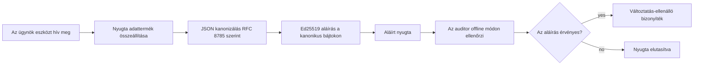
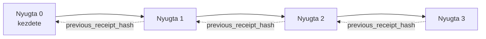

[Nézze meg az óravideót: AI ügynökök védelme kriptográfiai bizonylatokkal](https://youtu.be/PLACEHOLDER_VIDEO_ID)

> _(Az óravideót és a bélyegképet a Microsoft tartalomcsapata adja hozzá az összefésülés után, az 14/15. lecke mintájának megfelelően.)_

# AI ügynökök védelme kriptográfiai bizonylatokkal

## Bevezetés

Ez az óra a következő témákat fogja érinteni:

- Miért fontosak az audit nyomvonalak az AI ügynökök számára megfelelőség, hibakeresés és bizalom szempontjából.
- Mi az a kriptográfiai bizonylat, és miben különbözik egy aláíratlan naplóbejegyzéstől.
- Hogyan készítsünk aláírt bizonylatot egy ügynök eszközhívásáról egyszerű Pythonban.
- Hogyan ellenőrizzünk bizonylatot offline, és hogyan észleljük a manipulációt.
- Hogyan láncoljunk össze bizonylatokat úgy, hogy egy eltávolítás vagy átrendezés megszakítsa a láncot.
- Mit bizonyítanak a bizonylatok, és mit kifejezetten nem bizonyítanak.

## Tanulási célok

Az óra elvégzése után tudni fogja, hogyan:

- Azonosítsa azokat a hibamódokat, amelyek az ügynök műveleteinek kriptográfiai eredetének motivációját adják.
- Készítsen Ed25519 aláírt bizonylatot egy kanonikus JSON adatcsomag felett.
- Ellenőrizzen egy bizonylatot önállóan, csak az aláíró nyilvános kulcsát használva.
- Észlelje a manipulációt úgy, hogy újra lefuttatja az ellenőrzést egy módosított bizonylaton.
- Hozzon létre hash-láncolt bizonylat-szekvenciát, és magyarázza el, miért fontos a lánc.
- Ismerje fel a határt, hogy mit bizonyítanak a bizonylatok (hozzárendelés, integritás, sorrendiség), és mit nem (a művelet helyessége, a szabályzat helyessége).

## A probléma: Az ügynöke audit nyomvonala

Képzelje el, hogy telepített egy AI ügynököt a Contoso Travel számára. Az ügynök olvassa az ügyfél kéréseit, meghív egy járatok API-t az opciók lekérdezéséhez, és lefoglal helyeket az ügyfél nevében. Az előző negyedévben az ügynök 50 000 foglalást dolgozott fel.

Ma megérkezik egy auditor. Egy egyszerű kérdést tesz fel: "Mutassa meg, mit csinált az ügynöke."

Átadja a naplófájlokat. Az auditor megnézi azokat, majd egy nehezebb kérdést tesz fel: "Honnan tudom, hogy ezeket a naplókat nem szerkesztették?"

Ez az audit nyomvonali probléma. A mai ügynök telepítések többsége a következőkre támaszkodik:

- **Alkalmazásnaplók**: maguk az ügynökök írják, szerkeszthető bármely fájlrendszer-hozzáféréssel rendelkező személy által.
- **Felhőalapú naplózási szolgáltatások**: a platform szintjén manipulációt jelző, de csak akkor, ha az auditor megbízik a platform üzemeltetőjében.
- **Adatbázis tranzakciós naplók**: jól használhatók adatbázis-változásokhoz, de nem tetszőleges eszközhívásokhoz.

Ezek egyike sem tud választ adni az auditor kérdésére anélkül, hogy az auditor valakiben megbízzon (Önben, a felhőszolgáltatóban vagy az adatbázis szállítójában). Belső használatra ez az elfogadható megbízhatóság gyakran elegendő. Szabályozott munkafolyamatokhoz (pénzügy, egészségügy, minden, amire az EU AI irányelv vonatkozik) nem az.

A kriptográfiai bizonylatok ezt úgy oldják meg, hogy minden egyes ügynöki művelet függetlenül ellenőrizhetővé válik. Az auditor nem Önben bízik meg, csak a nyilvános kulcsban és magában a bizonylatban.

## Mi az a kriptográfiai bizonylat?

Egy bizonylat egy JSON objektum, amely rögzíti, mit tett az ügynök, digitális aláírással ellátva.


```mermaid
flowchart LR
    A[Az ügynök eszközt hív meg] --> B[Nyugta adattermék összeállítása]
    B --> C[JSON kanonizálás RFC 8785 szerint]
    C --> E[Ed25519 aláírás a kanonikus bájtokon]
    E --> F[Aláírt nyugta]
    F --> G[Az auditor offline módon ellenőrzi]
    G --> H{Az aláírás érvényes?}
    H -- yes --> I[Változtatás-ellenálló bizonyíték]
    H -- no --> J[Nyugta elutasítva]
```

Egy minimális bizonylat így néz ki:

```json
{
  "type": "agent.tool_call.v1",
  "agent_id": "contoso-travel-bot",
  "tool_name": "lookup_flights",
  "tool_args_hash": "sha256:a3f9c1...",
  "result_hash": "sha256:7b2e1d...",
  "policy_id": "contoso-travel-policy-v3",
  "timestamp": "2026-04-25T14:30:00Z",
  "sequence": 47,
  "previous_receipt_hash": "sha256:9d4e6a...",
  "signature": {
    "alg": "EdDSA",
    "sig": "c5af83...",
    "public_key": "8f3b2c..."
  }
}
```

Három tulajdonság végzi a munkát:

1. **Az aláírás**. A bizonylatot az ügynök átjárója írja alá Ed25519 privát kulccsal. Bárki, aki rendelkezik a megfelelő nyilvános kulccsal, offline ellenőrizheti az aláírást. A mezők bármilyen manipulációja érvénytelenné teszi az aláírást.

2. **Kanonikus kódolás**. Aláírás előtt a bizonylatot a JSON Canonicalization Scheme (JCS, RFC 8785) szerint szerializálják. Ez biztosítja, hogy két implementáció, amely ugyanazt az értelmi bizonylatot állítja elő, bájtazonos outputot generáljon. Kanonikalizáció nélkül különböző JSON szerializálók eltérő aláírásokat állítanának elő azonos tartalomhoz.

3. **Hash-láncolás**. A `previous_receipt_hash` mező összekapcsolja minden bizonylatot az előzővel. Egy bizonylat eltávolítása vagy átrendezése megszakítja az utána következő minden bizonylatot. A manipuláció a láncnál is láthatóvá válik, még ha az egyedi aláírásokat meg is kerülik.

Ezek a tulajdonságok három garanciát nyújtanak:

- **Hozzárendelés**: ez a kulcs írta alá ezt a tartalmat.
- **Integritás**: a tartalom nem változott az aláírás óta.
- **Sorrendiség**: ez a bizonylat az után a bizonylat után keletkezett a láncban.

## Bizonylat készítése Pythonban

Nincs szükség külön könyvtárra a bizonylat készítéséhez. A kriptográfiai primitívek széles körben elérhetők, és a logika néhány tucat sor Python.

A gyakorlati gyakorlatok a `code_samples/18-signed-receipts.ipynb` fájlban lépésről lépésre végigvezetik a teljes folyamatot. A rövid összefoglaló:

```python
import json
import hashlib
import base64
from nacl import signing
from jcs import canonicalize  # RFC 8785 kanonikus JSON

def b64url_nopad(data: bytes) -> str:
    return base64.urlsafe_b64encode(data).decode("ascii").rstrip("=")

def sha256_canonical(obj) -> str:
    """SHA-256 of a Python object's JCS-canonical JSON form."""
    return f"sha256:{hashlib.sha256(canonicalize(obj)).hexdigest()}"

# Aláíró kulcs generálása vagy betöltése (éles környezetben tárolja kulcstárban)
signing_key = signing.SigningKey.generate()
verify_key = signing_key.verify_key

# A blokk nyugtázási tartalom összeállítása (még nincs aláírás)
tool_args = {"origin": "SYD", "destination": "LAX"}
tool_result = [{"flight": "QF11", "price": 1850, "stops": 0}]

payload = {
    "type": "agent.tool_call.v1",
    "agent_id": "contoso-travel-bot",
    "tool_name": "lookup_flights",
    "tool_args_hash": sha256_canonical(tool_args),
    "result_hash": sha256_canonical(tool_result),
    "policy_id": "contoso-travel-policy-v3",
    "timestamp": "2026-04-25T14:30:00Z",
    "sequence": 0,
    "previous_receipt_hash": None,
}

# A JCS bájtokat kanonizálja és aláírja közvetlenül. A PureEdDSA belsőleg hashel.
canonical_bytes = canonicalize(payload)
signature_bytes = signing_key.sign(canonical_bytes).signature

# Struktúrált aláírási objektum csatolása.
receipt = {
    **payload,
    "signature": {
        "alg": "EdDSA",
        "sig": b64url_nopad(signature_bytes),
        "public_key": b64url_nopad(bytes(verify_key)),
    },
}
```

Ez a teljes aláírási folyamat. A jegyzetfüzet lépésenként végigvezeti minden részét.

## Bizonylat ellenőrzése és manipuláció észlelése

Az ellenőrzés az ellentétes művelet:

```python
import base64
import hashlib
from nacl import signing
from nacl.exceptions import BadSignatureError
from jcs import canonicalize

def b64url_decode(s: str) -> bytes:
    padding = "=" * ((4 - len(s) % 4) % 4)
    return base64.urlsafe_b64decode(s + padding)

def verify_receipt(receipt: dict) -> bool:
    # Az aláírás egy strukturált objektum: {"alg", "sig", "public_key"}.
    sig_obj = receipt.get("signature")
    if not sig_obj or sig_obj.get("alg") != "EdDSA":
        return False

    # Állítsuk vissza a ténylegesen aláírt tartalmat (minden, az aláírást kivéve).
    payload = {k: v for k, v in receipt.items() if k != "signature"}

    canonical_bytes = canonicalize(payload)

    try:
        verify_key = signing.VerifyKey(b64url_decode(sig_obj["public_key"]))
        verify_key.verify(canonical_bytes, b64url_decode(sig_obj["sig"]))
        return True
    except BadSignatureError:
        return False
```

Ez a függvény kap egy bizonylatot, és `True`-t ad vissza, ha az aláírás érvényes, ellenkező esetben `False`-t. Nincs hálózati hívás, nincs szolgáltatásfüggőség, nem szükséges megbízni harmadik félben.

A manipuláció észlelésének megtekintéséhez a jegyzetfüzet bemutatja:

1. Érvényes bizonylat készítése és ellenőrzésének megerősítése.
2. Egy bájt megváltoztatása a `tool_args_hash` mezőben.
3. Az ellenőrzés újrafuttatása és az ellenőrzés sikertelenségének megfigyelése.

Ez a gyakorlati bemutató, hogy a bizonylatok manipulációt láthatóvá tesznek: bármilyen módosítás, akár kicsi is, megszakítja az aláírást.

## Bizonylatok láncolása több lépéses ügynökök esetén

Egyetlen aláírt bizonylat egy műveletet véd. A bizonylatok láncolata egy szekvenciát véd.


```mermaid
flowchart LR
    R0[Nyugta 0<br/>kezdete] --> R1[Nyugta 1]
    R1 --> R2[Nyugta 2]
    R2 --> R3[Nyugta 3]
    R1 -. previous_receipt_hash .-> R0
    R2 -. previous_receipt_hash .-> R1
    R3 -. previous_receipt_hash .-> R2
```

Minden bizonylat rögzíti az előző bizonylat hash-ét. Egy támadó ahhoz, hogy a 2. bizonylatot csendben eltávolítsa, vagy:

- Megváltoztatja a 3. bizonylat `previous_receipt_hash` mezőjét (ezzel megszakad a 3. bizonylat aláírása), VAGY
- Új aláírást hamisít egy módosított 3. bizonylaton (ez az ügynök privát kulcsát igényli).

Ha a privát kulcs hardveres kulcstárolóban van, és közzéteszi a nyilvános kulcsot minden bizonylattal, egyik támadás sem kivitelezhető észrevétel nélkül.

A jegyzetfüzet bemutatja:

1. Három bizonylat láncolatának létrehozása.
2. Annak ellenőrzése, hogy minden bizonylat `previous_receipt_hash` megegyezik az előző bizonylat valódi hash-ével.
3. Egy bizonylat manipulálása a lánc közepén, és a lánc pontosan ott megszakad.

Így készíthet audit nyomvonalat, amelyet egy külső auditor ellenőrizhet anélkül, hogy Önben bíznia kellene.

## Mit bizonyítanak a bizonylatok (és mit nem)

Ez a lecke legfontosabb része. A bizonylatok erőteljesek, de korlátok között.

**A bizonylatok három dolgot bizonyítanak:**

1. **Hozzárendelés**: egy adott kulcs aláírt egy adott feldolgozandó tartalmat.
2. **Integritás**: a tartalom nem változott az aláírás óta.
3. **Sorrendiség**: ez a bizonylat a hash láncban az után keletkezett.

**A bizonylatok NEM bizonyítanak:**

1. **Helyesség**: hogy az ügynök művelete helyes volt. Egy bizonylat ugyanúgy aláírható hibás válaszra is, mint helyesre.
2. **Szabályzati megfelelőség**: hogy a `policy_id`-ban hivatkozott szabályzatot ténylegesen alkalmazták-e, vagy hogy engedélyezte volna-e ezt a műveletet, ha ellenőrizték volna. A bizonylat azt rögzíti, amit állítottak, nem azt, amit végrehajtottak.
3. **Személyazonosság a kulcson túl**: a bizonylat csak annyit mond, "ez a kulcs írta alá ezt a tartalmat." Nem mondja azt, hogy "ez az ember engedélyezte ezt." Egy kulcs személyhez vagy szervezethez kötése külön identitás infrastruktúrát igényel (pl. címtár, nyilvános kulcs regiszter).
4. **A bemenetek valóságtartalma**: ha az ügynök manipulált parancsot kap, és annak alapján cselekszik, a bizonylat hűen rögzíti a műveletet. A bizonylatok a bemeneti ellenőrzés után, nem helyettesei annak.

Ez a határvonal két okból fontos:

- Megmutatja, mire jók a bizonylatok: az ügynöki viselkedés auditálható és manipulációt jelzővé tétele, még szervezeti határokon át is.
- Megmutatja, milyen további rétegekre van még szükség: bemeneti ellenőrzés (6. lecke), szabályzat érvényesítés (röviden később), identitás infrastruktúra (nem része ennek az órának).

Gyakori tévedés azt hinni, hogy "van bizonylatunk" azt jelenti, hogy "megfelelünk." Ez nem igaz. A bizonylatok alapot adnak. A szabályozás az a rendszer, amelyet erre építünk.

## Bizonyítása, hogy egy ember jóváhagyta az adott műveletet

A fenti 3. pont megérdemel egy külön szakaszt: egy művelet bizonylat azt mondja, "ez a kulcs írta alá ezt a tartalmat," sosem azt, hogy "egy ember engedélyezte ezt." Magas kockázatú műveleteknél (visszatérítések, törlések, átutalások) a szabályozási keretrendszerek egyre inkább kifejezetten ezt a hiányzó igazolást követelik meg, amely előállítható ugyanazokkal az eszközökkel, amelyeket ebben a leckében már használt.

A folytató jegyzetfüzet, a `code_samples/human-authorization-receipts.ipynb` egy második típusú bizonylatot, a `human.approval.v1`-et ad hozzá, amely ugyanabban a boríték formában van, mint a lecke bizonylatai (tipizált csomag, amelyet Ed25519 ír alá kanonikus JCS bájtokon, az aláírás objektum a bájtokon kívül). Egy névvel ellátott jóváhagyó írja alá a **teljes kanonikus műveletet és annak hash-ét** a végrehajtás előtt; az ügynök műveleti bizonylata hordozza a **ugyanazt a műveleti hash-t** és egy `parent_approval_ref`-et, a jóváhagyás bizonylatának `receipt_hash`-ét, ugyanazzal a konvencióval, mint a láncban az előző bizonylat hash-e, `previous_receipt_hash`. Egy `verify_chain` mindkét artefaktumot ellenőrzi **külön állított kulcsnyilvántartások alatt** (jóváhagyó kulcsok vs ügynök kulcsok), így a kódút közös, de a hatóságok soha nem.

A tulajdonság, amelyet így kapunk, gondosan megfogalmazva: *az ember jóváhagyta ezt az adott műveletet, és az ügynök pontosan ezt az engedélyezett műveletet hajtotta végre.* A jegyzetfüzet elutasítási eset tesztjei teszik megalapozottá ezt a tulajdonságot:

- a klasszikus esetek: manipuláció, összezavart ügynök, újrajátszás, hamisított kulcsok mindkét oldalon, rossz formátumú bemenet;
- **lejárt hatóság**: olyan aláírás, amely még ellenőrizhető, de elutasításra kerül, mert a szabályzat verziója változott, a jóváhagyó kulcsot eltávolították a nyilvántartásból, vagy a jóváhagyás lejárt a végrehajtás előtt;
- **hash helyettesítés**: egy érvényesen aláírt műveleti bizonylat, amely valódi jóváhagyásra mutat, de az egy másik kanonikus művelethez kötődik.

Minden hiba elutasítással jár, egyedi okkal, így az auditor meg tudja különböztetni, hogy lejárt-e a hatóság, vagy változott-e a végrehajtott művelet. A jegyzetfüzet által tanított szabály: egy aláírt jóváhagyás nem hatóság önmagában. A hatóság csak akkor áll fenn, ha mindkét bizonylat ugyanahhoz a kanonikus művelethez kötött a végrehajtás idején. Az emberi jóváhagyás bizonylata oktatási kompozíció, amelyet ez az óra definiál, nem a `draft-farley-acta-signed-receipts` által definiált bizonylattípus.

## Gyártási hivatkozások

Ennek az órának a Python kódja szándékosan minimális, hogy minden sort elolvashasson és pontosan értse, mi történik. Éles környezetben két lehetősége van:

1. **Közvetlenül a kriptográfiai primitívekre építkezik.** A fent látott 50 sor sok esetben elegendő. A PyNaCl (Ed25519) és a `jcs` csomag (kanonikus JSON) jól karbantartott és auditált könyvtárak.

2. **Használ egy éles bizonylat könyvtárat.** Több nyílt forráskódú projekt valósítja meg ugyanazt a mintát további funkciókkal (kulcscsere, tömeges ellenőrzés, JWK készlet terjesztés, integráció a szabályzat motorokkal):
   - Az aláírási folyamat az IETF független internetes tervezetének (Internet-Draft) JCS és aláírási hatókör konvencióit használja ([`draft-farley-acta-signed-receipts`](https://datatracker.ietf.org/doc/draft-farley-acta-signed-receipts/), 02. revízió). A lecke lapos oktató bizonylata különbözik a tervezet `{payload, signature}` borítékától és nem konform megvalósításként jelenik meg. A tervezet közzétesz egy megosztott konformancia csomagot ([agent-governance-testvectors](https://github.com/ScopeBlind/agent-governance-testvectors)) a formátum célzott megvalósításaihoz.
   - A Microsoft Agent Governance Toolkit a bizonylatokat Cedar-alapú szabályzati döntésekkel összefűzi; az ehhez kapcsolódó 33. oktatóanyagban látható egy végponttól végpontig példa.
   - A `protect-mcp` (npm) és `@veritasacta/verify` (npm) csomagok Node-alapú megvalósítást kínálnak bizonylat aláíráshoz és offline ellenőrzéshez, céljuk MCP szerverek tamper-evidens audit nyomvonalának becsomagolása, beleértve egy tárgyalt co-sign (együtt aláírás) folyamatot is, ahol egy szüneteltetett művelet jóváhagyási bizonylatot bocsát ki, amely a műveleti hash-hez kötött (desktop folyamatban WebAuthn-támogatással), ugyanaz a jóváhagyási bizonylat minta, mint az emberi jóváhagyás jegyzetfüzetben.
   - A **[nobulex](https://github.com/arian-gogani/nobulex)** Python SDK (`pip install nobulex`) ugyanazt az Ed25519 + JCS aláírási mintát nyújtja Pythonban LangChain és CrewAI integrációkkal, publikált keresztezési tesztvektorokkal és megfelelés térképezéssel, amelyet a [OWASP PR #2210](https://github.com/OWASP/CheatSheetSeries/pull/2210) járult hozzá.

Az, hogy sajátot készít vagy könyvtárat használ, hasonló döntés, mint JWT könyvtár esetén: mindkettő ésszerű; a könyvtár időt spórol és csökkenti az audit felületet; a nulláról építkezés arra kényszerít, hogy minden primitívát megértsen. Ez az óra az alapoktól induló utat tanítja, hogy mindkét választás alapját ismerje.

## Tudásellenőrzés

Tesztelje megértését, mielőtt a gyakorlati feladathoz lép.

**1. Egy bizonylatot az ügynök Ed25519 privát kulcsával írnak alá. Az auditor csak a nyilvános kulccsal rendelkezik. Tudja az auditor offline ellenőrizni a bizonylatot?**

<details>
<summary>Válasz</summary>

Igen. Az Ed25519 ellenőrzéshez csak a nyilvános kulcs és az aláírt bájtok szükségesek. Nincs hálózati hívás, nincs szolgáltatásfüggőség. Ez az a tulajdonság, amely hasznossá teszi a bizonylatokat légmentesen leválasztott, több szervezetet átfogó vagy alacsony bizalmi audit környezetben.
</details>

**2. Egy támadó módosítja a bizonylat `policy_id` mezőjét, azt állítva, hogy egy engedékenyebb szabályzat irányította. Az aláírás a eredeti adatokon alapult. Mi történik az ellenőrzés során?**

<details>
<summary>Válasz</summary>


Az ellenőrzés sikertelen. Az aláírás az eredeti adathordozó kanonikus bájtjain alapult; bármely mező módosítása megváltoztatja azokat a bájtokat, ami az aláírás érvénytelenségét eredményezi. A támadónak szüksége lenne a privát kulcsra, hogy új érvényes aláírást készítsen, amit azonban nem birtokol.
</details>

**3. Miért tartalmaz a blokk `tool_args_hash` és `result_hash` mezőket a nyers argumentumok és eredmény helyett?**

<details>
<summary>Válasz</summary>

Két ok miatt. Először is, szükség lehet arra, hogy a blokkot archiválják vagy továbbítsák olyan környezetben, ahol a nyers tartalom (személyes adatok, üzleti adatok) kiszivárgása problémát okoz. A hash-elés kicsiben tartja a blokkot és védi a tartalmat; az auditornak elegendő ellenőriznie, hogy a hash megfelel egy külön tárolt másolatnak. Másodszor, a hashek fix méretűek; a hash-eket tartalmazó blokk mérete korlátos, függetlenül attól, hogy az inputok vagy outputok milyen nagyok voltak.
</details>

**4. A `previous_receipt_hash` mező minden blokkot az elődjéhez köt. Ha egy támadó csendben töröl egy blokkot egy lánc közepéről, mi lesz érvénytelen?**

<details>
<summary>Válasz</summary>

Minden blokk, amely a törölt blokk után következik. Az ő `previous_receipt_hash` mezőik már nem illeszkednek a tényleges lánchoz (mert a hivatkozott blokk már nem létezik, vagy a lánc más elődöt mutat). A törlés elrejtéséhez a támadónak újra kellene írnia és aláírnia minden későbbi blokkot, amihez a privát kulcs szükséges.
</details>

**5. Egy blokk tisztán ellenőrzött. Vajon ez bizonyítja, hogy az ügynök művelete helyes, megalapozott vagy megfelel a szabályzatnak?**

<details>
<summary>Válasz</summary>

Nem. Egy érvényes blokk három dolgot igazol: hozzárendelhetőséget (ez a kulcs írta alá ezt a tartalmat), sértetlenséget (a tartalom nem változott), és sorrendet (ez a blokk az adott blokk után érkezett). Nem bizonyítja, hogy a művelet helyes volt, hogy a `policy_id`-ban nevezett szabályzatot valóban kiértékelték, vagy hogy az ügynök betartotta az összes szabályt. A blokkok az ügynök viselkedését vizsgálhatóvá teszik, de nem feltétlenül helyessé. Ez a leckében a legfontosabb határvonal.
</details>

## Gyakorlati feladat

Nyissa meg a `code_samples/18-signed-receipts.ipynb` fájlt és fejezze be a négy részt:

1. **1. rész**: Írja alá az első blokkot és ellenőrizze.
2. **2. rész**: Manipulálja a blokkot és figyelje meg az ellenőrzés kudarcát.
3. **3. rész**: Építsen egy három blokkos láncot és ellenőrizze a lánc épségét.
4. **4. rész**: Alkalmazza mintaként egy Microsoft Agent Framework-kel épített ügynöknél: csomagolja eszközhívást blokk-aláírásba, majd külön ellenőrizze a blokkot.

**Haladó feladat 1:** Bővítse a blokk sémáját egy saját választott mezővel (például nyomkövetési kérésazonosítóval), frissítse a kanonikus aláírási logikát, hogy ezt is tartalmazza, és győződjön meg róla, hogy a blokk továbbra is helyesen ellenőrződik. Ezután módosítsa a mezőt aláírás után, és győződjön meg róla, hogy az ellenőrzés megbukik. Ez arra készteti, hogy megértse, hogyan járul hozzá a kanonikus kódolás minden bájtja az aláíráshoz.

**Haladó feladat 2:** Készítsen SHA-256-at két blokkjára együttesen (kanonikus bájtjaikat determinisztikus sorrendben összefűzve), majd ágyazza be a keletkezett digest-et egy harmadik blokk új mezőjeként aláírás előtt. Ellenőrizze, hogy mindhárom blokk továbbra is helyesen ellenőrződik. Ezzel egy egylépéses befogadási bizonyítékot épített: aki a harmadik blokkot birtokolja, igazolhatja, hogy az első kettő létezett az aláírás időpontjában anélkül, hogy azok tartalmát felfedné. Ez az a minta, amelyet a kiválasztó közzétételi blokkok nagy léptékben használnak (Merkle-elköteleződések, RFC 6962).

## Összefoglalás

A kriptográfiai blokkok olyan audit nyomot adnak az AI ügynököknek, amely:

- **Függetlenül ellenőrizhető:** bármely fél, aki birtokolja a nyilvános kulcsot, ellenőrizheti, nincs szolgáltatásfüggőség.
- **Hamisítás-biztos:** minden módosítás érvényteleníti az aláírást.
- **Hordozható:** egy blokk egy kis JSON fájl; archiválható, továbbítható és bármikor ellenőrizhető.
- **Szabványkövető:** Ed25519 (RFC 8032), JCS (RFC 8785), és SHA-256 alapú, mind széles körben elterjedt primitívek.

Nem helyettesítik a bemeneti ellenőrzést, szabályzatvégrehajtást vagy identitásinfrastruktúrát. Ezek ezek alapját képezik. Amikor ügynököket telepít szabályozott környezetbe, több szervezetes munkafolyamatokba vagy bármilyen olyan helyzetbe, ahol a jövőbeni auditor nem feltételezhetően bízik önben, a blokkok teszik az audit nyomot őszintévé.

A legfontosabb tanulság: a blokkok bizonyítják, ki, mit, mikor mondott. Nem bizonyítják, hogy az elmondott igaz vagy helyes volt. Ezt a különbséget szorosan tartsa szem előtt. Ez a különbség egy becsületes eredettörténeti rendszer és egy megtévesztő között.

## Éles üzem checklist

Amikor készen áll arra, hogy a leckéből továbblépve éles környezetben telepítsen blokk-aláírásos ügynököket:

- [ ] **Mozgassa el az aláíró kulcsot a fejlesztői laptopról.** Használjon Azure Key Vault-ot, AWS KMS-t vagy hardveres biztonsági modult. Az aláíró privát kulcs soha nem kerülhet forráskód-tárba vagy alkalmazásgépen törtszövegként.
- [ ] **Tegye közzé az ellenőrzési nyilvános kulcsot.** Az auditoroknak offline ellenőrzéshez szükségük van erre. A szabványos minta egy JWK készlet egy jól ismert URL-en (RFC 7517), pl. `https://your-org.example.com/.well-known/agent-keys.json`.
- [ ] **Horgonyozza le a láncot külsőleg.** Időszakosan írja a legfrissebb láncfej hash-ét egy átláthatósági naplóba (Sigstore Rekor, RFC 3161 időbélyegző hatóság vagy egy második belső rendszer) hogy egy külső fél igazolhassa, hogy "ez a lánc létezett ezen az időponton."
- [ ] **Tárolja a blokkokat változtathatatlanul.** Csak hozzáfűzős tárhely (Azure Storageimmutabilitás-politikákkal, AWS S3 Object Lock) megakadályoz egy belső támadót, hogy átírja a történelmet a tárolási rétegben.
- [ ] **Döntse el a megőrzési időt.** Sok megfelelőségi szabály többéves megőrzést ír elő. Tervezze a blokkok növekedését (egy blokk ~500 bájt; egy ügynök napi 10K hívással évente kb. 1,8 GB-ot generál).
- [ ] **Dokumentálja, mit nem fednek a blokkok.** A blokkok bizonyítják a hozzárendelhetőséget, sértetlenséget és sorrendet. A futtatási könyvben világosan sorolja fel, hogy milyen további kontrollok (bemeneti ellenőrzés, szabályzati végrehajtás, sebességkorlátozás, identitásinfrastruktúra) működnek a blokkok mellett az irányítási keretében.

### Van még kérdése az AI ügynökök biztonságáról?

Csatlakozzon a [Microsoft Foundry Discord](https://aka.ms/ai-agents/discord) közösséghez, találkozzon más tanulókkal, vegyen részt hivatalos fogadóórákon, és kapja meg AI ügynökök kérdéseire a válaszokat.

## A lecke utáni fejlesztések

Ez a lecke egyetlen blokk aláírását és hash láncolt sorozatokat mutat be. Ugyanazok a primitívek számos fejlettebb mintává állnak össze, amelyekkel találkozhat, ahogy irányítási környezete fejlődik:

- **Szelektív közzététel.** Amikor egy blokk mezői független elkötelezettséggel rendelkeznek (RFC 6962-stílusú Merkle-fa), bizonyos mezőket külön auditoroknak is felfedhet és igazolhatja, hogy a többi nem változott anélkül, hogy nyilvánosságra hozná azokat. Hasznos, ha ugyanaz a blokk egy átfogó auditnak (mely teljességet akar) és adatminimalizálási szabályozásoknak, mint a GDPR (mely a lehető legkevesebbet akarja mutatni az auditor számára) is meg kell feleljen.
- **Blokk visszavonás.** Ha egy aláíró kulcs kompromittálódik, szükséges mód az összes ezzel az aláíró kulccsal aláírt blokk megbízhatatlannak jelölésére a visszavonástól kezdve. Szabványos minták: rövid életű aláíró kulcsok plusz közzétett visszavonási lista, vagy egy átláthatósági napló visszavonási bejegyzésekkel.
- **Kétoldalú / megosztott aláírású blokkok.** Egyes megvalósítások az aláírt adatot kettéosztják elő-végrehajtási (`authorization_*`) és utó-végrehajtási (`result_*`) részekre független aláírásokkal, ami hasznos, ha az engedélyezési döntést és az észlelt eredményt külön szereplők vagy időpontok állítják elő. Ez összerakható a leckében tanult blokk formátumra.
- **Adathordozó összeállítás.** Egy blokk lezárja azokat a bájtokat, amelyeket `result_hash`-ban ad meg. A valós adatok gyakran gazdagabbak, mint egyetlen eszközhívás eredménye: döntés előtti gondolkodás (modell-előrejelzés, fontolóra vett opciók, bizonyíték és annak teljessége, kockázati helyzet, elszámoltathatósági lánc, döntő kapu eredmény) mind beleférnek az adathordozóba, amelyet egy blokk zár le. Ez minimalizálja a blokk formátumát, miközben az adatsémák egyes területek szerint fejlődhetnek.
- **Több implementáció közötti összhang.** Több független megvalósítás ugyanabba a blokk formátumba (Python, TypeScript, Rust, Go) keresztellenőrződik a közös tesztvektorokkal. Ha saját maga valósítja meg, a nyilvános vektorokkal való validáció megerősíti a kompatibilitást.
- **Post-kvantum átállás.** Az Ed25519 ma széles körben használatos, de nem kvantumbiztos. A blokk formátum algoritmus-ügyes: a `signature.alg` mező tartalmazhatja az `ML-DSA-65`-öt (a NIST poszt-kvantum aláírási szabványát), amikor szükséges az átállás. Tervezzen átmeneti időszakot, amikor a blokkok két aláírással rendelkeznek.

## További források

- <a href="https://datatracker.ietf.org/doc/draft-farley-acta-signed-receipts/" target="_blank">IETF Internet-javaslat: Gépek közötti hozzáférés-vezérlés aláírt döntési blokkokkal</a>
- <a href="https://learn.microsoft.com/azure/ai-studio/responsible-use-of-ai-overview" target="_blank">Felelős AI áttekintés (Azure AI)</a>
- <a href="https://datatracker.ietf.org/doc/html/rfc8032" target="_blank">RFC 8032: Edwards-görbe digitális aláírási algoritmus (EdDSA)</a>
- <a href="https://datatracker.ietf.org/doc/html/rfc8785" target="_blank">RFC 8785: JSON kanonizálási séma (JCS)</a>
- <a href="https://datatracker.ietf.org/doc/html/rfc6962" target="_blank">RFC 6962: Tanúsítvány Átláthatóság</a> (Merkle-fa szerkezet alkalmazva szelektív közzétételi blokkokban)
- <a href="https://github.com/microsoft/agent-governance-toolkit/blob/main/docs/tutorials/33-offline-verifiable-receipts.md" target="_blank">Microsoft Agent Governance Toolkit, 33. oktatóanyag: Offline ellenőrizhető döntési blokkok</a>
- <a href="https://github.com/ScopeBlind/agent-governance-testvectors" target="_blank">Implementációk közötti összhang tesztvektorok</a> a tanult blokk formátumhoz (Apache-2.0)
- <a href="https://pynacl.readthedocs.io/" target="_blank">PyNaCl dokumentáció</a> (Ed25519 Pythonban)

## Előző lecke

[Helyi AI ügynökök létrehozása](../17-creating-local-ai-agents/README.md)

---

<!-- CO-OP TRANSLATOR DISCLAIMER START -->
**Jogi nyilatkozat**:
Ez a dokumentum az AI fordítási szolgáltatás, a [Co-op Translator](https://github.com/Azure/co-op-translator) segítségével készült. Bár az pontosságra törekszünk, kérjük, vegye figyelembe, hogy az automatikus fordítások hibákat vagy pontatlanságokat tartalmazhatnak. Az eredeti dokumentum az anyanyelvén tekintendő hiteles forrásnak. Fontos információk esetén professzionális emberi fordítást javasolunk. Nem vállalunk felelősséget semmilyen félreértésért vagy téves értelmezésért, amely ebből a fordításból ered.
<!-- CO-OP TRANSLATOR DISCLAIMER END -->