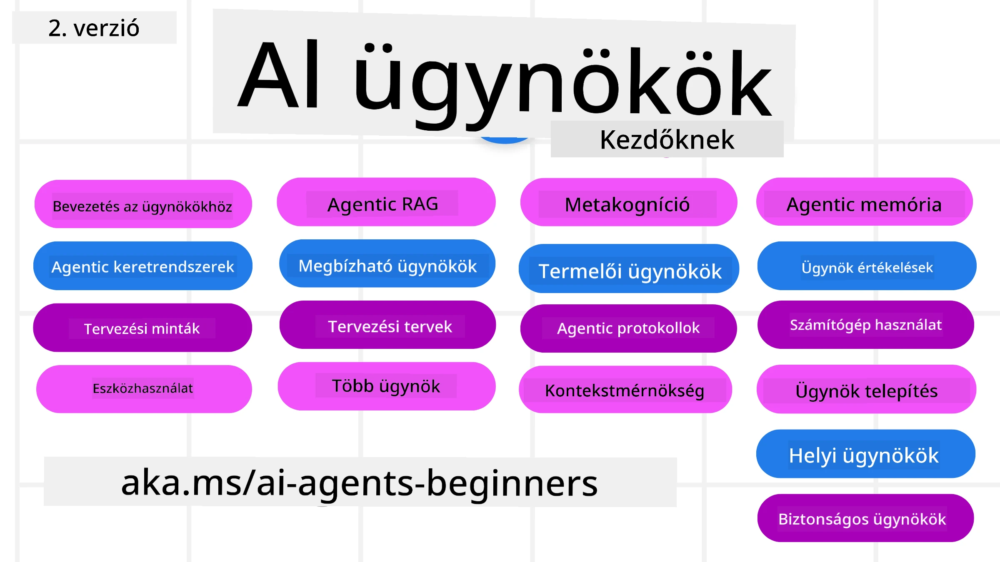

# AI ügynökök kezdőknek - Egy tanfolyam



## Egy tanfolyam, amely mindent megtanít, amit az AI ügynökök építésének megkezdéséhez tudni kell

[](https://github.com/microsoft/ai-agents-for-beginners/blob/master/LICENSE?WT.mc_id=academic-105485-koreyst)
[](https://GitHub.com/microsoft/ai-agents-for-beginners/graphs/contributors/?WT.mc_id=academic-105485-koreyst)
[](https://GitHub.com/microsoft/ai-agents-for-beginners/issues/?WT.mc_id=academic-105485-koreyst)
[](https://GitHub.com/microsoft/ai-agents-for-beginners/pulls/?WT.mc_id=academic-105485-koreyst)
[](http://makeapullrequest.com?WT.mc_id=academic-105485-koreyst)

### 🌐 Többnyelvű támogatás

#### GitHub Akcióval támogatott (Automatizált és Mindig Naprakész)

<!-- CO-OP TRANSLATOR LANGUAGES TABLE START -->
[Arab](../ar/README.md) | [Bengáli](../bn/README.md) | [Bolgár](../bg/README.md) | [Burmai (Mianmar)](../my/README.md) | [Kína (egyszerűsített)](../zh-CN/README.md) | [Kína (hagyományos, Hongkong)](../zh-HK/README.md) | [Kína (hagyományos, Makaó)](../zh-MO/README.md) | [Kína (hagyományos, Tajvan)](../zh-TW/README.md) | [Horvát](../hr/README.md) | [Cseh](../cs/README.md) | [Dán](../da/README.md) | [Holland](../nl/README.md) | [Észt](../et/README.md) | [Finn](../fi/README.md) | [Francia](../fr/README.md) | [Német](../de/README.md) | [Görög](../el/README.md) | [Héber](../he/README.md) | [Hindi](../hi/README.md) | [Magyar](./README.md) | [Indonéz](../id/README.md) | [Olasz](../it/README.md) | [Japán](../ja/README.md) | [Kannada](../kn/README.md) | [Khmer](../km/README.md) | [Koreai](../ko/README.md) | [Litván](../lt/README.md) | [Maláj](../ms/README.md) | [Malayalam](../ml/README.md) | [Marathi](../mr/README.md) | [Nepáli](../ne/README.md) | [Nigériai pidgin](../pcm/README.md) | [Norvég](../no/README.md) | [Perzsa (Fárszi)](../fa/README.md) | [Lengyel](../pl/README.md) | [Portugál (Brazília)](../pt-BR/README.md) | [Portugál (Portugália)](../pt-PT/README.md) | [Pandzsábi (Gurmukhi)](../pa/README.md) | [Román](../ro/README.md) | [Orosz](../ru/README.md) | [Szerb (cirill)](../sr/README.md) | [Szlovák](../sk/README.md) | [Szlovén](../sl/README.md) | [Spanyol](../es/README.md) | [Szuahéli](../sw/README.md) | [Svéd](../sv/README.md) | [Tagalog (Filippínó)](../tl/README.md) | [Tamil](../ta/README.md) | [Telugu](../te/README.md) | [Thai](../th/README.md) | [Török](../tr/README.md) | [Ukrán](../uk/README.md) | [Urdu](../ur/README.md) | [Vietnami](../vi/README.md)

> **Szeretnéd helyben klónozni?**
>
> Ez a tárhely több mint 50 nyelvi fordítást tartalmaz, ami jelentősen megnöveli a letöltési méretet. Ha fordítások nélkül szeretnéd klónozni, használj sparse checkout-ot:
>
> **Bash / macOS / Linux:**
> ```bash
> git clone --filter=blob:none --sparse https://github.com/microsoft/ai-agents-for-beginners.git
> cd ai-agents-for-beginners
> git sparse-checkout set --no-cone '/*' '!translations' '!translated_images'
> ```
>
> **CMD (Windows):**
> ```cmd
> git clone --filter=blob:none --sparse https://github.com/microsoft/ai-agents-for-beginners.git
> cd ai-agents-for-beginners
> git sparse-checkout set --no-cone "/*" "!translations" "!translated_images"
> ```
>
> Ez mindent megad hozzá, hogy a kurzust gyorsabb letöltéssel be tudd fejezni.
<!-- CO-OP TRANSLATOR LANGUAGES TABLE END -->

**Ha további fordítási nyelveket szeretnél támogatni, azok itt találhatók [itt](https://github.com/Azure/co-op-translator/blob/main/getting_started/supported-languages.md).**

[](https://GitHub.com/microsoft/ai-agents-for-beginners/watchers/?WT.mc_id=academic-105485-koreyst)
[](https://GitHub.com/microsoft/ai-agents-for-beginners/network/?WT.mc_id=academic-105485-koreyst)
[](https://GitHub.com/microsoft/ai-agents-for-beginners/stargazers/?WT.mc_id=academic-105485-koreyst)

[](https://discord.gg/nTYy5BXMWG)


## 🌱 Kezdés

Ez a tanfolyam olyan leckéket tartalmaz, amelyek az AI ügynökök építésének alapjait fedik le. Minden lecke a saját témáját tárgyalja, szóval kezdj bárhol, ahol szeretnél!

Ehhez a tanfolyamhoz többnyelvű támogatás is elérhető. Nézd meg [elérhető nyelvjeinket itt](#-multi-language-support).

Ha most építesz először Generatív AI modellekkel, nézd meg a [Generatív AI kezdőknek](https://aka.ms/genai-beginners) tanfolyamunkat, amely 21 leckét tartalmaz a GenAI építésről.

Ne felejtsd el [csillagozni (🌟) ezt a tárhelyet](https://docs.github.com/en/get-started/exploring-projects-on-github/saving-repositories-with-stars?WT.mc_id=academic-105485-koreyst) és [forkolni ezt a tárhelyet](https://github.com/microsoft/ai-agents-for-beginners/fork), hogy futtatni tudd a kódot.

### Találkozz más tanulókkal, kapd meg a kérdéseidre a válaszokat

Ha elakadsz, vagy kérdésed van az AI ügynökök építésével kapcsolatban, csatlakozz a dedikált Discord csatornánkhoz a [Microsoft Foundry Discordban](https://aka.ms/ai-agents/discord).

### Amit szükséged van

A kurzus minden leckéje tartalmaz kód példákat, amelyek a code_samples mappában találhatók. [Forkold ezt a tárhelyet](https://github.com/microsoft/ai-agents-for-beginners/fork), hogy létrehozd a saját példányodat.

Ezek a kód példák a Microsoft Agent Frameworköt használják az Azure AI Foundry Agent Service V2-vel:

- [Microsoft Foundry](https://aka.ms/ai-agents-beginners/ai-foundry) - Azure fiók szükséges

Ez a tanfolyam a Microsoft következő AI ügynök keretrendszereit és szolgáltatásait használja:

- [Microsoft Agent Framework (MAF)](https://aka.ms/ai-agents-beginners/agent-framework)
- [Azure AI Foundry Agent Service V2](https://aka.ms/ai-agents-beginners/ai-agent-service)

Néhány kód példa támogat alternatív, OpenAI-kompatibilis szolgáltatókat is, mint például a [MiniMax](https://platform.minimaxi.com/), amely nagy kontextusú modelleket kínál (akár 204K tokenig). A konfiguráció részleteiért lásd a [Course Setup](./00-course-setup/README.md) részt.

A tanfolyam kódjának futtatásáról további információkat a [Course Setup](./00-course-setup/README.md) oldalon találsz.

## 🙏 Szeretnél segíteni?

Van javaslatod vagy hibát találtál helyesírásban vagy kódban? [Nyiss egy issue-t](https://github.com/microsoft/ai-agents-for-beginners/issues?WT.mc_id=academic-105485-koreyst) vagy [Hozz létre egy pull requestet](https://github.com/microsoft/ai-agents-for-beginners/pulls?WT.mc_id=academic-105485-koreyst)


## 📂 Minden lecke tartalmaz

- Egy írott leckét a README-ben és egy rövid videót
- Python kód példákat a Microsoft Agent Frameworkkel és Azure AI Foundry-val
- Linkeket további erőforrásokhoz a tanulás folytatásához


## 🗃️ Leckék

| **Lecke**                                   | **Szöveg & Kód**                                   | **Videó**                                                  | **További tanulási anyagok**                                                          |
|----------------------------------------------|----------------------------------------------------|------------------------------------------------------------|----------------------------------------------------------------------------------------|
| Bevezetés az AI ügynökökbe és ügynöki használati esetek | [Link](./01-intro-to-ai-agents/README.md)          | [Videó](https://youtu.be/3zgm60bXmQk?si=z8QygFvYQv-9WtO1)  | [Link](https://aka.ms/ai-agents-beginners/collection?WT.mc_id=academic-105485-koreyst) |
| AI ügynöki keretrendszerek felfedezése       | [Link](./02-explore-agentic-frameworks/README.md)  | [Videó](https://youtu.be/ODwF-EZo_O8?si=Vawth4hzVaHv-u0H)  | [Link](https://aka.ms/ai-agents-beginners/collection?WT.mc_id=academic-105485-koreyst) |
| AI ügynöki tervezési minták megértése         | [Link](./03-agentic-design-patterns/README.md)     | [Videó](https://youtu.be/m9lM8qqoOEA?si=BIzHwzstTPL8o9GF)  | [Link](https://aka.ms/ai-agents-beginners/collection?WT.mc_id=academic-105485-koreyst) |
| Eszközhasználati tervezési minta              | [Link](./04-tool-use/README.md)                    | [Videó](https://youtu.be/vieRiPRx-gI?si=2z6O2Xu2cu_Jz46N)  | [Link](https://aka.ms/ai-agents-beginners/collection?WT.mc_id=academic-105485-koreyst) |
| Ügynöki RAG                                  | [Link](./05-agentic-rag/README.md)                 | [Videó](https://youtu.be/WcjAARvdL7I?si=gKPWsQpKiIlDH9A3)  | [Link](https://aka.ms/ai-agents-beginners/collection?WT.mc_id=academic-105485-koreyst) |
| Megbízható AI ügynökök építése               | [Link](./06-building-trustworthy-agents/README.md) | [Videó](https://youtu.be/iZKkMEGBCUQ?si=jZjpiMnGFOE9L8OK ) | [Link](https://aka.ms/ai-agents-beginners/collection?WT.mc_id=academic-105485-koreyst) |
| Tervezési minta                              | [Link](./07-planning-design/README.md)             | [Videó](https://youtu.be/kPfJ2BrBCMY?si=6SC_iv_E5-mzucnC)  | [Link](https://aka.ms/ai-agents-beginners/collection?WT.mc_id=academic-105485-koreyst) |
| Többügynökös tervezési minta                 | [Link](./08-multi-agent/README.md)                 | [Videó](https://youtu.be/V6HpE9hZEx0?si=rMgDhEu7wXo2uo6g)  | [Link](https://aka.ms/ai-agents-beginners/collection?WT.mc_id=academic-105485-koreyst) |
| Metakogníció Tervezési Minta                 | [Link](./09-metacognition/README.md)               | [Videó](https://youtu.be/His9R6gw6Ec?si=8gck6vvdSNCt6OcF)  | [Link](https://aka.ms/ai-agents-beginners/collection?WT.mc_id=academic-105485-koreyst) |
| AI Ügynökök a Termelésben                      | [Link](./10-ai-agents-production/README.md)        | [Videó](https://youtu.be/l4TP6IyJxmQ?si=31dnhexRo6yLRJDl)  | [Link](https://aka.ms/ai-agents-beginners/collection?WT.mc_id=academic-105485-koreyst) |
| Ügynöki Protokollok Használata (MCP, A2A és NLWeb) | [Link](./11-agentic-protocols/README.md)           | [Videó](https://youtu.be/X-Dh9R3Opn8)                                 | [Link](https://aka.ms/ai-agents-beginners/collection?WT.mc_id=academic-105485-koreyst) |
| Kontextus Tervezés AI Ügynökök Számára            | [Link](./12-context-engineering/README.md)         | [Videó](https://youtu.be/F5zqRV7gEag)                                 | [Link](https://aka.ms/ai-agents-beginners/collection?WT.mc_id=academic-105485-koreyst) |
| Ügynöki Memória Kezelése                      | [Link](./13-agent-memory/README.md)     |      [Videó](https://youtu.be/QrYbHesIxpw?si=vZkVwKrQ4ieCcIPx)                                                      |                                                                                        |
| A Microsoft Ügynök Keretrendszer Felfedezése                         | [Link](./14-microsoft-agent-framework/README.md)                            |                                                            |                                                                                        |
| Számítógép-használó Ügynökök (CUA) Építése           | [Link](./15-browser-use/README.md)     |                                                            | [Link](https://docs.browser-use.com/examples/templates/playwright-integration)         |
| Méretezhető Ügynökök Telepítése                    | Hamarosan érkezik                            |                                                            |                                                                                        |
| Lokális AI Ügynökök Létrehozása                     | Hamarosan érkezik                               |                                                            |                                                                                        |
| AI Ügynökök Biztonságossá Tétele                           | [Link](./18-securing-ai-agents/README.md)  |                                                            | [Link](https://aka.ms/ai-agents-beginners/collection?WT.mc_id=academic-105485-koreyst) |

## 🎒 Egyéb Tanfolyamok

Csapatunk más tanfolyamokat is készít! Nézd meg:

<!-- CO-OP TRANSLATOR OTHER COURSES START -->
### LangChain
[](https://aka.ms/langchain4j-for-beginners)
[](https://aka.ms/langchainjs-for-beginners?WT.mc_id=m365-94501-dwahlin)
[](https://github.com/microsoft/langchain-for-beginners?WT.mc_id=m365-94501-dwahlin)
---

### Azure / Edge / MCP / Ügynökök
[](https://github.com/microsoft/AZD-for-beginners?WT.mc_id=academic-105485-koreyst)
[](https://github.com/microsoft/edgeai-for-beginners?WT.mc_id=academic-105485-koreyst)
[](https://github.com/microsoft/mcp-for-beginners?WT.mc_id=academic-105485-koreyst)
[](https://github.com/microsoft/ai-agents-for-beginners?WT.mc_id=academic-105485-koreyst)

---
 
### Generatív AI Sorozat
[](https://github.com/microsoft/generative-ai-for-beginners?WT.mc_id=academic-105485-koreyst)
[-9333EA?style=for-the-badge&labelColor=E5E7EB&color=9333EA)](https://github.com/microsoft/Generative-AI-for-beginners-dotnet?WT.mc_id=academic-105485-koreyst)
[-C084FC?style=for-the-badge&labelColor=E5E7EB&color=C084FC)](https://github.com/microsoft/generative-ai-for-beginners-java?WT.mc_id=academic-105485-koreyst)
[-E879F9?style=for-the-badge&labelColor=E5E7EB&color=E879F9)](https://github.com/microsoft/generative-ai-with-javascript?WT.mc_id=academic-105485-koreyst)

---
 
### Alapozó Tanulás
[](https://aka.ms/ml-beginners?WT.mc_id=academic-105485-koreyst)
[](https://aka.ms/datascience-beginners?WT.mc_id=academic-105485-koreyst)
[](https://aka.ms/ai-beginners?WT.mc_id=academic-105485-koreyst)
[](https://github.com/microsoft/Security-101?WT.mc_id=academic-96948-sayoung)
[](https://aka.ms/webdev-beginners?WT.mc_id=academic-105485-koreyst)
[](https://aka.ms/iot-beginners?WT.mc_id=academic-105485-koreyst)
[](https://github.com/microsoft/xr-development-for-beginners?WT.mc_id=academic-105485-koreyst)

---
 
### Copilot Sorozat
[](https://aka.ms/GitHubCopilotAI?WT.mc_id=academic-105485-koreyst)
[](https://github.com/microsoft/mastering-github-copilot-for-dotnet-csharp-developers?WT.mc_id=academic-105485-koreyst)
[](https://github.com/microsoft/CopilotAdventures?WT.mc_id=academic-105485-koreyst)
<!-- CO-OP TRANSLATOR OTHER COURSES END -->

## 🌟 Közösségi Köszönet

Köszönet [Shivam Goyal](https://www.linkedin.com/in/shivam2003/) részére, aki fontos kódmintákat járult hozzá az Ügynöki RAG bemutatásához.

## Hozzájárulás

Ez a projekt szívesen fogad hozzájárulásokat és javaslatokat. A legtöbb hozzájáruláshoz el kell fogadnod egy
Hozzájárulói Licencmegállapodást (CLA), amely kimondja, hogy jogosult vagy arra, és ténylegesen megadod nekünk
a hozzájárulásod használati jogait. Részletekért lásd: <https://cla.opensource.microsoft.com>.

Amikor pull requestet küldesz, egy CLA bot automatikusan megállapítja, hogy szükséges-e CLA-t nyújtanod be,
és ennek megfelelően jelöli meg a PR-t (pl. állapotellenőrzés, komment). Egyszerűen kövesd a bot által adott utasításokat.
Ezt csak egyszer kell megtenned minden, a CLA-t használó repóban.

Ez a projekt átvette a [Microsoft Nyílt Forráskódú Magatartási Kódexét](https://opensource.microsoft.com/codeofconduct/).
További információkért lásd a [Magatartási Kódex GYIK-et](https://opensource.microsoft.com/codeofconduct/faq/) vagy
írj az [opencode@microsoft.com](mailto:opencode@microsoft.com) címre bármilyen kérdéssel vagy észrevétellel.

## Védjegyek

Ez a projekt tartalmazhat projektek, termékek vagy szolgáltatások védjegyeit vagy logóit. A Microsoft
védjegyek vagy logók jogosult használata az alábbiak szerinti feltételekhez kötött, és azokat követni kell:
[A Microsoft Védjegy- és Márkavezetési Irányelvei](https://www.microsoft.com/legal/intellectualproperty/trademarks/usage/general).
A Microsoft védjegyek vagy logók módosított verziókban történő használata nem okozhat félreértést és nem sugallhat Microsoft támogatást.
Harmadik fél védjegyeinek vagy logóinak bármilyen használata a harmadik fél szabályzatainak alá tartozik.

## Segítségkérés


Ha elakadsz vagy kérdésed van AI alkalmazások fejlesztésével kapcsolatban, csatlakozz:

[](https://aka.ms/foundry/discord)

Ha termékvisszajelzésed vagy hibák vannak fejlesztés közben, keresd fel:

[](https://aka.ms/foundry/forum)

---

<!-- CO-OP TRANSLATOR DISCLAIMER START -->
**Jogi nyilatkozat**:
Ez a dokumentum az AI fordítási szolgáltatás, a [Co-op Translator](https://github.com/Azure/co-op-translator) segítségével készült. Bár az pontosságra törekszünk, kérjük, vegye figyelembe, hogy az automatikus fordítások hibákat vagy pontatlanságokat tartalmazhatnak. Az eredeti dokumentum az anyanyelvén tekintendő hiteles forrásnak. Fontos információk esetén professzionális emberi fordítást javasolunk. Nem vállalunk felelősséget semmilyen félreértésért vagy téves értelmezésért, amely ebből a fordításból ered.
<!-- CO-OP TRANSLATOR DISCLAIMER END -->