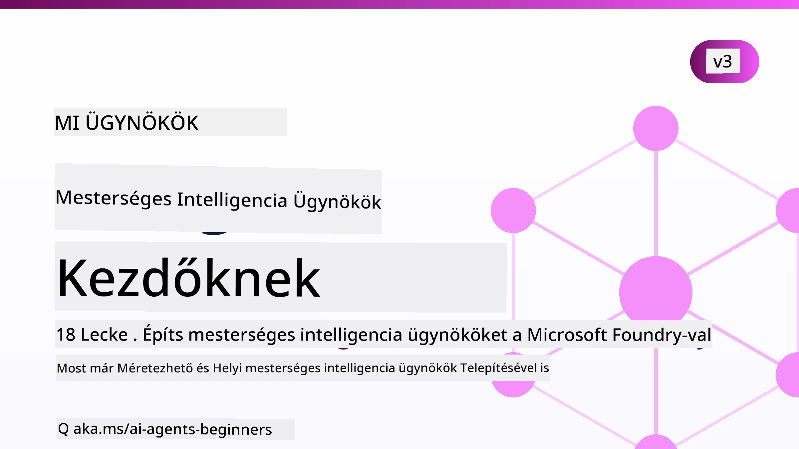

# AI ügynökök kezdőknek - Egy tanfolyam



## Egy tanfolyam, amely mindent megtanít, amire szükséged van az AI ügynökök építésének megkezdéséhez

[](https://github.com/microsoft/ai-agents-for-beginners/blob/master/LICENSE?WT.mc_id=academic-105485-koreyst)
[](https://GitHub.com/microsoft/ai-agents-for-beginners/graphs/contributors/?WT.mc_id=academic-105485-koreyst)
[](https://GitHub.com/microsoft/ai-agents-for-beginners/issues/?WT.mc_id=academic-105485-koreyst)
[](https://GitHub.com/microsoft/ai-agents-for-beginners/pulls/?WT.mc_id=academic-105485-koreyst)
[](http://makeapullrequest.com?WT.mc_id=academic-105485-koreyst)

### 🌐 Többnyelvű támogatás

#### GitHub Action által támogatott (automatikus és mindig naprakész)

<!-- CO-OP TRANSLATOR LANGUAGES TABLE START -->
[Arabic](../ar/README.md) | [Bengali](../bn/README.md) | [Bulgarian](../bg/README.md) | [Burmese (Myanmar)](../my/README.md) | [Chinese (Simplified)](../zh-CN/README.md) | [Chinese (Traditional, Hong Kong)](../zh-HK/README.md) | [Chinese (Traditional, Macau)](../zh-MO/README.md) | [Chinese (Traditional, Taiwan)](../zh-TW/README.md) | [Croatian](../hr/README.md) | [Czech](../cs/README.md) | [Danish](../da/README.md) | [Dutch](../nl/README.md) | [Estonian](../et/README.md) | [Finnish](../fi/README.md) | [French](../fr/README.md) | [German](../de/README.md) | [Greek](../el/README.md) | [Hebrew](../he/README.md) | [Hindi](../hi/README.md) | [Hungarian](./README.md) | [Indonesian](../id/README.md) | [Italian](../it/README.md) | [Japanese](../ja/README.md) | [Kannada](../kn/README.md) | [Khmer](../km/README.md) | [Korean](../ko/README.md) | [Lithuanian](../lt/README.md) | [Malay](../ms/README.md) | [Malayalam](../ml/README.md) | [Marathi](../mr/README.md) | [Nepali](../ne/README.md) | [Nigerian Pidgin](../pcm/README.md) | [Norwegian](../no/README.md) | [Persian (Farsi)](../fa/README.md) | [Polish](../pl/README.md) | [Portuguese (Brazil)](../pt-BR/README.md) | [Portuguese (Portugal)](../pt-PT/README.md) | [Punjabi (Gurmukhi)](../pa/README.md) | [Romanian](../ro/README.md) | [Russian](../ru/README.md) | [Serbian (Cyrillic)](../sr/README.md) | [Slovak](../sk/README.md) | [Slovenian](../sl/README.md) | [Spanish](../es/README.md) | [Swahili](../sw/README.md) | [Swedish](../sv/README.md) | [Tagalog (Filipino)](../tl/README.md) | [Tamil](../ta/README.md) | [Telugu](../te/README.md) | [Thai](../th/README.md) | [Turkish](../tr/README.md) | [Ukrainian](../uk/README.md) | [Urdu](../ur/README.md) | [Vietnamese](../vi/README.md)

> **Inkább helyben klónoznád?**
>
> Ez a tároló több mint 50 nyelvi fordítást tartalmaz, ami jelentősen megnöveli a letöltési méretet. Ha fordítások nélkül szeretnéd klónozni, használd a sparse checkout-ot:
>
> **Bash / macOS / Linux:**
> ```bash
> git clone --filter=blob:none --sparse https://github.com/microsoft/ai-agents-for-beginners.git
> cd ai-agents-for-beginners
> git sparse-checkout set --no-cone '/*' '!translations' '!translated_images'
> ```
>
> **CMD (Windows):**
> ```cmd
> git clone --filter=blob:none --sparse https://github.com/microsoft/ai-agents-for-beginners.git
> cd ai-agents-for-beginners
> git sparse-checkout set --no-cone "/*" "!translations" "!translated_images"
> ```
>
> Ez mindent megad, amire szükséged van a tanfolyam elvégzéséhez, sokkal gyorsabb letöltéssel.
<!-- CO-OP TRANSLATOR LANGUAGES TABLE END -->

**Ha további fordítási nyelveket szeretnél támogatni, azok itt találhatók [itt](https://github.com/Azure/co-op-translator/blob/main/getting_started/supported-languages.md).**

[](https://GitHub.com/microsoft/ai-agents-for-beginners/watchers/?WT.mc_id=academic-105485-koreyst)
[](https://GitHub.com/microsoft/ai-agents-for-beginners/network/?WT.mc_id=academic-105485-koreyst)
[](https://GitHub.com/microsoft/ai-agents-for-beginners/stargazers/?WT.mc_id=academic-105485-koreyst)

[](https://discord.com/invite/ATgtXmAS5D)


## 🌱 Kezdjünk neki

Ez a tanfolyam leckéket tartalmaz, amelyek az AI ügynökök építésének alapjait fedik le. Minden lecke önálló témával foglalkozik, szóval kezdj bárhol, ahol szeretnéd!

Többnyelvű támogatás van ehhez a tanfolyamhoz. Nézd meg az elérhető nyelveket [itt](#-multi-language-support).

Ha most először építesz generatív AI modellekkel, nézd meg a [Generative AI For Beginners](https://aka.ms/genai-beginners) tanfolyamunkat, amely 21 leckét tartalmaz a GenAI-vel való építésről.

Ne felejtsd el [csillagozni (🌟) ezt a repót](https://docs.github.com/en/get-started/exploring-projects-on-github/saving-repositories-with-stars?WT.mc_id=academic-105485-koreyst) és [forkolni ezt a repót](https://github.com/microsoft/ai-agents-for-beginners/fork) a kód futtatásához.

### Találkozz más tanulókkal, kapj választ a kérdéseidre

Ha elakadnál vagy kérdéseid lennének az AI ügynökök építésével kapcsolatban, csatlakozz a dedikált Discord csatornánkhoz a [Microsoft Foundry Discord](https://aka.ms/ai-agents/discord) szerveren.

### Amire szükséged lesz

Minden lecke tartalmaz kódpéldákat, amelyeket a code_samples mappában találsz. [Forkold ezt a repót](https://github.com/microsoft/ai-agents-for-beginners/fork) saját másolat létrehozásához.

Ezek a kódpéldák a Microsoft Agent Frameworköt és a Microsoft Foundry Agent Service V2-t használják:

- [Microsoft Foundry](https://aka.ms/ai-agents-beginners/ai-foundry) - Azure fiók szükséges

Ez a tanfolyam a Microsoft következő AI ügynök keretrendszereit és szolgáltatásait használja:

- [Microsoft Agent Framework (MAF)](https://learn.microsoft.com/agent-framework/overview/)
- [Microsoft Foundry Agent Service V2](https://aka.ms/ai-agents-beginners/ai-agent-service)

Egyes kódpéldák alternatív OpenAI-kompatibilis szolgáltatókat is támogatnak, mint például a [MiniMax](https://platform.minimaxi.com/), amely nagy kontextusú modelleket kínál (akár 204K tokenig). A beállítás részleteiért lásd a [Course Setup](./00-course-setup/README.md) részt.

A tanfolyam kódjának futtatásával kapcsolatos további információkért látogass el a [Course Setup](./00-course-setup/README.md) oldalra.

## 🙏 Szeretnél segíteni?

Van javaslatod, vagy találtál helyesírási vagy kódbeli hibákat? [Nyiss egy hibajegyet](https://github.com/microsoft/ai-agents-for-beginners/issues?WT.mc_id=academic-105485-koreyst) vagy [Hozz létre egy pull requestet](https://github.com/microsoft/ai-agents-for-beginners/pulls?WT.mc_id=academic-105485-koreyst)


## 📂 Minden lecke tartalmaz

- Egy írott leckét a README-ben és egy rövid videót
- Python kódpéldákat, amelyek a Microsoft Agent Frameworköt és a Microsoft Foundry-t használják
- Linkeket további erőforrásokhoz a tanulás folytatásához


## 🗃️ Leckék

| **Lecke**                                   | **Szöveg & Kód**                                    | **Videó**                                                  | **További tanulás**                                                                     |
|----------------------------------------------|----------------------------------------------------|------------------------------------------------------------|----------------------------------------------------------------------------------------|
| Bevezetés az AI ügynökökbe és ügynök felhasználási esetek | [Link](./01-intro-to-ai-agents/README.md)          | [Videó](https://youtu.be/3zgm60bXmQk?si=z8QygFvYQv-9WtO1)  | [Link](https://aka.ms/ai-agents-beginners/collection?WT.mc_id=academic-105485-koreyst) |
| AI Ügynök Keretrendszerek felfedezése              | [Link](./02-explore-agentic-frameworks/README.md)  | [Videó](https://youtu.be/ODwF-EZo_O8?si=Vawth4hzVaHv-u0H)  | [Link](https://aka.ms/ai-agents-beginners/collection?WT.mc_id=academic-105485-koreyst) |
| Az AI Ügynöki Tervezési Minták megértése             | [Link](./03-agentic-design-patterns/README.md)     | [Videó](https://youtu.be/m9lM8qqoOEA?si=BIzHwzstTPL8o9GF)  | [Link](https://aka.ms/ai-agents-beginners/collection?WT.mc_id=academic-105485-koreyst) |
| Eszközhasználati Tervezési Minta                      | [Link](./04-tool-use/README.md)                    | [Videó](https://youtu.be/vieRiPRx-gI?si=2z6O2Xu2cu_Jz46N)  | [Link](https://aka.ms/ai-agents-beginners/collection?WT.mc_id=academic-105485-koreyst) |
| Ügynöki RAG                                    | [Link](./05-agentic-rag/README.md)                 | [Videó](https://youtu.be/WcjAARvdL7I?si=gKPWsQpKiIlDH9A3)  | [Link](https://aka.ms/ai-agents-beginners/collection?WT.mc_id=academic-105485-koreyst) |
| Megbízható AI Ügynökök építése                    | [Link](./06-building-trustworthy-agents/README.md) | [Videó](https://youtu.be/iZKkMEGBCUQ?si=jZjpiMnGFOE9L8OK ) | [Link](https://aka.ms/ai-agents-beginners/collection?WT.mc_id=academic-105485-koreyst) |
| Tervezési Minta                               | [Link](./07-planning-design/README.md)             | [Videó](https://youtu.be/kPfJ2BrBCMY?si=6SC_iv_E5-mzucnC)  | [Link](https://aka.ms/ai-agents-beginners/collection?WT.mc_id=academic-105485-koreyst) |
| Többügynökös Tervezési Minta                      | [Link](./08-multi-agent/README.md)                 | [Videó](https://youtu.be/V6HpE9hZEx0?si=rMgDhEu7wXo2uo6g)  | [Link](https://aka.ms/ai-agents-beginners/collection?WT.mc_id=academic-105485-koreyst) |

| Metakogníció Tervezési Minta                 | [Link](./09-metacognition/README.md)               | [Videó](https://youtu.be/His9R6gw6Ec?si=8gck6vvdSNCt6OcF)  | [Link](https://aka.ms/ai-agents-beginners/collection?WT.mc_id=academic-105485-koreyst) |
| AI Ügynökök Termelésben                       | [Link](./10-ai-agents-production/README.md)        | [Videó](https://youtu.be/l4TP6IyJxmQ?si=31dnhexRo6yLRJDl)  | [Link](https://aka.ms/ai-agents-beginners/collection?WT.mc_id=academic-105485-koreyst) |
| Ügynöki Protokollok Használata (MCP, A2A és NLWeb) | [Link](./11-agentic-protocols/README.md)           | [Videó](https://youtu.be/X-Dh9R3Opn8)                                 | [Link](https://aka.ms/ai-agents-beginners/collection?WT.mc_id=academic-105485-koreyst) |
| Kontextus Mérnökség AI Ügynökök számára        | [Link](./12-context-engineering/README.md)         | [Videó](https://youtu.be/F5zqRV7gEag)                                 | [Link](https://aka.ms/ai-agents-beginners/collection?WT.mc_id=academic-105485-koreyst) |
| Ügynöki Emlékezet Kezelése                    | [Link](./13-agent-memory/README.md)     |      [Videó](https://youtu.be/QrYbHesIxpw?si=vZkVwKrQ4ieCcIPx)                                                      |                                                                                        |
| A Microsoft Ügynök Keretrendszer Felfedezése                         | [Link](./14-microsoft-agent-framework/README.md)                            |                                                            |                                                                                        |
| Számítógép Használati Ügynökök Építése (CUA)           | [Link](./15-browser-use/README.md)     |                                                            | [Link](https://docs.browser-use.com/examples/templates/playwright-integration)         |
| Skálázható Ügynökök Kiadása                    | [Link](./16-deploying-scalable-agents/README.md) |                                                    | [Link](https://learn.microsoft.com/azure/ai-foundry/agents/overview)                   |
| Helyi AI Ügynökök Létrehozása                     | [Link](./17-creating-local-ai-agents/README.md)  |                                                    | [Link](https://learn.microsoft.com/azure/ai-foundry/foundry-local/)                    |
| AI Ügynökök Biztonságossá Tétele                           | [Link](./18-securing-ai-agents/README.md)  |                                                            | [Link](https://aka.ms/ai-agents-beginners/collection?WT.mc_id=academic-105485-koreyst) |

## 🎒 Egyéb Tanfolyamok

Csapatunk más tanfolyamokat is készít! Nézd meg:

<!-- CO-OP TRANSLATOR OTHER COURSES START -->
### LangChain
[](https://aka.ms/langchain4j-for-beginners)
[](https://aka.ms/langchainjs-for-beginners?WT.mc_id=m365-94501-dwahlin)
[](https://github.com/microsoft/langchain-for-beginners?WT.mc_id=m365-94501-dwahlin)
---

### Azure / Edge / MCP / Ügynökök
[](https://github.com/microsoft/AZD-for-beginners?WT.mc_id=academic-105485-koreyst)
[](https://github.com/microsoft/edgeai-for-beginners?WT.mc_id=academic-105485-koreyst)
[](https://github.com/microsoft/mcp-for-beginners?WT.mc_id=academic-105485-koreyst)
[](https://github.com/microsoft/ai-agents-for-beginners?WT.mc_id=academic-105485-koreyst)

---
 
### Generatív AI Sorozat
[](https://github.com/microsoft/generative-ai-for-beginners?WT.mc_id=academic-105485-koreyst)
[-9333EA?style=for-the-badge&labelColor=E5E7EB&color=9333EA)](https://github.com/microsoft/Generative-AI-for-beginners-dotnet?WT.mc_id=academic-105485-koreyst)
[-C084FC?style=for-the-badge&labelColor=E5E7EB&color=C084FC)](https://github.com/microsoft/generative-ai-for-beginners-java?WT.mc_id=academic-105485-koreyst)
[-E879F9?style=for-the-badge&labelColor=E5E7EB&color=E879F9)](https://github.com/microsoft/generative-ai-with-javascript?WT.mc_id=academic-105485-koreyst)

---
 
### Alapvető Tanulás
[](https://aka.ms/ml-beginners?WT.mc_id=academic-105485-koreyst)
[](https://aka.ms/datascience-beginners?WT.mc_id=academic-105485-koreyst)
[](https://aka.ms/ai-beginners?WT.mc_id=academic-105485-koreyst)
[](https://github.com/microsoft/Security-101?WT.mc_id=academic-96948-sayoung)
[](https://aka.ms/webdev-beginners?WT.mc_id=academic-105485-koreyst)
[](https://aka.ms/iot-beginners?WT.mc_id=academic-105485-koreyst)
[](https://github.com/microsoft/xr-development-for-beginners?WT.mc_id=academic-105485-koreyst)

---
 
### Copilot Sorozat
[](https://aka.ms/GitHubCopilotAI?WT.mc_id=academic-105485-koreyst)
[](https://github.com/microsoft/mastering-github-copilot-for-dotnet-csharp-developers?WT.mc_id=academic-105485-koreyst)
[](https://github.com/microsoft/CopilotAdventures?WT.mc_id=academic-105485-koreyst)
<!-- CO-OP TRANSLATOR OTHER COURSES END -->

## 🌟 Közösségi Köszönetnyilvánítás

Köszönet [Shivam Goyal](https://www.linkedin.com/in/shivam2003/)-nak, amiért fontos kódrészleteket adott hozzá az Agentic RAG bemutatásához.

## Hozzájárulás

Ez a projekt szívesen fogad hozzájárulásokat és javaslatokat. A legtöbb hozzájáruláshoz szükséges, hogy elfogadd a
Hozzájárulói Licenc Szerződést (CLA), amelyben kijelented, hogy jogodban áll, és ténylegesen megadod nekünk
a jogokat a hozzájárulásod használatára. Részletekért látogass el ide: <https://cla.opensource.microsoft.com>.

Amikor pull request-et nyújtasz be, egy CLA bot automatikusan megállapítja, hogy szükséges-e CLA-t biztosítanod,
és megfelelően jelöli a PR-t (pl. státuszellenőrzés, megjegyzés). Csak kövesd a bot által adott utasításokat.
Ezt csak egyszer kell megtenned az összes CLA-t használó tárhely esetén.

Ez a projekt elfogadta a [Microsoft Nyílt Forráskódú Magatartási Kódexét](https://opensource.microsoft.com/codeofconduct/).
További információért lásd a [Magatartási Kódex GYIK](https://opensource.microsoft.com/codeofconduct/faq/)-t, vagy
lépj kapcsolatba az [opencode@microsoft.com](mailto:opencode@microsoft.com) címen további kérdésekkel vagy észrevételekkel.

## Védjegyek

Ez a projekt tartalmazhat védjegyeket vagy logókat projektekről, termékekről vagy szolgáltatásokról. A Microsoft
védjegyek vagy logók jogos használata alá van rendelve, és követnie kell a
[Microsoft Védjegy- és Márkavezetési Útmutatóját](https://www.microsoft.com/legal/intellectualproperty/trademarks/usage/general).
A Microsoft védjegyek vagy logók használata a projekt módosított változataiban nem okozhat félreértést és nem sugallhatja a Microsoft szponzorálását.
Bármely harmadik fél védjegyeinek vagy logóinak használata az adott harmadik felek szabályzatai alá esik.

## Segítségkérés


Ha elakadsz vagy kérdésed van az AI alkalmazások fejlesztésével kapcsolatban, csatlakozz:

[](https://aka.ms/foundry/discord)

Ha visszajelzésed vagy hibák vannak az építés során, látogass el:

[](https://aka.ms/foundry/forum)

---

<!-- CO-OP TRANSLATOR DISCLAIMER START -->
**Jogi nyilatkozat**:
Ez a dokumentum az AI fordítási szolgáltatás, a [Co-op Translator](https://github.com/Azure/co-op-translator) segítségével készült. Bár az pontosságra törekszünk, kérjük, vegye figyelembe, hogy az automatikus fordítások hibákat vagy pontatlanságokat tartalmazhatnak. Az eredeti dokumentum az anyanyelvén tekintendő hiteles forrásnak. Fontos információk esetén professzionális emberi fordítást javasolunk. Nem vállalunk felelősséget semmilyen félreértésért vagy téves értelmezésért, amely ebből a fordításból ered.
<!-- CO-OP TRANSLATOR DISCLAIMER END -->