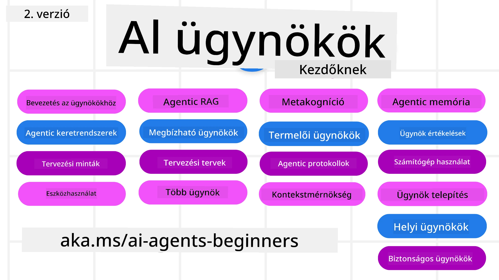

# AI Ügynökök Kezdőknek - Egy Tanfolyam



## Egy tanfolyam, amely megtanít mindent, amit az AI Ügynökök építésének megkezdéséhez tudni kell

[](https://github.com/microsoft/ai-agents-for-beginners/blob/master/LICENSE?WT.mc_id=academic-105485-koreyst)
[](https://GitHub.com/microsoft/ai-agents-for-beginners/graphs/contributors/?WT.mc_id=academic-105485-koreyst)
[](https://GitHub.com/microsoft/ai-agents-for-beginners/issues/?WT.mc_id=academic-105485-koreyst)
[](https://GitHub.com/microsoft/ai-agents-for-beginners/pulls/?WT.mc_id=academic-105485-koreyst)
[](http://makeapullrequest.com?WT.mc_id=academic-105485-koreyst)

### 🌐 Többnyelvű támogatás

#### GitHub Action által támogatott (Automatikus és Mindig naprakész)

<!-- CO-OP TRANSLATOR LANGUAGES TABLE START -->
[Arabic](../ar/README.md) | [Bengali](../bn/README.md) | [Bulgarian](../bg/README.md) | [Burmese (Myanmar)](../my/README.md) | [Chinese (Simplified)](../zh-CN/README.md) | [Chinese (Traditional, Hong Kong)](../zh-HK/README.md) | [Chinese (Traditional, Macau)](../zh-MO/README.md) | [Chinese (Traditional, Taiwan)](../zh-TW/README.md) | [Croatian](../hr/README.md) | [Czech](../cs/README.md) | [Danish](../da/README.md) | [Dutch](../nl/README.md) | [Estonian](../et/README.md) | [Finnish](../fi/README.md) | [French](../fr/README.md) | [German](../de/README.md) | [Greek](../el/README.md) | [Hebrew](../he/README.md) | [Hindi](../hi/README.md) | [Hungarian](./README.md) | [Indonesian](../id/README.md) | [Italian](../it/README.md) | [Japanese](../ja/README.md) | [Kannada](../kn/README.md) | [Khmer](../km/README.md) | [Korean](../ko/README.md) | [Lithuanian](../lt/README.md) | [Malay](../ms/README.md) | [Malayalam](../ml/README.md) | [Marathi](../mr/README.md) | [Nepali](../ne/README.md) | [Nigerian Pidgin](../pcm/README.md) | [Norwegian](../no/README.md) | [Persian (Farsi)](../fa/README.md) | [Polish](../pl/README.md) | [Portuguese (Brazil)](../pt-BR/README.md) | [Portuguese (Portugal)](../pt-PT/README.md) | [Punjabi (Gurmukhi)](../pa/README.md) | [Romanian](../ro/README.md) | [Russian](../ru/README.md) | [Serbian (Cyrillic)](../sr/README.md) | [Slovak](../sk/README.md) | [Slovenian](../sl/README.md) | [Spanish](../es/README.md) | [Swahili](../sw/README.md) | [Swedish](../sv/README.md) | [Tagalog (Filipino)](../tl/README.md) | [Tamil](../ta/README.md) | [Telugu](../te/README.md) | [Thai](../th/README.md) | [Turkish](../tr/README.md) | [Ukrainian](../uk/README.md) | [Urdu](../ur/README.md) | [Vietnamese](../vi/README.md)

> **Szeretnél helyben klónozni?**
>
> Ez a tároló több mint 50 nyelvi fordítást tartalmaz, ami jelentősen megnöveli a letöltési méretet. A fordítások nélküli klónozáshoz használj sparsa checkout-ot:
>
> **Bash / macOS / Linux:**
> ```bash
> git clone --filter=blob:none --sparse https://github.com/microsoft/ai-agents-for-beginners.git
> cd ai-agents-for-beginners
> git sparse-checkout set --no-cone '/*' '!translations' '!translated_images'
> ```
>
> **CMD (Windows):**
> ```cmd
> git clone --filter=blob:none --sparse https://github.com/microsoft/ai-agents-for-beginners.git
> cd ai-agents-for-beginners
> git sparse-checkout set --no-cone "/*" "!translations" "!translated_images"
> ```
>
> Ez mindent megad, ami a tanfolyam elvégzéséhez szükséges, sokkal gyorsabb letöltéssel.
<!-- CO-OP TRANSLATOR LANGUAGES TABLE END -->

**Ha további fordítási nyelvek támogatását szeretnéd, azok itt találhatók [itt](https://github.com/Azure/co-op-translator/blob/main/getting_started/supported-languages.md).**

[](https://GitHub.com/microsoft/ai-agents-for-beginners/watchers/?WT.mc_id=academic-105485-koreyst)
[](https://GitHub.com/microsoft/ai-agents-for-beginners/network/?WT.mc_id=academic-105485-koreyst)
[](https://GitHub.com/microsoft/ai-agents-for-beginners/stargazers/?WT.mc_id=academic-105485-koreyst)

[](https://discord.com/invite/ATgtXmAS5D)


## 🌱 Kezdd el

Ez a tanfolyam tartalmaz leckéket az AI Ügynökök építésének alapjairól. Minden lecke saját témát fed le, így ott kezdhetsz, ahol szeretnéd!

A tanfolyam többnyelvű támogatással rendelkezik. Nézd meg [a rendelkezésre álló nyelveket itt](#-multi-language-support).

Ha most építesz először Generatív AI modellekkel, nézd meg a [Generatív AI Kezdőknek](https://aka.ms/genai-beginners) tanfolyamunkat, amely 21 leckét tartalmaz a GenAI-vel való építésről.

Ne felejtsd el [csillagozni (🌟) ezt a tárolót](https://docs.github.com/en/get-started/exploring-projects-on-github/saving-repositories-with-stars?WT.mc_id=academic-105485-koreyst) és [forkolni ezt a tárolót](https://github.com/microsoft/ai-agents-for-beginners/fork), hogy futtathasd a kódot.

### Találkozz más tanulókkal, kapd meg kérdéseidre a választ

Ha elakadsz vagy kérdésed van az AI Ügynökök építésével kapcsolatban, csatlakozz dedikált Discord csatornánkhoz a [Microsoft Foundry Discordon](https://aka.ms/ai-agents/discord).

### Amire szükséged van

Minden lecke kódpéldákat tartalmaz, melyek a code_samples mappában találhatók. [Forkold ezt a tárolót](https://github.com/microsoft/ai-agents-for-beginners/fork), hogy saját példányt készíthess.

Ezek a kódpéldák a Microsoft Agent Frameworköt használják a Microsoft Foundry Agent Service V2-vel:

- [Microsoft Foundry](https://aka.ms/ai-agents-beginners/ai-foundry) - Azure-fiók szükséges

Ez a tanfolyam a Microsoft következő AI Ügynök keretrendszereit és szolgáltatásait használja:

- [Microsoft Agent Framework (MAF)](https://aka.ms/ai-agents-beginners/agent-framework)
- [Microsoft Foundry Agent Service V2](https://aka.ms/ai-agents-beginners/ai-agent-service)

Egyes kódpéldák támogatják az alternatív, OpenAI-kompatibilis szolgáltatókat, mint például a [MiniMax](https://platform.minimaxi.com/), amely nagy kontextusú modelleket kínál (akár 204K tokenig). Lásd a [Tanfolyam Beállítások](./00-course-setup/README.md) részt a konfiguráció részleteiről.

A tanfolyam kódjának futtatásáról további információért látogass el a [Tanfolyam Beállítások](./00-course-setup/README.md) oldalra.

## 🙏 Szeretnél segíteni?

Van javaslatod vagy hibát találtál helyesírásban vagy kódban? [Hibajegyet nyithatsz](https://github.com/microsoft/ai-agents-for-beginners/issues?WT.mc_id=academic-105485-koreyst) vagy [Pull request-et készíthetsz](https://github.com/microsoft/ai-agents-for-beginners/pulls?WT.mc_id=academic-105485-koreyst)


## 📂 Minden lecke tartalmazza

- Egy írott leckét a README-ben és egy rövid videót
- Python kódpéldákat, amelyek Microsoft Agent Frameworköt használnak a Microsoft Foundry-val
- Hivatkozásokat további forrásokra a tanulás folytatásához


## 🗃️ Leckék

| **Lecke**                                   | **Szöveg & Kód**                                    | **Videó**                                                  | **További tanulás**                                                                     |
|----------------------------------------------|----------------------------------------------------|------------------------------------------------------------|----------------------------------------------------------------------------------------|
| Bevezetés az AI ügynökökbe és használati esetek | [Link](./01-intro-to-ai-agents/README.md)          | [Videó](https://youtu.be/3zgm60bXmQk?si=z8QygFvYQv-9WtO1)  | [Link](https://aka.ms/ai-agents-beginners/collection?WT.mc_id=academic-105485-koreyst) |
| AI ügynöki keretrendszerek felfedezése        | [Link](./02-explore-agentic-frameworks/README.md)  | [Videó](https://youtu.be/ODwF-EZo_O8?si=Vawth4hzVaHv-u0H)  | [Link](https://aka.ms/ai-agents-beginners/collection?WT.mc_id=academic-105485-koreyst) |
| AI ügynöki tervezési minták megértése          | [Link](./03-agentic-design-patterns/README.md)     | [Videó](https://youtu.be/m9lM8qqoOEA?si=BIzHwzstTPL8o9GF)  | [Link](https://aka.ms/ai-agents-beginners/collection?WT.mc_id=academic-105485-koreyst) |
| Eszközhasználati tervezési minta                | [Link](./04-tool-use/README.md)                    | [Videó](https://youtu.be/vieRiPRx-gI?si=2z6O2Xu2cu_Jz46N)  | [Link](https://aka.ms/ai-agents-beginners/collection?WT.mc_id=academic-105485-koreyst) |
| Ügynöki RAG                                    | [Link](./05-agentic-rag/README.md)                 | [Videó](https://youtu.be/WcjAARvdL7I?si=gKPWsQpKiIlDH9A3)  | [Link](https://aka.ms/ai-agents-beginners/collection?WT.mc_id=academic-105485-koreyst) |
| Megbízható AI ügynökök építése                 | [Link](./06-building-trustworthy-agents/README.md) | [Videó](https://youtu.be/iZKkMEGBCUQ?si=jZjpiMnGFOE9L8OK ) | [Link](https://aka.ms/ai-agents-beginners/collection?WT.mc_id=academic-105485-koreyst) |
| Tervezési minta                                | [Link](./07-planning-design/README.md)             | [Videó](https://youtu.be/kPfJ2BrBCMY?si=6SC_iv_E5-mzucnC)  | [Link](https://aka.ms/ai-agents-beginners/collection?WT.mc_id=academic-105485-koreyst) |
| Többügynökös tervezési minta                   | [Link](./08-multi-agent/README.md)                 | [Videó](https://youtu.be/V6HpE9hZEx0?si=rMgDhEu7wXo2uo6g)  | [Link](https://aka.ms/ai-agents-beginners/collection?WT.mc_id=academic-105485-koreyst) |

| Metakogníció Tervezési Minta                 | [Link](./09-metacognition/README.md)               | [Videó](https://youtu.be/His9R6gw6Ec?si=8gck6vvdSNCt6OcF)  | [Link](https://aka.ms/ai-agents-beginners/collection?WT.mc_id=academic-105485-koreyst) |
| MI Ügynökök Éles Használatban                      | [Link](./10-ai-agents-production/README.md)        | [Videó](https://youtu.be/l4TP6IyJxmQ?si=31dnhexRo6yLRJDl)  | [Link](https://aka.ms/ai-agents-beginners/collection?WT.mc_id=academic-105485-koreyst) |
| Ügynöki Protokollok Használata (MCP, A2A és NLWeb) | [Link](./11-agentic-protocols/README.md)           | [Videó](https://youtu.be/X-Dh9R3Opn8)                                 | [Link](https://aka.ms/ai-agents-beginners/collection?WT.mc_id=academic-105485-koreyst) |
| Kontextus Mérnökség MI Ügynökök Számára            | [Link](./12-context-engineering/README.md)         | [Videó](https://youtu.be/F5zqRV7gEag)                                 | [Link](https://aka.ms/ai-agents-beginners/collection?WT.mc_id=academic-105485-koreyst) |
| Ügynöki Memória Kezelése                      | [Link](./13-agent-memory/README.md)     |      [Videó](https://youtu.be/QrYbHesIxpw?si=vZkVwKrQ4ieCcIPx)                                                      |                                                                                        |
| A Microsoft Agent Keretrendszer Felfedezése                         | [Link](./14-microsoft-agent-framework/README.md)                            |                                                            |                                                                                        |
| Számítógép Használati Ügynökök Építése (CUA)           | [Link](./15-browser-use/README.md)     |                                                            | [Link](https://docs.browser-use.com/examples/templates/playwright-integration)         |
| Skálázható Ügynökök Telepítése                    | Hamarosan                        |                                                            |                                                                                        |
| Helyi MI Ügynökök Létrehozása                     | Hamarosan                               |                                                            |                                                                                        |
| MI Ügynökök Biztonságossá Tétele                           | [Link](./18-securing-ai-agents/README.md)  |                                                            | [Link](https://aka.ms/ai-agents-beginners/collection?WT.mc_id=academic-105485-koreyst) |

## 🎒 Egyéb Tanfolyamok

Csapatunk más tanfolyamokat is készít! Nézze meg:

<!-- CO-OP TRANSLATOR OTHER COURSES START -->
### LangChain
[](https://aka.ms/langchain4j-for-beginners)
[](https://aka.ms/langchainjs-for-beginners?WT.mc_id=m365-94501-dwahlin)
[](https://github.com/microsoft/langchain-for-beginners?WT.mc_id=m365-94501-dwahlin)
---

### Azure / Edge / MCP / Ügynökök
[](https://github.com/microsoft/AZD-for-beginners?WT.mc_id=academic-105485-koreyst)
[](https://github.com/microsoft/edgeai-for-beginners?WT.mc_id=academic-105485-koreyst)
[](https://github.com/microsoft/mcp-for-beginners?WT.mc_id=academic-105485-koreyst)
[](https://github.com/microsoft/ai-agents-for-beginners?WT.mc_id=academic-105485-koreyst)

---
 
### Generatív MI Sorozat
[](https://github.com/microsoft/generative-ai-for-beginners?WT.mc_id=academic-105485-koreyst)
[-9333EA?style=for-the-badge&labelColor=E5E7EB&color=9333EA)](https://github.com/microsoft/Generative-AI-for-beginners-dotnet?WT.mc_id=academic-105485-koreyst)
[-C084FC?style=for-the-badge&labelColor=E5E7EB&color=C084FC)](https://github.com/microsoft/generative-ai-for-beginners-java?WT.mc_id=academic-105485-koreyst)
[-E879F9?style=for-the-badge&labelColor=E5E7EB&color=E879F9)](https://github.com/microsoft/generative-ai-with-javascript?WT.mc_id=academic-105485-koreyst)

---
 
### Alapvető Tanulás
[](https://aka.ms/ml-beginners?WT.mc_id=academic-105485-koreyst)
[](https://aka.ms/datascience-beginners?WT.mc_id=academic-105485-koreyst)
[](https://aka.ms/ai-beginners?WT.mc_id=academic-105485-koreyst)
[](https://github.com/microsoft/Security-101?WT.mc_id=academic-96948-sayoung)
[](https://aka.ms/webdev-beginners?WT.mc_id=academic-105485-koreyst)
[](https://aka.ms/iot-beginners?WT.mc_id=academic-105485-koreyst)
[](https://github.com/microsoft/xr-development-for-beginners?WT.mc_id=academic-105485-koreyst)

---
 
### Copilot Sorozat
[](https://aka.ms/GitHubCopilotAI?WT.mc_id=academic-105485-koreyst)
[](https://github.com/microsoft/mastering-github-copilot-for-dotnet-csharp-developers?WT.mc_id=academic-105485-koreyst)
[](https://github.com/microsoft/CopilotAdventures?WT.mc_id=academic-105485-koreyst)
<!-- CO-OP TRANSLATOR OTHER COURSES END -->

## 🌟 Közösségi Köszönetnyilvánítás

Köszönet [Shivam Goyal](https://www.linkedin.com/in/shivam2003/) számára az Agentic RAG fontos kódmintáit bemutató hozzájárulásért. 

## Hozzájárulás

Ez a projekt szívesen fogad hozzájárulásokat és javaslatokat. A legtöbb hozzájáruláshoz el kell fogadnia egy
Hozzájárulói Licencszerződést (CLA), amelyben kijelenti, hogy joga van, és valóban megadja a
jogokat az Ön hozzájárulásának felhasználására. Részletekért látogasson el ide: <https://cla.opensource.microsoft.com>.

Amikor pull request-et nyújt be, egy CLA bot automatikusan megállapítja, hogy szükséges-e CLA-t biztosítania,
és ennek megfelelően dekorálja a PR-t (pl. státusz ellenőrzés, komment). Egyszerűen kövesse a bot által megadott utasításokat.
Ezt csak egyszer kell megtennie az összes CLA-t használó tárolóban.

Ez a projekt elfogadta a [Microsoft Nyílt Forráskódú Magatartási Kódexét](https://opensource.microsoft.com/codeofconduct/).
További információkért lásd a [Magatartási Kódex GYIK](https://opensource.microsoft.com/codeofconduct/faq/) oldalt, vagy
vegye fel a kapcsolatot az [opencode@microsoft.com](mailto:opencode@microsoft.com) címre az esetleges kérdésekkel vagy megjegyzésekkel.

## Védjegyek

Ez a projekt tartalmazhat védjegyeket vagy logókat projektekhez, termékekhez vagy szolgáltatásokhoz. A Microsoft
védjegyek vagy logók jogosult használata alá esik, és követnie kell a
[Microsoft Védjegy és Márkavezetési Irányelveit](https://www.microsoft.com/legal/intellectualproperty/trademarks/usage/general).
A Microsoft védjegyek vagy logók használata e projekt módosított verzióiban nem okozhat félreértést, illetve nem sugallhat Microsoft-felügyeletet.
Harmadik fél védjegyeinek vagy logóinak bármilyen használata az adott harmadik fél szabályzatai alá tartozik.

## Segítségkérés


Ha elakad, vagy bármilyen kérdése van MI alkalmazások fejlesztésével kapcsolatban, csatlakozzon:

[](https://aka.ms/foundry/discord)

Ha termékbeli visszajelzése vagy hibája van fejlesztés közben, látogassa meg:

[](https://aka.ms/foundry/forum)

---

<!-- CO-OP TRANSLATOR DISCLAIMER START -->
**Jogi nyilatkozat**:
Ez a dokumentum az AI fordítási szolgáltatás, a [Co-op Translator](https://github.com/Azure/co-op-translator) segítségével készült. Bár az pontosságra törekszünk, kérjük, vegye figyelembe, hogy az automatikus fordítások hibákat vagy pontatlanságokat tartalmazhatnak. Az eredeti dokumentum az anyanyelvén tekintendő hiteles forrásnak. Fontos információk esetén professzionális emberi fordítást javasolunk. Nem vállalunk felelősséget semmilyen félreértésért vagy téves értelmezésért, amely ebből a fordításból ered.
<!-- CO-OP TRANSLATOR DISCLAIMER END -->