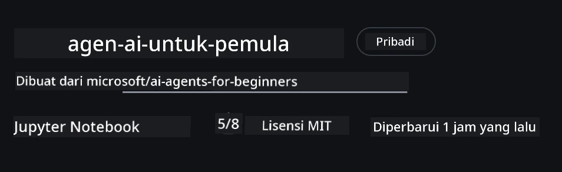

# Penyiapan Kursus

## Pengantar

Pelajaran ini akan membahas cara menjalankan contoh kode dari kursus ini.

## Bergabung dengan Pelajar Lain dan Dapatkan Bantuan

Sebelum Anda mulai meng-clone repo Anda, bergabunglah dengan [Saluran Discord AI Agents untuk Pemula](https://aka.ms/ai-agents/discord) untuk mendapatkan bantuan pengaturan, menanyakan pertanyaan tentang kursus, atau terhubung dengan pelajar lain.

## Clone atau Fork Repo ini

Untuk memulai, silakan clone atau fork Repository GitHub. Ini akan membuat versi Anda sendiri dari materi kursus sehingga Anda dapat menjalankan, menguji, dan mengubah kode!

Ini dapat dilakukan dengan mengklik tautan ke <a href="https://github.com/microsoft/ai-agents-for-beginners/fork" target="_blank">fork repositori</a>

Anda sekarang seharusnya memiliki versi fork dari kursus ini di tautan berikut:



### Shallow Clone (direkomendasikan untuk workshop / Codespaces)

  >Repositori lengkap bisa besar (~3 GB) ketika Anda mengunduh seluruh riwayat dan semua file. Jika Anda hanya menghadiri workshop atau hanya membutuhkan beberapa folder pelajaran, shallow clone (atau sparse clone) menghindari sebagian besar unduhan tersebut dengan memotong riwayat dan/atau melewati blobs.

#### Quick shallow clone — riwayat minimal, semua file

Replace `<your-username>` in the below commands with your fork URL (or the upstream URL if you prefer).

To clone only the latest commit history (small download):

```bash|powershell
git clone --depth 1 https://github.com/<your-username>/ai-agents-for-beginners.git
```

To clone a specific branch:

```bash|powershell
git clone --depth 1 --branch <branch-name> https://github.com/<your-username>/ai-agents-for-beginners.git
```

#### Partial (sparse) clone — blobs minimal + hanya folder yang dipilih

This uses partial clone and sparse-checkout (requires Git 2.25+ and recommended modern Git with partial clone support):

```bash|powershell
git clone --depth 1 --filter=blob:none --sparse https://github.com/<your-username>/ai-agents-for-beginners.git
```

Traverse into the repo folder:

```bash|powershell
cd ai-agents-for-beginners
```

Then specify which folders you want (example below shows two folders):

```bash|powershell
git sparse-checkout set 00-course-setup 01-intro-to-ai-agents
```

After cloning and verifying the files, if you only need files and want to free space (no git history), please delete the repository metadata (💀tidak dapat dikembalikan — Anda akan kehilangan semua fungsionalitas Git: tidak ada commits, pulls, pushes, atau akses riwayat).

```bash
# zsh/bash
rm -rf .git
```

```powershell
# PowerShell
Remove-Item -Recurse -Force .git
```

#### Menggunakan GitHub Codespaces (direkomendasikan untuk menghindari unduhan besar lokal)

- Buat Codespace baru untuk repo ini melalui [GitHub UI](https://github.com/codespaces).  

- Di terminal Codespace yang baru dibuat, jalankan salah satu perintah shallow/sparse clone di atas untuk membawa hanya folder pelajaran yang Anda butuhkan ke workspace Codespace.
- Opsional: setelah cloning di dalam Codespaces, hapus .git untuk merebut kembali ruang ekstra (lihat perintah penghapusan di atas).
- Catatan: Jika Anda lebih suka membuka repo langsung di Codespaces (tanpa clone tambahan), perlu diingat Codespaces akan membangun lingkungan devcontainer dan mungkin masih menyediakan lebih banyak dari yang Anda butuhkan. Meng-clone salinan shallow di dalam Codespace baru memberi Anda lebih kendali atas penggunaan disk.

#### Tips

- Selalu ganti URL clone dengan fork Anda jika Anda ingin mengedit/commit.
- Jika Anda nanti membutuhkan lebih banyak riwayat atau file, Anda dapat fetch mereka atau menyesuaikan sparse-checkout untuk memasukkan folder tambahan.

## Menjalankan Kode

Kursus ini menawarkan serangkaian Jupyter Notebooks yang dapat Anda jalankan untuk mendapatkan pengalaman praktik membangun AI Agents.

Contoh kode menggunakan **Microsoft Agent Framework (MAF)** dengan `AzureAIProjectAgentProvider`, yang terhubung ke **Azure AI Agent Service V2** (Responses API) melalui **Microsoft Foundry**.

Semua notebook Python diberi label `*-python-agent-framework.ipynb`.

## Persyaratan

- Python 3.12+
  - **CATATAN**: Jika Anda belum menginstal Python3.12, pastikan untuk menginstalnya. Kemudian buat venv Anda menggunakan python3.12 untuk memastikan versi yang benar diinstal dari file requirements.txt.
  
    >Contoh

    Buat direktori venv Python:

    ```bash|powershell
    python -m venv venv
    ```

    Kemudian aktifkan lingkungan venv untuk:

    ```bash
    # zsh/bash
    source venv/bin/activate
    ```
  
    ```dos
    # Command Prompt for Windows
    venv\Scripts\activate
    ```

- .NET 10+: Untuk contoh kode yang menggunakan .NET, pastikan Anda menginstal [.NET 10 SDK](https://dotnet.microsoft.com/download/dotnet/10.0) atau versi lebih baru. Kemudian, periksa versi .NET SDK yang terpasang:

    ```bash|powershell
    dotnet --list-sdks
    ```

- **Azure CLI** — Diperlukan untuk otentikasi. Install dari [aka.ms/installazurecli](https://aka.ms/installazurecli).
- **Azure Subscription** — Untuk akses ke Microsoft Foundry dan Azure AI Agent Service.
- **Microsoft Foundry Project** — Sebuah proyek dengan model yang dideploy (mis., `gpt-4o`). Lihat [Step 1](../../../00-course-setup) di bawah.

Kami telah menyertakan file `requirements.txt` di root repositori ini yang berisi semua paket Python yang diperlukan untuk menjalankan contoh kode.

Anda dapat menginstalnya dengan menjalankan perintah berikut di terminal Anda pada root repositori:

```bash|powershell
pip install -r requirements.txt
```

Kami menyarankan membuat environment virtual Python untuk menghindari konflik dan masalah.

## Menyiapkan VSCode

Pastikan Anda menggunakan versi Python yang tepat di VSCode.


## Menyiapkan Microsoft Foundry dan Azure AI Agent Service

### Langkah 1: Buat Proyek Microsoft Foundry

Anda memerlukan **hub** dan **project** Azure AI Foundry dengan model yang dideploy untuk menjalankan notebook.

1. Buka [ai.azure.com](https://ai.azure.com) dan masuk dengan akun Azure Anda.
2. Buat sebuah **hub** (atau gunakan yang sudah ada). Lihat: [Hub resources overview](https://learn.microsoft.com/azure/ai-foundry/concepts/ai-resources).
3. Di dalam hub, buat sebuah **project**.
4. Deploy model (mis., `gpt-4o`) dari **Models + Endpoints** → **Deploy model**.

### Langkah 2: Ambil Endpoint Proyek dan Nama Deployment Model Anda

Dari proyek Anda di portal Microsoft Foundry:

- **Project Endpoint** — Buka halaman **Overview** dan salin URL endpoint.


- **Model Deployment Name** — Buka **Models + Endpoints**, pilih model yang Anda deploy, dan catat **Deployment name** (mis., `gpt-4o`).

### Langkah 3: Masuk ke Azure dengan `az login`

Semua notebook menggunakan **`AzureCliCredential`** untuk otentikasi — tidak ada API key yang perlu dikelola. Ini mengharuskan Anda masuk melalui Azure CLI.

1. **Instal Azure CLI** jika Anda belum: [aka.ms/installazurecli](https://aka.ms/installazurecli)

2. **Masuk** dengan menjalankan:

    ```bash|powershell
    az login
    ```

    Atau jika Anda berada di lingkungan remote/Codespace tanpa browser:

    ```bash|powershell
    az login --use-device-code
    ```

3. **Pilih subscription** jika diminta — pilih yang berisi proyek Foundry Anda.

4. **Verifikasi** bahwa Anda sudah masuk:

    ```bash|powershell
    az account show
    ```

> **Mengapa `az login`?** Notebook melakukan otentikasi menggunakan `AzureCliCredential` dari paket `azure-identity`. Ini berarti sesi Azure CLI Anda menyediakan kredensial — tidak ada API key atau secret di file `.env` Anda. Ini adalah sebuah [praktik terbaik keamanan](https://learn.microsoft.com/azure/developer/ai/keyless-connections).

### Langkah 4: Buat File `.env` Anda

Salin file contoh:

```bash
# zsh/bash
cp .env.example .env
```

```powershell
# PowerShell
Copy-Item .env.example .env
```

Buka `.env` dan isi dua nilai ini:

```env
AZURE_AI_PROJECT_ENDPOINT=https://<your-project>.services.ai.azure.com/api/projects/<your-project-id>
AZURE_AI_MODEL_DEPLOYMENT_NAME=gpt-4o
```

| Variabel | Di mana menemukannya |
|----------|---------------------|
| `AZURE_AI_PROJECT_ENDPOINT` | Portal Foundry → proyek Anda → halaman **Overview** |
| `AZURE_AI_MODEL_DEPLOYMENT_NAME` | Portal Foundry → **Models + Endpoints** → nama model yang Anda deploy |

Itu saja untuk sebagian besar pelajaran! Notebook akan melakukan otentikasi secara otomatis melalui sesi `az login` Anda.

### Langkah 5: Instal Dependensi Python

```bash|powershell
pip install -r requirements.txt
```

Kami menyarankan menjalankan ini di dalam virtual environment yang Anda buat sebelumnya.

## Pengaturan Tambahan untuk Pelajaran 5 (Agentic RAG)

Pelajaran 5 menggunakan **Azure AI Search** untuk retrieval-augmented generation. Jika Anda berencana menjalankan pelajaran itu, tambahkan variabel ini ke file `.env` Anda:

| Variabel | Di mana menemukannya |
|----------|---------------------|
| `AZURE_SEARCH_SERVICE_ENDPOINT` | Portal Azure → resource **Azure AI Search** Anda → **Overview** → URL |
| `AZURE_SEARCH_API_KEY` | Portal Azure → resource **Azure AI Search** Anda → **Settings** → **Keys** → primary admin key |

## Pengaturan Tambahan untuk Pelajaran 6 dan Pelajaran 8 (GitHub Models)

Beberapa notebook di pelajaran 6 dan 8 menggunakan **GitHub Models** alih-alih Azure AI Foundry. Jika Anda berencana menjalankan contoh tersebut, tambahkan variabel ini ke file `.env` Anda:

| Variabel | Di mana menemukannya |
|----------|---------------------|
| `GITHUB_TOKEN` | GitHub → **Settings** → **Developer settings** → **Personal access tokens** |
| `GITHUB_ENDPOINT` | Gunakan `https://models.inference.ai.azure.com` (nilai default) |
| `GITHUB_MODEL_ID` | Nama model yang akan digunakan (mis., `gpt-4o-mini`) |

## Pengaturan Tambahan untuk Pelajaran 8 (Bing Grounding Workflow)

Notebook workflow kondisional di pelajaran 8 menggunakan **Bing grounding** melalui Azure AI Foundry. Jika Anda berencana menjalankan contoh itu, tambahkan variabel ini ke file `.env` Anda:

| Variabel | Di mana menemukannya |
|----------|---------------------|
| `BING_CONNECTION_ID` | Portal Azure AI Foundry → proyek Anda → **Management** → **Connected resources** → koneksi Bing Anda → salin connection ID |

## Pemecahan Masalah

### Error Verifikasi Sertifikat SSL di macOS

Jika Anda menggunakan macOS dan mengalami error seperti:

```plaintext
ssl.SSLCertVerificationError: [SSL: CERTIFICATE_VERIFY_FAILED] certificate verify failed: self-signed certificate in certificate chain
```

Ini adalah masalah yang diketahui pada Python di macOS di mana sertifikat SSL sistem tidak otomatis dipercaya. Cobalah solusi berikut secara berurutan:

**Opsi 1: Jalankan skrip Install Certificates Python (direkomendasikan)**

```bash
# Ganti 3.XX dengan versi Python yang terpasang di sistem Anda (misalnya, 3.12 atau 3.13):
/Applications/Python\ 3.XX/Install\ Certificates.command
```

**Opsi 2: Gunakan `connection_verify=False` di notebook Anda (hanya untuk notebook GitHub Models)**

Di notebook Pelajaran 6 (`06-building-trustworthy-agents/code_samples/06-system-message-framework.ipynb`), solusi sementara yang dikomentari sudah disertakan. Batalkan komentar `connection_verify=False` saat membuat client:

```python
client = ChatCompletionsClient(
    endpoint=endpoint,
    credential=AzureKeyCredential(token),
    connection_verify=False,  # Nonaktifkan verifikasi SSL jika Anda mengalami kesalahan sertifikat
)
```

> **⚠️ Peringatan:** Menonaktifkan verifikasi SSL (`connection_verify=False`) mengurangi keamanan dengan melewati validasi sertifikat. Gunakan ini hanya sebagai solusi sementara di lingkungan pengembangan, jangan pernah di produksi.

**Opsi 3: Instal dan gunakan `truststore`**

```bash
pip install truststore
```

Kemudian tambahkan hal berikut di bagian atas notebook atau skrip Anda sebelum melakukan panggilan jaringan apa pun:

```python
import truststore
truststore.inject_into_ssl()
```

## Terjebak di Tempat Mana?

Jika Anda mengalami masalah menjalankan pengaturan ini, bergabunglah ke <a href="https://discord.gg/kzRShWzttr" target="_blank">Discord Komunitas Azure AI</a> atau <a href="https://github.com/microsoft/ai-agents-for-beginners/issues?WT.mc_id=academic-105485-koreyst" target="_blank">buat sebuah issue</a>.

## Pelajaran Berikutnya

Sekarang Anda siap menjalankan kode untuk kursus ini. Semoga belajar menyenangkan dalam mengeksplorasi dunia AI Agents! 

[Pengenalan ke AI Agents dan Kasus Penggunaan Agent](../01-intro-to-ai-agents/README.md)

---

<!-- CO-OP TRANSLATOR DISCLAIMER START -->
Penafian:
Dokumen ini telah diterjemahkan menggunakan layanan terjemahan AI [Co-op Translator](https://github.com/Azure/co-op-translator). Meskipun kami berupaya untuk akurasi, harap diingat bahwa terjemahan otomatis mungkin mengandung kesalahan atau ketidakakuratan. Dokumen asli dalam bahasa aslinya harus dianggap sebagai sumber otoritatif. Untuk informasi yang kritis, disarankan menggunakan terjemahan profesional oleh penerjemah manusia. Kami tidak bertanggung jawab atas kesalahpahaman atau penafsiran yang timbul akibat penggunaan terjemahan ini.
<!-- CO-OP TRANSLATOR DISCLAIMER END -->