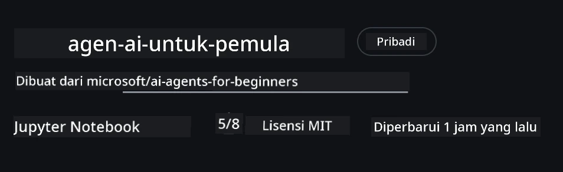
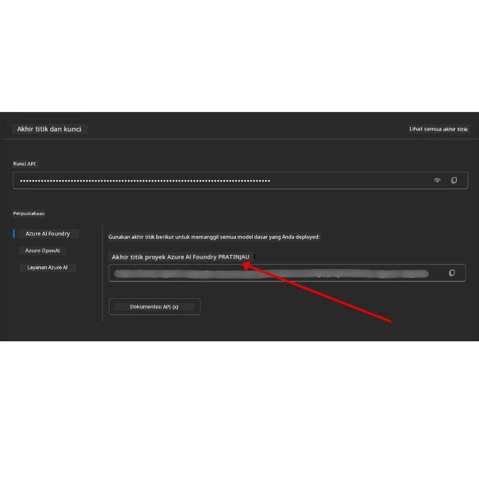

# Pengaturan Kursus

## Pendahuluan

Pelajaran ini akan membahas cara menjalankan contoh kode dari kursus ini.

## Bergabung dengan Peserta Lain dan Mendapatkan Bantuan

Sebelum Anda mulai mengkloning repo Anda, bergabunglah dengan [saluran Discord AI Agents For Beginners](https://aka.ms/ai-agents/discord) untuk mendapatkan bantuan terkait pengaturan, pertanyaan tentang kursus, atau untuk terhubung dengan peserta lain.

## Kloning atau Fork Repo ini

Untuk memulai, silakan kloning atau fork Repository GitHub. Ini akan membuat versi materi kursus Anda sendiri agar Anda dapat menjalankan, menguji, dan mengubah kode!

Ini dapat dilakukan dengan mengklik tautan ke <a href="https://github.com/microsoft/ai-agents-for-beginners/fork" target="_blank">fork repo</a>

Anda kini harus memiliki versi fork Anda sendiri dari kursus ini di tautan berikut:



### Klon Dangkal (direkomendasikan untuk workshop / Codespaces)

  >Repositori penuh bisa sangat besar (~3 GB) saat Anda mengunduh riwayat lengkap dan semua berkas. Jika Anda hanya mengikuti workshop atau hanya membutuhkan beberapa folder pelajaran, klon dangkal (atau sparse clone) menghindari sebagian besar unduhan itu dengan memotong riwayat dan/atau melewatkan blob.

#### Klon dangkal cepat — riwayat minimal, semua berkas

Gantikan `<your-username>` pada perintah di bawah dengan URL fork Anda (atau URL upstream jika Anda mau).

Untuk mengkloning hanya riwayat commit terbaru (unduhan kecil):

```bash|powershell
git clone --depth 1 https://github.com/<your-username>/ai-agents-for-beginners.git
```

Untuk mengkloning cabang tertentu:

```bash|powershell
git clone --depth 1 --branch <branch-name> https://github.com/<your-username>/ai-agents-for-beginners.git
```

#### Klon parsial (sparse) — blob minimal + hanya folder terpilih

Ini menggunakan partial clone dan sparse-checkout (memerlukan Git 2.25+ dan disarankan Git modern dengan dukungan partial clone):

```bash|powershell
git clone --depth 1 --filter=blob:none --sparse https://github.com/<your-username>/ai-agents-for-beginners.git
```

Masuk ke folder repo:

```bash|powershell
cd ai-agents-for-beginners
```

Lalu tentukan folder mana yang Anda inginkan (contoh di bawah menunjukkan dua folder):

```bash|powershell
git sparse-checkout set 00-course-setup 01-intro-to-ai-agents
```

Setelah mengkloning dan memverifikasi file, jika Anda hanya membutuhkan file dan ingin menghemat ruang (tanpa riwayat git), silakan hapus metadata repositori (💀tidak dapat dikembalikan — Anda akan kehilangan semua fungsi Git: tidak ada commit, pull, push, atau akses riwayat).

```bash
# zsh/bash
rm -rf .git
```

```powershell
# PowerShell
Remove-Item -Recurse -Force .git
```

#### Menggunakan GitHub Codespaces (direkomendasikan untuk menghindari unduhan besar lokal)

- Buat Codespace baru untuk repo ini melalui [GitHub UI](https://github.com/codespaces).  

- Di terminal codespace yang baru dibuat, jalankan salah satu perintah klon dangkal/sparse di atas untuk membawa hanya folder pelajaran yang Anda butuhkan ke ruang kerja Codespace.
- Opsional: setelah mengkloning di dalam Codespaces, hapus .git untuk menghemat ruang tambahan (lihat perintah penghapusan di atas).
- Catatan: Jika Anda lebih suka membuka repo langsung di Codespaces (tanpa klon tambahan), perhatikan Codespaces akan membangun lingkungan devcontainer dan mungkin tetap menyediakan lebih dari yang Anda butuhkan. Mengkloning salinan dangkal di dalam Codespace baru memberi Anda kontrol lebih atas penggunaan disk.

#### Tips

- Selalu ganti URL klon dengan fork Anda jika Anda ingin mengedit/commit.
- Jika Anda kemudian membutuhkan lebih banyak riwayat atau file, Anda dapat mengambilnya kembali (fetch) atau mengatur sparse-checkout untuk memasukkan folder tambahan.

## Menjalankan Kode

Kursus ini menawarkan serangkaian Jupyter Notebook yang dapat Anda jalankan untuk mendapatkan pengalaman langsung membangun AI Agents.

Contoh kode menggunakan **Microsoft Agent Framework (MAF)** dengan `FoundryChatClient`, yang terhubung ke **Microsoft Foundry Agent Service V2** (Responses API) melalui **Microsoft Foundry**.

Semua notebook Python diberi label `*-python-agent-framework.ipynb`.

## Persyaratan

- Python 3.12+
  - **CATATAN**: Jika Anda belum menginstal Python 3.12, pastikan Anda menginstalnya. Kemudian buat venv Anda menggunakan python3.12 untuk memastikan versi yang benar diinstal dari file requirements.txt.
  
    >Contoh

    Buat direktori venv Python:

    ```bash|powershell
    python -m venv venv
    ```

    Kemudian aktifkan lingkungan venv untuk:

    ```bash
    # zsh/bash
    source venv/bin/activate
    ```
  
    ```dos
    # Command Prompt for Windows
    venv\Scripts\activate
    ```

- .NET 10+: Untuk kode contoh yang menggunakan .NET, pastikan Anda menginstal [.NET 10 SDK](https://dotnet.microsoft.com/download/dotnet/10.0) atau versi lebih baru. Lalu, periksa versi SDK .NET yang terpasang:

    ```bash|powershell
    dotnet --list-sdks
    ```

- **Azure CLI** — Diperlukan untuk otentikasi. Instal dari [aka.ms/installazurecli](https://aka.ms/installazurecli).
- **Langganan Azure** — Untuk akses ke Microsoft Foundry dan Microsoft Foundry Agent Service.
- **Proyek Microsoft Foundry** — Proyek dengan model yang sudah diterapkan (misal, `gpt-4o`). Lihat [Langkah 1](#langkah-1-buat-proyek-microsoft-foundry) di bawah.

Kami sudah menyertakan file `requirements.txt` di root repositori ini yang berisi semua paket Python yang diperlukan untuk menjalankan contoh kode.

Anda dapat menginstalnya dengan menjalankan perintah berikut di terminal Anda pada root repositori:

```bash|powershell
pip install -r requirements.txt
```

Kami menyarankan membuat lingkungan virtual Python untuk menghindari konflik dan masalah.

## Pengaturan VSCode

Pastikan Anda menggunakan versi Python yang tepat di VSCode.


## Siapkan Microsoft Foundry dan Microsoft Foundry Agent Service

### Langkah 1: Buat Proyek Microsoft Foundry

Anda membutuhkan **hub** dan **proyek** Microsoft Foundry dengan model yang sudah diterapkan untuk menjalankan notebook.

1. Buka [ai.azure.com](https://ai.azure.com) dan masuk dengan akun Azure Anda.
2. Buat **hub** (atau gunakan yang sudah ada). Lihat: [Overview sumber daya Hub](https://learn.microsoft.com/azure/ai-foundry/concepts/ai-resources).
3. Di dalam hub, buat **proyek**.
4. Terapkan model (misal, `gpt-4o`) dari **Models + Endpoints** → **Deploy model**.

### Langkah 2: Dapatkan Endpoint Proyek dan Nama Deployment Model Anda

Dari proyek Anda di portal Microsoft Foundry:

- **Project Endpoint** — Buka halaman **Overview** dan salin URL endpoint.



- **Model Deployment Name** — Pergi ke **Models + Endpoints**, pilih model yang sudah Anda deploy, dan catat **Deployment name** (misal, `gpt-4o`).

### Langkah 3: Masuk ke Azure dengan `az login`

Semua notebook menggunakan **`AzureCliCredential`** untuk otentikasi — tidak perlu mengelola kunci API. Ini mengharuskan Anda masuk melalui Azure CLI.

1. **Instal Azure CLI** jika belum: [aka.ms/installazurecli](https://aka.ms/installazurecli)

2. **Masuk** dengan menjalankan:

    ```bash|powershell
    az login
    ```

    Atau jika Anda berada di lingkungan remote/Codespace tanpa browser:

    ```bash|powershell
    az login --use-device-code
    ```

3. **Pilih langganan** jika diminta — pilih yang berisi proyek Foundry Anda.

4. **Verifikasi** bahwa Anda sudah masuk:

    ```bash|powershell
    az account show
    ```

> **Kenapa `az login`?** Notebook melakukan otentikasi menggunakan `AzureCliCredential` dari paket `azure-identity`. Ini berarti sesi Azure CLI Anda menyediakan kredensial — tidak ada kunci API atau rahasia dalam file `.env`. Ini adalah [praktik terbaik keamanan](https://learn.microsoft.com/azure/developer/ai/keyless-connections).

### Langkah 4: Buat File `.env` Anda

Salin file contoh:

```bash
# zsh/bash
cp .env.example .env
```

```powershell
# PowerShell
Copy-Item .env.example .env
```

Buka `.env` dan isi dua nilai ini:

```env
AZURE_AI_PROJECT_ENDPOINT=https://<your-project>.services.ai.azure.com/api/projects/<your-project-id>
AZURE_AI_MODEL_DEPLOYMENT_NAME=gpt-4o
```

| Variabel | Lokasi menemukannya |
|----------|-----------------|
| `AZURE_AI_PROJECT_ENDPOINT` | Portal Foundry → proyek Anda → halaman **Overview** |
| `AZURE_AI_MODEL_DEPLOYMENT_NAME` | Portal Foundry → **Models + Endpoints** → nama model yang Anda deploy |

Itu saja untuk sebagian besar pelajaran! Notebook akan melakukan otentikasi secara otomatis melalui sesi `az login` Anda.

### Langkah 5: Instal Dependensi Python

```bash|powershell
pip install -r requirements.txt
```

Kami sarankan menjalankan ini di dalam lingkungan virtual yang sudah Anda buat sebelumnya.

## Pengaturan Tambahan untuk Pelajaran 5 (Agentic RAG)

Pelajaran 5 menggunakan **Azure AI Search** untuk retrieval-augmented generation. Jika Anda berencana menjalankan pelajaran itu, tambahkan variabel ini ke file `.env` Anda:

| Variabel | Lokasi menemukannya |
|----------|-----------------|
| `AZURE_SEARCH_SERVICE_ENDPOINT` | Portal Azure → sumber daya **Azure AI Search** Anda → **Overview** → URL |
| `AZURE_SEARCH_API_KEY` | Portal Azure → sumber daya **Azure AI Search** Anda → **Settings** → **Keys** → primary admin key |

## Pengaturan Tambahan untuk Pelajaran yang Memanggil Azure OpenAI Langsung (Pelajaran 6 dan 8)

Beberapa notebook di pelajaran 6 dan 8 memanggil **Azure OpenAI** langsung (menggunakan **Responses API**) bukannya melalui proyek Microsoft Foundry. Contoh ini sebelumnya menggunakan GitHub Models, yang sudah usang (akan dihentikan Juli 2026) dan tidak mendukung Responses API. Jika Anda berencana menjalankan contoh tersebut, tambahkan variabel ini ke file `.env` Anda:

| Variabel | Lokasi menemukannya |
|----------|-----------------|
| `AZURE_OPENAI_ENDPOINT` | Portal Azure → sumber daya **Azure OpenAI** Anda → **Keys and Endpoint** → Endpoint (misal `https://<your-resource>.openai.azure.com`) |
| `AZURE_OPENAI_DEPLOYMENT` | Nama model yang Anda deploy (misal `gpt-4o-mini`) yang mendukung Responses API |
| `AZURE_OPENAI_API_KEY` | Opsional — hanya jika Anda menggunakan otentikasi berbasis kunci bukan `az login` / Entra ID |

> Responses API menggunakan endpoint stabil `/openai/v1/`, jadi tidak memerlukan `api-version`. Masuk dengan `az login` untuk menggunakan otentikasi Entra ID tanpa kunci.

## Penyedia Alternatif: MiniMax (Kompatibel OpenAI)

[MiniMax](https://platform.minimaxi.com/) menyediakan model konteks besar (hingga 204K token) melalui API kompatibel OpenAI. Karena Microsoft Agent Framework `OpenAIChatClient` bekerja dengan endpoint yang kompatibel OpenAI mana pun, Anda dapat menggunakan MiniMax sebagai alternatif langsung untuk Azure OpenAI atau OpenAI.

Tambahkan variabel ini ke file `.env` Anda:

| Variabel | Lokasi menemukannya |
|----------|-----------------|
| `MINIMAX_API_KEY` | [MiniMax Platform](https://platform.minimaxi.com/) → API Keys |
| `MINIMAX_BASE_URL` | Gunakan `https://api.minimax.io/v1` (nilai default) |
| `MINIMAX_MODEL_ID` | Nama model yang digunakan (misal, `MiniMax-M3`) |

**Contoh model**: `MiniMax-M3` (direkomendasikan), `MiniMax-M2.7`, `MiniMax-M2.7-highspeed` (respon lebih cepat). Nama dan ketersediaan model dapat berubah seiring waktu, dan akses untuk model tertentu bergantung pada akun atau wilayah Anda — periksa [MiniMax Platform](https://platform.minimaxi.com/) untuk daftar terkini. Jika `MiniMax-M3` tidak tersedia untuk akun Anda, atur `MINIMAX_MODEL_ID` ke model yang Anda punya akses (misal `MiniMax-M2.7`).

Contoh kode yang menggunakan `OpenAIChatClient` (misalnya, alur kerja pemesanan hotel Pelajaran 14) akan secara otomatis mendeteksi dan menggunakan konfigurasi MiniMax Anda saat `MINIMAX_API_KEY` di-set.

## Penyedia Alternatif: Foundry Local (Jalankan Model di Perangkat)

[Foundry Local](https://foundrylocal.ai) adalah runtime ringan yang mengunduh, mengelola, dan menyajikan model bahasa **sepenuhnya di mesin Anda sendiri** melalui API kompatibel OpenAI — tanpa cloud, tanpa langganan Azure, dan tanpa kunci API. Ini adalah opsi baik untuk pengembangan offline, bereksperimen tanpa biaya cloud, atau menjaga data di perangkat.

Karena Microsoft Agent Framework `OpenAIChatClient` bekerja dengan endpoint kompatibel OpenAI apa pun, Foundry Local adalah alternatif lokal yang dapat langsung digunakan untuk Azure OpenAI.

**1. Instal Foundry Local**

```bash
# Windows
winget install Microsoft.FoundryLocal

# macOS
brew install foundrylocal
```

**2. Unduh dan jalankan model** (ini juga memulai layanan lokal):

```bash
foundry model list          # lihat model yang tersedia
foundry model run phi-4-mini
```

**3. Instal SDK Python** yang digunakan untuk menemukan endpoint lokal:

```bash
pip install foundry-local-sdk
```

**4. Arahkan Microsoft Agent Framework ke model lokal Anda:**

```python
from foundry_local import FoundryLocalManager
from agent_framework.openai import OpenAIChatClient

# Mengunduh (jika diperlukan) dan melayani model secara lokal, kemudian menemukan endpoint/port.
manager = FoundryLocalManager("phi-4-mini")

chat_client = OpenAIChatClient(
    base_url=manager.endpoint,      # misalnya http://localhost:<port>/v1
    api_key=manager.api_key,        # selalu "not-required" untuk Foundry Local
    model_id=manager.get_model_info("phi-4-mini").id,
)

agent = chat_client.as_agent(
    name="LocalAgent",
    instructions="You are a helpful assistant running fully on-device.",
)
```

> **Catatan:** Foundry Local menyediakan endpoint **Chat Completions** yang kompatibel OpenAI. Gunakan untuk pengembangan lokal dan skenario offline. Untuk fitur lengkap **Responses API** (percakapan stateful, orkestrasi alat mendalam, dan pengembangan bergaya agen), gunakan **Azure OpenAI** atau proyek **Microsoft Foundry** seperti yang ditunjukkan di pelajaran. Lihat dokumentasi [Foundry Local](https://foundrylocal.ai) untuk katalog model dan dukungan platform terkini.

## Pengaturan Tambahan untuk Pelajaran 8 (Alur Kerja Bing Grounding)


Notebook alur kerja kondisional pada pelajaran 8 menggunakan **Bing grounding** melalui Microsoft Foundry. Jika Anda berencana menjalankan contoh tersebut, tambahkan variabel ini ke file `.env` Anda:

| Variabel | Tempat menemukannya |
|----------|-------------------|
| `BING_CONNECTION_ID` | Portal Microsoft Foundry → proyek Anda → **Management** → **Connected resources** → koneksi Bing Anda → salin ID koneksi |

## Pemecahan Masalah

### Kesalahan Verifikasi Sertifikat SSL di macOS

Jika Anda menggunakan macOS dan menemui kesalahan seperti:

```plaintext
ssl.SSLCertVerificationError: [SSL: CERTIFICATE_VERIFY_FAILED] certificate verify failed: self-signed certificate in certificate chain
```

Ini adalah masalah yang dikenal dengan Python di macOS dimana sertifikat SSL sistem tidak otomatis dipercaya. Cobalah solusi berikut secara berurutan:

**Opsi 1: Jalankan skrip Install Certificates Python (direkomendasikan)**

```bash
# Gantilah 3.XX dengan versi Python yang terpasang (misalnya, 3.12 atau 3.13):
/Applications/Python\ 3.XX/Install\ Certificates.command
```

**Opsi 2: Gunakan `connection_verify=False` di notebook Anda (hanya untuk notebook GitHub Models)**

Di notebook Pelajaran 6 (`06-building-trustworthy-agents/code_samples/06-system-message-framework.ipynb`), solusi dengan komentar sudah disertakan. Hilangkan komentar pada `connection_verify=False` saat membuat klien:

```python
client = ChatCompletionsClient(
    endpoint=endpoint,
    credential=AzureKeyCredential(token),
    connection_verify=False,  # Nonaktifkan verifikasi SSL jika Anda menemui kesalahan sertifikat
)
```

> **⚠️ Peringatan:** Menonaktifkan verifikasi SSL (`connection_verify=False`) mengurangi keamanan karena melewatkan validasi sertifikat. Gunakan ini hanya sebagai solusi sementara di lingkungan pengembangan, jangan di produksi.

**Opsi 3: Instal dan gunakan `truststore`**

```bash
pip install truststore
```

Kemudian tambahkan berikut ini di bagian atas notebook atau skrip Anda sebelum melakukan panggilan jaringan apapun:

```python
import truststore
truststore.inject_into_ssl()
```

## Terhenti di Satu Tempat?

Jika Anda mengalami kendala menjalankan pengaturan ini, bergabunglah dengan <a href="https://discord.gg/kzRShWzttr" target="_blank">Azure AI Community Discord</a> atau <a href="https://github.com/microsoft/ai-agents-for-beginners/issues?WT.mc_id=academic-105485-koreyst" target="_blank">buat masalah (issue)</a>.

## Pelajaran Berikutnya

Anda sekarang siap menjalankan kode untuk kursus ini. Selamat mempelajari lebih dalam dunia AI Agents! 

[Pengantar AI Agents dan Kasus Penggunaan Agent](../01-intro-to-ai-agents/README.md)

---

<!-- CO-OP TRANSLATOR DISCLAIMER START -->
**Penafian**:
Dokumen ini telah diterjemahkan menggunakan layanan terjemahan AI [Co-op Translator](https://github.com/Azure/co-op-translator). Meskipun kami berupaya untuk mencapai akurasi, harap diketahui bahwa terjemahan otomatis mungkin mengandung kesalahan atau ketidakakuratan. Dokumen asli dalam bahasa aslinya harus dianggap sebagai sumber yang sah. Untuk informasi penting, disarankan menggunakan terjemahan profesional oleh manusia. Kami tidak bertanggung jawab atas kesalahpahaman atau penafsiran yang keliru yang timbul dari penggunaan terjemahan ini.
<!-- CO-OP TRANSLATOR DISCLAIMER END -->