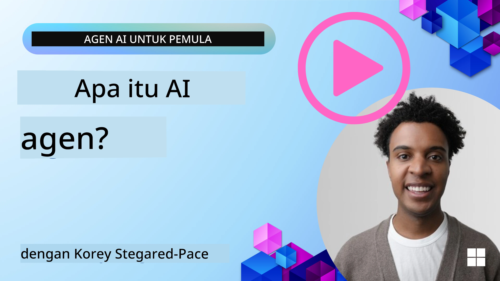
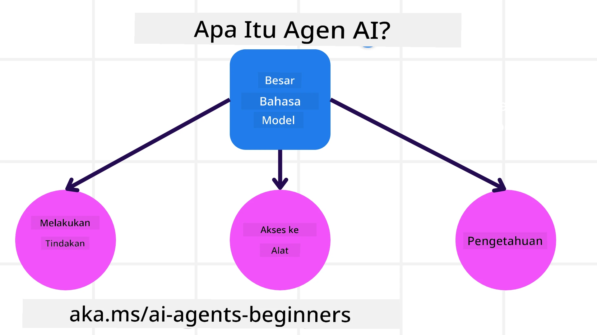
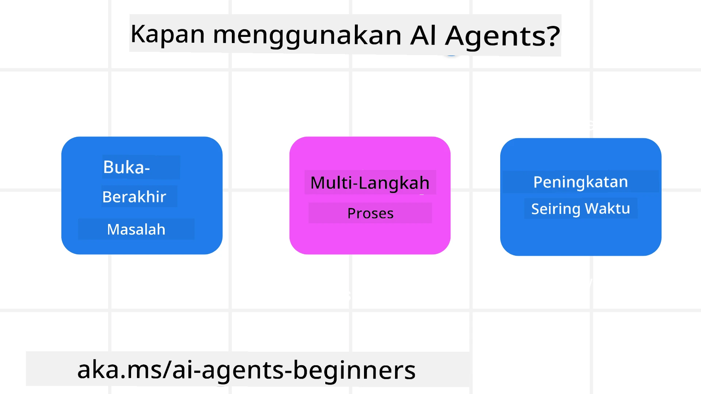

> _(Klik gambar di atas untuk menonton video pelajaran ini)_

# Pengantar Agen AI dan Kasus Penggunaan Agen

Selamat datang di kursus "Agen AI untuk Pemula"! Kursus ini memberikan pengetahuan dasar dan contoh terapan untuk membangun Agen AI.

Bergabung dengan <a href="https://discord.gg/kzRShWzttr" target="_blank">Komunitas Discord Azure AI</a> untuk bertemu pelajar lain dan Pembuat Agen AI serta tanyakan pertanyaan apa pun yang Anda miliki tentang kursus ini.

Untuk memulai kursus ini, kita mulai dengan memahami lebih baik apa itu Agen AI dan bagaimana kita dapat menggunakannya dalam aplikasi dan alur kerja yang kita bangun.

## Pengantar

Pelajaran ini mencakup:

- Apa itu Agen AI dan apa saja jenis-jenis agen?
- Kasus penggunaan apa yang paling cocok untuk Agen AI dan bagaimana mereka dapat membantu kita?
- Apa saja beberapa blok bangunan dasar saat merancang Solusi Agenik?

## Tujuan Pembelajaran
Setelah menyelesaikan pelajaran ini, Anda harus dapat:

- Memahami konsep Agen AI dan bagaimana mereka berbeda dari solusi AI lainnya.
- Menerapkan Agen AI dengan cara yang paling efisien.
- Merancang solusi agenik secara produktif untuk pengguna dan pelanggan.

## Mendefinisikan Agen AI dan Jenis-Jenis Agen AI

### Apa itu Agen AI?

Agen AI adalah **sistem** yang memungkinkan **Model Bahasa Besar (LLMs)** untuk **melakukan tindakan** dengan memperluas kemampuan mereka dengan memberikan akses kepada LLMs ke **alat** dan **pengetahuan**.

Mari kita uraikan definisi ini menjadi bagian-bagian yang lebih kecil:

- **Sistem** - Penting untuk memikirkan agen bukan hanya sebagai satu komponen tetapi sebagai sistem yang terdiri dari banyak komponen. Pada tingkat dasar, komponen Agen AI adalah:
  - **Lingkungan** - Ruang terdefinisi tempat Agen AI beroperasi. Misalnya, jika kita memiliki agen pemesanan perjalanan, lingkungannya bisa berupa sistem pemesanan perjalanan yang digunakan Agen AI untuk menyelesaikan tugas.
  - **Sensor** - Lingkungan memiliki informasi dan memberikan umpan balik. Agen AI menggunakan sensor untuk mengumpulkan dan menafsirkan informasi ini tentang status saat ini dari lingkungan. Dalam contoh Agen Pemesanan Perjalanan, sistem pemesanan dapat memberikan informasi seperti ketersediaan hotel atau harga penerbangan.
  - **Aktuator** - Setelah Agen AI menerima status terkini dari lingkungan, untuk tugas saat ini agen menentukan tindakan apa yang harus dilakukan untuk mengubah lingkungan. Untuk agen pemesanan perjalanan, itu mungkin memesan kamar yang tersedia untuk pengguna.

**Model Bahasa Besar** - Konsep agen ada sebelum munculnya LLM. Keuntungan membangun Agen AI dengan LLM adalah kemampuan mereka untuk menafsirkan bahasa manusia dan data. Kemampuan ini memungkinkan LLM menafsirkan informasi lingkungan dan menentukan rencana untuk mengubah lingkungan.

**Melakukan Tindakan** - Di luar sistem Agen AI, LLM terbatas pada situasi di mana tindakan adalah menghasilkan konten atau informasi berdasarkan prompt pengguna. Di dalam sistem Agen AI, LLM dapat menyelesaikan tugas dengan menafsirkan permintaan pengguna dan menggunakan alat yang tersedia di lingkungan mereka.

**Akses ke Alat** - Alat apa yang dapat diakses oleh LLM didefinisikan oleh 1) lingkungan tempatnya beroperasi dan 2) pengembang Agen AI. Untuk contoh agen perjalanan kita, alat agen dibatasi oleh operasi yang tersedia di sistem pemesanan, dan/atau pengembang dapat membatasi akses alat agen ke penerbangan.

**Memori+Pengetahuan** - Memori bisa bersifat jangka pendek dalam konteks percakapan antara pengguna dan agen. Jangka panjang, di luar informasi yang disediakan oleh lingkungan, Agen AI juga dapat mengambil pengetahuan dari sistem, layanan, alat, dan bahkan agen lain. Dalam contoh agen perjalanan, pengetahuan ini bisa berupa informasi preferensi perjalanan pengguna yang terletak di basis data pelanggan.

### Jenis-jenis Agen

Sekarang kita memiliki definisi umum tentang Agen AI, mari kita lihat beberapa jenis agen spesifik dan bagaimana mereka akan diterapkan pada agen pemesanan perjalanan.

| **Jenis Agen**                | **Deskripsi**                                                                                                                       | **Contoh**                                                                                                                                                                                                                   |
| ----------------------------- | ------------------------------------------------------------------------------------------------------------------------------------- | ----------------------------------------------------------------------------------------------------------------------------------------------------------------------------------------------------------------------------- |
| **Agen Refleks Sederhana**      | Melakukan tindakan segera berdasarkan aturan yang telah ditentukan.                                                                                  | Agen perjalanan menafsirkan konteks email dan meneruskan keluhan perjalanan ke layanan pelanggan.                                                                                                                          |
| **Agen Refleks Berbasis Model** | Melakukan tindakan berdasarkan model dunia dan perubahan pada model tersebut.                                                              | Agen perjalanan memprioritaskan rute dengan perubahan harga signifikan berdasarkan akses ke data harga historis.                                                                                                             |
| **Agen Berbasis Tujuan**         | Membuat rencana untuk mencapai tujuan tertentu dengan menafsirkan tujuan dan menentukan tindakan untuk mencapainya.                                  | Agen perjalanan memesan perjalanan dengan menentukan pengaturan perjalanan yang diperlukan (mobil, transportasi umum, penerbangan) dari lokasi saat ini ke tujuan.                                                                                |
| **Agen Berbasis Utilitas**      | Mempertimbangkan preferensi dan menimbang kompromi secara numerik untuk menentukan bagaimana mencapai tujuan.                                               | Agen perjalanan memaksimalkan utilitas dengan menimbang kenyamanan vs. biaya saat memesan perjalanan.                                                                                                                                          |
| **Agen Pembelajar**           | Meningkat seiring waktu dengan merespons umpan balik dan menyesuaikan tindakan sesuai.                                                        | Agen perjalanan meningkat dengan menggunakan umpan balik pelanggan dari survei pasca-perjalanan untuk membuat penyesuaian pada pemesanan di masa mendatang.                                                                                                               |
| **Agen Hierarkis**       | Menampilkan beberapa agen dalam sistem berlapis, dengan agen tingkat atas memecah tugas menjadi subtugas untuk diselesaikan agen tingkat bawah. | Agen perjalanan membatalkan perjalanan dengan membagi tugas menjadi subtugas (misalnya, membatalkan pemesanan tertentu) dan meminta agen tingkat bawah menyelesaikannya, lalu melaporkan kembali ke agen tingkat atas.                                     |
| **Sistem Multi-Agen (MAS)** | Agen menyelesaikan tugas secara independen, baik secara kooperatif maupun kompetitif.                                                           | Kooperatif: Beberapa agen memesan layanan perjalanan tertentu seperti hotel, penerbangan, dan hiburan. Kompetitif: Beberapa agen mengelola dan bersaing atas kalender pemesanan hotel bersama untuk menempatkan pelanggan ke hotel. |

## Kapan Menggunakan Agen AI

Pada bagian sebelumnya, kita menggunakan kasus penggunaan Agen Perjalanan untuk menjelaskan bagaimana berbagai jenis agen dapat digunakan dalam skenario pemesanan perjalanan yang berbeda. Kita akan terus menggunakan aplikasi ini sepanjang kursus.

Mari kita lihat jenis kasus penggunaan yang paling cocok untuk Agen AI:

- **Masalah Terbuka** - memungkinkan LLM menentukan langkah yang diperlukan untuk menyelesaikan tugas karena tidak selalu dapat di-hardcode ke dalam alur kerja.
- **Proses Multi-Langkah** - tugas yang membutuhkan tingkat kompleksitas di mana Agen AI perlu menggunakan alat atau informasi selama beberapa putaran alih-alih pengambilan satu kali.  
- **Peningkatan Seiring Waktu** - tugas di mana agen dapat meningkat seiring waktu dengan menerima umpan balik dari lingkungannya atau pengguna untuk memberikan utilitas yang lebih baik.

Kami membahas lebih banyak pertimbangan penggunaan Agen AI dalam pelajaran Membangun Agen AI yang Dapat Dipercaya.

## Dasar-Dasar Solusi Agen

### Pengembangan Agen

Langkah pertama dalam merancang sistem Agen AI adalah mendefinisikan alat, tindakan, dan perilaku. Dalam kursus ini, kami fokus pada penggunaan **Azure AI Agent Service** untuk mendefinisikan Agen kami. Layanan ini menawarkan fitur seperti:

- Pemilihan Model Terbuka seperti OpenAI, Mistral, dan Llama
- Penggunaan Data Berlisensi melalui penyedia seperti Tripadvisor
- Penggunaan alat OpenAPI 3.0 yang distandarisasi

### Pola Agenik

Komunikasi dengan LLM dilakukan melalui prompt. Mengingat sifat semi-otonom Agen AI, tidak selalu mungkin atau diperlukan untuk mem-prompt ulang LLM secara manual setelah terjadi perubahan di lingkungan. Kami menggunakan **Pola Agenik** yang memungkinkan kita melakukan prompt terhadap LLM dalam beberapa langkah dengan cara yang lebih skalabel.

Kursus ini dibagi berdasarkan beberapa pola Agenik populer saat ini.

### Kerangka Agenik

Kerangka Agenik memungkinkan pengembang mengimplementasikan pola agenik melalui kode. Kerangka ini menawarkan template, plugin, dan alat untuk kolaborasi Agen AI yang lebih baik. Manfaat ini menyediakan kemampuan untuk observabilitas dan pemecahan masalah yang lebih baik pada sistem Agen AI.

Dalam kursus ini, kita akan mengeksplorasi Microsoft Agent Framework (MAF) untuk membangun agen AI yang siap produksi.

## Contoh Kode

- Python: [Kerangka Agen](./code_samples/01-python-agent-framework.ipynb)
- .NET: [Kerangka Agen](./code_samples/01-dotnet-agent-framework.md)

## Punya Pertanyaan Lain tentang Agen AI?

Bergabung dengan [Microsoft Foundry Discord](https://aka.ms/ai-agents/discord) untuk bertemu dengan pelajar lain, menghadiri jam konsultasi, dan mendapatkan jawaban atas pertanyaan Anda tentang Agen AI.

## Pelajaran Sebelumnya

[Pengaturan Kursus](../00-course-setup/README.md)

## Pelajaran Berikutnya

[Menjelajahi Kerangka Agentik](../02-explore-agentic-frameworks/README.md)

---

<!-- CO-OP TRANSLATOR DISCLAIMER START -->
Penafian:
Dokumen ini telah diterjemahkan menggunakan layanan terjemahan berbasis AI [Co-op Translator](https://github.com/Azure/co-op-translator). Meskipun kami berupaya menjaga ketepatan, harap diingat bahwa terjemahan otomatis mungkin mengandung kesalahan atau ketidakakuratan. Dokumen asli dalam bahasa aslinya harus dianggap sebagai sumber otoritatif. Untuk informasi yang bersifat krusial, disarankan menggunakan terjemahan profesional oleh penerjemah manusia. Kami tidak bertanggung jawab atas kesalahpahaman atau salah tafsir yang timbul dari penggunaan terjemahan ini.
<!-- CO-OP TRANSLATOR DISCLAIMER END -->